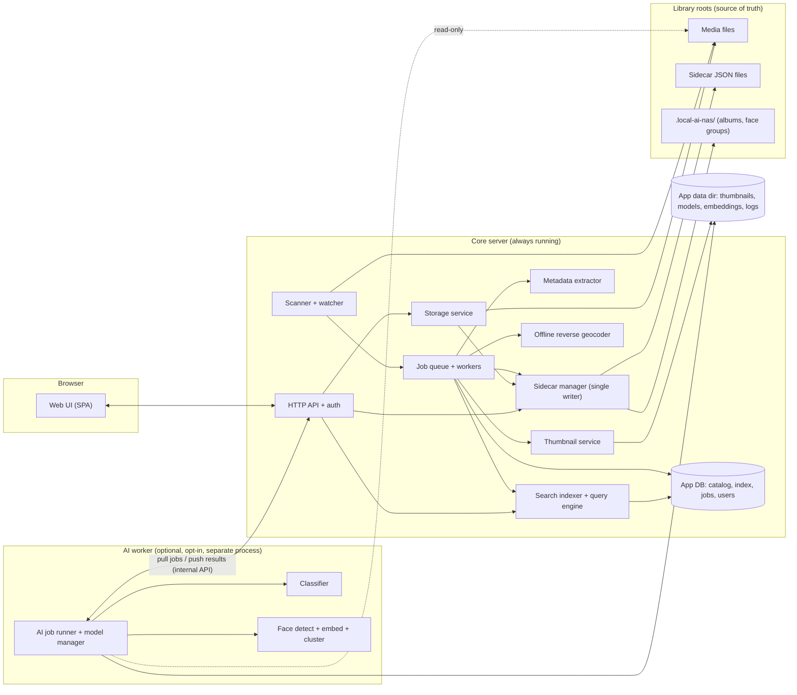
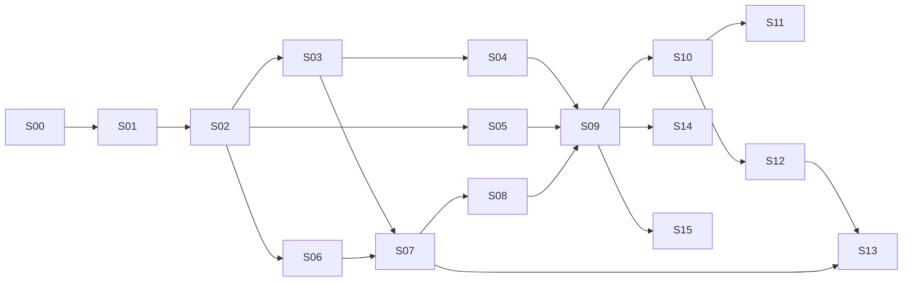

# local-ai-nas: Development Plan

| Field | Value |
|---|---|
| **Version** | 0.1.0 |
| **Status** | Draft, awaiting user review |
| **Last updated** | 2026-09-23 (session S001) |
| **Source of vision** | `README.md` (repository root) |

> **This is a living document.** It changes as the user gives feedback. Every change follows `code-agent-docs/RULES.md` **R4**: previous versions are archived in `code-agent-docs/archive/plan-history/`, the version number is bumped, and a revision history entry is added (section 14).
>
> Everything in this draft that names a technology, a data format, or an architecture is a **proposal**. Nothing is decided until the user approves it. Each approval becomes an ADR in `code-agent-docs/decisions/` (R5).

---

## Contents

1. Project overview
2. Goals and non-goals
3. Requirements
4. Assumptions
5. Open questions for the user
6. Proposed high-level architecture
7. Technology stack options
8. Key technical concerns
9. Development methodology
10. Stage roadmap
11. MVP definition
12. Testing strategy
13. Risks and mitigations
14. Revision history

---

## 1. Project overview

**local-ai-nas** is a self-hosted network-attached storage application. It runs on the user's own hardware and serves files to devices on the local network through a web interface. On top of basic file storage it adds a Google Photos–style photo library: a timeline, albums, and a photo viewer. It extracts EXIF metadata such as capture time, camera, and GPS, and turns GPS coordinates into place names offline.

Metadata for every photo lives in a **sidecar JSON file next to the photo** (`IMG_0001.jpg` → `IMG_0001.jpg.json`). These sidecars are the **source of truth**. Any database or search index the application builds is a disposable cache that can be rebuilt from the sidecars at any time. The user's metadata therefore stays portable and readable without the application.

An **optional, opt-in, fully local AI** layer can analyze photos once, at processing time. It does two things. First, it tags photos by content (receipt, document, food, pet, screenshot, and so on). Second, it detects faces and groups the same person across photos, so the user can name the group and browse it. AI results are written into the sidecars, so search never needs the AI model to run.

**Search** runs over the stored metadata. It is forgiving: it matches word forms (`receipts` → `receipt`), synonyms (`receipts` → `invoice`, `bill`), and typos (`reciept`). It also supports operators such as `before:2026`, `place:karachi`, `face:"Mom"`, and `type:video`, combined with free text.

Guiding principles: local-first, no telemetry, no cloud dependencies, AI strictly opt-in, portable open metadata.

---

## 2. Goals and non-goals

### Goals
- **G1:** A dependable LAN file store with a web UI: browse, upload, download, and organize files in folders the user already has.
- **G2:** A photo library experience comparable to the core of Google Photos: timeline, albums, viewer, metadata, and place names.
- **G3:** Portable metadata: one human-readable, versioned sidecar JSON per media file. The source of truth is on disk next to the file, never locked in a database.
- **G4:** Fast, forgiving search over metadata, with word forms, synonyms, typo tolerance, and operators, that works with AI turned off.
- **G5:** Optional local AI for content tagging and face grouping that runs on CPU-only, modest hardware. Results are persisted so the AI runs once per photo.
- **G6:** Privacy by design: no outbound network traffic at runtime unless the user explicitly enables a feature that needs it (e.g. downloading an AI model).
- **G7:** Simple deployment: one command with Docker Compose. Native installs come later.
- **G8:** Data safety: originals are never altered by background processing, sidecar writes are atomic, and the index can always be rebuilt.

### Non-goals (at least for now)
- **NG1:** Cloud sync, cloud backup, or any hosted/SaaS component.
- **NG2:** Native mobile apps and automatic phone backup (the web UI works in mobile browsers). _See Q21._
- **NG3:** Photo editing (crop, filters, adjustments), and writing metadata back into original files (EXIF/XMP). _See Q19._
- **NG4:** Video transcoding. Only browser-playable formats play inline in the MVP; others are download-only. _See Q8._
- **NG5:** Public-internet exposure features (built-in dynamic DNS, public sharing links). Remote access relies on the user's VPN or reverse proxy. _See Q3._
- **NG6:** Implementing SMB/NFS/AFP servers inside the app. The host OS provides network shares; the app watches the folders. _See Q20._
- **NG7:** Running AI at search time, and any cloud AI API.
- **NG8:** RAID, disk management, snapshots, or replication. These belong to the host OS or filesystem.
- **NG9:** OCR of document text, image captioning, and generative features in the first releases. They are possible later additions.

---

## 3. Requirements

Priorities: **Must** (required for the release that contains its stage), **Should** (important, can slip one stage), **Could** (nice to have, backlog). Requirement IDs are permanent. New requirements get new numbers, and retired ones are marked "Withdrawn", never reused.

### 3.1 Functional requirements

#### NAS file storage

| ID | Requirement | Priority |
|---|---|---|
| FR-001 | The admin can configure one or more **library roots** (existing folders on the host). The app works on them **in place** and preserves the user's folder structure. | Must |
| FR-002 | Browse library folders and files in the web UI (list and grid views, sorting, breadcrumbs). | Must |
| FR-003 | Upload files, including multiple files and whole folders, from the browser into a chosen folder. | Must |
| FR-004 | Resumable, chunked uploads for large files (multi-GB videos) that survive a network interruption. | Should |
| FR-005 | Download single files, with HTTP range support for resumable downloads and video seeking. | Must |
| FR-006 | Download multiple files or a folder as a streamed ZIP archive. | Should |
| FR-007 | File operations: create folder, rename, move, copy, delete. | Must |
| FR-008 | Trash/recycle bin: deleted items can be restored until a configurable retention period expires. | Should |
| FR-009 | App-provided network file-sharing protocols (SMB and/or WebDAV). | Could |

#### Photo and media management

| ID | Requirement | Priority |
|---|---|---|
| FR-010 | **Ingest pipeline** for every supported media file: compute a content hash, extract metadata (capture date/time with timezone offset, camera make/model, lens, GPS, orientation, dimensions, duration for video), and create the sidecar. | Must |
| FR-011 | Date fallback when EXIF has no capture date (date patterns in the filename, then file modification time). The sidecar records which source was used. | Should |
| FR-012 | Thumbnail and preview generation (at least a grid size and a viewer size), stored as a rebuildable cache. | Must |
| FR-013 | **Timeline view**: all media in reverse chronological order, grouped by day/month, with smooth virtualized scrolling over large libraries. | Must |
| FR-014 | **Viewer**: full-screen, next/previous, zoom, metadata panel (date, camera, place, tags, faces), download. | Must |
| FR-015 | Edit a media item's description and user tags. Changes persist to the sidecar. | Must |
| FR-016 | **Albums**: create, rename, delete. Add and remove items. One item can belong to many albums. Album view. | Must |
| FR-017 | Support common image formats: JPEG, PNG, WebP, GIF. | Must |
| FR-018 | Support HEIC/HEIF images (iPhone photos). | Should |
| FR-019 | Basic **video** support: catalog, metadata, poster-frame thumbnail, inline playback of browser-compatible formats (no transcoding). | Should |
| FR-020 | RAW image formats (thumbnails via embedded preview, metadata). | Could |
| FR-021 | Multi-select and bulk actions (add to album, tag, download, delete). | Should |
| FR-022 | Duplicate detection by content hash. | Could |

#### Sidecar JSON metadata

| ID | Requirement | Priority |
|---|---|---|
| FR-023 | Every media file has a sidecar JSON named `<full original filename>.json` next to it (e.g. `IMG_0001.jpg.json`), as specified in README. | Must |
| FR-024 | The sidecar schema is versioned (`schemaVersion`), documented as a JSON Schema in the repository, and validated on every read and write. | Must |
| FR-025 | Sidecars are the **source of truth**. The catalog and search index are caches that can be fully rebuilt from sidecars through a "rebuild index" command. | Must |
| FR-026 | Sidecars follow their media through app file operations (rename, move, copy, delete, trash, restore). | Must |
| FR-027 | Detect changes made **outside the app** (files added, modified, deleted, renamed; sidecars edited by hand) with a file watcher plus periodic reconciliation, and update the catalog. | Must |
| FR-028 | Re-associate sidecars with media that was moved or renamed outside the app, matching on content hash. Apply a defined policy for orphaned sidecars that never deletes silently. | Should |
| FR-029 | Automatic, tested **migrations** upgrade older sidecars to the current `schemaVersion`. | Must |
| FR-030 | Preserve unknown fields in sidecars. Detect foreign JSON files that use the same naming (e.g. Google Takeout's `IMG_0001.jpg.json`) and never overwrite them. | Must |

#### Optional local AI: classification

| ID | Requirement | Priority |
|---|---|---|
| FR-031 | AI is **opt-in and off by default**. Classification and face features have separate toggles in settings. | Must |
| FR-032 | **Model management**: models are obtained only on explicit user action (download with checksum verification, or manual placement for offline installs). Each model's name, version, and license is shown to the user. | Must |
| FR-033 | Content **classification** produces tags with confidence scores. They are written to the sidecar together with the model name@version and a processing timestamp. | Must |
| FR-034 | A default label set covering at least `receipt`, `document`, `screenshot`, `food`, `landscape`, `pet`, `people`, `vehicle`, `building`, `text`. Labels and confidence thresholds are configurable. | Should |
| FR-035 | AI runs **once per item, in the background, after ingest**, and never at search time. | Must |
| FR-036 | **Backfill**: when AI is enabled on an existing library, all items are processed in the background with visible progress and pause/resume. | Must |
| FR-037 | **Re-processing** when the configured model or version changes, or on demand (per item, per folder, whole library). | Should |
| FR-038 | Users can remove or reject an AI tag, and rejected tags stay rejected when the item is re-processed. | Should |

#### Optional local AI: faces

| ID | Requirement | Priority |
|---|---|---|
| FR-039 | **Face detection** with bounding boxes. A photo can contain many faces. | Must |
| FR-040 | **Face grouping**: compute a face embedding per face, cluster similar faces into groups, and group each face independently. New photos are assigned incrementally to existing groups. | Must |
| FR-041 | **People view**: list face groups with a cover face, and open a group to browse its photos. | Must |
| FR-042 | Name and rename a face group. | Must |
| FR-043 | Merge face groups. | Must |
| FR-044 | Correct assignments: remove a face from a group, move it to another group, split a group. | Should |
| FR-045 | Hide or ignore a face group (e.g. strangers). | Could |
| FR-046 | **Delete all face data** (sidecar face sections, embeddings, groups) in one action. | Should |

#### Search

| ID | Requirement | Priority |
|---|---|---|
| FR-047 | Free-text search across file name, description, place, date/time, AI tags, user tags, and face group names. | Must |
| FR-048 | **Word-form normalization** (plurals and inflections), e.g. `receipts` → `receipt`. | Must |
| FR-049 | **Typo tolerance**, e.g. `reciept` → `receipt`. | Must |
| FR-050 | **Synonym and related-term expansion** from a local, user-editable dictionary, e.g. `receipts` → `invoice`, `voucher`, `bill`. | Must |
| FR-051 | Relevance ranking: exact > word form > synonym > typo match. Results can also be sorted by date. | Should |
| FR-052 | Search works fully **without the AI worker installed or running**. | Must |
| FR-053 | Results appear in the standard grid with pagination/infinite scroll and open in the viewer. | Must |
| FR-054 | Optional **semantic search** with local embeddings (e.g. text-to-tag similarity or CLIP text-to-image), only when AI is enabled. | Could |
| FR-055 | Autocomplete suggestions for operators, tags, places, and people. | Could |

#### Search operators

| ID | Requirement | Priority |
|---|---|---|
| FR-056 | Operators `before:`, `after:`, `on:`, `place:`, `tag:`, `face:`, `type:` as listed in README. | Must |
| FR-057 | Date operators accept `YYYY`, `YYYY-MM`, `YYYY-MM-DD` with documented semantics (_see Q14_). | Must |
| FR-058 | Operators combine with free text (implicit AND). Quoted values (`face:"Mom"`) are supported, and operator names are case-insensitive. | Must |
| FR-059 | Malformed or unknown operators are handled gracefully: treated as free text, with a hint in the UI. | Should |
| FR-060 | Negation (`-tag:screenshot`) and `OR`. | Could |
| FR-061 | Additional operators, e.g. `album:`, `camera:`, `name:`. | Could |

#### Places

| ID | Requirement | Priority |
|---|---|---|
| FR-062 | **Offline reverse geocoding**: GPS coordinates → place (city, region, country) at ingest, stored in the sidecar. No network calls. | Must |
| FR-063 | `place:` and free text match any place level (city, region, country), including common alternate names (e.g. `Bombay` → `Mumbai`). | Must |

#### Users, access, and administration

| ID | Requirement | Priority |
|---|---|---|
| FR-064 | **Authentication** for the web UI and API. An admin account is created on first run, and there is no default password. | Must |
| FR-065 | Multiple user accounts with roles/permissions and per-user access to library roots (README roadmap item). | Could |
| FR-066 | Settings UI: library roots, AI toggles, model selection, thresholds, rescan, rebuild index. | Should |
| FR-067 | Background job visibility: queue status, progress, errors. | Should |
| FR-068 | Command-line admin tools: rescan, rebuild-index, migrate sidecars, reset admin password. | Should |

### 3.2 Non-functional requirements

| ID | Requirement | Priority |
|---|---|---|
| NFR-001 | **Local-only and private**: no telemetry, no cloud dependencies, no outbound network calls at runtime unless the user explicitly enables a feature that needs one (e.g. model download). No web fonts, CDNs, or remote assets in the UI. | Must |
| NFR-002 | **AI opt-in and isolated**: the NAS is fully functional with AI disabled or not installed. AI runs in a separate process that can be installed separately. AI failures cannot crash or block the core. | Must |
| NFR-003 | **Performance at scale** (proposed targets, validated on reference hardware, _see Q1/Q18_): with 100,000 media items, search p95 ≤ 300 ms, timeline page load p95 ≤ 500 ms, reconciliation of an unchanged library ≤ 5 min, full index rebuild from sidecars ≤ 15 min (excluding thumbnails and AI). | Should |
| NFR-004 | **CPU-only, modest hardware**: the core runs on a 4-core CPU with 4 GB RAM (proposed). AI runs CPU-only by default with bounded memory (target ≤ 2 GB extra). | Must |
| NFR-005 | Optional GPU acceleration for AI. | Could |
| NFR-006 | **Data integrity**: background processing never modifies original media, and only explicit user file operations change them. Sidecar writes are atomic: after a crash, each sidecar holds either the old or the new version, never a partial one. | Must |
| NFR-007 | **Metadata portability**: sidecars are UTF-8 JSON with a published schema and readable without the app. No photo metadata exists only in the database. | Must |
| NFR-008 | **Ease of deployment**: one command (`docker compose up`) with sensible defaults and a first-run setup flow. | Must |
| NFR-009 | **Platforms**: Linux x86-64 and ARM64 (Must, via Docker). Native Windows and macOS installs (Should, later stage, _see Q5_). | Must |
| NFR-010 | **Security**: authentication on every endpoint, Argon2id password hashing, secure session cookies, CSRF protection, strict confinement of file access to library roots (path-traversal-proof), rate-limited login. HTTPS through a documented reverse-proxy setup. | Must |
| NFR-011 | **Face data privacy**: face data is biometric. It stays local, has its own opt-in, can be fully deleted (FR-046), and is never exported unless the user explicitly requests it. | Must |
| NFR-012 | **Resilient background processing**: a persistent job queue that resumes after restart, retries with backoff, runs jobs by priority, and is throttled so the UI stays responsive. | Must |
| NFR-013 | **Licensing**: every dependency and every AI model weight has a license compatible with the project license (_see Q22_), recorded in the stage document or ADR that adds it. | Must |
| NFR-014 | **Maintainability**: automated tests, linting, formatting, and CI for every stage. Architecture documented. | Must |
| NFR-015 | **Usable UI**: responsive on phone browsers, keyboard navigation, accessible contrast and labels. | Should |
| NFR-016 | **Observability**: local structured logs with rotation. No external reporting. | Should |
| NFR-017 | **Upgrade safety**: database and sidecar migrations are automatic, tested, idempotent, and non-destructive. Backup guidance is documented. | Must |
| NFR-018 | **Reproducible AI results**: model name@version is recorded with every result, and preprocessing is deterministic. | Should |

---

## 4. Assumptions

These fill gaps in README. Each can be overturned by the user, and several link to open questions.

- **A1:** One household on a trusted LAN. The first releases have a single admin account, and multi-user support comes later (Q2).
- **A2:** The browser web UI is the only client. There is no native mobile or desktop app (NG2).
- **A3:** The app operates **in place** on existing folders ("library roots") and never imposes its own folder layout (Q9).
- **A4:** The app **never modifies original media files** except through explicit user file operations (rename, move, delete). Metadata edits go to sidecars only (Q19).
- **A5:** Sidecars live next to the media, as README says, so the app needs **write access** to library folders (Q9).
- **A6:** Derived data (thumbnails, catalog/search database, job queue, face embeddings, logs, downloaded models) lives in a separate **app data directory**. It is a cache that can be rebuilt, except app settings and user accounts, which must be backed up.
- **A7:** Library-wide metadata that belongs to no single photo (albums, the face-group registry, user synonym additions) is stored as JSON in a hidden folder `<library root>/.local-ai-nas/`, so it stays portable with the library (Q13).
- **A8:** Sidecars and search cover **media files** (images and videos). Other files are stored, browsed, and downloaded but have no sidecars in the MVP (Q12).
- **A9:** Capture times are stored in ISO 8601 with the original UTC offset when EXIF provides one (`OffsetTimeOriginal`). Otherwise a configured default timezone applies, and the sidecar records that the offset was assumed.
- **A10:** English is the language of the UI, the tag labels, and the synonym dictionary in the first releases (Q15).
- **A11:** AI model weights are **not bundled**. They are downloaded once when the user opts in, or placed manually for air-gapped installs (FR-032).
- **A12:** Performance is planned for a reference library of **100,000 media items** (Q18).
- **A13:** The primary deployment target is **Docker on Linux (x86-64 and ARM64)**. Native installs come later (Q5).
- **A14:** The draft sidecar schema in README is a starting point. Field names and structure are finalized in a sidecar-schema ADR before any sidecar is written (S02).
- **A15:** The GitHub repository (`origin`, branches `main` and `develop`) is the project home, and CI will use GitHub Actions (Q24).
- **A16:** Development happens on the user's Windows 11 machine, so the development tooling must work on Windows as well as on Linux CI.

---

## 5. Open questions for the user

Each question lists the stage that needs the answer and the agent's recommendation. **Questions marked ★ are needed before Stage 0 can be planned in detail.**

1. ★ **Target host and hardware.** Which machine will run the server (old PC or mini-PC, Raspberry Pi 5, Synology/Unraid/TrueNAS, this Windows 11 PC)? What CPU architecture, RAM, and storage does it have? _Needed by: S00 (performance targets, Docker images)._ _Recommendation: plan for Linux x86-64 + ARM64, ≥ 4 cores, ≥ 4 GB RAM (8 GB with AI)._
2. **Single-user or multi-user?** Is it one account for the household, or separate accounts with private libraries? Must login be required from day one? _Needed by: S01._ _Recommendation: one admin login from S01; multi-user in S14._
3. **Remote access beyond the LAN?** Do you want access from outside the home network? _Needed by: S01 (security model)._ _Recommendation: LAN-only in the app. Document VPN (Tailscale/WireGuard) or a reverse proxy with HTTPS._
4. ★ **Preferred languages and frameworks.** Do you have preferences or skills you want the code to use, since you will review it? _Needed by: S00._ _Recommendation: see section 7 (Python backend + React/TypeScript frontend)._
5. ★ **Deployment method.** Docker, native, or both, and which first? Must native Windows be supported? _Needed by: S00._ _Recommendation: Docker Compose first, native Linux next, native Windows/macOS in a later stage._
6. **AI hardware and speed expectations.** What is the minimum machine for AI, and what processing speed is acceptable (e.g. "backfilling 50,000 photos overnight is fine")? _Needed by: S10._
7. **GPU support.** None, NVIDIA CUDA, Intel iGPU (OpenVINO), AMD, or Apple? _Needed by: S10._ _Recommendation: CPU-only first. ONNX Runtime lets GPU execution providers be added later without code redesign._
8. **Supported media types.** HEIC? RAW (which cameras)? Video, and which formats? Is inline playback of browser-native formats enough, or is transcoding needed? What about Live/Motion Photos? _Needed by: S02/S03._ _Recommendation: MVP = JPEG/PNG/WebP/GIF + HEIC + browser-playable video, without transcoding. RAW later._
9. **Existing library and storage.** Will you point the app at existing photo folders (in place) or have it manage a new folder? Are any folders read-only or on network mounts (SMB/NFS)? Sidecars need write access next to the files. _Needed by: S01/S02._ _Recommendation: in place, with a writable library._
10. **Files moved, renamed, or deleted outside the app.** What should happen to their sidecars? _Needed by: S05._ _Recommendation: detect with watcher + periodic rescan and re-associate by content hash. Move orphaned sidecars to `.local-ai-nas/orphans/` after a grace period. Never delete them silently._
11. **Sidecar naming collision.** Google Photos Takeout, among other tools, also writes `<name>.json` next to photos, with a different format. Options: (a) keep README naming, add an identifying marker field, and detect/skip foreign files (**recommended**); (b) use a namespaced name such as `IMG_0001.jpg.lan.json`. Also: should the app import metadata from Google Takeout JSON? _Needed by: S02._
12. **Non-media files.** Should PDFs, documents, and other files get sidecars and search, or only browse/download? _Needed by: S02._ _Recommendation: browse/download only in the MVP; filename search for all files later._
13. **Where do albums and face groups live?** Options: (a) library-level JSON files in `<library root>/.local-ai-nas/` (**recommended** for albums and the face-group registry); (b) fields inside each sidecar only. For faces: keep README's `groupName` copied into each sidecar (portable, but renaming a group rewrites many sidecars in a background job), or store only `groupId` in sidecars? _Needed by: S04 (albums), S12 (faces)._ _Recommendation: keep `groupName` in sidecars as README shows, with the registry as the authority._
14. **Date operator semantics.** Does `after:2025` mean "2026 onward" (strictly after the named period; **recommended**, because it matches the plain words and `on:2025` covers "during 2025"), or does it include 2025? Dates are compared on the photo's local capture time (**recommended**) rather than UTC. _Needed by: S07._
15. **Languages for search and tags.** English only, or should Urdu (or other languages) work for synonyms, tags, and place names? _Needed by: S08 (synonyms), S11 (labels)._
16. **Face model licensing.** The most accurate common face models (InsightFace) are licensed for **non-commercial research only**. Options: permissive models by default (YuNet + SFace, lower accuracy) with InsightFace as an optional user-downloaded pack. Will this project ever be distributed or used commercially? _Needed by: S12._
17. ★ **MVP scope.** Is a first release **without AI** (stages S00–S09) acceptable, or must AI classification be in the first usable release? _Needed by: S00 (roadmap order)._ _Recommendation: MVP without AI (section 11)._
18. ★ **Library size.** Roughly how many photos and videos, and how many GB, do you have now, and how fast is it growing? _Needed by: S00 (performance targets)._
19. **Writing into originals and XMP interop.** Should the app ever write metadata into original files (EXIF/XMP), or export XMP sidecars for digiKam/Lightroom? _Recommendation: never write originals. XMP export could come later._
20. **Network file sharing.** Should the app provide SMB/WebDAV itself, or does the host OS handle shares while the app watches the folders? _Needed by: S01 scope._ _Recommendation: the host OS handles SMB (NG6)._
21. **Mobile auto-backup.** Is automatic phone photo backup (like the Google Photos app) wanted? _Recommendation: out of scope for now. Mobile browser upload works._
22. ★ **Project license.** MIT, Apache-2.0, GPL-3.0, or AGPL-3.0? The choice constrains which dependencies and models can be used. AGPL-3.0 is common for self-hosted apps because it keeps forks open. _Needed by: S00._
23. ★ **Git commit preferences.** May the agent commit on its own? In which style (Conventional Commits per R7)? Which branching model (work on `develop` and merge to `main`? feature branches? pull requests)? May the agent push to `origin`? _Asked directly in S001._
24. ★ **CI.** Is GitHub Actions on `github.com/KhizirFarrukh/local-ai-nas` acceptable for CI? _Needed by: S00._

---

## 6. Proposed high-level architecture

> **Proposal, not decided.** Component boundaries are intended to survive any stack choice in section 7.

### 6.1 Components

| Component | Responsibility |
|---|---|
| **Web UI** | Single-page app in the browser: file browser, timeline, albums, viewer, search, people, settings. Talks only to the HTTP API. |
| **HTTP API** | REST/JSON API plus server-sent events for job progress. Handles authentication and sessions, and serves media and thumbnails with range support and caching headers. |
| **Storage service** | Owns library roots. Confines every path to them (path-traversal-proof). Handles file operations, uploads (chunked/resumable), downloads, streamed ZIP, and trash. |
| **Sidecar manager** | **The only writer of sidecars.** Reads, validates, migrates, and writes with atomic temp-file + rename and per-file locking. Merges updates by section ownership. Preserves unknown fields and detects foreign JSON files. |
| **Scanner and watcher** | Watches library roots for filesystem events and runs periodic full reconciliation (event delivery is unreliable on network mounts and Docker bind mounts). Emits ingest, update, move, and delete jobs. |
| **Job queue and workers** | Persistent, prioritized queue with retries and throttling. Job types include hash, metadata extraction, thumbnail, geocode, index update, AI classify, AI faces, sidecar bulk rewrite, and migration. |
| **Metadata extractor** | Reads EXIF/XMP/QuickTime metadata from images and videos. |
| **Thumbnail service** | Generates grid and preview renditions (and video poster frames) into the app-data cache, keyed by content hash. |
| **Reverse geocoder** | Offline lookup from GPS coordinates to city, region, and country, using a bundled dataset. |
| **Search indexer and query engine** | Maintains a search index projected from sidecars. Parses the operator syntax. Applies normalization, stemming, synonym expansion, and typo tolerance. Ranks results. |
| **App database** | Catalog cache (paths, hashes, projected metadata), search index, job queue, users, sessions, settings. Everything except users and settings can be rebuilt from sidecars. |
| **AI worker (optional)** | **A separate process** or container, present only if the user opts in. It pulls AI jobs from the core over an internal API, reads media read-only, runs models (classification, face detection and embedding), and returns results. The core writes the results to sidecars through the sidecar manager, so sidecars keep a single writer. Face clustering runs here. If the worker is absent or crashed, the NAS keeps working. |
| **Model manager** | Part of the AI worker. Downloads models on explicit user action, verifies checksums, records license and version. |

### 6.2 Diagram

### 6.3 Key flows

- **Ingest:** a file appears (upload or external copy) → the scanner/watcher enqueues `ingest` → the worker hashes it and extracts metadata → the geocoder resolves the place → the sidecar manager writes the sidecar atomically → the index updates → thumbnails generate. If AI is enabled, `ai.classify` and `ai.faces` jobs are enqueued at low priority.
- **Search:** the query string goes to the parser, which splits it into free-text terms and operator filters. Text terms are normalized, stemmed, synonym-expanded, and typo-corrected. The query engine combines the text match with structured filters (dates, type, place, tag, face) against the index, ranks the results, and returns a paginated list. The AI worker is not involved.
- **AI:** the AI worker pulls a job → runs the model → posts the results → the core validates them, the sidecar manager merges them into the `ai` section, and the index updates. For faces, embeddings go to the app-data embedding store, clustering assigns group IDs, and the sidecars record box, group ID, and group name.
- **External change:** a watcher event or the periodic reconciliation detects a new, changed, missing, or moved file → re-ingest, update, re-associate by hash, or mark the sidecar orphaned, according to the policy (Q10).

### 6.4 Data ownership

| Data | Location | Rebuildable? |
|---|---|---|
| Media files | Library roots | No (user data) |
| Per-item metadata (EXIF-derived, description, user tags, AI tags, faces, place) | Sidecar JSON next to the media | No: **source of truth** |
| Albums, face-group registry, user synonym additions | `<library root>/.local-ai-nas/*.json` (proposal, Q13) | No: source of truth |
| Catalog cache, search index, job queue | App DB (app data dir) | Yes, from sidecars |
| Thumbnails and previews | App data dir | Yes, from media |
| Face embeddings | App data dir | Yes, by re-running face AI (group assignments survive in sidecars) |
| Users, sessions, app settings | App DB / config file | No: back up |
| Downloaded AI models | App data dir | Yes, by re-downloading |

---

## 7. Technology stack options

> **Nothing here is decided.** Each layer lists options, trade-offs, and a recommendation. After the user approves, each decision is recorded as an ADR in S00 (R5). All licenses named below must be verified in the ADR that adopts them (R6).

### 7.1 Backend (core server)

| Option | Pros | Cons |
|---|---|---|
| **A. Python 3.12+ with FastAPI** | One language for core and AI worker, so the sidecar schema models (Pydantic) and the job contract are shared. Best AI/imaging ecosystem. Fast to develop. Strong typing via Pydantic + mypy/pyright. | Slower CPU-bound work (mitigated by native libraries like libvips and SQLite, and by process pools). Native Windows/macOS packaging is harder than a single binary. Higher idle RAM than Go. |
| **B. Go** (core) + Python (AI worker) | Single static binary, easy cross-compilation, excellent concurrency and file serving, low RAM. Ideal for native installs. | Two languages. The sidecar schema and job contract must be kept in sync across languages (JSON Schema + codegen). Weaker imaging/metadata libraries (cgo for libvips, or shelling out). |
| **C. TypeScript / Node.js** (Fastify or NestJS) + Python AI worker | Same language as the frontend. `sharp` (libvips) for thumbnails. Proven by similar projects. | Two languages again. Heavier runtime than Go. CPU-bound work needs worker threads. |
| **D. Rust** (Axum) | Best performance and safety, single binary. | Slowest development velocity. Steeper learning curve for contributors and reviewers. |

**Recommendation: A (Python + FastAPI)** for the core and the AI worker, as two separate processes and packages that share a small common library (schema models, job contract). The core's AI-free dependency set stays lean. This gives the fastest route to a working, well-tested product, and the performance of a single-household NAS is dominated by I/O, SQLite, and libvips, not Python. **Revisit B (Go core)** if native single-binary installs become a top priority (Q5).

### 7.2 Frontend

| Option | Pros | Cons |
|---|---|---|
| **A. React + TypeScript + Vite** (TanStack Query/Virtual, PhotoSwipe lightbox) | Largest ecosystem for virtualized photo grids, lightboxes, and drag-and-drop. Widely known, easy to review and hire for. | Larger bundles and more boilerplate than Svelte. |
| **B. SvelteKit** (static SPA adapter) + TypeScript | Small, fast bundles and less boilerplate. Proven in similar photo apps. | Smaller ecosystem. Fewer ready-made components. |
| **C. Server-rendered HTML + HTMX/Alpine.js** | Minimal JavaScript, simple stack. | A poor fit for a highly interactive timeline (virtual scroll, multi-select, lightbox, drag-select). Would fight the tool. |

**Recommendation: A (React + TypeScript + Vite)**, built to static files and served by the core. B is a close and equally valid alternative if you prefer Svelte.

### 7.3 App database, search index, and job queue

| Option | Pros | Cons |
|---|---|---|
| **A. SQLite (WAL) + FTS5**, with an in-app query layer (Snowball stemming, synonym expansion, SymSpell/trigram typo tolerance) | Embedded, zero-ops, single file, trivially rebuildable. One engine for structured filters (dates, type, place) and text. Tiny footprint. Public domain. | Typo tolerance, synonyms, and ranking must be built and tuned in-app. |
| **B. Tantivy** (embedded Lucene-like engine via Python bindings) + SQLite for the catalog | Built-in fuzzy term queries and stemming, BM25 ranking, very fast. MIT. | Two stores to keep consistent. Python bindings less mature. Synonyms still in-app. |
| **C. Meilisearch** (separate search server) + SQLite for the catalog | Typo tolerance, synonyms, filters, and ranking out of the box, with excellent search quality. MIT core. | An extra service to run and upgrade. More RAM on big indexes. Harder for native installs. |
| **D. PostgreSQL** (tsvector + pg_trgm) | Robust, powerful full-text and trigram search. | A heavy extra service for a home NAS. Overkill for a single user. |

**Recommendation: A (SQLite + FTS5 + in-app query layer)** behind a `SearchEngine` interface, so C (Meilisearch) can be swapped in if quality or effort disappoints. **Job queue:** a SQLite-backed queue table (no Redis or broker), which keeps the stack to a single data file.

### 7.4 Media processing libraries (core)

| Concern | Options | Recommendation |
|---|---|---|
| Metadata extraction | **ExifTool** (external Perl tool, persistent `-stay_open` process; broadest coverage including HEIC, RAW, video) vs pure-Python readers (Pillow/exifread for images + ffprobe for video; fewer dependencies, narrower coverage) | ExifTool, because coverage matters for EXIF offsets, HEIC, and video. Pure Python as fallback. |
| Thumbnails | **libvips** (pyvips; fast, low memory, LGPL-2.1) vs Pillow (permissive, simpler, slower, more RAM) | libvips, with Pillow as fallback. |
| HEIC | libheif (via pyvips or pillow-heif) | Adopt in S03 **after license review** (codec licensing). |
| Video | **ffmpeg/ffprobe** as an external binary (poster frames, metadata) | Invoke as a separate process. Pick a build whose license is compatible with the project license. |
| File watching | watchdog (Apache-2.0) + periodic reconciliation | As stated. |

### 7.5 AI runtime and models (optional AI worker)

**Runtime**

| Option | Pros | Cons |
|---|---|---|
| **A. ONNX Runtime** (CPU by default; CUDA / DirectML / OpenVINO / CoreML execution providers later) | Small install (no PyTorch), fast on CPU, portable, GPU-ready without code changes. MIT. | Models must be exported or obtained in ONNX format. |
| **B. PyTorch** | Every model is available natively. | Multi-GB install, heavier CPU inference, bad fit for modest hardware. |
| **C. OpenVINO** directly | Very fast on Intel CPUs and iGPUs. | Vendor-specific. |

**Recommendation: A (ONNX Runtime).**

**Content classification models**

| Option | Pros | Cons |
|---|---|---|
| **A. CLIP-family zero-shot** (e.g. OpenCLIP ViT-B/32, SigLIP base) | Open vocabulary: labels are text prompts, so users can add `receipt`, `whiteboard`, and so on without retraining. The same embeddings enable semantic search later (FR-054). ~100–300 ms per image on a modern CPU (to be measured). | Zero-shot accuracy varies by label and needs per-label thresholds and prompt tuning. |
| **B. Fixed-label CNN classifier** (MobileNet/EfficientNet, ImageNet classes) | Very fast and small. | The ImageNet label set lacks `receipt`, `screenshot`, and `document`, so it doesn't fit the use case without fine-tuning. |
| **C. Small vision-language/captioning model** (e.g. Florence-2, Moondream) | Rich captions and descriptions, good for documents. | Seconds per image on CPU. Large. Hard to backfill big libraries on modest hardware. |

**Recommendation: A**, with a curated label set, prompt ensembles, and per-label thresholds, plus cheap heuristics (e.g. screenshots: no camera EXIF + screen-sized dimensions). C is a later "Could".

**Face detection and recognition models**

| Option | Pros | Cons |
|---|---|---|
| **A. YuNet (detector) + SFace (recognizer)**, from OpenCV Zoo | Permissive licenses (MIT / Apache-2.0, to verify), very light, CPU-friendly. | Recognition accuracy below state of the art, so more manual merging. |
| **B. InsightFace** (SCRFD detector + ArcFace recognizer, e.g. `buffalo_l`) | State-of-the-art accuracy, widely used in self-hosted photo apps. | **Pretrained weights are for non-commercial research use only.** Heavier. |
| **C. dlib** (HOG/CNN detector + ResNet embeddings) | Mature and simple. | Slower and less accurate than A or B. |

**Recommendation: A by default**, with B as an **optional, user-downloaded "high accuracy" pack** that displays its license (Q16). **Clustering:** HDBSCAN/DBSCAN on cosine distance (scikit-learn) for initial grouping, incremental nearest-group assignment for new faces, and user merges and splits treated as hard constraints.

### 7.6 Packaging and deployment

| Option | Pros | Cons |
|---|---|---|
| **A. Docker Compose**: `core` container plus an `ai-worker` container enabled with a Compose profile (`--profile ai`); multi-arch images (amd64, arm64) | Reproducible. Runs on Synology/Unraid/TrueNAS/any Linux. AI truly optional. | Windows/macOS need Docker Desktop. File watching over bind mounts is unreliable there (hence periodic reconciliation). |
| **B. Native install**: Python package installed with `uv`/`pipx` + systemd unit (Linux); a Windows service later | No Docker needed, direct filesystem access. | Per-OS work and system dependencies (libvips, ExifTool, ffmpeg) to manage. |
| **C. Single binary** | Easiest native install. | Only practical with a Go/Rust core (7.1 B/D). |

**Recommendation: A first** (dev Compose in S00, production Compose in S09), then B for Linux, then Windows/macOS native in a later stage (S15).

### 7.7 Tooling (for S00)

Proposed: `uv` (Python env/deps), `ruff` (lint + format), `mypy` or `pyright` (types), `pytest` + `hypothesis` (tests, property tests); `pnpm`, `eslint`, `prettier`, `vitest`, `Playwright` (frontend and end-to-end); `pre-commit` hooks; GitHub Actions CI on Linux, plus a Windows job for filesystem semantics.

### 7.8 Recommended stack at a glance (for review)

| Layer | Recommendation | Main alternative |
|---|---|---|
| Backend | Python 3.12+ / FastAPI | Go |
| Frontend | React + TypeScript + Vite | SvelteKit |
| DB / index / queue | SQLite (WAL) + FTS5 + SQLite job table | Meilisearch for search |
| Metadata / thumbnails | ExifTool / libvips / ffmpeg | Pillow + exifread |
| Geocoding | GeoNames dataset (CC BY 4.0) + k-d tree | + Natural Earth boundaries |
| AI runtime | ONNX Runtime (CPU) | OpenVINO |
| Classification | CLIP-family zero-shot (OpenCLIP / SigLIP) | Captioning VLM (later) |
| Faces | YuNet + SFace; optional InsightFace pack | InsightFace default |
| Packaging | Docker Compose (core + optional AI profile) | Native Linux install |

---

## 8. Key technical concerns

### 8.1 Sidecar JSON as source of truth; rebuildable index
- The catalog/index stores a **projection** of each sidecar plus the sidecar's size, mtime, and content hash, so it can detect when a sidecar changed on disk.
- `rebuild-index` walks library roots, validates and migrates each sidecar, and rebuilds the catalog from scratch. A test asserts that **an index built incrementally equals an index rebuilt from sidecars** (see 12).
- Invalid or unreadable sidecar: never overwrite it. Log it, flag the item in the UI, and keep the last good index entry, if any.
- No photo metadata is written to the DB without first being written to the sidecar (write order: sidecar first, then index).

### 8.2 Atomic sidecar writes and concurrent access
- Write to a temp file **in the same directory** (e.g. `.IMG_0001.jpg.json.tmp-<random>`), flush, `fsync`, then atomically rename over the target (`os.replace`). Where supported, also fsync the directory.
- **Windows:** renaming over a file another process holds open can fail, so use a retry with backoff. The watcher must ignore the app's own temp files and recognize the app's own writes to avoid feedback loops.
- **Single writer:** only the sidecar manager writes sidecars, and it serializes writes per file with a lock.
- **Section ownership** limits lost updates. The extractor owns `file`/`exif` fields, the AI owns `ai`, the geocoder owns `location.place*`, and the user owns `description`/`userTags`. Each update is a read-modify-write of one section under the lock.
- **Optimistic concurrency against external editors:** before writing, compare the sidecar's mtime/hash with what was read. If they differ, re-read and re-apply the change.
- Temp files left behind by a crash are cleaned up during reconciliation.

### 8.3 Keeping sidecars in sync with changes outside the app
- Watcher events (inotify / ReadDirectoryChangesW / FSEvents via watchdog) give fast reaction. **Periodic reconciliation** (on startup, on a schedule, and on demand) guarantees correctness, because events are lost on SMB/NFS mounts, on Docker Desktop bind mounts, and while the app is offline.
- Reconciliation uses (path, size, mtime) for a cheap unchanged check and hashes only candidates.

| Situation | Handling |
|---|---|
| New media, no sidecar | Ingest and create the sidecar. |
| New media next to a foreign `.json` (e.g. Google Takeout) | Leave the foreign file untouched. Resolution per Q11 (optional import). |
| Media content changed (hash differs) | Re-extract metadata, keep user fields, mark AI results stale → re-run AI if enabled. |
| Media deleted, sidecar remains | Mark orphaned. After a grace period, move the sidecar to `.local-ai-nas/orphans/`, never delete it (Q10). |
| Media moved/renamed externally | New file with a known hash + missing old path → move/rename the sidecar to match (hash re-association). |
| Sidecar edited by hand | Validate and re-index. If invalid, flag it and do not overwrite. |
| Sidecar deleted, media remains | Recreate it from the media and rebuild. User fields are lost unless recoverable from the index cache (warn in the UI). |

### 8.4 Sidecar naming
- Use `<full filename>.json` per README (`IMG_0001.jpg.json`, `IMG_0001.png.json`), which avoids basename collisions.
- **Collision with other tools:** Google Takeout uses the same pattern with a different format. Proposal: every sidecar carries an identifying marker (e.g. `"$schema": "https://local-ai-nas/schema/sidecar/v1.json"` or `"generator": "local-ai-nas"`). A `.json` that lacks the marker is foreign and never overwritten (Q11).
- **Edge cases:** case-insensitive filesystems (Windows/macOS) where `IMG.JPG` and `img.jpg` collide; Windows path-length limits (the sidecar adds 5 characters); Unicode normalization of filenames (macOS NFD versus NFC); hidden and dot files.
- Sidecars and `.local-ai-nas/` are hidden in the file browser by default, with a toggle to show them.

### 8.5 `schemaVersion` and migrations
- JSON Schema files are versioned in the repository (`schema/sidecar/v1.json`, ...) and generated from, or checked against, the Pydantic models.
- Migrations are a chain of pure functions `v1 → v2 → ...`. They are idempotent and tested with fixture sidecars for every historical version.
- **Lazy + bulk:** a sidecar is migrated when read, and also by a background bulk-migration job after an upgrade. Unknown fields are preserved.
- A sidecar with a **newer** `schemaVersion` than the app understands is treated as read-only for that item. It is never downgraded.
- Per R6, every schema change bumps `schemaVersion`, has an ADR, and includes a migration plan.
- **Proposed refinements to the README draft schema** (for the sidecar-schema ADR, not decided):
  - Add an identifying marker (8.4).
  - Record `takenAtSource` (`exif`, `filename`, `mtime`) and whether the offset was assumed.
  - Store structured place fields (`city`, `region`, `country`, `countryCode`) plus the geocoder dataset version, alongside the display string.
  - Split `ai` into `ai.classification` and `ai.faces`, each with its own `model`, `processedAt`, and results, because the two are processed and re-processed independently.
  - Give faces a stable `faceId` and a detection `confidence`.
  - Add `rejectedTags` (FR-038).
  - Add a content-based `file.hash` for re-association (already in the README draft).

### 8.6 AI runs once at ingest; re-processing on model change
- AI jobs are enqueued after ingest at low priority, and backfill jobs at the lowest. The worker processes in batches for throughput.
- Each result records `model: "<name>@<version>"` and `processedAt`. When the configured model differs from the recorded one, the item is **stale**. Re-processing is user-triggered or automatic (setting) and runs as a background job.
- Re-processing replaces AI-owned results but **keeps user corrections**: rejected tags, face naming, manual assignments.
- Search reads persisted results only. The AI worker is never on the query path (FR-035, FR-052).

### 8.7 Synonym and fuzzy matching
Query terms pass through a pipeline. The index side applies the same normalization.
1. **Normalize:** Unicode NFKC, casefold, strip diacritics.
2. **Tokenize:** split words and keep quoted phrases together.
3. **Stem:** Snowball English stemming (`receipts` → `receipt`). The index stores stemmed and unstemmed forms.
4. **Synonyms:** a curated dictionary of synonym sets (YAML, shipped with the app, seeded from an open lexical resource such as Open English WordNet, license to verify). Users can extend it in `.local-ai-nas/`. Expansions get a lower weight than direct matches to limit noise.
5. **Typo tolerance:** SymSpell-style candidate generation over the **index vocabulary** (edit distance 1 for short words, 2 for words longer than ~6 characters), plus FTS5 trigram matching for partial words. Typo matches get the lowest weight.
6. **Ranking:** exact > stem > synonym > typo, combined with field weights (tag and face name > description > file name) and recency as a tiebreaker.
7. **Optional semantic layer (FR-054, AI enabled only):** a local text embedding maps a query to the nearest tag labels, or a CLIP text embedding searches image embeddings directly. It is additive: search never depends on it.

### 8.8 Search operator syntax parsing
- A small hand-written tokenizer + recursive-descent parser, not regex soup. The grammar is documented in EBNF in the S07 stage doc.
- Tokens: bare words, quoted phrases, `key:value`, `key:"quoted value"`, and (later) `-` negation and `OR`.
- Operator names are case-insensitive. Unknown operators or unparsable values fall back to free text, with a UI hint (FR-059).
- Operators compile to structured filters (SQL `WHERE`), free text compiles to FTS queries, and the two are combined with AND.
- **Dates:** partial dates define a period (`2026` = the whole year). Semantics per Q14. Comparison uses the photo's local capture time.
- **`place:`** matches city, region, and country fields plus alternate names. **`face:`** matches group names (fuzzy). **`type:`** takes `photo`, `video`, and (later) `raw`, `screenshot`.
- Parser tests are table-driven with property-based tests (it never crashes on arbitrary input).

### 8.9 Offline reverse geocoding
- Bundle the **GeoNames** `cities1000` (or `cities500`) dump with `admin1CodesASCII` and country names (**CC BY 4.0: attribution required** in the app and docs). Nearest-populated-place lookup with a k-d tree gives "City, Region, Country". The dataset is tens of MB and needs no network.
- **Limitation:** nearest-place is not boundary-accurate near borders or in rural areas. Possible later improvement: Natural Earth (public domain) country and region polygons for boundary-correct country and region.
- Store structured fields plus the dataset version in the sidecar. A dataset update can re-geocode as a background job.
- Alternate names (GeoNames `alternateNames`) feed `place:` matching (`Bombay` → Mumbai).

### 8.10 Privacy of face data
- Face features have their **own opt-in**, separate from classification, and are off by default.
- **Embeddings** (biometric vectors) are stored **only in the app data dir**, never in sidecars. Sidecars hold boxes, group IDs, and names. This keeps sidecars small and avoids spreading biometric templates when files are copied or shared. Embeddings can be regenerated by re-running face AI.
- "Delete all face data" removes embeddings, the group registry, and face sections from all sidecars (as a background job) (FR-046).
- No face data leaves the device, and exports exclude face data unless the user asks.
- Document the legal considerations (e.g. biometric privacy laws) in the README when faces ship.

### 8.11 Handling large libraries
- **Thumbnails** are pre-generated at ingest in two sizes (e.g. 256 px grid, ~1440 px preview) as WebP/JPEG, keyed by content hash, and served with long-lived cache headers and ETags. The UI never loads originals in the grid.
- **Pagination** uses keyset cursors (`takenAt`, `id`), not OFFSET, so deep timeline scrolling stays fast. The UI uses virtualized grids.
- **Job queue** priorities: user-visible work (thumbnails for the current view) first, then ingest, then geocoding and indexing, then AI. Worker concurrency and I/O throttling are configurable. Jobs can be paused and resumed and survive restarts.
- **Hashing** streams large files. Initial scans of 100k files are throttled to keep the NAS responsive.
- **Benchmarks:** a synthetic library generator (100k items) runs perf tests against NFR-003 on reference hardware before the MVP.

### 8.12 Other cross-cutting concerns
- **Security:** canonicalize and confine every path to a library root (reject `..`, symlink escapes, and Windows device names). Auth on every endpoint, CSRF tokens for cookie auth, login rate limiting, no default credentials. Uploads never execute or interpret content.
- **Time zones:** EXIF `DateTimeOriginal` often lacks an offset, so use `OffsetTimeOriginal`, GPS time, or the configured default, and record the source.
- **Cross-platform file semantics:** abstract the filesystem behind one module and test it on Linux and Windows in CI.

---

## 9. Development methodology

Work is **stage-gated** and governed by `code-agent-docs/RULES.md`:

- `plan.md` (this file) holds the requirements and the high-level roadmap. It changes only through R4 (archive, version bump, revision history).
- Just before a stage starts, a **detailed stage document** is written in `code-agent-docs/stages/` from `templates/stage-template.md`. It contains goal, linked requirements, scope, design, tasks with acceptance criteria, dependencies with licenses, test plan, risks, and rollback. **No application code is written for a stage until the user approves its stage document** (R3).
- Stage lifecycle: `Planned → Approved → In Progress → Testing → Review → Done` (or `Blocked`).
- Significant technical decisions become **ADRs** (R5), accepted only with user approval.
- One task at a time, with tests written alongside or before the code. Lint, format, and tests pass before a task is marked Done (R6). Commits follow the user's recorded preference and Conventional Commits with task IDs (R7).
- Every session is logged continuously, and `CURRENT_STATE.md` always states the exact next step (R2, R8), so work survives a total loss of chat context.

---

## 10. Stage roadmap

High-level only. Detailed stage documents are written just before each stage starts. Cross-cutting NFRs apply to **every** stage: NFR-001 (privacy), NFR-013 (licensing), NFR-014 (quality).

| ID | Name | Goal | Requirements | Depends on | Status |
|---|---|---|---|---|---|
| **S00** | Foundation | Turn the approved stack choices into ADRs. Set up repository structure (core, web, ai-worker, shared), tooling (lint, format, type-check, tests), pre-commit, GitHub Actions CI (Linux + Windows), dev Docker Compose, license file, sidecar schema v1 ADR, and a test-fixture generator skeleton. Deliver a "hello" API and UI shell with passing CI. | NFR-008 (dev), NFR-013, NFR-014, NFR-001 | plan approval | Not started |
| **S01** | Storage core, auth and file browser | Library roots configurable. Path-safe file browsing, upload (chunked/resumable), download (range, ZIP), file operations. First-run admin setup and login. File browser UI. | FR-001–FR-007, FR-064, NFR-010 | S00 | Not started |
| **S02** | Media catalog and sidecar engine | Sidecar manager (schema v1, validation, atomic writes, locking, section ownership, migrations framework, foreign-file detection). Persistent job queue. Ingest pipeline (hash, metadata extraction, date fallback). SQLite catalog. `rebuild-index`. Sidecars follow app file ops. | FR-010, FR-011, FR-017, FR-023–FR-026, FR-029, FR-030, NFR-006, NFR-007, NFR-012, NFR-017 | S01 | Not started |
| **S03** | Thumbnails, timeline and viewer | Thumbnail/preview service. Timeline with virtualized grid and keyset pagination. Viewer with metadata panel. Edit description/user tags. HEIC and basic video. | FR-012–FR-015, FR-018, FR-019, NFR-015 | S02 | Not started |
| **S04** | Albums | Album storage (per Q13), album CRUD and views, multi-select and bulk actions. | FR-016, FR-021 | S03 | Not started |
| **S05** | External changes and file lifecycle | Watcher + periodic reconciliation, hash re-association of moved files, orphan-sidecar policy, trash/restore. | FR-008, FR-027, FR-028 | S02 | Not started |
| **S06** | Offline reverse geocoding | Bundled GeoNames dataset, k-d tree lookup, structured place fields in sidecars, re-geocode job, attribution. | FR-062 | S02 | Not started |
| **S07** | Search core and operators | FTS5 index projected from sidecars. Normalization and stemming. Operator parser (`before/after/on/place/tag/face/type`). Results UI. Works with AI absent. | FR-047, FR-048, FR-052, FR-053, FR-056–FR-059, FR-063 | S03, S06 | Not started |
| **S08** | Fuzzy, synonym and typo-tolerant search | Synonym dictionary (shipped + user-extendable), typo tolerance over index vocabulary, ranking, search-quality test set, performance tuning. | FR-049, FR-050, FR-051, NFR-003 | S07 | Not started |
| **S09** | Admin, packaging and MVP hardening | Settings UI, job status UI, admin CLI. Production Docker Compose with multi-arch images. Logging. Backup docs. 100k-item performance validation. Security review. README install guide. **MVP release.** | FR-066, FR-067, FR-068, NFR-003, NFR-004, NFR-008, NFR-009 (Linux), NFR-016, NFR-017 | S04, S05, S08 | Not started |
| **S10** | AI platform (opt-in) | AI worker process/container, internal job API, model manager (download on opt-in, checksums, licenses), AI settings and toggles, backfill with progress, pause/resume. | FR-031, FR-032, FR-035, FR-036, NFR-002, NFR-004, NFR-018 | S09 | Not started |
| **S11** | AI content classification | CLIP-family zero-shot classifier, label set and thresholds, tags in sidecars, re-processing on model change, tag rejection, evaluation set. | FR-033, FR-034, FR-037, FR-038 | S10 | Not started |
| **S12** | Face detection and grouping | Face detection, embeddings (app data only), clustering, incremental assignment, face data in sidecars, face-group registry, delete-all-face-data. | FR-039, FR-040, FR-046, NFR-011 | S10 | Not started |
| **S13** | People UI | People view, naming, merging, corrections (move/split/remove), hide groups, `face:` operator on named groups. | FR-041–FR-045 | S12, S07 | Not started |
| **S14** | Multi-user accounts and permissions | Multiple accounts, roles, per-user library access. | FR-065 | S09 | Not started |
| **S15** | Native installers | Native Linux install (systemd), then Windows and macOS. | NFR-009 (native) | S09 | Not started |
| Backlog | Unscheduled "Could" items | SMB/WebDAV, RAW, duplicates, semantic search, autocomplete, negation/OR, extra operators, GPU acceleration. | FR-009, FR-020, FR-022, FR-054, FR-055, FR-060, FR-061, NFR-005 | varies | Not started |

---

## 11. MVP definition

**MVP = stages S00–S09**: a usable, private NAS and photo library, released as application version **v0.1.0**. It covers:
- LAN file storage with web browsing, upload, download, and file operations, behind a login.
- Photo and video ingest with EXIF extraction, sidecar JSON for every item, and a rebuildable index.
- Timeline, viewer, albums, and editable descriptions and tags.
- Correct handling of files changed outside the app.
- Offline place names.
- Forgiving search (word forms, synonyms, typos) with all README operators. `tag:` works on user tags, and `face:` becomes useful once faces ship.
- One-command Docker Compose deployment, validated at 100k items.

**Post-MVP releases** (proposed):
- **v0.2:** S10–S11 (opt-in AI platform + content classification; the "search `receipts` without tagging" experience).
- **v0.3:** S12–S13 (faces and people).
- **v0.4+:** S14 (multi-user), S15 (native installers), backlog.

_Alternative (Q17): if AI classification is essential to the first release, S10–S11 move before S09 and the MVP becomes S00–S11._

---

## 12. Testing strategy

### Test levels
- **Unit tests** cover pure logic: sidecar schema validation and serialization, every migration step, section-ownership merges, path confinement, the query parser (table-driven + property-based with Hypothesis), date-period semantics, stemming/synonym/typo matching, ranking, the geocoder lookup, and job queue state transitions.
- **Integration tests** run against real temp library directories and a real SQLite database. They cover the ingest pipeline end to end, sidecars following file ops, watcher + reconciliation scenarios (external add, modify, delete, move, rename, hand-edited sidecar, foreign `.json`), the API with auth, and the AI job contract, using a fake model runner so CI needs no model weights.
- **Crash-safety tests:** fault injection during sidecar writes (kill between temp write and rename) proves that no partial sidecar ever exists.
- **Rebuild-equivalence test:** after a scripted sequence of operations, the incrementally maintained index must equal an index rebuilt from sidecars.
- **End-to-end tests:** Playwright against the dev Docker Compose stack: log in, upload, check the timeline, search, create an album, and so on.
- **Security tests:** path traversal attempts, auth bypass attempts, CSRF, upload of malicious filenames.
- **Cross-platform:** CI runs on Linux, with a Windows job for filesystem semantics (rename-over-open-file, case-insensitivity, long paths).

### Test fixture set
A small, license-clean fixture library, **generated by a script** where possible (synthetic images with EXIF written at test time) so it stays tiny in git:
- EXIF variants: complete; missing EXIF; date without offset; with `OffsetTimeOriginal`; unusual or incorrect dates; all orientation values.
- GPS variants: Karachi, Lahore, southern and western hemispheres, near a border, near the antimeridian, 0,0 (bogus), missing.
- Formats: JPEG, PNG, WebP, GIF, HEIC, short MP4/MOV clips, a RAW sample (later), and a corrupted/truncated JPEG and a zero-byte file.
- Naming: same basename with different extensions (`IMG_0001.jpg` + `IMG_0001.png`), Unicode names (NFC and NFD), very long names, case-only differences, names with spaces and dots.
- A Google Takeout–style foreign `.json` next to a photo.
- Screenshots and receipt/document-like images (synthetic or self-created) for classification tests.
- A **synthetic 100k-item generator** for performance tests. It is not committed and gets generated on demand.

### Performance tests
Measured on reference hardware (Q1): initial scan, reconciliation, index rebuild, search p95, timeline page p95, thumbnail throughput, AI images per minute. Results are recorded in the stage completion records, with regression thresholds in CI where practical.

### AI evaluation
- **Classification:** a labeled evaluation set of a few hundred images across the default labels, built from license-clean sources or the user's consented personal photos kept outside the repo. Metrics: precision and recall per label at the chosen thresholds, a confusion summary, and CPU time per image. Thresholds are tuned on this set, and a new model or version must match or beat the previous results before adoption.
- **Faces:** an identity-labeled evaluation set (consented personal photos or a public benchmark whose license permits this use, to be verified). Metrics: pairwise/BCubed precision and recall of clustering, number of clusters versus true identities, and the manual merges needed per 100 faces.
- Evaluation scripts output a versioned report (model@version, dataset version, metrics), which is referenced from the stage document.

---

## 13. Risks and mitigations

| # | Risk | Type | Mitigation |
|---|---|---|---|
| RK-01 | Scope is very large (NAS + photo app + search + AI + faces). The project never reaches a usable state. | Scope | Stage gating, an MVP without AI, strict "Could" backlog, one task at a time. |
| RK-02 | Sidecar corruption or metadata loss (crash, concurrent writers, external edits). | Technical / data | Atomic temp + rename writes, single writer with locks, optimistic concurrency, crash-injection tests, never overwrite invalid or foreign files. |
| RK-03 | Name collision with Google Takeout or other `<name>.json` files overwrites user data. | Data | Identifying marker + foreign-file detection (8.4, Q11). Covered by fixture tests. |
| RK-04 | File watchers miss events (network mounts, Docker Desktop, app offline), so the catalog drifts from disk. | Technical | Periodic and startup reconciliation as the correctness mechanism. The watcher is only an accelerator. |
| RK-05 | Python performance is insufficient on modest hardware at 100k+ items. | Performance | Native libraries (libvips, SQLite), keyset pagination, pre-generated thumbnails, early benchmarks (S08/S09), profiling. Go core remains a fallback option (7.1). |
| RK-06 | CPU-only AI is too slow for backfilling large libraries. | Performance | Small models, batch inference, low-priority throttled background jobs, pause/resume, GPU execution providers later (NFR-005). |
| RK-07 | Classification quality is poor (e.g. receipts missed or false positives). | Technical / UX | Evaluation set and per-label thresholds, prompt ensembles, heuristics, user tag rejection, re-processing when better models appear. |
| RK-08 | Model or dependency licenses are incompatible (InsightFace non-commercial, ffmpeg/x265 GPL builds, LGPL libvips/libheif). | Legal | License recorded per dependency and model in ADRs/stage docs, permissive defaults, optional user-downloaded packs, dynamic linking or external binaries. Decide the project license early (Q22). |
| RK-09 | Face data creates privacy and legal exposure (biometrics). | Privacy | Separate opt-in, embeddings never in sidecars, full deletion, no export, local-only, documentation. |
| RK-10 | Synonym expansion over-broadens results (noise). | UX | Lower weights for expansions, curated dictionary, user-editable, search-quality test set with expected rankings. |
| RK-11 | Cross-platform filesystem differences (Windows locks, case-insensitivity, path length, Unicode forms). | Technical | A single filesystem abstraction, Windows CI job, fixture names that exercise edge cases. |
| RK-12 | Security exposure if users port-forward the NAS to the internet. | Security | Auth always on, no default password, rate limiting, secure headers, documented VPN/reverse-proxy guidance, security review in S09. |
| RK-13 | Timezone and date ambiguity puts photos on wrong days or misplaces them under `before:`/`after:`. | Technical | Record the offset source, local-time comparison semantics (Q14), fixture coverage. |
| RK-14 | Sidecar schema churn early on forces many migrations. | Technical | Careful schema ADR before S02, migration framework from day one, section-based schema that is easy to extend. |
| RK-15 | Two-process complexity (core + AI worker) causes contract drift. | Technical | Shared package for the job contract, versioned internal API, contract tests with a fake runner. |
| RK-16 | Agent context loss or documentation drift during long agent-driven development. | Process | RULES.md startup protocol, continuous logging, CURRENT_STATE.md write-ahead, consistency checks at checkpoints. |

---

## 14. Revision history

| Version | Date | Summary | Reason | Session log |
|---|---|---|---|---|
| 0.1.0 | 2026-09-23 | Initial draft generated from README.md: requirements (FR-001–FR-068, NFR-001–NFR-018), assumptions, 24 open questions, proposed architecture, stack options with recommendations, key technical concerns, stage roadmap S00–S15, MVP definition, testing strategy, risks. | Bootstrap (initial prompt) | `logs/sessions/2026-09-23_S001.md` |
