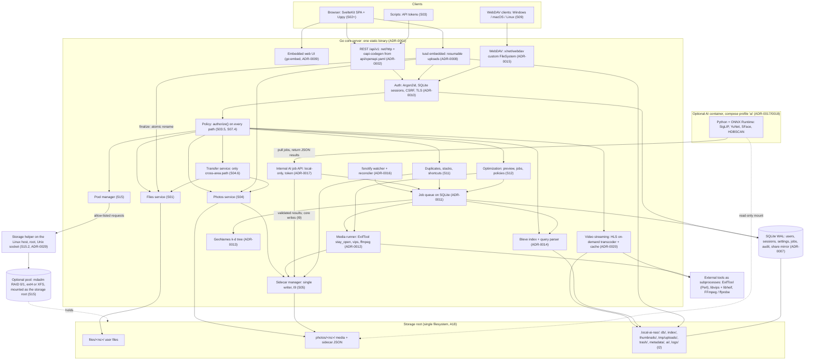

# Architecture and technical concerns

> Part of the local-ai-nas development plan (see [PLAN_INDEX.md](PLAN_INDEX.md)). Moved unchanged from `plan.md` section 6 and 8 in version 1.9.0 (ADR-0044).

## 6. Proposed high-level architecture

> Component boundaries are stable. Since 0.3.0 the concrete technologies are decided (section 7, ADRs 0001–0018). The storage layout (6.3) is **ADR-0003, Accepted in S005**. The "Stage" column shows where each component is built.

### 6.1 Components

| Component | Stage | Responsibility |
|---|---|---|
| **GUI** | S02+ | SvelteKit static SPA served by the NAS and embedded in the core binary (ADR-0009; Q25 answered). Uses only the public API. |
| **HTTP API** | S01.5 | `/api/v1`, with separate namespaces for `files`, `photos`, `search`, `users`, `shares`, `admin`, `system`. OpenAPI, problem+json errors, validation. |
| **Auth and sessions** | S03 | First-run admin, login, sessions, API tokens, 2FA (optional), HTTPS. |
| **Policy (authorization) layer** | S03.5 → S07.4 | One `authorize(subject, action, resource)` check, called on every route, download, preview, thumbnail, search, share, and job. Default deny. |
| **Files service** | S01.3 | All operations on `files/<namespace>/`. The only writer there, apart from Transfer and Trash. Exposes hook points. |
| **Photos service** | S04.1 | All operations on `photos/<namespace>/`. Media-only. |
| **Transfer service** | S04.6 | **The only code path that touches both areas.** Explicit copy and move only (I1), audit-logged. |
| **Upload manager** | S01.4 | Resumable uploads into internal temp, atomic finalize into the target area. |
| **Sidecar manager** | S05.2 | The single writer of photo sidecars. Atomic writes, locking, validation, migrations, recovery. |
| **Metadata extractor and geocoder** | S05.3–S05.4 | EXIF/XMP/IPTC and video metadata. Offline reverse geocoding. |
| **Job system** | S04.3 | Persistent queue and workers used by thumbnails, extraction, indexing, integrity, backups, watcher, and AI. |
| **Thumbnail service** | S04.4 | Renditions and poster frames in internal app data. |
| **Video streaming service** | S04.8 | HLS playlists and segments, on-demand transcoding sessions (FFmpeg), transcode cache with LRU eviction, hardware-encoder detection (ADR-0020). |
| **Search indexer and query engine** | S06 | Index of both areas with reserved owner, ACL, AI, and face fields. Parser, fuzzy matching, synonyms, ranking, permission filter. |
| **Audit log** | S03.6 | Append-only security, transfer, and sharing events. |
| **Reconciler and watcher** | S05.7 / S09.4 | Periodic scan plus real-time watcher for changes made outside the app. |
| **Trash, integrity, and backup** | S08 | Per-user trash, checksums, metadata backup, external backup jobs. |
| **Share gateway** | S09 | WebDAV (in-app) and/or SMB (Samba) mapped to NAS users and permissions. |
| **Admin and monitoring** | S10 | Dashboard, quotas, disk health, job monitor, settings, log viewer. |
| **Hashing and similarity** | S01 follow-up, S04.4, S11.1 | Content hash computed while an upload streams (FR-211); perceptual hash computed with thumbnails (FR-212); an in-memory similarity index (BK-tree or multi-index hashing, ADR-0022) rebuilt from the stored hashes. |
| **Duplicates and stacks service** | S11 | Per-user duplicate groups (exact, resolution variants, files), look-alike stacks and bursts, "not duplicates" marks, metadata merge, resolution through the trash. Writes photo decisions through the sidecar manager (I9). |
| **Shortcut service** | S11.6 | App-level shortcuts (ADR-0024) referencing a target by its stable file ID; followed by listings, downloads, search, quotas, and network shares. |
| **Optimization service** | S12 | Resize and re-encode engines (libvips, FFmpeg, ExifTool as subprocesses), live preview renderer, bulk jobs, upload policies, originals retention and revert (ADR-0025, ADR-0026). |
| **Storage helper (host, root)** | S15.2 | A small separate service on the Linux host (systemd). Allow-listed disk operations (discover, create RAID 0/1, format, mount, check, replace) over an authenticated local Unix socket, audit-logged (ADR-0029). The core stays unprivileged. |
| **Pool manager** | S15 | Pool designer and capacity engine (RAID 0/1, built to take parity later), creation and migration wizards, monitoring and rebuilds, through the storage helper (ADR-0027, ADR-0028). |
| **AI worker (optional)** | S17 | A separate process/container. Pulls AI jobs, reads media read-only, returns results. The core writes the results to sidecars and the index. |
| **Admin console** _(1.7.0)_ | S03.9, then every stage | The admin-only area of the GUI (`/admin`, ADR-0039) and the admin API (`/api/v1/admin`): overview, storage and drives, users, sharing, security, network shares, backups, jobs, logs and alerts, system settings, about. Default deny for non-admins; re-authentication for sensitive actions; audit log (map in 6.6). |
| **Health evaluator** _(1.7.0)_ | S10.3 | Turns SMART readings and error counts into drive statuses with reasons and trends (ADR-0032); schedules self-tests; raises alerts. Reused by S15. |
| **Migration engine** _(1.7.0)_ | S08.4 → S15.6 | Plans, copies, catches up, verifies by content hash, and switches the storage root, with a journal and rollback (ADR-0030, ADR-0031). |
| **Drive lifecycle manager** _(1.7.0, in the pool manager)_ | S15.3, S15.9–S15.11 | Known-drive registry, new-drive detection, the wizard, qualification, upgrade, mirror conversion, replacement, growth, and retirement. |
| **Cache manager** _(1.7.0)_ | S16 | The SSD read cache (content-addressed, admission, eviction, pins, scrub, bypass) and fast internal-data placement (ADR-0036, ADR-0037). |
| **Item registry** _(1.9.0, P008)_ | S01 follow-up (built in S03) | The items table: stable IDs (UUIDv7) with owner, area, path, kind, size, time, content hash, status; assignment on create, on first sight, and by backfill; re-association after external moves (ADR-0040). |
| **Operation journal and job foundation** _(1.9.0, P008)_ | S01 follow-up (built in S03) → S04.3 | Durable jobs with leases, retries, and progress; the journal of multi-place operations with recovery at startup (ADR-0011 amendment, ADR-0041). |
| **Trash** _(1.9.0, P008)_ | S01/S02 follow-ups (built in S03) → S08.1 | Files-area trash with restore and purge, grown by S08.1. |

**Future components (1.6.0, P006; planned for releases, not built and not in the diagram):** a public edge for anonymous link traffic (R09); a WireGuard VPN service (R06); a sync protocol and its server side (R08); mobile and desktop clients (R07, R08); a notification service for alerts, email, and push (MVP alerts FR-221, then R03, R07); an off-site backup engine (R04, by ADR); an office connector (WOPI, R11); a map tile source (R02, Q59).

### 6.2 Diagram (concrete components, 0.3.0)



### 6.3 Storage layout (ADR-0003, Accepted)

```
<storage root>/                       single filesystem (A18)
├── files/                            user-data area 1 (I1)
│   └── <user-namespace>/…            per-user from day one; one namespace until S07 (FR-071); the user's own folders, never reorganized
├── photos/                           user-data area 2 (I1)
│   └── <user-namespace>/…            media + <name>.lainas.json sidecars (S04, S05); hybrid layout (Q40, 1.10.0): uploaded folders keep their structure, loose photos go to YYYY/MM/
└── .local-ai-nas/                    internal app data (I2), default location (A19); grouped in 1.10.0 (ADR-0003 amendment 1)
    ├── state/                        durable: backed up (S08.3), never deleted automatically
    │   ├── db/nas.db                 SQLite (WAL) internal database, from S01 (ADR-0007); moved here from .local-ai-nas/db/ at startup
    │   ├── snapshots/                database snapshots (FR-355, S03.2-T06)
    │   ├── trash/<user-namespace>/   per-user trash (FR-354; S08.1); also restores removed duplicates (S11)
    │   ├── originals/<user-namespace>/ originals replaced by optimization, kept for the retention period (S12.5, ADR-0026)
    │   ├── metadata/                 albums, face-group registry, transferred-out sidecars (Q13, Q27)
    │   └── tls/                      certificate and key (S03.4)
    ├── cache/                        rebuildable: never backed up; may live on a faster drive (ADR-0037)
    │   ├── index/                    Bleve search index (S06, ADR-0014)
    │   ├── thumbnails/               renditions keyed by content hash (S04.4)
    │   ├── transcode/                HLS quality levels, created on demand, size-capped with LRU eviction (S04.8, ADR-0020)
    │   └── ai/                       models, embeddings (S17)
    ├── tmp/                          work in progress: uploads/ (resumable upload sessions, S01.4; same filesystem for the atomic rename), copies being built
    └── logs/                         application log files (JSON, size-rotated; D-07, S005); the audit log lives in SQLite (ADR-0007)
Configuration file: outside the storage root (CLI flag / env var / OS default path).
Optional pool (S15, Linux): drives → mdadm RAID 0/1 → ext4 or XFS → mounted and used as <storage root>.
Optional SSD (S16, 1.7.0): <ssd>/cache/ (content-addressed read cache of originals; rebuildable, never backed up)
                             and fast internal data (the .local-ai-nas/cache/ folders; optionally the database, ADR-0037).
```

### 6.4 Key flows

- **File upload (S01):** client → API (validation) → [from S03: auth + policy] → upload manager writes to `.local-ai-nas/tmp/uploads/` → on completion, atomic rename into `files/<ns>/…` → post-operation hook (S06+: index job; S10+: quota accounting).
- **Photo ingest (S04–S06):** upload into photos → media-type check by content → hash and duplicate check → atomic finalize into `photos/<ns>/…` → jobs: thumbnails (S04.4), metadata extraction + sidecar (S05), geocoding (S05.4), indexing (S06), AI (S17, if opted in).
- **Cross-area transfer (S04.6):** explicit request → policy check → Transfer service validates (only media into `photos/`) → copy or move → sidecar handled per Q27 → index updated → audit event.
- **Search (S06–S07):** query → parser (text + operator filters) → permission filter (owner/ACL fields, S07) → normalization, stemming, synonyms, typo tolerance → ranking → paginated results. The index only (I4), no AI.
- **Duplicate detection (S11):** upload or scan → stored content hash (exact) and perceptual hash (variants, look-alikes) → per-user similarity lookup → groups and stacks with reasons → the user resolves with a preview (I10) → removed items to the trash, metadata merged onto the kept item, shortcuts for files.
- **Storage optimization (S12):** scope and settings → live preview of a sample → estimate → confirmation (I10) → job per item: write a temp file, copy metadata, verify, swap in atomically, original to `originals/` → sidecar, thumbnails, index, and duplicate check refreshed → revert possible until the retention ends.
- **Pool creation (S15):** discovery → design and live calculator → SMART check → typed confirmation (I10) → the helper creates the RAID 0/1 array, formats, and mounts → migration of the storage root onto the pool, verified by checksums → monitoring.
- **New drive (S15, 1.7.0):** kernel event (helper) or re-scan → known-drive registry (serial, WWN) → alert and console notification → wizard (upgrade, mirror, replace, grow, backup drive, SSD cache, ignore) → qualification → preparation (helper) → migration or pool change → verification → retirement choice.
- **Migration (S08.4, S15.6):** plan and estimate → confirmation → bulk copy online (throttled) → catch-up → maintenance mode and final sync → verify every file by content hash → switch (remount or configuration) → post-switch check → rollback window.
- **Cached read (S16):** request → authorization (I5) → service lookup → cache entry whose hash, size, and modification time match? → serve from the SSD (on any error: drop the entry and serve from the storage root) → otherwise serve from the storage root and count the read for admission.
- **Admin action (1.7.0):** console page → admin API route (role check, re-authentication for sensitive actions) → service → audit log → result and, for long work, a job with progress.
- **External change (S05.7, S09.4):** watcher event or scheduled scan → reconcile (re-ingest, update sidecar, re-associate by hash, quarantine orphan) → index job.

### 6.5 Data ownership

| Data | Location | Rebuildable? |
|---|---|---|
| User files | `files/<ns>/` | No (user data) |
| Media | `photos/<ns>/` | No (user data) |
| Descriptive photo metadata and AI results (S17) | Sidecar next to the media (`<name>.lainas.json`, 1.9.0) | No: **source of truth** (I3) |
| Ownership, access lists, shares, public links, revocations (both areas) _(1.9.0, D2)_ | Internal DB (authoritative); mirrored into the photo sidecar's `access` section and, if Q28 keeps them, hidden files-area files | No: backed up (S08.3), database snapshots (FR-355) |
| Access mirror for shared items in `files/` | Per ADR in S07.3 (Q28); a mirror of the database since 1.9.0 | Yes, from the database |
| Item IDs (items table) _(1.9.0)_ | Internal DB; photo IDs also in the sidecar (`mediaId`) | Photos: from the sidecars; files area: from snapshots and backups (ADR-0040) |
| Operation journal, jobs, trash records _(1.9.0)_ | Internal DB; trashed items in `.local-ai-nas/state/trash/<ns>/` | Journal and trash: no (backed up); jobs: re-created |
| Albums, face-group registry | `.local-ai-nas/state/metadata/` (Q13) | No: backed up (S08.3) |
| Users, sessions, tokens, settings, audit log | Internal DB / config | No: backed up (S08.3) |
| Content hash, perceptual hash, stack membership and cover, duplicate decisions, merged-metadata provenance, optimization history of photos | Sidecar (reserved in S05.1; P005) | No: **source of truth** (I3) |
| "Not duplicates" marks and ignore list for files; shortcuts | Internal DB (S11) | No: backed up (S08.3) |
| Replaced originals after optimization | `.local-ai-nas/state/originals/` (S12.5) | No, while kept: user data until the retention ends |
| Pool layout | On the member drives (mdadm metadata) and in the internal DB | Re-importable from the drives (S15.8) |
| Search index, thumbnails, transcodes, embeddings, similarity index | Internal app data, `.local-ai-nas/cache/` (1.10.0); the job queue is in the database | Yes (from disk, sidecars, media, or AI re-run) |

### 6.6 Admin console map (new in 1.7.0, the user's requirement)

The console (ADR-0039) is the one place for administration. S03.9 builds its shell and rules; each section is filled by the stage that builds its feature, always inside the console (principle 4: build once); S10.6 checks that nothing is missing.

| Section | Contents | Filled by |
|---|---|---|
| Overview | Health at a glance: storage, drives, backups, jobs, alerts, updates, with a link to fix each problem (FR-345) | S03.9 (placeholder with system status), S10.1 |
| Storage and drives | Drive list with health statuses and reasons (FR-332), self-tests, move storage to another drive (FR-333), pools, the new-drive wizard, migrations, rollback, retirement, SSD cache and fast internal data | S10.3, S08.4, S15.9–S15.12, S16.7 |
| Users and groups | Create, disable, reset, quotas | S03.9 (the admin account), S07.6, S10.2; groups in R03 |
| Sharing | All shares, revoke; public links later | S07.6; R09 |
| Security | Sessions of all users, two-factor policy, password policy, audit log, re-authentication | S03.8, S03.9, S03.6, S10.5 |
| Network shares | WebDAV (and SMB if approved), camera-upload endpoints and app passwords | S09.5, FR-219, FR-220 |
| Backups and recovery | Metadata backup, external backup targets, restore, disaster recovery | S08.7 |
| Jobs | Queue, progress, failures, retry, cancel | S10.4 |
| Logs and alerts | Application and audit logs, alert channels and rules, test alert | S10.3, S10.5 (FR-221) |
| System settings | Network and bind address, HTTPS certificates, time, notifications, updates, performance (Raspberry Pi resource limits: concurrency, throttles), advanced | S03.4, S03.9, S10.5, S14.3 |
| Photos and AI | Library-wide settings, optimization policies for everyone (if Q49 allows), AI opt-in, models, progress | S04.7, S12.7, S17.8 |
| About and diagnostics | Version, license, components, health check, support bundle without personal data | S03.9, S10.6 |

---

## 8. Key technical concerns

### 8.1 Forward compatibility (new in 0.2.0)
Each stage leaves defined hook points so later stages extend rather than rewrite:

| Built in | Hook | Used by |
|---|---|---|
| S01.2 | Per-user namespace directories and an `owner` on every item | S07.2 (no data move) |
| S01.3 | Storage service interface with before/after operation hooks | S04.6 transfer, S06 indexing, S08 trash, S10 quotas, S07 checks |
| S01.4 | Simple cleanup scheduler behind an interface | Replaced by the S04.3 job system |
| S01.5 | `/api/v1/photos` reserved; stable error codes | S04 |
| S03.5 | `authorize(subject, action, resource)` with default deny | Extended by S07.4 (ownership, ACL, shares) and S09 (network shares) |
| S03.6 | Extensible audit event schema | S04.6 transfers, S07 sharing, S10 admin actions |
| S04.3 | Generic job system with per-user job context | S05, S06, S08, S09, S17 |
| S05.1 | Sidecar sections `access` and `ai` reserved | S07.3, S17.7 |
| S06.1 | Index fields `owner`, `acl`, `ai_tags`, `face_groups`; `face:` reserved | S07.4, S17.7 |
| S01 follow-up, S04.2 | Content hash stored for every uploaded file (P005) | S11 duplicates, S12 re-check, S05.7 re-association |
| S04.4 | Perceptual hash stored with thumbnails (P005) | S11.1–S11.4 |
| S05.1 | Sidecar sections `hashes`, `stack`, `duplicates`, `mergedFrom`, `optimizationHistory` reserved (P005) | S11, S12 |
| S06.1 | Index fields `stack_id`, `stack_cover`, `is_shortcut` reserved (P005) | S11 |
| S08.1, S08.5 | Trash (and versioning, if approved) able to hold removed duplicates and replaced originals (P005) | S11.3, S12.5 |
| S09.2 | WebDAV FileSystem with room for app-level shortcuts (P005) | S11.6 |
| S10.1–S10.3 | Dashboard panel for reclaimable and saved space; quotas (shortcuts free, originals counted until removed); reusable disk health collector (P005) | S11, S12, S15 |

### 8.2 Enforcing area separation (I1) (new in 0.2.0)
- **Separate services, separate roots:** the Files service can only resolve paths under `files/<ns>/`, and the Photos service only under `photos/<ns>/`. Each has its own resolver, so there is no shared "write anywhere" helper.
- **One crossing point:** only the Transfer service holds references to both services, and only explicit user requests reach it. Architecture tests (import rules) fail the build if other code touches both.
- **Media-only photos:** content-based type detection (not just the extension) on upload, transfer, server-side import, and network writes.
- **Jobs and network shares** go through the same services, so they obey the same rules (S09.3).
- **Tests:** S04.9 runs every write path (API, jobs, transfers) and asserts that no item appears in the other area implicitly.

### 8.3 Sidecar JSON as source of truth; rebuildable index
- The index stores a projection of each sidecar plus the sidecar's size, mtime, and hash, so it can detect edits on disk.
- Write order is always sidecar first, then index. A rebuild-equivalence test proves that an incrementally maintained index equals one rebuilt from disk.
- Invalid sidecars are never overwritten. They are quarantined, reported, and rebuilt from the media while keeping recoverable user fields (FR-101).

### 8.4 Atomic writes and concurrent access
- **Uploads (S01.4):** stream into `.local-ai-nas/tmp/uploads/`, fsync, then rename atomically into the area. This works because everything is on one filesystem (A18, verified at startup).
- **Sidecars (S05.2):** write to a temp file in the same directory, fsync, then Go's `os.Rename` (replace semantics), with retry and backoff on Windows (file locking). The watcher ignores the app's own temp files and writes.
- **Concurrency:** per-path locks for mutating operations; optimistic checks (mtime/hash, or `If-Match` ETags in the API) to avoid lost updates; section ownership inside sidecars (extractor, user, geocoder, and AI each own their sections).

### 8.5 External changes: reconciliation and live watcher (updated in 0.2.0)
- **Before S09**, external changes happen only if someone edits the storage root directly on the host. The **reconciliation scan (S05.7)** handles them on startup, on a schedule, and on demand.
- **In S09**, network shares add real external writers. With **WebDAV served by the app**, writes pass through the service layer, so nothing is external. With **Samba**, writes bypass the app, and the **real-time watcher (S09.4)** is required:
  - Debounce event bursts into bounded work.
  - Detect renames (file ID/inode, then content hash) so sidecars follow instead of delete + create.
  - Recognize and ignore the app's own writes.
  - Fall back to periodic reconciliation, because events are lost on some filesystems and while the app is down.
- Handling table (both mechanisms):

| Situation | Handling |
|---|---|
| New media in `photos/`, no sidecar | Ingest: hash, metadata, sidecar, index |
| New non-media in `photos/` (e.g. via share) | Not accepted into the library. Reported to the owner, left untouched (never deleted automatically) |
| Media content changed | Re-extract, keep user fields, mark AI results stale |
| Media deleted, sidecar remains | Mark orphaned, then quarantine to internal data after a grace period (Q10) |
| Media renamed or moved | Re-associate by file ID or hash, and move the sidecar to match |
| Sidecar hand-edited | Validate and re-index. If invalid, quarantine and report |
| Foreign `.json` next to media | Never overwritten (FR-030, Q11) |

### 8.6 Sidecar naming
`<full filename>.lainas.json` _(1.9.0, the user's decision D1; before: `<full filename>.json`, the README's naming)_: a suffix only this project uses, so Google Takeout's and other tools' `.json` files next to a photo are never taken for ours and an import can keep them. Every sidecar still carries `schemaVersion` and an identifying marker. Edge cases to handle:
- Case-insensitive filesystems.
- Windows path-length limits.
- Unicode normalization (NFC vs NFD).

Sidecars are hidden in the photos GUI.

### 8.7 `schemaVersion` and migrations
- JSON Schema files are versioned in the repository. Migrations are pure, idempotent `vN → vN+1` functions, run lazily on read and in bulk as jobs, with **backups and dry-run mode** (FR-102). A newer-than-supported sidecar is treated as read-only.
- **Reserved sections** in v1 (FR-100): `access` (owner, read ACL: S07) and `ai` (`classification` and `faces` with per-part model@version: S17). This way S07 and S17 need no schema bump for their base data. _Since 1.4.0 (P005)_ v1 also reserves `hashes` (content and perceptual), `stack` (stack ID, cover flag, user-locked decisions, burst identifier), `duplicates` ("not a duplicate of" list), `mergedFrom` (merged-metadata provenance), and `optimizationHistory` (S11, S12). Face boxes are stored in **normalized coordinates (0–1)**, so they stay valid when a photo is resized (S12). _1.9.0 (P008):_ v1 also reserves `mediaId` (FR-348) and a `provenance` section for imported metadata kept verbatim (FR-222); `access` becomes a non-authoritative mirror written only by the core (D2, FR-359).

### 8.8 Storage of ownership and access data (new in 0.2.0, decided in S07.3)
- **Authority (1.9.0, the user's decision D2):** the database decides ownership and access for both areas (FR-359).
- **Photos:** the sidecar `access` section (reserved in S05.1) keeps a read-only **mirror**, as the user specified that a shared file carries its owner and readers; it is written only by the core and never trusted for an access decision.
- **Files area** (Q28). Options:

| Option | Pros | Cons |
|---|---|---|
| **(a) Hidden sidecar only for shared items** (e.g. `.report.pdf.access.json`); unshared items have the owner implied by namespace | Matches "a shared file carries data about its owner and readers". Few extra files. Travels with the file. | Hidden files are still visible over SMB unless filtered. External moves need re-association. |
| (b) Hidden sidecar for every file | Uniform. | Doubles the file count and clutters shares. |
| (c) Visible sidecar per file | Transparent. | Pollutes the user's own `files/` area and collides with the user's own `.json` files. |
| (d) Central store (internal DB) | Fast, clean, transactional. | Not carried with the file. Must be backed up (S08.3). |
| (e) Extended attributes (xattrs) | Invisible, travels with the file on the same filesystem. | Lost on copies to other filesystems. Poor Windows/SMB support. |

**Recommendation: (a)** as a mirror of the database (1.9.0), with the database and the index used for checks. Folder shares are stored on the folder (a hidden per-folder file) and inherited.

### 8.9 Permission filtering in search (new in 0.2.0)
- The index stores `owner` and `acl` for every document (reserved in S06.1, populated in S07.3).
- Every query is **pre-filtered** (`owner = me OR me ∈ acl`) **before** scoring. Counts, facets, "did you mean" suggestions, and autocomplete are computed only over the filtered set. The typo and suggestion vocabulary is built per user, or from generic dictionaries only, so another user's tags, place names, or file names never leak.
- Changes to access data update the index synchronously on revoke, so revoked access disappears from search immediately.
- Leak tests (S07.7) include timing and count probes.

### 8.10 AI runs once at ingest; reprocessing on model change
AI jobs run after ingest, and backfills at the lowest priority. Every result records model@version. A model change marks items stale for reprocessing. User corrections (rejected tags, naming, merges, "not this person") are never overwritten (FR-038, FR-044). Search reads persisted results only (I4).

### 8.11 Synonym and fuzzy matching (Bleve, ADR-0014)
Pipeline:
1. A custom Bleve analyzer: unicode tokenizer → lowercase → ASCII folding (accents) → English possessive and stop filters → Porter stemming. An unstemmed sub-field supports exact-match boosts.
2. Query-time synonym expansion from the project's curated, user-extendable dictionary (a boosted disjunction, lower weight).
3. Typo tolerance via Bleve **fuzzy (edit-distance) queries**, with the distance set by term length.
4. **Prefix queries.**
5. Ranking: exact > stem > synonym > typo, with field weights and recency.
6. Autocomplete and "did you mean" suggestions use **permission-scoped** terms only (8.9).
7. _(1.9.0, P008; first noted in 1.8.1)_ **Per-field analysis instead of one analyzer everywhere** (FR-357; the full table goes into the S06.1 mapping ADR):

| Field | Analysis |
|---|---|
| File name | Normalized; tokenized on separators, camel case, and digit boundaries (`IMG_1204` matches `1204`); prefix; no stemming |
| Path | Keyword and prefix |
| Description, captions, user text | Language-aware full text with stemming |
| Tags | Exact, normalized |
| Names of people and face groups | Exact, prefix, typo-tolerant; no stemming |
| Camera and lens | Exact and token |
| Place | Exact at every level, city to country (FR-063) |
| MIME type and kind | Keyword |
| Dates, sizes, ratings | Structured filters |

Unicode and multilingual from the start: NFC and case folding; Arabic-script normalization treating Urdu and Arabic letter variants as equal (Farsi and Arabic yeh, keheh and kaf, heh goal and heh), ignoring diacritics and tatweel for matching; no stemming of non-English text; right-to-left display tested in the GUI; Roman Urdu variants through typo tolerance and the user-extendable synonyms. Q15 decides which language analyzers are added; the normalization itself is not optional. The golden query set gains Urdu, Roman Urdu, and mixed-script queries.

AI labels feed the dictionary in S17.3 (FR-138).

### 8.12 Query language parsing
A hand-written tokenizer and recursive-descent parser with a formal EBNF grammar (FR-106).
- Operators compile to structured filters, and free text compiles to index queries.
- Partial dates define periods (Q14). Comparison uses local capture time.
- `in:` and `type:` filter area and media type. `size:` accepts comparisons (`size:>10MB`). `ext:` matches extensions.
- `face:` is parsed from S06 but returns a hint until S17.
- Go native fuzzing (`go test -fuzz`) and table-driven tests guarantee no crash on arbitrary input.
- The parser output compiles to Bleve `BooleanQuery` / `DateRangeQuery` / `NumericRangeQuery` / `TermQuery` (ADR-0014).

### 8.13 Offline reverse geocoding
Bundled GeoNames data (CC BY 4.0), nearest-place lookup with a k-d tree, structured fields plus the dataset version in the sidecar, alternate names for matching. No network calls (I6). Known limitation: nearest-place is not boundary-accurate. Natural Earth polygons are optional.

### 8.14 Privacy of face data
A separate opt-in. Embeddings are stored only in internal app data, never in sidecars (sidecars hold boxes and group references). Everything is deletable on opt-out (FR-046). Per-user and access-controlled (FR-140). Faces detected in photos shared with others remain the owner's data (policy in S17.9).

### 8.15 Large libraries
- Thumbnails are pre-generated and keyed by content hash, with long-lived caching headers.
- Keyset pagination and virtualized lists in the GUI.
- Job priorities: interactive work > ingest > indexing > integrity/backup > AI.
- Streaming I/O everywhere (NFR-021).
- Benchmarks at 50k (S04.9) and 100k+100k (S06.8), and full-system tests (S14.5).

### 8.16 Other cross-cutting concerns
- **Security:** a single path resolver per area; strict name validation for Windows, macOS, and Linux; symlinks never followed out of an area; localhost binding until S03 (NFR-020); no default credentials; CSP; safe previews (NFR-022).
- **Time zones:** use `OffsetTimeOriginal` when present, then GPS time, then the configured default, and record the source.
- **Cross-platform:** one filesystem abstraction, and CI on Linux and Windows from S01.

### 8.17 Single-writer rule (I9) (new in 0.3.0)
- **Only the core server writes sidecar files and the search index.**
- The AI worker (ADR-0017), and any future helper process, submits **JSON results** through the local-only internal API. The core **validates** them (schema, value ranges, model@version, ownership), then writes through the sidecar manager (S05.2) and the indexer (S06.2).
- The AI container mounts media **read-only**, so it physically cannot write.
- WebDAV writes (ADR-0015) go through the same services, so they also respect I9.
- Samba (ADR-0019, if ever adopted) cannot write sidecars itself either. Its media changes reach sidecars only through the watcher and reconciler, which run inside the core.

### 8.18 Same-filesystem requirement for atomic upload moves (new in 0.3.0)
- tusd stores incomplete uploads in `<internal>/tmp/uploads/` (ADR-0008), and finalize **renames** the file into `files/` or `photos/`. A rename is atomic only **within one filesystem**.
- The S01.2 health check compares the device IDs of `tmp/uploads/` and each area (`os.Stat` → `syscall.Stat_t.Dev` on Unix; the volume serial on Windows). A mismatch produces a startup warning and switches to the **fallback**: copy to a temp name inside the target directory, fsync, then rename. This keeps partial files invisible at the cost of a second write. The fallback and its cause are documented and shown in health.
- Trash (S08.1) has the same requirement, and the same check covers it.

### 8.19 inotify watch limits (new in 0.3.0)
- On Linux, fsnotify uses inotify, which is **not recursive**. One watch is needed per directory, capped by `fs.inotify.max_user_watches` (often 8,192–65,536 by default, depending on the distribution).
- Large libraries need a higher limit. The install guide (S14.4) shows how to check and raise it (sysctl), and the Docker docs cover the host setting.
- When a watch cannot be added, the watcher **degrades gracefully** to reconciliation-only for that subtree and reports it (health and admin UI). The periodic reconciliation scan (S05.7) remains the correctness backstop.

### 8.20 External-tool dependency for native installs (new in 0.3.0)
- The Docker image bundles ExifTool (with Perl), libvips with libheif, and FFmpeg (ADR-0006/0012). **Native installs do not.**
- The S14.2 native Linux install and the install guide (S14.4) must list the distribution packages and the minimum versions.
- _Since 1.1.0 (user, S005 E015):_ every prerequisite is recorded **per platform** in `dependencies.md` section 12 at the time it is introduced (NFR-032), and the S14.2 setup scripts (FR-149) install or check exactly that list.
- The core **detects the tools at startup** (path and version) and reports missing or too-old tools in health.
- Features that need a missing tool are **disabled with a clear message** rather than failing silently. For example, without FFmpeg, video poster frames and metadata are unavailable.
- S01–S03 need **no** external tools. They are first used in S04.4 and S05.3.
- The tools' licenses and bundling are recorded in `dependencies.md` for the user's attention with Q22.

### 8.21 On-demand video transcoding (new in 0.4.0, ADR-0020)
- **Sessions:** one FFmpeg subprocess per (video, level). It writes keyframe-aligned 4 s HLS segments ahead of the playhead into `<internal>/cache/transcode/<content-hash>/<level>/` (1.10.0). Segment requests wait briefly for production. A seek beyond the produced range restarts the session at the target time. Idle sessions stop after a timeout.
- **Budget:** a global cap on concurrent sessions (default 1 with the CPU encoder, 2–4 with a hardware encoder), a configurable maximum level, and yielding of background jobs while someone is watching. Interactive API latency must keep NFR-003.
- **Hardware encoders:** detected at startup and shown in health. The Debian FFmpeg build explicitly enables libx264 and libvpl (Intel QSV). VAAPI, V4L2-M2M (Raspberry Pi), and NVENC are autodetected features, to be verified in the image in S04.8. Docker needs device passthrough (e.g. `/dev/dri`), which is documented.
- **Cache:** content-hash keys (no duplicates across users and areas), a size cap with LRU eviction by a job (S04.3), fully rebuildable (I2). Originals are never modified.
- **Security:** every playlist and segment request is authenticated and authorized like a download (I5). Responses use `Cache-Control: private`. The cache is not exposed through WebDAV or the files API.

### 8.22 Perceptual-hash thresholds and false positives (new in 1.4.0, P005)
- A false positive becomes a **deletion proposal**, so the defaults are strict: resolution variants need a small Hamming distance **and** a matching aspect ratio (within a small tolerance), and a matching date taken when both items have one. Look-alike stacks use a looser threshold plus a time window; nothing is ever deleted by grouping.
- Thresholds are calibrated on a **labelled fixture set** (exact copies, re-saved copies, crops, bursts, and "similar but different" pairs) and recorded with their measured false-positive rates (NFR-034). They are configurable.
- Matching runs per user through a similarity index (BK-tree or multi-index hashing), so it never compares all pairs, and never across users (I5).

### 8.23 Metadata preservation during re-encoding (new in 1.4.0, P005)
- libvips resizes (keeping ICC; `keep` flags control what libvips copies), and **ExifTool** copies EXIF, XMP, and IPTC from the original (`-tagsfromfile SRC -all:all`, plus `-icc_profile` and, where needed, `-unsafe`). ExifTool 13.59 writes every format involved (JPEG, PNG, WebP, HEIC, AVIF, TIFF, GIF, MP4, MOV).
- **Orientation, one rule:** the pixels are rotated upright and the orientation tag is reset (libvips `autorot` removes the tag). Never both, never neither.
- The new file is verified before the swap: it decodes, and its date taken, GPS, and camera fields match the original's. The sidecar records the original's dimensions, size, and hash (`optimizationHistory`).

### 8.24 Privileged disk operations (new in 1.4.0, P005)
- Creating, formatting, and mounting arrays needs root. The **core never runs as root**: a separate storage helper (ADR-0029) does only allow-listed operations, each validated against the drive inventory (never the OS drive, never a drive holding NAS data outside the migration flow), authenticated over a local Unix socket, and written to the audit log.
- In Docker, the helper runs on the host, not inside a privileged container. The threat model (S03.1) lists it as an attack surface from the start.

### 8.25 Array consistency and the parity write hole (new in 1.4.0, P005)
- **RAID 1** (built in S15) uses mdadm's write-intent **bitmap**, so a crash needs only a partial resync, and scheduled checks (scrubs) report mismatches.
- **Parity layouts** (deferred, 11a) add the **write hole**: a crash during a stripe update can leave parity inconsistent. mdadm offers a write journal (`--write-journal`, RAID 4/5/6) against it; the future candidate must evaluate it.
- Nested arrays (the combined drives of 11a) must be assembled inner arrays first at boot; this is a known pitfall and part of that candidate's tests.

### 8.26 Hashing resumable uploads (new in 1.4.0, P005 fix)
- A tus upload spans many requests and may resume after a restart. The content hash is computed as bytes arrive, and its state is saved with the upload between chunks (Go's SHA-256 state can be serialized), so no extra read is needed. If the saved state is lost, the hash is computed with one read at finalize.
- WebDAV writes (S09) and files added outside the app are hashed by the watcher and reconciliation; files from before FR-211 are hashed by the S11.1 backfill.

---

### 8.27 Migration consistency and downtime (new in 1.7.0, P007)
The migration engine copies while the NAS keeps working, so files change during the copy. Catch-up passes copy what changed; the final sync runs in maintenance mode with writes stopped (uploads, WebDAV, jobs, the AI worker) and the database checkpointed, so the copy is exact. Every file is verified against its stored content hash before the switch (NFR-044). The downtime target is set per reference library on the Raspberry Pi (NFR-045).

### 8.28 Switching the storage root under Docker (new in 1.7.0, P007)
The container sees the storage root through a bind mount. On Linux the helper remounts the new drive at the same path while the container is stopped, so the Compose file never changes; the container is restarted rather than relying on mount propagation (ADR-0031).

### 8.29 Cache consistency and privacy (new in 1.7.0, P007)
A cache entry is served only after the request is authorized (I5) and only if its content hash, size, and modification time match the file's current record; anything else goes to the storage root. Statistics are aggregated, never listing another user's file names (NFR-047).

### 8.30 SSD endurance (new in 1.7.0, P007)
Consumer SSDs wear with writes. The cache has a daily write budget; admission pauses when it is used up; wear is monitored by the health evaluator and alerts near end of life (NFR-048).

### 8.31 Admin console enforcement (new in 1.7.0, the user's requirement)
Hiding pages is never the protection: every admin API route checks the role on the server, a route-inventory test fails if an admin route is reachable without it, sensitive actions need recent re-authentication, and every admin action is in the audit log (NFR-050). Admin traffic uses the `/admin` and `/api/v1/admin` prefixes, so it can later be restricted to the LAN or VPN (R09).

### 8.32 Raspberry Pi resource budgets (new in 1.7.0, the user's requirement)
The Pi has four cores and 4–16 GB of RAM shared by the NAS, the OS, and later the AI worker. Every stage states its memory and CPU budget for the Pi, streams data instead of holding it (as S01 already does), runs heavy work as throttled background jobs, and exposes the concurrency limits in the console's performance settings (NFR-051).

### 8.33 Drives on a Raspberry Pi (new in 1.7.0, the user's requirement)
Drives connect over USB 3 or an NVMe HAT. USB bridges may hide SMART (health shows "not available"), may disconnect under load (risky for RAID, P007), and share bandwidth. The SD card wears quickly, so the database and all busy data live on a real drive or an SSD (ADR-0037). Setup checks and warns about these (S14.2).

### 8.34 Video on a Raspberry Pi 5 (new in 1.7.0, the user's requirement)
The Pi 5 has **no hardware video encoder** (verified 2026-09-29): H.264 is decoded in software and HEVC in hardware. The streaming quality levels of S04.8 (ADR-0020) therefore rely on software encoding there: play the original directly whenever the browser can, limit concurrent transcodes (e.g. one), prefer lower levels, and prepare common levels at quiet hours. S04.8 measures this on the Pi profile.

### 8.35 Item identity (new in 1.8.1, external review #1)
Items are identified by their path today (S01: the files API, content hashes by path). The plan speaks of a "stable file ID" (ADR-0024) and of re-association by file ID or content hash (8.6), but has no identity model. Albums, shares, jobs, face assignments, shortcuts, thumbnails, and audit records need a reference that survives renames and moves; filesystem file IDs (inodes) do not survive a copy, a restore, or a move to another drive (ADR-0030). An app-assigned immutable ID (UUIDv7 or ULID) in the database, mirrored in the photo sidecar, would give that reference. Deciding it before photos are stored (S04) is far cheaper than later (Q77, RK-50). _Decided in 1.9.0 (P008 F1, approved by the user): UUIDv7 in an items table (FR-346–FR-349, ADR-0040), built as S01 follow-ups in S03._

### 8.36 Authority for access data (new in 1.8.1, external review #1)
8.8 keeps photo access data in the sidecar `access` section, as the user specified. Sidecars and hidden files can be changed outside the app (on the filesystem, over a network share with write access, by restoring an old backup), so they should not decide who may read an item. The recommendation is that the database is the authority and the sidecar only a mirror for export and inspection; on a mismatch the database wins and the reconciler rewrites the mirror (Q78, threat T-58). _Decided in 1.9.0 (the user's decision D2): the database is authoritative (FR-359, I3)._

### 8.37 Durability of security data (new in 1.8.1, external review #1)
ADR-0007 runs SQLite in WAL mode with `synchronous=NORMAL`: the file is never corrupted, but a power cut can roll back the last committed transactions. That is fine for rebuildable data (jobs, caches, index state), but from S03 the same database holds sessions and their revocations, password changes, API tokens, and the audit trail: a revoked session could come back after a power cut. A home NAS commits these rarely, so `synchronous=FULL` costs little (Q79, threat T-59). _Decided in 1.9.0 (the user's decision D5): `synchronous=FULL` with throttled high-frequency writes (NFR-056, ADR-0007 amendment)._

### 8.38 Crash consistency of operations (new in 1.9.0, P008)
Operations that touch the filesystem, a sidecar, the database, and the index cannot be one transaction. Each records its intent in the operation journal before any side effect, runs idempotent steps, and is marked complete; at startup unfinished ones roll forward where possible and back otherwise (FR-352, ADR-0041). The failure matrix fixes the outcome for: file write succeeds but rename fails; rename succeeds but the database commit fails; disk full mid-write; crash; power loss. Never lose user data; never leave a visible, inconsistent item; an orphaned file is adopted by the reconciler, never deleted. Crash-injection tests cover every step (NFR-053).

### 8.39 Protection against other websites before login (new in 1.9.0, P008)
Any website the user visits can make the browser send requests to the NAS: cross-site form posts, and DNS rebinding, where a hostile domain resolves to `127.0.0.1` or the NAS's LAN address so its requests look same-origin. A Host allow-list defeats rebinding; an Origin check on every state-changing request and no permissive CORS stop cross-site writes (FR-350, NFR-057, ADR-0042, bug S03-B01). They come first in S03, before sessions and CSRF tokens, and stay forever.

### 8.40 Hybrid retrieval (new in 1.9.0, P008; for the AI stage)
Meaning-based search combines Bleve's lexical results with vector similarity by reciprocal rank fusion, after permission filtering on both sides (FR-362, ADR-0043). Vectors live in internal data in an in-process index, not in a new service (pgvector, Qdrant, ChromaDB not adopted) and not in Bleve (its vector search needs FAISS through cgo, against pure-Go builds; verified). Only the typed search text is embedded at query time (I4, D3).

### 8.41 Background work priority (new in 1.9.0, P008; verified 2026-09-30)
Queue priority alone does not keep the NAS responsive when external tools saturate the CPU or the disk. Linux: `nice` for CPU; `ionice` works only with the BFQ and mq-deadline schedulers; cgroup v2 `io.weight` (used by Docker) needs the iocost controller or BFQ. Windows: a child process can be created at the below-normal priority class (CPU); background mode, which also lowers I/O and memory priority, applies only to the calling process. So the job system's own throttling and backpressure (limits on queued work per user and overall; derived work throttled while someone uses the NAS) are the guarantee, and OS priority is an addition where it works (NFR-054, NFR-055).

### 8.42 Google Takeout import (new in 1.9.0, the user's requirement)
The importer (FR-222, R01) must bring Google Drive into the files area and Google Photos into the photos area with the folder structure and everything Google recorded. Known from public sources (to be confirmed with the sample): Photos exports put a JSON file next to each media file, sometimes with shortened or differently suffixed names, and store dates, places, and descriptions there rather than in the media; `-edited` copies sit next to originals. **Unverified:** what Drive exports carry besides the files (the web check on 2026-09-30 found no reliable description). **Before any Takeout work (the user's instruction):** (1) the user provides Takeout sample data for Drive and Photos; (2) the agent analyzes it: folder layout, naming, every JSON field and its meaning, edited copies, albums, archived and trashed items, motion photos, multi-part archives, Drive's metadata files and document exports; (3) the findings go into a research record without personal data; the sample stays in the git-ignored `dev/` folder and is never committed (the repository is public); (4) synthetic fixtures are built from the findings (12.3); (5) then the R01 stage document is written. Google changes Takeout formats over time, so the importer is tolerant: unknown fields are kept verbatim, unknown files are reported, never dropped (A28).

### 8.43 Client apps (new in 1.11.0, P009; the scope of the client technology ADR)
The clients (R07, R08; matrix in roadmap 11b.3) share one design. **No technology is chosen now.** The client technology ADR (planned in R07, Q56) must cover: (1) **one shared client engine**: the API client generated from `api/openapi.yaml`, tus uploads, hashing, the local queue and state database, sync rules, and conflict handling (FR-366–FR-370); (2) **thin platform adapters**: media source, folder access and watching, background scheduling, secure storage, share integration, notifications; (3) **a comparison** of Flutter, Kotlin Multiplatform, .NET MAUI, Tauri, and native user interfaces over a shared engine, against all five platforms, background reliability, licenses (compatible with AGPL-3.0-or-later), and F-Droid compatibility; (4) **a short prototype** of background upload on Android and Windows before the ADR is accepted. Server side (built with R07): the pairing endpoints, the device registry and device-scoped tokens, the Devices page, the duplicate check limited to the user's own items, device status reporting, default destination folders, and the change feed (FR-364–FR-370). Clients never write sidecars or the index (I9) and send no telemetry (I6; NFR-058). Forward compatibility, recorded now so the MVP needs no rework: API tokens keep an optional device field (S03.3-T04 note), and the operation journal gives completed changes an increasing sequence number (S01.4-T09 note, ADR-0041 amendment 1).
