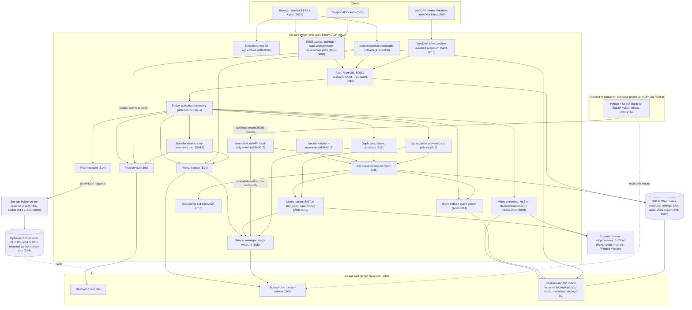
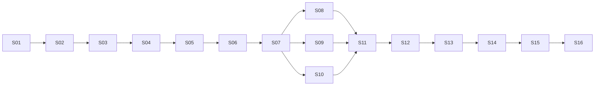

# local-ai-nas: Development Plan

| Field | Value |
|---|---|
| **Version** | 1.7.0 |
| **Status** | **Approved baseline** (approved by the user in S005, 2026-09-24); 1.1.0 adds the user's setup-script requirement (S005 E015) |
| **Last updated** | 2026-09-29 (session S007) |
| **Source of vision** | `README.md` (repository root), the user's staged roadmap (`code-agent-docs/prompts/P002-staged-development-roadmap.json`), the user's technology stack (`code-agent-docs/prompts/P003-technology-stack.json`), and the user's feature additions (`code-agent-docs/prompts/P005-feature-additions.json`, with the user's chat decisions in S007) |
| **Previous version** | 1.6.0, archived at `code-agent-docs/archive/plan-history/plan_v1.6.0.md` (0.1.0–1.5.0 also archived there) |
| **Stage IDs** | Changed in 1.4.0 (P005): packaging became **S13** (was S11) and AI **S15** (was S12). Changed in 1.7.0 (P007): **S15** is now SSD caching and AI is **S16**; S03.9 → S03.10, S10.6 → S10.7, S14.9 → S14.12, S14.10 → S14.13. Older documents use the old IDs; the table in **10.18** translates them. |

> **This is a living document.** It changes as the user gives feedback. Every change follows `code-agent-docs/RULES.md` **R4**: the old version is archived, the version is bumped, and a revision entry is added. While the plan is a pre-1.0 draft, restructurings bump the MINOR version. **When the user approves this plan as the baseline, it becomes version 1.0.0.**
>
> **Technology decisions** are recorded as ADRs in `code-agent-docs/decisions/` (R5). Since 0.3.0, the user-chosen stack (P003) is **Accepted** (section 7). Items marked *Proposed* or *deferred* in section 7 still need a decision. Every dependency is listed in `code-agent-docs/dependencies.md`.

---

## Contents

1. Project overview
2. Goals and non-goals
2a. Project invariants
2b. Cross-cutting principles
3. Requirements
4. Assumptions
5. Open questions for the user
6. Proposed high-level architecture
7. Chosen technology stack
8. Key technical concerns
9. Development methodology
10. Stage roadmap
11. MVP definition
11a. Not scheduled / future candidates
11b. Release roadmap after the MVP (new in 1.6.0)
11c. Public release specification (R09) (new in 1.6.0)
12. Testing strategy
13. Risks and mitigations
14. Revision history

---

## 1. Project overview

**local-ai-nas** is a self-hosted NAS. It runs on the user's own hardware and serves files to devices on the local network. It is built around a **two-area design**. The storage root holds exactly two user-data areas:

- **`files/`**: a general-purpose file store (documents, archives, anything), managed like a classic NAS.
- **`photos/`**: a separate photo and video library with Google Photos–style management: timeline, albums, viewer, video streaming with live quality switching, place names, and later AI tagging and face groups.

The areas never intersect. Content moves between them only when the user explicitly copies or moves it (invariant I1). Internal application data (database, search index, thumbnails, trash, configuration) lives outside both areas (I2).

Every photo has a **sidecar JSON file** next to it (`IMG_0001.jpg.json`) that is the **source of truth** for its metadata. The search index is a cache that can always be rebuilt from disk (I3).

**Search** covers both areas through one query path. It reads only the index (I4) and is forgiving: word forms (`receipts` → `receipt`), synonyms (`receipts` → `invoice`, `voucher`), typos (`reciept`), and operators such as `before:2026`, `place:karachi`, `in:photos`, and `type:video`.

The system grows into a **multi-user** NAS: each user has private files and photos, and items can be shared explicitly with ownership and read-access data (I5). Later stages find duplicates and look-alike photos (S11), shrink the library on request (S12), and combine drives into pools (S14). **Optional, fully local AI** (I6, I7) comes last (I8). It classifies photos (so unlabelled receipts are found by searching `receipts`) and groups faces. Results are stored in the sidecars, so search never runs a model.

**Staged approach.** The work is divided into 16 stages. Each stage is split into substages and, just in time, into tasks (section 9). Every stage ends with a working, tested, demonstrable system (section 2b).

| Stage | Name | Origin |
|---|---|---|
| S01 | Basic NAS implementation (API only, files area, two-area layout) | User-defined |
| S02 | NAS GUI | User-defined |
| S03 | Security | User-defined |
| S04 | Media management (photos area) | User-defined |
| S05 | Media metadata (sidecars) | User-defined |
| S06 | Search (both areas) | User-defined |
| S07 | Multi-user and sharing | User-defined |
| S08 | Data protection and recovery | Planner-proposed |
| S09 | Network file access and external change sync | Planner-proposed |
| S10 | Administration, monitoring, and quotas | Planner-proposed |
| S11 | Duplicate and look-alike management (photo duplicates, look-alike stacks and bursts, file duplicates and shortcuts) | User-defined (P005, S007) |
| S12 | Storage optimization (smaller photos and videos, now and on upload) | User-defined (P005) |
| S13 | Packaging, deployment, and pre-AI release (was S11) | Planner-proposed |
| S14 | Drives, pools, and drive lifecycle: new drives, upgrades, mirrors, replacements; RAID 0 and RAID 1 pools (complex RAID deferred, 11a) | User-defined (P005, P007; scope and position set by the user in S007) |
| S15 | SSD caching (optional) | User-defined (P007) |
| S16 | AI features (always last; was S12, then S15 until 1.7.0) | User-defined |

**Beyond the MVP (1.6.0, P006).** The product goal is to make most commercial cloud storage and photo services unnecessary for the people who use local-ai-nas (G13): first on the home network with the MVP, then from anywhere through private remote access, and finally through a hardened public release. Features that competitors have and the plan lacked are planned as **releases R01–R12** after the MVP, one fixed set of features at a time (section 11b; research in `research/R001-2026-09-28-cloud-storage-feature-research.md`). The public internet release (R09) ships only when its security and UI/UX gates pass (section 11c).

**Admin console (1.7.0, the user's requirement).** Everything an administrator does (storage and drives, users, sharing, security, network shares, backups, jobs, logs and alerts, system settings, updates) happens in one **admin console** in the GUI, built from S03 on and completed in S10 (section 6.6, ADR-0039).

**Raspberry Pi first (1.7.0, the user's requirement).** The user will run the NAS on a **Raspberry Pi**, so every stage designs and measures for it (NFR-051, A24): bounded memory, background work sized for four cores, drives on USB 3 or PCIe NVMe, never the database on the SD card, and no reliance on a hardware video encoder (the Pi 5 has none). Until the user has a Pi, CI tests on ARM64 runners and in a Pi-sized resource profile (section 12).

---

## 2. Goals and non-goals

### Goals
- **G1:** A reliable NAS with a storage root containing two separate user-data areas, `files/` and `photos/`. It is managed first through a versioned API (S01), then through a GUI (S02).
- **G2:** Security suitable for a home LAN: authentication, HTTPS, hardening, audit trail, localhost-only until secure (S03).
- **G3:** A photo library comparable to the core of Google Photos: timeline, albums, viewer, favorites, video playback with live quality switching, and explicit transfer to and from `files/` (S04).
- **G4:** Portable, human-readable, versioned sidecar metadata per photo that stays correct through every operation (S05).
- **G5:** Fast, forgiving search across both areas, with word forms, synonyms, typo tolerance, and operators (S06).
- **G6:** Multiple users with private data by default and explicit sharing, enforced on every access path (S07).
- **G7:** Protection against data loss (trash, integrity checks, backups, recovery), network-drive access, and admin control (S08–S10).
- **G8:** Easy deployment for anyone, and a stable pre-AI release (S13).
- **G9:** Optional local AI for auto-classification and face grouping on CPU-only hardware, with results persisted to sidecars (S16).
- **G10:** Privacy by design at every stage: no telemetry, no cloud, no runtime network calls unless the user enables a feature that needs one.
- **G11:** _New in 1.4.0 (P005):_ duplicate and look-alike photos, bursts, and duplicate files are found in each user's own library and resolved safely (preview, confirmation, trash), and the library can be shrunk on request with its metadata intact (S11, S12).
- **G12:** _New in 1.4.0 (P005, S007):_ several drives combined into RAID 0 or RAID 1 pools from the GUI, with honest capacity and fault-tolerance figures (S14). Parity layouts and combined drives are planned for later (11a). _Extended in 1.7.0 (P007):_ the whole **drive lifecycle**: a newly installed drive is detected and the admin is guided to upgrade capacity, add a RAID 1 mirror, replace a failing drive, grow a pool, or use it as a backup drive, with the data moved and verified (S14; predictive health and a command-line migration already in the MVP); and optional **SSD caching** of the most-used, large files (S15).
- **G14:** _New in 1.7.0 (the user's requirement, S007):_ an **admin console** in the GUI where the administrator manages everything: storage and drives, users, sharing, security, network shares, backups, jobs, logs and alerts, and system settings (S03.9, S10, 6.6).
- **G15:** _New in 1.7.0 (the user's requirement, S007):_ the NAS runs **well on a Raspberry Pi**, the user's production machine (NFR-051).
- **G13:** _New in 1.6.0 (P006, the user's message):_ local-ai-nas replaces most commercial cloud storage and photo services for its users: first on the home network (MVP), then from anywhere through private remote access (R06), and finally through a hardened public release (R09).

### Non-goals (at least for now)
- **NG1:** Cloud sync, cloud backup, or any hosted/SaaS component. _Change proposed in 1.6.0 (P006), pending Q55:_ "No hosted service operated by the project and no dependency on one; connections to third-party or user-owned remote services only as explicit opt-in features (I6)." R01 imports and R04 off-site backup depend on it.
- **NG2:** Native mobile apps and automatic phone backup. Listed as a not-scheduled candidate (11a). _Change proposed in 1.6.0 (P006), pending Q56:_ native apps are planned in R07; the MVP bridges phone backup through WebDAV auto-upload apps (FR-219, FR-220).
- **NG3:** Photo editing, and writing metadata back into original media files (Q19). _Change proposed in 1.6.0 (P006), pending Q57:_ "no **destructive** editing": R10 adds non-destructive editing that never changes originals.
- **NG4:** _Changed in 0.4.0:_ video transcoding **for streaming quality levels** is now in scope (S04.8, ADR-0020, the user's request in S004). _Changed in 1.4.0 (P005):_ the app never re-encodes or converts original files **on its own**. The only exception is storage optimization (S12), which the user starts or enables explicitly: it replaces originals only after a preview and a confirmation, and keeps them for an undo window (I10).
- **NG5:** _Changed in 1.6.0 (P006, the user's message):_ remote access and public share links are no longer non-goals. They are planned after the MVP as **R06** (private remote access, nothing exposed publicly) and **R09** (the public internet release, gated by strict security and UI/UX requirements, 11c). Until then the NAS stays LAN-only. The user: "my project of nas should make every other (or atleast most of them) cloud storage services useless except that my project is currently limited to local hosting, add a future release of public release too but that is very crucial too due to severe UI/UX reasons and also severe security reasons"
- **NG6:** _Withdrawn in 0.2.0._ The v0.1.0 non-goal "no app-provided SMB/WebDAV" is reversed by stage S09.
- **NG7:** Running AI at search time, and any cloud AI API.
- **NG8:** _Changed in 1.4.0 (P005, the user's decision in S007):_ drive pools are in scope as **RAID 0 and RAID 1** (S14), built by orchestrating mature Linux tools (never RAID written in the app). Parity layouts, combined (virtual) drives, and nesting are planned for later (11a). Snapshots and general volume management remain out of scope. _1.7.0 (P007):_ the drive lifecycle (new drives, upgrades, mirror conversion, replacement, growth, retirement) is in scope in S14, with the same Linux-only rule for anything that needs the storage helper (A22).
- **NG9:** Generative AI features. (OCR and semantic search are optional S16.10 extensions, pending Q36.)
- **NG10:** Any automatic or implicit syncing between `files/` and `photos/` (I1).
- **NG11:** _New in 1.4.0 (P005):_ near-duplicate **documents** (e.g. two versions of a report). File duplicates are exact content matches only (S11.5).

---

## 2a. Project invariants

These invariants also live in `RULES.md` ("Project invariants"). **No code or plan change may violate them without explicit user approval.**

- **I1:** The storage root contains exactly two user-data areas: `files/` and `photos/`. They never intersect. An item moves between them only when the user explicitly copies or moves it.
- **I2:** Internal application data (database, search index, caches, thumbnails, trash, configuration) lives outside `files/` and `photos/`.
- **I3:** Photo sidecar JSON files are the source of truth for photo metadata. The search index is a cache that can always be rebuilt from disk.
- **I4:** Search reads only the index. It never scans files or runs AI at query time.
- **I5:** A user cannot access another user's files or photos unless they have been explicitly shared. This is enforced server-side on every access path: API, downloads, previews, thumbnails, search, network shares, and background jobs.
- **I6:** Everything runs locally. No telemetry. No network calls at runtime except for features the user has explicitly enabled.
- **I7:** AI is optional and opt-in. The NAS must be fully functional with AI disabled.
- **I8:** AI work is always the last stage of the roadmap. Any stage added in the future is inserted before it, and the AI stage is renumbered.
- **I9:** Only the core server writes sidecar files and the search index. Other processes, including the AI worker, submit results to the core server, which validates and writes them. _(Added in 0.3.0, P003.)_
- **I10:** Destructive bulk operations (deleting duplicates, reducing media resolution or quality, creating or changing drive pools) always show a preview of what will change, require explicit confirmation, and keep an undo window wherever technically possible. Where undo is impossible (e.g. erasing drives to create a pool), the confirmation says so plainly. _(Added in 1.4.0, pre-approved by the user in P005.)_

---

## 2b. Cross-cutting principles

Every stage must follow these:

1. **Every stage ends with a working, tested, demonstrable system.** Nothing is left half-built between stages.
2. **Forward compatibility.** Design each stage with later stages in mind so they plug in without rewrites. Examples:
   - The storage layout in S01 allows per-user namespaces for S07.
   - The API has a central authorization hook from S03 that S07 extends.
   - The sidecar schema in S05 reserves sections for ownership and access (S07), AI results (S16), and, since 1.4.0 (P005), hashes, stacks, duplicate decisions, merged-metadata provenance, and optimization history (S11, S12).
   - The search index in S06 reserves fields for owner, access list, AI tags, and face groups, and since 1.4.0 for stack and shortcut flags (S11).
   - Content hashes are stored at upload and perceptual hashes with thumbnails (P005), so duplicate detection (S11) needs no extra reads.
3. **Secure-by-default baseline from S01**, even though the dedicated security stage is S03. The server binds to localhost only by default, path traversal is impossible, and all input is validated. The NAS must not be exposed on the network without authentication.
4. **Shared infrastructure is built once**, in the first stage that needs it, and reused later. Examples: the background job system (S04.3) is reused by S05, S06, S08, S09, S11, S12, and S16. The disk health collector (S10.3) is reused by the pools (S14). The authorization policy check (S03.5) is extended by S07.
5. **S01 is API-only and S02 is the GUI stage.** From S03 onward, any stage that adds user-facing features includes its own GUI substage.
6. **The last substage of every stage** writes and runs the stage's tests (unit, integration, and system/application; S006), then covers documentation updates, the completion record, and user sign-off.

---

## 3. Requirements

Priorities: **Must** (required for its stage to be Done), **Should** (important; can slip to a later stage with approval), **Could** (optional; often pending a user decision). IDs are permanent and never renumbered. Obsolete requirements are marked **Deprecated** and kept. Stage mapping: every requirement is linked from at least one substage in section 10.

### 3.1 Functional requirements

#### Storage layout and files area

| ID | Requirement | Priority | Notes |
|---|---|---|---|
| FR-001 | ~~Configurable library roots worked on in place.~~ | Deprecated | **Deprecated in 0.2.0.** Replaced by FR-069 (storage root with two areas). |
| FR-002 | Browse the files area in the GUI: list and grid views, sorting, breadcrumbs, virtualized lists for very large folders, empty states. | Must | Reworded in 0.2.0 (GUI in S02). |
| FR-003 | Upload files, multiple files, and whole folders into the files area (API and GUI) and media into the photos area. | Must | Reworded in 0.2.0. |
| FR-004 | Chunked, resumable uploads for large files that survive network interruptions. | Must | Priority Should → Must in 0.2.0 (P002 S01.4). |
| FR-005 | Download single files with HTTP range support (resumable downloads, media seeking). | Must | |
| FR-006 | Download multiple items or a folder as a streamed ZIP archive. | Should | |
| FR-007 | File operations: create folder, rename, move, copy, delete, confined to the area being operated on. | Must | |
| FR-008 | Per-user trash for both areas with a retention period; restore to the original location with sidecar and metadata intact. **[User requirement, S007]** Everything in the trash is deleted automatically after **30 days**. | Should | Reworded in 0.2.0 (per-user, both areas; S08.1). 1.5.0: the 30-day retention, from the user's walkthrough of S02 (S007 E030, E031: the trash stays in S08.1). |
| FR-009 | Network file access through WebDAV and/or SMB, protocol per ADR. | Should | Priority Could → Should in 0.2.0 (stage S09). |
| FR-069 | A configurable **storage root** containing exactly two user-data areas, `files/` and `photos/`, created and validated at startup. They never intersect (I1). | Must | New in 0.2.0. |
| FR-070 | Internal application data (database, index, caches, thumbnails, trash, temp uploads, configuration) is stored outside `files/` and `photos/`. Configurations that overlap the areas are rejected (I2). | Must | New. |
| FR-071 | Every item has an owner from S01. The on-disk layout supports per-user namespaces in both areas, so S07 needs no breaking change. | Must | New. |
| FR-072 | Disk space checks (refuse writes that would breach a free-space reserve), startup health checks, and a health endpoint. | Must | New. |
| FR-073 | Files API: list a directory with pagination and sorting; item details (size, modified time, type). | Must | New. |
| FR-074 | Configurable upload size limits. Uploads are finalized by writing a temp file and renaming it atomically, so partial files never appear. Abandoned uploads are cleaned up. | Must | New. |
| FR-075 | A versioned HTTP API (`/api/v1`) with separate route namespaces for files and photos, a consistent error format, request validation, an OpenAPI specification, and locally served API documentation. | Must | New. |
| FR-076 | Filename validation and sanitization covering names and characters reserved on Windows, macOS, and Linux, and a documented, enforced symlink policy. | Must | New. |
| FR-077 | Name-conflict handling per operation: fail, auto-rename, or overwrite, with a documented default. | Must | New. |

#### GUI (S02)

| ID | Requirement | Priority | Notes |
|---|---|---|---|
| FR-078 | A graphical application that exposes every NAS function without touching the API. The approach is decided by ADR (web UI served by the NAS recommended, Q25). | Must | New. |
| FR-079 | App shell: main layout, navigation (Files, Photos, Settings), routing, global loading and error states, notifications. | Must | New. |
| FR-080 | GUI uploads via button and drag-and-drop (files and folders), with an upload queue showing progress and supporting pause, resume, and cancel. | Must | New. |
| FR-081 | GUI file operations: create folder, rename, move, copy (folder picker), delete with confirmation, multi-select, context menus, keyboard shortcuts, name-conflict dialogs. | Must | New. |
| FR-082 | File previews for images, text and code, PDF, audio, and video (streamed via range requests), with a clear fallback for unsupported types. | Must | New. |
| FR-083 | A design system (typography, color, spacing, components, icons) with light and dark themes. | Should | New. |
| FR-214 | **[User requirement, S007]** Every item shows its **size** with its name, folders too: a folder's size is the total of the files in it, at any depth (links not followed), computed by the server on request for the folders on screen. | Should | New in 1.5.0 (the user's walkthrough of S02, S007 E030). S02.3-T05. |
| FR-215 | **[User requirement, S007]** Every item shows the date it was **added** to the NAS (uploaded, created, or copied; kept through renames, moves, and edits; from the file system's creation time, or the modification time where the file system has none) and its **modified** date. Wide lists show both as columns; phones and the grid show the size and the added date under the name. Listings sort by either. | Should | New in 1.5.0 (S007 E030; "Both", E032). S02.3-T05. |
| FR-216 | **[User requirement, S007]** Finished uploads appear in the folder on screen at once, folders too. When an upload of a single item (one file, or one folder with its contents) finishes, the list scrolls to that item and highlights it with **two blinks**, then stops. | Should | New in 1.5.0 (S007 E030). The missing refresh after a folder upload was bug S02-B12. S02.4-T05. |

#### Security (S03)

| ID | Requirement | Priority | Notes |
|---|---|---|---|
| FR-064 | Authentication for the GUI and API. The admin account is created at first run, and there are never default passwords. | Must | Moved to S03 in 0.2.0. |
| FR-084 | A documented threat model (assets, attackers, surfaces, threats), maintained through the project. | Must | New. |
| FR-085 | Login, logout, password change, and login rate limiting with lockout. | Must | New. |
| FR-086 | Session management: secure cookies (HttpOnly, Secure, SameSite), expiry, revocation, "log out everywhere", and a list of active sessions. | Must | New. |
| FR-087 | Optional API tokens for scripts: scoped, revocable, stored hashed. | Should | New. |
| FR-088 | HTTPS with user-provided certificates or a generated self-signed certificate, plus guidance for certificates on a LAN. | Must | New. |
| FR-089 | A central authorization check on every route, default deny, built to be extended for multi-user (S07). | Must | New. |
| FR-090 | A security audit log: logins, failed attempts, security-relevant changes, cross-area transfers, and sharing events, with a retention policy. | Must | New. |
| FR-091 | TOTP two-factor authentication. | Could | New. Pending Q33. |

#### Photos area and library (S04)

| ID | Requirement | Priority | Notes |
|---|---|---|---|
| FR-012 | Thumbnails and previews in several sizes (and video poster frames), generated as background jobs, stored in internal app data (I2), regenerable on demand. | Must | Reworded in 0.2.0. |
| FR-013 | Timeline of all media, newest first, grouped by date, virtualized infinite scroll. It uses file timestamps until S05 provides date taken. | Must | Reworded in 0.2.0. |
| FR-014 | Lightbox viewer: full-screen, zoom, swipe/next/previous, video playback, metadata panel, download. | Must | |
| FR-016 | Albums as virtual collections that reference items and never duplicate files. | Must | Reworded in 0.2.0. |
| FR-017 | Supported image formats: JPEG, PNG, WebP, GIF. | Must | |
| FR-018 | HEIC/HEIF images. | Should | Pending Q26. |
| FR-019 | Videos in the photos area: catalog, metadata, poster frame, and playback (HLS streaming with live quality switching, FR-144). | Must | Priority Should → Must and text updated in 0.4.0 (the user's request, S004 E005). |
| FR-020 | RAW image formats. | Could | Pending Q26. |
| FR-021 | Multi-select and bulk actions (add to album, transfer, download, delete). | Should | |
| FR-022 | Duplicate detection by content hash at ingest. | Must | Priority Could → Must in 0.2.0 (P002 S04.2). _1.4.0 (P005):_ the default at ingest is "Skip and report"; the full per-user policy is FR-154 (S11.2). |
| FR-092 | The photos area accepts only supported media types (detected from file content, not only the extension) and is managed through a separate photos API namespace. | Must | New. |
| FR-093 | Media is organized on disk inside `photos/` according to an approved layout ADR. | Must | New. Q40. |
| FR-094 | Import batches. Corrupt or unreadable media is detected and reported without failing the rest of the batch. | Must | New. |
| FR-095 | Background job system: persistent queue, retries, progress reporting, concurrency limits, survives restarts. Built once and reused by later stages. | Must | New. |
| FR-096 | Favorites, and hiding or archiving items. | Must | New. |
| FR-097 | **Explicit cross-area transfer**: copy and move between `files/` and `photos/`, in both directions, only on explicit user action. Only media may enter `photos/`. Conflicts are handled, and every transfer is audit-logged. | Must | New. |
| FR-143 | Server-side import of an existing collection from a folder on the host into the photos or files area. | Should | New (planner-added). Pending Q39. |
| FR-144 | **Video playback with a live quality selector**: Auto, Original (when the browser can play it), and 1080p, 720p, 480p, 360p up to the source resolution. The quality can be switched during playback without restarting (HLS). | Must | New in 0.4.0 (the user's request, S004; ADR-0020). |
| FR-145 | **On-demand transcoding with cache**: a lower level is transcoded the first time it is requested, served while it is being produced, and cached in internal data with a configurable size cap and LRU eviction. The original quality streams without transcoding. | Must | New in 0.4.0 (the user's choice "Hybrid: on-demand + cache"). |
| FR-146 | **Auto quality** adapts to network throughput (adaptive bitrate). | Must | New in 0.4.0 (the user's choice "Manual + Auto"). |
| FR-147 | Quality-selectable playback in **both** the photos lightbox and the files-area video preview. | Must | New in 0.4.0 (the user's choice "Photos + files previews"). |
| FR-148 | Hardware-accelerated encoding when available, with CPU fallback. Admin-configurable transcoding limits (concurrent sessions, maximum level). | Should | New in 0.4.0 (ADR-0020). |
| FR-217 | **[Planner addition] P006** **Live Photos and motion photos are paired at ingest.** An Apple Live Photo still (HEIC or JPEG) and its MOV are paired by the content identifier both files carry (MakerNotes `ContentIdentifier`; QuickTime `content.identifier`), uploaded together, separately, or in either order; pairing waits a short, configurable window for the other half. Google and Samsung motion photos (a still with an embedded video: XMP `Camera:MotionPhoto` and `Container:Directory`, or the Samsung trailer) are detected; the clip is played through a byte range of the original or extracted into internal data (I2). The original file is never modified. | Must (pending Q54) | New in 1.6.0 (G-001). S04.1, S04.2, S05.1, S05.3. |
| FR-218 | **[Planner addition] P006** **A pair is one library item.** One timeline tile with a "Live" badge; the viewer plays the motion part on press or hover, with "play" and "still only". Every operation treats the pair as a unit: albums, favorites, sharing, transfer (S04.6), trash and restore (S08.1), duplicates (S11: the still decides), optimization (S12: the motion part is kept unchanged by default), download (both files, or the still only), and export. The still's sidecar records the pair (motion file name, content hash, source type); the motion file of an Apple pair has no separate entry. | Must (pending Q54) | New in 1.6.0 (G-001). S04.6, S04.7, S08.1, S11.2, S12.3. |

#### Sidecar metadata (S05)

| ID | Requirement | Priority | Notes |
|---|---|---|---|
| FR-010 | Ingest pipeline: content hash at ingest (S04), then metadata extraction and sidecar creation (S05) for every media item. | Must | |
| FR-011 | Date fallback when there is no capture date (filename pattern, then file time), with the source recorded. | Should | |
| FR-015 | Edit description and user tags, persisted to the sidecar. | Must | |
| FR-023 | Every media item in `photos/` has a sidecar named `<full original filename>.json` next to it. | Must | |
| FR-024 | Versioned sidecar schema (`schemaVersion`), published as a JSON Schema, validated on read and write. | Must | |
| FR-025 | Sidecars are the source of truth. The index and catalog can be fully rebuilt from disk (rebuild command). | Must | |
| FR-026 | Sidecars follow their media through every app operation: rename, move, copy, delete, trash, restore, cross-area transfer. | Must | Reworded in 0.2.0. |
| FR-027 | Changes made outside the app are detected by a reconciliation scan (S05.7) and a real-time watcher (S09.4). | Must | Reworded in 0.2.0. |
| FR-028 | Sidecars are re-associated with media moved or renamed outside the app, by content hash. Orphaned sidecars are never deleted silently. | Should | |
| FR-029 | Tested, automatic sidecar schema migrations. | Must | |
| FR-030 | Unknown sidecar fields are preserved. Foreign JSON files with the same naming are detected and never overwritten. | Must | |
| FR-062 | Offline reverse geocoding: GPS coordinates → city, region, country, using a bundled dataset, stored in the sidecar. | Must | |
| FR-098 | XMP and IPTC metadata for images. Video metadata: duration, codec, creation date, GPS where present. | Must | New. |
| FR-099 | User corrections of date/time and location, written to the sidecar. The original extracted values are kept. | Must | New. |
| FR-100 | The sidecar schema reserves sections for ownership and access (S07) and AI results (S16). | Must | New. |
| FR-101 | Recovery from corrupt sidecars: detect, quarantine, rebuild from media, never silently discard user data. | Must | New. |
| FR-102 | A reconciliation scan finds media without sidecars, orphaned sidecars, and stale metadata, and offers repair actions. Migrations support backups and dry-run mode. | Must | New. |
| FR-103 | Defined sidecar behavior when a photo is transferred between areas. | Must | New. Pending Q27. |

#### Search (S06)

| ID | Requirement | Priority | Notes |
|---|---|---|---|
| FR-047 | Free-text search across both areas. Files: name, path, type, metadata. Photos: name, description, place, date/time, user tags, and (from S16) AI tags and face group names. | Must | Reworded in 0.2.0. |
| FR-048 | Word-form normalization (stemming, plurals). | Must | |
| FR-049 | Typo tolerance. | Must | |
| FR-050 | Synonym and related-term expansion from a local, user-extendable dictionary. | Must | |
| FR-051 | Ranking with per-field weights, recency boosting, and stable tie-breaking. | Must | Priority Should → Must in 0.2.0. |
| FR-052 | Search works with AI disabled or absent. | Must | |
| FR-053 | Results: photos shown as thumbnails and files as a list, paginated, opening in the viewer or preview. | Must | |
| FR-055 | Operator hints and autocomplete. | Must | Priority Could → Must in 0.2.0 (P002 S06.7). |
| FR-056 | Operators `before:`, `after:`, `on:`, `place:`, `tag:`, `type:`. `face:` is reserved in S06 and activated in S16. | Must | Reworded in 0.2.0. |
| FR-057 | Date operators accept `YYYY`, `YYYY-MM`, `YYYY-MM-DD` with documented semantics. | Must | Q14. |
| FR-058 | Operators combine with free text. Quoted values are supported, and operator names are case-insensitive. | Must | |
| FR-059 | Malformed queries produce clear errors or hints, never a server error. | Must | Priority Should → Must in 0.2.0. |
| FR-060 | Negation (`-tag:x`) and `OR`. | Could | |
| FR-061 | Further operators, e.g. `album:`, `camera:`, `name:`. | Could | |
| FR-063 | `place:` and free text match any place level and common alternate names. | Must | |
| FR-104 | One query path covers both areas. Results can be filtered by area. | Must | New. |
| FR-105 | Operators `in:files`, `in:photos`, `ext:`, `size:`. | Must | New. |
| FR-106 | A documented formal grammar for the query language. | Must | New. |
| FR-107 | Prefix matching. | Must | New. |
| FR-108 | Indexing pipeline: initial full indexing, incremental updates through the job system on every create, update, move, and delete, a full rebuild command, and consistency checks. | Must | New. |
| FR-109 | The index schema reserves fields for owner, access list, AI tags, and face groups. | Must | New. |
| FR-110 | Search GUI: global search bar, area filter, filter chips, helpful no-result states. | Must | New. |
| FR-111 | Full-text search inside document contents (PDF, Word, text) in the files area. | Could | New. Pending Q31. |

#### Multi-user and sharing (S07)

| ID | Requirement | Priority | Notes |
|---|---|---|---|
| FR-065 | Multiple user accounts. | Must | Priority Could → Must in 0.2.0 (stage S07). Detailed by FR-112–FR-118. |
| FR-112 | User and role model: admin and standard users. The admin creates, disables, and deletes users and can reset passwords. Users have profiles. | Must | New. Q29. |
| FR-113 | Per-user private namespaces in both areas. Timelines, albums, and search scope are per user. | Must | New. |
| FR-114 | Owner and read-access list stored with each item's metadata (photos: sidecar reserved section; files: per ADR, Q28), mirrored into the index. | Must | New. |
| FR-115 | Defined folder-sharing inheritance and ownership rules on copy and move. | Must | New. |
| FR-116 | Share files, folders, photos, and albums with specific users (read access). Revoke. "Shared with me" and "Shared by me". Copy a shared item into one's own space. | Must | New. |
| FR-117 | Write-access sharing, and sharing with groups of users. | Could | New. Pending Q30. |
| FR-118 | Multi-user GUI: admin user-management page, share dialog, shared views, owner and access details per item. | Must | New. |

#### Data protection, network access, administration, packaging (S08–S10, S13)

| ID | Requirement | Priority | Notes |
|---|---|---|---|
| FR-119 | Integrity verification: checksums, detection of corrupted files and sidecars, scheduled scans. | Should | New (S08.2). |
| FR-120 | Backup and restore of the database, configuration, users, and sharing data. | Should | New (S08.3). |
| FR-121 | A documented and tested disaster-recovery procedure that rebuilds the index and internal data from disk and sidecars. | Should | New (S08.4). |
| FR-122 | File versioning on overwrite. | Could | New. Pending Q34. |
| FR-123 | A backup job to an external drive or another local location. | Should | New (S08.6). |
| FR-124 | Network shares mapped to users and permissions: each user sees only their own items plus items shared with them. | Should | New (S09.2). |
| FR-125 | A defined and enforced policy for exposing the photos area over network shares. | Should | New. Pending Q32. |
| FR-126 | Share settings GUI with connection instructions for Windows, macOS, and Linux. | Should | New (S09.5). |
| FR-066 | Settings UI for system settings. | Should | Now S10.5. |
| FR-067 | Background jobs monitor: queue, progress, failures, retries. | Should | Now S10.4. |
| FR-068 | Command-line admin tools: reset admin password, migrate sidecars, rebuild index. | Should | Spread across S03.2, S05.7, S06.2. |
| FR-127 | Admin dashboard: storage usage overall and per user, system status. | Should | New (S10.1). |
| FR-128 | Per-user storage quotas enforced on upload, copy, and copying shared items. | Should | New (S10.2). |
| FR-129 | Disk health (SMART where available), with low-space and failure warnings. | Should | New (S10.3). |
| FR-130 | Viewer for application logs and the audit log (admin only). | Should | New (S10.5). |
| FR-131 | Container packaging: Docker image and Docker Compose setup. | Must | New (S13.1). |
| FR-132 | Native installation as a system service on the platforms the user chooses. | Should | New (S13.2). Q5. |
| FR-149 | **Per-platform deployers** _(changed in 1.7.0, the user's requirement in S007)_: a separate, **very user-friendly** deployer for each of the four focus platforms: **Debian** (and Ubuntu; x86-64 and ARM64), **Arch Linux**, **Windows 11**, and **Raspberry Pi OS** (64-bit). Each starts with one command or a double-click, asks as little as possible (sensible defaults), checks the machine and explains any problem in plain language, installs or verifies every prerequisite (with the user's consent), installs the NAS, creates the configuration and storage root, starts it as a service, and ends by opening the admin console's first-run page. Running it again repairs or upgrades; uninstalling never touches user data. Other systems are supported through Docker Compose and, later, more deployers. The user: "the project should be dynamic though, being able to be deployable on debian, arch, windows, pi and more (but these 4 mentioned must be focused) etc. that is there must be a different deployment script (or whatever deployer you make, but that should be very user friendly and not too complicated) for each." | Must | New in 1.1.0 (user, S005 E015); changed in 1.7.0 (S007 E046). S13.2. |
| FR-133 | An update mechanism with automatic data and schema migrations and a backup before every update. | Should | New (S13.3). |
| FR-134 | Install guide, admin guide, user guide, and published hardware requirements. | Must | New (S13.4). |
| FR-135 | A release process: versioning, changelog, tagged releases. | Should | New (S13.7). |
| FR-219 | **[Planner addition] P006** **Camera-upload endpoint for phone apps (auto-backup bridge).** A per-user WebDAV endpoint that accepts media only and feeds the normal photo ingest (type check, content hash, duplicate policy, sidecar, thumbnails, index). A client sees only what it uploaded there, enough for apps that check whether a file exists, so the library stays read-only over network shares (Q32). Per-device, upload-only app passwords (scoped API tokens, FR-087), revocable one by one. | Must (pending Q54) | New in 1.6.0 (G-002). S03.3, S09.2, S09.3. |
| FR-220 | **[Planner addition] P006** **Phone setup and fallback upload.** A mobile-friendly multi-select upload page, per-device setup with a QR code for the server address, and a guide to Android and iOS apps that upload to WebDAV automatically, naming only apps tested at S09 (verified in P006: PhotoSync, FolderSync; research R001). | Should (pending Q54) | New in 1.6.0 (G-002). S09.5, S09.6. |
| FR-221 | **[Planner addition] P006** **Alert delivery.** Opt-in channels (I6): email through a user-configured SMTP server (TLS or STARTTLS), a generic webhook (JSON, HMAC-signed), and ntfy (self-hostable). Events: disk health failure or pre-failure, low free space, integrity-scan errors, backup failed or overdue, repeated failed logins or lockouts, a job failing repeatedly, and (from S14) a degraded pool. A "send test alert" button, deduplication and rate limits, and a record of delivered and failed alerts. Channel secrets are never logged and never stored in plaintext in backups (S08.3). In the MVP alerts go to the admin; per-user notifications come in R03. | Must (pending Q54) | New in 1.6.0 (G-003). S03.1, S10.3, S10.5, S10.7. |

#### Duplicates, look-alike stacks, and bursts (S11) — new in 1.4.0 (P005)

Labels: **[User requirement]** comes from the user (P005, or the user's chat messages in S007, quoted in the log); **[Planner addition]** was added by the planner and can be removed by the user; **[Specification]** details the user's requirements (P005). Photo duplicates, stacks, and file duplicates are always found **within one user's own items** (I5).

| ID | Requirement | Priority | Notes |
|---|---|---|---|
| FR-150 | **[User requirement]** Detect exact duplicate photos (byte-identical content) by content hash, whatever their names or folders. | Must | S11.2. Hashes stored at upload (FR-211). |
| FR-151 | **[User requirement]** Detect **resolution variants**: the same picture at another resolution, compression, or format (e.g. a copy re-saved by a messaging app, or a JPEG and a HEIC export of one shot), by perceptual-hash distance under a strict threshold, a matching aspect ratio, and a matching date taken when both have one. | Must | S11.2. Thresholds configurable, calibrated on a labelled fixture set (NFR-034). |
| FR-152 | **[User requirement]** For each duplicate group the user chooses which item or items to keep, comparing thumbnail, resolution, size, format, date taken, place, camera, albums, favorite and sharing status, and whether EXIF is present. A recommended pick is highlighted (highest resolution, then most complete metadata, then earliest upload). | Must | S11.3. |
| FR-153 | **[Planner addition]** Detection runs only within one user's own photos and files. Items are never compared across users, and shared items are never deletion candidates for the user they are shared with (I5). | Must | S11.2, S11.5. |
| FR-154 | **[Planner addition]** A per-user policy for exact duplicate photos at upload: "Skip and report" (default), "Keep both", or "Ask". Resolution variants are never blocked at upload; they are flagged for review. | Should | S11.2. Default pending Q45. |
| FR-155 | **[Planner addition]** Bulk resolution: apply a rule to all groups (e.g. keep the highest resolution, keep the earliest upload), with a preview of every group's result before applying (I10). | Should | S11.3. |
| FR-156 | **[Planner addition]** Metadata merge before removal: album memberships, favorite flag, user tags, descriptions, and sharing grants are copied to the kept item, and date taken and GPS when the kept item lacks them. The kept item's sidecar records where merged data came from. | Should | S11.3. |
| FR-157 | **[Planner addition]** "Not duplicates": a group the user marks is saved and never suggested again. | Should | S11.3, S11.6. |
| FR-158 | **[Planner addition]** Reclaimable space shown per group and in total. | Should | S11.3, S11.7. |
| FR-159 | **[Specification]** Removed duplicates go to the owner's trash (S08.1) and can be restored. Scans run incrementally on every new upload, on a schedule, and on demand, as background jobs. Videos: exact duplicates only (resolution variants for video are a Could, 11a). | Must | S11.2, S11.3. |
| FR-160 | **[User requirement]** Group photos that are almost the same but differ slightly (burst shots, several attempts at a pose, slightly edited or cropped versions) into **stacks**, automatically: perceptual-hash distance within a looser threshold than for resolution variants, date taken within a short configurable window, and the same camera when known. Exact duplicates and resolution variants go to the duplicates flow, not into stacks. Stacking never deletes anything. | Must | S11.4. |
| FR-161 | **[User requirement]** Show that a photo is a stack: the grid shows one cover with a badge counting the photos; opening the stack shows all of them. Timeline and albums show the cover with its badge; search matches any member and shows it with a stack badge. | Must | S11.4, S11.7. |
| FR-162 | **[User requirement]** The user chooses which photo of a stack is shown on the grid. By default the first photo is shown: the earliest date taken, then the earliest upload (to be confirmed, Q42). | Must | S11.4. |
| FR-163 | **[User requirement]** "Keep one, delete the rest" for a stack: the rest go to the trash after a confirmation (I10). | Must | S11.4. |
| FR-164 | **[User requirement]** AI may be used to find near-identical photos: image-embedding similarity finds look-alikes that were not shot in a burst, and **[Planner addition]** a smart cover suggestion (sharpest, eyes open, best exposure) that never overrides a cover the user chose. | Could | S16.11 (optional AI, I7). |
| FR-165 | **[User requirement]** _(the user in S007 E004: "you also need to add auto grouping of burst photos")_ **Automatic grouping of burst photos.** A burst is found first from the camera's burst identifier (verified: Apple maker note `BurstUUID`; Google XMP `GCamera:BurstID`, with `GCamera:BurstPrimary` marking the camera's chosen shot), then, for cameras without one, from the shot sequence: the same camera, consecutive shots within a short configurable interval (sub-second times where present). A burst is shown as a stack with the same controls; the camera's primary shot, when marked, is the default cover. | Must | S05.3 extracts the identifiers; S11.4 groups. |
| FR-166 | **[Planner addition]** Manual stacks from selected photos. Every user decision (chosen cover, removal from a stack, unstacking, merging stacks, manual stacks) is saved and never overridden by automatic regrouping. | Should | S11.4. |
| FR-167 | **[Planner addition]** Stacks are visible only to the owner. Users a photo is shared with see it as an individual photo. | Must | S11.4. |
| FR-168 | **[Specification]** Stack settings: automatic stacking on or off, sensitivity (strict, normal, loose), time window. Stack membership, cover flag, and user decisions are stored in each member's sidecar, so stacks survive index rebuilds (I3). | Should | S11.4, S05.1. |

#### File duplicates and shortcuts (S11) — new in 1.4.0 (P005)

| ID | Requirement | Priority | Notes |
|---|---|---|---|
| FR-169 | **[User requirement]** Find duplicate files in the files area: identical content, whatever the name or folder (grouped by size, then a partial hash of the first and last blocks, then the full hash). Empty files are excluded. Files added outside the app get their hashes from the watcher and reconciliation (S09.4, S05.7). | Must | S11.5. Near-duplicate documents are out of scope (NG11). |
| FR-170 | **[User requirement]** For each group the user chooses to keep all (the group is marked "not duplicates" and never suggested again) or to keep one, choosing which by full path, name, modified and created dates, and folder. The others go to the trash. | Must | S11.6. |
| FR-171 | **[User requirement]** For each removed copy, the user can place a **shortcut** at its old location, pointing to the kept file. | Must | S11.6. Representation per ADR-0024. |
| FR-172 | **[Planner addition]** A folder ignore list for folders where duplicates are intentional (e.g. project folders). | Should | S11.5. |
| FR-173 | **[Planner addition]** Upload-time check: when an upload matches an existing file of the same user, show where it already is and offer keep both, skip the upload, or save a shortcut to the existing file instead. | Should | S11.5. |
| FR-174 | **[Planner addition]** Bulk rules with a preview: keep the oldest, the newest, the shortest path, or the copy in a preferred folder. | Should | S11.6. |
| FR-175 | **[Specification]** Shortcut behavior (if ADR-0024 chooses app-level shortcuts): opening or downloading serves the target; it shows the target's current path and follows moves and renames; a target in the trash shows "target missing" with a restore option; deleting a shortcut never deletes its target; deleting a target warns how many shortcuts point to it; shortcuts use no quota and cannot be shared (share the target); access checks on the target always apply (I5); listings show a shortcut icon; search shows the target once and notes its shortcuts. Behavior over network shares per ADR-0024 (Q46). | Must | S11.6, S09.2, S10.2. |

#### Storage optimization (S12) — new in 1.4.0 (P005)

| ID | Requirement | Priority | Notes |
|---|---|---|---|
| FR-176 | **[User requirement]** Reduce the resolution and/or the quality of existing photos and videos to save storage. | Must | S12.1, S12.2, S12.5. |
| FR-177 | **[User requirement]** Choose the scope: all media, selected items, photos only, videos only, or media in an album, a look-alike stack, a face group, or an AI classification (the last two once S16 exists). Filters combine, so compression can be limited to certain types or groups. | Must | S12.3; face-group and classification filters activated in S16.11. |
| FR-178 | **[Planner addition]** More scope filters: date range, minimum resolution (e.g. photos above 12 megapixels, videos above 1080p), minimum file size, file format. | Should | S12.3. |
| FR-179 | **[User requirement]** Reduce future uploads automatically: per-user **upload policies**, each a set of conditions (media type, target album, minimum resolution; face group and AI classification once S16 exists) and an action (the same settings as bulk optimization), each switchable on and off. They run at ingest, after the upload completes and before the item appears in the library. | Must | S12.6. AI conditions run as a follow-up job after AI processing (hook defined in S12.6, activated in S16.11). |
| FR-180 | **[User requirement]** The user chooses how much quality reduction to apply: a format-specific quality slider for images (e.g. 1–100 for JPEG and WebP, default 85), and a constant-quality (CRF) slider for video. | Must | S12.1, S12.2. |
| FR-181 | **[User requirement]** A **live preview** of one sample shows the result before anything changes: the user picks a sample from the scope or gets a random one ("next sample"); side by side and a slider overlay, zoom to 100%, original and resulting dimensions and sizes; for video, a few seconds of clip and a still frame with an estimated size. Rendered on the server, debounced, never saved. | Must | S12.4, S12.7. |
| FR-182 | **[User requirement]** Reduce to a fixed resolution W×H; when the aspect ratio differs, the user chooses whether the **width** or the **height** is matched. Example: 1920×1080 to a 1024×768 target gives 1024×576 (match width) or 1365×768 (match height). | Must | S12.1. |
| FR-183 | **[User requirement]** Percentage scaling instead: each dimension scaled by the percentage (50% turns 4000×3000 into 2000×1500, a quarter of the pixels); the GUI says the percentage applies per dimension. | Must | S12.1. |
| FR-184 | **[Planner addition]** "Fit within target": both dimensions end at or below the target, keeping the aspect ratio (1920×1080 within 1024×768 gives 1024×576). | Should | S12.1. |
| FR-185 | **[Planner addition]** Orientation-aware targets (on by default): for portrait photos the target's width and height are swapped. | Should | S12.1. |
| FR-186 | **[Planner addition]** Never upscale: items at or below the target are not resized (quality reduction can still apply if selected). The aspect ratio is always kept; images are never stretched or cropped. Dimensions are rounded by a defined, tested rule (round half up; even dimensions where a format requires it). | Must | S12.1. |
| FR-187 | **[Planner addition]** RAW files and animated images are excluded by default. Including RAW converts it to JPEG or HEIC, with a clear warning that the raw sensor data is lost. | Must | S12.1. |
| FR-188 | **[Planner addition]** Before running, an estimate for the whole scope: items that will change, items skipped with reasons (already small enough, RAW, …), and the space saved, from sampling. | Should | S12.3. |
| FR-189 | **[Planner addition]** Replaced originals are kept for a retention period (default 30 days, configurable; Q44) and can be reverted per item or per job. Optionally the originals are deleted at once, with a clear warning that this cannot be undone; the GUI explains that space is freed only once the originals are gone. | Must | S12.5, ADR-0026. |
| FR-190 | **[Specification]** Metadata is preserved: EXIF, XMP, and IPTC copied to the new file with ExifTool; orientation handled one way only (pixels rotated upright, tag reset); video creation time, GPS, and rotation kept; the sidecar updated (new dimensions, size, content hash, perceptual hash) with an `optimizationHistory` entry (date, original dimensions, size, and hash, settings). Face boxes are normalized (0–1), so they stay valid. Thumbnails, the index, and the exact-duplicate check are refreshed. | Must | S12.1, S12.2, S12.5. |
| FR-191 | **[Specification]** Bulk optimization runs as a job: dry run; a confirmation with counts and the estimate (I10); progress, pause, resume, cancel; failed items skipped and reported; each item replaced atomically (written to a temp file, verified to decode and to carry its metadata, then swapped in); items already optimized with the same or stronger settings skipped unless forced; quota updated once the originals are removed. Only the owner can optimize their items; people an item is shared with see the new version. | Must | S12.5. |
| FR-192 | **[Specification]** Video settings: the same resize modes plus presets (2160p, 1440p, 1080p, 720p, 480p), never upscaling; CRF quality; codec per ADR-0025 (H.264 by default; HEVC or AV1 optional, Q48); audio kept (re-encoding at a set bitrate optional); hardware encoding optional per ADR-0025. | Must | S12.2. |
| FR-193 | **[Specification]** Converting to another format (e.g. WebP, AVIF, HEIC). | Could | S12.1. |
| FR-194 | **[Planner addition]** A storage report: space saved over time and space reclaimable from duplicates. | Could | S12.7, S10.1. |

#### Multi-drive storage pools (S14) — new in 1.4.0 (P005; scope and position set by the user in S007)

The user in S007 (E008): "if working with raids is a complex problem, just do raid 0 and 1 implementation and that too in the end, and leave complex raid for later as planned non implemented work". So S14 builds RAID 0 and RAID 1; the other layouts stay recorded here as **Deferred** (planned, not implemented; section 11a).

| ID | Requirement | Priority | Notes |
|---|---|---|---|
| FR-195 | **[User requirement]** Combine several drives, RAID style: **RAID 0** (striping; capacity = members × the smallest; no redundancy, one failed drive loses all data, and the GUI says so) and **RAID 1** (mirroring; capacity = the smallest member; survives all but one member failing). | Must | S14. |
| FR-196 | **[User requirement]** In striped (and later parity) layouts, every member contributes only the size of the smallest member; extra space on larger members is shown as unused. | Must | S14.4. |
| FR-197 | **[User requirement]** Parity layout, "RAID 4 style": data split across a set of drives and one drive holds parity, so data survives one drive failing. | Deferred | The user's decision (S007 E008). 11a. |
| FR-198 | **[User requirement]** Combine smaller drives into one larger **virtual drive** (end to end) that can be a member of a striped or parity pool. The user's example: 2, 1, 1, 2, 2, 2 TB; the two 1 TB drives form a 2 TB virtual drive; data across four 2 TB members and the fifth 2 TB drive holds parity: 8 TB usable, surviving one member failure. | Deferred | The user's decision (S007 E008). 11a, with the example as its acceptance test. |
| FR-199 | **[Planner addition]** Distributed parity (RAID 5) and double parity (RAID 6). | Deferred | 11a. |
| FR-200 | **[Planner addition]** A live calculator while designing a pool: usable capacity, unused space per drive, fault tolerance ("survives 1 drive failure"), warnings, and suggestions that waste less space. | Should | S14.4, S14.12. |
| FR-201 | **[Planner addition]** Unused space on larger members offered as a separate, unprotected volume. | Could | S14.4 (design only), 11a. |
| FR-202 | **[Specification]** Drive discovery: model, serial number, size, type (HDD, SSD, NVMe), SMART health, partitions, mount status, and whether the drive holds the operating system or current NAS data. | Must | S14.3, S10.3. |
| FR-203 | **[Specification]** Creation safety (I10): creating a pool erases every member; each drive is listed with model and serial; the user types a confirmation phrase; the OS drive and drives holding NAS data are refused (except through migration); a SMART check runs first, with warnings. | Must | S14.5. |
| FR-204 | **[Specification]** The pool is formatted (filesystem per ADR-0028), mounted, and set as the storage root. | Must | S14.5. |
| FR-205 | **[Planner addition]** Data migration: move an existing storage root onto a new pool in a maintenance mode, verify with checksums, and switch paths only after the verification succeeds (rollback otherwise). | Should | S14.6. |
| FR-206 | **[Specification]** Monitoring and failures: pool state (healthy, degraded, rebuilding, failed) and per-drive SMART (S10.3) with alerts; a degraded RAID 1 keeps serving data; a replace-drive wizard; rebuild with progress; clear guidance when more drives failed than the layout protects against; "RAID is not a backup", linking to external backup (S08.6). | Must | S14.7. |
| FR-207 | **[Planner addition]** Scheduled consistency checks (scrubs) with mismatch reports. | Should | S14.7. |
| FR-208 | **[Planner addition]** Expansion: add drives, or replace drives with larger ones and grow the pool, where the tool supports it. | Should (promoted from Could in 1.7.0, FR-335) | S14.8. |
| FR-209 | **[Planner addition]** Import: detect existing pools after a reinstall or on a new machine (the pool's configuration lives on the drives). | Should | S14.8. |
| FR-210 | **[Specification]** A **privileged storage helper**: the core stays unprivileged; disk operations go through a small separate host service running as root, with a narrow allow-listed set of operations over an authenticated local Unix socket, every request audit-logged; in Docker the helper runs on the host. Linux only; elsewhere the pool feature is hidden and single-path storage works as before. | Must | S14.2, ADR-0029, S03.1. |

#### Drive lifecycle, SSD caching, admin console, and Raspberry Pi — new in 1.7.0 (P007 and the user's requirements in S007)

The user's words (P007): message 1: "System: 1. Ability to install new hard drive into system and let the software adapt it or do the data migration to it for cases of upgrading storage capacity, introducing a raid 1 drive (a backup drive) or a replacement drive for if the old drive is failing or seeming to fail." Message 2: "one more thing to add, caching into ssd of most used (typically large) files/photos, if configured." With it (S007): "and this is part of the admin console (gui based) app. if such stage/section does not exist (for an admin console where sysadmin can manage everything related to storage management and system settings and drives management and all the admin stuff) then add it. it is very crucial."

| ID | Requirement | Priority | Notes |
|---|---|---|---|
| FR-328 | [User requirement] **New-drive detection and wizard**: a newly installed drive is noticed (kernel events through the helper on Linux; re-scan elsewhere), identified by serial, model, and WWN, and the admin is guided through one wizard: upgrade capacity, add as a RAID 1 mirror, replace a failing drive, grow a pool, use as a backup drive, use as SSD cache, or ignore; each choice shows what will be erased, how long it takes, maintenance time, the resulting space, and the protection before and after. | Should | New in 1.7.0. S14.3, S14.9. |
| FR-329 | [User requirement] **Capacity upgrade** by migrating the storage root to a larger drive, verified by content hash, with a rollback window. | Must | New in 1.7.0. S14.6, S14.10 (MVP: S08.4 command line and console page). |
| FR-330 | [User requirement] **Mirror conversion**: a single-drive setup becomes RAID 1 by adding a second drive (degraded mirror, migration, then the old drive added after a separate typed confirmation). The wizard explains that a mirror is not a backup and offers the drive as a backup drive instead or as well (FR-206). | Must (Linux with the helper) | New in 1.7.0. S14.10. |
| FR-331 | [User requirement] **Replacement of a failing or suspect drive**: a single drive by migration (unreadable files listed by name, restore offered); a RAID 1 member by hot replacement that keeps redundancy; a RAID 0 member by migrating the pool; a dead single drive by disaster recovery (S08.4). | Must | New in 1.7.0. S14.7, S14.10. |
| FR-332 | [User requirement] **Predictive drive health**: four statuses (Healthy, Watch, Replace soon, Replace now) with plain-language reasons and the raw values, scheduled SMART self-tests, alerts on status changes, and "Health data not available" (never Healthy) when SMART cannot be read. | Must (MVP-A, pending Q67) | New in 1.7.0. S10.3. |
| FR-333 | [Planner addition] **Storage migration engine** usable from the command line on every platform and from the admin console, onto a drive the admin prepared: plan, copy, catch-up, final sync in maintenance mode, hash verification, switch, rollback, journal. | Must (MVP-B, pending Q67) | New in 1.7.0. S08.4. |
| FR-334 | [Planner addition] **Drive qualification** before use: SMART check, a short self-test, an optional burn-in, capacity and compatibility warnings (USB enclosures, SMR drives in RAID, mixed sector sizes). | Should | New in 1.7.0. S14.9. |
| FR-335 | [Planner addition] **Pool growth** by replacing members with larger drives or by migrating to a larger pool; FR-208 is promoted from Could to Should. | Should | New in 1.7.0. S14.8. |
| FR-336 | [Planner addition] **Drive retirement**: keep as a rollback copy, reuse as a backup drive, add as a mirror member, securely erase (firmware erase where supported, otherwise overwrite), or forget. | Should (secure erase Could where firmware support is missing) | New in 1.7.0. S14.11. |
| FR-337 | [User requirement] **Optional SSD read cache** of the most-used files and photos, preferring large ones, with configurable thresholds and filters; off by default. | Must (within S15) | New in 1.7.0. S15.3–S15.5. |
| FR-338 | [Planner addition] **Fast internal-data placement** on an SSD (index, thumbnails, transcode cache, and optionally the database) with a move wizard. | Should | New in 1.7.0. S15.2. |
| FR-339 | [Planner addition] **Pinning and prewarming**: users mark their own folders or albums "Keep on fast storage" within a pin budget; optional prewarm rules at quiet hours. | Could | New in 1.7.0. S15.4. |
| FR-340 | [Planner addition] **Block-level SSD cache** on Linux (lvmcache, writethrough). | Could (pending ADR-0038 and Q70) | New in 1.7.0. S15.1. |
| FR-341 | [Planner addition] **Hard-drive spin-down** after idle time, with a warning about wear from frequent spin-ups. | Could (pending Q73) | New in 1.7.0. S15.6. |
| FR-342 | [User requirement, S007] **Admin console**: one admin-only area of the GUI where the administrator manages everything: an overview, storage and drives (health, drives, pools, migrations, SSD cache), users and groups, sharing, security (sessions, two-factor policy, audit log), network shares, backups and recovery, jobs, logs and alerts, and system settings (network and bind, time, notifications, updates, performance), plus about and diagnostics. | Must | New in 1.7.0. S03.9 (foundation), every stage's GUI substage, S10.6 (completeness); 6.6. |
| FR-343 | [User requirement, S007] **Nothing admin-only needs the command line**: every administrative function is available in the console. The command line stays for recovery when the NAS cannot start, for the setup scripts, and for scripting. | Must | New in 1.7.0. S10.6. |
| FR-344 | [Planner addition] **Console safety and consistency**: every admin API route checks the admin role on the server (default deny); sensitive actions need recent re-authentication; every admin action is audit-logged; destructive actions show a preview and a typed confirmation (I10); one layout, component set, and wording; usable on a phone; accessible. | Must | New in 1.7.0. S03.9. |
| FR-345 | [Planner addition] **Console overview**: storage, drives, backups, jobs, alerts, and updates at a glance, each problem with a link to where it is fixed (the S10.1 dashboard is this page). | Should | New in 1.7.0. S10.1. |

#### Hashing foundation (S01 follow-up, S04) — new in 1.4.0 (P005)

| ID | Requirement | Priority | Notes |
|---|---|---|---|
| FR-211 | **[Specification]** A **content hash** for every file uploaded to either area, computed while it streams (resumable uploads keep the hash state between chunks), stored with the item. Algorithm per ADR-0021 (SHA-256 unless benchmarks justify BLAKE3). Files from before are covered by the S11.1 backfill. | Must | S01 follow-up tasks (`stages/S01-basic-nas.md`, scheduling Q50), S04.2. |
| FR-212 | **[Specification]** A **perceptual hash** for every image, computed with its thumbnails and stored (sidecar and index). | Must | S04.4, ADR-0022. |
| FR-213 | **[Specification]** Look-alike and duplicate lookups use a similarity index (e.g. a BK-tree or multi-index hashing), so detection scales to 100,000+ photos without comparing every pair. | Must | S11.1, ADR-0022. |

#### AI (S16)

| ID | Requirement | Priority | Notes |
|---|---|---|---|
| FR-031 | AI is opt-in and off by default, with separate toggles for classification and faces. Opt-in scope (per install or per user) is pending Q35. | Must | |
| FR-032 | Models are obtained once, only with explicit user consent (download with checksum verification, or bundled/manual), and run offline afterwards. | Must | |
| FR-033 | Classification tags with confidence scores are written to the sidecar `ai` section with model name@version and a timestamp. | Must | |
| FR-034 | Category taxonomy, extendable by users (e.g. documents, receipts, screenshots, food, pets, landscapes, people, vehicles), with multiple labels per photo and confidence thresholds. | Must | Priority Should → Must in 0.2.0. |
| FR-035 | AI runs once per item, in background jobs after ingest, never at search time. | Must | |
| FR-036 | Backfill of the existing library with progress, pause, and resume. | Must | |
| FR-037 | Reprocessing when the model changes, idempotent. | Must | Priority Should → Must in 0.2.0. |
| FR-038 | Users can reject AI tags, and rejections persist through reprocessing. | Should | |
| FR-039 | Face detection with bounding boxes. Many faces per photo. | Must | |
| FR-040 | Face embeddings, clustering into groups, incremental assignment. One photo can belong to several groups. | Must | |
| FR-041 | People view: face groups with cover faces, browse a group's photos. | Must | |
| FR-042 | Name and rename face groups. | Must | |
| FR-043 | Merge face groups. | Must | |
| FR-044 | Split groups, remove a wrongly assigned face, "not this person", move a face between groups. | Must | Priority Should → Must in 0.2.0. |
| FR-045 | Hide a face group. | Must | Priority Could → Must in 0.2.0. |
| FR-046 | Opting out deletes all AI-derived data (sidecar `ai` sections and embeddings) on request. | Must | Reworded, priority Should → Must in 0.2.0. |
| FR-054 | Local semantic search using embeddings. | Could | Pending Q36. Default (S005, D-06): **precomputed forms only** (no model at query time). A query-time text model would be an I4 exception and needs separate approval. |
| FR-136 | AI hardware detection (CPU, GPU), resource limits, and scheduling (throttling, run when idle). | Should | New. |
| FR-137 | Face quality scores, with thresholds to ignore tiny or blurry faces. | Must | New. |
| FR-138 | AI labels are mapped into the synonym dictionary so `receipts` also matches photos labelled `invoice` or `voucher`. | Must | New. |
| FR-139 | AI GUI: an Explore view (People, Things, Places), face group management, and an AI settings page (opt-in, status, progress, model information, pause). | Must | New. |
| FR-140 | Classifications and face groups are per user and follow S07 access rules. The handling of faces in shared photos is defined. | Must | New. |
| FR-141 | OCR so the text of receipts and documents is searchable. | Could | New. Pending Q36. |
| FR-142 | Similar-photo (near-duplicate) detection. | Could | New. _Changed in 1.4.0 (P005):_ the baseline is now in S11 (FR-151, FR-160), and the AI enhancement in S16.11 (FR-164). No longer part of Q36. |

### 3.2 Non-functional requirements

| ID | Requirement | Priority | Notes |
|---|---|---|---|
| NFR-001 | **Local-only and private** (I6): no telemetry, no cloud dependencies, no runtime network calls unless the user explicitly enables a feature that needs one. The GUI and API docs load no remote assets. | Must | All stages. |
| NFR-002 | **AI optional and isolated** (I7): AI runs as a separate optional process/container, and the NAS is fully functional without it. AI failures cannot affect the core. | Must | S16. |
| NFR-003 | **Performance** (measured on the Q1 platforms, see Q1; library size confirmed by Q18: 100,000 photos + 100,000 files): S01, listing a 10,000-entry folder p95 ≤ 500 ms and transfer throughput ≥ 80% of raw disk/network. S04, timeline page p95 ≤ 500 ms at 50,000 photos. S06, search p95 ≤ 300 ms and full index rebuild ≤ 15 min at 100,000 photos + 100,000 files. S13, targets met under the target user count. | Must | Priority Should → Must and targets updated in 0.2.0. |
| NFR-004 | **Modest hardware**: the core runs on a 4-core CPU with 4 GB RAM. AI runs CPU-only by default with bounded memory. | Must | |
| NFR-005 | Optional GPU acceleration for AI. | Could | |
| NFR-006 | **Data integrity**: originals are never altered by background work. File and sidecar writes are atomic, so a crash never leaves partial files. | Must | _1.4.0 (P005):_ the one exception is storage optimization the user starts or enables (S12): it replaces an original only after verifying the new file, and keeps the original for the retention period (I10, FR-189). |
| NFR-007 | **Metadata portability**: UTF-8 JSON sidecars with a published schema, readable without the app. | Must | |
| NFR-008 | **Ease of deployment**: one-command start (Docker Compose) with sensible defaults. A development environment exists from S01. | Must | |
| NFR-009 | **Platforms**: Linux x86-64/ARM64 via containers (Must). Native platforms per Q5 (Should). CI runs on Linux and Windows from S01. Windows 11 is a required development and test platform, and the server runs natively there (Q1). | Must | Updated in 0.5.0 (Q1, S005). |
| NFR-010 | **Security baseline and beyond**: path-traversal-proof file access, input validation on every endpoint, Argon2id password hashing, secure sessions, HTTPS. Details in S01.6 and S03. | Must | |
| NFR-011 | **Face data privacy**: biometric data stays local, has its own opt-in, is fully deletable, and is never exported unless requested. | Must | |
| NFR-012 | **Resilient background processing**: persistent, prioritized, throttled jobs with retries that survive restarts. | Must | |
| NFR-013 | **Licensing**: every dependency and model weight has a license compatible with the project license (Q22), recorded where it is added. | Must | All stages. |
| NFR-014 | **Maintainability**: tests, linting, formatting, type checks, and CI on every stage. | Must | All stages. |
| NFR-015 | **Usable and accessible GUI**: phone and tablet layouts, full keyboard navigation, screen-reader labels, WCAG 2.1 AA contrast. | Must | Priority Should → Must in 0.2.0 (P002 S02.7). |
| NFR-016 | **Observability**: structured local logs with rotation, request IDs, and no external reporting. Logs go to stderr **and** a size-rotated JSON file in `.local-ai-nas/logs/` from S01, so the S10.5 viewer can read them (D-07). | Should | Updated in 0.5.0 (D-07, S005). |
| NFR-017 | **Upgrade safety**: automatic, tested, idempotent migrations with backups and dry-run. | Must | |
| NFR-018 | **Reproducible AI results**: model name@version recorded, deterministic preprocessing. | Should | |
| NFR-019 | **Safe concurrency**: concurrent operations on the same item never corrupt data or expose partial files. | Must | New. |
| NFR-020 | **Network binding**: localhost only by default. Binding to a LAN address is possible only after S03 is Done, and only when the user configures it. | Must | New. |
| NFR-021 | **Streaming I/O**: file content is never loaded whole into memory, and memory use is bounded regardless of file size. | Must | New. |
| NFR-022 | **Application hardening**: CSRF protection, CORS policy, security headers including a Content Security Policy, upload validation (size, content sniffing, never executed), safe previews (no script execution through SVG or HTML), general rate limiting, errors that do not leak internals. Safe preview defaults apply from S02. | Must | New. |
| NFR-023 | **Security in CI**: dependency vulnerability scanning and static analysis on every PR from S03. | Must | New. |
| NFR-024 | **Per-user isolation (I5)** on every access path, with no information leaks about inaccessible items: existence, counts, facets, suggestions. | Must | New. |
| NFR-025 | **Forward compatibility**: each stage is designed so later stages plug in without rewrites (section 2b). | Must | New. All stages. |
| NFR-026 | **Area separation (I1)** is enforced in the service layer and verified by automated tests. | Must | New. |
| NFR-027 | **Cross-browser support**: current Chrome, Edge, Firefox, and Safari (desktop and mobile). | Should | New. |
| NFR-028 | **AI quality and throughput**: a labelled evaluation set with accuracy targets, and CPU-only throughput benchmarks. | Must | New. |
| NFR-029 | **License policy**: every dependency, external tool, dataset, and AI model has a license that allows **anyone to deploy and use** the project. Nothing is restricted to non-commercial or research-only use. Each is recorded in `dependencies.md` with its license. | Must | New in 0.3.0 (P003). |
| NFR-030 | **Multi-architecture**: the core and its images build and run on **linux/amd64 and linux/arm64** (e.g. Raspberry Pi), via pure-Go builds and multi-arch container images. | Must | New in 0.3.0 (P003). |
| NFR-031 | **Streaming start-up and resource bounds** (measured on the Q1 platforms, see Q1). A newly requested level starts playing within ≤ 4 s with a hardware encoder, or ≤ 8 s for 720p on CPU-only reference hardware. Transcoding never starves the core: sessions are bounded, and interactive API latency stays within NFR-003. | Should | New in 0.4.0 (ADR-0020). |
| NFR-033 | **Safe destructive bulk operations** (invariant I10): deleting duplicates, reducing media, and creating or changing pools always show a preview, need explicit confirmation, and keep an undo window where technically possible; where undo is impossible, the confirmation says so plainly. | Must | New in 1.4.0 (P005). S11, S12, S14. |
| NFR-034 | **Duplicate and look-alike accuracy**: on the labelled fixture set, exact-duplicate detection has no false positives, resolution-variant detection stays under a false-positive target set in S11.1 (strict by default, since a false positive leads to a deletion proposal), and detection at 100,000 photos runs incrementally without comparing every pair. | Must | New in 1.4.0 (P005). S11.1, S11.8. |
| NFR-035 | **Preview responsiveness**: an optimization preview of a typical photo renders within a bound set in S12.4 on reference hardware, and previews are rate-limited so they never overload the server. | Should | New in 1.4.0 (P005). S12.4. |
| NFR-036 | **Portable storage root**: the storage root assumes no single physical disk and can be moved onto a pool (S14.6); upload temp and trash always follow the root's filesystem (A18). | Must | New in 1.4.0 (P005, S01.2 follow-up). |
| NFR-037 | **Privileged operations isolated**: the core never runs as root; disk operations go only through the storage helper's allow-listed, authenticated, audited interface, covered by the threat model. | Must | New in 1.4.0 (P005). S03.1, S14.2. |
| NFR-038 | **No real disks in tests**: pool tests use loop devices or virtual disks in a VM; a documented manual test on real hardware precedes release. | Must | New in 1.4.0 (P005). S14.13. |
| NFR-039 | **Metadata preservation in optimization**: across JPEG, HEIC, PNG, and video formats, every EXIF, XMP, and IPTC field of the fixture set survives optimization, and orientation is applied exactly once. | Must | New in 1.4.0 (P005). S12.8. |
| NFR-032 | **Dependency record for deployment**: every dependency needed to build or deploy the NAS is recorded in `dependencies.md` in the same commit that introduces it (R6), and every **runtime prerequisite** also gets a per-platform entry (minimum version and install method for Linux x86-64, Raspberry Pi, Windows 11, and the Docker image) in section 12. The setup scripts (FR-149) are checked against this record. | Must | New in 1.1.0 (user, S005 E015). All stages from S01. |
| NFR-040 | **Public release gates** _(1.6.0, P006, [User requirement] emphasized)_: security and UI/UX are release-blocking for R09. R09 ships only when every gate in 11c passes; a gate that cannot be met delays the release. | Must (R09) | New in 1.6.0. |
| NFR-041 | **Performance over the internet** _(1.6.0, P006)_: public share and upload pages meet performance budgets on a mid-range phone over a throttled 4G profile (e.g. first view under 2.5 s; the R09 stage document sets the numbers), with progressive image loading. | Must (R09) | New in 1.6.0. |
| NFR-042 | **Accessibility for the public** _(1.6.0, P006)_: a WCAG 2.2 AA audit of every public page and the main owner flows, with no open AA failure at release. | Must (R09) | New in 1.6.0. Extends NFR-015. |
| NFR-043 | **Security testing of the internet-facing surface** _(1.6.0, P006)_: authorization tests on every public route, link-token brute-force, upload-abuse, rate-limit, and header tests, and fuzzing of every unauthenticated endpoint in CI; an independent penetration test with no open critical or high finding. | Must (R09) | New in 1.6.0. |
| NFR-044 | **Migration safety** _(1.7.0, P007)_: the source is only read until the user retires it; every migrated file is verified by content hash before the switch; a crash at any phase resumes or rolls back without data loss. | Must | S08.4, S14.6. |
| NFR-045 | **Migration downtime** _(1.7.0, P007)_: the final sync in maintenance mode stays within a target set in the stage document for the reference library size on the reference Raspberry Pi. | Should | S08.4, S14.6. |
| NFR-046 | **Cache safety** _(1.7.0, P007)_: an SSD cache failure never causes data loss, a wrong read, or a failed request; reads fall back to the storage root. | Must | S15. |
| NFR-047 | **Cache privacy** _(1.7.0, P007)_: cached content and cache statistics never reveal one user's items to another, the admin included (aggregated statistics only). | Must | S15. |
| NFR-048 | **SSD endurance** _(1.7.0, P007)_: the cache respects a configurable daily write budget and alerts near the SSD's end of life. | Should | S15.4, S15.6. |
| NFR-049 | **No real disks in tests** _(1.7.0, P007)_: every drive flow (detection, qualification, migration, mirror conversion, replacement, growth, retirement, secure erase, SSD failure) is tested on loop devices, VM disks, or fakes (NFR-038). | Must | S08.7, S14.13, S15.8. |
| NFR-050 | **Admin console enforcement** _(1.7.0, the user's requirement)_: a route-inventory test proves every admin API route refuses non-admins and anonymous callers, every console page is hidden from non-admins, and every admin action is audit-logged. | Must | S03.9, S03.10, S10.7. |
| NFR-051 | **Raspberry Pi first** _(1.7.0, [User requirement], S007: "also, remember, this project should be very optimized on a raspberry pi, i will run it on a pi"; "though i dont have a pi right now but when project completes, i will get a pi and deploy there")_: the Raspberry Pi (64-bit; model and RAM per Q75, a Raspberry Pi 5 assumed, A24) is the primary production machine. Every stage sets and checks budgets for it: the core's memory stays bounded (idle and under load; the numbers are set in S03 and tightened per stage); background work (hashing, thumbnails, metadata, indexing, transcoding, AI) runs at low priority with concurrency sized for four cores; drives on USB 3 or PCIe NVMe; the SD card never holds user data, the database, or other busy data; no reliance on a hardware video encoder (the Pi 5 has none, 8.34). Until the user has a Pi, CI runs the tests on ARM64 runners and in a Pi-sized resource profile (CPU and memory limits); real-Pi measurements follow when it arrives (the S01 follow-up). | Must | All stages from S03; 12.1, 13.5. |
| NFR-052 | **Easy deployment** _(1.7.0, the user's requirement)_: on a clean machine of each focus platform (Debian, Arch Linux, Windows 11, Raspberry Pi OS), a person who is not technical deploys the NAS with its deployer and one page of instructions, answering at most a few questions, and every failure message says what to do next; tested on clean virtual machines of each platform (the Pi as an ARM64 VM until real hardware). | Must | S13.2. |

### 3.3 Post-MVP requirements (new in 1.6.0, P006)

Every feature that competitors have and the plan lacked (research `research/R001-2026-09-28-cloud-storage-feature-research.md`) has one destination: the MVP (section 3.1, FR-217–FR-221; file versioning is FR-122, Q34), one release below, the AI stage (S16.10 extensions), or the excluded list (11a). Every requirement here is a **[Planner addition]** from P006; the user can accept or remove each one. Releases become stages just in time (11b.1); priorities are within the release.

#### R01: Migration and portability (v1.2.0)

| ID | Requirement | Release | Priority | Gap | Seen in | Notes |
|---|---|---|---|---|---|---|
| FR-222 | **Google Takeout import.** Import a Google Takeout archive (zip or tgz, multi-part, resumable, very large) into the user's photos area. Merge each photo's Takeout JSON: date taken when EXIF lacks it, GPS, description, favorites, archived state, and albums. Handle '-edited' copies (keep both, stack them), truncated file names, and media without JSON. Show a dry-run report first (I10). | R01 | Should | G-010 | Nextcloud (Google Photos import), Immich (tools) | [Planner addition] P006 |
| FR-223 | **Apple Photos / iCloud export import.** Import Apple Photos / iCloud exports: iCloud 'Download your data' archives and folder exports, keeping Live Photo pairs (G-001), albums where available, and dates. Verify the current export formats before the stage document. | R01 | Should | G-011 | Immich (planned iCloud import) | [Planner addition] P006 |
| FR-224 | **Import from other clouds (rclone remotes).** Import from other clouds through rclone remotes the user configures (Google Drive, OneDrive, Dropbox, pCloud, MEGA, Proton Drive, WebDAV, S3, SFTP): one-time or scheduled, into the files or photos area, resumable, deduplicated by hash. rclone runs as a separate program; its license is verified and recorded. Off by default (I6). | R01 | Should | G-012 | Koofr, Nextcloud external storage | [Planner addition] P006 |
| FR-225 | **USB drive and camera card import.** USB drive and camera card import: detect a connected card or drive (on Linux via the storage helper), import new media into photos with duplicate skipping, optionally eject. Only media is imported into photos (I1). | R01 | Should | G-013 | Synology (USB Copy) | [Planner addition] P006 |
| FR-226 | **Export all my data and account deletion.** Export all my data: a per-user archive (or a folder on an external drive) with all files, all photos with their sidecars, albums and stacks as JSON, and a manifest; resumable and verifiable. Account deletion by the user with a waiting period, and by the admin, with ownership transfer of shared items (G-048 prerequisite noted). | R01 | Should | G-014 | Ente, Filen, MEGA, Google (Takeout) | [Planner addition] P006 |
| FR-227 | **XMP sidecar export for other photo tools.** Optional XMP sidecar export alongside the JSON sidecars (or on demand in the export), so tools like digiKam and Lightroom can read tags, ratings, and descriptions. Originals are never written (Q19). | R01 | Should | G-015 | Immich, PhotoPrism (YAML) | [Planner addition] P006 |

#### R02: Everyday essentials (v1.3.0)

| ID | Requirement | Release | Priority | Gap | Seen in | Notes |
|---|---|---|---|---|---|---|
| FR-228 | **Files area: stars, color labels, tags, descriptions.** Files area: stars, color labels, tags, and descriptions, stored in the internal database per the Q28 decision (files have no sidecars), searchable, and included in backups and exports. | R02 | Should | G-020 | Google Drive, Icedrive, Seafile, Filen | [Planner addition] P006 |
| FR-229 | **Recent files and quick access.** Recent files and a quick-access list (recently opened, modified, uploaded), per user, privacy-respecting (never shows unshared items of others). | R02 | Should | G-021 | Google Drive | [Planner addition] P006 |
| FR-230 | **Saved searches and recent searches.** Saved searches (any query with operators) pinned in the sidebar, and recent searches per user with a clear option. | R02 | Should | G-022 | Google Drive, Seafile (custom views) | [Planner addition] P006 |
| FR-231 | **Server-side archive create and extract.** Create zip archives on the server and extract zip, tar, tar.gz, and 7z into a chosen folder, as background jobs with limits against archive bombs (size, count, ratio, path traversal). Browse archive contents before extracting. | R02 | Should | G-023 | Synology File Station, Google Drive (archive preview) | [Planner addition] P006 |
| FR-232 | **Batch rename with patterns.** Batch rename with patterns (sequence numbers, date taken, find and replace, case), with a preview of every new name and undo (I10). | R02 | Should | G-024 | Koofr | [Planner addition] P006 |
| FR-233 | **Personal storage analyzer and folder sizes.** Personal storage analyzer: folder sizes, largest files, usage by type, trash and versions usage, and space reclaimable from duplicates (links to S11). | R02 | Should | G-025 | Koofr, Google Photos (storage management) | [Planner addition] P006 |
| FR-234 | **Recently added view.** Recently added view in photos (sorted by upload date). | R02 | Should | G-026 | Immich | [Planner addition] P006 |
| FR-235 | **Slideshow.** Slideshow for albums, searches, and the timeline: full screen, speed, loop, shuffle, videos included or skipped, keyboard and touch control. | R02 | Should | G-027 | Google Photos, Immich, Synology, Nextcloud, OneDrive | [Planner addition] P006 |
| FR-236 | **Star ratings.** Star ratings (0–5) for photos, stored in the sidecar, with a 'rating:' search operator. | R02 | Should | G-028 | Immich, Synology | [Planner addition] P006 |
| FR-237 | **Smart (rule-based) albums.** Smart albums defined by a saved query (e.g. 'place:lahore after:2025 type:video'), updating automatically; with S16 they can use face: and AI tags. | R02 | Should | G-029 | Synology (conditional albums), Immich (planned), Google Photos (auto-updating albums) | [Planner addition] P006 |
| FR-238 | **Memories without AI (on this day, year recap, trips).** Memories without AI: 'On this day', year in review, and trips (clusters of photos taken away from the user's usual places within a date range, from GPS and dates). Users can hide a memory, a date, or never show certain albums. | R02 | Should | G-030 | Google Photos, iCloud, OneDrive, Immich, Nextcloud | [Planner addition] P006 |
| FR-239 | **Map view of photos.** Map view: clustered markers, select an area to see its photos, and a search operator for an area. Offline-capable: decide in an ADR between bundled low-detail tiles, a self-hosted tile file (e.g. PMTiles), and an opt-in online tile server (Q59). Map data licenses (e.g. OpenStreetMap ODbL attribution) are recorded. | R02 | Should | G-031 | Google Photos, Immich, Synology, PhotoPrism, Nextcloud | [Planner addition] P006 |
| FR-240 | **Folder view of photos.** Folder view of the photos area, matching the on-disk layout decided in Q40. | R02 | Should | G-032 | Synology, Immich, PhotoPrism | [Planner addition] P006 |
| FR-241 | **Grid density, year/month scrubber, calendar view.** Adjustable grid density, a year and month scrubber on the timeline, and a calendar view. | R02 | Should | G-033 | Nextcloud, PhotoPrism, Synology | [Planner addition] P006 |
| FR-242 | **Batch metadata editing (shift dates, set location).** Batch metadata editing for many photos at once: shift dates by an offset (camera clock wrong), set a date, set a location, add tags; written to sidecars with undo. | R02 | Should | G-034 | PhotoPrism, Synology | [Planner addition] P006 |
| FR-243 | **Download as compatible format (HEIC to JPEG).** Download in a compatible format: HEIC to JPEG and HEVC video to H.264 on download, with metadata kept; the original is always available too. | R02 | Should | G-035 | iCloud (export), Google Photos | [Planner addition] P006 |

#### R03: Family sharing and collaboration (v1.4.0)

| ID | Requirement | Release | Priority | Gap | Seen in | Notes |
|---|---|---|---|---|---|---|
| FR-244 | **Edit (write) sharing and reshare control.** Write access when sharing (upload, rename, delete inside a shared folder or album), with the option to allow or forbid resharing. Changes are attributed to the user who made them (FR-117 promoted). | R03 | Should | G-040 | Google Drive, Dropbox, Nextcloud, Seafile, Immich (read-write albums) | [Planner addition] P006 |
| FR-245 | **User groups and sharing with groups.** User groups (e.g. 'Family') managed by the admin; share with a group; membership changes update access immediately (I5). | R03 | Should | G-041 | Immich (planned), Tresorit, Nextcloud | [Planner addition] P006 |
| FR-246 | **Shared family/team folders owned by a group.** Shared folders owned by a group rather than a person, with a group quota. Needs an ADR on group namespaces in files/ and photos/ that keeps I1 and I5. | R03 | Should | G-042 | Google shared drives, Nextcloud Teams, Synology shared space, Sync.com team folders | [Planner addition] P006 |
| FR-247 | **Partner sharing / shared library.** Partner sharing: automatically share all photos, or photos from a start date, or (after S16) photos of chosen people, with one partner; the partner can show them in their own timeline. Either side can stop it at any time. | R03 | Should | G-043 | Google Photos, iCloud Shared Library, Immich, Amazon Family Vault | [Planner addition] P006 |
| FR-248 | **Collaborative albums with contributors.** Collaborative albums: contributors add their own photos while keeping ownership; the album owner can remove items from the album (not delete the contributor's photos). | R03 | Should | G-044 | Google Photos, Immich, Synology | [Planner addition] P006 |
| FR-249 | **Comments and reactions on shared items.** Comments and reactions on shared photos, albums, and files, with mentions, edit and delete of one's own comments, and moderation by the owner. | R03 | Should | G-045 | Google Photos, Google Drive, Nextcloud, Dropbox | [Planner addition] P006 |
| FR-250 | **Activity feed and item history.** Activity feed: what changed in items shared with me and by me, and a history panel per item (uploads, renames, moves, shares, comments). | R03 | Should | G-046 | Google Drive, Nextcloud, Seafile, Sync.com | [Planner addition] P006 |
| FR-251 | **Notification center and per-user email notifications.** A persistent notification center plus per-user email and push preferences (using the MVP channels): shared with you, new comment, new photos in a shared album, storage almost full. | R03 | Should | G-047 | Nextcloud, Dropbox, Google | [Planner addition] P006 |
| FR-252 | **Ownership transfer.** Ownership transfer of files, folders, and albums to another user, and an admin tool to transfer everything when a user leaves. | R03 | Should | G-048 | Google Drive | [Planner addition] P006 |
| FR-253 | **Decline shares and block a user from sharing with you.** Decline or leave a share, and block a user from sharing with you. | R03 | Should | G-049 | Google Drive (block users, spam) | [Planner addition] P006 |

#### R04: Data safety plus (v1.5.0)

| ID | Requirement | Release | Priority | Gap | Seen in | Notes |
|---|---|---|---|---|---|---|
| FR-254 | **Point-in-time restore (rewind) of a folder or account.** Rewind: restore a folder, an album, or a whole user account to how it was at a chosen moment, using versions, trash, and a change journal; preview of what will change; runs as a job; itself undoable (I10). | R04 | Should | G-050 | Dropbox, OneDrive, pCloud, Sync.com | [Planner addition] P006 |
| FR-255 | **Ransomware / mass-change detection.** Mass-change detection: many modifications, deletions, renames to unusual extensions, or high-entropy rewrites in a short time from one client (WebDAV, SMB, sync client) pause that client's write access, alert the user and admin, and offer a one-click rewind to before the burst. Thresholds are configurable and tested against normal bulk work. | R04 | Should | G-051 | OneDrive, Nextcloud (apps), Synology (immutable snapshots) | [Planner addition] P006 |
| FR-256 | **Filesystem snapshots with immutable retention.** scheduled filesystem snapshots with immutable retention on Linux, which needs a snapshot-capable filesystem (btrfs or ZFS) through a new ADR that revisits ADR-0028. Users restore through the GUI; admins cannot delete immutable snapshots before their retention ends. | R04 | Could | G-052 | Synology | [Planner addition] P006 |
| FR-257 | **Off-site encrypted backup to user-owned targets.** Off-site backup to targets the user owns or chooses: another local-ai-nas, an S3-compatible bucket, SFTP, or rclone remotes. Client-side encrypted, deduplicated, incremental, versioned with retention rules (e.g. daily, weekly, monthly), verified, bandwidth-limited, and restorable from a fresh install. The backup engine is chosen by ADR (e.g. restic, Kopia, or built-in). Off by default (I6); needs the NG1 change (Q55). | R04 | Should | G-053 | Synology Hyper Backup, Nextcloud | [Planner addition] P006 |
| FR-258 | **NAS-to-NAS replication.** NAS-to-NAS replication for a second box at a relative's house, over the R06 VPN or the internet with mutual authentication. | R04 | Should | G-054 | Synology (Snapshot Replication, ShareSync) | [Planner addition] P006 |
| FR-259 | **UPS integration and graceful shutdown.** UPS support through Network UPS Tools: show battery status, alert on power loss, and shut down cleanly (jobs paused, database checkpointed) before the battery runs out. | R04 | Should | G-055 | Synology, TrueNAS (general NAS practice) | [Planner addition] P006 |
| FR-260 | **Backup health dashboard and scheduled restore tests.** Backup health page: last success, age, size, and a scheduled automatic test restore of random samples, with alerts when a backup is overdue or a test restore fails. | R04 | Should | G-056 | Synology Hyper Backup (integrity checks) | [Planner addition] P006 |
| FR-261 | **Encrypted local backup targets.** Encrypted local backup targets (external drives), with the key escrow and recovery process documented. | R04 | Should | G-057 | Synology Hyper Backup | [Planner addition] P006 |

#### R05: Security and privacy hardening (v1.6.0)

| ID | Requirement | Release | Priority | Gap | Seen in | Notes |
|---|---|---|---|---|---|---|
| FR-262 | **TOTP 2FA with recovery codes, enforceable.** TOTP two-factor authentication with recovery codes; the admin can require it for admins or for everyone (earlier, in S03.7, if Q33 is 'yes'). | R05 | Should | G-060 | all services | [Planner addition] P006 |
| FR-263 | **Passkeys and security keys (WebAuthn/FIDO2).** Passkeys and security keys (WebAuthn/FIDO2), usable as a second factor or for passwordless login. | R05 | Should | G-061 | Nextcloud, Koofr, Icedrive | [Planner addition] P006 |
| FR-264 | **SSO with OIDC; LDAP (Could).** Single sign-on with OpenID Connect (e.g. Authelia, Authentik, Keycloak). LDAP as Could. | R05 | Should | G-062 | Nextcloud, Seafile, Filen (enterprise) | [Planner addition] P006 |
| FR-265 | **Locked folder / private vault.** Locked folder: photos and files that need fresh authentication (passkey or PIN) to open, and are excluded from the timeline, search, memories, sharing, network shares, previews in notifications, and AI. Optional client-side encryption for the vault with the trade-offs stated clearly (no server-side thumbnails, search, or recovery without the key) (Q62). | R05 | Should | G-063 | Google Photos, OneDrive, Koofr, pCloud Crypto, Icedrive, Sync.com Vault | [Planner addition] P006 |
| FR-266 | **Encryption at rest of the storage (full disk).** Encryption at rest: full-disk encryption of the storage root or pools on Linux (LUKS through the storage helper), with unlock at boot by passphrase, key file, or TPM, and documented recovery. On Windows, documented BitLocker use. | R05 | Should | G-064 | Nextcloud (server-side encryption), Synology (encrypted volumes) | [Planner addition] P006 |
| FR-267 | **Malware scanning of uploads.** Malware scanning of uploads with ClamAV as a separate program (opt-in): scan on upload and on schedule, quarantine instead of deleting, alert the owner. Required before public upload links (R09). | R05 | Should | G-065 | Seafile, Nextcloud | [Planner addition] P006 |
| FR-268 | **Password policy with strength and breached-password checks (offline).** Password policy: minimum strength by an offline estimator, and an optional offline breached-password list downloaded once with consent. No password reuse across the last N changes. | R05 | Should | G-066 | Nextcloud | [Planner addition] P006 |
| FR-269 | **New-login alerts, suspicious-login heuristics, per-user security page.** New-device login alerts, simple suspicious-login heuristics (new device, unusual time, many failures), and a per-user security page: sessions, devices, app passwords, 2FA status. | R05 | Should | G-067 | Nextcloud, Google | [Planner addition] P006 |
| FR-270 | **Admin security checklist.** Admin security checklist: HTTPS, 2FA on admins, default settings, backups, update status, exposed services; each with a fix link. It becomes the core of the R09 readiness gate. | R05 | Should | G-068 | Nextcloud (security scan) | [Planner addition] P006 |
| FR-271 | **Per-IP brute-force protection with trusted-proxy awareness.** Per-IP brute-force protection with progressive delays, plus a trusted-proxy setting so the real client IP is used only when the request comes from a configured proxy. | R05 | Should | G-069 | Nextcloud | [Planner addition] P006 |

#### R06: Private remote access (v1.7.0)

| ID | Requirement | Release | Priority | Gap | Seen in | Notes |
|---|---|---|---|---|---|---|
| FR-272 | **Built-in WireGuard VPN for private remote access.** Built-in WireGuard VPN that reaches only the NAS: per-device configurations with QR codes, revocable per device, audit-logged. Implementation (kernel WireGuard through the storage/system helper, or userspace) by ADR. | R06 | Should | G-070 | Synology (VPN Server), general NAS practice | [Planner addition] P006 |
| FR-273 | **Mesh VPN guidance (Headscale self-hosted; Tailscale opt-in).** Guides for mesh VPNs: self-hosted Headscale, and Tailscale as an opt-in third-party service, with the privacy trade-off stated. | R06 | Should | G-071 | remote access research | [Planner addition] P006 |
| FR-274 | **CGNAT relay through the user's own VPS.** CGNAT relay: a guided setup that connects the NAS to a small VPS the user rents, by WireGuard, so it works behind carrier-grade NAT without any third party seeing the traffic; includes VPS hardening steps. | R06 | Should | G-072 | remote access research | [Planner addition] P006 |
| FR-275 | **Dynamic DNS and IPv6.** Dynamic DNS client for common providers (opt-in) and IPv6 support throughout. | R06 | Should | G-073 | Synology, general NAS practice | [Planner addition] P006 |
| FR-276 | **Trusted TLS certificates via ACME with auto-renewal.** Trusted certificates through ACME (e.g. Let's Encrypt) with HTTP-01 or DNS-01 validation and automatic renewal, including DNS-01 for private hostnames used only over the VPN. Library choice by ADR. | R06 | Should | G-074 | Synology, Nextcloud (deployment guides) | [Planner addition] P006 |
| FR-277 | **Slow-link performance (WAN-aware thumbnails and transfers).** Slow-link behavior: smaller thumbnail sizes and lower default video levels on slow connections, HTTP/2, compression, and resumable transfers everywhere. | R06 | Should | G-075 | all mobile-first services | [Planner addition] P006 |

#### R07: Mobile apps (v1.8.0)

| ID | Requirement | Release | Priority | Gap | Seen in | Notes |
|---|---|---|---|---|---|---|
| FR-278 | **Installable web app (PWA) with share target.** Installable web app (PWA): home-screen install, share target so other apps can send files to the NAS, offline shell. | R07 | Should | G-080 | PhotoPrism | [Planner addition] P006 |
| FR-279 | **Native Android and iOS apps.** Native Android and iOS apps (framework by ADR, e.g. Flutter, React Native, or fully native; license-checked): browse files and photos, upload, download, share, search, viewer with video streaming. | R07 | Should | G-081 | all services | [Planner addition] P006 |
| FR-280 | **Background automatic photo and video backup in the app.** Background automatic backup of chosen phone albums: Wi-Fi only and charging-only options, hash check before upload to skip duplicates, reliable background scheduling on both platforms, Live Photos kept as pairs, progress and error reporting. | R07 | Should | G-082 | Google Photos, iCloud, OneDrive, Immich, Ente, Synology, Amazon | [Planner addition] P006 |
| FR-281 | **Free up space on the phone.** Free up space: delete local copies that are verified as backed up (hash match), with filters and confirmation (I10). | R07 | Should | G-083 | Google Photos, Immich | [Planner addition] P006 |
| FR-282 | **Offline files and albums on mobile.** Offline files and albums pinned on the phone. | R07 | Should | G-084 | Google Drive, Dropbox, Synology Photos | [Planner addition] P006 |
| FR-283 | **Document scanner to PDF.** Document scanner: edge detection, multi-page PDF, saved into the files area. | R07 | Should | G-085 | Google Drive, Dropbox, OneDrive, Proton, Tresorit | [Planner addition] P006 |
| FR-284 | **App lock (biometrics or PIN).** App lock with biometrics or PIN; hide app content in the task switcher. | R07 | Should | G-086 | Google Drive iOS, Google Photos Locked Folder | [Planner addition] P006 |
| FR-285 | **Widgets and OS share-sheet integration.** Home-screen widgets (e.g. memories) and OS share-sheet integration. | R07 | Should | G-087 | Synology Photos, Google Photos | [Planner addition] P006 |
| FR-286 | **LAN discovery and automatic LAN/remote address switching.** Find the NAS on the LAN (mDNS), and switch automatically between the LAN address and the remote address (R06). | R07 | Should | G-088 | Immich | [Planner addition] P006 |
| FR-287 | **Push notifications without a vendor cloud where possible.** Push notifications: UnifiedPush/ntfy where possible; Apple and Google push services only as an opt-in with the privacy trade-off stated (Q56). | R07 | Should | G-089 | all mobile apps | [Planner addition] P006 |

#### R08: Desktop sync and command line (v1.9.0)

| ID | Requirement | Release | Priority | Gap | Seen in | Notes |
|---|---|---|---|---|---|---|
| FR-288 | **Desktop sync client (two-way, selective, conflicts, bandwidth).** Desktop sync client for Windows, macOS, and Linux: two-way sync of chosen folders, selective sync, conflict copies instead of silent overwrites, pause, bandwidth limits, ignore patterns, and change detection by content hash. | R08 | Should | G-090 | all services | [Planner addition] P006 |
| FR-289 | **Files on demand / virtual files.** Files on demand: placeholders that download when opened (Windows Cloud Files API, macOS File Provider, Linux FUSE); Should on Windows, Could elsewhere. | R08 | Should (Windows), Could (macOS, Linux) | G-091 | OneDrive, Google Drive, Dropbox, Nextcloud, pCloud, Icedrive, Seafile | [Planner addition] P006 |
| FR-290 | **PC folder backup.** PC folder backup (Desktop, Documents, Pictures) with versions, separate from two-way sync. | R08 | Should | G-092 | OneDrive, Google Drive, Synology Active Backup | [Planner addition] P006 |
| FR-291 | **User CLI (upload, download, sync, share, search).** User command-line tool: login with an app password, upload, download, sync, search, share, and export, suitable for scripts. | R08 | Should | G-093 | MEGA, Proton, Ente, Immich | [Planner addition] P006 |
| FR-292 | **File locking for sync and co-editing.** Server-side file locks shared by the sync client, WebDAV, and (later) office editing. | R08 | Should | G-094 | Nextcloud, Seafile | [Planner addition] P006 |
| FR-293 | **Device list with remote sign-out and wipe of synced data.** Device list per user with remote sign-out; on the next connection a signed-out client removes its local copy of synced data if the user chose that. | R08 | Should | G-095 | Tresorit, Seafile, Nextcloud | [Planner addition] P006 |

#### R09: Public internet release (v2.0.0)

| ID | Requirement | Release | Priority | Gap | Seen in | Notes |
|---|---|---|---|---|---|---|
| FR-294 | **Public share links for people without an account.** Public links: unguessable tokens of at least 128 bits; optional password; expiry on by default (e.g. 30 days, configurable, 'never' possible only with a warning); download limit; view-only mode that hides download buttons (stated honestly as best-effort); revoke; optional custom readable slug; QR code; public album pages with a clean gallery. | R09 | Must | G-100 | all services | [Planner addition] P006 |
| FR-295 | **File requests / upload-only links.** File requests: upload-only links with size, type, and count limits, uploader name and optional email, expiry, a per-link quota counted against the owner, malware scanning, and a notification to the owner; uploaders never see other uploads. | R09 | Must | G-101 | Dropbox, pCloud, MEGA, Icedrive, Filen, Tresorit, Synology, Ente (Collect), Seafile | [Planner addition] P006 |
| FR-296 | **Large file transfer (send files that expire).** Send large files: an expiring transfer with optional password and a notification when downloaded; stored in internal data until expiry and counted against the sender's quota. | R09 | Must | G-102 | Dropbox Transfer, pCloud Transfer, Proton, MEGA | [Planner addition] P006 |
| FR-297 | **Guest verification by email code.** Optional guest verification by email code before a link opens (uses the MVP email channel). | R09 | Must | G-103 | Nextcloud (OTP), Seafile, Tresorit | [Planner addition] P006 |
| FR-298 | **Link access logs and download notifications.** Per-link access log (time, approximate client, action) visible to the owner, and optional notifications on first open and each download. | R09 | Must | G-104 | Tresorit, Sync.com | [Planner addition] P006 |
| FR-299 | **Watermarks on shared previews.** watermarks on previews of shared items (viewer email or custom text). | R09 | Could | G-105 | Box | [Planner addition] P006 |
| FR-300 | **Branded share pages.** share pages with the owner's name and optional logo and colors. | R09 | Could | G-106 | pCloud, Dropbox Transfer, Sync.com | [Planner addition] P006 |
| FR-301 | **Invite-based registration, per-user bandwidth limits, abuse tools.** Accounts for people outside the home: invitation links created by the admin (no open registration by default, Q60), email verification, per-user bandwidth and transfer limits, and admin tools to disable a link or user and see abuse reports. | R09 | Must | G-107 | MEGA (transfer quota), Nextcloud | [Planner addition] P006 |
| FR-302 | **Internet-facing hardening.** Internet-facing hardening, as specified in 11c (security design): threat model for internet exposure, a separate public edge for anonymous link traffic, admin interface LAN/VPN-only by default, mandatory 2FA for admins, HTTPS-only with a trusted certificate and strict headers, rate limits and brute-force protection per IP, account, and link, malware scanning of public uploads, SSRF protection, re-authentication for sensitive actions, signed releases with an SBOM and an opt-in signed update check, SECURITY.md and an incident runbook, and fuzzing of unauthenticated endpoints in CI. | R09 | Must | G-108 | Nextcloud, all public services | [Planner addition] P006 |
| FR-303 | **Go-public readiness gate.** The go-public wizard (11c): checks readiness (admin 2FA, valid trusted certificate, recent off-site backup, current software, malware scanning on, strong passwords, link defaults, a working alert channel), refuses to enable exposure until every check passes, keeps monitoring afterwards, and offers a one-click "go private again". | R09 | Must | G-109 | Nextcloud (security scan) | [Planner addition] P006 |
| FR-304 | **External security audit and staged beta before general availability.** An independent penetration test or security audit of the internet-facing surface with no open critical or high findings, then a private beta with invited external users for an agreed period with no data-loss or security incident, then a staged rollout (11c release gates). | R09 | Must | G-110 | Proton, Ente (independent audits) | [Planner addition] P006 |
| FR-305 | **UX overhaul for public use (recipients, phones, slow networks, languages).** UX for public use (11c): pages for recipients who have no account and are often on a phone and a slow network; mobile-first share and upload pages with performance budgets; human error messages; a WCAG 2.2 AA audit; an internationalization framework with right-to-left support (languages per Q15); a consistent design system; usability tests with at least five non-technical people; a visible trust layer and a "public items" dashboard with one-click revoke. | R09 | Must | G-111 | all public services | [Planner addition] P006 |
| FR-306 | **Reverse proxy and tunnel support.** Supported exposure methods (Q61): port forwarding to the NAS or a reverse proxy, the user's own VPS relay over WireGuard (G-072), and documented reverse proxies (Caddy, Traefik, nginx) with tested configurations. Third-party tunnels that terminate TLS are documented only with a warning; UPnP port opening is never used; an outside-in reachability test. | R09 | Must | G-112 | Immich, Nextcloud, PhotoPrism (docs) | [Planner addition] P006 |
| FR-307 | **Operator tools and guidance for hosting other people.** Operator guidance: the NAS owner is the host of everything shared; a template of house rules for invited users; how to respond to a complaint. | R09 | Must | G-113 | Nextcloud | [Planner addition] P006 |

#### R10: Media center (v2.1.0)

| ID | Requirement | Release | Priority | Gap | Seen in | Notes |
|---|---|---|---|---|---|---|
| FR-308 | **Music library (tags, albums, playlists, speed).** Music library from the files area: tags (ID3, Vorbis), artists and albums, playlists, gapless playback, playback speed for podcasts. | R10 | Should | G-120 | pCloud | [Planner addition] P006 |
| FR-309 | **Video library improvements (subtitles, resume, speed, audio tracks).** Video library features: subtitles (external SRT/VTT and embedded), resume where you stopped, playback speed, audio track selection, chapters. | R10 | Should | G-121 | pCloud, Immich (speed controls) | [Planner addition] P006 |
| FR-310 | **DLNA/UPnP media server.** DLNA/UPnP media server for TVs on the LAN. DLNA has no user authentication, so only folders the admin marks as 'media for the household' are served (I5 respected by design). | R10 | Should | G-122 | Synology, general NAS practice | [Planner addition] P006 |
| FR-311 | **Casting to TVs (Chromecast, AirPlay).** Cast to TVs from the web app: Chromecast (Default Media Receiver) and AirPlay (Safari), streaming through authenticated, short-lived URLs. | R10 | Should | G-123 | Google Photos, Amazon Photos, pCloud (Kodi) | [Planner addition] P006 |
| FR-312 | **TV-friendly (10-foot) view.** TV-friendly full-screen view for slideshows and videos, usable with a remote or keyboard. | R10 | Should | G-124 | Amazon Photos, Google Photos | [Planner addition] P006 |
| FR-313 | **Non-destructive photo editing.** Non-destructive photo editing: crop, rotate, flip, straighten, exposure, contrast, saturation, and filters, stored as an edit list in the sidecar; the original is never changed; revert any time; exports render the edit. Needs the NG3 change (Q57). | R10 | Should | G-125 | all photo services, Immich, Koofr | [Planner addition] P006 |
| FR-314 | **360° panorama viewer.** 360° panorama and photo-sphere viewer. | R10 | Should | G-126 | Immich, PhotoPrism, Synology | [Planner addition] P006 |
| FR-315 | **Collages, burst animations, photo videos.** collages, animations from bursts, and simple photo videos, saved as new items. | R10 | Could | G-127 | Google Photos | [Planner addition] P006 |
| FR-316 | **Manual redaction (blur/pixelate) tool.** Manual redaction (blur or pixelate a region) as part of the editor, saved as a new copy for sharing. | R10 | Should | G-128 | Google Photos (Sept 2026) | [Planner addition] P006 |

#### R11: Documents and office (v2.2.0)

| ID | Requirement | Release | Priority | Gap | Seen in | Notes |
|---|---|---|---|---|---|---|
| FR-317 | **Office document previews.** Previews of Word, Excel, PowerPoint, and OpenDocument files by converting to PDF with LibreOffice as a separate program, cached in internal data. | R11 | Should | G-130 | Google Drive, Dropbox, Filen, Nextcloud | [Planner addition] P006 |
| FR-318 | **Optional online co-editing (Collabora or ONLYOFFICE).** Optional online co-editing through a separate Collabora Online or ONLYOFFICE container using the WOPI protocol, opt-in, with the server's file locks (G-094). Engine by ADR (Q64); licenses verified. | R11 | Should | G-131 | Google, OneDrive, Nextcloud, Seafile, Proton, Koofr | [Planner addition] P006 |
| FR-319 | **Text and Markdown editor, notes.** Built-in text and Markdown editor with autosave and versions, and a simple notes view. | R11 | Should | G-132 | Filen, Nextcloud, Seafile | [Planner addition] P006 |
| FR-320 | **PDF tools (annotate, merge, split, forms); e-sign (Could).** PDF tools: annotate, merge, split, rotate pages, fill forms. E-signature as Could. | R11 | Should | G-133 | Dropbox, Tresorit | [Planner addition] P006 |
| FR-321 | **Full-text search inside documents.** Full-text search inside PDF, Office, and text files, with extraction as background jobs into the index (unless already built in S06 because Q31 was 'yes'). | R11 | Should | G-134 | Google Drive, Nextcloud | [Planner addition] P006 |
| FR-322 | **Text version comparison.** Compare two versions of a text or Markdown file. | R11 | Should | G-135 | Nextcloud Collectives | [Planner addition] P006 |

#### R12: Automation and integrations (v2.3.0)

| ID | Requirement | Release | Priority | Gap | Seen in | Notes |
|---|---|---|---|---|---|---|
| FR-323 | **Rules and workflows engine.** Rules and workflows: triggers (upload, tag, share, schedule), filters (any search query), and actions (add to album, move, tag, notify, run optimization policy), with a visual editor, dry run, and a log. | R12 | Should | G-140 | Immich (Workflows), Nextcloud (Flow) | [Planner addition] P006 |
| FR-324 | **Signed webhooks for events.** Webhooks for events, signed with HMAC, with retries and a delivery log. | R12 | Should | G-141 | Nextcloud, general APIs | [Planner addition] P006 |
| FR-325 | **API documentation portal and client SDKs.** An API documentation portal and generated client SDKs (TypeScript, Python, Go) from api/openapi.yaml; finer-grained token scopes. | R12 | Should | G-142 | Filen, Immich | [Planner addition] P006 |
| FR-326 | **S3-compatible API.** an S3-compatible API over each user's files area, for backup tools and apps that speak S3. | R12 | Could | G-143 | MEGA S4, Filen | [Planner addition] P006 |
| FR-327 | **Extension / plugin system.** a sandboxed extension system with a permission model and review; never able to bypass I5 or I9. | R12 | Could | G-144 | Nextcloud apps, Synology packages | [Planner addition] P006 |

---

## 4. Assumptions

Assumptions are numbered permanently. Ones overturned by the 0.2.0 design are marked superseded.

- **A1:** One household on a trusted LAN. S01–S06 have a single owner (the admin from S03). Multiple users arrive in S07.
- **A2:** The GUI is a browser-based web UI served by the NAS: SvelteKit, embedded in the Go binary (Q25 answered by P003; ADR-0009). No native mobile apps (NG2).
- **A3:** _Superseded in 0.2.0._ Was: the app works in place on existing folders. Now: one storage root with `files/` and `photos/` (FR-069). Existing collections are brought in by upload, transfer, or server-side import (Q39).
- **A4:** The app never modifies original media except through explicit user operations. Metadata edits go to sidecars (Q19).
- **A5:** The app has write access to the whole storage root (sidecars, uploads, trash).
- **A6:** Derived data (thumbnails, index, job queue, embeddings, logs, models) is a rebuildable cache in internal app data (I2). The exceptions are users, sessions, sharing data, and settings, which are backed up (S08.3).
- **A7:** _Superseded in 0.2.0._ Was: library-level metadata in `.local-ai-nas/` inside library roots. That would violate I1/I2. Albums and face-group registries now live in internal app data (Q13).
- **A8:** Photo sidecars exist only for media in `photos/`. Items in `files/` have no photo sidecars. How owner and access data is stored for files is decided in S07.3 (Q28).
- **A9:** Capture times are stored in ISO 8601 with the original UTC offset when known. Otherwise a configured default timezone applies and the sidecar marks it as assumed.
- **A10:** English for the UI, the taxonomy, and the synonym dictionary in the first releases (Q15).
- **A11:** AI model weights are either bundled in the optional AI image or downloaded once at opt-in with explicit consent, and are checksum-verified (FR-032, ADR-0017). They are never fetched at runtime otherwise.
- **A12:** Performance planning targets 100,000 photos + 100,000 files per installation. **Confirmed by the user (Q18, S005).**
- **A13:** The primary deployment target is containers on Linux (x86-64, ARM64). Native installs come in S13.2 (Q5). Windows 11 is a supported development and test platform, and the server must run natively there (Q1, S005).
- **A14:** The README sidecar draft is a starting point. The schema is finalized by ADR in S05.1.
- **A15:** The project lives on GitHub (`origin`: `KhizirFarrukh/local-ai-nas`), with CI on GitHub Actions (Q24).
- **A16:** Development happens on Windows 11, so all tooling must work on Windows and on Linux CI.
- **A17:** Until S03 is Done, the NAS is used only on the machine it runs on (localhost, no authentication).
- **A18:** The storage root, including internal temp uploads and trash, sits on a single filesystem, so atomic renames work between them. The startup health check verifies this. _Changed in 1.4.0 (P005):_ several disks can be pooled by the host OS, or, on Linux, by the NAS itself as RAID 0 or RAID 1 (S14); a pool is still one filesystem, so this assumption holds. _1.7.0 (P007):_ a migration moves the whole root together; the SSD cache and fast internal data (S15) are rebuildable or backed-up internal data, not part of this rule.
- **A19:** Internal app data defaults to `<storage root>/.local-ai-nas/`, with an optional separate location for the database, index, and caches (ADR-0003, Accepted in S005). The configuration file lives outside the storage root, because it is what tells the app where the root is.
- **A20:** Within a stage, the task execution order may differ from substage numbering when dependencies require it. The stage document records the order.
- **A21:** The target browsers play HLS natively or through Media Source Extensions / ManagedMediaSource (hls.js). Where only native HLS is available, the quality menu offers Auto only (ADR-0020).
- **A22:** _(1.4.0, P005)_ Drive pools are **Linux only** (they need root and Linux tools). On Windows 11 and in any setup without the storage helper, the pool feature is hidden, and single-path storage works as before (Q47). _Refined in 1.7.0 (P007), not reversed:_ pools, mirror conversion, drive preparation, and secure erase stay Linux-only; predictive health (where SMART is readable) and migration to a drive the admin prepared work on every platform (platform matrix in 10.15).
- **A23:** _(1.4.0, P005; decided in S007, ADR-0021 Accepted)_ Content hashes use SHA-256 from the Go standard library. Perceptual hashes are 64-bit (ADR-0022).
- **A24:** _(1.7.0, the user's requirement)_ The reference production machine is a **Raspberry Pi 5** (64-bit Raspberry Pi OS; RAM per Q75) with the NAS drives on USB 3 or PCIe NVMe and the OS on the SD card or its own drive. It has four Cortex-A76 cores and **no hardware video encoder** (H.264 is decoded in software, HEVC in hardware). Performance targets (NFR-003) are set for it first.
- **A25:** _(1.7.0, the user's requirement)_ The four focus platforms for deployment are **Debian** (and Ubuntu), **Arch Linux**, **Windows 11**, and **Raspberry Pi OS**; others are served by Docker Compose and later deployers (FR-149).

---

## 5. Open questions for the user

Questions keep their numbers permanently. **★ = needed for S01**: none left (Q1, Q22, and Q18 were answered in S005). Answered or superseded questions stay listed for traceability.

**Answered by the user in S005 (approval stage, decisions D-01–D-14 of audit A001):**
- Q1 (platforms: x86-64 mini-PC/old PC, Raspberry Pi, and Windows 11 for testing).
- Q16 (closed).
- Q22 (**AGPL-3.0-or-later**).
- Q37 (no candidates added).
- Q38 (first usable release = **S01–S11** in the IDs of that time, i.e. through the pre-AI release; since 1.4.0 the pre-AI release is **S13**, so M3 is S01–S13: see section 11 and Q51).
- Q18 (library size: **100,000 photos + 100,000 files** per installation, confirming A12; before the S01.7 baseline).

**Answered by P003 (0.3.0):**
- Q25 (GUI): web UI (SvelteKit).
- Q32, first half (WebDAV first; SMB later, Linux-only).
- Q5, partly (Docker Compose primary; native Linux secondary; native Windows/macOS undecided).
- Q7, and Q6 partly (CPU by default, optional GPU).

**Answered by implication of P003:**
- Q4 (languages: Go, SvelteKit/TypeScript, Python for AI).
- Q24 (CI: GitHub Actions; the repository is on GitHub).
- Q16 (face models must be permissively licensed; InsightFace excluded; NFR-029).

**Remaining ★ for S01:** none. ADR-0003 was Accepted in S005 (D-01).

**Needed for plan baseline approval (1.0.0)** (grouped by audit A001, F-016): all items were resolved in S005: Q38, Q37, the 10.17 flags (D-02), ADR-0003 (D-01), and the other A001 decisions. **What remains is the user's explicit approval of this plan as the 1.0.0 baseline** (R4).

### New in 0.2.0

25. _Answered (P003, ADR-0009):_ a web UI served by the NAS, built with SvelteKit (static SPA) and embedded in the Go binary. No desktop app.
26. **Photos area content.** _Partly answered (S004 E005/E008):_ **videos are included**, with streaming and live quality switching (FR-144–FR-148). **Still open:** which image formats must be supported (HEIC, RAW)? _Needed by: S04.1._ _Recommendation: JPEG/PNG/WebP/GIF + HEIC; RAW later._
27. **Photo moved from `photos/` to `files/`.** What happens to its sidecar: delete it, keep it, or keep it hidden? _Needed by: S04.6, S05.6._ _Recommendation: move the sidecar into internal app data, keyed by content hash, so moving the photo back restores its metadata, and `files/` stays clean._
28. **Ownership and access data for the files area.** A visible sidecar per file, a hidden sidecar, or a central store? _Needed by: S07.3._ _Recommendation (per your stated approach): a hidden sidecar only for items that are actually shared, with the owner implied by the user's namespace for everything else. Full trade-offs in section 8.8._
29. **Admin visibility.** Can the admin see all users' files and photos, or only manage accounts? _Needed by: S07.1._ _Recommendation: only manage accounts (privacy by default)._
30. **Sharing scope.** Read-only as specified, or also write access? Should sharing with groups of users be possible? _Needed by: S07.5._
31. **Document content search.** Include full-text search inside PDF, Word, and text files in the files area? _Needed by: S06.2 (design), later stage for implementation._ _(1.6.0, P006: the answer also decides G-134: in S06 if "yes" for the MVP, else in R11.)_
32. **Network shares.** _Partly answered (P003, ADR-0015):_ **WebDAV first**. SMB via Samba later, Linux-only, optional (ADR-0019, Proposed). **Still open:** should the photos area be exposed over network shares, and if so, read-only? _Needed by: S09.3._ _Recommendation: photos read-only over shares._
33. **Two-factor authentication.** Wanted? _Needed by: S03.7._ _(1.6.0, P006: the answer also decides G-060: in S03.7 if "yes", else in R05.)_
34. **File versioning.** Wanted? _Needed by: S08.5._ _(1.6.0, P006: **recommended "yes"** (gap G-004): every competitor keeps versions, and from S09 files can be overwritten over WebDAV. R04 (rewind and ransomware recovery) and R11 depend on it.)_
35. **AI opt-in scope.** Per installation or per user? _Needed by: S16.1._
36. **Optional AI extensions.** Which are wanted: OCR for receipts and documents, semantic search? _Needed by: S16.10._ _(1.4.0, P005: duplicate and similar-photo detection is no longer an option here; its baseline is S11 and its AI enhancement S16.11.)_
37. _Answered (S005, D-08):_ **none added now**. Mobile auto-backup, public share links, and remote access stay unscheduled (11a). Any later addition goes before S16 (I8).
38. _Answered (S005, D-08):_ the first usable release is **S01–S11** (milestone M3 in section 11), in the stage IDs of that time: through the pre-AI release. _Since 1.4.0 (P005)_ the pre-AI release is S13, and the new stages S11 and S12 come before it, so M3 is **S01–S13**; the user is asked to confirm this in Q51.
39. _(Planner-added)_ **Importing an existing collection.** Besides browser upload, should the admin be able to import a folder already on the host into `photos/` or `files/` (server-side copy or move)? _Needed by: S04.2._
40. _(Planner-added)_ **Organization inside `photos/`.** Store media by date taken (`photos/<user>/YYYY/MM/`), by import batch, or in user-created folders? _Needed by: S04.1 (layout ADR)._
41. _(Planner-added, 1.1.0)_ **Setup script default mode on Linux** (x86-64 and Raspberry Pi): should the setup script deploy with **Docker Compose** (installs Docker if missing, then starts the stack; ADR-0006 primary) or as a **native service** (binary + systemd + distribution packages)? _Needed by: S13.2._ _Recommendation: offer both; Docker Compose by default on Linux, native service on Windows 11._

### New in 1.4.0 (P005)

42. **Stack cover.** Is the "first photo" of a look-alike stack the one with the **earliest date taken** (proposed), or the earliest upload? _Needed by: S11.4._
43. **Cross-area duplicates.** Should the same photo in both `files/` and `photos/` be reported as a duplicate, or ignored? _Needed by: S11.2._ _Recommendation: report it for information only, never resolve it automatically, since the areas are separate by design (I1)._
44. **Retention of replaced originals** after optimization: how long (proposed: **30 days**)? _Needed by: S12.5._
45. **Exact duplicate photos at upload:** "Skip and report" (proposed), "Keep both", or "Ask"? _Needed by: S04.2 (default), S11.2 (policy)._
46. **File shortcuts over network shares:** shown as a read-only view of the target (proposed in ADR-0024), or hidden? _Needed by: S11.6, S09.2._
47. **Pools:** is mdadm acceptable for RAID 0 and RAID 1 (recommended, ADR-0027), and is **Linux-only** acceptable for pools (A22)? _Needed by: S14.1._ _(SnapRAID with mergerfs and parity layouts are deferred with the complex RAID, 11a; RAID 5 and RAID 6 are answered by the user's decision in S007: later.)_
48. **Video codec for optimization:** H.264 only (most compatible, recommended default), or also H.265/HEVC and AV1 (smaller files; slower encoding and weaker browser support)? _Needed by: S12.2 (ADR-0025)._
49. **Who applies optimization policies:** only each user to their own media (proposed), or can an admin apply policies to all users? _Needed by: S12.6._
50. _Answered (S007, E010): now, with the current stage ("make sure to work on the new stuff too if they were meant to be part of current or previous stages"). ADR-0021 was Accepted in E013, and the three follow-up tasks were done in S007 (E017–E019)._ _(Planner-added, from fixing P005)_ **When are the S01 follow-up tasks done** (content hash at upload in both areas; storage-root checks), now that S01 is Done? _Recommendation:_ at the start of S04, before S04.2 needs the hashes; files uploaded before then are covered by the S11.1 backfill. The content-hash ADR (ADR-0021) must be decided first. _Needed by: S04._
51. _(Planner-added)_ **Confirm the first usable release (M3)** as S01–S13, which now includes duplicates and look-alikes (S11) and storage optimization (S12), with drive pools (S14) after the release (section 11). _Needed by: S13._

### New in 1.6.0 (P006)

_(Planner-added from P006; Q54 and Q34 first, because they change the MVP, then Q52 and Q53.)_

52. AI position: keep 'AI always last' so S16 comes after all releases R01–R12 (default, the current invariant I8), or change I8 so AI comes right after the drive pools and the releases follow AI?
53. Drive pools (S14): keep them right after the MVP (default), or move them after the new releases, since you placed them 'in the end'?
54. Confirm the MVP additions: Live Photos and motion photos, the phone auto-backup bridge, and alert delivery (email, webhook, ntfy). And answer Q34 (file versioning), recommended 'yes'.
55. Reword NG1 so opt-in imports from other clouds and off-site backup to targets you choose are allowed?
56. Mobile apps (reverses NG2): native apps (framework by ADR) or PWA only? Publish on app stores, F-Droid, or both? Allow Apple and Google push services as an opt-in?
57. Reword NG3 to allow non-destructive photo editing (originals never changed)?
58. External read-only libraries (index a folder on the host without copying it): exclude (default, keeps I1) or include?
59. Map tiles: bundled low-detail offline tiles, a self-hosted tile file you download once, an opt-in online tile server, or a combination?
60. Public release accounts: only accounts the admin creates, admin-approved invitations (recommended), or open registration?
61. Public exposure methods to support: port forwarding with reverse proxy, your own VPS relay, both (recommended), and should third-party tunnels be documented?
62. Locked folder: hidden and re-authenticated only (simpler), or also client-side encrypted (no server search or thumbnails inside it)?
63. Release version labels: accept the suggested labels (v1.0.0 MVP, v1.1.0 pools, v1.2.0 R01, … v2.0.0 public release) or choose your own?
64. Office co-editing engine for R11: Collabora Online, ONLYOFFICE, or none?
65. Confirm the excluded features (X-01 to X-11); any to bring back?
66. Approve the proposed invariant I11 (internet exposure is always an explicit, checked choice; admin interface LAN/VPN-only by default)?

### New in 1.7.0 (P007, the admin console, and the Raspberry Pi)

67. _(Planner-added, P007)_ **Confirm the two MVP additions:** predictive drive health (S10.3, FR-332) and the storage migration engine with its command line and console page (S08.4, FR-333)? _Needed by: S08, S10._
68. **Rollback window** for the old drive after a migration: 7 days (proposed), longer, or "until I retire it"? _Needed by: S08.4._
69. **Burn-in of new drives:** off by default (proposed), a quick read test by default, or a full write test by default for blank drives? _Needed by: S14.9._
70. **An optional LVM layer at pool creation**, so a block-level SSD cache can be added later without recreating the pool (ADR-0038; recommended: no, for the first version)? _Needed by: S14.5._
71. **The database on an SSD:** allow it on a single SSD (a recent metadata backup required), or require a mirrored SSD pair? _Needed by: S15.2._
72. **SSD cache defaults:** minimum file size and access threshold (proposed: 8 MB and 3 reads in 7 days)? _Needed by: S15.4._
73. **Hard-drive spin-down:** include it as an option (Could), or leave it out? _Needed by: S15.6._
74. _(the user's requirement, S007)_ **Admin console form:** an admin section of the same web app at `/admin` (recommended, ADR-0039), or a separate app on its own port? _Needed by: S03.9._
75. _(the user's requirement, S007)_ **Which Raspberry Pi:** Raspberry Pi 5 with 4 GB, 8 GB, or 16 GB of RAM, and how the drives connect (USB 3 enclosures, or an NVMe HAT on PCIe)? The answer sets the memory and speed budgets (NFR-051). _Needed by: S03 (budgets), S13.5 (measurements)._
76. _(the user's requirement, S007)_ **Deployer form:** guided setup scripts for all four platforms first (recommended, simplest to keep in step), or native packages (a `.deb` repository, an Arch package, a Windows installer) as well, later? _Needed by: S13.2._

### Carried over from 0.1.0

1. _Answered (S005, D-13):_ **multi-platform**. The NAS runs on x86-64 mini-PCs or old PCs and on Raspberry Pi (ARM64), and **this Windows 11 PC is used for testing**. User's words: "mini pc/old pc/raspberry pi/also this windows 11 pc (this one for testing) so multi platform compatibility". Performance targets are measured on the Windows 11 development PC and, when available, on a Raspberry Pi and an x86-64 mini-PC (exact models are recorded when benchmarking in S01.7). _Extended in 1.7.0 (S007 E046):_ the four focus platforms for deployment are Debian, Arch Linux, Windows 11, and Raspberry Pi OS; the Raspberry Pi is the user's production machine (NFR-051, A24, A25).
2. _Resolved by P002:_ single admin account from S03; multi-user in S07.
3. _Superseded by Q37_ (remote access is a not-scheduled candidate).
4. _Answered by P003:_ Go for the core (ADR-0001), REST + OpenAPI (ADR-0002), SvelteKit + TypeScript for the UI (ADR-0009), Python for the AI worker only (ADR-0017).
5. **Deployment method.** _Partly answered (P003, ADR-0006):_ Docker Compose primary (linux/amd64 + arm64); native Linux secondary (binary + systemd). _Informed by Q1 (S005):_ the server must run natively on Windows 11 for testing (already required by CI and S01.1). _Partly answered by the user (S005 E015):_ **a separate setup script for each platform** that deploys the NAS automatically (FR-149): Linux x86-64, Raspberry Pi, and Windows 11. **Still open:** macOS; and the default mode of the Linux scripts (Q41). _Needed by: S13.2._
6. **AI hardware and speed expectations.** _Partly answered (P003):_ CPU by default, optional GPU. **Still open:** what minimum machine and processing speed are acceptable (e.g. "backfill 50,000 photos overnight")? _Needed by: S16.1._
7. _Answered (P003, ADR-0017):_ CPU by default. Optional GPU acceleration through ONNX Runtime execution providers (e.g. CUDA, OpenVINO); which ones are supported is evaluated in S16.1.
8. _Superseded by Q26._
9. _Superseded by Q39_ (the "in place" library model was replaced by the two-area layout).
10. **External changes**: policy for files changed outside the app (re-associate by hash; orphaned sidecars quarantined, never deleted silently)? _Needed by: S05.7, S09.4._
11. **Sidecar naming vs. other tools** (e.g. Google Takeout also writes `<name>.json`). The risk is much lower now, because `photos/` accepts only media through the app. It remains for network shares (S09.3) and server-side import (Q39). Keep README naming plus an identifying marker (**recommended**)? Import Takeout metadata? _Needed by: S05.1._
12. _Resolved by P002:_ the files area has no photo sidecars and is searchable by name and file metadata in S06. Content search is Q31.
13. **Albums and face-group storage.** Under I2 they cannot live inside `photos/`. Options: (a) the internal database, backed up by S08.3; (b) JSON documents in internal app data, easy to back up and export (**recommended**). Also: keep `groupName` in each sidecar (README draft) or only a `groupId`? _Needed by: S04.5, S16.5._
14. **Date operator semantics.** Does `after:2025` mean "from 2026" (**recommended**) or include 2025? Compare on the photo's local capture time (**recommended**)? _Needed by: S06.3._
15. **Languages** for search, synonyms, and taxonomy: English only, or Urdu too? _Needed by: S06.5, S16.3._
16. _Closed (confirmed by the user in S005, D-11). Answered by implication of P003 (NFR-029, ADR-0018):_ only models whose licenses let anyone deploy and use the project. **InsightFace pretrained weights are excluded.** YuNet (MIT) + SFace (Apache-2.0) are chosen.
17. _Superseded by Q38._
18. ★ **Library size**: current and expected number of photos, files, and GB? _Needed by: S01.7 baseline, S04.9, S06.8 targets._
19. **Writing into originals / XMP export**: never write originals (**recommended**); XMP export later? _Needed by: S05._
20. _Superseded by Q32._
21. _Superseded by Q37._
22. _Answered (S005, D-12):_ **AGPL-3.0** (GNU Affero General Public License v3.0), in the **"or later"** form: SPDX `AGPL-3.0-or-later` (the user's answer in S005 E020: "AGPL-3.0-or-later (Recommended)"). The LICENSE file and the policy `docs/licensing.md` were added in S01.1-T02.
    - Relevant facts from the dependency register:
      - Every linked Go library is MIT, BSD, or Apache-2.0.
      - External tools run as separate programs: ExifTool (Artistic/GPL), libvips (LGPL-2.1), libheif (LGPL), FFmpeg (LGPL, or GPL depending on the build).
      - golangci-lint (GPL-3.0) is a development tool only.
23. _Answered in S001:_ commit after each task; feature branch per stage/task off `develop`, pushed, PR into `develop` (RULES.md User Preferences).
24. _Answered by implication of P003 (ADR-0005):_ GitHub Actions. The repository is hosted on GitHub.

---

## 6. Proposed high-level architecture

> Component boundaries are stable. Since 0.3.0 the concrete technologies are decided (section 7, ADRs 0001–0018). The storage layout (6.3) is **ADR-0003, Accepted in S005**. The "Stage" column shows where each component is built.

### 6.1 Components

| Component | Stage | Responsibility |
|---|---|---|
| **GUI** | S02+ | SvelteKit static SPA served by the NAS and embedded in the core binary (ADR-0009; Q25 answered). Uses only the public API. |
| **HTTP API** | S01.5 | `/api/v1`, with separate namespaces for `files`, `photos`, `search`, `users`, `shares`, `admin`, `system`. OpenAPI, problem+json errors, validation. |
| **Auth and sessions** | S03 | First-run admin, login, sessions, API tokens, 2FA (optional), HTTPS. |
| **Policy (authorization) layer** | S03.5 → S07.4 | One `authorize(subject, action, resource)` check, called on every route, download, preview, thumbnail, search, share, and job. Default deny. |
| **Files service** | S01.3 | All operations on `files/<namespace>/`. The only writer there, apart from Transfer and Trash. Exposes hook points. |
| **Photos service** | S04.1 | All operations on `photos/<namespace>/`. Media-only. |
| **Transfer service** | S04.6 | **The only code path that touches both areas.** Explicit copy and move only (I1), audit-logged. |
| **Upload manager** | S01.4 | Resumable uploads into internal temp, atomic finalize into the target area. |
| **Sidecar manager** | S05.2 | The single writer of photo sidecars. Atomic writes, locking, validation, migrations, recovery. |
| **Metadata extractor and geocoder** | S05.3–S05.4 | EXIF/XMP/IPTC and video metadata. Offline reverse geocoding. |
| **Job system** | S04.3 | Persistent queue and workers used by thumbnails, extraction, indexing, integrity, backups, watcher, and AI. |
| **Thumbnail service** | S04.4 | Renditions and poster frames in internal app data. |
| **Video streaming service** | S04.8 | HLS playlists and segments, on-demand transcoding sessions (FFmpeg), transcode cache with LRU eviction, hardware-encoder detection (ADR-0020). |
| **Search indexer and query engine** | S06 | Index of both areas with reserved owner, ACL, AI, and face fields. Parser, fuzzy matching, synonyms, ranking, permission filter. |
| **Audit log** | S03.6 | Append-only security, transfer, and sharing events. |
| **Reconciler and watcher** | S05.7 / S09.4 | Periodic scan plus real-time watcher for changes made outside the app. |
| **Trash, integrity, and backup** | S08 | Per-user trash, checksums, metadata backup, external backup jobs. |
| **Share gateway** | S09 | WebDAV (in-app) and/or SMB (Samba) mapped to NAS users and permissions. |
| **Admin and monitoring** | S10 | Dashboard, quotas, disk health, job monitor, settings, log viewer. |
| **Hashing and similarity** | S01 follow-up, S04.4, S11.1 | Content hash computed while an upload streams (FR-211); perceptual hash computed with thumbnails (FR-212); an in-memory similarity index (BK-tree or multi-index hashing, ADR-0022) rebuilt from the stored hashes. |
| **Duplicates and stacks service** | S11 | Per-user duplicate groups (exact, resolution variants, files), look-alike stacks and bursts, "not duplicates" marks, metadata merge, resolution through the trash. Writes photo decisions through the sidecar manager (I9). |
| **Shortcut service** | S11.6 | App-level shortcuts (ADR-0024) referencing a target by its stable file ID; followed by listings, downloads, search, quotas, and network shares. |
| **Optimization service** | S12 | Resize and re-encode engines (libvips, FFmpeg, ExifTool as subprocesses), live preview renderer, bulk jobs, upload policies, originals retention and revert (ADR-0025, ADR-0026). |
| **Storage helper (host, root)** | S14.2 | A small separate service on the Linux host (systemd). Allow-listed disk operations (discover, create RAID 0/1, format, mount, check, replace) over an authenticated local Unix socket, audit-logged (ADR-0029). The core stays unprivileged. |
| **Pool manager** | S14 | Pool designer and capacity engine (RAID 0/1, built to take parity later), creation and migration wizards, monitoring and rebuilds, through the storage helper (ADR-0027, ADR-0028). |
| **AI worker (optional)** | S16 | A separate process/container. Pulls AI jobs, reads media read-only, returns results. The core writes the results to sidecars and the index. |
| **Admin console** _(1.7.0)_ | S03.9, then every stage | The admin-only area of the GUI (`/admin`, ADR-0039) and the admin API (`/api/v1/admin`): overview, storage and drives, users, sharing, security, network shares, backups, jobs, logs and alerts, system settings, about. Default deny for non-admins; re-authentication for sensitive actions; audit log (map in 6.6). |
| **Health evaluator** _(1.7.0)_ | S10.3 | Turns SMART readings and error counts into drive statuses with reasons and trends (ADR-0032); schedules self-tests; raises alerts. Reused by S14. |
| **Migration engine** _(1.7.0)_ | S08.4 → S14.6 | Plans, copies, catches up, verifies by content hash, and switches the storage root, with a journal and rollback (ADR-0030, ADR-0031). |
| **Drive lifecycle manager** _(1.7.0, in the pool manager)_ | S14.3, S14.9–S14.11 | Known-drive registry, new-drive detection, the wizard, qualification, upgrade, mirror conversion, replacement, growth, and retirement. |
| **Cache manager** _(1.7.0)_ | S15 | The SSD read cache (content-addressed, admission, eviction, pins, scrub, bypass) and fast internal-data placement (ADR-0036, ADR-0037). |

**Future components (1.6.0, P006; planned for releases, not built and not in the diagram):** a public edge for anonymous link traffic (R09); a WireGuard VPN service (R06); a sync protocol and its server side (R08); mobile and desktop clients (R07, R08); a notification service for alerts, email, and push (MVP alerts FR-221, then R03, R07); an off-site backup engine (R04, by ADR); an office connector (WOPI, R11); a map tile source (R02, Q59).

### 6.2 Diagram (concrete components, 0.3.0)



### 6.3 Storage layout (ADR-0003, Accepted)

```
<storage root>/                       single filesystem (A18)
├── files/                            user-data area 1 (I1)
│   └── <user-namespace>/…            per-user from day one; one namespace until S07 (FR-071)
├── photos/                           user-data area 2 (I1)
│   └── <user-namespace>/…            media + <name>.json sidecars (S04, S05); layout inside per Q40
└── .local-ai-nas/                    internal app data (I2), default location (A19)
    ├── tmp/uploads/                  resumable upload sessions (S01.4), same filesystem for atomic rename
    ├── trash/<user-namespace>/       per-user trash (S08.1); also restores removed duplicates (S11)
    ├── originals/<user-namespace>/   originals replaced by optimization, kept for the retention period (S12.5, ADR-0026)
    ├── db/nas.db                     SQLite (WAL) internal database, from S01 (ADR-0007)
    ├── index/                        Bleve search index (S06, ADR-0014)
    ├── thumbnails/                   renditions keyed by content hash (S04.4)
    ├── transcode-cache/              HLS quality levels, created on demand, size-capped with LRU eviction (S04.8, ADR-0020)
    ├── metadata/                     albums, face-group registry, transferred-out sidecars (Q13, Q27)
    ├── ai/                           models, embeddings (S16)
    └── logs/                         application log files (JSON, size-rotated; D-07, S005); the audit log lives in SQLite (ADR-0007)
Configuration file: outside the storage root (CLI flag / env var / OS default path).
Optional pool (S14, Linux): drives → mdadm RAID 0/1 → ext4 or XFS → mounted and used as <storage root>.
Optional SSD (S15, 1.7.0): <ssd>/cache/ (content-addressed read cache of originals; rebuildable, never backed up)
                             and fast internal data (index, thumbnails, transcode cache; optionally the database, ADR-0037).
```

### 6.4 Key flows

- **File upload (S01):** client → API (validation) → [from S03: auth + policy] → upload manager writes to `.local-ai-nas/tmp/uploads/` → on completion, atomic rename into `files/<ns>/…` → post-operation hook (S06+: index job; S10+: quota accounting).
- **Photo ingest (S04–S06):** upload into photos → media-type check by content → hash and duplicate check → atomic finalize into `photos/<ns>/…` → jobs: thumbnails (S04.4), metadata extraction + sidecar (S05), geocoding (S05.4), indexing (S06), AI (S16, if opted in).
- **Cross-area transfer (S04.6):** explicit request → policy check → Transfer service validates (only media into `photos/`) → copy or move → sidecar handled per Q27 → index updated → audit event.
- **Search (S06–S07):** query → parser (text + operator filters) → permission filter (owner/ACL fields, S07) → normalization, stemming, synonyms, typo tolerance → ranking → paginated results. The index only (I4), no AI.
- **Duplicate detection (S11):** upload or scan → stored content hash (exact) and perceptual hash (variants, look-alikes) → per-user similarity lookup → groups and stacks with reasons → the user resolves with a preview (I10) → removed items to the trash, metadata merged onto the kept item, shortcuts for files.
- **Storage optimization (S12):** scope and settings → live preview of a sample → estimate → confirmation (I10) → job per item: write a temp file, copy metadata, verify, swap in atomically, original to `originals/` → sidecar, thumbnails, index, and duplicate check refreshed → revert possible until the retention ends.
- **Pool creation (S14):** discovery → design and live calculator → SMART check → typed confirmation (I10) → the helper creates the RAID 0/1 array, formats, and mounts → migration of the storage root onto the pool, verified by checksums → monitoring.
- **New drive (S14, 1.7.0):** kernel event (helper) or re-scan → known-drive registry (serial, WWN) → alert and console notification → wizard (upgrade, mirror, replace, grow, backup drive, SSD cache, ignore) → qualification → preparation (helper) → migration or pool change → verification → retirement choice.
- **Migration (S08.4, S14.6):** plan and estimate → confirmation → bulk copy online (throttled) → catch-up → maintenance mode and final sync → verify every file by content hash → switch (remount or configuration) → post-switch check → rollback window.
- **Cached read (S15):** request → authorization (I5) → service lookup → cache entry whose hash, size, and modification time match? → serve from the SSD (on any error: drop the entry and serve from the storage root) → otherwise serve from the storage root and count the read for admission.
- **Admin action (1.7.0):** console page → admin API route (role check, re-authentication for sensitive actions) → service → audit log → result and, for long work, a job with progress.
- **External change (S05.7, S09.4):** watcher event or scheduled scan → reconcile (re-ingest, update sidecar, re-associate by hash, quarantine orphan) → index job.

### 6.5 Data ownership

| Data | Location | Rebuildable? |
|---|---|---|
| User files | `files/<ns>/` | No (user data) |
| Media | `photos/<ns>/` | No (user data) |
| Photo metadata, including access section (S07) and AI results (S16) | Sidecar next to the media | No: **source of truth** (I3) |
| Access data for shared items in `files/` | Per ADR in S07.3 (Q28) | No: source of truth |
| Albums, face-group registry | `.local-ai-nas/metadata/` (Q13) | No: backed up (S08.3) |
| Users, sessions, tokens, settings, audit log | Internal DB / config | No: backed up (S08.3) |
| Content hash, perceptual hash, stack membership and cover, duplicate decisions, merged-metadata provenance, optimization history of photos | Sidecar (reserved in S05.1; P005) | No: **source of truth** (I3) |
| "Not duplicates" marks and ignore list for files; shortcuts | Internal DB (S11) | No: backed up (S08.3) |
| Replaced originals after optimization | `.local-ai-nas/originals/` (S12.5) | No, while kept: user data until the retention ends |
| Pool layout | On the member drives (mdadm metadata) and in the internal DB | Re-importable from the drives (S14.8) |
| Search index, job queue, thumbnails, embeddings, similarity index | Internal app data | Yes (from disk, sidecars, media, or AI re-run) |

### 6.6 Admin console map (new in 1.7.0, the user's requirement)

The console (ADR-0039) is the one place for administration. S03.9 builds its shell and rules; each section is filled by the stage that builds its feature, always inside the console (principle 4: build once); S10.6 checks that nothing is missing.

| Section | Contents | Filled by |
|---|---|---|
| Overview | Health at a glance: storage, drives, backups, jobs, alerts, updates, with a link to fix each problem (FR-345) | S03.9 (placeholder with system status), S10.1 |
| Storage and drives | Drive list with health statuses and reasons (FR-332), self-tests, move storage to another drive (FR-333), pools, the new-drive wizard, migrations, rollback, retirement, SSD cache and fast internal data | S10.3, S08.4, S14.9–S14.12, S15.7 |
| Users and groups | Create, disable, reset, quotas | S03.9 (the admin account), S07.6, S10.2; groups in R03 |
| Sharing | All shares, revoke; public links later | S07.6; R09 |
| Security | Sessions of all users, two-factor policy, password policy, audit log, re-authentication | S03.8, S03.9, S03.6, S10.5 |
| Network shares | WebDAV (and SMB if approved), camera-upload endpoints and app passwords | S09.5, FR-219, FR-220 |
| Backups and recovery | Metadata backup, external backup targets, restore, disaster recovery | S08.7 |
| Jobs | Queue, progress, failures, retry, cancel | S10.4 |
| Logs and alerts | Application and audit logs, alert channels and rules, test alert | S10.3, S10.5 (FR-221) |
| System settings | Network and bind address, HTTPS certificates, time, notifications, updates, performance (Raspberry Pi resource limits: concurrency, throttles), advanced | S03.4, S03.9, S10.5, S13.3 |
| Photos and AI | Library-wide settings, optimization policies for everyone (if Q49 allows), AI opt-in, models, progress | S04.7, S12.7, S16.8 |
| About and diagnostics | Version, license, components, health check, support bundle without personal data | S03.9, S10.6 |

---

## 7. Chosen technology stack

> **Replaced in 0.3.0.** The v0.2.0 options and recommendations are archived in `archive/plan-history/plan_v0.2.0.md`. Each choice below is the user's decision from P003, recorded as an ADR, verified (version, license, maintenance) on 2026-09-24 (session S003, log E005/E007), and listed in `dependencies.md`. Alternatives and reasoning are in each ADR's "Options considered".

| Layer | Choice (verified version) | ADR | Status |
|---|---|---|---|
| Core server language | Go (go1.27.1, pinned in `go.mod`); pure-Go builds (`CGO_ENABLED=0`) | [ADR-0001](decisions/ADR-0001-backend-language-framework.md) | Accepted |
| API | REST under `/api/v1`; OpenAPI 3 contract at `api/openapi.yaml` (spec-first, oapi-codegen v2.8.0); stdlib `net/http` router; RFC 9457 errors; Redoc 2.5.4 offline docs | [ADR-0002](decisions/ADR-0002-api-style.md) | Accepted |
| Storage layout | Per-user namespaces `files/<ns>/`, `photos/<ns>/` from S01; internal data at `<root>/.local-ai-nas/` | [ADR-0003](decisions/ADR-0003-storage-layout.md) | Accepted (S005, user: "Accept all (Recommended)") |
| Repository layout | Single repository; Go module at root; `cmd/`, `internal/`, `api/`, `web/`, `ai-worker/`, `deploy/`, `testdata/`, `docs/`, `scripts/` | [ADR-0004](decisions/ADR-0004-repository-layout.md) | Accepted |
| Testing, linting, CI | Go `testing` + go-cmp; golangci-lint v2.13.2; govulncheck v1.8.0; go-licenses v2.0.1; Vitest 5.0.1, Playwright 1.63.0, svelte-check, ESLint, Prettier; pytest, Ruff; Trivy v0.74.0; Dependabot; GitHub Actions (Linux + Windows) | [ADR-0005](decisions/ADR-0005-testing-linting-ci.md) | Accepted |
| Dev environment and packaging | Docker Compose primary; linux/amd64 + linux/arm64 images on `debian:trixie-slim`; AI via `--profile ai`; native Linux (binary + systemd) secondary | [ADR-0006](decisions/ADR-0006-dev-environment-and-packaging.md) | Accepted (native Windows/macOS deferred) |
| Database | SQLite WAL via `modernc.org/sqlite` v1.59.0 (pure Go); goose v3.28.0 SQL migrations; **from S01** | [ADR-0007](decisions/ADR-0007-database-sqlite.md) | Accepted |
| Resumable uploads | tus: tusd v2.10.1 embedded (hooks for auth); Uppy 6 + @uppy/tus in the browser; temp in internal data, atomic rename on finalize | [ADR-0008](decisions/ADR-0008-resumable-uploads-tus.md) | Accepted |
| Web UI | SvelteKit 2 (Svelte 5) static SPA via adapter-static, TypeScript, Tailwind CSS 4; embedded with `go:embed`; pnpm; @tanstack/svelte-virtual | [ADR-0009](decisions/ADR-0009-web-ui-sveltekit.md) | Accepted |
| Security | Argon2id (x/crypto, t=3, m=64 MiB, p=4); server-side sessions in SQLite; opaque HttpOnly/Secure/SameSite cookie; CSRF tokens; TOTP via pquerna/otp if S03.7 approved; `crypto/tls` | [ADR-0010](decisions/ADR-0010-security-building-blocks.md) | Accepted |
| Background jobs | Custom persistent queue on SQLite inside the core (leases, retries with backoff, priorities, per-type limits, progress) | [ADR-0011](decisions/ADR-0011-job-queue-sqlite.md) | Accepted |
| Media toolchain | ExifTool (stay_open, custom Go wrapper), libvips + libheif (WebP thumbnails), FFmpeg/ffprobe, all as subprocesses | [ADR-0012](decisions/ADR-0012-media-toolchain.md) | Accepted (RAW conversion deferred; transcoding deferral superseded in part by ADR-0020) |
| Video streaming | HLS with a manual quality menu + Auto (hls.js 1.7.3); hybrid on-demand transcoding (FFmpeg, H.264/AAC, hardware encoder when present) with a size-capped cache; photos lightbox and files previews | [ADR-0020](decisions/ADR-0020-video-streaming-quality-levels.md) | Accepted (user decision S004; details confirmed in the S04 stage document) |
| Reverse geocoding | GeoNames `cities500` + admin1/country tables, custom in-memory k-d tree, bundled at build time; CC BY 4.0 attribution | [ADR-0013](decisions/ADR-0013-reverse-geocoding-geonames.md) | Accepted |
| Search | Bleve v2.6.1 embedded; English analyzers + fuzzy/prefix; own operator parser → range/term queries; owner/ACL keyword filters; query-time synonyms from own dictionary | [ADR-0014](decisions/ADR-0014-search-engine-bleve.md) | Accepted (fallback: new ADR if S06.8 misses targets) |
| Network shares | WebDAV via `golang.org/x/net/webdav` with a custom FileSystem through policy, areas, and sidecars | [ADR-0015](decisions/ADR-0015-network-shares-webdav.md) | Accepted |
| SMB | Samba, Linux-only, optional | [ADR-0019](decisions/ADR-0019-smb-via-samba.md) | **Proposed** (deferred to S09.1) |
| File watching | fsnotify v1.10.1 + periodic reconciliation; inotify watch-limit guidance | [ADR-0016](decisions/ADR-0016-file-watching.md) | Accepted |
| AI worker | Python 3.14 + ONNX Runtime 1.30.0 in a separate optional container; uv, Ruff, pytest; pulls jobs from a local-only internal API (token); media read-only; core validates and writes results (I9); no internet at runtime | [ADR-0017](decisions/ADR-0017-ai-worker-architecture.md) | Accepted |
| Content hash (P005) | SHA-256 (Go standard library) at upload, BLAKE3 only if benchmarks justify it | [ADR-0021](decisions/ADR-0021-content-hash-algorithm.md) | **Accepted** (S007: SHA-256) |
| Perceptual hash and similarity index (P005) | 64-bit dHash/pHash from a small rendition; BK-tree or multi-index hashing; goimagehash (BSD-2-Clause) or an in-house implementation | [ADR-0022](decisions/ADR-0022-perceptual-hash-and-similarity-index.md) | **Proposed** (S04.4, S11.1) |
| Look-alike stacks and bursts (P005) | Stack data in each member's sidecar; cover and user-lock rules; burst identifiers first | [ADR-0023](decisions/ADR-0023-look-alike-stacks.md) | **Proposed** (S11.4) |
| File shortcuts (P005) | App-level shortcut records by stable file ID (not symlinks or hard links); read-only view over shares | [ADR-0024](decisions/ADR-0024-file-shortcuts.md) | **Proposed** (S11.6) |
| Video optimization codec (P005) | H.264 (libx264/CRF) by default; HEVC and AV1 optional | [ADR-0025](decisions/ADR-0025-video-optimization-codec.md) | **Proposed** (S12.2) |
| Originals retention and revert (P005) | Own `originals/` store beside the trash, 30-day default; versioning (S08.5) used only if approved | [ADR-0026](decisions/ADR-0026-originals-retention-and-revert.md) | **Proposed** (S12.5) |
| Drive pools (P005, S007) | mdadm (RAID 0 and RAID 1) orchestrated through the storage helper; parity and combined drives deferred (11a) | [ADR-0027](decisions/ADR-0027-drive-pool-approach.md) | **Proposed** (S14.1) |
| Pool filesystem (P005) | ext4 (recommended) or XFS | [ADR-0028](decisions/ADR-0028-pool-filesystem.md) | **Proposed** (S14.1) |
| Privileged storage helper (P005) | Separate Go service on the host as root; allow-listed operations over an authenticated Unix socket; audit log | [ADR-0029](decisions/ADR-0029-privileged-storage-helper.md) | **Proposed** (S14.2) |
| Storage migration engine (P007) | Built-in Go copier with a journal, content-hash verification, throttling | [ADR-0030](decisions/ADR-0030-storage-migration-engine.md) | Proposed (S08.4) |
| Switching the storage root (P007) | Stable mount point remounted by the helper on Linux; configuration change elsewhere; container restarted | [ADR-0031](decisions/ADR-0031-switching-the-storage-root.md) | Proposed (S14.6) |
| Predictive drive health (P007) | Rules and trends over smartctl JSON (Linux) and the Windows reliability counters; four statuses | [ADR-0032](decisions/ADR-0032-predictive-drive-health.md) | Proposed (S10.3) |
| Mirror conversion, hot replacement, growth (P007) | mdadm degraded RAID 1, add, `--replace`, `--grow --size=max`, online filesystem growth | [ADR-0033](decisions/ADR-0033-mirror-conversion-and-hot-replacement.md) | Proposed (S14) |
| New-drive detection (P007) | Kernel events through the helper on Linux; re-scan everywhere | [ADR-0034](decisions/ADR-0034-hot-plug-drive-detection.md) | Proposed (S14.3) |
| Secure erase (P007) | NVMe sanitize or format, ATA security erase, otherwise overwrite | [ADR-0035](decisions/ADR-0035-secure-erase.md) | Proposed (S14.11) |
| SSD read cache (P007) | Application-level, content-addressed, TinyLFU admission, W-TinyLFU eviction, write-through | [ADR-0036](decisions/ADR-0036-ssd-read-cache.md) | Proposed (S15.1) |
| Fast internal data (P007) | Derived data on the SSD by default; the database optionally | [ADR-0037](decisions/ADR-0037-fast-internal-data-placement.md) | Proposed (S15.2) |
| Block-level SSD cache (P007) | lvmcache writethrough, only with an LVM layer from pool creation; not in the first version (Q70) | [ADR-0038](decisions/ADR-0038-block-level-ssd-cache.md) | Proposed (S15.1) |
| Admin console (the user's requirement) | An admin section of the same web app at `/admin` with admin API routes under `/api/v1/admin` | [ADR-0039](decisions/ADR-0039-admin-console.md) | Proposed (S03.9) |
| AI models | CLIP-family zero-shot (e.g. SigLIP, Apache-2.0); YuNet (MIT); SFace (Apache-2.0); HDBSCAN (scikit-learn); RapidOCR if S16.10 is approved; InsightFace excluded | [ADR-0018](decisions/ADR-0018-ai-models.md) | Accepted direction (variants deferred to S16) |

### 7.1 Deferred items
- **Native Windows and macOS installs** (ADR-0006). Pending user decision (Q5).
- **SMB via Samba** (ADR-0019, Proposed). Design in S09.1.
- **Full RAW conversion** (e.g. LibRaw) (ADR-0012). _Video transcoding for streaming quality levels is in scope since 0.4.0 (ADR-0020)._
- **Exact AI model variants**, **GPU execution providers**, and **embedding storage** (ADR-0017/0018). Chosen in S16 by benchmark.
- **Semantic search** needs a text model at query time. That is an **exception to I4** and needs explicit user approval before it is built (ADR-0018, FR-054). _Default decided in S005 (D-06): precomputed forms only; revisit with Q36._
- ~~Storage layout (ADR-0003)~~: accepted in S005 (D-01), no longer pending.
- **P005 decisions:** ADR-0021 to ADR-0029 (the table above). ADR-0021 (content hash) was **Accepted** in S007 (SHA-256); the others are Proposed.
- **P007 and the admin console (1.7.0):** ADR-0030 to ADR-0039, all **Proposed**, decided when their stages are planned in detail.
- **Complex RAID** (parity, combined drives, nesting, SnapRAID with mergerfs) is deferred by the user's decision in S007 (section 11a).
- Implementation-time confirmations recorded as tasks:
  - Node.js LTS and TypeScript 7 / svelte-check compatibility (S02.1).
  - @tanstack/svelte-virtual on Svelte 5 (S02.3 prototype).
  - Debian FFmpeg build flags (S13.1).
  - ONNX Runtime on Python 3.14 (S16.1).
  - The synonym dictionary source and license (S06.5).

---

## 8. Key technical concerns

### 8.1 Forward compatibility (new in 0.2.0)
Each stage leaves defined hook points so later stages extend rather than rewrite:

| Built in | Hook | Used by |
|---|---|---|
| S01.2 | Per-user namespace directories and an `owner` on every item | S07.2 (no data move) |
| S01.3 | Storage service interface with before/after operation hooks | S04.6 transfer, S06 indexing, S08 trash, S10 quotas, S07 checks |
| S01.4 | Simple cleanup scheduler behind an interface | Replaced by the S04.3 job system |
| S01.5 | `/api/v1/photos` reserved; stable error codes | S04 |
| S03.5 | `authorize(subject, action, resource)` with default deny | Extended by S07.4 (ownership, ACL, shares) and S09 (network shares) |
| S03.6 | Extensible audit event schema | S04.6 transfers, S07 sharing, S10 admin actions |
| S04.3 | Generic job system with per-user job context | S05, S06, S08, S09, S16 |
| S05.1 | Sidecar sections `access` and `ai` reserved | S07.3, S16.7 |
| S06.1 | Index fields `owner`, `acl`, `ai_tags`, `face_groups`; `face:` reserved | S07.4, S16.7 |
| S01 follow-up, S04.2 | Content hash stored for every uploaded file (P005) | S11 duplicates, S12 re-check, S05.7 re-association |
| S04.4 | Perceptual hash stored with thumbnails (P005) | S11.1–S11.4 |
| S05.1 | Sidecar sections `hashes`, `stack`, `duplicates`, `mergedFrom`, `optimizationHistory` reserved (P005) | S11, S12 |
| S06.1 | Index fields `stack_id`, `stack_cover`, `is_shortcut` reserved (P005) | S11 |
| S08.1, S08.5 | Trash (and versioning, if approved) able to hold removed duplicates and replaced originals (P005) | S11.3, S12.5 |
| S09.2 | WebDAV FileSystem with room for app-level shortcuts (P005) | S11.6 |
| S10.1–S10.3 | Dashboard panel for reclaimable and saved space; quotas (shortcuts free, originals counted until removed); reusable disk health collector (P005) | S11, S12, S14 |

### 8.2 Enforcing area separation (I1) (new in 0.2.0)
- **Separate services, separate roots:** the Files service can only resolve paths under `files/<ns>/`, and the Photos service only under `photos/<ns>/`. Each has its own resolver, so there is no shared "write anywhere" helper.
- **One crossing point:** only the Transfer service holds references to both services, and only explicit user requests reach it. Architecture tests (import rules) fail the build if other code touches both.
- **Media-only photos:** content-based type detection (not just the extension) on upload, transfer, server-side import, and network writes.
- **Jobs and network shares** go through the same services, so they obey the same rules (S09.3).
- **Tests:** S04.9 runs every write path (API, jobs, transfers) and asserts that no item appears in the other area implicitly.

### 8.3 Sidecar JSON as source of truth; rebuildable index
- The index stores a projection of each sidecar plus the sidecar's size, mtime, and hash, so it can detect edits on disk.
- Write order is always sidecar first, then index. A rebuild-equivalence test proves that an incrementally maintained index equals one rebuilt from disk.
- Invalid sidecars are never overwritten. They are quarantined, reported, and rebuilt from the media while keeping recoverable user fields (FR-101).

### 8.4 Atomic writes and concurrent access
- **Uploads (S01.4):** stream into `.local-ai-nas/tmp/uploads/`, fsync, then rename atomically into the area. This works because everything is on one filesystem (A18, verified at startup).
- **Sidecars (S05.2):** write to a temp file in the same directory, fsync, then Go's `os.Rename` (replace semantics), with retry and backoff on Windows (file locking). The watcher ignores the app's own temp files and writes.
- **Concurrency:** per-path locks for mutating operations; optimistic checks (mtime/hash, or `If-Match` ETags in the API) to avoid lost updates; section ownership inside sidecars (extractor, user, geocoder, and AI each own their sections).

### 8.5 External changes: reconciliation and live watcher (updated in 0.2.0)
- **Before S09**, external changes happen only if someone edits the storage root directly on the host. The **reconciliation scan (S05.7)** handles them on startup, on a schedule, and on demand.
- **In S09**, network shares add real external writers. With **WebDAV served by the app**, writes pass through the service layer, so nothing is external. With **Samba**, writes bypass the app, and the **real-time watcher (S09.4)** is required:
  - Debounce event bursts into bounded work.
  - Detect renames (file ID/inode, then content hash) so sidecars follow instead of delete + create.
  - Recognize and ignore the app's own writes.
  - Fall back to periodic reconciliation, because events are lost on some filesystems and while the app is down.
- Handling table (both mechanisms):

| Situation | Handling |
|---|---|
| New media in `photos/`, no sidecar | Ingest: hash, metadata, sidecar, index |
| New non-media in `photos/` (e.g. via share) | Not accepted into the library. Reported to the owner, left untouched (never deleted automatically) |
| Media content changed | Re-extract, keep user fields, mark AI results stale |
| Media deleted, sidecar remains | Mark orphaned, then quarantine to internal data after a grace period (Q10) |
| Media renamed or moved | Re-associate by file ID or hash, and move the sidecar to match |
| Sidecar hand-edited | Validate and re-index. If invalid, quarantine and report |
| Foreign `.json` next to media | Never overwritten (FR-030, Q11) |

### 8.6 Sidecar naming
`<full filename>.json` (README). Every sidecar carries `schemaVersion` and an identifying marker, so foreign JSON (e.g. Google Takeout) is recognized. Edge cases to handle:
- Case-insensitive filesystems.
- Windows path-length limits.
- Unicode normalization (NFC vs NFD).

Sidecars are hidden in the photos GUI.

### 8.7 `schemaVersion` and migrations
- JSON Schema files are versioned in the repository. Migrations are pure, idempotent `vN → vN+1` functions, run lazily on read and in bulk as jobs, with **backups and dry-run mode** (FR-102). A newer-than-supported sidecar is treated as read-only.
- **Reserved sections** in v1 (FR-100): `access` (owner, read ACL: S07) and `ai` (`classification` and `faces` with per-part model@version: S16). This way S07 and S16 need no schema bump for their base data. _Since 1.4.0 (P005)_ v1 also reserves `hashes` (content and perceptual), `stack` (stack ID, cover flag, user-locked decisions, burst identifier), `duplicates` ("not a duplicate of" list), `mergedFrom` (merged-metadata provenance), and `optimizationHistory` (S11, S12). Face boxes are stored in **normalized coordinates (0–1)**, so they stay valid when a photo is resized (S12).

### 8.8 Storage of ownership and access data (new in 0.2.0, decided in S07.3)
- **Photos:** in the sidecar `access` section (reserved in S05.1), as the user specified.
- **Files area** (Q28). Options:

| Option | Pros | Cons |
|---|---|---|
| **(a) Hidden sidecar only for shared items** (e.g. `.report.pdf.access.json`); unshared items have the owner implied by namespace | Matches "a shared file carries data about its owner and readers". Few extra files. Travels with the file. | Hidden files are still visible over SMB unless filtered. External moves need re-association. |
| (b) Hidden sidecar for every file | Uniform. | Doubles the file count and clutters shares. |
| (c) Visible sidecar per file | Transparent. | Pollutes the user's own `files/` area and collides with the user's own `.json` files. |
| (d) Central store (internal DB) | Fast, clean, transactional. | Not carried with the file. Must be backed up (S08.3). |
| (e) Extended attributes (xattrs) | Invisible, travels with the file on the same filesystem. | Lost on copies to other filesystems. Poor Windows/SMB support. |

**Recommendation: (a)**, mirrored into the index for fast checks. Folder shares are stored on the folder (a hidden per-folder file) and inherited.

### 8.9 Permission filtering in search (new in 0.2.0)
- The index stores `owner` and `acl` for every document (reserved in S06.1, populated in S07.3).
- Every query is **pre-filtered** (`owner = me OR me ∈ acl`) **before** scoring. Counts, facets, "did you mean" suggestions, and autocomplete are computed only over the filtered set. The typo and suggestion vocabulary is built per user, or from generic dictionaries only, so another user's tags, place names, or file names never leak.
- Changes to access data update the index synchronously on revoke, so revoked access disappears from search immediately.
- Leak tests (S07.7) include timing and count probes.

### 8.10 AI runs once at ingest; reprocessing on model change
AI jobs run after ingest, and backfills at the lowest priority. Every result records model@version. A model change marks items stale for reprocessing. User corrections (rejected tags, naming, merges, "not this person") are never overwritten (FR-038, FR-044). Search reads persisted results only (I4).

### 8.11 Synonym and fuzzy matching (Bleve, ADR-0014)
Pipeline:
1. A custom Bleve analyzer: unicode tokenizer → lowercase → ASCII folding (accents) → English possessive and stop filters → Porter stemming. An unstemmed sub-field supports exact-match boosts.
2. Query-time synonym expansion from the project's curated, user-extendable dictionary (a boosted disjunction, lower weight).
3. Typo tolerance via Bleve **fuzzy (edit-distance) queries**, with the distance set by term length.
4. **Prefix queries.**
5. Ranking: exact > stem > synonym > typo, with field weights and recency.
6. Autocomplete and "did you mean" suggestions use **permission-scoped** terms only (8.9).

AI labels feed the dictionary in S16.3 (FR-138).

### 8.12 Query language parsing
A hand-written tokenizer and recursive-descent parser with a formal EBNF grammar (FR-106).
- Operators compile to structured filters, and free text compiles to index queries.
- Partial dates define periods (Q14). Comparison uses local capture time.
- `in:` and `type:` filter area and media type. `size:` accepts comparisons (`size:>10MB`). `ext:` matches extensions.
- `face:` is parsed from S06 but returns a hint until S16.
- Go native fuzzing (`go test -fuzz`) and table-driven tests guarantee no crash on arbitrary input.
- The parser output compiles to Bleve `BooleanQuery` / `DateRangeQuery` / `NumericRangeQuery` / `TermQuery` (ADR-0014).

### 8.13 Offline reverse geocoding
Bundled GeoNames data (CC BY 4.0), nearest-place lookup with a k-d tree, structured fields plus the dataset version in the sidecar, alternate names for matching. No network calls (I6). Known limitation: nearest-place is not boundary-accurate. Natural Earth polygons are optional.

### 8.14 Privacy of face data
A separate opt-in. Embeddings are stored only in internal app data, never in sidecars (sidecars hold boxes and group references). Everything is deletable on opt-out (FR-046). Per-user and access-controlled (FR-140). Faces detected in photos shared with others remain the owner's data (policy in S16.9).

### 8.15 Large libraries
- Thumbnails are pre-generated and keyed by content hash, with long-lived caching headers.
- Keyset pagination and virtualized lists in the GUI.
- Job priorities: interactive work > ingest > indexing > integrity/backup > AI.
- Streaming I/O everywhere (NFR-021).
- Benchmarks at 50k (S04.9) and 100k+100k (S06.8), and full-system tests (S13.5).

### 8.16 Other cross-cutting concerns
- **Security:** a single path resolver per area; strict name validation for Windows, macOS, and Linux; symlinks never followed out of an area; localhost binding until S03 (NFR-020); no default credentials; CSP; safe previews (NFR-022).
- **Time zones:** use `OffsetTimeOriginal` when present, then GPS time, then the configured default, and record the source.
- **Cross-platform:** one filesystem abstraction, and CI on Linux and Windows from S01.

### 8.17 Single-writer rule (I9) (new in 0.3.0)
- **Only the core server writes sidecar files and the search index.**
- The AI worker (ADR-0017), and any future helper process, submits **JSON results** through the local-only internal API. The core **validates** them (schema, value ranges, model@version, ownership), then writes through the sidecar manager (S05.2) and the indexer (S06.2).
- The AI container mounts media **read-only**, so it physically cannot write.
- WebDAV writes (ADR-0015) go through the same services, so they also respect I9.
- Samba (ADR-0019, if ever adopted) cannot write sidecars itself either. Its media changes reach sidecars only through the watcher and reconciler, which run inside the core.

### 8.18 Same-filesystem requirement for atomic upload moves (new in 0.3.0)
- tusd stores incomplete uploads in `<internal>/tmp/uploads/` (ADR-0008), and finalize **renames** the file into `files/` or `photos/`. A rename is atomic only **within one filesystem**.
- The S01.2 health check compares the device IDs of `tmp/uploads/` and each area (`os.Stat` → `syscall.Stat_t.Dev` on Unix; the volume serial on Windows). A mismatch produces a startup warning and switches to the **fallback**: copy to a temp name inside the target directory, fsync, then rename. This keeps partial files invisible at the cost of a second write. The fallback and its cause are documented and shown in health.
- Trash (S08.1) has the same requirement, and the same check covers it.

### 8.19 inotify watch limits (new in 0.3.0)
- On Linux, fsnotify uses inotify, which is **not recursive**. One watch is needed per directory, capped by `fs.inotify.max_user_watches` (often 8,192–65,536 by default, depending on the distribution).
- Large libraries need a higher limit. The install guide (S13.4) shows how to check and raise it (sysctl), and the Docker docs cover the host setting.
- When a watch cannot be added, the watcher **degrades gracefully** to reconciliation-only for that subtree and reports it (health and admin UI). The periodic reconciliation scan (S05.7) remains the correctness backstop.

### 8.20 External-tool dependency for native installs (new in 0.3.0)
- The Docker image bundles ExifTool (with Perl), libvips with libheif, and FFmpeg (ADR-0006/0012). **Native installs do not.**
- The S13.2 native Linux install and the install guide (S13.4) must list the distribution packages and the minimum versions.
- _Since 1.1.0 (user, S005 E015):_ every prerequisite is recorded **per platform** in `dependencies.md` section 12 at the time it is introduced (NFR-032), and the S13.2 setup scripts (FR-149) install or check exactly that list.
- The core **detects the tools at startup** (path and version) and reports missing or too-old tools in health.
- Features that need a missing tool are **disabled with a clear message** rather than failing silently. For example, without FFmpeg, video poster frames and metadata are unavailable.
- S01–S03 need **no** external tools. They are first used in S04.4 and S05.3.
- The tools' licenses and bundling are recorded in `dependencies.md` for the user's attention with Q22.

### 8.21 On-demand video transcoding (new in 0.4.0, ADR-0020)
- **Sessions:** one FFmpeg subprocess per (video, level). It writes keyframe-aligned 4 s HLS segments ahead of the playhead into `<internal>/transcode-cache/<content-hash>/<level>/`. Segment requests wait briefly for production. A seek beyond the produced range restarts the session at the target time. Idle sessions stop after a timeout.
- **Budget:** a global cap on concurrent sessions (default 1 with the CPU encoder, 2–4 with a hardware encoder), a configurable maximum level, and yielding of background jobs while someone is watching. Interactive API latency must keep NFR-003.
- **Hardware encoders:** detected at startup and shown in health. The Debian FFmpeg build explicitly enables libx264 and libvpl (Intel QSV). VAAPI, V4L2-M2M (Raspberry Pi), and NVENC are autodetected features, to be verified in the image in S04.8. Docker needs device passthrough (e.g. `/dev/dri`), which is documented.
- **Cache:** content-hash keys (no duplicates across users and areas), a size cap with LRU eviction by a job (S04.3), fully rebuildable (I2). Originals are never modified.
- **Security:** every playlist and segment request is authenticated and authorized like a download (I5). Responses use `Cache-Control: private`. The cache is not exposed through WebDAV or the files API.

### 8.22 Perceptual-hash thresholds and false positives (new in 1.4.0, P005)
- A false positive becomes a **deletion proposal**, so the defaults are strict: resolution variants need a small Hamming distance **and** a matching aspect ratio (within a small tolerance), and a matching date taken when both items have one. Look-alike stacks use a looser threshold plus a time window; nothing is ever deleted by grouping.
- Thresholds are calibrated on a **labelled fixture set** (exact copies, re-saved copies, crops, bursts, and "similar but different" pairs) and recorded with their measured false-positive rates (NFR-034). They are configurable.
- Matching runs per user through a similarity index (BK-tree or multi-index hashing), so it never compares all pairs, and never across users (I5).

### 8.23 Metadata preservation during re-encoding (new in 1.4.0, P005)
- libvips resizes (keeping ICC; `keep` flags control what libvips copies), and **ExifTool** copies EXIF, XMP, and IPTC from the original (`-tagsfromfile SRC -all:all`, plus `-icc_profile` and, where needed, `-unsafe`). ExifTool 13.59 writes every format involved (JPEG, PNG, WebP, HEIC, AVIF, TIFF, GIF, MP4, MOV).
- **Orientation, one rule:** the pixels are rotated upright and the orientation tag is reset (libvips `autorot` removes the tag). Never both, never neither.
- The new file is verified before the swap: it decodes, and its date taken, GPS, and camera fields match the original's. The sidecar records the original's dimensions, size, and hash (`optimizationHistory`).

### 8.24 Privileged disk operations (new in 1.4.0, P005)
- Creating, formatting, and mounting arrays needs root. The **core never runs as root**: a separate storage helper (ADR-0029) does only allow-listed operations, each validated against the drive inventory (never the OS drive, never a drive holding NAS data outside the migration flow), authenticated over a local Unix socket, and written to the audit log.
- In Docker, the helper runs on the host, not inside a privileged container. The threat model (S03.1) lists it as an attack surface from the start.

### 8.25 Array consistency and the parity write hole (new in 1.4.0, P005)
- **RAID 1** (built in S14) uses mdadm's write-intent **bitmap**, so a crash needs only a partial resync, and scheduled checks (scrubs) report mismatches.
- **Parity layouts** (deferred, 11a) add the **write hole**: a crash during a stripe update can leave parity inconsistent. mdadm offers a write journal (`--write-journal`, RAID 4/5/6) against it; the future candidate must evaluate it.
- Nested arrays (the combined drives of 11a) must be assembled inner arrays first at boot; this is a known pitfall and part of that candidate's tests.

### 8.26 Hashing resumable uploads (new in 1.4.0, P005 fix)
- A tus upload spans many requests and may resume after a restart. The content hash is computed as bytes arrive, and its state is saved with the upload between chunks (Go's SHA-256 state can be serialized), so no extra read is needed. If the saved state is lost, the hash is computed with one read at finalize.
- WebDAV writes (S09) and files added outside the app are hashed by the watcher and reconciliation; files from before FR-211 are hashed by the S11.1 backfill.

---

### 8.27 Migration consistency and downtime (new in 1.7.0, P007)
The migration engine copies while the NAS keeps working, so files change during the copy. Catch-up passes copy what changed; the final sync runs in maintenance mode with writes stopped (uploads, WebDAV, jobs, the AI worker) and the database checkpointed, so the copy is exact. Every file is verified against its stored content hash before the switch (NFR-044). The downtime target is set per reference library on the Raspberry Pi (NFR-045).

### 8.28 Switching the storage root under Docker (new in 1.7.0, P007)
The container sees the storage root through a bind mount. On Linux the helper remounts the new drive at the same path while the container is stopped, so the Compose file never changes; the container is restarted rather than relying on mount propagation (ADR-0031).

### 8.29 Cache consistency and privacy (new in 1.7.0, P007)
A cache entry is served only after the request is authorized (I5) and only if its content hash, size, and modification time match the file's current record; anything else goes to the storage root. Statistics are aggregated, never listing another user's file names (NFR-047).

### 8.30 SSD endurance (new in 1.7.0, P007)
Consumer SSDs wear with writes. The cache has a daily write budget; admission pauses when it is used up; wear is monitored by the health evaluator and alerts near end of life (NFR-048).

### 8.31 Admin console enforcement (new in 1.7.0, the user's requirement)
Hiding pages is never the protection: every admin API route checks the role on the server, a route-inventory test fails if an admin route is reachable without it, sensitive actions need recent re-authentication, and every admin action is in the audit log (NFR-050). Admin traffic uses the `/admin` and `/api/v1/admin` prefixes, so it can later be restricted to the LAN or VPN (R09).

### 8.32 Raspberry Pi resource budgets (new in 1.7.0, the user's requirement)
The Pi has four cores and 4–16 GB of RAM shared by the NAS, the OS, and later the AI worker. Every stage states its memory and CPU budget for the Pi, streams data instead of holding it (as S01 already does), runs heavy work as throttled background jobs, and exposes the concurrency limits in the console's performance settings (NFR-051).

### 8.33 Drives on a Raspberry Pi (new in 1.7.0, the user's requirement)
Drives connect over USB 3 or an NVMe HAT. USB bridges may hide SMART (health shows "not available"), may disconnect under load (risky for RAID, P007), and share bandwidth. The SD card wears quickly, so the database and all busy data live on a real drive or an SSD (ADR-0037). Setup checks and warns about these (S13.2).

### 8.34 Video on a Raspberry Pi 5 (new in 1.7.0, the user's requirement)
The Pi 5 has **no hardware video encoder** (verified 2026-09-29): H.264 is decoded in software and HEVC in hardware. The streaming quality levels of S04.8 (ADR-0020) therefore rely on software encoding there: play the original directly whenever the browser can, limit concurrent transcodes (e.g. one), prefer lower levels, and prepare common levels at quiet hours. S04.8 measures this on the Pi profile.

## 9. Development methodology

Work is **stage-gated** and governed by `code-agent-docs/RULES.md`.

- **Hierarchy (R3): Stage → Substage → Task.**
  - **Stages** (`S01`…`S16`) and **substages** (`S01.1`…) are defined in this plan for the whole roadmap, with goal, scope, deliverables, dependencies, requirements, acceptance criteria, risks, and status.
  - **Tasks** (`S01.3-T02` = task 2 of substage S01.3) are defined in the stage document `stages/S<NN>-<slug>.md`. It is written **just in time**, before the stage starts, and must be approved by the user before any code for that stage is written.
- **Lifecycle:** `Planned → Approved → In Progress → Testing → Review → Done` (or `Blocked`). Substages and tasks use the same values, plus `Not started`.
- **Decisions** become ADRs (R5), Accepted only with user approval. Stage documents list the ADRs they depend on. Tasks that depend on unaccepted ADRs say so.
- **Engineering (R6):**
  - One task at a time.
  - **Code first, written to be testable.** Each stage's tests (unit, integration, and system/application) are written in its final testing substage, including the regression tests for bugs recorded during the stage (the user's instruction, S006).
  - Lint, format, type checks, and the existing tests pass, and the task was checked by running it, before a task is Done.
  - Every dependency is justified and license-checked.
- **Git (R7):** one feature branch per stage or task off `develop`, a PR into `develop`, Conventional Commits with task IDs (e.g. `feat(files): add range downloads [S01.3-T06]`).
- **Recording (R2, R8):** continuous session logs, and `CURRENT_STATE.md` always states the exact next step.
- **Plan changes (R4):** archive, version bump, revision entry. Approving this plan makes it **1.0.0**.
- **Every stage ends** with a testing and review substage: it writes and runs the stage's unit, integration, and system/application tests, then documentation, completion record, and user sign-off (section 2b). Coverage of at least 80% is one of its exit criteria. CI reports coverage on every push without blocking during the stage (S006).
- **Documentation audits (R12):** that final substage also runs a documentation audit with `templates/audit-checklist.md`. Audits are numbered A001, A002, … and reported in `code-agent-docs/audits/`. Critical findings must be fixed or escalated before the stage is Done.

---

## 10. Stage roadmap

### 10.1 Overview

| ID | Name | Origin | Goal | Depends on | Status |
|---|---|---|---|---|---|
| S01 | Basic NAS implementation | User-defined | A reliable storage service that manages the files area through an API, with the two-area layout in place. | Plan baseline approval | Done |
| S02 | NAS GUI | User-defined | A graphical application that lets people use the NAS without touching the API. | S01 | **Done** |
| S03 | Security | User-defined | Comprehensive security so the NAS can be safely reached from the local network (single admin). | S01, S02 | Planned (stage document `stages/S03-security.md` written 2026-09-29, S007; awaiting the user's approval) |
| S04 | Media management | User-defined | A separate photos area with Google Photos style management. | S03 | Not started |
| S05 | Media metadata | User-defined | Every photo has a sidecar JSON file that is the source of truth for its metadata. | S04 | Not started |
| S06 | Search | User-defined | Fast, forgiving search across both files and photos. | S05 | Not started |
| S07 | Multi-user and sharing | User-defined | Multiple users with private files and photos by default, and explicit sharing. | S06 | Not started |
| S08 | Data protection and recovery | Planner-proposed | Recovery paths for accidental deletion and corruption: trash, integrity, backups, disaster recovery. | S07 | Not started |
| S09 | Network file access and external change sync | Planner-proposed | The NAS as a network drive with per-user permissions, and live sync of external changes. | S07 (S08 recommended first) | Not started |
| S10 | Admin console: monitoring, quotas, and system settings | Planner-proposed; the admin console is the user's requirement (S007) | The admin console completed: visibility and control over storage, health, background work, settings, and logs, with every admin function in one place. | S07 | Not started |
| S11 | Duplicate and look-alike management | User-defined (P005; burst grouping added by the user in S007) | Exact and resolution-variant photo duplicates, look-alike stacks and bursts, and duplicate files with shortcuts, found within each user's library and resolved safely. | S08, S09, S10 | Not started |
| S12 | Storage optimization | User-defined (P005) | Users shrink existing and future photos and videos by resolution and quality, with a live preview, metadata kept, and an undo window. | S11 | Not started |
| S13 | Packaging, deployment, and pre-AI release (was S11) | Planner-proposed | Hardened, packaged, documented, stable release without AI. | S08–S12 | Not started |
| S14 | Drives, pools, and drive lifecycle | User-defined (P005, P007; scope and position set by the user in S007) | New drives detected and used through a wizard (upgrade, mirror, replacement, growth, retirement), and RAID 0 and RAID 1 pools built from the admin console on Linux, with exact capacity figures and safe failure handling. Complex RAID is deferred (11a). | S13 | Not started |
| S15 | SSD caching | User-defined (P007) | If configured, the most-used and large files and photos are served from an SSD, and internal data can live on fast storage, with no risk to data if the SSD fails. | S14 | Not started |
| S16 | AI features (was S12, then S15) | User-defined (always last, I8) | Optional, fully local AI that classifies photos and groups faces, stored in sidecars and used by search. | S15 | Not started |



**Substage count:** S01: 7 · S02: 8 · S03: 9 · S04: 9 · S05: 8 · S06: 8 · S07: 7 · S08: 7 · S09: 6 · S10: 6 · S11: 8 · S12: 8 · S13: 7 · S14: 10 · S16: 12. That makes **120 substages** (S04.8 added in 0.4.0; S11, S12, S14, and S16.11 added in 1.4.0, P005). S01 is Done and S02 is In Progress; all others are Not started. No listed substage was removed or merged. Stage IDs changed in 1.4.0 (table in 10.18). Additions and flags are listed in 10.17.

**Substage count since 1.7.0:** S01: 7 · S02: 8 · S03: 10 · S04: 9 · S05: 8 · S06: 8 · S07: 7 · S08: 7 · S09: 6 · S10: 7 · S11: 8 · S12: 8 · S13: 7 · S14: 13 · S15: 8 · S16: 12, **133 substages** (1.7.0 adds S03.9, S10.6, S14.9–S14.11, and the eight S15 substages).

**Field legend for substages:** Goal · Scope · Deliverables · Depends on · Requirements · Acceptance criteria · Risks/notes · Status.

---

### 10.2 S01: Basic NAS implementation

- **Origin:** User-defined
- **Goal:** A reliable storage service that manages the files area through an API, with the two-area layout in place.
- **User requirements (quoted):**
  > "Stage 1 is basic NAS implementation."
  > "The NAS has two folders at the root: files and photos."
- **Scope note (from P002):** S01 creates both the `files/` and `photos/` roots but implements only the files area. The photos area is managed from S04. There is no GUI and no authentication yet, so the server must bind to localhost only.
- **Status:** **Done** (signed off by the user on 2026-09-24, S005; completion record in `stages/S01-basic-nas.md` section 13)

#### S01.1: Project foundation
- **Goal:** Establish the approved stack, repository, tooling, and conventions, so every later change is built, checked, and tested the same way.
- **Scope:**
  - Set up the Accepted stack (P003, 0.3.0): Go (ADR-0001), REST + OpenAPI spec-first (ADR-0002), repository layout (ADR-0004), testing, linting, and CI (ADR-0005), dev environment (ADR-0006), SQLite + goose migrations (ADR-0007).
  - Repository structure; dependency management; linting, formatting, type checking.
  - Test framework; CI pipeline (Linux + Windows); development environment (local + Docker dev setup).
  - Configuration system (config file + environment variables); structured logging; error-handling conventions.
  - LICENSE and dependency-license policy (Q22); `.gitattributes` line-ending policy (S001 finding); `.editorconfig`.
  - Carries over the old v0.1.0 "Stage 0" content.
- **Deliverables:**
  - Go module with pinned toolchain and tool directives; repository skeleton per ADR-0004.
  - SQLite database with migrations wired at startup (ADR-0007).
  - CI workflow; config, logging, and error modules.
  - Developer setup documentation.
- **Depends on:** plan baseline approval (1.0.0); S01 stage document approved; Q22 answered in S005: AGPL-3.0. The stack ADRs (0001, 0002, 0004–0007) were Accepted via P003, and ADR-0003 in S005.
- **Requirements:** NFR-008, NFR-009, NFR-013, NFR-014, NFR-016, NFR-025, NFR-029, NFR-030.
- **Acceptance criteria:**
  1. CI runs lint, format check, type check, tests, and a dependency-license check on every PR, on Linux and Windows, and a deliberately failing test turns it red.
  2. A fresh clone can be set up and the server started with the documented commands on Windows and Linux.
  3. Invalid configuration stops startup with a clear message, and environment variables override file values.
  4. Logs are structured, carry a request ID, and never contain secrets (tested).
  5. All errors use one documented format. Unexpected exceptions return a generic body with a correlation ID.
- **Risks/notes:** The stack ADRs were accepted in 0.3.0 (P003), and ADR-0003 and Q22 (AGPL-3.0) in S005. The remaining gate is the approval of the S01 stage document.
- **Status:** Done (S005, 2026-09-24; details in `stages/S01-basic-nas.md`)

#### S01.2: Storage layout and configuration
- **Goal:** Create and validate the storage root with `files/` and `photos/`, place internal data outside both, and make the layout ready for per-user namespaces.
- **Scope:**
  - Configurable storage root; creation and validation of `files/` and `photos/` on startup.
  - Internal app data outside both areas (I2).
  - Per-user namespace layout and an owner on every item (ADR-0003).
  - Disk space checks; startup health checks and a health endpoint.
- **Deliverables:** accepted ADR-0003; layout initializer; namespace resolver; owner model; free-space guard; `GET /api/v1/system/health`.
- **Depends on:** S01.1.
- **Requirements:** FR-069, FR-070, FR-071, FR-072, NFR-026.
- **Acceptance criteria:**
  1. Starting against an empty root creates `files/`, `photos/`, the default namespace, and internal data. Starting again changes nothing.
  2. Configurations that place internal data inside an area (or an area inside internal data) are rejected at startup.
  3. Every resolved item carries an owner and a namespace, and no request can address outside its namespace.
  4. Writes that would push free space below the configured reserve are refused with a clear error.
  5. The health endpoint reports each startup check: root writable, temp and areas on one filesystem, free space, config valid.
- **Risks/notes:** The layout affects S07.2 and S09. ADR-0003 avoids a later data move by creating namespaces now.
- **P005 follow-up (1.4.0):** the storage root must not assume a single physical disk and must be relocatable, so it can later move onto a pool (S14.6, NFR-036). The upload temp folder and the trash always follow the root's filesystem (A18). Recorded as a follow-up task in `stages/S01-basic-nas.md` (S01.2-T07); S01 stays Done. **Done in S007** (Q50: `docs/storage-root.md`).
- **Status:** Done (S005, 2026-09-24; details in `stages/S01-basic-nas.md`)

#### S01.3: Core file operations
- **Goal:** A service layer and API that perform every basic file operation on the files area, confined to it.
- **Scope:** list directory with pagination and sorting; item details (size, modified time, type); create folder; upload (single request); download with HTTP range support; rename; move; copy; delete. All confined to the files area.
- **Deliverables:** `FilesService` interface and local-filesystem implementation with before/after operation hooks; `/api/v1/files` endpoints.
- **Depends on:** S01.2. Also uses the path resolver and name validation from S01.6 and the API conventions from S01.5, which are therefore built first in the stage's execution order (see the stage document and 10.17).
- **Requirements:** FR-003, FR-005, FR-007, FR-073.
- **Acceptance criteria:**
  1. Every operation works over HTTP against a real temporary filesystem and has integration tests.
  2. A 10,000-entry folder lists in correct, stable pages for every sort order.
  3. Range requests return 206 with the correct bytes, and unsatisfiable ranges return 416.
  4. No operation can read or write outside the caller's files namespace (tested).
  5. Endpoints reach the filesystem only through the service interface (architecture test).
- **Risks/notes:** Copying large folders is synchronous in S01, with limits. It moves onto the job system in S04.3.
- **P005 follow-up (1.4.0):** simple uploads compute a content hash while the file streams, with no extra read, and store it with the item (FR-211). The algorithm is standard-library SHA-256 (ADR-0021, Accepted in S007). **Done in S007** (S01.3-T10, Q50).
- **Status:** Done (S005, 2026-09-24; details in `stages/S01-basic-nas.md`)

#### S01.4: Large file handling
- **Goal:** Upload and download files of any size reliably, with bounded memory, and never expose partial files.
- **Scope:**
  - Chunked, resumable uploads (tus via embedded tusd, ADR-0008); streaming I/O everywhere.
  - Configurable size limits; temp file then atomic rename.
  - Cleanup of abandoned uploads; optional checksum verification.
- **Deliverables:** resumable upload endpoints; upload session store in `.local-ai-nas/tmp/uploads/`; cleanup task behind a scheduler interface; limit configuration.
- **Depends on:** S01.2, S01.3, S01.5.
- **Requirements:** FR-004, FR-074, NFR-006, NFR-021.
- **Acceptance criteria:**
  1. An upload interrupted at any point resumes from the last confirmed offset, and the final file is byte-identical (hash verified).
  2. Uploading and downloading a 10 GB file raises server memory by less than a fixed bound (proposed: 256 MB).
  3. An in-progress upload never appears in listings or downloads, and a crash mid-upload leaves no partial file in `files/`.
  4. Uploads over the configured limit are refused before data is stored.
  5. Abandoned uploads are deleted after the configured expiry.
- **Risks/notes:** Atomic rename requires one filesystem (A18), which S01.2 checks.
- **P005 follow-up (1.4.0):** resumable uploads also store a content hash (FR-211). The hash state is serialized between chunks so the file is still read only once; if a resume cannot restore the state, the assembled file is hashed once before the atomic rename (8.26). **Done in S007** (S01.4-T07, Q50).
- **Status:** Done (S005, 2026-09-24; details in `stages/S01-basic-nas.md`)

#### S01.5: API layer
- **Goal:** A consistent, versioned, documented HTTP API that later stages extend without breaking clients.
- **Scope:**
  - Resource design with separate route namespaces for files and (reserved) photos; `/api/v1` versioning.
  - Consistent error format (RFC 9457); request validation.
  - OpenAPI specification; API documentation served locally.
- **Deliverables:** route conventions document; error schema and codes; `api/openapi.yaml` (spec-first) with oapi-codegen-generated server interfaces committed; offline API docs page (vendored Redoc); CI spec-drift check (ADR-0002).
- **Depends on:** S01.1 (ADR-0002).
- **Requirements:** FR-075, NFR-001.
- **Acceptance criteria:**
  1. All endpoints are under `/api/v1`. Files endpoints are under `/api/v1/files`, and `/api/v1/photos` returns a documented "not available yet" error.
  2. Every error response validates against the documented error schema.
  3. Invalid input is rejected with 4xx before reaching the service layer (tested per endpoint).
  4. CI fails if the committed OpenAPI spec differs from the generated one.
  5. The API docs page works with the network disconnected.
- **Risks/notes:** The docs renderer is vendored and served by the core, with no CDN (I6, ADR-0002).
- **Status:** Done (S005, 2026-09-24; details in `stages/S01-basic-nas.md`)

#### S01.6: Safety baseline
- **Goal:** Path traversal is impossible, filenames are safe on every OS, concurrent operations are safe, and the server is reachable only from localhost.
- **Scope:**
  - Path normalization and traversal prevention.
  - Filename sanitization including names reserved on Windows, macOS, and Linux.
  - Symlink policy; name-conflict handling (fail / auto-rename / overwrite).
  - Concurrency safety on the same item; localhost-only binding by default.
- **Deliverables:** per-area path resolver; filename validator; enforced symlink policy; `on_conflict` parameter; per-path locking; bind-address guard.
- **Depends on:** S01.2.
- **Requirements:** FR-076, FR-077, NFR-010, NFR-019, NFR-020.
- **Acceptance criteria:**
  1. A traversal attack corpus is rejected on Linux and Windows: `..`, encoded variants, absolute paths, drive letters, UNC paths, NUL bytes, mixed separators, Unicode look-alikes.
  2. Names invalid on any supported OS are rejected with a clear reason: `CON`, `aux.txt`, `a:b`, a trailing dot or space, control characters, over-long names.
  3. Symlinks cannot be used to read or write outside the area.
  4. Concurrent writes to the same path produce one consistent result and no partial file (stress test).
  5. By default the server listens only on loopback. Configuring any other address is refused until S03 is Done.
- **Risks/notes:** The resolver and name validation are built early in S01's execution order because S01.3 depends on them.
- **Status:** Done (S005, 2026-09-24; details in `stages/S01-basic-nas.md`)

#### S01.7: Integration, testing, and stage review
- **Goal:** Prove that S01 works end to end and is safe, then close the stage.
- **Scope:**
  - Integration tests against a real temporary filesystem.
  - Attack tests (traversal, malicious names).
  - Edge cases: Unicode names, empty files, very large files, deep nesting.
  - Basic performance check; documentation updates; completion record; user sign-off.
- **Deliverables:** integration, attack, and edge-case suites in CI; performance baseline report; README developer and API usage sections; scripted API demo; completion record.
- **Depends on:** S01.1–S01.6.
- **Requirements:** NFR-003 (S01 targets), NFR-014; verification of every S01 requirement.
- **Acceptance criteria:**
  1. All S01 tests pass in CI on Linux and Windows.
  2. The attack and edge-case suites cover every item listed in the scope.
  3. The performance baseline (listing, throughput, memory during a 10 GB transfer) is recorded against NFR-003.
  4. A scripted API demo manages files and folders end to end, including a resumed upload.
  5. The completion record is written and the user's sign-off is recorded.
- **Risks/notes:** Reference hardware (Q1, S005): the Windows 11 development PC, plus a Raspberry Pi and an x86-64 mini-PC when available. Library size: 100,000 photos + 100,000 files (Q18, S005).
- **Status:** Done (S005, 2026-09-24; details in `stages/S01-basic-nas.md`)

**Design notes (S01):**
- Storage access sits behind a service interface with hook points (trash, sharing checks, quotas, sidecar sync, indexing), so later features never touch every endpoint.
- Every item is modelled with an owner from the start, derived from its namespace, so S07 needs no core-model migration.
- SQLite (WAL) exists from S01 (ADR-0007): migrations, settings, and the upload-session index. Users and sessions tables are added by migrations in S03.2. tusd keeps its own upload data files in `<internal>/tmp/uploads/`.
- The cleanup scheduler sits behind an interface that the S04.3 job system implements later.
- `photos/` exists and is validated but has no API until S04.

**Exit criteria (quoted):** "Using only the API (e.g. an HTTP client), files and folders in the files area can be managed reliably, including large resumable uploads. All tests pass in CI."

---

### 10.3 S02: NAS GUI

- **Origin:** User-defined
- **Goal:** A graphical application that lets people use the NAS without touching the API.
- **User requirements (quoted):**
  > "Stage 2 is the NAS software (GUI) that helps in interacting with the actual NAS."
- **Status:** **Done** (S007, 2026-09-29; signed off by the user: "you know what, assume its tested, continue to next stage"; completion record in `stages/S02-nas-gui.md` section 13)

#### S02.1: GUI technology and design foundation
- **Goal:** Choose the GUI approach and build the design system and API client that every screen uses.
- **Scope:**
  - GUI approach and framework decided (0.3.0): SvelteKit static SPA + TypeScript + Tailwind CSS, embedded in the Go binary (ADR-0009; Q25 answered). S02.1 confirms toolchain versions (Node.js LTS; TypeScript/svelte-check compatibility) and records them in `dependencies.md`.
  - Design system: typography, color, spacing, components, icons.
  - Light and dark themes; API client layer generated from OpenAPI.
- **Deliverables:** toolchain confirmation recorded; web app skeleton served by the NAS (go:embed); component library; theme tokens; generated API client; frontend lint, type-check, and tests in CI.
- **Depends on:** S01 (Done), S01.5.
- **Requirements:** FR-078, FR-083, NFR-001, NFR-014.
- **Acceptance criteria:**
  1. The GUI is served by the NAS at the same origin as the API and makes no external requests (fonts, icons, and scripts are bundled).
  2. Light and dark themes switch at runtime and follow the OS setting by default.
  3. The API client is generated from the committed OpenAPI spec, and CI fails on drift.
  4. Frontend lint, type checks, and unit tests run in CI.
- **Risks/notes:** TypeScript 7 compatibility with svelte-check was not verified in S003. Pin a compatible TypeScript version if needed.
- **Status:** Done (S006, 2026-09-25; details in `stages/S02-nas-gui.md`)

#### S02.2: App shell and navigation
- **Goal:** A stable layout and navigation frame that every feature plugs into.
- **Scope:** main layout; navigation with Files, Photos (placeholder until S04), and Settings (placeholder); routing; global loading and error states; notifications.
- **Deliverables:** shell, router, error boundary, notification system.
- **Depends on:** S02.1.
- **Requirements:** FR-079.
- **Acceptance criteria:**
  1. Files, Photos, and Settings are reachable with deep links and browser back and forward.
  2. API errors show a consistent, human-readable message, never a blank screen.
  3. Long operations show progress, and completions and failures raise notifications.
- **Risks/notes:** The placeholders are replaced in S04.7 (Photos) and S10.5 (Settings).
- **Status:** Done (S006, 2026-09-25; details in `stages/S02-nas-gui.md`)

#### S02.3: File browser
- **Goal:** Browse the files area comfortably, even with very large folders.
- **Scope:** list and grid views; breadcrumbs; folder navigation; sorting; virtualized lists for very large folders; empty states.
- **Deliverables:** file browser views.
- **Depends on:** S02.2, S01.3.
- **Requirements:** FR-002; FR-214, FR-215 (1.5.0).
- **Acceptance criteria:**
  1. A folder of 50,000 items scrolls smoothly and loads pages on demand.
  2. Sorting by name, size, date, and type matches the API order.
  3. The URL reflects the current folder, and reloading restores it.
  4. Empty and error states show a clear next action.
- **Risks/notes:** Includes a **prototype task** confirming that @tanstack/svelte-virtual works with Svelte 5 (ADR-0009), with a custom windowing fallback. Performance on low-end phones is tested in S02.7.
- **Follow-up (1.5.0, the user's walkthrough in S007):** folder sizes (FR-214) and the added and modified dates (FR-215) in the list and the grid, with a new API endpoint for a folder's size and an `added_time` field and sort key. Task S02.3-T05 in `stages/S02-nas-gui.md`; the substage stays Done.
- **Status:** Done (S006, 2026-09-25; details in `stages/S02-nas-gui.md`)

#### S02.4: Uploads and downloads
- **Goal:** Easy, robust uploads and downloads from the GUI.
- **Scope:** button and drag-and-drop upload of files and folders; upload queue with progress, pause, resume, and cancel (using S01.4); single and multi-item download (streamed zip).
- **Deliverables:** upload manager (tus client); streamed ZIP endpoint (server addition); download actions.
- **Depends on:** S02.3, S01.4.
- **Requirements:** FR-003, FR-004, FR-006, FR-080; FR-216 (1.5.0).
- **Acceptance criteria:**
  1. Dropping a folder tree uploads it with its structure.
  2. Pause, resume (including after a page reload or network drop), and cancel work for large files.
  3. Multi-item download streams a ZIP without the server buffering it in memory.
  4. Per-file errors (limit, conflict, disk full) are shown clearly.
- **Risks/notes:** Browser support for folder drag-and-drop varies (checked in S02.8).
- **Follow-up (1.5.0, the user's walkthrough in S007):** finished uploads refresh the folder on screen, folder uploads too (bug S02-B12), and a single uploaded item is scrolled into view and blinks twice (FR-216). Task S02.4-T05 in `stages/S02-nas-gui.md`; the substage stays Done.
- **Status:** Done (S006, 2026-09-25; details in `stages/S02-nas-gui.md`)

#### S02.5: File operations UI
- **Goal:** Every file operation available from the GUI, individually and in bulk.
- **Scope:** create folder, rename, move, copy (with a folder picker), delete with confirmation; multi-select; context menus; keyboard shortcuts; name-conflict dialogs.
- **Deliverables:** operation dialogs, folder picker, selection model, shortcut map.
- **Depends on:** S02.3, S01.3, S01.6.
- **Requirements:** FR-007, FR-021, FR-077, FR-081.
- **Acceptance criteria:**
  1. All S01 operations work from the GUI on single items and multi-selections.
  2. Name conflicts open a dialog (skip, rename, overwrite), and the choice is passed to the API.
  3. Delete always asks for confirmation and states that deletion is permanent (no trash until S08).
  4. The main actions have keyboard shortcuts and context-menu entries.
- **Risks/notes:** Permanent delete until S08 is a data-loss risk (RK-19).
- **Status:** Done (S006, 2026-09-25; details in `stages/S02-nas-gui.md`)

#### S02.6: File previews
- **Goal:** Preview common file types safely inside the GUI.
- **Scope:** previews for images, text and code, PDF, audio, and video (streamed via range requests); a clear fallback for unsupported types.
- **Deliverables:** preview components (with a bundled PDF viewer); safe serving headers for previews.
- **Depends on:** S02.3, S01.3.
- **Requirements:** FR-082, NFR-022 (safe defaults ahead of S03).
- **Acceptance criteria:**
  1. Supported types preview inline, and audio and video seek via range requests without a full download.
  2. SVG, HTML, and other active content never execute scripts in the app's origin (tested).
  3. Large text files preview only a bounded first portion.
  4. Unsupported types show a fallback with a download action.
- **Risks/notes:** The full CSP arrives in S03.5. S02 already serves active content as attachment or sandboxed. The video player is built so that S04.8 can add HLS playback and the quality menu without replacing it (ADR-0020).
- **Status:** Done (S006, 2026-09-25; details in `stages/S02-nas-gui.md`)

#### S02.7: Responsiveness and accessibility
- **Goal:** The GUI works well on phones and tablets and for keyboard and screen-reader users.
- **Scope:** phone and tablet layouts; full keyboard navigation; screen-reader labels; sufficient color contrast.
- **Deliverables:** responsive layouts; accessibility fixes; automated accessibility checks in CI.
- **Depends on:** S02.2–S02.6.
- **Requirements:** NFR-015.
- **Acceptance criteria:**
  1. All S02 flows work at 360 px phone width and at tablet widths.
  2. Every action is reachable by keyboard with a visible focus indicator.
  3. Automated accessibility checks report no serious violations on the main screens.
  4. Contrast meets WCAG 2.1 AA in both themes.
- **Risks/notes:** None.
- **Status:** Done (S007, 2026-09-28; details in `stages/S02-nas-gui.md`)

#### S02.8: Testing and stage review
- **Goal:** Prove that a non-technical user can do everything from S01 through the GUI, then close the stage.
- **Scope:** component tests; end-to-end tests of the main user flows; cross-browser check; documentation; completion record; user sign-off.
- **Deliverables:** component and end-to-end suites in CI; cross-browser report; GUI user guide section; completion record.
- **Depends on:** S02.1–S02.7.
- **Requirements:** NFR-027, NFR-014.
- **Acceptance criteria:**
  1. End-to-end tests cover browse, upload (with resume), download, rename, move, copy, delete, and preview, and pass in CI.
  2. Cross-browser check done on current Chrome, Edge, and Firefox. Safari is not checked in S02 (the user's decision, S006).
  3. The GUI user guide section is written.
  4. The completion record is written and the user's sign-off is recorded.
- **Risks/notes:** Safari testing may need a Mac or a cloud device service. That is a local tooling question, not a runtime dependency.
- **Status:** Done (S007, 2026-09-29; details in `stages/S02-nas-gui.md`)

**Design notes (S02):**
- The GUI uses only the public API, so S03 adds authentication without GUI rewrites.
- The component library and API client are reused by every later GUI substage (S03.8, S04.7, S05.5, S06.7, S07.6, S08.7, S09.5, S10, S16.8).
- The app is still localhost-only.

**Exit criteria (quoted):** "A non-technical user can do everything from S01 through the GUI."

---

### 10.4 S03: Security

- **Origin:** User-defined
- **Goal:** Comprehensive security so the NAS can be safely reached from the local network. There is a single admin account at this stage; multiple users come in S07.
- **User requirements (quoted):**
  > "Stage 3 is security implementation."
- **Status:** Planned (stage document `stages/S03-security.md` written 2026-09-29, S007; awaiting the user's approval)

#### S03.1: Threat model
- **Goal:** Identify what must be protected, from whom, and where, to drive the rest of S03.
- **Scope:**
  - Assets.
  - Attackers: someone on the LAN, a malicious local user, a stolen session.
  - Attack surfaces: API, GUI, uploads, previews, future network shares and AI worker.
  - Documented in `code-agent-docs/security/threat-model.md` (the folder is added to the documentation map, with approval, when created).
- **Deliverables:** threat model with numbered threats (T-01…), each mapped to a mitigation substage or marked as an accepted-risk candidate.
- **Depends on:** S02 (Done).
- **Requirements:** FR-084.
- **Acceptance criteria:**
  1. The document lists assets, attackers, surfaces, and numbered threats.
  2. Every threat maps to an S03 substage or is marked as an accepted-risk candidate.
  3. The user has reviewed it.
- **Risks/notes:** It is revisited in S07 (multi-user), S09 (shares), S13.6, and S16 (AI worker).
- **P005 change (1.4.0):** the threat model lists the future privileged storage helper (S14.2) as an attack surface: a root service on the host, reached over a Unix socket (ADR-0029, NFR-037).
- **P006 addition (1.6.0, [Planner addition], pending Q54):** Threat model: the outbound connections of alert delivery (SMTP, webhook, ntfy) (FR-221).
- **1.7.0 (P007):** the threat model lists the new storage-helper operations of S14 (device events, SMART, self-tests, partitioning and formatting, mounting, degraded RAID 1, member add, hot replace, growth, LED, secure erase) and hot-plug risks: a hostile USB drive with a crafted filesystem is never mounted automatically, only inside a flow the admin started; the admin console's routes and re-authentication (ADR-0039).
- **Status:** Not started

#### S03.2: First-run setup and authentication
- **Goal:** Only the admin can use the NAS, with strong credentials and no defaults.
- **Scope:**
  - First-run creation of the admin account (never default passwords); Argon2id password hashing.
  - Login and logout; password change; login rate limiting and lockout.
  - _Added scope:_ users and sessions tables via goose migrations on the S01 SQLite database (ADR-0007); an Argon2id parameter benchmark on reference hardware (ADR-0010); a CLI admin password reset.
- **Deliverables:** user and session migrations; user store; auth endpoints; first-run flow; CLI password reset.
- **Depends on:** S03.1.
- **Requirements:** FR-064, FR-085, FR-068, NFR-010.
- **Acceptance criteria:**
  1. Until the admin exists, only the first-run endpoint is reachable, and only from localhost.
  2. Passwords are stored as Argon2id hashes with the parameters from the ADR, and no default credentials exist anywhere.
  3. Repeated failed logins trigger rate limiting and a temporary lockout (tested).
  4. A password change invalidates the user's other sessions.
- **Risks/notes:** The S01 default namespace is bound to the admin account created here, with no file moves (ADR-0003).
- **Status:** Not started

#### S03.3: Sessions and tokens
- **Goal:** Sessions and tokens that are hard to steal and easy to revoke.
- **Scope:** secure session cookies (HttpOnly, Secure, SameSite) or tokens; expiry; revocation; "log out everywhere"; optional API tokens for scripts.
- **Deliverables:** session store; cookie policy; API token model (scoped, hashed, revocable).
- **Depends on:** S03.2.
- **Requirements:** FR-086, FR-087.
- **Acceptance criteria:**
  1. Session cookies are HttpOnly, Secure (under HTTPS), SameSite, with idle and absolute expiry.
  2. Revoking a session or using "log out everywhere" takes effect on the next request.
  3. API tokens can be created, scoped, listed, and revoked, and are stored only as hashes.
- **Risks/notes:** None.
- **P006 addition (1.6.0, [Planner addition], pending Q54):** Upload-only app passwords per device for the camera-upload endpoint (FR-219).
- **1.7.0:** recent re-authentication for sensitive admin actions (the admin console, S03.9); drive flows require it (P007).
- **Status:** Not started

#### S03.4: Transport security
- **Goal:** Encrypted connections on the LAN, and LAN exposure only when it is safe.
- **Scope:** HTTPS; user-provided certificates and generated self-signed certificates; guidance for certificates on a LAN; the gate that allows LAN binding (NFR-020).
- **Deliverables:** TLS configuration; certificate generation command; LAN certificate guide; bind-address gate.
- **Depends on:** S03.2.
- **Requirements:** FR-088, NFR-020.
- **Acceptance criteria:**
  1. The server serves HTTPS with a user-provided or generated self-signed certificate.
  2. Binding to a non-loopback address requires HTTPS and an existing admin, and is allowed only once S03 is Done and the user configures it.
  3. The guide explains trusting the certificate on Windows, macOS, Linux, Android, and iOS.
- **Risks/notes:** Self-signed certificates cause browser warnings. The guide mitigates this; a local CA option can come later.
- **Status:** Not started

#### S03.5: Application hardening
- **Goal:** Close common web-application attack classes, with a default-deny authorization core that S07 extends.
- **Scope:**
  - A central authorization check on every route with default deny, built so S07 can extend it.
  - CSRF protection; CORS policy; security headers including a Content Security Policy.
  - Upload validation: size, content sniffing, nothing is ever executed.
  - Safe previews (no script execution through SVG or HTML).
  - General rate limiting; error messages that do not leak internals.
- **Deliverables:** policy module (`authorize(subject, action, resource)`); middleware; header configuration; route inventory test.
- **Depends on:** S03.2, S03.3.
- **Requirements:** FR-089, NFR-022.
- **Acceptance criteria:**
  1. A route inventory test fails if any route lacks an authorization decision.
  2. State-changing requests without a valid CSRF token are rejected.
  3. Responses carry a strict CSP and the agreed security headers (tested).
  4. Uploaded content is never executed or rendered as active content in the app's origin.
  5. Error responses never contain stack traces, filesystem paths, or internal identifiers.
- **Risks/notes:** A strict CSP can break GUI libraries. Check early in S02 choices.
- **Status:** Not started

#### S03.6: Security logging and audit trail
- **Goal:** A trustworthy record of security-relevant events.
- **Scope:** logging of logins, failed attempts, and security-relevant changes; retention policy; an audit log structure that S07 extends with sharing events (and S04.6 with transfers).
- **Deliverables:** audit event schema; append-only audit store; retention job.
- **Depends on:** S03.2.
- **Requirements:** FR-090, NFR-016.
- **Acceptance criteria:**
  1. Logins, logouts, failures, and password and token changes produce events with time, actor, source address, and outcome.
  2. Audit events cannot be modified or deleted through the API.
  3. Retention removes events older than the configured period.
- **Risks/notes:** Retention runs on a simple scheduler until S04.3.
- **Status:** Not started

#### S03.7: Two-factor authentication (optional)
- **Goal:** Optional TOTP 2FA for accounts.
- **Scope:** TOTP-based 2FA with recovery codes. Priority "Could", pending the user's decision (Q33).
- **Deliverables:** TOTP enrolment and verification; recovery codes.
- **Depends on:** S03.2, S03.3.
- **Requirements:** FR-091.
- **Acceptance criteria (if approved):**
  1. Users can enrol a TOTP authenticator, after which login requires a code.
  2. Each recovery code works once.
  3. Disabling 2FA requires the password and a current code.
- **Risks/notes:** If Q33 is "no", this substage is marked Done as "not required" with a deviation note.
- **Status:** Not started

#### S03.8: Security GUI
- **Goal:** Every security feature is usable from the GUI.
- **Scope:** login page; first-run setup wizard; active sessions page; password change; 2FA setup if S03.7 is approved.
- **Deliverables:** GUI pages and flows.
- **Depends on:** S03.2–S03.7, S02.
- **Requirements:** FR-064, FR-086.
- **Acceptance criteria:**
  1. A fresh install opens the setup wizard, which creates the admin and then shows the login page.
  2. Users can view and revoke sessions and change their password in the GUI.
  3. No GUI page is reachable without login.
- **Risks/notes:** None.
- **Status:** Not started

#### S03.9: Admin console foundation (new in 1.7.0, the user's requirement)
- **Goal:** One admin console where every administrative function will live, safe from the first page.
- **User requirement (quoted, S007):** "and this is part of the admin console (gui based) app. if such stage/section does not exist (for an admin console where sysadmin can manage everything related to storage management and system settings and drives management and all the admin stuff) then add it. it is very crucial."
- **Scope:** the console shell (ADR-0039): the `/admin` area of the GUI with its own navigation for every section of the console map (6.6), shown only to admins; the admin API prefix `/api/v1/admin`; server-side role checks on every admin route (default deny); recent re-authentication for sensitive actions; audit logging of every admin action; the shared patterns every later admin page uses (lists, detail panels, wizards, progress, confirmation with a typed phrase for destructive steps, empty states); the first sections: Overview (system status), the admin's own account, System settings (bind address, HTTPS, the Raspberry Pi performance limits), and About and diagnostics; sections of later stages appear when they are built, never as dead links.
- **Deliverables:** console shell and navigation; admin API middleware; re-authentication flow; the shared admin components; the first sections; the console part of the route inventory.
- **Depends on:** S03.2, S03.3, S03.6, S03.8, S02.
- **Requirements:** FR-342, FR-344, NFR-050, NFR-051.
- **Acceptance criteria:**
  1. A non-admin never sees the console, and every admin API route refuses non-admins and anonymous callers (route inventory test).
  2. Sensitive actions ask for re-authentication, and every admin action appears in the audit log.
  3. The first sections work on a phone and a desktop, and the shared patterns are documented for later stages.
- **Risks/notes:** Built once and reused by every later admin page (principle 4). Pi budgets for the console (bundle size, memory) are part of NFR-051.
- **Status:** Not started

#### S03.10: Security testing and stage review
- **Goal:** Evidence that S03 holds, then close the stage.
- **Scope:** automated tests for auth bypass, CSRF, and traversal regressions; dependency vulnerability scanning in CI; static analysis; review of every threat model item (mitigated or documented as an accepted risk); completion record; user sign-off.
- **Deliverables:** security test suite; CI scanning jobs; threat model review record; completion record.
- **Depends on:** S03.1–S03.8.
- **Requirements:** NFR-023, NFR-010.
- **Acceptance criteria:**
  1. Tests show that no endpoint is reachable without authentication, except documented public ones (login, first run on localhost, a minimal health endpoint).
  2. CI runs dependency vulnerability scans and static security analysis, and fails on high-severity findings.
  3. Every threat model item is mitigated or recorded as an accepted risk with the user's approval.
  4. The completion record is written and the user's sign-off is recorded.
- **Risks/notes:** None.
- **1.7.0:** tests of the admin console's route inventory and re-authentication (NFR-050); an **ARM64 CI job** (GitHub `ubuntu-24.04-arm`) and a **Raspberry Pi resource profile** (Docker CPU and memory limits) join the stage-end CI from here on (NFR-051).
- **Status:** Not started

**Design notes (S03):**
- The network binding may change from localhost to LAN only after this stage is Done, and only when the user configures it.
- The policy check is `authorize(subject, action, resource)`, so S07 adds ownership and ACL rules without touching routes.
- Audit events use an extensible type field.
- The internal database introduced here is reused by S04.3 (jobs), S07 (users, shares), S08 (backups), and S10 (settings).

**Exit criteria (quoted):** "No endpoint is reachable without authentication, and every threat model item is either mitigated or documented as an accepted risk."

---

### 10.5 S04: Media management

- **Origin:** User-defined
- **Goal:** A separate photos area with Google Photos style management.
- **User requirements (quoted):**
  > "Stage 4 is media management implementation."
  > "Media storage is separate from file storage."
  > "The NAS has two folders at the root, files and photos, and they never intersect."
  > "Content moves between them only when the user selects a file to copy or move to files or photos."
- **Status:** Not started

#### S04.1: Photos area rules and domain model
- **Goal:** Define what a media item is and how it is stored inside `photos/`, and enforce separation from `files/`.
- **Scope:**
  - Definition of a media item; supported formats (videos, HEIC, and RAW are open questions: Q26).
  - How media is organized on disk inside `photos/` (proposed ADR, Q40).
  - I1 enforced in the service layer; a photos API namespace separate from the files API.
- **Deliverables:** ADR for the photos on-disk layout; `PhotosService`; content-based media type detection; `/api/v1/photos` namespace.
- **Depends on:** S03 (Done), S01.2, S01.5.
- **Requirements:** FR-017, FR-018, FR-019, FR-020, FR-092, FR-093, NFR-026.
- **Acceptance criteria:**
  1. The photos service can address only `photos/<ns>/`, and the files service only `files/<ns>/` (tests).
  2. Media type is determined from content, and unsupported types are rejected.
  3. The photos API is separate from the files API and follows S01.5 conventions.
  4. The supported-format list matches the answer to Q26.
- **Risks/notes:** HEIC/RAW decoders have licensing implications (ADR-0012, `dependencies.md`).
- **P006 addition (1.6.0, [Planner addition], pending Q54):** Domain model: paired items, a Live Photo or motion photo as one library item (FR-217, FR-218).
- **Status:** Not started

#### S04.2: Media ingestion
- **Goal:** Get media into the photos area safely, without duplicates or junk.
- **Scope:**
  - Upload into the photos area; only media types accepted.
  - Duplicate detection by content hash; import batches; handling of corrupt or unreadable media.
  - _Planner addition, pending Q39:_ server-side import from a host folder.
- **Deliverables:** photo upload (reusing S01.4); hashing during streaming; duplicate check; batch model and report.
- **Depends on:** S04.1, S01.4.
- **Requirements:** FR-003, FR-010, FR-022, FR-094, FR-143.
- **Acceptance criteria:**
  1. Uploading non-media to the photos area is refused with a clear reason.
  2. An exact duplicate is detected and reported, and no second copy is stored unless the user chooses to keep it.
  3. A batch with some corrupt files stores the valid ones and reports the corrupt ones.
  4. Ingested items appear in the photos API with hash, size, type, and file timestamps.
- **Risks/notes:** Post-processing (thumbnails) is queued through S04.3, which is built before S04.4 in the stage's execution order.
- **P005 change (1.4.0):** exact-duplicate detection at ingest uses the stored content hash (FR-211), with the default "Skip and report" (FR-022, Q45). The full per-user policy arrives in S11.2 (FR-154). Resolution variants are never blocked at upload.
- **P006 addition (1.6.0, [Planner addition], pending Q54):** Pairing at ingest, including a half that arrives late or in the other order (FR-217).
- **Status:** Not started

#### S04.3: Background job system
- **Goal:** One reliable background-work system for the whole project.
- **Scope:**
  - A persistent job queue with retries, progress reporting, concurrency limits, and survival across restarts.
  - Built here and reused by S05, S06, S08, S09, and S16.
  - It also replaces the S01.4 and S03.6 simple schedulers.
- **Deliverables:** custom SQLite-backed queue per ADR-0011 (leases, backoff, priorities); worker pool; priorities; per-user job context; internal progress API.
- **Depends on:** S03.2 (internal DB).
- **Requirements:** FR-095, NFR-012.
- **Acceptance criteria:**
  1. Jobs survive a server restart and resume or retry.
  2. Failures retry with backoff up to a limit, then are marked failed with the error.
  3. Per-type concurrency limits hold under load.
  4. Progress of long jobs is available through the API.
  5. Every job carries the user it acts for, which is the hook for I5 checks in S07.4.
- **Risks/notes:** None.
- **Status:** Not started

#### S04.4: Thumbnails and previews
- **Goal:** Fast visual browsing without ever loading originals in grids.
- **Scope:** several thumbnail sizes; video poster frames; generation as background jobs; storage in internal app data, never inside `photos/` (I2); regeneration on demand.
- **Deliverables:** thumbnail job; rendition store keyed by content hash; regeneration command.
- **Depends on:** S04.2, S04.3.
- **Requirements:** FR-012, FR-019, NFR-003.
- **Acceptance criteria:**
  1. Every supported item gets the configured sizes, stored only in internal data.
  2. Generation never blocks uploads or browsing.
  3. Deleting the thumbnail cache and regenerating restores all thumbnails.
  4. Videos get a poster frame (if videos are supported per Q26).
  5. Thumbnails are served only after the same authorization check as the original.
- **Risks/notes:** None.
- **P005 change (1.4.0):** a 64-bit perceptual hash is computed for every image from a small rendition produced with the thumbnails, and stored in the sidecar and the index (FR-212, ADR-0022). (libvips runs as a separate process, so the core has no decoded image to reuse; the small rendition costs no extra read of the original.)
- **Status:** Not started

#### S04.5: Library organization
- **Goal:** Organize the library without ever duplicating files.
- **Scope:** timeline (sorted by file timestamps until S05 provides date taken); albums as virtual collections that reference items; favorites; hide or archive.
- **Deliverables:** timeline query (keyset pagination, day grouping); album model and API (storage per Q13); favorites; hidden and archived flags.
- **Depends on:** S04.2.
- **Requirements:** FR-013, FR-016, FR-096.
- **Acceptance criteria:**
  1. The timeline lists all items newest first, grouped by day, with keyset pagination.
  2. Adding to an album never copies a file, and deleting an album never deletes items.
  3. Favorites and hidden or archived items can be set, unset, and filtered.
  4. The timeline API is designed to switch to date taken in S05.6 without a client change.
- **Risks/notes:** Album storage must satisfy I2 (Q13).
- **Status:** Not started

#### S04.6: Cross-area transfer
- **Goal:** Content moves between `files/` and `photos/` only by explicit user action.
- **Scope:** explicit copy and move between files and photos, in both directions; validation (only media may enter photos); behavior of metadata during transfer (coordinated with S05.6, Q27); conflict handling; audit logging.
- **Deliverables:** `TransferService` (the only code path touching both areas); transfer API; audit events.
- **Depends on:** S04.1, S04.2, S03.6.
- **Requirements:** FR-097, FR-090, NFR-026.
- **Acceptance criteria:**
  1. Copy and move work in both directions, only on explicit request.
  2. Non-media sent to photos is refused.
  3. Every transfer creates an audit event.
  4. Name conflicts follow the S01.6 policy (fail, rename, overwrite).
  5. A move is atomic from the user's view: the item is in exactly one area at any time.
- **Risks/notes:** Until S05 exists there are no sidecars to carry. S05.6 completes the metadata behavior.
- **P006 addition (1.6.0, [Planner addition], pending Q54):** A pair is transferred as a unit (FR-218).
- **Status:** Not started

#### S04.7: Photos GUI
- **Goal:** A Google Photos–style interface for the photos area.
- **Scope:**
  - Timeline grid with date grouping and virtualized infinite scroll.
  - Lightbox viewer with zoom, swipe, and video playback.
  - Album UI; photo upload UI; multi-select.
  - "Copy/Move to Photos" in the files GUI and "Copy/Move to Files" in the photos GUI.
- **Deliverables:** photos views, lightbox, album screens, and transfer actions in both GUIs.
- **Depends on:** S04.4, S04.5, S04.6, S02.
- **Requirements:** FR-013, FR-014, FR-016, FR-021, FR-097.
- **Acceptance criteria:**
  1. The timeline scrolls smoothly through 50,000 items.
  2. The lightbox supports zoom, swipe or arrow navigation, and video playback with seeking.
  3. Albums can be created, renamed, deleted, and filled from a multi-selection.
  4. Cross-area copy and move exist only as explicit, confirmed actions in both GUIs.
- **Risks/notes:** None.
- **P006 addition (1.6.0, [Planner addition], pending Q54):** The "Live" badge and motion playback, with "play" and "still only" (FR-218).
- **Status:** Not started

#### S04.8: Video streaming and quality levels
- **Goal:** Play videos from either area with a live quality menu (Auto, Original, 1080p, 720p, 480p, 360p). Lower qualities are produced on demand and cached.
- **Scope:**
  - _Added in 0.4.0 at the user's request (S004 E005, answers E008; ADR-0020)._
  - HLS playback: master and level playlists, segments. hls.js player with a manual quality menu and Auto (adaptive bitrate); native HLS fallback.
  - Hybrid on-demand transcoding: the original streams without transcoding. Lower levels are transcoded on first request into cached HLS segments (FFmpeg subprocess sessions, keyframe-aligned 4 s segments, restart on seek).
  - A transcode cache in internal data with a size cap and LRU eviction (a job on S04.3).
  - Hardware-encoder detection with CPU fallback; concurrency and maximum-quality limits in settings.
  - The same player in the photos lightbox (S04.7) and the files-area video preview (S02.6, upgraded).
  - Authorization of every playlist and segment request.
- **Deliverables:** streaming endpoints (in `api/openapi.yaml`); transcoding session manager; cache and eviction job; encoder detection in health; a shared Svelte player component with the quality menu; Docker device-passthrough documentation.
- **Depends on:** S04.3, S04.4, S04.7, S02.6, S03.5.
- **Requirements:** FR-019, FR-144, FR-145, FR-146, FR-147, FR-148, NFR-031, NFR-024.
- **Acceptance criteria:**
  1. A video plays in the photos lightbox and in the files preview, and the user can switch between Auto and each available level during playback without restarting.
  2. The original quality plays without any transcoding. A lower level starts within the NFR-031 target and is served from the cache on later plays.
  3. The transcode cache never exceeds its size cap. Least-recently-used levels are evicted, and eviction never touches originals.
  4. With several viewers, concurrent transcodes stay within the configured limit, and the NAS API keeps its NFR-003 latency.
  5. Playlist and segment requests without authorization are refused (tested), and cache contents are never listed.
- **Risks/notes:**
  - Weak CPUs (RK-29). H.264 encoder licensing (libx264 is GPL; RK-30, audit A001 D-04). Manual quality selection on iOS depends on hls.js support there (RK-31).
  - Side effect **confirmed by the user in S005 (D-14)**: originals in codecs a browser cannot play become playable through the transcoded levels (ADR-0020).
- **Status:** Not started

#### S04.9: Testing and stage review
- **Goal:** Prove separation, correctness, and performance, then close the stage.
- **Scope:** tests proving that no operation places an item in the other area implicitly; performance testing with a large library (e.g. 50,000 items); _video streaming tests (added in 0.4.0)_; documentation; completion record; user sign-off.
- **Deliverables:** separation test suite; 50k-item performance report; streaming test suite and cross-browser results; photos user guide; completion record.
- **Depends on:** S04.1–S04.8.
- **Requirements:** NFR-026, NFR-003, NFR-027, NFR-031.
- **Acceptance criteria:**
  1. Every API endpoint and job that writes files is exercised, and none places an item in the other area implicitly.
  2. With 50,000 items, timeline page loads meet NFR-003 on reference hardware.
  3. Streaming tests pass on current Chrome, Edge, Firefox, and Safari (macOS and iOS): switching levels during playback, Auto, seeking, cache eviction under the size cap, and refusal of unauthorized segment requests.
  4. Documentation and the completion record are written, and the user's sign-off is recorded.
- **Risks/notes:** Synthetic library generator needed (section 12).
- **P006 addition (1.6.0, [Planner addition], pending Q54):** Fixtures: Apple pairs uploaded in both orders, Google and Samsung motion photos, unpaired MOV files (FR-217, FR-218).
- **Status:** Not started

**Design notes (S04):**
- Where an S04 feature depends on data that only arrives in S05 (such as date taken), it uses a simple fallback now, which S05 replaces.
- The job system is the shared infrastructure for all later background work.
- `TransferService` is the single crossing point between areas.
- Photos namespaces are per user from ADR-0003.
- Thumbnail authorization uses the S03.5 policy, ready for S07.4.

**Exit criteria (quoted):** "Photos can be uploaded, browsed on a timeline, organized into albums, and transferred between areas only by explicit user action."

---

### 10.6 S05: Media metadata

- **Origin:** User-defined
- **Goal:** Every photo has a sidecar JSON file that is the source of truth for its metadata.
- **User requirements (quoted):**
  > "Stage 5 is media metadata work."
  > "From the README: each photo's own metadata is stored in a JSON file alongside the photo."
- **Status:** Not started

#### S05.1: Sidecar schema v1
- **Goal:** A stable, versioned, forward-compatible sidecar format.
- **Scope:**
  - Proposed ADR for the JSON schema; naming convention (`IMG_0001.jpg.json`); `schemaVersion`.
  - Reserved sections for ownership and access (S07) and AI results (S16), so later stages need no breaking changes.
  - A machine-readable JSON Schema file for validation; an identifying marker (Q11).
- **Deliverables:** schema ADR; `schema/sidecar/v1.json`; typed models; example sidecars.
- **Depends on:** S04.1.
- **Requirements:** FR-023, FR-024, FR-100, NFR-007.
- **Acceptance criteria:**
  1. The JSON Schema validates the examples and rejects malformed sidecars.
  2. The `access` and `ai` sections are defined, so S07 and S16 need no `schemaVersion` bump for their base data.
  3. Every sidecar carries `schemaVersion` and the identifying marker.
- **Risks/notes:** Schema churn (RK-14): review carefully before acceptance.
- **P005 change (1.4.0):** schema v1 also reserves the sections `hashes` (content and perceptual hash), `stack` (stack ID, cover flag, user-locked decisions), `duplicates` (the "not duplicate of" list), `mergedFrom` (merged-metadata provenance), and `optimizationHistory` (8.7). Face boxes in the `ai` section use normalized coordinates (0–1), so resizing in S12 keeps them valid.
- **P006 addition (1.6.0, [Planner addition], pending Q54):** A reserved `livePhoto` section in the sidecar schema: the motion component's file name, content hash, and source type (FR-218).
- **Status:** Not started

#### S05.2: Sidecar manager
- **Goal:** The single, safe writer of sidecars.
- **Scope:** create, read, update, delete; atomic writes (temp file then rename); locking for concurrent writers; validation against the schema; recovery from corrupt sidecars; preservation of unknown fields; foreign JSON detection.
- **Deliverables:** sidecar manager module; quarantine area in internal data; recovery routine.
- **Depends on:** S05.1.
- **Requirements:** FR-024, FR-025, FR-030, FR-101, NFR-006.
- **Acceptance criteria:**
  1. Killing the process during writes never leaves a partial or empty sidecar (fault injection).
  2. Concurrent updates to one sidecar never lose an update.
  3. A corrupt sidecar is detected, quarantined, reported, and rebuilt from the media without losing recoverable user fields.
  4. Unknown fields survive read-modify-write, and foreign JSON is never overwritten.
- **Risks/notes:** Windows file locking needs retries (8.4).
- **Status:** Not started

#### S05.3: Metadata extraction
- **Goal:** Accurate metadata for every media item.
- **Scope:**
  - EXIF, XMP, and IPTC for images: date taken with timezone handling, camera, lens, dimensions, orientation, GPS.
  - Video metadata: duration, codec, creation date, GPS where present.
  - HEIC and RAW if supported per S04.1; date fallback with its source recorded.
- **Deliverables:** extraction job; ExifTool in `-stay_open` mode via a custom Go wrapper, and ffprobe for video (ADR-0012); fixture expectations.
- **Depends on:** S05.2, S04.3.
- **Requirements:** FR-010, FR-011, FR-018, FR-019, FR-020, FR-098.
- **Acceptance criteria:**
  1. Extraction runs as a job for every ingested item and writes the results to the sidecar.
  2. Fixture expectations are met (dates with and without offsets, GPS, orientation).
  3. Items without a capture date get a fallback date with its source recorded.
  4. Unreadable metadata is recorded as such without failing the item.
- **Risks/notes:** External tool licenses and availability on native installs (ADR-0012, plan 8.20).
- **P005 change (1.4.0, the user's burst request in S007):** extraction also records burst identifiers where present (Apple `BurstUUID` in the maker notes; Google `XMP-GCamera:BurstID` and `BurstPrimary`) and sub-second capture times, for burst grouping (FR-165, S11.4).
- **P006 addition (1.6.0, [Planner addition], pending Q54):** Extract the content identifiers and the motion-photo markers with ExifTool (tags verified in research R001) (FR-217).
- **Status:** Not started

#### S05.4: Offline reverse geocoding
- **Goal:** Place names from GPS, fully offline.
- **Scope:** converting GPS coordinates to place names (city, region, country) using a bundled offline dataset with no network calls. Dataset and granularity decided in 0.3.0: GeoNames `cities500` + admin1/country tables, custom k-d tree (ADR-0013).
- **Deliverables:** bundled `cities500` dataset with attribution (docs + About page); geocoding job; dataset version stored in sidecars.
- **Depends on:** S05.3.
- **Requirements:** FR-062, NFR-001.
- **Acceptance criteria:**
  1. Items with GPS get city, region, and country in the sidecar, with the dataset version.
  2. Geocoding makes no network calls (tested with the network disabled).
  3. Fixture coordinates resolve as expected, including edge cases (borders, sea, 0,0).
- **Risks/notes:** GeoNames is CC BY 4.0, so attribution is required.
- **Status:** Not started

#### S05.5: User-editable metadata
- **Goal:** Users can describe and correct their photos.
- **Scope:** description, user tags, date and time correction, location correction, all written to the sidecar; an info panel and editing UI in the photos GUI.
- **Deliverables:** edit API; info panel; edit forms.
- **Depends on:** S05.2, S04.7.
- **Requirements:** FR-015, FR-099, FR-014.
- **Acceptance criteria:**
  1. Edits persist to the sidecar and survive re-extraction.
  2. A corrected date or location replaces the extracted one in the timeline and place fields, while the original values are kept.
  3. The info panel shows extracted and edited metadata, and editing works on phone layouts.
- **Risks/notes:** None.
- **Status:** Not started

#### S05.6: Sidecar lifecycle
- **Goal:** Sidecars stay correct through every operation.
- **Scope:** the sidecar follows its media on rename, move, copy, delete, and cross-area transfer (what happens when a photo moves to files is an open question: Q27); the timeline switches to date taken.
- **Deliverables:** lifecycle hooks on photos operations and transfer; the timeline order switch.
- **Depends on:** S05.2, S04.6.
- **Requirements:** FR-026, FR-103, FR-013.
- **Acceptance criteria:**
  1. After every app operation on a photo, its sidecar has the matching name and location (a test per operation).
  2. Cross-area transfer applies the rule chosen in Q27.
  3. The timeline orders by date taken (with the FR-011 fallback) with no client change.
- **Risks/notes:** None.
- **Status:** Not started

#### S05.7: Reconciliation, integrity, and migrations
- **Goal:** Find and repair inconsistencies, and evolve the schema safely.
- **Scope:**
  - A scan that finds media without sidecars, orphaned sidecars, and stale metadata, with repair actions.
  - A schema migration framework (vN to vN+1) with backups and dry-run mode.
  - The policy for external changes (Q10); a CLI migrate command.
- **Deliverables:** reconciliation job and report; repair actions; migration framework; CLI commands.
- **Depends on:** S05.2, S04.3.
- **Requirements:** FR-027, FR-028, FR-029, FR-068, FR-102, NFR-017.
- **Acceptance criteria:**
  1. A scan reports every planted inconsistency in a test library and repairs it when asked.
  2. A migration dry-run reports changes without writing, and a real run backs up affected sidecars first.
  3. Migrations are idempotent.
  4. Orphaned sidecars are never deleted silently.
- **Risks/notes:** The watcher in S09.4 reuses this reconciler.
- **Status:** Not started

#### S05.8: Testing and stage review
- **Goal:** Prove sidecar correctness across varied real-world media, then close the stage.
- **Scope:** a fixture set of photos and videos with varied EXIF, GPS, timezones, and corrupt metadata; round-trip tests; documentation; completion record; user sign-off.
- **Deliverables:** scripted fixture generator; round-trip suite; sidecar format documentation; completion record.
- **Depends on:** S05.1–S05.7.
- **Requirements:** NFR-007, NFR-014.
- **Acceptance criteria:**
  1. The fixture set covers the cases in section 12 and is generated by a script.
  2. Round-trip tests (extract → write → read → edit → write) preserve every field.
  3. The completion record is written and the user's sign-off is recorded.
- **Risks/notes:** None.
- **P006 addition (1.6.0, [Planner addition], pending Q54):** Fixtures as in S04.9, through the metadata pipeline (FR-217).
- **Status:** Not started

**Design notes (S05):**
- The reserved `access` and `ai` sections avoid breaking changes in S07 and S16.
- The sidecar manager is the single writer.
- S04's timestamp fallback is replaced here.
- The geocoding dataset is versioned so places can be re-geocoded later.
- The reconciler is reused by S08.2 and S09.4.

**Exit criteria (quoted):** "Every photo has a valid sidecar with extracted and user-edited metadata, and sidecars stay correct through every file operation."

---

### 10.7 S06: Search

- **Origin:** User-defined
- **Goal:** Fast, forgiving search across both files and photos.
- **User requirements (quoted):**
  > "Stage 6 is searching, in both files and photos."
  > "From the README: search covers file name, description, place (from GPS), date and time, and metadata."
  > "Search is not exact-match. It works like a search engine, with near matches and different word forms, and synonyms work too (searching 'receipts' also returns items with 'receipt', 'invoice', or 'voucher' in their metadata)."
  > "Operator-style searches work, e.g. 'before:2026' returns all items dated before 2026."
- **Status:** Not started

#### S06.1: Search architecture and engine
- **Goal:** One embedded, rebuildable search index for both areas, ready for access control and AI fields.
- **Scope:** engine decided in 0.3.0: **Bleve** embedded (ADR-0014). S06.1 designs the index mapping; the index is a rebuildable cache (I3); one query path covering both areas; an index schema with reserved fields for owner and access list (S07) and AI tags and face groups (S16).
- **Deliverables:** Bleve index mapping (analyzers, keyword, date, and numeric fields); `SearchEngine` interface; query API skeleton.
- **Depends on:** S05 (Done).
- **Requirements:** FR-025, FR-047, FR-052, FR-104, FR-109.
- **Acceptance criteria:**
  1. Bleve runs embedded in the core with no extra service (ADR-0014), and the mapping matches the documented index schema.
  2. The index can be deleted and fully rebuilt from disk and sidecars.
  3. One query API searches files, photos, or both.
  4. The reserved fields exist: `owner` populated now, `acl` and AI fields later.
- **Risks/notes:** Performance risk if the embedded engine underperforms. The interface allows a swap.
- **P005 change (1.4.0):** the index schema reserves fields for the stack ID, the cover flag, and a shortcut flag. Search behavior for stacks and shortcuts is defined in S11.
- **Status:** Not started

#### S06.2: Indexing pipeline
- **Goal:** The index always reflects what is on disk.
- **Scope:**
  - Initial full indexing; incremental updates through the job system on every create, update, move, and delete.
  - A full rebuild command; index consistency checks.
  - A design hook for document-content indexing (Q31).
- **Deliverables:** index jobs wired to service hooks; CLI rebuild; consistency checker.
- **Depends on:** S06.1, S04.3.
- **Requirements:** FR-068, FR-108, FR-111.
- **Acceptance criteria:**
  1. Every create, update, move, and delete in either area is searchable within the delay set in the stage document (proposed ≤ 5 s).
  2. A rebuilt index equals the incrementally maintained one (equivalence test).
  3. The consistency check detects and repairs deliberately introduced drift.
- **Risks/notes:** Document-content search stays a hook unless Q31 approves it.
- **Status:** Not started

#### S06.3: Query language and parser
- **Goal:** A precise, documented query language that never fails badly.
- **Scope:**
  - Free text plus operators. Baseline set: `before:`, `after:`, `on:`, `place:`, `tag:`, `type:`, `in:files`, `in:photos`, `ext:`, `size:`.
  - Quoting and combinations; `face:` reserved for S16.
  - Clear errors for malformed queries; a documented formal grammar.
- **Deliverables:** EBNF grammar document; tokenizer and parser; operator semantics (Q14); error and hint messages.
- **Depends on:** S06.1.
- **Requirements:** FR-056, FR-057, FR-058, FR-059, FR-060, FR-061, FR-063, FR-105, FR-106.
- **Acceptance criteria:**
  1. The EBNF grammar and the parser agree (grammar-driven tests).
  2. Each operator works alone and combined with free text and other operators.
  3. Malformed queries return a clear error or hint, never a server error (property-based tests).
  4. `face:` parses and returns a "not available until AI is enabled" hint.
- **Risks/notes:** Date semantics depend on Q14.
- **Status:** Not started

#### S06.4: Fuzzy matching
- **Goal:** Near matches and word forms find the right items.
- **Scope:** normalization of case, accents, and Unicode; stemming and plurals; typo tolerance; prefix matching.
- **Deliverables:** normalization and stemming pipeline; typo candidate generator; prefix support.
- **Depends on:** S06.2.
- **Requirements:** FR-048, FR-049, FR-107.
- **Acceptance criteria:**
  1. `receipts` matches `receipt`, and `Café` matches `cafe`.
  2. `reciept` finds `receipt` items.
  3. `rece` finds `receipt` by prefix.
  4. Typo expansion respects edit-distance limits by term length (no absurd matches).
- **Risks/notes:** The vocabulary must become permission-scoped in S07 (8.9).
- **Status:** Not started

#### S06.5: Synonyms and related terms
- **Goal:** Related words find each other, offline.
- **Scope:** a local synonym dictionary (e.g. receipt, invoice, voucher, bill) that users can extend, applied at query time, with no network access.
- **Deliverables:** shipped dictionary (with license verified); user extension file; query-time expansion.
- **Depends on:** S06.4.
- **Requirements:** FR-050.
- **Acceptance criteria:**
  1. `receipts` returns items containing `invoice`, `voucher`, or `bill`.
  2. User-added synonym sets take effect without a restart.
  3. Synonym expansion makes no network calls.
- **Risks/notes:** Over-expansion noise (RK-10) is managed by ranking weights.
- **Status:** Not started

#### S06.6: Ranking
- **Goal:** The best results come first, predictably.
- **Scope:** relevance scoring with per-field weights (name, tags, description, place); recency boosting; stable tie-breaking.
- **Deliverables:** scoring function; golden query set with expected rankings.
- **Depends on:** S06.4, S06.5.
- **Requirements:** FR-051.
- **Acceptance criteria:**
  1. The golden query set passes.
  2. Exact matches outrank stem, synonym, and typo matches.
  3. Equal scores return in a stable order across calls.
- **Risks/notes:** None.
- **Status:** Not started

#### S06.7: Search API and GUI
- **Goal:** Search is available everywhere and easy to use.
- **Scope:** a global search bar; results filterable by area; photo results as thumbnails and file results as a list; operator hints and autocomplete; filter chips; helpful no-result states.
- **Deliverables:** search API endpoints; search UI components.
- **Depends on:** S06.3–S06.6, S02, S04.7.
- **Requirements:** FR-053, FR-055, FR-104, FR-110.
- **Acceptance criteria:**
  1. The search bar is on every page, and results filter to files, photos, or both.
  2. Typing an operator shows hints and completions.
  3. Active operators show as removable filter chips.
  4. No-result states suggest fixes (typo corrections, removing filters).
- **Risks/notes:** Suggestions must draw only from items the user can access (ready for S07, 8.9).
- **Status:** Not started

#### S06.8: Performance and stage review
- **Goal:** Search meets its latency targets at scale, then the stage closes.
- **Scope:** benchmarks at scale (100,000 photos plus 100,000 files, Q18) against the latency targets in NFR-003; documentation; completion record; user sign-off.
- **Deliverables:** benchmark suite and report; search user guide (including the operator reference); completion record.
- **Depends on:** S06.1–S06.7.
- **Requirements:** NFR-003.
- **Acceptance criteria:**
  1. At 100k photos + 100k files, search p95 meets NFR-003 on reference hardware.
  2. A full rebuild from disk meets NFR-003.
  3. The completion record is written and the user's sign-off is recorded.
- **Risks/notes:** Reference hardware (Q1, S005): an x86-64 mini-PC or old PC, a Raspberry Pi, and the Windows 11 PC.
- **Status:** Not started

**Design notes (S06):**
- Search reads only the index (I4).
- Full-text search inside document contents in the files area is an open question (Q31). The pipeline has a hook for it.
- The reserved `owner`, `acl`, `ai_tags`, and `face_groups` fields avoid a reindex design change later.
- Permission pre-filtering is designed now and activated in S07.4.

**Exit criteria (quoted):** "Searching 'receipts' finds items tagged with 'invoice', typos still find results, operators work alone and combined, and queries meet the latency targets."

---

### 10.8 S07: Multi-user and sharing

- **Origin:** User-defined
- **Goal:** Multiple users, each with private files and photos by default, and explicit sharing between them.
- **User requirements (quoted):**
  > "Stage 7 is multi-user implementation."
  > "Each user has separate files and photos access."
  > "One user cannot access another user's files or photos unless they are shared with them."
  > "Users can share files with each other."
  > "A shared file then carries data about which user owns it and who has read access to it."
- **Status:** Not started

#### S07.1: User and role model
- **Goal:** Manage multiple accounts with clear roles.
- **Scope:** users; roles (admin and standard user); the admin creates, disables, and deletes users; profiles; admin-initiated password reset. Whether the admin can see users' data is an open question (Q29).
- **Deliverables:** user and role model; admin user API; defined outcome for deleting a user's data.
- **Depends on:** S06 (Done), S03.
- **Requirements:** FR-065, FR-112.
- **Acceptance criteria:**
  1. The admin can create, disable, re-enable, and delete users. Disabled users cannot log in and their sessions end.
  2. Standard users cannot reach any admin endpoint (tested).
  3. An admin password reset forces a password change at next login.
  4. Deleting a user follows a documented data policy and never deletes data silently.
- **Risks/notes:** None.
- **Status:** Not started

#### S07.2: Per-user data separation
- **Goal:** Each user has private areas and private views.
- **Scope:** per-user namespaces inside both `files/` and `photos/` (layout per ADR-0003, confirmed or superseded here); migration of existing single-user data to the first admin; per-user timelines, albums, and search scope.
- **Deliverables:** namespace provisioning; migration or binding of existing data; scoped queries.
- **Depends on:** S07.1.
- **Requirements:** FR-071, FR-113.
- **Acceptance criteria:**
  1. Each new user gets private namespaces in both areas.
  2. Existing data belongs to the first admin without file moves (per ADR-0003), or through a tested migration if the ADR changed.
  3. Timelines, albums, and search show only the user's own items (plus shared items after S07.5).
- **Risks/notes:** RK-21 is mitigated by ADR-0003.
- **Status:** Not started

#### S07.3: Ownership and access data model
- **Goal:** Ownership and read access travel with the item, as the user specified.
- **Scope:**
  - Owner and read-access list stored with each item's metadata. For photos: the sidecar's reserved section. For the files area: an ADR with trade-offs, defaulting to the user's stated approach (Q28, section 8.8).
  - Access data mirrored into the index for fast checks.
  - Folder-sharing inheritance, and what happens to ownership on copy and move.
- **Deliverables:** files-area access ADR; access data writers; index mirroring; inheritance and copy/move rules document.
- **Depends on:** S07.2, S05.1, S06.1.
- **Requirements:** FR-114, FR-115.
- **Acceptance criteria:**
  1. Owner and access list are stored with the item as the ADR defines, and mirrored into the index.
  2. Rebuilding the index from disk restores all access data.
  3. The inheritance and copy/move rules are documented and tested.
- **Risks/notes:** Hidden files are visible over SMB unless filtered (S09).
- **Status:** Not started

#### S07.4: Authorization enforcement
- **Goal:** I5 holds on every access path.
- **Scope:** extend the S03 central policy check to every access path: API, downloads, previews, thumbnails, search results, and background jobs (I5); default deny; no information leaks about items the user cannot access.
- **Deliverables:** ownership and ACL rules in `authorize()`; search permission pre-filter; job permission context; route and job inventory tests.
- **Depends on:** S07.3, S03.5.
- **Requirements:** FR-089, NFR-024.
- **Acceptance criteria:**
  1. Inventory tests prove every route and job type calls the policy check.
  2. Requesting another user's unshared item looks exactly like requesting a non-existent one.
  3. Search results, counts, facets, and autocomplete never reveal inaccessible items.
  4. Background jobs run with the owning user's permissions.
- **Risks/notes:** Leak channels are subtle (RK-17). See 8.9.
- **Status:** Not started

#### S07.5: Sharing
- **Goal:** Users share items explicitly and can take shares back.
- **Scope:** share files, folders, photos, and albums with specific users (read access per the user's requirement; write access is an open question, Q30); revoke; "Shared with me" and "Shared by me" views; copying a shared item into one's own space.
- **Deliverables:** share API; share views; copy-to-own-space action.
- **Depends on:** S07.4.
- **Requirements:** FR-116, FR-117.
- **Acceptance criteria:**
  1. A shared item becomes readable by the recipient and nobody else.
  2. Revoking removes access immediately, including from search.
  3. "Shared with me" and "Shared by me" list exactly the current shares.
  4. Copying a shared item creates a new item owned by the recipient.
- **Risks/notes:** None.
- **Status:** Not started

#### S07.6: Multi-user GUI
- **Goal:** All multi-user features are usable from the GUI.
- **Scope:** admin user-management page; share dialog; shared views; owner and access details on each item.
- **Deliverables:** GUI pages and dialogs.
- **Depends on:** S07.5, S02, S04.7.
- **Requirements:** FR-116, FR-118.
- **Acceptance criteria:**
  1. The admin manages users entirely from the GUI.
  2. Users share and revoke from both the files and photos GUIs.
  3. Every item's details show its owner and who has access.
- **Risks/notes:** None.
- **1.7.0:** the admin user-management page is the console's Users and groups section (6.6, ADR-0039).
- **Status:** Not started

#### S07.7: Access control testing and stage review
- **Goal:** Prove isolation and sharing, then close the stage.
- **Scope:** cross-user tests for every endpoint (a non-owner without a share must always be refused); search leak tests; audit logging of share and revoke events; documentation; completion record; user sign-off.
- **Deliverables:** cross-user suite; leak suite; audit event checks; multi-user documentation; updated threat model; completion record.
- **Depends on:** S07.1–S07.6.
- **Requirements:** FR-090, NFR-024.
- **Acceptance criteria:**
  1. For every endpoint, a test proves that a non-owner without a share is refused.
  2. Search leak tests pass (no inaccessible item affects results, counts, or suggestions).
  3. Share and revoke events appear in the audit log.
  4. The completion record is written and the user's sign-off is recorded.
- **Risks/notes:** None.
- **Status:** Not started

**Design notes (S07):**
- `owner` has been in the model since S01, and namespaces exist since S01.2.
- The sidecar `access` section is reserved since S05.1, and the index `acl` field since S06.1.
- `authorize()` is extended, not replaced, and audit event types are extended.

**Exit criteria (quoted):** "No user can reach another user's data by any path unless it is shared, and sharing and revoking work in both the API and the GUI."

---

### 10.9 S08: Data protection and recovery

- **Origin:** Planner-proposed
- **Reason added (quoted from P002):** "A NAS often holds people's only copy of their files. Accidental deletion and corrupted metadata need recovery paths. It is placed after S07 so that trash and restore are per-user from the start."
- **Goal:** Recovery paths for accidental deletion, corruption, and disaster, per user.
- **User requirements:** none. This is a planner-proposed stage that the user may remove or reorder.
- **Status:** Not started

#### S08.1: Trash
- **Goal:** Deleted items can be recovered.
- **Scope:** a per-user trash for both areas; retention period of 30 days (FR-008, the user's requirement in S007); restore to the original location with sidecar and metadata intact.
- **Deliverables:** trash store in internal data (`.local-ai-nas/trash/<ns>/`); delete-to-trash hook; restore; purge job.
- **Depends on:** S07 (Done), S05.6, S04.3.
- **Requirements:** FR-008, FR-026.
- **Acceptance criteria:**
  1. Deleting in either area moves the item (and sidecar) to its owner's trash in internal data (I2).
  2. Restore brings back the item, sidecar, album memberships, and shares, or explains what could not be restored.
  3. Items older than 30 days in the trash are deleted automatically by a job (FR-008).
  4. Trash contents are visible only to their owner.
- **Risks/notes:** Trash must be on the storage root's filesystem so delete and restore are atomic renames (A18).
- **P005 change (1.4.0):** the trash restores items removed through duplicate resolution (S11.3, S11.6) with their sidecars and memberships, and can hold originals replaced by optimization (S12.5) so they can be reverted within the retention period (ADR-0026).
- **P006 addition (1.6.0, [Planner addition], pending Q54):** A pair goes to the trash and comes back as a unit (FR-218).
- **Status:** Not started

#### S08.2: Integrity verification
- **Goal:** Silent corruption is detected.
- **Scope:** checksums; detection of corrupted files and sidecars; scheduled integrity scans.
- **Deliverables:** checksum store; scan job; report.
- **Depends on:** S04.3, S05.7.
- **Requirements:** FR-119.
- **Acceptance criteria:**
  1. A deliberately corrupted file and sidecar are detected in a test.
  2. Scheduled scans run as low-priority jobs and report results.
  3. Corruption is reported to the owner and admin, and nothing is deleted automatically.
- **Risks/notes:** Full scans are I/O heavy, so they are throttled.
- **Status:** Not started

#### S08.3: Metadata and configuration backup
- **Goal:** App state that is not on disk as files can be restored.
- **Scope:** backup and restore of the database, configuration, users, and sharing data (and albums and face registries per Q13).
- **Deliverables:** backup format; backup and restore commands; scheduled backups.
- **Depends on:** S07 (Done).
- **Requirements:** FR-120.
- **Acceptance criteria:**
  1. Backups can be created on demand and on a schedule.
  2. Restoring onto a fresh install restores users, settings, and shares.
  3. Backups contain no plaintext secrets, and the format is documented.
- **Risks/notes:** None.
- **Status:** Not started

#### S08.4: Disaster recovery
- **Goal:** The system can be rebuilt from what is on disk.
- **Scope:** a documented and tested procedure to rebuild the index and internal data from disk and sidecars.
- **Deliverables:** disaster-recovery runbook; automated disaster-recovery test.
- **Depends on:** S08.3, S06.2, S05.7.
- **Requirements:** FR-121, FR-025, FR-068.
- **Acceptance criteria:**
  1. From the storage root plus a metadata backup, the documented procedure restores a working system.
  2. The procedure is tested automatically in CI on a sample library.
  3. What cannot be recovered without a backup is documented.
- **Risks/notes:** None.
- **P007 addition (1.7.0, [Planner addition] MVP-B, pending Q67):** the **storage migration engine** (ADR-0030) with a command line (e.g. `local-ai-nas storage migrate --to <path>`, exact name in the stage document) **and a page in the admin console** (Storage and drives, the user's requirement) on every platform, onto a drive the admin prepared: plan, copy, catch-up, maintenance-mode final sync, content-hash verification, switch by configuration change, rollback window (Q68), journal. The drive-pools stage adds drive preparation, online migration, and the stable-mount-point switch on top of the same engine. Also the recovery path when a single drive has died (restore from backup).
- **Status:** Not started

#### S08.5: File versioning (optional)
- **Goal:** Overwrites can be undone.
- **Scope:** keeping previous versions on overwrite. Priority "Could", pending the user's decision (Q34).
- **Deliverables (if approved):** version store; list and restore API and GUI.
- **Depends on:** S08.1.
- **Requirements:** FR-122.
- **Acceptance criteria (if approved):**
  1. Overwriting keeps the previous version, up to a configured count or age.
  2. Users can list and restore versions.
  3. Versions count toward quotas (S10.2).
- **Risks/notes:** If Q34 is "no", this is marked Done as "not required".
- **P005 change (1.4.0):** if approved, versioning can also hold originals replaced in S12 and revert them. S12 does not depend on it: without versioning, the trash or the originals store of ADR-0026 is used.
- **Status:** Not started

#### S08.6: External backup
- **Goal:** An off-disk copy of user data.
- **Scope:** a backup job to an external drive or another local location.
- **Deliverables:** backup target configuration; incremental backup job; restore procedure.
- **Depends on:** S04.3, S08.3.
- **Requirements:** FR-123.
- **Acceptance criteria:**
  1. A configured job copies the selected areas and users incrementally to the target.
  2. A restore from the target is tested.
  3. Progress and failures are visible.
- **Risks/notes:** Local targets only (I6). Remote targets would need explicit opt-in.
- **Status:** Not started

#### S08.7: GUI, testing, and stage review
- **Goal:** Protection features are usable and proven, then the stage closes.
- **Scope:** trash and backup UI; recovery tests; documentation; completion record; user sign-off.
- **Deliverables:** trash UI (per user); backup UI (admin); recovery test suite; documentation; completion record.
- **Depends on:** S08.1–S08.6.
- **Requirements:** FR-008, FR-120, FR-123.
- **Acceptance criteria:**
  1. Users manage their trash in the GUI, and the admin manages backups.
  2. The recovery tests pass.
  3. The completion record is written and the user's sign-off is recorded.
- **Risks/notes:** None.
- **P007 addition (1.7.0):** migration tests with crash injection at every phase, a verification failure that stops the switch, and rollback. **1.7.0:** the backup UI is the console's Backups and recovery section.
- **Status:** Not started

**Design notes (S08):**
- The trash hooks into the S01.3 service interface ("before delete").
- The integrity scan reuses the S05.7 reconciler.
- Backups use the job system.

**Exit criteria (planner-proposed):** Deleted items can be restored per user, corruption is detected and reported, and the system can be rebuilt from disk plus a metadata backup, all proven by automated tests.

---

### 10.10 S09: Network file access and external change sync

- **Origin:** Planner-proposed
- **Reason added (quoted from P002):** "Most people expect a NAS to show up as a network drive on their computers. This depends on S03 (security) and S07 (per-user permissions). Changes made through network shares bypass the app, so live sync of sidecars and the index is needed."
- **Goal:** The NAS works as a network drive with per-user permissions, and external changes stay in sync.
- **User requirements:** none (planner-proposed).
- **Status:** Not started

#### S09.1: Protocol selection
- **Goal:** Choose the network-share protocol(s).
- **Scope:** WebDAV decided in 0.3.0 (ADR-0015). S09.1 designs its authentication, locks, and mounts, and the SMB-via-Samba design for ADR-0019 (Proposed), for the user to adopt or keep deferred; platform constraints (Q32).
- **Deliverables:** ADR-0015 details confirmed; ADR-0019 decision or deferral; a prototype connection from each client OS.
- **Depends on:** S07 (Done).
- **Requirements:** FR-009.
- **Acceptance criteria:**
  1. The WebDAV design (ADR-0015 details) and the ADR-0019 SMB decision cover Windows, macOS, and Linux clients, host constraints, authentication integration, and how changes reach the index.
  2. A prototype connection works from each target client OS.
- **Risks/notes:** Samba is not available on Windows hosts (RK-22).
- **Status:** Not started

#### S09.2: Network shares with permissions
- **Goal:** Network access obeys the same permissions as the app.
- **Scope:** shares mapped to users and permissions: each user sees only their own items plus items shared with them.
- **Deliverables:** share gateway integrated with auth and `authorize()`.
- **Depends on:** S09.1, S07.4.
- **Requirements:** FR-124, NFR-024.
- **Acceptance criteria:**
  1. A user connected over the network sees only their own items and items shared with them.
  2. Read-only shares cannot be written over the network.
  3. Network logins use NAS accounts and are audit-logged.
- **Risks/notes:** None.
- **P005 change (1.4.0):** the WebDAV FileSystem design leaves room for representing app-level shortcuts (S11.6, ADR-0024, Q46).
- **P006 addition (1.6.0, [Planner addition], pending Q54):** The camera-upload endpoint, through the same policy and services as the shares (FR-219).
- **Status:** Not started

#### S09.3: Photos area exposure policy
- **Goal:** Network shares cannot break the area rules.
- **Scope:** whether `photos/` is exposed over network shares, and if so, whether read-only (Q32). Invariant I1 must hold.
- **Deliverables:** enforced exposure policy; tests.
- **Depends on:** S09.2.
- **Requirements:** FR-125, NFR-026.
- **Acceptance criteria:**
  1. The Q32 policy is enforced.
  2. No network operation can place an item in the other area.
  3. If `photos/` is writable over shares, media added this way gets sidecars through S09.4, and non-media is reported, not ingested.
- **Risks/notes:** None.
- **P006 addition (1.6.0, [Planner addition], pending Q54):** The Q32 policy plus this ingest-only exception: a client sees only its own uploads (FR-219).
- **Status:** Not started

#### S09.4: Real-time watcher and reconciliation
- **Goal:** Changes made outside the app appear quickly and correctly.
- **Scope:** detect external creates, updates, renames, and deletes; update sidecars and the index; debouncing; rename detection.
- **Deliverables:** watcher service; debounce queue; rename detector; integration with the S05.7 reconciler.
- **Depends on:** S09.2, S05.7, S06.2.
- **Requirements:** FR-027, FR-028.
- **Acceptance criteria:**
  1. Changes made over the network or directly on disk appear in the app and search within the target delay.
  2. A rename is handled as a rename (the sidecar follows), not as a delete plus create.
  3. Bursts of changes are debounced into bounded work.
  4. Periodic reconciliation catches anything the watcher missed.
- **Risks/notes:** Sync conflicts between app and share edits (RK-18).
- **Status:** Not started

#### S09.5: Share settings GUI
- **Goal:** Shares are easy to enable and connect to.
- **Scope:** enabling and configuring shares, and connection instructions for Windows, macOS, and Linux.
- **Deliverables:** admin share settings page; per-user connection help.
- **Depends on:** S09.2.
- **Requirements:** FR-126.
- **Acceptance criteria:**
  1. The admin enables and configures shares from the GUI.
  2. Each user sees connection instructions for their OS.
- **Risks/notes:** None.
- **P006 addition (1.6.0, [Planner addition], pending Q54):** Per-device setup with a QR code for the server address (FR-220).
- **1.7.0:** the share settings are the console's Network shares section (6.6).
- **Status:** Not started

#### S09.6: Testing and stage review
- **Goal:** Prove network access and permissions from real clients, then close the stage.
- **Scope:** tests from Windows, macOS, and Linux clients; permission tests over the network; completion record; user sign-off.
- **Deliverables:** client test matrix and results; updated threat model; documentation; completion record.
- **Depends on:** S09.1–S09.5.
- **Requirements:** FR-124, NFR-024.
- **Acceptance criteria:**
  1. Connect, read, write, and permission tests pass from each client OS.
  2. Cross-user tests over the network show no leaks.
  3. The completion record is written and the user's sign-off is recorded.
- **Risks/notes:** macOS client testing needs a Mac.
- **P006 addition (1.6.0, [Planner addition], pending Q54):** Tests with at least one Android and one iOS auto-upload app (FR-220).
- **Status:** Not started

**Design notes (S09):** With in-app WebDAV, every change goes through the service layer (policy, sidecars, index, audit). The watcher is essential only for Samba and for direct disk edits. The watcher reuses the reconciler and the job system.

**Exit criteria (planner-proposed):** Users can mount the NAS from Windows, macOS, and Linux, see exactly their own and shared items, and external changes appear in the app and search with sidecars intact.

---

### 10.11 S10: Admin console: monitoring, quotas, and system settings

- **Origin:** Planner-proposed
- **Reason added (quoted from P002):** "A multi-user system needs admin visibility and control over storage, health, and background work."
- **Goal:** Give the admin visibility and control over storage, health, and background work.
- **User requirements:** none (planner-proposed).
- **1.7.0 (the user's requirement):** the stage completes the **admin console** (6.6, ADR-0039): its pages are console sections, and S10.6 checks that every admin function is there. The user: "and this is part of the admin console (gui based) app. if such stage/section does not exist (for an admin console where sysadmin can manage everything related to storage management and system settings and drives management and all the admin stuff) then add it. it is very crucial."
- **Status:** Not started

#### S10.1: Admin dashboard
- **Goal:** One place to see how the NAS is doing.
- **Scope:** storage usage overall and per user; system status.
- **Deliverables:** usage accounting; dashboard page.
- **Depends on:** S07 (Done).
- **Requirements:** FR-127.
- **Acceptance criteria:**
  1. The dashboard shows total and per-user usage, free space, and system status.
  2. Usage figures match the filesystem within a documented tolerance.
- **Risks/notes:** None.
- **P005 change (1.4.0):** the dashboard reserves a panel for reclaimable duplicate space and optimization savings (FR-194).
- **1.7.0:** the dashboard is the console's **Overview** (FR-345): each problem links to where it is fixed.
- **Status:** Not started

#### S10.2: Storage quotas
- **Goal:** No single user can fill the disk.
- **Scope:** per-user quotas enforced on upload, copy, and copying shared items.
- **Deliverables:** quota model; enforcement hook in the S01.3 service interface; admin quota settings.
- **Depends on:** S10.1.
- **Requirements:** FR-128.
- **Acceptance criteria:**
  1. Writes that would exceed a quota (upload, copy, copying shared items, transfers) are refused with a clear message.
  2. Usage updates immediately after each operation.
  3. The admin can set, change, and remove quotas.
- **Risks/notes:** Trash and versions count toward quotas (documented).
- **P005 change (1.4.0):** shortcuts count as zero toward quotas, and quotas update when optimization originals are removed (S11.6, S12.5).
- **Status:** Not started

#### S10.3: Disk health and alerts
- **Goal:** Problems are visible before data is lost.
- **Scope:** disk health (SMART where available); low-space and failure warnings.
- **Deliverables:** health collector; alert rules; GUI alerts.
- **Depends on:** S10.1.
- **Requirements:** FR-129.
- **Acceptance criteria:**
  1. SMART data is shown where available, and "not available" otherwise.
  2. Low-space and disk-failure warnings appear in the GUI and the logs.
- **Risks/notes:** SMART access needs privileges and differs by OS and container (RK-24).
- **P005 change (1.4.0):** disk health monitoring is designed to be reused by the drive pools (S14.3, S14.7).
- **P006 addition (1.6.0, [Planner addition], pending Q54):** Alert rules and delivery channels: email, webhook, ntfy (FR-221).
- **P007 addition (1.7.0, [Planner addition] MVP-A, pending Q67):** **predictive drive health** (FR-332, ADR-0032): SMART readings and error counts turned into Healthy, Watch, Replace soon, and Replace now, with reasons and raw values; scheduled self-tests (short weekly, extended monthly, configurable); alerts on status changes (FR-221); "Health data not available" when SMART cannot be read (USB bridges on a Raspberry Pi, containers, virtual disks). Shown in the console's Storage and drives section.
- **Status:** Not started

#### S10.4: Background jobs monitor
- **Goal:** The admin can see and manage background work.
- **Scope:** queue view, progress, failures, and retries for the S04.3 job system.
- **Deliverables:** jobs page; retry and cancel actions.
- **Depends on:** S04.3.
- **Requirements:** FR-067.
- **Acceptance criteria:**
  1. The admin sees queued, running, and failed jobs with progress.
  2. Failed jobs can be retried or cancelled.
- **Risks/notes:** None.
- **Status:** Not started

#### S10.5: Settings and log viewer
- **Goal:** System settings and logs are manageable from the GUI.
- **Scope:** system settings; a viewer for application logs and the audit log.
- **Deliverables:** settings page (replacing the S02.2 placeholder); log viewer.
- **Depends on:** S03.6.
- **Requirements:** FR-066, FR-130, NFR-016.
- **Acceptance criteria:**
  1. Settings can be edited with validation, and invalid values are refused.
  2. Application and audit logs are viewable and filterable by the admin only.
- **Risks/notes:** None.
- **P006 addition (1.6.0, [Planner addition], pending Q54):** Channel settings and the "send test alert" button (FR-221).
- **1.7.0:** settings and logs are the console's System settings and Logs and alerts sections, including the Raspberry Pi performance limits (NFR-051).
- **Status:** Not started

#### S10.6: Admin console completeness and admin guide (new in 1.7.0, the user's requirement)
- **Goal:** Every administrative function is in the console, and the admin can find it.
- **Scope:** a review of every admin function built so far (S03–S10) against the console map (6.6); the missing ones added as console pages; search across console settings; the About and diagnostics section (health check, a support bundle without personal data); the admin guide organized by console section.
- **Deliverables:** the completed console; the completeness checklist; the admin guide.
- **Depends on:** S03.9, S10.1–S10.5.
- **Requirements:** FR-342, FR-343, FR-345.
- **Acceptance criteria:**
  1. Every admin function of S03–S10 is reachable in the console; the command line is needed only for recovery, setup, and scripting.
  2. The admin guide covers every console section.
- **Risks/notes:** Later stages (S11–S16, releases) add their own console pages; each stage's audit checks it (audit checklist).
- **Status:** Not started

#### S10.7: Testing and stage review
- **Goal:** Prove admin features and quota enforcement, then close the stage.
- **Scope:** quota enforcement tests; documentation; completion record; user sign-off.
- **Deliverables:** quota test suite; admin guide; completion record.
- **Depends on:** S10.1–S10.5.
- **Requirements:** FR-128.
- **Acceptance criteria:**
  1. Quota tests cover every write path, including network shares.
  2. The completion record is written and the user's sign-off is recorded.
- **Risks/notes:** None.
- **P006 addition (1.6.0, [Planner addition], pending Q54):** Tests with a local SMTP test server and a webhook receiver (FR-221).
- **P007 addition (1.7.0):** health status rules tested against recorded SMART fixtures of healthy, degrading, and failed drives (NFR-049); the console route inventory (NFR-050).
- **Status:** Not started

**Design notes (S10):** Quotas hook into the same service interface as trash and sharing. The dashboard reads accounting maintained by operation hooks, not directory scans.

**Exit criteria (planner-proposed):** The admin can see usage and health, manage jobs, settings, and logs, and quotas are enforced on every write path.

---

### 10.12 S11: Duplicate and look-alike management

- **Origin:** User-defined features (P005), placed by the planner; burst grouping added by the user in S007 (E004).
- **Goal:** Find exact and resolution-variant duplicates of photos, find duplicate files, group look-alike photos and bursts into stacks, and let the user resolve all of these safely.
- **User requirements (quoted from P005 and S007):**
  > "Detect literal duplicate photos using hashing." "Detect duplicates that are the same photo at different resolutions." "For different-resolution duplicates, the user chooses which one to keep."
  > "Group photos that are almost the same but have minor differences." "Show the user that it is a grouped photo." "The user chooses which photo in the group is displayed on the grid. By default, the first photo is displayed." "The user can choose to keep one photo and delete the rest." "AI may be used to detect near-identical photos."
  > "Handle duplicate files in the files area." "The user chooses whether to keep both, or keep one and which one." "The user chooses whether to put a shortcut to the kept file in the deleted file's place."
  > "you also need to add auto grouping of burst photos" (S007)
- **Placement (P005):** after S10. It needs metadata (S05), per-user ownership (S07), the trash (S08.1) for safe deletion and undo, and network access (S09), because shortcuts must also work over shares.
- **Status:** Not started

#### S11.1: Hashing foundation and backfill
- **Goal:** Every item has the hashes that detection needs, and lookups scale.
- **Scope:** confirm that content hashes (stored from the S01 follow-up and S04.2) and perceptual hashes (S04.4) exist for every item; a backfill job for missing ones (including files uploaded before FR-211 and files added outside the app); the similarity index (ADR-0022); threshold calibration on a labelled fixture set.
- **Deliverables:** backfill job with progress; similarity index built from stored hashes; labelled fixture set (exact copies, re-saved and re-encoded copies, crops, bursts, "similar but different" pairs); calibration report with the chosen thresholds.
- **Depends on:** S04.2, S04.4, S05.1, S04.3; ADR-0021, ADR-0022 Accepted.
- **Requirements:** FR-211, FR-212, FR-213, NFR-034.
- **Acceptance criteria:**
  1. After the backfill, every item in both areas has its content hash, and every image its perceptual hash.
  2. A lookup in a 100,000-photo library returns candidates without comparing all pairs (benchmark recorded).
  3. The thresholds and their measured false-positive rates on the fixture set are recorded, and exact duplicates have no false positives.
- **Risks/notes:** RK-32 (wrong matches). Hashes of HEIC and RAW depend on the formats supported (Q26).
- **Status:** Not started

#### S11.2: Photo duplicate detection
- **Goal:** Exact duplicates and resolution variants are found within each user's photos.
- **Scope:** exact duplicates by content hash; resolution variants by perceptual hash, aspect ratio, and date taken (FR-151); per-user scope only (I5); incremental scans on every upload, scheduled scans, and on-demand scans as background jobs; the per-user upload-time policy for exact duplicates (Skip and report, Keep both, Ask); videos: exact duplicates only.
- **Deliverables:** detection jobs; duplicate groups with a type ("Exact", "Resolution variant") and the evidence; upload-time policy setting; cross-area handling per Q43.
- **Depends on:** S11.1, S07.
- **Requirements:** FR-150, FR-151, FR-153, FR-154, FR-159, FR-022.
- **Acceptance criteria:**
  1. Exact duplicates and resolution variants in the fixture set are grouped with the right type, and "similar but different" pairs are not.
  2. No group ever contains items of two users (tested with two users and identical files).
  3. A new upload is checked incrementally; the upload policy behaves as set (skip and report, keep both, ask).
- **Risks/notes:** Q43 (the same photo in both areas), Q45 (upload default).
- **P006 addition (1.6.0, [Planner addition], pending Q54):** A pair is one item for duplicate detection; the still decides (FR-218).
- **Status:** Not started

#### S11.3: Photo duplicate review and resolution
- **Goal:** The user resolves photo duplicates with full information and nothing is lost by mistake.
- **Scope:** side-by-side comparison (FR-152); the recommended pick; bulk rules with a preview of every group (I10); metadata merge onto the kept item with provenance; removal to the trash; "not duplicates" marks; reclaimable space per group and total.
- **Deliverables:** resolution API; metadata-merge routine (through the sidecar manager, I9); bulk-rule engine with a preview; "not duplicates" store in sidecars.
- **Depends on:** S11.2, S08.1, S05.5, S07.5.
- **Requirements:** FR-152, FR-155, FR-156, FR-157, FR-158, FR-159, NFR-033.
- **Acceptance criteria:**
  1. Keeping one item moves the others to the trash; restoring them brings back the items, their sidecars, and their album and share memberships.
  2. Albums, favorites, tags, descriptions, and shares of removed items appear on the kept item, and the sidecar records their origin.
  3. A bulk rule shows every group's result before it applies, and nothing changes without confirmation.
  4. A group marked "not duplicates" never comes back, even after a rescan.
- **Risks/notes:** Merging shares must keep I5 (a share granted on a removed item moves to the kept item only for the same owner).
- **Status:** Not started

#### S11.4: Look-alike stacks and bursts
- **Goal:** Near-identical photos and bursts are grouped into stacks the user controls.
- **Scope:** detection per FR-160 (looser perceptual threshold, time window, same camera) and bursts per FR-165 (camera burst identifier first, then the shot sequence); automatic stacking (never deletes); the cover (default: the camera's burst primary, else the first photo per Q42); user actions (choose the cover, remove a photo, unstack, merge stacks, "keep one, delete the rest", manual stacks); user decisions locked against regrouping; settings (on/off, sensitivity, time window); stacks visible only to the owner; persistence in each member's sidecar (I3); behavior in timeline, albums, and search.
- **Deliverables:** stack detector and burst grouper; stack API; sidecar `stack` section writer; search index fields filled (`stack_id`, `stack_cover`); ADR-0023 decided.
- **Depends on:** S11.1, S05.3 (burst identifiers, date taken), S06.2.
- **Requirements:** FR-160, FR-161, FR-162, FR-163, FR-165, FR-166, FR-167, FR-168.
- **Acceptance criteria:**
  1. Burst fixtures with Apple `BurstUUID` and Google `GCamera:BurstID` form one stack each; bursts without identifiers are grouped by the shot sequence; the camera's primary shot is the cover.
  2. Look-alike fixtures form stacks at the default sensitivity, and "similar but different" pairs do not.
  3. A chosen cover, a removal, an unstack, and a manual stack survive a rescan and an index rebuild from sidecars.
  4. People a stacked photo is shared with see it as an individual photo.
  5. "Keep one, delete the rest" asks first and moves the rest to the trash.
- **Risks/notes:** RK-32. Q42 (cover definition). The AI enhancement is S16.11 (FR-164).
- **Status:** Not started

#### S11.5: File duplicate detection
- **Goal:** Identical files in the files area are found cheaply.
- **Scope:** grouping by size, then a partial hash (first and last blocks), then the full hash (stored hashes are reused, so unchanged files are never re-read); files added outside the app hashed by the watcher and reconciliation; per-user scope, shared files never deletion candidates; empty files excluded; incremental, scheduled, and on-demand scans; folder ignore list; upload-time check with keep both, skip, or shortcut.
- **Deliverables:** file duplicate job; ignore-list setting; upload-time check in the upload flow (tus hook and simple upload).
- **Depends on:** S11.1, S09.4, S07.
- **Requirements:** FR-169, FR-172, FR-173, FR-153.
- **Acceptance criteria:**
  1. Identical files under different names and folders are grouped; files of equal size but different content are not; empty files never are.
  2. Files in an ignored folder are never suggested.
  3. An upload matching an existing file offers keep both, skip, or a shortcut, and each choice gives the matching result.
- **Risks/notes:** None beyond RK-32 (exact matches only, so the risk is low).
- **Status:** Not started

#### S11.6: File duplicate resolution and shortcuts
- **Goal:** The user keeps one copy and, if wanted, leaves shortcuts that behave correctly in every case.
- **Scope:** resolution options (keep all as "not duplicates"; keep one; bulk rules with a preview); shortcuts at the removed copies' locations; the representation chosen in ADR-0024 (recommended: app-level shortcut records by stable file ID); every behavior rule in FR-175; how shortcuts appear over network shares (Q46).
- **Deliverables:** shortcut records and API; listing, download, search, and quota integration; WebDAV representation; ADR-0024 decided.
- **Depends on:** S11.5, S08.1, S09.2, S10.2.
- **Requirements:** FR-170, FR-171, FR-174, FR-175, NFR-033.
- **Acceptance criteria:**
  1. Opening or downloading a shortcut serves the target; moving or renaming the target keeps the shortcut working.
  2. Trashing the target shows "target missing" with a restore option; restoring it brings the shortcut back to life; deleting a shortcut never deletes the target; deleting a target warns how many shortcuts point to it.
  3. Shortcuts use no quota, cannot be shared, and never grant access to a target the user cannot read (I5).
  4. Over WebDAV, shortcuts appear as ADR-0024 decides.
- **Risks/notes:** Q46. Symlinks and hard links are rejected in ADR-0024 (the S01.6 symlink policy; hard links free no space and edit both copies).
- **Status:** Not started

#### S11.7: Duplicates and stacks GUI
- **Goal:** Everything above is usable from the GUI.
- **Scope:** a Duplicates view for photos and for files (groups, comparison, recommended pick, bulk rules, reclaimable space); stack badges in the grid, timeline, albums, and search results; the stack viewer and its actions; shortcut items in file listings; related settings (upload policy, stacking, ignore list).
- **Deliverables:** Duplicates view; stack viewer; badges; settings pages.
- **Depends on:** S11.3, S11.4, S11.6, S04.7.
- **Requirements:** FR-152, FR-158, FR-161, FR-166, FR-175.
- **Acceptance criteria:**
  1. Every S11 action can be done from the GUI, by mouse, touch, and keyboard.
  2. Each destructive action shows a preview and asks first (I10).
- **Risks/notes:** None.
- **Status:** Not started

#### S11.8: Testing, audit, and stage review
- **Goal:** Prove accuracy, safety, and privacy, then close the stage.
- **Scope:** false-positive tests on the fixture set; large-library performance; metadata-merge tests; shortcut edge cases (target moved, trashed, restored, deleted); privacy tests proving no cross-user matches; burst tests; the stage's unit, integration, and system tests (S006); the R12 documentation audit; completion record; user sign-off.
- **Deliverables:** test suites; accuracy and performance report; audit report; completion record.
- **Depends on:** S11.1–S11.7.
- **Requirements:** NFR-034, NFR-033, NFR-024; verification of every S11 requirement.
- **Acceptance criteria:**
  1. The accuracy targets of S11.1 hold on the fixture set, and exact duplicates have no false positives.
  2. No test finds a cross-user match or leak (results, counts, timing).
  3. The shortcut edge cases pass.
  4. Coverage and the audit meet the stage-end rules; the completion record is written and the user's sign-off is recorded.
- **Risks/notes:** The fixture set must be license-clean and generated or consented (12.3).
- **Status:** Not started

**Design notes (S11):** Duplicate groups are recomputed from stored hashes; the durable data is the user's decisions (sidecars for photos, the internal DB for files, both backed up). Nothing is deleted except through the trash after confirmation (I10). Matching never crosses users (I5).

**Exit criteria (P005):** "Duplicates and look-alikes are found accurately within each user's own library. Every removal goes through preview, confirmation, and trash. Shortcuts behave correctly in every edge case." _(1.4.0: and bursts are grouped automatically, S007.)_

---

### 10.13 S12: Storage optimization

- **Origin:** User-defined feature (P005), placed by the planner.
- **Goal:** Let users reduce the resolution and quality of existing and future media, with a live preview, full metadata preservation, and an undo window.
- **User requirements (quoted from P005):**
  > "Let the user reduce the resolution of existing photos and videos to save storage." "Scope choices: all media, selected items, photos only, videos only, or media in a certain group or classification." "An option to reduce the resolution of future uploads automatically." "The user chooses how much quality reduction to apply." "A live preview of one sample photo shows what it will look like after reduction."
  > "Reduction to a fixed resolution: when the aspect ratio does not match the target, the user chooses whether the width or the height is matched." "Alternatively, the user can choose percentage scaling." "The user can limit compression to certain types or groups of media."
- **Placement:** after S11, which provides look-alike stacks as a scope filter; it uses the trash (S08.1) for undo.
- **Status:** Not started

#### S12.1: Image optimization engine
- **Goal:** Resize and re-encode an image exactly as asked, keeping all its metadata.
- **Scope:** resize modes (match width, match height, fit within, percentage); orientation-aware targets; never upscale; the rounding rule; quality; keeping the format (conversion is a Could); RAW and animated images excluded by default; metadata preservation (8.23); atomic replacement with verification.
- **Deliverables:** resize arithmetic module (pure, heavily unit-tested); libvips and ExifTool pipeline; verification step.
- **Depends on:** S04.4, S05.3, ADR-0012.
- **Requirements:** FR-176, FR-180, FR-182, FR-183, FR-184, FR-185, FR-186, FR-187, FR-190, FR-193, NFR-039.
- **Acceptance criteria:**
  1. The user's examples hold: 1920×1080 to a 1024×768 target gives 1024×576 (match width), 1365×768 (match height), and 1024×576 (fit within); 50% turns 4000×3000 into 2000×1500.
  2. Items at or below the target are not resized; nothing is stretched or cropped.
  3. EXIF, XMP, and IPTC survive for JPEG, HEIC, and PNG fixtures, and orientation is applied exactly once.
- **Risks/notes:** HEIC output needs an HEVC encoder in libheif (x265 is GPL; kvazaar is BSD), recorded in the register. RK-33.
- **Status:** Not started

#### S12.2: Video optimization engine
- **Goal:** Re-encode videos smaller with predictable quality and their metadata intact.
- **Scope:** FFmpeg transcoding with the resize modes and presets (2160p, 1440p, 1080p, 720p, 480p), never upscaling; CRF quality; the codec policy (ADR-0025, Q48); audio kept (optional re-encode); creation time, GPS, and rotation preserved; hardware acceleration evaluated.
- **Deliverables:** video pipeline; ADR-0025 decided; metadata checks for MP4 and MOV.
- **Depends on:** S04.8 (FFmpeg setup), S12.1 (shared arithmetic).
- **Requirements:** FR-176, FR-180, FR-190, FR-192.
- **Acceptance criteria:**
  1. Output plays in the target browsers (per the codec policy) and in the S04.8 player.
  2. Creation time, GPS, and rotation survive for MP4 and MOV fixtures.
  3. Resolution presets never upscale.
- **Risks/notes:** CPU cost on weak hardware (RK-29); encoder licenses (RK-36).
- **Status:** Not started

#### S12.3: Scope selection and estimation
- **Goal:** The user selects exactly the media to change and knows the effect first.
- **Scope:** all scope filters (FR-177, FR-178), combinable; the face-group and classification filters exist as hooks, activated in S16.11; item counts; skip reasons; a sampling-based estimate of the space saved.
- **Deliverables:** scope query builder over the index; estimator.
- **Depends on:** S06, S11.4, S12.1, S12.2.
- **Requirements:** FR-177, FR-178, FR-188.
- **Acceptance criteria:**
  1. Each filter, alone and combined, selects exactly the expected fixture items.
  2. The estimate is within a documented tolerance of the actual savings on the fixture library.
- **Risks/notes:** None.
- **P006 addition (1.6.0, [Planner addition], pending Q54):** Optimization keeps a pair's motion part unchanged by default, with an option to include it (FR-218).
- **Status:** Not started

#### S12.4: Live preview service
- **Goal:** The result of any setting can be seen in seconds, without harming the server.
- **Scope:** on-the-fly preview rendering for images and short video clips; a cache; limits (concurrency, size, rate) so previews stay responsive and never overload the server; never saved.
- **Deliverables:** preview endpoint and renderer; limits; cache in internal data (I2).
- **Depends on:** S12.1, S12.2.
- **Requirements:** FR-181, NFR-035.
- **Acceptance criteria:**
  1. A typical photo preview renders within the bound set here on reference hardware.
  2. Rapid setting changes are debounced, and a flood of preview requests is limited without affecting other users.
- **Risks/notes:** RK-29 on weak hardware.
- **Status:** Not started

#### S12.5: Bulk optimization jobs and safety
- **Goal:** Optimizing many items is safe, visible, and reversible.
- **Scope:** dry run; confirmation with counts and the estimate (I10); jobs with progress, pause, resume, cancel; failed items skipped and reported; originals kept for the retention period and revertible per item or per job (ADR-0026, Q44); the delete-at-once option with its warning; quota updates; `optimizationHistory` in sidecars; skipping items already optimized.
- **Deliverables:** optimization job; originals store; revert API; ADR-0026 decided.
- **Depends on:** S12.1–S12.4, S08.1 (S08.5 only if approved), S10.2.
- **Requirements:** FR-189, FR-191, FR-190, NFR-033, NFR-006.
- **Acceptance criteria:**
  1. A dry run changes nothing and reports what would change.
  2. Killing the server mid-job never leaves a broken or missing item (fault injection).
  3. Reverting an item or a job restores the originals byte-identical, with their sidecar data.
  4. Space is freed only when originals are removed, and quotas follow.
- **Risks/notes:** RK-33.
- **Status:** Not started

#### S12.6: Upload policies
- **Goal:** Future uploads are optimized automatically, as the user set.
- **Scope:** per-user policies (conditions and actions, on/off); applied at ingest after the upload completes and before the item appears; the original kept for the retention period or discarded at once, as chosen; items marked, with the original resolution in the info panel; preview while creating a policy; the post-AI follow-up hook for classification conditions (activated in S16.11); who may apply policies (Q49).
- **Deliverables:** policy model and ingest hook; policy editor API.
- **Depends on:** S12.5, S04.2.
- **Requirements:** FR-179, FR-190.
- **Acceptance criteria:**
  1. An upload matching a policy is stored optimized, with metadata intact and the original kept or discarded as set.
  2. Uploads not matching any policy are untouched.
- **Risks/notes:** Q49.
- **Status:** Not started

#### S12.7: Storage optimization GUI
- **Goal:** A clear, step-by-step way to shrink the library.
- **Scope:** a wizard (scope, settings, preview, estimate, confirm); job progress; revert; the upload policy editor; the storage report.
- **Deliverables:** wizard; job view; policy editor; storage report.
- **Depends on:** S12.3–S12.6.
- **Requirements:** FR-181, FR-194, FR-183.
- **Acceptance criteria:**
  1. The whole flow works by mouse, touch, and keyboard, and the percentage mode says it applies per dimension.
  2. Nothing changes before the confirmation step, which shows the counts and the estimate.
- **Risks/notes:** None.
- **Status:** Not started

#### S12.8: Testing, audit, and stage review
- **Goal:** Prove correct arithmetic, preserved metadata, and safe reverts, then close the stage.
- **Scope:** resize arithmetic tests including the user's examples; metadata preservation across JPEG, HEIC, PNG, and video formats; orientation tests; revert tests; performance; the stage's unit, integration, and system tests; the R12 documentation audit; completion record; user sign-off.
- **Deliverables:** test suites; report; audit; completion record.
- **Depends on:** S12.1–S12.7.
- **Requirements:** NFR-039, NFR-033, NFR-035; verification of every S12 requirement.
- **Acceptance criteria:**
  1. All arithmetic and metadata tests pass on every supported format.
  2. Revert restores byte-identical originals.
  3. Coverage and the audit meet the stage-end rules; the completion record is written and the user's sign-off is recorded.
- **Risks/notes:** None.
- **Status:** Not started

**Design notes (S12):** The app never replaces an original on its own (NG4, NFR-006): only an optimization the user starts or a policy the user enables does, after verification, keeping the original for the retention period. Face boxes are normalized, so AI data stays valid.

**Exit criteria (P005):** "Users can safely shrink their library with exactly the scope and settings they choose, see the result before committing, keep all metadata, and undo within the retention period."

---

### 10.14 S13: Packaging, deployment, and pre-AI release

- **Origin:** Planner-proposed
- **Stage ID:** S13 since 1.4.0 (was S11; see 10.18).
- **Reason added (quoted from P002):** "The project's goal is that anyone can deploy it. Hardening and packaging here produce a stable release before AI is added, so the AI stage builds on a proven base."
- **Goal:** A hardened, packaged, documented, stable release without AI.
- **User requirements:** none (planner-proposed).
- **Status:** Not started

#### S13.1: Container packaging
- **Goal:** One-command deployment.
- **Scope:** Docker image and Docker Compose setup.
- **Deliverables:** multi-arch images (amd64, arm64); Compose file; volume layout documentation.
- **Depends on:** S08–S12 (Done).
- **Requirements:** FR-131, NFR-008, NFR-009, NFR-030.
- **Acceptance criteria:**
  1. `docker compose up` starts a working NAS from the published images on amd64 and arm64.
  2. All data lives in mounted volumes, and recreating the containers loses nothing.
- **Risks/notes:** The image registry choice is the user's.
- **Status:** Not started

#### S13.2: Native installation
- **Goal:** Deploy the NAS on each supported platform by running one setup script (user requirement, S005 E015).
- **Scope:**
  - A **separate deployer for each focus platform** (FR-149, the user's requirement in S007): **Debian** and Ubuntu (x86-64 and ARM64), **Arch Linux**, **Raspberry Pi OS** (64-bit, ARM64), and **Windows 11** (Q1, Q5). Others through Docker Compose; macOS only if Q5 adds it.
  - **User-friendly by requirement (NFR-052):** one command (Linux) or a double-click (Windows); a guided flow with defaults (storage location, port, Docker or native per Q41); prerequisite checks with plain explanations and consent before installing anything; progress and a log; a summary at the end with the address to open; re-running repairs or upgrades; uninstall keeps data. The **form** of each deployer (a guided script, or a native package such as a `.deb`, an Arch package, or a Windows installer) is decided in the S13 stage document (Q76).
  - **Raspberry Pi checks:** 64-bit OS, memory, the NAS drive on USB 3 or NVMe and never the SD card for data or the database, a power-supply warning (8.33).
  - Each script checks the platform, installs or verifies every prerequisite listed for it in `dependencies.md` section 12 (NFR-032), installs the NAS, creates the configuration and the storage root, registers and starts the system service (systemd; Windows service), and finishes with a health check.
  - The default mode of the Linux scripts (Docker Compose or native service) is decided by Q41.
- **Deliverables:** one deployer per focus platform (e.g. `deploy/setup/setup-debian.sh`, `deploy/setup/setup-arch.sh`, `deploy/setup/setup-raspberry-pi.sh`, `deploy/setup/setup-windows.ps1` with a double-click launcher; names and forms fixed in the S13 stage document); service definitions; a matching uninstall path; a CI check that each script's prerequisite list matches `dependencies.md` section 12.
- **Depends on:** S13.1.
- **Requirements:** FR-132, FR-149, NFR-009, NFR-032, NFR-052.
- **Acceptance criteria:**
  1. On a clean machine of each focus platform (Debian, Arch Linux, Windows 11, Raspberry Pi OS), running only its deployer gives a running NAS that passes the health check, runs as a service, and survives a reboot; a usability test with someone who is not technical succeeds (NFR-052).
  2. The script installs or verifies every prerequisite listed for its platform in `dependencies.md` section 12, and stops with a clear message when one cannot be installed.
  3. Running the script again is safe (idempotent) and never touches user data.
  4. Uninstalling leaves user data untouched.
- **Risks/notes:** Package sources and names differ per platform (ExifTool, libvips, FFmpeg); the Windows sources are verified in S13.2. Scripts run with administrator rights, so they are reviewed in S13.6.
- **P005 change (1.4.0):** the Linux setup scripts accept optional components; the storage helper is added as one in S14.2, with the pool documentation in S14.13.
- **Status:** Not started

#### S13.3: Updates and migrations
- **Goal:** Safe upgrades.
- **Scope:** an update mechanism with automatic data and schema migrations and a backup before every update.
- **Deliverables:** upgrade procedure; pre-update backup; migration runner; rollback.
- **Depends on:** S08.3, S05.7.
- **Requirements:** FR-133, NFR-017.
- **Acceptance criteria:**
  1. An update runs migrations automatically after a backup.
  2. A failed migration rolls back to the backup.
  3. The upgrade path from the previous release is tested.
- **Risks/notes:** There is no automatic update download (I6). Updates are user-initiated.
- **Status:** Not started

#### S13.4: First-run polish and documentation
- **Goal:** A new user can succeed without help.
- **Scope:** polished first-run experience; install guide (built around the S13.2 setup scripts), admin guide, user guide, hardware requirements.
- **Deliverables:** guides; improved first-run wizard.
- **Depends on:** S13.1.
- **Requirements:** FR-134.
- **Acceptance criteria:**
  1. A new user goes from install to first upload using only the docs.
  2. Install, admin, and user guides and the hardware requirements are published.
- **Risks/notes:** None.
- **P007 addition (1.7.0):** guides "Moving to a new or bigger drive" and "My drive is failing" for each platform, built around the migration engine (S08.4), and a Raspberry Pi guide (drives on USB 3 or NVMe, never the database on the SD card).
- **Status:** Not started

#### S13.5: Full-system performance testing
- **Goal:** Confirm performance at target scale.
- **Scope:** load and performance tests at target library sizes and user counts.
- **Deliverables:** load test suite; performance report on reference hardware.
- **Depends on:** S13.1.
- **Requirements:** NFR-003, NFR-004.
- **Acceptance criteria:**
  1. At the target library sizes and user counts (Q1, Q18), NFR-003 targets are met on reference hardware.
  2. The results are recorded in the stage document.
- **Risks/notes:** None.
- **1.7.0 (the user's requirement):** the reference measurements are made on the Raspberry Pi first (NFR-051, A24).
- **Status:** Not started

#### S13.6: Final security review
- **Goal:** No known high-risk issues ship.
- **Scope:** re-review of the threat model and a full dependency audit.
- **Deliverables:** updated threat model; audit report (vulnerabilities and licenses).
- **Depends on:** S13.1–S13.5.
- **Requirements:** FR-084, NFR-013, NFR-023, NFR-029.
- **Acceptance criteria:**
  1. The threat model is re-reviewed, including the S07–S12 additions. (The storage helper is reviewed in S14.2 and S14.13.)
  2. The dependency audit has no unresolved high-severity vulnerability or license finding.
- **Risks/notes:** None.
- **Status:** Not started

#### S13.7: Release
- **Goal:** Publish the first stable release without AI, and close the stage.
- **Scope:**
  - Release process (versioning, changelog, tagged release) and the first stable release without AI. The version label is the user's decision.
  - _Added scope (planner):_ the stage review. Final integration test run, documentation updates, completion record, and user sign-off, because every stage must end with testing and review (section 2b).
- **Deliverables:** release process document; changelog; tagged release; completion record.
- **Depends on:** S13.1–S13.6.
- **Requirements:** FR-135.
- **Acceptance criteria:**
  1. The release process is documented and followed.
  2. The first stable pre-AI release is tagged with the user-chosen version label.
  3. A final integration test run passes on the release artifacts.
  4. The completion record is written and the user's sign-off is recorded.
- **Risks/notes:** Flagged in 10.17: scope extended to include the stage review.
- **Status:** Not started

**Design notes (S13):** The Compose file reserves an optional `ai` profile for S16.12. Update and migration machinery reuses S05.7 and S08.3.

**Exit criteria (planner-proposed):** Anyone can install the NAS with the documentation, upgrade it safely, and it meets performance and security targets. A stable pre-AI release is tagged.

---

### 10.15 S14: Drives, pools, and drive lifecycle (RAID 0 and RAID 1)

- **Origin:** User-defined feature (P005), placed by the planner; **scope and position set by the user in S007** (E008): "just do raid 0 and 1 implementation and that too in the end, and leave complex raid for later as planned non implemented work".
- **Goal:** Let users combine several drives into RAID 0 (striped) or RAID 1 (mirrored) pools from the GUI, see exact capacity and fault tolerance first, and handle failures and rebuilds safely.
- **User requirements (quoted from P005):**
  > "Handle multiple drives, RAID style." "The user can configure custom layouts: RAID 0, RAID 1, or parity style …" "Smaller drives can be combined into one larger virtual drive." "When data is split across drives with a parity drive, the smallest member's size becomes the size used on every member."
  > _Parity style and combined drives are deferred to 11a by the user's decision in S007._
- **Placement:** the last stage before AI (I8), after the pre-AI release (S13), as the user asked ("in the end"). It uses the security model (S03), data protection (S08), and disk health (S10.3), and extends the S13 setup scripts with the optional helper.
- **Extended in 1.7.0 (P007, the user's requirements):** the drive lifecycle: new-drive detection and a wizard, drive qualification, single-drive capacity upgrade, mirror conversion, proactive replacement, pool growth, and drive retirement, all from the admin console's Storage and drives section. The user (P007): "System: 1. Ability to install new hard drive into system and let the software adapt it or do the data migration to it for cases of upgrading storage capacity, introducing a raid 1 drive (a backup drive) or a replacement drive for if the old drive is failing or seeming to fail."
- **Platform matrix (1.7.0):** Linux with the helper: everything (kernel-event detection, preparation, migration, mirror conversion, growth, hot replacement, secure erase, LED location). Linux without the helper, Windows, macOS: predictive health where SMART is readable, detection by re-scan, migration to a drive the admin prepared, guides for preparing a drive, backup-drive setup; no pools, mirror conversion, or secure erase from the app. Docker: the helper runs on the host (ADR-0029), and the stable mount point keeps bind mounts valid (ADR-0031). Raspberry Pi: the reference machine (A24); USB bridge warnings (8.33).
- **Status:** Not started

#### S14.1: Approach, platform scope, and filesystem
- **Goal:** Decide how pools are built, where, and on which filesystem.
- **Scope:** the pool approach ADR (ADR-0027: mdadm for RAID 0 and 1, recommended; ZFS or Btrfs mirrors considered; SnapRAID with mergerfs deferred with parity), its verified capabilities; the Linux-only scope (A22, Q47); the filesystem ADR (ADR-0028: ext4 or XFS).
- **Deliverables:** ADR-0027 and ADR-0028 decided; capability notes from the official documentation.
- **Depends on:** S13, S10.3.
- **Requirements:** FR-195, FR-204.
- **Acceptance criteria:**
  1. Both ADRs are Accepted by the user, with every capability they rely on verified against official documentation.
  2. The design leaves room for the deferred parity layouts (11a) without a data migration.
- **Risks/notes:** RK-34.
- **Status:** Not started

#### S14.2: Privileged storage helper
- **Goal:** Disk operations run with the least privilege possible.
- **Scope:** design (ADR-0029); allow-listed operations (discover, create RAID 0/1, format, mount, set up monitoring, check, replace a member, stop); Unix-socket authentication; audit logging; systemd installation, added to the Linux setup scripts of S13.2 as an optional component; Docker deployments run the helper on the host; the threat model update (S03.1).
- **Deliverables:** helper service; allow list; setup-script component; threat model entries.
- **Depends on:** S14.1, S03.1, S03.6, S13.2.
- **Requirements:** FR-210, NFR-037.
- **Acceptance criteria:**
  1. The core runs without root; every disk operation goes through the helper and is audit-logged.
  2. Requests outside the allow list, or from an unauthenticated client, are refused (tested).
  3. The helper refuses the OS drive and drives holding NAS data outside the migration flow.
- **Risks/notes:** RK-35.
- **P007 addition (1.7.0):** new allow-listed operations: subscribe to device events, read drive details and SMART, run self-tests, partition and format a qualified blank drive, mount and unmount at NAS-owned paths, create a degraded RAID 1, add a member, hot-replace a member, grow an array and a filesystem, blink an LED, securely erase a retired drive. Each validates the drive against the inventory and is audit-logged (NFR-037).
- **Status:** Not started

#### S14.3: Drive discovery and health
- **Goal:** The user sees every drive and its state before designing a pool.
- **Scope:** drive listing with model, serial, size, type, SMART health, partitions, mount status, and whether it holds the OS or NAS data; integrated with the S10.3 health collector.
- **Deliverables:** discovery through the helper (lsblk, smartctl); drive model in the API.
- **Depends on:** S14.2, S10.3.
- **Requirements:** FR-202.
- **Acceptance criteria:**
  1. Loop-device and virtual-disk fixtures are listed with every field, and the OS and NAS-data drives are flagged.
  2. SMART data appears where available and "not available" otherwise.
- **Risks/notes:** SMART in containers (RK-24).
- **P007 addition (1.7.0):** new-drive detection by kernel events through the helper, with re-scan as the fallback (ADR-0034); the known-drive registry by serial and WWN; the S10.3 predictive health reused.
- **Status:** Not started

#### S14.4: Layout and capacity engine
- **Goal:** Correct capacity and fault-tolerance figures before anything is erased.
- **Scope:** the layout model (physical drives, members, roles, layout), built so the deferred virtual drives and parity layouts fit later; capacity rules (RAID 0: members × the smallest, RAID 1: the smallest; the rest shown as unused); fault tolerance; validation; suggestions; the live calculator's data. Pure logic, heavily unit-tested.
- **Deliverables:** capacity engine with tests.
- **Depends on:** S14.1.
- **Requirements:** FR-195, FR-196, FR-200, FR-201 (design only).
- **Acceptance criteria:**
  1. For RAID 0 and RAID 1 with equal and unequal drives, capacity, unused space, and fault tolerance match hand-worked examples.
  2. The model can express the deferred layouts; the user's 2+1+1+2+2+2 TB example is kept as a pending test for the 11a candidate.
- **Risks/notes:** mdadm RAID 0 would use unequal members fully; the helper sizes members to the smallest so the user's rule holds.
- **Status:** Not started

#### S14.5: Pool creation and mounting
- **Goal:** A pool is created only when the user clearly means it.
- **Scope:** creation safety (FR-203, I10: model and serial list, typed phrase, OS and NAS-data drives refused, SMART check first); creation through the helper; filesystem creation; mounting; registering the pool as the storage root.
- **Deliverables:** creation wizard API; mount and registration.
- **Depends on:** S14.2, S14.3, S14.4.
- **Requirements:** FR-203, FR-204, NFR-033.
- **Acceptance criteria:**
  1. On loop devices, RAID 0 and RAID 1 pools are created, formatted, mounted, and used as the storage root.
  2. Without the typed phrase, or with a refused drive, nothing is erased.
- **Risks/notes:** RK-34.
- **Status:** Not started

#### S14.6: Storage migration engine (GUI and online)
- **Goal:** An existing library moves onto a new pool without loss.
- **Scope:** maintenance mode; copying with checksum verification; switching paths only after the verification succeeds; rollback if it fails.
- **Deliverables:** migration job and wizard API.
- **Depends on:** S14.5, S08.2.
- **Requirements:** FR-205, NFR-036.
- **Acceptance criteria:**
  1. A fixture library migrates with every file, sidecar, and internal data intact (checksums).
  2. An injected failure during migration leaves the old root in use and unchanged.
- **Risks/notes:** None beyond RK-34.
- **P007 change (1.7.0):** extends the MVP engine (S08.4, ADR-0030) with online bulk copy and catch-up, drive preparation through the helper, the stable-mount-point switch (ADR-0031), and the console wizard. Requirements also FR-329, NFR-044, NFR-045.
- **Status:** Not started

#### S14.7: Monitoring, checks, failures, and rebuilds
- **Goal:** Problems are seen early, and a mirror survives a failed drive.
- **Scope:** pool states (healthy, degraded, rebuilding, failed) and per-drive SMART with alerts; scheduled consistency checks (scrubs) with mismatch reports; a degraded RAID 1 keeps serving data; the replace-drive wizard; rebuild with progress; clear guidance when a RAID 0 member or both mirrors fail; "RAID is not a backup" (S08.6).
- **Deliverables:** monitor; check schedule; replace and rebuild flow.
- **Depends on:** S14.5, S10.3.
- **Requirements:** FR-206, FR-207.
- **Acceptance criteria:**
  1. On loop devices, failing one RAID 1 member keeps the data readable; replacing it rebuilds with progress and ends healthy.
  2. A RAID 0 member failure is reported plainly as data loss, with backup guidance.
- **Risks/notes:** RK-34.
- **P007 addition (1.7.0):** proactive hot replacement of a failing RAID 1 member with mdadm replace mode, keeping redundancy (ADR-0033); the RAID 0 failing-member flow (migrate the whole pool while it still reads; otherwise disaster recovery). Requirement FR-331.
- **Status:** Not started

#### S14.8: Expansion and import
- **Goal:** Pools can grow and survive a reinstall.
- **Scope:** adding drives or replacing them with larger ones and growing, where mdadm supports it for RAID 0 and 1; detecting existing pools after a reinstall or on a new machine.
- **Deliverables:** grow and import flows.
- **Depends on:** S14.7.
- **Requirements:** FR-208, FR-209.
- **Acceptance criteria:**
  1. A pool created on loop devices is found and imported after the helper and core are reinstalled.
  2. Supported growth operations work on loop devices; unsupported ones are explained.
- **Risks/notes:** None.
- **P007 addition (1.7.0):** pool growth (FR-335; FR-208 promoted to Should): RAID 1 members replaced one at a time, then the array and the filesystem grown online; RAID 0 grown by migrating to a new, larger pool; a recent backup checked first.
- **Status:** Not started

#### S14.9: New-drive wizard and drive qualification (new in 1.7.0, P007)
- **Goal:** A newly installed drive is noticed and put to the right use safely.
- **Scope:** new-drive notifications in the console; the wizard with its recommended choice (upgrade, mirror, replace, grow, backup drive, SSD cache once S15 exists, ignore) and a plain summary before anything happens; drives holding unknown data shown read-only first; drive qualification (SMART, short self-test, optional burn-in per Q69, capacity and compatibility warnings); pause and resume with a journal.
- **Deliverables:** wizard API and console pages; qualification jobs and results stored with the drive's identity.
- **Depends on:** S14.3, S14.6.
- **Requirements:** FR-328, FR-334.
- **Acceptance criteria:**
  1. A loop device attached during a test run is detected, identified by its serial, and offered in the wizard; the OS drive and NAS-data drives are never offered for erasing.
  2. A fixture drive with growing reallocated sectors gets a clear warning and a recommendation to return it.
- **Risks/notes:** SMART behind USB bridges may be missing (8.33).
- **Status:** Not started

#### S14.10: Single-drive upgrade, replacement, and mirror conversion (new in 1.7.0, P007)
- **Goal:** The user's three cases work: a bigger drive, a second drive as a mirror, and a failing drive replaced.
- **Scope:** capacity upgrade (qualify, prepare, migrate, retire); the single-drive replacement cases (still readable: prioritized copy with unreadable files listed by name and restore offered; already dead: disaster recovery from backup); mirror conversion (degraded RAID 1 on the new drive, migration, then the old drive added after a separate typed confirmation, "Protected" only after the resync; refused before erasing if the old drive is too small), with "use as a backup drive" offered as the alternative (FR-206).
- **Deliverables:** the three flows in the wizard; tests on loop devices.
- **Depends on:** S14.6, S14.9.
- **Requirements:** FR-329, FR-330, FR-331.
- **Acceptance criteria:**
  1. On loop devices, a capacity upgrade, a mirror conversion (also with an interrupted resync), and a replacement end with all data verified by content hash.
  2. At every moment of a mirror conversion there are two complete copies until the user confirms erasing the old drive, and the GUI says when only one up-to-date copy exists.
- **Risks/notes:** RK-42, RK-43.
- **Status:** Not started

#### S14.11: Drive retirement (new in 1.7.0, P007)
- **Goal:** The old drive ends up where the user wants, safely.
- **Scope:** keep as a rollback copy (default, labelled with the date), reuse as a backup drive, add as a mirror member, securely erase (ADR-0035) with an estimate, a typed confirmation, and a completion record, or forget (with a warning that it still holds readable data); a drive in "Replace now" is not offered as a backup drive or mirror member; LED location (Could).
- **Deliverables:** retirement flows; secure-erase operations in the helper.
- **Depends on:** S14.10.
- **Requirements:** FR-336.
- **Acceptance criteria:**
  1. Each choice works on a virtual disk; secure erase refuses the OS drive and any drive with NAS data.
  2. The completion record names the drive's serial and the method.
- **Risks/notes:** RK-43.
- **Status:** Not started

#### S14.12: Storage GUI
- **Goal:** Everything above from the GUI.
- **Scope:** a storage page; the pool designer with the live calculator; pool status; the creation, migration, and replacement wizards.
- **Deliverables:** storage pages and wizards.
- **Depends on:** S14.4–S14.8.
- **Requirements:** FR-200, FR-203, FR-206.
- **Acceptance criteria:**
  1. A user builds, migrates to, and repairs a RAID 1 pool from the GUI on a test machine.
  2. Every erasing step shows the drives and asks for the typed phrase.
- **Risks/notes:** The page is hidden where the helper is not available (A22).
- **1.7.0:** the storage GUI is the console's **Storage and drives** section: the drive list with health statuses, the new-drive wizard, migration progress, rollback, and retirement (P007).
- **Status:** Not started

#### S14.13: Testing, audit, and stage review
- **Goal:** Prove safe pool handling without real disks in CI, then close the stage.
- **Scope:** simulated-disk tests (loop devices or VM disks): creation, failure, degraded mode, rebuild, expansion, import, and re-assembly after a reboot; the manual real-hardware test plan; a documented recovery drill; "RAID is not a backup" documentation; the stage's unit, integration, and system tests; the R12 documentation audit; completion record; user sign-off.
- **Deliverables:** test suites; manual test plan and recovery drill; documentation; audit; completion record.
- **Depends on:** S14.1–S14.12.
- **Requirements:** NFR-038; verification of every S14 requirement.
- **Acceptance criteria:**
  1. The simulated-disk suite passes; no test touches a real disk.
  2. The manual real-hardware test and the recovery drill are documented and run once before release.
  3. Coverage and the audit meet the stage-end rules; the completion record is written and the user's sign-off is recorded.
- **Risks/notes:** Loop devices need root on the test machine (CI runs at stage completion only, per the user's CI preference).
- **P007 addition (1.7.0):** simulated-disk tests (NFR-049) for hot-plug detection, capacity upgrade, mirror conversion including an interrupted resync, hot replacement, RAID 1 growth by replacing both members, the RAID 0 failing-member migration, rollback, retirement and secure erase on a virtual disk, and crash injection at every migration phase.
- **Status:** Not started

**Design notes (S14):** The app orchestrates mdadm through the storage helper and never implements striping or mirroring itself. The layout model already knows members and roles, so the deferred parity layouts and virtual drives (11a) can be added without migrating existing pools.

**Exit criteria (1.7.0, P007):** a newly installed drive is detected and, through the console wizard, used to upgrade capacity, become a RAID 1 mirror, or replace a failing drive, with every file verified and the old drive kept for rollback until retired. **Exit criteria (adapted from P005 to the user's S007 scope):** A user can build a RAID 0 or RAID 1 pool from their own drives through the GUI, see exact capacity and fault tolerance first, survive a simulated drive failure in a mirror, and rebuild without data loss.

---

### 10.15a S15: SSD caching (new in 1.7.0, P007)

- **Origin:** User-defined (P007).
- **User requirement (quoted, P007):** "one more thing to add, caching into ssd of most used (typically large) files/photos, if configured."
- **Goal:** If configured, the most-used and large files and photos are served from an SSD, and internal data can live on fast storage, with no risk to data if the SSD fails.
- **Placement:** directly after the drive stage (S14), before AI (I8), in milestone M4 "Drives and storage". It reuses disk health (S10.3), the helper for preparing an SSD on Linux (S14.2), and the new-drive wizard (S14.9). The application-level cache works on every platform; on a Raspberry Pi 5 an NVMe SSD makes the biggest difference (8.33).
- **Depends on:** S14, S10.3, S04.4, S04.8, S06, S08.3.
- **Write policy:** write-through only; write-back is a not-scheduled candidate (11a).
- **Status:** Not started

#### S15.1: Architecture and decisions
- **Goal:** The cache is designed and its decisions are made.
- **Scope:** the ADRs for the read cache (ADR-0036: admission and eviction), fast internal data (ADR-0037), and the block-level cache (ADR-0038, Q70); the threat model entries (cache files never exposed; privacy of statistics); Raspberry Pi measurements of an NVMe SSD against USB hard drives.
- **Deliverables:** ADR decisions; threat model entries; a benchmark note.
- **Depends on:** S14 (Done), S10.3, S08.3.
- **Requirements:** FR-337, FR-340, NFR-046, NFR-047.
- **Acceptance criteria:**
  1. The ADRs are decided with the user.
  2. The threat model lists the cache and its failure modes.
- **Risks/notes:** RK-44, RK-45.
- **Status:** Not started

#### S15.2: Fast internal-data placement
- **Goal:** Busy internal data can live on an SSD safely.
- **Scope:** moving the index, thumbnails, and transcode cache (and optionally the database, Q71) to an SSD with the migration engine's copy, verify, and switch steps in a short maintenance window; trash, temp uploads, and replaced originals stay on the storage root (A18); SSD failure rebuilds derived data and restores the database from the metadata backup.
- **Deliverables:** move wizard; failure handling.
- **Depends on:** S15.1, S08.3.
- **Requirements:** FR-338.
- **Acceptance criteria:**
  1. Moving and moving back work with every item verified.
  2. Removing the SSD rebuilds derived data and never loses a file.
- **Risks/notes:** RK-44, RK-45.
- **Status:** Not started

#### S15.3: Cache store
- **Goal:** A safe, content-addressed store on the SSD.
- **Scope:** entries named by content hash in NAS-owned directories; temp-write, sync, verify, publish; a scheduled scrub; a size budget and free-space reserve; bypass on failure; cleanup of deleted content; excluded from backups and quotas.
- **Deliverables:** cache store.
- **Depends on:** S15.1.
- **Requirements:** FR-337, NFR-046.
- **Acceptance criteria:**
  1. A corrupted entry is detected and never served.
  2. A full or missing SSD switches the cache to bypass without failed requests.
- **Risks/notes:** RK-44, RK-45.
- **Status:** Not started

#### S15.4: Admission, eviction, pinning, and prewarming
- **Goal:** The right files are on the SSD.
- **Scope:** admission after N reads in a window and a minimum size (Q72), with area and type filters and a frequency filter; eviction by recency and frequency (ADR-0036); per-user private pins within a pin budget; prewarm rules at quiet hours; the daily write budget.
- **Deliverables:** policies with tests.
- **Depends on:** S15.3.
- **Requirements:** FR-337, FR-339, NFR-048.
- **Acceptance criteria:**
  1. Popular large files stay cached while one-off large reads do not push them out.
  2. Pins are private and never evicted within the budget; admission pauses when the write budget is used up.
- **Risks/notes:** RK-44, RK-45.
- **Status:** Not started

#### S15.5: Read-path integration and consistency
- **Goal:** Every read benefits, and none is ever wrong.
- **Scope:** downloads (with ranges), photo and video viewing, streaming of originals and transcoding input, previews, WebDAV reads, and exports go through the cache after authorization (I5); an entry is served only when its hash, size, and modification time match; writes always go to the storage root.
- **Deliverables:** cache hooks in the read paths.
- **Depends on:** S15.3, S15.4.
- **Requirements:** FR-337, NFR-046, NFR-047.
- **Acceptance criteria:**
  1. A file changed outside the app is served fresh, never from a stale entry.
  2. Authorization tests prove no user reads another user's cached item.
- **Risks/notes:** RK-44, RK-45.
- **Status:** Not started

#### S15.6: Endurance and power
- **Goal:** The SSD lasts, and drives rest.
- **Scope:** SSD wear monitoring (reused health evaluator), TRIM, and the optional hard-drive spin-down (Could, Q73) with a warning about wear from frequent spin-ups.
- **Deliverables:** wear alerts; TRIM schedule; spin-down option.
- **Depends on:** S15.3, S10.3.
- **Requirements:** FR-341, NFR-048.
- **Acceptance criteria:**
  1. Wear near end of life raises an alert.
  2. Spin-down, if approved, respects the configured idle time.
- **Risks/notes:** RK-44, RK-45.
- **Status:** Not started

#### S15.7: Cache GUI and metrics
- **Goal:** The admin configures and understands the cache in the console.
- **Scope:** the console's cache settings (enable, choose the SSD, budgets, thresholds, filters, pins, prewarm, write budget, clear and bypass) with a setup benchmark that warns if the SSD is not faster; privacy-safe metrics (hit rate, bytes served, space, write budget, estimated time saved); per-user pin status; "Use as SSD cache" in the new-drive wizard.
- **Deliverables:** console pages; metrics.
- **Depends on:** S15.2–S15.6, S14.9.
- **Requirements:** FR-337, FR-338, FR-339, NFR-047.
- **Acceptance criteria:**
  1. Changes take effect without a restart.
  2. Statistics never list another user's file names.
- **Risks/notes:** RK-44, RK-45.
- **Status:** Not started

#### S15.8: Testing, performance, and stage review
- **Goal:** Prove the cache is fast and harmless, then close the stage.
- **Scope:** hit-rate and speed benchmarks with the cache off and on (on the Raspberry Pi profile and, when available, the real Pi); consistency tests with external changes; fault injection (SSD removed mid-read, corrupted cache file, full SSD); leak tests for items and statistics; the R12 documentation audit; completion record; user sign-off.
- **Deliverables:** test suites; benchmark report; audit; completion record.
- **Depends on:** S15.1–S15.7.
- **Requirements:** NFR-046, NFR-047, NFR-048, NFR-049.
- **Acceptance criteria:**
  1. Repeated reads of large files come from the SSD measurably faster on reference hardware.
  2. Removing or corrupting the SSD never causes a wrong read, a lost file, or downtime.
  3. The completion record is written and the user's sign-off is recorded.
- **Risks/notes:** RK-44, RK-45.
- **Status:** Not started

**Design notes (S15):** The cache is never a source of truth: everything in it can be deleted without loss (I2). Reads are authorized before the cache is consulted (I5). Only write-through.

**Exit criteria (P007):** With the cache configured, repeated reads of large files come from the SSD measurably faster on reference hardware. Removing or corrupting the SSD never causes a wrong read, a lost file, or downtime.

---

### 10.16 S16: AI features

- **Origin:** User-defined
- **Stage ID:** S16 since 1.4.0 (was S12; see 10.18).
- **Position rule:** always the last stage (invariant I8).
- **Goal:** Optional, fully local AI that classifies photos and groups faces, with results stored in sidecars and used by search.
- **User requirements (quoted):**
  > "AI work is always the last stage."
  > "From the README: the AI is opt-in and runs locally alongside the NAS software."
  > "It identifies what kind of photo each one is and classifies it automatically, so searching 'receipts' shows receipt photos even though the user never labelled them."
  > "It detects human faces and groups photos by similar faces. One photo can contain multiple faces."
  > "Classifications are stored in the photo's JSON metadata file, so search reads metadata and never runs the AI model at query time."
  > "It includes an auto photo classification system."
- **Status:** Not started

#### S16.1: AI architecture and opt-in
- **Goal:** A safe, optional, offline AI foundation.
- **Scope:**
  - A separate, optional worker process or container, with the NAS fully functional when it is off (I7).
  - Opt-in toggle (per install or per user: Q35).
  - Hardware detection (CPU, GPU); resource limits and scheduling (throttling, running when idle).
  - Model direction decided in 0.3.0 (ADR-0018). S16.1 selects exact variants by benchmark (license, size, accuracy, CPU performance), GPU execution providers, and embedding storage.
  - Models obtained once with explicit user consent (bundled or downloaded), then run fully offline.
- **Deliverables:** ADR-0018 updated with the chosen variants; AI worker skeleton (ADR-0017); internal job API; model manager with checksums and license display; opt-in settings.
- **Depends on:** S13 and S14 (Done); AI is always last (I8).
- **Requirements:** FR-031, FR-032, FR-136, NFR-002, NFR-004, NFR-005.
- **Acceptance criteria:**
  1. With the worker stopped or not installed, every non-AI test passes.
  2. AI is off by default and enabled only by explicit opt-in.
  3. Models download only with consent, are checksum-verified, and then work with the network disabled.
  4. The exact model variants are recorded in ADR-0018 with license, size, accuracy, and CPU performance, and all satisfy NFR-029.
  5. Resource limits and idle scheduling are configurable and respected.
- **Risks/notes:** Training-data note on permissive face models (ADR-0018); ONNX Runtime wheels for Python 3.14 unverified (ADR-0017); CPU performance (RK-06).
- **Status:** Not started

#### S16.2: AI processing pipeline
- **Goal:** Every photo is processed once, reliably, and reprocessed only when needed.
- **Scope:** jobs on the S04.3 job system; processing new photos on ingest; backfilling the existing library with progress, pause, and resume; idempotent processing; model name and version recorded in the sidecar; reprocessing when the model changes.
- **Deliverables:** AI job types; backfill controller; staleness tracking.
- **Depends on:** S16.1, S04.3.
- **Requirements:** FR-035, FR-036, FR-037, NFR-018.
- **Acceptance criteria:**
  1. New photos are processed automatically after ingest (when opted in).
  2. Backfill shows progress and can pause and resume, including across restarts.
  3. Processing is idempotent, model@version is recorded, and changing the model marks items for reprocessing.
- **Risks/notes:** None.
- **Status:** Not started

#### S16.3: Auto photo classification
- **Goal:** Photos are classified automatically and found by meaning.
- **Scope:**
  - A category taxonomy (e.g. documents, receipts, screenshots, food, pets, landscapes, people, vehicles) that users can extend.
  - Multiple labels per photo with confidence scores; confidence thresholds.
  - Mapping labels into the S06.5 synonym dictionary, so `receipts` also matches `invoice` and `voucher`.
- **Deliverables:** classifier integration; taxonomy file; thresholds; dictionary mapping.
- **Depends on:** S16.2, S06.5.
- **Requirements:** FR-033, FR-034, FR-138.
- **Acceptance criteria:**
  1. The taxonomy includes at least the listed categories, and users can add categories.
  2. Each photo can carry several labels with confidence, and thresholds are configurable.
  3. Searching `receipts` finds unlabelled receipt photos through AI labels and synonyms.
  4. Classification meets the S16.12 evaluation targets.
- **Risks/notes:** Quality on hard categories (RK-07).
- **Status:** Not started

#### S16.4: Face detection
- **Goal:** Find every usable face.
- **Scope:** detection of every face in a photo, with bounding boxes and quality scores; thresholds to ignore tiny or blurry faces.
- **Deliverables:** detector integration; quality scoring; thresholds.
- **Depends on:** S16.2.
- **Requirements:** FR-039, FR-137.
- **Acceptance criteria:**
  1. Faces above the thresholds are detected with a box and a quality score.
  2. Faces below the thresholds are ignored.
  3. Detection meets the S16.12 evaluation targets.
- **Risks/notes:** None.
- **Status:** Not started

#### S16.5: Face recognition and grouping
- **Goal:** Photos of the same person are grouped.
- **Scope:** face embeddings; clustering of similar faces into groups; incremental assignment of new faces to existing groups; one photo belonging to several face groups. Where embeddings are stored is decided by the agent at S16 per ADR-0018 (likely SQLite blobs with brute-force cosine); the sidecar holds group references and boxes, per the README.
- **Deliverables:** embedding storage decision recorded in ADR-0018 (internal data, 8.14); clustering; incremental assignment; face-group registry (Q13).
- **Depends on:** S16.4.
- **Requirements:** FR-040.
- **Acceptance criteria:**
  1. Embeddings are stored as the ADR defines, and sidecars hold boxes and group references.
  2. Similar faces cluster into groups, and one photo can be in several groups.
  3. New faces are assigned incrementally without re-clustering the library.
- **Risks/notes:** None.
- **Status:** Not started

#### S16.6: User corrections
- **Goal:** Users fix mistakes, and the fixes stick.
- **Scope:** name a group; merge and split groups; remove a wrongly assigned face; "not this person"; hide a group; reject AI tags. Corrections persist and are never overwritten by reprocessing.
- **Deliverables:** correction API; constraint store used by clustering.
- **Depends on:** S16.5.
- **Requirements:** FR-038, FR-042, FR-043, FR-044, FR-045.
- **Acceptance criteria:**
  1. Users can name, merge, split, and hide groups, remove faces, and mark "not this person".
  2. Corrections and tag rejections survive reprocessing and model changes (tested).
- **Risks/notes:** None.
- **Status:** Not started

#### S16.7: Sidecar writing and search integration
- **Goal:** AI results are searchable like any other metadata.
- **Scope:** writing tags and faces to the sidecar's `ai` section (schema from S05.1); updating the index; activating the `face:` operator and AI tags in `tag:` and free-text search.
- **Deliverables:** AI result writer (via the sidecar manager); index mapping; `face:` activation.
- **Depends on:** S16.3, S16.5, S06.
- **Requirements:** FR-033, FR-047, FR-056.
- **Acceptance criteria:**
  1. Tags and faces are written to the sidecar `ai` section through the sidecar manager.
  2. `tag:`, free text, and `face:` find AI results.
  3. With the AI worker stopped, search still returns AI results (I4, tested).
- **Risks/notes:** None.
- **Status:** Not started

#### S16.8: AI GUI
- **Goal:** AI features are usable and controllable from the GUI.
- **Scope:** an Explore view for browsing auto-classifications (People, Things, Places); face group management; an AI settings page with the opt-in toggle, status, progress, model information, and pause.
- **Deliverables:** Explore view; people management UI; AI settings page.
- **Depends on:** S16.6, S16.7.
- **Requirements:** FR-036, FR-041, FR-139.
- **Acceptance criteria:**
  1. Explore shows People, Things, and Places.
  2. Face groups can be managed in the GUI.
  3. The AI settings page shows opt-in, status, progress, and model information, and has a pause control.
- **Risks/notes:** None.
- **Status:** Not started

#### S16.9: AI privacy and multi-user rules
- **Goal:** AI respects privacy and access rules.
- **Scope:** classifications and face groups are per user and follow S07 access rules; the handling of faces in shared photos is defined; opting out deletes all AI-derived data (sidecar `ai` sections and embeddings) on request.
- **Deliverables:** per-user AI data model; shared-photo face policy; opt-out deletion job.
- **Depends on:** S16.5, S07.
- **Requirements:** FR-046, FR-140, NFR-011, NFR-024.
- **Acceptance criteria:**
  1. AI data is per user and access-checked like the photos it describes.
  2. Faces in shared photos follow the documented policy.
  3. Opting out deletes all AI-derived data on request (tested).
- **Risks/notes:** Biometric privacy (RK-09).
- **Status:** Not started

#### S16.10: Optional AI extensions
- **Goal:** Extra AI capabilities, if the user wants them.
- **Scope:** priority "Could", pending the user's decision (Q36): OCR so the text of receipts and documents is searchable; local semantic search using embeddings. _(1.4.0, P005: duplicate and similar-photo detection moved out; the baseline is S11 and the AI enhancement S16.11.)_ _Semantic search (S005, D-06): precomputed forms only by default (e.g. tag-vocabulary embeddings computed offline). A query-time text model is an I4 exception that needs separate approval._
- **Deliverables:** only the approved extensions.
- **Depends on:** S16.2, S16.7.
- **Requirements:** FR-054, FR-141.
- **Acceptance criteria (per approved extension):**
  1. It runs locally with no network calls.
  2. Results are stored and searched through the index, never computed at query time.
  3. It has its own evaluation.
- **Risks/notes:** Items not approved are marked "not required".
- **P006 extensions (1.6.0, Could, pending the user's decision like Q36):** G-150 pet recognition and grouping; G-151 smart memories from people, pets, and events; G-152 classification of documents in the files area (e.g. receipt PDFs); G-153 sensitive-content auto-hide suggestion; G-154 blurry photo and screenshot cleanup suggestions (extends S16.11); G-155 local speech-to-text subtitles and search for videos; G-156 sensitive-text redaction suggestions (needs OCR, Q36). They follow I4 (never at query time), I7, I9, and NG9.
- **Status:** Not started

#### S16.11: AI-assisted library cleanup (new in 1.4.0, P005)
- **Goal:** AI improves look-alike grouping and unlocks AI-based scopes for optimization.
- **Scope:** embedding-based look-alike grouping (finds look-alikes not taken in a burst); smart cover suggestions (sharpest, eyes open, best exposure) that never override a user's choice; activation of the face-group and classification filters for storage optimization (S12.3) and upload policies (S12.6, post-AI follow-up hook).
- **Deliverables:** embedding-similarity grouping feeding the S11.4 stacks; cover suggester; filters activated.
- **Depends on:** S16.2, S16.3, S16.5, S11.4, S12.3, S12.6.
- **Requirements:** FR-164, FR-177, FR-179.
- **Acceptance criteria:**
  1. On the look-alike fixture set, AI grouping finds more true look-alikes than the S11 baseline at an equal or lower false-positive rate.
  2. A cover the user chose is never replaced by a suggestion.
  3. Face-group and classification scopes select the expected items; with AI off, S11 and S12 work unchanged (I7).
- **Risks/notes:** Optional like all AI (I7). The previous evaluation substage becomes S16.12 and stays last.
- **P006 (1.6.0):** G-154 (blurry photo and screenshot cleanup suggestions) extends this substage (Could).
- **Status:** Not started

#### S16.12: Evaluation, packaging, and stage review
- **Goal:** Prove AI quality and performance, package it as optional, and close the stage.
- **Scope:** a labelled evaluation set with accuracy targets; throughput benchmarks on CPU-only hardware; packaging the AI worker as an optional component (e.g. a Compose profile); documentation; completion record; user sign-off.
- **Deliverables:** evaluation set and report; benchmark report; `ai` Compose profile; AI documentation; completion record.
- **Depends on:** S16.1–S16.11.
- **Requirements:** NFR-028, NFR-004, NFR-002.
- **Acceptance criteria:**
  1. Classification and face grouping meet the accuracy targets on the evaluation set.
  2. CPU-only throughput is recorded on reference hardware.
  3. The AI worker ships as an optional component.
  4. The completion record is written and the user's sign-off is recorded.
- **Risks/notes:** Evaluation data must be license-clean or consented and kept out of the repository.
- **Status:** Not started

**Design notes (S16):**
- A separate worker process, with results written by the core's sidecar manager (single writer).
- Embeddings live in internal data, not in sidecars.
- Only permissively licensed models are used (NFR-029, ADR-0018). Non-commercial or research-only weights such as InsightFace are excluded.
- Per-user AI data follows S07.

**Exit criteria (quoted):** "With AI enabled, unlabelled receipt photos are found by searching 'receipts', faces are grouped correctly per the evaluation targets, and disabling AI leaves the NAS fully functional."

---

### 10.17 Changes to the listed substages (flagged for user approval)

**Approved by the user in S005 (decision D-02, "Accept all (Recommended)"): items 1–7 below.**

No listed substage was removed or merged away. (Renumbering: item 7 below, and the 1.4.0 changes in 10.18.) The planner made these additions and flags:

1. **Execution order in S01:** S01.6 (path resolver, name validation) and S01.5 (API conventions) are built **before** S01.3 in the task order, because S01.3 uses them. The substage numbering is unchanged. The order is recorded in `stages/S01-basic-nas.md`.
2. **Execution order in S04:** S04.3 (job system) is built before S04.4 and in parallel with S04.2. The numbering is unchanged.
3. **S03.2 added scope:** a CLI admin password reset. (0.3.0: the internal-database ADR originally added here was superseded, because SQLite exists from S01 per ADR-0007. S03.2 now adds user and session tables via migrations and benchmarks the Argon2id parameters.)
4. **S04.2 added scope (pending Q39):** server-side import from a host folder.
5. **S13.7 added scope** _(S11.7 when approved)_**:** the stage review (final integration tests, documentation, completion record, sign-off), because P002 requires every stage to end with a testing and review substage and the listed S13.7 covered only the release.
6. **S16.6 added scope** _(S12.6 when approved)_**:** rejecting AI tags (existing FR-038), alongside the face corrections.
7. **S04.8 added (0.4.0):** video streaming and quality levels, at the user's request (S004 E005/E008, ADR-0020). The listed testing substage was **renumbered from S04.8 to S04.9** so that it stays last. Approval of the renumbering goes with the baseline.

**Added in 1.4.0 (P005, S007): flagged for the user's review with the P005 report.**

8. **New stages S11, S12, and S14** (the user's features from P005; burst grouping added by the user in S007, E004). Planner additions inside them are labelled **[Planner addition]** in section 3 and listed in the P005 report, for the user to accept or remove.
9. **Pool scope and position (the user's decision in S007, E008):** S14 builds RAID 0 and RAID 1 only and comes last before AI. Parity layouts, virtual drives, nesting, and SnapRAID with mergerfs are deferred to 11a with their full specification.
10. **Renumbering:** packaging S11 → S13, AI S12 → S16, the AI evaluation substage S12.11 → S16.12 (table in 10.18). P005 proposed S11 → S14; the user's S007 order puts packaging before the pools, so the final mapping is S11 → S13.
11. **S16.11 added:** AI-assisted library cleanup (P005). Duplicate and similar-photo detection removed from S16.10 (FR-142 moved to S11 and S16.11).
12. **P005 notes on existing substages:** S01.2, S01.3, S01.4 (follow-up tasks in a Done stage, timing per Q50), S03.1, S04.2, S04.4, S05.1, S05.3 (burst identifiers, planner fix), S06.1, S08.1, S08.5, S09.2, S10.1, S10.2, S10.3, and S13.2. Each is labelled "P005" in its substage.

### 10.18 Stage ID changes

Documents written before a change keep the IDs of their time. Session logs, prompts, archived plans, completion records, and ADR history are records and are **not rewritten** (R2, R5); read them through this table. Current documents use the new IDs.

| Old ID | New ID | Changed | Reason and reference |
|---|---|---|---|
| S04.8 (testing and stage review) | S04.9 | 0.4.0 (S004) | S04.8 became video streaming; 10.17 item 7. |
| S11 (packaging, deployment, and pre-AI release) | S13 | 1.4.0 (2026-09-28, S007) | New stages S11 and S12 come first (P005); the user's order in S007 (E008). |
| S11.1–S11.7 | S13.1–S13.7 | 1.4.0 | Same substages, same order. |
| S12 (AI features) | S15 | 1.4.0 | AI stays last (I8). |
| S12.1–S12.10 | S15.1–S15.10 | 1.4.0 | Same substages, same order. |
| S12.11 (evaluation, packaging, and stage review) | S15.12 | 1.4.0 | S15.11 (AI-assisted library cleanup) inserted before it (P005). |
| none | S11, S12, S14, S15.11 | 1.4.0 | New (P005; S14 scope per the user in S007). |
| Plan sections 10.12, 10.13, 10.14 | 10.14, 10.16, 10.17 | 1.4.0 | New sections 10.12 (S11), 10.13 (S12), 10.15 (S14), and 10.18 (this table). |

| S15 (AI features) | S16 | 1.7.0 (2026-09-29, S007) | SSD caching inserted before AI (P007); AI stays last (I8). |
| S15.1–S15.12 | S16.1–S16.12 | 1.7.0 | Same substages, same order. |
| S14.9 (storage GUI), S14.10 (testing and stage review) | S14.12, S14.13 | 1.7.0 | New S14.9–S14.11 (P007). |
| S03.9 (security testing and stage review) | S03.10 | 1.7.0 | New S03.9, the admin console foundation (the user's requirement). |
| S10.6 (testing and stage review) | S10.7 | 1.7.0 | New S10.6, admin console completeness. |
| none | S15 (SSD caching), S03.9, S10.6, S14.9–S14.11 | 1.7.0 | New. Plan section 10.15a holds S15, so the section numbers 10.16–10.18 stay. |

**Watch for reused IDs:** before 2026-09-28, "S11" meant packaging and "S12" meant AI. Since 1.4.0 they mean duplicates and storage optimization. Audit group K checks that current documents never use an old ID in its old meaning. **Since 1.7.0 (2026-09-29), "S15" means SSD caching; before, it meant AI (now S16).**

---

## 11. MVP definition

**Decided by the user in S005 (Q38, D-08): the first usable release is milestone M3, then stages S01–S11 (through the pre-AI release). No not-scheduled candidates were added (Q37).**

**Re-evaluated in 1.7.0 (P007):** M3 also includes the P007 MVP additions (predictive drive health, FR-332; the migration engine with its command line and console page, FR-333; pending Q67) and the admin console foundation (S03.9). M4 becomes **"Drives and storage"**: S14 and the new S15 (SSD caching). AI is S16.

**Re-evaluated in 1.6.0 (P006):** M3 is S01–S13 **plus the P006 MVP additions** (FR-217–FR-221: Live Photos and motion photos, the phone auto-backup bridge, alert delivery), pending Q54. After M4 (drive pools) come the releases R01–R12 (section 11b), then AI (M5, I8). The order of pools, releases, and AI is asked in Q52 and Q53.

**Re-evaluated in 1.4.0 (P005):** the pre-AI release is now S13, and the new stages S11 (duplicates and look-alikes) and S12 (storage optimization) come before it, so M3 is **S01–S13**. Drive pools (S14) come after the release, as the user placed them "in the end" (S007), so M3 does not wait for them. The user is asked to confirm this in **Q51**.

| Milestone | Stages | What the user gets | Reasoning |
|---|---|---|---|
| **M1: Secure single-admin NAS** | S01–S03 | Files area over a GUI, secure on the LAN | First point where the NAS may leave localhost (NFR-020). Useful, but it is only a file store. |
| **M2: First usable release (recommended MVP)** | S01–S06 | Files + photos library (timeline, albums, viewer, sidecar metadata, places) + forgiving search with operators; single admin | Delivers the README's core non-AI value, the user's first six stages, and a complete single-user experience. Deployable with the S01.1 Docker setup and documentation. |
| **M3: Stable pre-AI release (chosen as the first usable release, S005)** | S01–S13 plus the P006 MVP additions (FR-217–FR-221, pending Q54) | Multi-user, sharing, trash and backups, network drives, admin, duplicates and look-alike stacks, storage optimization, packaging | The release the user's roadmap defines (S13.7). _1.4.0:_ includes S11 and S12 (to be confirmed, Q51). |
| **M4: Drives and storage** _(1.4.0, P005; renamed in 1.7.0, P007)_ | S01–S15 | The drive lifecycle (new drives, upgrades, mirrors, replacements, growth, retirement) and RAID 0 and RAID 1 pools from the admin console (Linux), and optional SSD caching | An update to the stable release (suggested v1.1.0); the complex RAID follows later (11a). |
| **R01: Migration and portability** _(1.6.0, P006; planned)_ | M4 + R01 | Make switching from Google Photos, iCloud, and other clouds painless, and make leaving local-ai-nas just as easy. | Suggested label v1.2.0 (Q63). Becomes a stage just in time (11b.1). |
| **R02: Everyday essentials** _(1.6.0, P006; planned)_ | M4 + R02 | Close the daily-use gaps in both areas that users notice in the first week. | Suggested label v1.3.0 (Q63). Becomes a stage just in time (11b.1). |
| **R03: Family sharing and collaboration** _(1.6.0, P006; planned)_ | M4 + R03 | Match the family features of Google Photos, iCloud, and Google Drive inside the home. | Suggested label v1.4.0 (Q63). Becomes a stage just in time (11b.1). |
| **R04: Data safety plus** _(1.6.0, P006; planned)_ | M4 + R04 | Protection on the level of Dropbox Rewind, OneDrive ransomware recovery, and Synology backup. | Suggested label v1.5.0 (Q63). Becomes a stage just in time (11b.1). |
| **R05: Security and privacy hardening** _(1.6.0, P006; planned)_ | M4 + R05 | Account and data protection at the level expected before any remote access. | Suggested label v1.6.0 (Q63). Becomes a stage just in time (11b.1). |
| **R06: Private remote access** _(1.6.0, P006; planned)_ | M4 + R06 | Reach your NAS from anywhere without exposing it to the whole internet. | Suggested label v1.7.0 (Q63). Becomes a stage just in time (11b.1). |
| **R07: Mobile apps** _(1.6.0, P006; planned)_ | M4 + R07 | Native phone apps that replace the Google Photos, iCloud, and Drive apps. | Suggested label v1.8.0 (Q63). Becomes a stage just in time (11b.1). |
| **R08: Desktop sync and command line** _(1.6.0, P006; planned)_ | M4 + R08 | Replace the Dropbox, OneDrive, and Google Drive desktop clients. | Suggested label v1.9.0 (Q63). Becomes a stage just in time (11b.1). |
| **R09: Public internet release** _(1.6.0, P006; planned)_ | M4 + R09 | Safely expose local-ai-nas to the internet so it can fully replace cloud services, including sharing with people who have no account. | Suggested label v2.0.0 (a major milestone: the NAS can face the internet) (Q63). Becomes a stage just in time (11b.1). |
| **R10: Media center** _(1.6.0, P006; planned)_ | M4 + R10 | Enjoy photos, videos, and music on every screen in the home. | Suggested label v2.1.0 (Q63). Becomes a stage just in time (11b.1). |
| **R11: Documents and office** _(1.6.0, P006; planned)_ | M4 + R11 | Work with documents without Google Docs or Microsoft 365. | Suggested label v2.2.0 (Q63). Becomes a stage just in time (11b.1). |
| **R12: Automation and integrations** _(1.6.0, P006; planned)_ | M4 + R12 | Let power users and other tools build on local-ai-nas. | Suggested label v2.3.0 (Q63). Becomes a stage just in time (11b.1). |
| **M5: AI release** | S01–S16, after R01–R12 | Auto-classification, face grouping, AI-assisted cleanup, and the approved S16.10 extensions | Always last (I8; the order is asked in Q52). |

**Caveat on M2:** there is **no trash until S08**, so deletes in M2 are permanent (the GUI warns about this). If M2 will hold real data, options are: (a) keep external backups (documented), or (b) move S08.1 (trash) before S07. Option (b) is a reorder that needs approval, and the trash would first be single-user and then extended in S07.

---

## 11a. Not scheduled / future candidates

Not stages. If any is approved later, it is inserted **before** the AI stage and S16 is renumbered (I8). The user is asked in Q37.

| Candidate | Notes |
|---|---|
| ~~Mobile app with automatic photo backup from phones~~ **Scheduled in 1.6.0 (P006)** as R07; the MVP bridges it with WebDAV auto-upload apps (FR-219, FR-220). | Would add a mobile client and a background upload protocol (tus fits). Photos go into the user's `photos/` namespace. |
| ~~Public share links for people without an account~~ **Scheduled in 1.6.0 (P006)** in R09 (FR-294 and 11c). | Needs expiring, revocable tokens and a hardened unauthenticated surface. It weakens the LAN-only posture, so a threat model update is needed. |
| ~~Secure remote access from outside the local network~~ **Scheduled in 1.6.0 (P006)** as R06 (private) and R09 (public). | Options: documented VPN (Tailscale/WireGuard), or a reverse proxy with HTTPS. Must not require any cloud service by default (I6). |
| **Advanced drive pools ("complex RAID")** _(1.4.0; deferred by the user in S007: "leave complex raid for later as planned non implemented work")_ | **Planned, not implemented.** _(1.6.0: unchanged; it can become a release later, before AI, I8.)_ Specification kept from P005: dedicated parity, "RAID 4 style" (FR-197); distributed and double parity, RAID 5 and RAID 6 (FR-199); combining smaller drives end to end into a **virtual drive** that can be a member of a striped or parity pool (FR-198); nesting (e.g. RAID 10, parity over virtual drives); the unused space of larger members as a separate volume (FR-201); SnapRAID with mergerfs as the option for mixed-size media drives. **The user's example is the acceptance test:** drives of 2, 1, 1, 2, 2, 2 TB; the two 1 TB drives combined into a 2 TB virtual drive; the members 2, 2, 2, 2, 2 TB in a parity layout give 8 TB usable and survive one failed member. **Before building:** mdadm's parity write hole (a journal or the partial parity log, 8.25), nesting md arrays and their assembly at boot (only partly verified in S007), and whether SnapRAID fits. The S14 layout model is built so this candidate needs no migration of existing pools. If approved, it is inserted before the AI stage (I8). |
| Video resolution variants as duplicates _(1.4.0, P005)_ | Finding the same video at another resolution (S11 covers exact video duplicates only). Needs a video fingerprint (e.g. perceptual hashes of sampled frames). |
| Write-back SSD caching _(1.7.0, P007)_ | New data kept only on the SSD for a while is lost if a single SSD fails, so it could only come with a mirrored pair of SSDs with power-loss protection, a new ADR, and the user's approval. |

**Considered and excluded (1.6.0, P006).** Found in the research (R001) and left out on purpose; none is a requirement. The user can bring any back (Q65). X-04 (groupware) and X-06 (federation) stay as not-scheduled candidates.

| ID | Feature | Seen in | Reason |
|---|---|---|---|
| X-01 | Generative AI: Ask Photos, Magic Eraser, Moods, Remix, AI summaries and chat over files | Google Photos, Google Drive, OneDrive, Nextcloud | Non-goal NG9 (generative AI) and I4 (no AI at query time). |
| X-02 | Chat, video calls, meetings | MEGA, Nextcloud Talk | Outside the purpose of a NAS. |
| X-03 | Password manager and general-purpose VPN service | MEGA Pass, MEGA VPN | Outside the purpose of a NAS. (The private-access VPN in R06 only reaches the NAS.) |
| X-04 | Calendar, contacts, and mail (CalDAV, CardDAV, webmail) | Nextcloud | Groupware, not storage. Kept as a not-scheduled candidate in 11a. |
| X-05 | Print store and photo books | Google Photos | A commercial fulfilment service, not software. |
| X-06 | Federated sharing between separate servers | Nextcloud | Large security surface; kept as a not-scheduled candidate in 11a. |
| X-07 | Enterprise governance: legal hold, eDiscovery, sensitivity labels, data rooms | Nextcloud Enterprise, Box, Tresorit | Outside the household and small-group scope. |
| X-08 | Professional media review workflow (frame-accurate review and approvals) | Dropbox Replay | Niche; comments (G-045) cover the basics. |
| X-09 | Hosting apps, containers, and virtual machines | Synology, TrueNAS | Outside scope; the plugin system (G-144) is the extension point. |
| X-10 | Vendor-operated relay or account service (QuickConnect-style) | Synology | Conflicts with I6 and NG1. The self-hosted relay (G-072) covers the need. |
| X-11 | Phone-number (SMS) two-factor authentication | Icedrive, Tresorit | Needs a paid SMS gateway and is weaker than TOTP and passkeys. |
| G-016 | External read-only libraries (index a host folder in place) | Immich, Nextcloud | Conflicts with I1 and A3 (a third source of media); excluded unless the user decides otherwise (Q58). |

---

## 11b. Release roadmap after the MVP (new in 1.6.0, P006)

The user asked for this roadmap (quoted verbatim, P006):

> "this is the current plan of the project, now, go through the internet, search for all kinds of cloud storage services, like google drive, onedrive, dropbox, proton drive, and everything, and record everyone's features in the apps, and make list of all the features that is not in my project, then make a detailed json prompt of adding the features as part of future releases, and that they should be developed and released in a planned manner like in versions, or you can say a set of features at a time of release, but they shouldnt be part of the first release (that is the mvp aka minimum viable product) but if they are something that should be a must have then include them in mvp."

> "my project of nas should make every other (or atleast most of them) cloud storage services useless except that my project is currently limited to local hosting, add a future release of public release too but that is very crucial too due to severe UI/UX reasons and also severe security reasons"

**Goal G13** (section 2). Features found in competitors but missing from the plan are planned as releases, each a fixed set of features, developed and shipped one release at a time. They are not part of the MVP, except the must-haves in section 3.1 (FR-217–FR-221). The research, with every source, is `research/R001-2026-09-28-cloud-storage-feature-research.md`.

**Order** (default, keeping invariant I8 exactly as written; updated in 1.7.0): MVP (S01–S13, v1.0.0) → S14 drives, pools, and drive lifecycle and S15 SSD caching (v1.1.0, milestone M4 "Drives and storage") → R01 … R12 (v1.2.0 …) → S16 AI (always last). See Q52 and Q53 for the alternatives the user may choose.

| ID | Suggested label | Theme | Goal | Features (FR IDs, section 3.3) | Prerequisites | Exit criteria | Status |
|---|---|---|---|---|---|---|---|
| R01 | v1.2.0 | Migration and portability | Make switching from Google Photos, iCloud, and other clouds painless, and make leaving local-ai-nas just as easy. | FR-222–FR-227 (6) | MVP; G-001 Live Photos | A 50,000-item Takeout archive imports with correct dates, places, descriptions, albums, and favorites on the fixture set<br>An exported library re-imports into a fresh install with nothing lost<br>Every import shows a dry-run report and can be undone within the trash window | Planned |
| R02 | v1.3.0 | Everyday essentials | Close the daily-use gaps in both areas that users notice in the first week. | FR-228–FR-243 (16) | MVP | Each feature works in both light and dark themes and on phone layouts<br>Map and memories work with no internet access<br>Archive extraction passes zip-bomb and traversal tests | Planned |
| R03 | v1.4.0 | Family sharing and collaboration | Match the family features of Google Photos, iCloud, and Google Drive inside the home. | FR-244–FR-253 (10) | MVP (S07); R02 recommended (smart albums, recent files) | Cross-user leak tests (S07.7 suite) extended to groups, partner sharing, collaborative albums, comments, and activity pass<br>Revoking access removes items from search, feeds, and notifications immediately | Planned |
| R04 | v1.5.0 | Data safety plus | Protection on the level of Dropbox Rewind, OneDrive ransomware recovery, and Synology backup. | FR-254–FR-261 (8) | MVP; File versioning (G-004 / Q34); Alert delivery (G-003) | A simulated ransomware run over WebDAV is detected, paused, and fully rewound in tests<br>A full restore from an off-site backup to a fresh install passes<br>Recovery documentation is tested by following it step by step | Planned |
| R05 | v1.6.0 | Security and privacy hardening | Account and data protection at the level expected before any remote access. | FR-262–FR-271 (10) | MVP | Threat model updated; security tests for every login path, including SSO and passkeys, pass<br>Locked-folder items never appear in any listing, search, share, or network share in leak tests | Planned |
| R06 | v1.7.0 | Private remote access | Reach your NAS from anywhere without exposing it to the whole internet. | FR-272–FR-277 (6) | R05 (2FA and brute-force protection) | A phone on mobile data behind CGNAT reaches the NAS over the VPN and through the relay in tests<br>No port is opened to the public internet by any R06 feature | Planned |
| R07 | v1.8.0 | Mobile apps | Native phone apps that replace the Google Photos, iCloud, and Drive apps. | FR-278–FR-287 (10) | R06 (remote access for backup away from home); NG2 change (Q56) | Backup of 10,000 phone photos completes in the background on both platforms with no duplicates and no missing items<br>App store and F-Droid publishing requirements reviewed (user decides where to publish) | Planned |
| R08 | v1.9.0 | Desktop sync and command line | Replace the Dropbox, OneDrive, and Google Drive desktop clients. | FR-288–FR-293 (6) | R04 (versions and rewind protect against sync mistakes); R06 recommended | Sync stress tests (renames, moves, conflicts, offline edits, interrupted transfers) end with identical trees and no data loss<br>The client never deletes server data because of a local error; mass deletions ask for confirmation | Planned |
| R09 | v2.0.0 (a major milestone: the NAS can face the internet) | Public internet release | Safely expose local-ai-nas to the internet so it can fully replace cloud services, including sharing with people who have no account. | FR-294–FR-307 (14) | R03 (sharing model); R04 (rewind and off-site backup); R05 (2FA, passkeys, malware scanning, brute-force protection); R06 (certificates and connectivity); R07 and R08 recommended (clients benefit most) | See 11c, release gates | Planned |
| R10 | v2.1.0 | Media center | Enjoy photos, videos, and music on every screen in the home. | FR-308–FR-316 (9) | MVP (video streaming); Q57 for editing | The stage's testing substage (11b.1) | Planned |
| R11 | v2.2.0 | Documents and office | Work with documents without Google Docs or Microsoft 365. | FR-317–FR-322 (6) | R08 (file locks); G-004 versions | The stage's testing substage (11b.1) | Planned |
| R12 | v2.3.0 | Automation and integrations | Let power users and other tools build on local-ai-nas. | FR-323–FR-327 (5) | R05 (token scopes and security) | The stage's testing substage (11b.1) | Planned |

### 11b.1 Release process

The rules below are also rule **R13** in `RULES.md` (pre-approved in P006).

1. Release IDs R01, R02, … are permanent, like FR IDs. A release has: a theme, a goal, a fixed feature set (gap IDs and FR IDs), prerequisites, exit criteria, and a suggested version label.
2. The MVP is milestone M3 (S01–S13 plus mvp_additions) and ships as the first stable release. Suggested label v1.0.0; the user decides (S13.7).
3. Feature releases bump the MINOR version (v1.1.0, v1.2.0, …). Fix-only releases bump PATCH and can ship at any time between feature releases. A release that breaks the data format or the upgrade path bumps MAJOR and needs the user's approval.
4. One feature release is in progress at a time. Security fixes take priority over all feature work.
5. Just-in-time conversion: when a release is next, its features become one stage (or several), with substages written into plan.md, inserted before the AI stage as I8 requires, and the AI stage is renumbered (record it in the 10.18 table). Then the stage document is written and approved before any code (R3).
6. Feature freeze: once a release's stage document is approved, adding a feature to it needs the user's approval. Otherwise the feature goes to a later release.
7. Every release ends with its stage's testing and review substage, plus: an upgrade test from the previous release with real migrated data, a security review of every new surface (threat model updated), release notes and a changelog, updated user and admin guides, the R12 documentation audit, a tagged release, and the user's sign-off.
8. Every release keeps the system upgradeable from the previous release (NFR-017) and keeps the NAS fully working with AI disabled (I7).
9. Features that use the network (imports from other clouds, off-site backup, ACME certificates, DDNS, email, push, tunnels) are off by default and switched on explicitly by the user (I6).
10. Reordering releases, splitting them, or moving a feature between releases needs the user's approval and a plan revision (R4).
11. Features in a release that depend on an AI result (e.g. smart albums by person) work without AI, and gain the AI filter when S16 lands.

### 11b.2 Conflicts and decisions

Recorded where they apply; none is resolved silently. Features that depend on an unapproved change are marked with their question and stay planned.

- **I8 (AI always last) and the new releases:** Keep I8 exactly: releases R01–R12 come before S16 by default. This delays AI until after all releases. Ask Q52.
- **Position of the new releases relative to S14 (pools):** Default: S14 stays right after the MVP (milestone M4), and the releases follow it. The user earlier placed pools 'in the end'. Ask Q53.
- **NG5 (no remote access, no public links):** Reversed by the user's message 2 (public release). Change NG5 to point to R06 and R09, quoting the user. This is approved by this prompt.
- **NG1 (no cloud sync, cloud backup, or hosted component):** R01 (imports from clouds) and R04 (off-site backup) use remote services the user chooses. Propose rewording NG1: 'No hosted service operated by the project and no dependency on one; connections to third-party or user-owned remote services only as explicit opt-in features (I6).' Ask Q55.
- **NG2 (no native mobile apps):** R07 needs it reversed. Recommended, given the goal of replacing cloud services. Ask Q56.
- **NG3 (no photo editing):** R10 editing is non-destructive and never touches originals. Propose rewording NG3 to 'no destructive editing'. Ask Q57.
- **I1 and A3 (two areas only):** External read-only libraries (G-016) would add a third source of media. Excluded by default. Ask Q58.
- **I5 with groups, partner sharing, public links, DLNA:** All remain explicit shares, enforced server-side. DLNA serves only folders the admin marks for the household.
- **I6 (no network calls unless enabled):** Every network-using feature is off by default: email and webhook alerts, cloud imports, off-site backup, ACME, DDNS, push, map tiles online, update check, tunnels.
- **I10 (preview, confirmation, undo):** Applies to imports, batch rename, rewind, free-up-space on phones, bulk metadata edits, and account deletion.
- **NG9 (no generative AI):** Unchanged. Generative features are excluded (X-01).

---

## 11c. Public release specification (R09) (new in 1.6.0, P006)

**Principle.** [User requirement, emphasized] Security and UI/UX are release-blocking for R09, not polish. R09 ships only when every gate in release_gates passes. If a gate cannot be met, the release is delayed, never shipped with a known gap.

Gaps covered: G-100 to G-107, G-113 → public sharing features; G-108 internet-facing hardening → security design; G-109 go-public readiness gate → go public wizard; G-110 external audit and staged beta → release gates; G-111 UX overhaul for public use → ui ux requirements; G-112 reverse proxy and tunnel support → connectivity. FR-294–FR-307 (section 3.3) and NFR-040–NFR-043.

### Security design

- Threat model rewritten for internet exposure: anonymous attackers, credential stuffing, automated scanners, abuse of public links and upload links, denial of service, stolen phones, malicious invited users, and compromise of the relay VPS.
- Public edge separation (ADR): anonymous public-link traffic is handled by a restricted handler (or a separate process or port) that can only resolve link tokens and serve the linked items. It cannot reach admin, user-management, or internal APIs.
- The admin interface and admin API are reachable only from the LAN or the VPN by default. Changing this needs an explicit setting with a warning.
- Mandatory 2FA (TOTP or passkey) for every admin before exposure; the admin chooses whether it is mandatory for all users (recommended).
- HTTPS only, with a trusted certificate (R06), HSTS, modern TLS settings, a strict Content Security Policy, and all security headers; HTTP only redirects.
- Rate limits and brute-force protection per IP, per account, and per link (R05), with progressive delays and temporary bans; request size limits, timeouts against slow-request attacks, and limits on concurrent transfers per user and per link.
- Trusted-proxy configuration so client IPs are correct behind a reverse proxy or relay (G-069).
- Malware scanning (R05) is required for every file received through public upload links, with quarantine before it becomes visible to the owner.
- Server-side request forgery protection for any feature that fetches URLs (imports, webhooks, link previews).
- Session security for the internet: shorter idle timeouts for new devices, re-authentication for sensitive actions (change password, 2FA, create public link to a whole folder, delete account), and login alerts (R05).
- Signed releases, a software bill of materials, and an optional, explicit update check that only downloads a signed version manifest (I6: off by default, switched on in the go-public wizard). A security advisory must be able to reach admins who opt in.
- SECURITY.md with a disclosure policy, a security.txt, and an incident-response runbook (revoke all links, force logout, rotate secrets, restore from backup).
- Fuzzing of every unauthenticated endpoint (link tokens, login, upload links) in CI.

### Public sharing features

- G-100 Public links: unguessable tokens of at least 128 bits; optional password; expiry on by default (e.g. 30 days, configurable, 'never' possible only with a warning); download limit; view-only mode that hides download buttons (stated honestly as best-effort); revoke; optional custom readable slug; QR code; public album pages with a clean gallery.
- G-101 File requests: upload-only links with size, type, and count limits, uploader name and optional email, expiry, a per-link quota counted against the owner, malware scanning, and a notification to the owner; uploaders never see other uploads.
- G-102 Send large files: an expiring transfer with optional password and a notification when downloaded; stored in internal data until expiry and counted against the sender's quota.
- G-103 Optional guest verification by email code before a link opens (uses the MVP email channel).
- G-104 Per-link access log (time, approximate client, action) visible to the owner, and optional notifications on first open and each download.
- G-105 Could: watermarks on previews of shared items (viewer email or custom text).
- G-106 Could: share pages with the owner's name and optional logo and colors.
- G-107 Accounts for people outside the home: invitation links created by the admin (no open registration by default, Q60), email verification, per-user bandwidth and transfer limits, and admin tools to disable a link or user and see abuse reports.
- G-113 Operator guidance: the NAS owner is the host of everything shared; a template of house rules for invited users; how to respond to a complaint.

### Connectivity

- Supported exposure methods (Q61): (1) port forwarding to the NAS or to a reverse proxy, (2) the user's own VPS relay over WireGuard (G-072, works behind CGNAT), (3) documented reverse proxies (Caddy, Traefik, nginx) with tested configurations (G-112).
- Third-party tunnels that terminate TLS (e.g. Cloudflare Tunnel) are documented only with a clear warning that the provider can see the traffic (I6).
- Never use UPnP automatic port opening.
- An outside-in reachability test through the user's own relay or by guiding the user to open the site on mobile data.

### Go-public wizard

- G-109 A step-by-step wizard in plain language that explains the risks and checks readiness before exposure is switched on: admin 2FA enabled, trusted certificate valid, off-site backup configured and recent (R04), software current with no known security advisories, malware scanning on, strong passwords for all users, link defaults (expiry on) reviewed, alert channel working.
- The wizard refuses to enable exposure until every required check passes, shows how to fix each failed check, and keeps monitoring afterwards (certificate expiry, failed-login spikes, overdue backups), alerting and offering a one-click 'go private again'.

### UI and UX requirements

- Design for two audiences: the owner, and recipients who have no account, are often on a phone, on a slow network, and have never heard of the NAS. A recipient must understand within seconds who shared what, until when, and how to view or download it.
- Mobile-first share and upload pages with performance budgets on a mid-range phone over a throttled 4G profile (e.g. first view under 2.5 s, set in the stage document) and progressive image loading.
- Clear, human error and permission messages everywhere (expired link, wrong password, upload too large, account locked), with no technical jargon or stack traces.
- Accessibility: WCAG 2.2 AA audit of all public pages and main owner flows.
- Internationalization framework with right-to-left support; the first extra languages are decided by the user (Q15; Urdu recommended since the user is in Pakistan).
- A consistent design system across web, mobile apps, and share pages; empty states and onboarding for new invited users; a help center in the documentation.
- Moderated usability tests with at least five non-technical people for: opening a shared album on a phone, uploading through a file request, and an owner creating and revoking a link. Fix every blocking issue before release.
- A visible trust layer: link expiry and access information shown to recipients, 'shared by' identity, and a clear indicator for the owner of everything currently public (a 'public items' dashboard with one-click revoke).

### Release gates (all must pass)

- An independent penetration test or security audit of the internet-facing surface, by someone other than the implementing agent, with no open critical or high findings.
- The updated threat model has every item mitigated or documented as an accepted risk by the user.
- Automated security tests (authorization on every public route, link-token brute force, upload abuse, rate limits, header checks) and fuzzing pass.
- The go-public wizard blocks exposure on an unprepared system in tests.
- Usability tests completed and blocking issues fixed; the accessibility audit has no open AA failures.
- A private beta with invited external users for an agreed period (e.g. four weeks) with no data-loss or security incident, then a staged rollout.
- Upgrade from the previous release tested; rollback ('go private again') tested.
- Documentation: exposure guide per method, hardening guide, incident runbook, recipient help page.

### Proposed invariant I11

**Proposed only, not in force** (Q66): "Internet exposure is always an explicit admin choice that passes the readiness checks. The admin interface stays reachable only from the LAN or VPN unless the admin separately enables it, and anonymous access is limited to explicit, revocable links." It is added to `RULES.md` and section 2a only after the user approves it.

---

## 12. Testing strategy

### 12.1 Per-stage testing substages

| Stage | Testing substage | Focus |
|---|---|---|
| S01 | S01.7 | Integration on a real temp filesystem; traversal and malicious-name attacks; Unicode, empty, huge (sparse), and deeply nested files; performance baseline (NFR-003 S01 targets) |
| S02 | S02.8 | Component tests; Playwright end-to-end tests of the main flows; cross-browser; accessibility (axe) |
| S03 | S03.10 | Auth bypass, CSRF, and traversal regressions; route inventory (default deny); dependency and vulnerability scanning; static analysis; threat model review ; admin console route inventory and re-authentication (NFR-050); ARM64 and Raspberry Pi profile jobs (NFR-051) |
| S04 | S04.9 | Area-separation tests over every write path; 50k-item performance; video streaming (live level switching, Auto, seek, cache eviction, segment authorization; Chrome, Edge, Firefox, Safari on macOS and iOS) |
| S05 | S05.8 | Fixture library; round-trip tests; crash-injection during sidecar writes; migration dry-run and idempotency |
| S06 | S06.8 | Golden query set; parser property tests; rebuild-equivalence; 100k + 100k benchmarks |
| S07 | S07.7 | Cross-user refusal on every endpoint and job; search leak tests (results, counts, facets, suggestions, timing) |
| S08 | S08.7 | Trash and restore; integrity detection; disaster recovery from disk plus backup |
| S09 | S09.6 | Real clients (Windows/macOS/Linux) over WebDAV/SMB; permissions over the network; watcher and rename tests |
| S10 | S10.7 | Quota enforcement on every write path ; health rules against SMART fixtures; console completeness |
| S11 | S11.8 | Labelled duplicate and look-alike fixture set (false positives, exact duplicates never wrong); burst fixtures; large-library lookups; metadata merge; shortcut edge cases; no cross-user matches |
| S12 | S12.8 | Resize arithmetic (the user's examples); visual checks of previews; metadata preservation across JPEG, HEIC, PNG, and video; orientation; byte-identical revert; fault injection mid-job |
| S13 | S13.5–S13.7 | Full-system load tests; upgrade and rollback tests; release artifact tests |
| S14 | S14.13 | Simulated disks only (loop devices or VM disks): creation, failure, degraded mode, rebuild, growth, import, reboot re-assembly; a documented manual test on real hardware; the recovery drill ; | S15 | S15.8 | Cache off and on benchmarks; consistency with external changes; fault injection (SSD removed, corrupted entry, full SSD); leak tests for items and statistics |
drive lifecycle: hot-plug, upgrade, mirror conversion (with an interrupted resync), hot replacement, growth, rollback, retirement, secure erase on virtual disks, crash injection at every migration phase |
| S16 | S16.12 | Evaluation set accuracy; CPU throughput; AI-off regression (the whole non-AI suite passes with the worker stopped) |

Each final substage above **writes the stage's tests** (S006): unit, integration, and system/application tests for everything the stage built, plus the regression tests for bugs recorded during the stage. Tests named in the deliverables or acceptance criteria of earlier substages are written and checked there. The stage's code is written first, to be testable. Coverage of at least 80% (Go: `internal/...`) is an exit criterion.

**Raspberry Pi (1.7.0, the user's requirement):** from S03 on, the stage-end CI also runs the tests on an ARM64 runner (GitHub `ubuntu-24.04-arm`) and in a Raspberry Pi resource profile (Docker CPU and memory limits matching the chosen Pi, Q75), and each stage records its memory and speed against the NFR-051 budgets. Real-Pi measurements come when the user has one.

Each final review substage above also runs a **documentation audit** (R12, `templates/audit-checklist.md`).

**Releases (1.6.0, P006).** Each release R01–R12 becomes one or more stages just in time (11b.1); its testing substage adds the release's own focus (the exit criteria in 11b, and for R09 the gates in 11c) and an **upgrade test from the previous release with real migrated data** (NFR-017).

### 12.2 Test levels (all stages)

| Level | Covers |
|---|---|
| Unit | Pure logic: resolvers, validators, parser, schema, migrations, ranking |
| Integration | Real filesystem and SQLite; HTTP-level API tests |
| System / application | The whole program used as a user uses it: the binary over HTTP (S01: `TestIntegration`, the demo scripts); from S02 the GUI in a browser (end-to-end, Playwright) |
| Security | From S01.6; formalized in S03.10 |
| Performance | At the scales named in NFR-003 |

CI runs on Linux and Windows from S01.1. _Since S007 (the user's preference):_ CI runs **at the completion of each stage**, not on every commit or push: it starts when a stage-completion tag such as `S02-done` is pushed, or by hand ("Run workflow"; the user's choice, S007 E013). Plan wording such as "on every PR" (NFR-023) or "passes in CI" means the stage-completion run.

### 12.3 Fixture sets
- **Files (S01):**
  - Names: Unicode (NFC/NFD, emoji, right-to-left), reserved names, long names.
  - Nesting: deep trees.
  - Sizes: empty files, sparse multi-GB files.
- **Media (S04–S05), generated by script so git stays small:**
  - EXIF variants: complete, missing, no offset, with offset, all orientations.
  - GPS: Karachi, Lahore, southern/western hemispheres, borders, antimeridian, 0,0, missing.
  - Formats: JPEG/PNG/WebP/GIF/HEIC, MP4/MOV, corrupt and zero-byte files.
  - Naming: same basename with different extensions; Google Takeout–style foreign `.json`.
- **Scale:** a synthetic generator for 50k photos (S04.9) and 100k photos + 100k files (S06.8, S13.5). It is not committed.
- **Duplicates and look-alikes (S11), 1.4.0:** generated by script from license-clean sources: exact copies under other names; re-saved, re-encoded, resized, and format-converted copies; crops and small edits; bursts with and without camera burst identifiers (Apple `BurstUUID`, Google `GCamera:BurstID`); "similar but different" pairs as negatives; identical files in two users' libraries (privacy tests).
- **Optimization (S12), 1.4.0:** images and videos with full EXIF, XMP, IPTC, ICC, GPS, and every orientation, in each supported format, with expected dimensions for each resize mode.
- **Pools (S14), 1.4.0:** loop-device or VM-disk sets of equal and unequal sizes. No test touches a real disk (NFR-038).
- **Drives (S10.3, S14), 1.7.0:** recorded SMART outputs (smartctl JSON) of healthy, degrading, and failed drives, NVMe and SATA, and drives behind USB bridges without SMART; virtual disks of different sizes for upgrades, mirror conversion, and growth.
- **SSD cache (S15), 1.7.0:** SSD failure injection (a removed or read-only cache directory, corrupted entries, a full disk).
- **AI (S16):** a labelled, license-clean or consented evaluation set kept outside the repository, with versioned reports.

### 12.4 AI evaluation
- **Classification:** precision and recall per label at the chosen thresholds, CPU time per image.
- **Faces:** pairwise/BCubed precision and recall, clusters versus identities, manual merges needed per 100 faces.
- A model change must match or beat the previous report before adoption.

---

## 13. Risks and mitigations

| # | Risk | Type | Mitigation |
|---|---|---|---|
| RK-01 | The scope is very large (16 stages, 133 substages since 1.7.0), so the project never reaches a usable state. | Scope | Stage gating; milestones (section 11); Could items pending user decisions; planner-proposed stages removable. |
| RK-02 | Sidecar corruption or metadata loss. | Data | Atomic writes, single writer, locks, crash-injection tests, quarantine and recovery (S05.2). |
| RK-03 | Foreign `<name>.json` files are overwritten. | Data | Media-only photos area; identifying marker; foreign-file detection (FR-030). |
| RK-04 | The watcher misses external changes. | Technical | Periodic reconciliation is the correctness mechanism (S05.7); WebDAV is in-app (ADR-0015). |
| RK-05 | ~~Python performance is insufficient at 100k+100k items.~~ | Performance | **Retired in 0.3.0:** the core is Go (ADR-0001). General performance is covered by the benchmarks in S01.7, S04.9, S06.8, and S13.5, and by RK-25. |
| RK-06 | **AI speed on CPU-only hardware** is too slow for backfilling large libraries. | Performance | _Updated in 0.3.0 (P003):_ AI runs as an **idle-time, low-priority background job** (ADR-0011/0017) with pause and resume. Small ONNX models (ADR-0018), batching, and optional GPU execution providers (S16.1). Throughput is measured on CPU-only reference hardware (S16.12). |
| RK-07 | Classification quality is poor. | Technical | Evaluation set, thresholds, user corrections, reprocessing on model change. |
| RK-08 | Incompatible dependency or model licenses. | Legal | Project license **AGPL-3.0-or-later** (Q22, decided in S005). Policy: `docs/licensing.md`. License policy NFR-029. `dependencies.md` register. go-licenses and `pnpm licenses` checks in CI (ADR-0005). Audit in S13.6. GPL/LGPL external tools (FFmpeg build flags, ExifTool, libvips, libheif) run as separate programs and are recorded for the user's attention. The GPL-3.0 go-exiftool wrapper was rejected. |
| RK-09 | Face data privacy (biometrics). | Privacy | Separate opt-in, embeddings only in internal data, per-user, full deletion (S16.9). |
| RK-10 | Synonym over-expansion adds noise. | UX | Lower weights, curated and editable dictionary, golden query set. |
| RK-11 | Cross-platform filesystem differences. | Technical | One resolver per area, Windows CI from S01, name validation for all OSes. |
| RK-12 | Network exposure before security is ready. | Security | Localhost binding enforced until S03 is Done (NFR-020); HTTPS required for LAN binding. |
| RK-13 | Timezone and date ambiguity. | Technical | Offset source recorded; local-time semantics (Q14); fixtures. |
| RK-14 | Sidecar schema churn. | Technical | Careful S05.1 ADR, reserved sections, migration framework with dry-run. |
| RK-15 | Contract drift between core and AI worker. | Technical | Shared contract package, versioned internal API, contract tests. |
| RK-16 | Agent context loss or documentation drift. | Process | RULES.md startup protocol, continuous logs, write-ahead, consistency checks. |
| RK-17 | **Cross-user data leaks** (search counts, autocomplete, thumbnails, jobs, timing). | Security / privacy | Owner in the model from S01; reserved index fields; default-deny policy; permission pre-filtering; leak tests (S07.7). |
| RK-18 | **Sync conflicts from network shares** (edits via SMB and via the app at the same time). | Technical / data | Prefer in-app WebDAV (single writer); optimistic concurrency; the watcher treats disk as truth and never overwrites newer external content; conflicts reported. |
| RK-19 | **No trash before S08**, so accidental permanent deletes in early milestones. | Data | Explicit GUI warnings; backup guidance; option to move S08.1 earlier (section 11). |
| RK-20 | The long road to AI (the headline feature arrives last) reduces motivation or perceived value. | Scope | Useful milestones M1–M3; the AI design is prepared early (reserved fields) so S16 is smooth. |
| RK-21 | Per-user namespace retrofit forces a data migration in S07. | Technical | ADR-0003: namespace directories from S01. |
| RK-22 | SMB via Samba is unavailable on Windows hosts, and Samba permission mapping is complex. | Platform | WebDAV first; SMB optional per host (S09.1). |
| RK-23 | WebDAV client quirks (e.g. Windows WebDAV redirector file-size limits and HTTPS/auth requirements). | Platform | Documented client settings (S09.5); client test matrix (S09.6). |
| RK-24 | Disk health (SMART) inaccessible in containers or without privileges. | Platform | Degrade gracefully to "not available"; document the privileges needed (S10.3). |
| RK-25 | **Bleve performance at scale** (100k photos + 100k files, fuzzy and synonym queries) misses the NFR-003 latency targets. | Performance | Benchmarks in S06.8 on reference hardware; tuning fuzziness, prefix, and synonym expansion; per-field analyzers. **Fallback:** revisit the engine via a new ADR (ADR-0014). The `SearchEngine` interface keeps the swap contained. |
| RK-26 | **External tool availability on native installs** (ExifTool + Perl, libvips + libheif, FFmpeg missing or too old). | Platform | Bundled in the Docker image (ADR-0006). Startup tool detection with versions in health. Affected features are disabled with a clear message. The install guide lists the packages (S13.2, S13.4, plan 8.20). |
| RK-27 | **Model license changes**: an upstream model (SigLIP, YuNet, SFace, OCR models) is relicensed or withdrawn. | Legal | Pin exact model files by checksum. Record the license at the time of adoption in `dependencies.md` and ADR-0018. Re-verify licenses when upgrading models. Keep the model choice swappable through the ONNX contract (ADR-0017). |
| RK-29 | **Transcoding load on weak hardware**: live transcoding saturates a CPU-only board, so playback stutters and the NAS slows down. | Performance | Hardware encoder when present; concurrency cap (default 1 on CPU); a maximum-level setting (e.g. 720p on weak CPUs); cache reuse; background jobs yield (ADR-0020, NFR-031). |
| RK-30 | **H.264 encoding licensing**: libx264 is GPL-2.0-or-later (part of Debian's GPL FFmpeg build), plus possible codec-patent questions depending on the jurisdiction. | Legal | Run as a separate program; recorded in `dependencies.md`. D-04 decided in S005: Debian's GPL FFmpeg is accepted as a separate program for now (source offer in third-party notices), revisited at S13.1. Hardware encoders are an alternative. |
| RK-31 | **HLS player compatibility**: manual quality selection needs hls.js (MSE/ManagedMediaSource). Where only native HLS works, Auto only. | UX | Cross-browser tests in S04.9, including iOS; the documented limitation in A21. |
| RK-28 | Distribution package versions lag upstream (e.g. Debian trixie ExifTool 13.25 vs 13.59, FFmpeg 7.1.5 vs 9.0.2), missing format support. | Platform | Fixture tests catch gaps. Upgrade the base image or build specific tools from source via a new ADR if a needed feature is missing (ADR-0006, ADR-0012). |
| RK-32 | **Wrong duplicate or look-alike matches** lead the user to delete a photo that was not a duplicate. _(1.4.0, P005)_ | Data | Exact duplicates by content hash only; conservative default thresholds calibrated on the labelled fixture set (NFR-034); side-by-side comparison; preview and confirmation (I10); removal only to the trash; "not duplicates" marks; stacking never deletes. |
| RK-33 | **Quality or metadata loss from optimization.** _(1.4.0, P005)_ | Data | Live preview; never upscale; metadata copied with ExifTool and verified (NFR-039); orientation applied once; originals kept for the retention period and revertible (ADR-0026); dry run; defaults that keep quality high. |
| RK-34 | **Disk-level data loss during pool operations** (erasing the wrong drive, a failed rebuild, RAID 0 member loss). _(1.4.0, P005)_ | Data | The helper refuses the OS drive and drives with NAS data; model and serial list plus a typed phrase (I10); SMART check first; migration verified before switching; simulated-disk tests (NFR-038); recovery drill; "RAID is not a backup" in the GUI and docs (S08.6). |
| RK-35 | **Security of the privileged storage helper** (a root service is a high-value target). _(1.4.0, P005)_ | Security | Narrow allow list; Unix-socket authentication; audit log; the core never runs as root (NFR-037); threat model entries (S03.1, S14.2); review in S14.13. |
| RK-36 | **Encoder licenses in optimization**: x264 and x265 are GPL (a GPL FFmpeg build), HEIC output needs an HEVC encoder in libheif (x265 GPL, or kvazaar BSD), AV1 encoders carry the AOMedia patent license. _(1.4.0, P005)_ | Legal | All run as separate programs, never linked (as D-04); recorded in `dependencies.md`; H.264 by default (ADR-0025, Q48); the user decides any other encoder. |
| RK-37 | **Scope explosion** from twelve releases after the MVP (1.6.0, P006). | Scope | Release gates; one release at a time (11b.1); Could items removable; every release needs the user's approval to change. |
| RK-38 | **Internet exposure** (R09): anonymous attackers, credential stuffing, abuse of public links. | Security | The R09 gates (11c, NFR-040, NFR-043): independent audit, go-public wizard, admin interface LAN/VPN-only by default, private beta. |
| RK-39 | **Mobile platform restrictions** on background backup (R07). | Technical | Platform testing on both systems; the MVP's WebDAV bridge (FR-219) stays as a fallback. |
| RK-40 | **Sync-client data loss** (R08). | Data | R04 first (versions and rewind); conflict copies instead of overwrites; sync stress tests; mass deletions ask first. |
| RK-41 | **Dependency licenses** of rclone, ClamAV, WireGuard tools, office engines, and map data (ONLYOFFICE AGPL-3.0, OpenStreetMap ODbL 1.0; research R001). | Legal | License checks per release; separate programs only; the register's candidate section (13). |
| RK-42 | **Data loss during a migration or mirror conversion** (1.7.0, P007). | Data | The source is only read until retired; content-hash verification before the switch; the journal; rollback; a separate typed confirmation before the old drive is erased (NFR-044). |
| RK-43 | **The wrong drive is erased** (1.7.0, P007). | Data | Model and serial shown; the OS drive and NAS-data drives refused by the helper; LED location (Could); typed confirmation (FR-203). |
| RK-44 | **False alarms or missed failures** in predictive health (1.7.0, P007). | Data | Documented rules (ADR-0032), SMART fixtures, trends, "not available" when unknown. |
| RK-45 | **A stale or leaking cache** (1.7.0, P007). | Security | Hash-checked reads, authorization first, aggregated statistics (NFR-046, NFR-047). |
| RK-46 | **SSD wear** from caching (1.7.0, P007). | Technical | Daily write budget, wear alerts (NFR-048). |
| RK-47 | **Admin functions scattered or missing from the GUI** (1.7.0, the user's requirement). | Usability | The console map (6.6), the foundation in S03.9, the completeness review in S10.6, and a console check in every stage audit. |
| RK-48 | **Too slow or too heavy on a Raspberry Pi** (1.7.0, the user's requirement). | Performance | Budgets per stage (NFR-051); ARM64 and Pi-profile CI; throttled background jobs; streaming instead of buffering; measurements on a real Pi before release. |
| RK-49 | **No hardware video encoder on the Pi 5** (1.7.0). | Performance | Direct play of originals, few concurrent software transcodes, levels prepared at quiet hours (8.34). |

---

## 14. Revision history

| Version | Date | Summary | Reason | Session log |
|---|---|---|---|---|
| 0.1.0 | 2026-09-23 | Initial draft generated from README.md: FR-001–FR-068, NFR-001–NFR-018, 24 open questions, architecture, stack options, roadmap S00–S15, MVP, testing, risks. | Bootstrap (initial prompt) | `logs/sessions/2026-09-23_S001.md` |
| 0.2.0 | 2026-09-24 | **Staged roadmap replaces S00–S15** with S01–S12: 7 user-defined stages, 4 planner-proposed stages (S08–S11), and the AI stage always last. All 92 substages are defined with the required fields. Added sections 2a (Project invariants I1–I8), 2b (Cross-cutting principles), and 11a (Not scheduled). Two-area storage design (`files/`, `photos/`) and internal data outside both. Requirements: FR-001 deprecated; FR-069–FR-143 and NFR-019–NFR-028 added; priorities and wording updated where P002 requires. Questions Q25–Q40 added; Q2 and Q12 resolved; Q3, Q8, Q9, Q17, Q20, Q21 superseded. Architecture, concerns (forward compatibility, area separation, access data storage, search permission filtering, live watcher), MVP milestones, testing, and risks (RK-17–RK-24) updated. ADR-0001–0003 proposed for S01. | Plan change request #2 (`code-agent-docs/prompts/P002-staged-development-roadmap.json`) | `logs/sessions/2026-09-23_S002.md` |
| 0.3.0 | 2026-09-24 | **Technology stack recorded.** Section 7 replaced by the chosen-stack table: Go core; REST/OpenAPI; SQLite WAL (from S01); tus; SvelteKit; Argon2id and sessions; SQLite job queue; ExifTool, libvips, FFmpeg; GeoNames; Bleve; WebDAV; fsnotify; Python/ONNX AI worker; model direction. ADR-0001/0002 updated and Accepted; ADR-0004–0018 Accepted; ADR-0019 (SMB) Proposed; ADR-0003 still Proposed. Invariant I9 added (2a). NFR-029 (license policy) and NFR-030 (multi-arch) added. Q25, Q7, Q4, Q24, Q16 answered; Q5, Q6, Q32 partly answered. Architecture diagram made concrete. Concerns 8.17–8.20 added (single writer, same-filesystem uploads, inotify limits, external tools on native installs), and 8.4/8.11/8.12 aligned to Go and Bleve. Stage texts updated where decisions were pending (S01.1, S01.4, S01.5, S01 design notes, S02.1, S02.3, S03.2, S04.3, S05.3, S05.4, S06.1, S09.1, S11.1, S11.6, S12.1, S12.5, 10.14). Risks RK-25–RK-28 added; RK-05 retired; RK-06 and RK-08 updated. Dependency register `dependencies.md` created. | Plan change request #3 (`code-agent-docs/prompts/P003-technology-stack.json`) | `logs/sessions/2026-09-24_S003.md` |
| 0.3.1 | 2026-09-24 | **Documentation audit A001 fixes (PATCH, no scope or decision change).** Stale text corrected (6.1 GUI row, F-010; S12 design note contradicting ADR-0018, F-011; 6.3 audit-log location aligned with ADR-0007, F-013; S01.1 self-reference, F-008). Section 5: ★ legend clarified (F-017) and a "Needed for plan baseline approval" list added (F-016). Sections 9 and 12.1 mention the R12 documentation audits. | Documentation audit A001 (`code-agent-docs/prompts/P004-documentation-audit.json`; report `audits/A001-2026-09-24-documentation-audit.md`) | `logs/sessions/2026-09-24_S004.md` |
| 0.4.0 | 2026-09-24 | **Video streaming with live quality switching** (MINOR, R4). New substage **S04.8** (video streaming and quality levels); the testing substage was renumbered S04.8 → S04.9 and extended with streaming tests (flag 10.14 item 7). FR-144–FR-148 and NFR-031 added; FR-019 raised Should → Must; NG4 changed (transcoding for streaming levels in scope; originals never re-encoded); Q26 partly answered (videos included); A21 added. Architecture: video streaming service, diagram node, `transcode-cache/`. Concern 8.21. Stack table: ADR-0020 added; ADR-0012 marked superseded in part. Risks RK-29–RK-31. Overview and G3 mention video streaming. | The user's request (S004 E005: "add a photo viewer and video playback (streaming with quality adjustment option live in video playback) in the gui part") and design answers (S004 E008) | `logs/sessions/2026-09-24_S004.md` |
| 0.5.0 | 2026-09-24 | **Approval-stage decisions applied** (MINOR, pre-1.0 per R4). Q1 (multi-platform: x86-64 mini-PC/old PC, Raspberry Pi, Windows 11 for testing), Q16 closed, Q22 (AGPL-3.0), Q37 (none), Q38 (first usable release S01–S11) answered. ADR-0003 Accepted. 10.14 flags approved. Section 11: M3 chosen. FR-054/S12.10: semantic search precomputed-only by default (D-06). NFR-016: rotated log file from S01 (D-07). NFR-003/NFR-009, A13, A19 updated. S04.8 side effect confirmed (D-14). RK-08/RK-30 updated (D-04, license). Baseline-approval list resolved; explicit 1.0.0 approval pending. | The user's answers in S005 (E007): "Accept all (Recommended)", "AGPL-3.0 (Recommended)", "S01–S11, add none", and the hardware answer | `logs/sessions/2026-09-24_S005.md` |
| 1.0.0 | 2026-09-24 | **Approved as the baseline.** No content change from 0.5.0 except the version, status, and S01 status (Approved). From now on, plan changes follow the normal R4 versioning (PATCH/MINOR/MAJOR). | The user's approval in S005 (E012): "Approve as 1.0.0 (Recommended)"; S01 stage document: "Approve S01 (Recommended)" | `logs/sessions/2026-09-24_S005.md` |
| 1.1.0 | 2026-09-24 | **Deployment dependency record and per-platform setup scripts** (MINOR, R4). FR-149 (a separate setup script per platform that deploys the NAS automatically) and NFR-032 (every dependency recorded; runtime prerequisites per platform in `dependencies.md` section 12) added. S11.2 rewritten around the setup scripts (goal, scope, deliverables, requirements, acceptance criteria); S11.4 install guide built around them. Q5 partly answered (Windows 11 gets a setup script; macOS still open). Q41 added (Linux script default mode). Concern 8.20 updated. | The user's request (S005 E015): "one thing to add: keep record of all dependencies needed, in the end you will have to make a setup script, a separate one for each platform, which when run, will automatically handle the deployment." | `logs/sessions/2026-09-24_S005.md` |
| 1.1.1 | 2026-09-24 | Clarification (PATCH): Q22 and RK-08 record the license form **AGPL-3.0-or-later**. | The user's answer (S005 E020): "AGPL-3.0-or-later (Recommended)" | `logs/sessions/2026-09-24_S005.md` |
| 1.1.2 | 2026-09-24 | Clarification (PATCH): **Q18 answered**: the library size is 100,000 photos + 100,000 files per installation, confirming A12; NFR-003, section 5, and the S01.7 notes updated; no target changes. S01.7 status In Progress. | The user's answer (S005 E116): "100k photos + 100k files (Recommended)" | `logs/sessions/2026-09-24_S005.md` |
| 1.1.3 | 2026-09-24 | Clarification (PATCH), audit A002: NFR-031 and S06.8 no longer say that Q1 is pending (it was answered in S005), and S06.8 names the Q18 library size. No requirement or target changes. | Audit A002 findings F-003, F-004 (R12, S01.7-T07) | `audits/A002-2026-09-24-documentation-audit.md`; `logs/sessions/2026-09-24_S005.md` |
| 1.1.4 | 2026-09-24 | Status (PATCH): **S01 Done**, signed off by the user. S01.7 is Done. The S01.7 throughput deviation is accepted as recorded, and it is measured on the Raspberry Pi and the mini-PC when they are available. No requirement or target changes. (Substage status updates were not versioned; a whole stage's completion is.) | The user's sign-off and decisions (S005 E126) | `logs/sessions/2026-09-24_S005.md`; `stages/S01-basic-nas.md` section 13 |
| 1.2.0 | 2026-09-25 | Methodology (MINOR): **code first, tests at the end of each stage.** Code is written to be testable. Each stage's final testing substage writes its unit, integration, and system/application tests, including those named by earlier substages and the regression tests for recorded bugs. Coverage of 80% is enforced at the stage end, and CI reports it without blocking during the stage. Changed: 2b principle 6, section 9, 12.1, and 12.2 ("System / application" replaces "End-to-end"). No requirement or target changes. | The user's instruction (S006 E001) and answers (S006 E003) | `logs/sessions/2026-09-25_S006.md` |
| 1.3.0 | 2026-09-25 | Stage change (MINOR): **S02 approved**. At the user's decision, S02.8 acceptance criterion 2 checks Chrome, Edge, and Firefox; Safari is not checked in S02. NFR-027 and the Safari checks of later stages are unchanged. S02 status is Approved. | The user's approval and answer "Skip Safari" (S006 E009) | `logs/sessions/2026-09-25_S006.md`; `stages/S02-nas-gui.md` |
| 1.4.0 | 2026-09-28 | **Feature additions** (MINOR, R4). New stages **S11** duplicate and look-alike management (with automatic burst grouping), **S12** storage optimization, and **S14** multi-drive storage pools (**RAID 0 and RAID 1 only**; parity, virtual drives, and nesting deferred to 11a). **Renumbering:** packaging S11 → **S13**, AI S12 → **S15**, S12.11 → S15.12, with the new S15.11 (AI-assisted library cleanup); "Stage ID changes" table in 10.18. Invariant **I10** (preview, confirmation, undo for destructive bulk operations). Goals G11, G12; NG4 and NG8 revised; NG11 added. FR-150–FR-213 and NFR-033–NFR-039 added; FR-022, FR-142, and NFR-006 amended. A18 revised; A22, A23 added. Q36 and Q38 updated; Q42–Q51 added (Q50 answered in S007). Architecture 6.1–6.5, section 7 (ADR-0021–ADR-0029 Proposed), 7.1, 8.1, 8.7, and concerns 8.22–8.26. P005 notes on existing substages (10.17 item 12). Milestones: M3 = S01–S13 (Q51), M4 pools, M5 AI. Testing, fixtures, and risks RK-32–RK-36. Fixes to the prompt are listed in the session log (E006). | Plan change request #5 (`code-agent-docs/prompts/P005-feature-additions.json`) and the user's messages in S007 (E004: burst grouping; E005: fix the prompt's issues; E008: RAID 0 and 1 only, at the end) | `logs/sessions/2026-09-28_S007.md` |
| 1.4.1 | 2026-09-28 | Decisions (PATCH): **ADR-0021 Accepted** (SHA-256; section 7, 7.1, A23). 12.2 names the CI trigger: a stage-completion tag or a manual run. No requirement or scope change. | The user's answers in S007 (E013): "SHA-256 (Recommended)", "Stage tag + manual (Recommended)" | `logs/sessions/2026-09-28_S007.md` |
| 1.4.2 | 2026-09-28 | Clarification (PATCH), documentation audit A003 (F-002): Q50 and the three P005 follow-up notes of S01.2, S01.3, and S01.4 no longer say that ADR-0021 must still be Accepted; they say the follow-ups were done in S007. No requirement, scope, or decision change. | Audit A003 (R12, the S02 final review, S02.8-T04) | `audits/A003-2026-09-28-documentation-audit.md`; `logs/sessions/2026-09-28_S007.md` |
| 1.5.0 | 2026-09-28 | Requirements (MINOR), from the user's walkthrough of S02: **FR-008** gets the user's 30-day trash retention (S08.1 scope and criterion 3); the trash stays in S08.1, as the user decided. New **FR-214** (folder sizes), **FR-215** (added and modified dates, both shown), **FR-216** (finished uploads appear at once; a single uploaded item is scrolled into view and blinks twice). S02.3 and S02.4 get follow-up notes and requirements; their tasks S02.3-T05 and S02.4-T05 are in the stage document. | The user's messages in S007 (E030, E031) and answer "Both" (E032) | `logs/sessions/2026-09-28_S007.md`; `stages/S02-nas-gui.md` |
| 1.6.0 | 2026-09-29 | **Competitor research and release roadmap** (MINOR, R4): research R001 (18 services, 118 gaps, each with one destination); goal G13; NG5 changed, NG1–NG3 marked pending Q55–Q57; MVP additions FR-217–FR-221 (Live Photos and motion photos, phone auto-backup bridge, alert delivery; pending Q54) with P006 labels in S03.1, S03.3, S04.1, S04.2, S04.6, S04.7, S04.9, S05.1, S05.3, S05.8, S08.1, S09.2, S09.3, S09.5, S09.6, S10.3, S10.5, S10.6, S11.2, S12.3; section 3.3 with FR-222–FR-327 for releases R01–R12 and NFR-040–NFR-043; 11b (roadmap, release process = RULES R13, conflicts), 11c (public release specification, I11 proposed only); Q52–Q66; S15.10 extensions; future components; milestones; risks RK-37–RK-41. Written against 1.4.2 and adapted to 1.5.0 (FR IDs from FR-217; folder sizes and the added date already in FR-214, FR-215). No stage created for R01–R12. | Plan change request #6 (the user's messages quoted in 11b) | `prompts/P006-competitor-research-release-roadmap.json`; `research/R001-2026-09-28-cloud-storage-feature-research.md`; `logs/sessions/2026-09-28_S007.md` |
| 1.7.0 | 2026-09-29 | **Drive lifecycle, SSD caching, the admin console, and Raspberry Pi first** (MINOR, R4). P007: MVP additions MVP-A predictive drive health (S10.3, FR-332) and MVP-B the migration engine with a command line and, at the user's wish, a console page (S08.4, FR-333), pending Q67; S14 renamed "Drives, pools, and drive lifecycle" with new S14.9–S14.11 and changes to S14.2, S14.3, S14.6, S14.7, S14.8 (FR-208 promoted); new stage **S15 SSD caching** (section 10.15a, eight substages); **AI renumbered S15 → S16**. The user's requirement: the **admin console**: new S03.9 (foundation) and S10.6 (completeness), S10 renamed, section 6.6 (console map), FR-342–FR-345, NFR-050, ADR-0039. The user's requirement: **Raspberry Pi first**: G15, NFR-051, A24, 8.32–8.34 (the Pi 5 has no hardware video encoder), ARM64 and Pi-profile CI, Q75. The user's requirement: **deployers for Debian, Arch Linux, Windows 11, and Raspberry Pi OS**, very user-friendly (FR-149 changed, NFR-052, A25, S13.2, Q76). Also FR-328–FR-341, NFR-044–NFR-049, A18 and A22 refined, Q67–Q75, components, flows, ADR-0030–ADR-0039 (Proposed), concerns 8.27–8.31, M4 "Drives and storage", 11a write-back caching, fixtures, risks RK-42–RK-49; renumbering S03.9 → S03.10, S10.6 → S10.7, S14.9 → S14.12, S14.10 → S14.13 (10.18). No application code. | Plan change request #7 and the user's messages in S007 (E044, E046) | `prompts/P007-drive-lifecycle-and-ssd-cache.json`; `logs/sessions/2026-09-28_S007.md` |
