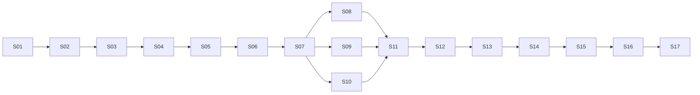

# Roadmap, milestones, and releases

> Part of the local-ai-nas development plan (see [PLAN_INDEX.md](PLAN_INDEX.md)). Moved unchanged from `plan.md` section 9, 10, 10.1, 10.17, 10.18, 11, 11a–11d in version 1.9.0 (ADR-0044).

## 9. Development methodology

Work is **stage-gated** and governed by `code-agent-docs/RULES.md`.

- **Hierarchy (R3): Stage → Substage → Task.**
  - **Stages** (`S01`…`S17`) and **substages** (`S01.1`…) are defined in this plan for the whole roadmap, with goal, scope, deliverables, dependencies, requirements, acceptance criteria, risks, and status.
  - **Tasks** (`S01.3-T02` = task 2 of substage S01.3) are defined in the stage document `stages/S<NN>-<slug>.md`. It is written **just in time**, before the stage starts, and must be approved by the user before any code for that stage is written.
- **Lifecycle:** `Planned → Approved → In Progress → Testing → Review → Done` (or `Blocked`). Substages and tasks use the same values, plus `Not started`.
- **Decisions** become ADRs (R5), Accepted only with user approval. Stage documents list the ADRs they depend on. Tasks that depend on unaccepted ADRs say so.
- **Engineering (R6):**
  - One task at a time.
  - **Code first, written to be testable.** Each stage's tests (unit, integration, and system/application) are written in its final testing substage, including the regression tests for bugs recorded during the stage (the user's instruction, S006).
  - Lint, format, type checks, and the existing tests pass, and the task was checked by running it, before a task is Done.
  - Every dependency is justified and license-checked.
- **Git (R7):** one feature branch per stage or task off `develop`, a PR into `develop`, Conventional Commits with task IDs (e.g. `feat(files): add range downloads [S01.3-T06]`).
- **Recording (R2, R8):** continuous session logs, and `CURRENT_STATE.md` always states the exact next step.
- **Plan changes (R4):** archive, version bump, revision entry. Approving this plan makes it **1.0.0**.
- **Every stage ends** with a testing and review substage: it writes and runs the stage's unit, integration, and system/application tests, then documentation, completion record, and user sign-off (section 2b). Coverage of at least 80% is one of its exit criteria. CI reports coverage on every push without blocking during the stage (S006).
- **Documentation audits (R12):** that final substage also runs a documentation audit with `templates/audit-checklist.md`. Audits are numbered A001, A002, … and reported in `code-agent-docs/audits/`. Critical findings must be fixed or escalated before the stage is Done.

---

## 10. Stage roadmap

### 10.1 Overview

| ID | Name | Origin | Goal | Depends on | Status |
|---|---|---|---|---|---|
| S01 | Basic NAS implementation | User-defined | A reliable storage service that manages the files area through an API, with the two-area layout in place. | Plan baseline approval | Done |
| S02 | NAS GUI | User-defined | A graphical application that lets people use the NAS without touching the API. | S01 | **Done** |
| S03 | Security | User-defined | Comprehensive security so the NAS can be safely reached from the local network (single admin). | S01, S02 | **Approved** (2026-09-29, S007 E050; `stages/S03-security.md`); In Progress from S03.1-T01 |
| S04 | Media management | User-defined | A separate photos area with Google Photos style management. | S03 | Not started |
| S05 | Media metadata | User-defined | Every photo has a sidecar JSON file that is the source of truth for its metadata. | S04 | Not started |
| S06 | Search | User-defined | Fast, forgiving search across both files and photos. | S05 | Not started |
| S07 | Multi-user and sharing | User-defined | Multiple users with private files and photos by default, and explicit sharing. | S06 | Not started |
| S08 | Data protection and recovery | Planner-proposed | Recovery paths for accidental deletion and corruption: trash, integrity, backups, disaster recovery. | S07 | Not started |
| S09 | Network file access and external change sync | Planner-proposed | The NAS as a network drive with per-user permissions, and live sync of external changes. | S07 (S08 recommended first) | Not started |
| S10 | Admin console: monitoring, quotas, and system settings | Planner-proposed; the admin console is the user's requirement (S007) | The admin console completed: visibility and control over storage, health, background work, settings, and logs, with every admin function in one place. | S07 | Not started |
| S11 | Duplicate and look-alike management | User-defined (P005; burst grouping added by the user in S007) | Exact and resolution-variant photo duplicates, look-alike stacks and bursts, and duplicate files with shortcuts, found within each user's library and resolved safely. | S08, S09, S10 | Not started |
| S12 | Storage optimization | User-defined (P005) | Users shrink existing and future photos and videos by resolution and quality, with a live preview, metadata kept, and an undo window. | S11 | Not started |
| S13 | Dependency security review _(new in 1.9.0)_ | User-defined (S007: the user's requirement and placement) | Every first-party and third-party component is inventoried and checked for known issues, vulnerabilities, and exploits; fixed versions are adopted, else unaffected earlier versions, else mitigations or accepted risks; the check becomes a repeatable procedure. | S08–S12 | Not started |
| S14 | Packaging, deployment, and pre-AI release (was S11, then S13 until 1.9.0) | Planner-proposed | Hardened, packaged, documented, stable release without AI. | S08–S13 | Not started |
| S15 | Drives, pools, and drive lifecycle | User-defined (P005, P007; scope and position set by the user in S007) | New drives detected and used through a wizard (upgrade, mirror, replacement, growth, retirement), and RAID 0 and RAID 1 pools built from the admin console on Linux, with exact capacity figures and safe failure handling. Complex RAID is deferred (11a). | S14 | Not started |
| S16 | SSD caching | User-defined (P007) | If configured, the most-used and large files and photos are served from an SSD, and internal data can live on fast storage, with no risk to data if the SSD fails. | S15 | Not started |
| S17 | AI features (was S12, then S15, then S16) | User-defined (always last, I8) | Optional, fully local AI that classifies photos and groups faces, stored in sidecars and used by search. | S16 | Not started |

**Substage count:** S01: 7 · S02: 8 · S03: 9 · S04: 9 · S05: 8 · S06: 8 · S07: 7 · S08: 7 · S09: 6 · S10: 6 · S11: 8 · S12: 8 · S13: 7 · S14: 10 · S16: 12. That makes **120 substages** (S04.8 added in 0.4.0; S11, S12, S14, and S16.11 added in 1.4.0, P005). S01 is Done and S02 is In Progress; all others are Not started. No listed substage was removed or merged. Stage IDs changed in 1.4.0 (table in 10.18). Additions and flags are listed in 10.17.

**Substage count since 1.7.0:** S01: 7 · S02: 8 · S03: 10 · S04: 9 · S05: 8 · S06: 8 · S07: 7 · S08: 7 · S09: 6 · S10: 7 · S11: 8 · S12: 8 · S13: 7 · S14: 13 · S15: 8 · S16: 12, **133 substages** (1.7.0 adds S03.9, S10.6, S14.9–S14.11, and the eight S15 substages).

**Substage count since 1.9.0:** S01: 7 · S02: 8 · S03: 10 · S04: 9 · S05: 8 · S06: 8 · S07: 7 · S08: 7 · S09: 6 · S10: 7 · S11: 8 · S12: 8 · **S13: 6** · S14: 7 · S15: 13 · S16: 8 · S17: 12, **139 substages** in **17 stages** (1.9.0 inserts the dependency security review as S13 before packaging, the user's requirement; the later stages move up by one, table in 10.18). The count lines above use the IDs of their time.

**Field legend for substages:** Goal · Scope · Deliverables · Depends on · Requirements · Acceptance criteria · Risks/notes · Status.

---

### 10.17 Changes to the listed substages (flagged for user approval)

**Approved by the user in S005 (decision D-02, "Accept all (Recommended)"): items 1–7 below.**

No listed substage was removed or merged away. (Renumbering: item 7 below, and the 1.4.0 changes in 10.18.) The planner made these additions and flags:

1. **Execution order in S01:** S01.6 (path resolver, name validation) and S01.5 (API conventions) are built **before** S01.3 in the task order, because S01.3 uses them. The substage numbering is unchanged. The order is recorded in `stages/S01-basic-nas.md`.
2. **Execution order in S04:** S04.3 (job system) is built before S04.4 and in parallel with S04.2. The numbering is unchanged.
3. **S03.2 added scope:** a CLI admin password reset. (0.3.0: the internal-database ADR originally added here was superseded, because SQLite exists from S01 per ADR-0007. S03.2 now adds user and session tables via migrations and benchmarks the Argon2id parameters.)
4. **S04.2 added scope (pending Q39):** server-side import from a host folder.
5. **S14.7 added scope** _(S11.7 when approved)_**:** the stage review (final integration tests, documentation, completion record, sign-off), because P002 requires every stage to end with a testing and review substage and the listed S14.7 covered only the release.
6. **S17.6 added scope** _(S12.6 when approved)_**:** rejecting AI tags (existing FR-038), alongside the face corrections.
7. **S04.8 added (0.4.0):** video streaming and quality levels, at the user's request (S004 E005/E008, ADR-0020). The listed testing substage was **renumbered from S04.8 to S04.9** so that it stays last. Approval of the renumbering goes with the baseline.

**Added in 1.4.0 (P005, S007): flagged for the user's review with the P005 report.**

8. **New stages S11, S12, and S15** (the user's features from P005; burst grouping added by the user in S007, E004). Planner additions inside them are labelled **[Planner addition]** in section 3 and listed in the P005 report, for the user to accept or remove.
9. **Pool scope and position (the user's decision in S007, E008):** S15 builds RAID 0 and RAID 1 only and comes last before AI. Parity layouts, virtual drives, nesting, and SnapRAID with mergerfs are deferred to 11a with their full specification.
10. **Renumbering:** packaging S11 → S13, AI S12 → S16, the AI evaluation substage S12.11 → S16.12 (table in 10.18). P005 proposed S11 → S14; the user's S007 order puts packaging before the pools, so the final mapping is S11 → S13. _(1.9.0: with the new S13, the dependency security review, packaging is S14 and AI S17; the AI evaluation substage is S17.12.)_
11. **S17.11 added:** AI-assisted library cleanup (P005). Duplicate and similar-photo detection removed from S17.10 (FR-142 moved to S11 and S17.11).
12. **P005 notes on existing substages:** S01.2, S01.3, S01.4 (follow-up tasks in a Done stage, timing per Q50), S03.1, S04.2, S04.4, S05.1, S05.3 (burst identifiers, planner fix), S06.1, S08.1, S08.5, S09.2, S10.1, S10.2, S10.3, and S14.2. Each is labelled "P005" in its substage.

### 10.18 Stage ID changes

Documents written before a change keep the IDs of their time. Session logs, prompts, archived plans, completion records, and ADR history are records and are **not rewritten** (R2, R5); read them through this table. Current documents use the new IDs.

| Old ID | New ID | Changed | Reason and reference |
|---|---|---|---|
| S04.8 (testing and stage review) | S04.9 | 0.4.0 (S004) | S04.8 became video streaming; 10.17 item 7. |
| S11 (packaging, deployment, and pre-AI release) | S13 | 1.4.0 (2026-09-28, S007) | New stages S11 and S12 come first (P005); the user's order in S007 (E008). |
| S11.1–S11.7 | S13.1–S13.7 | 1.4.0 | Same substages, same order. |
| S12 (AI features) | S15 | 1.4.0 | AI stays last (I8). |
| S12.1–S12.10 | S15.1–S15.10 | 1.4.0 | Same substages, same order. |
| S12.11 (evaluation, packaging, and stage review) | S15.12 | 1.4.0 | S15.11 (AI-assisted library cleanup) inserted before it (P005). |
| none | S11, S12, S14, S15.11 | 1.4.0 | New (P005; S14 scope per the user in S007). |
| Plan sections 10.12, 10.13, 10.14 | 10.14, 10.16, 10.17 | 1.4.0 | New sections 10.12 (S11), 10.13 (S12), 10.15 (S14), and 10.18 (this table). |

| S15 (AI features) | S16 | 1.7.0 (2026-09-29, S007) | SSD caching inserted before AI (P007); AI stays last (I8). |
| S15.1–S15.12 | S16.1–S16.12 | 1.7.0 | Same substages, same order. |
| S14.9 (storage GUI), S14.10 (testing and stage review) | S14.12, S14.13 | 1.7.0 | New S14.9–S14.11 (P007). |
| S03.9 (security testing and stage review) | S03.10 | 1.7.0 | New S03.9, the admin console foundation (the user's requirement). |
| S10.6 (testing and stage review) | S10.7 | 1.7.0 | New S10.6, admin console completeness. |
| none | S15 (SSD caching), S03.9, S10.6, S14.9–S14.11 | 1.7.0 | New. Plan section 10.15a holds S15, so the section numbers 10.16–10.18 stay. |

| S13 (packaging, deployment, and pre-AI release) | S14 | 1.9.0 (2026-09-30, S007) | The dependency security review is inserted before packaging (the user's requirement and placement). |
| S13.1–S13.7 | S14.1–S14.7 | 1.9.0 | Same substages, same order. |
| S14 (drives, pools, and drive lifecycle) | S15 | 1.9.0 | |
| S14.1–S14.13 | S15.1–S15.13 | 1.9.0 | |
| S15 (SSD caching) | S16 | 1.9.0 | |
| S15.1–S15.8 | S16.1–S16.8 | 1.9.0 | |
| S16 (AI features) | S17 | 1.9.0 | AI stays last (I8). |
| S16.1–S16.12 | S17.1–S17.12 | 1.9.0 | |
| none | S13 (dependency security review), S13.1–S13.6 | 1.9.0 | New. Plan section 10.13a holds it, so the section numbers 10.14–10.18 stay. |

**Watch for reused IDs:** before 2026-09-28, "S11" meant packaging and "S12" meant AI. Since 1.4.0 they mean duplicates and storage optimization. Audit group K checks that current documents never use an old ID in its old meaning. **Since 1.7.0 (2026-09-29), "S15" means SSD caching; before, it meant AI (now S16).** **Since 1.9.0** (the user's requirement): S13 means the dependency security review (packaging from 1.4.0 to 1.8.1), S14 packaging (drives before), S15 drives (SSD caching before), S16 SSD caching (AI before), and S17 AI.

---

## 11. MVP definition

**Decided by the user in S005 (Q38, D-08): the first usable release is milestone M3, then stages S01–S11 (through the pre-AI release). No not-scheduled candidates were added (Q37).**

**Re-evaluated in 1.7.0 (P007):** M3 also includes the P007 MVP additions (predictive drive health, FR-332; the migration engine with its command line and console page, FR-333; pending Q67) and the admin console foundation (S03.9). M4 becomes **"Drives and storage"**: S15 and the new S16 (SSD caching). AI is S17.

**Re-evaluated in 1.6.0 (P006):** M3 is S01–S14 **plus the P006 MVP additions** (FR-217–FR-221: Live Photos and motion photos, the phone auto-backup bridge, alert delivery), pending Q54. After M4 (drive pools) come the releases R01–R12 (section 11b), then AI (M5, I8). The order of pools, releases, and AI is asked in Q52 and Q53.

**Re-evaluated in 1.4.0 (P005):** the pre-AI release is now S14, and the new stages S11 (duplicates and look-alikes) and S12 (storage optimization) come before it, so M3 is **S01–S14**. Drive pools (S15) come after the release, as the user placed them "in the end" (S007), so M3 does not wait for them. The user is asked to confirm this in **Q51**.

| Milestone | Stages | What the user gets | Reasoning |
|---|---|---|---|
| **M1: Secure single-admin NAS** | S01–S03 | Files area over a GUI, secure on the LAN | First point where the NAS may leave localhost (NFR-020). Useful, but it is only a file store. |
| **M2: First usable release (recommended MVP)** | S01–S06 | Files + photos library (timeline, albums, viewer, sidecar metadata, places) + forgiving search with operators; single admin | Delivers the README's core non-AI value, the user's first six stages, and a complete single-user experience. Deployable with the S01.1 Docker setup and documentation. _1.9.0 (the user's decision D7):_ an **internal alpha** at M2 for the user's own daily use, not a public release; safe because trash comes early (FR-354). |
| **M3: Stable pre-AI release (chosen as the first usable release, S005)** | S01–S14 plus the P006 MVP additions (FR-217–FR-221, pending Q54) | Multi-user, sharing, trash and backups, network drives, admin, duplicates and look-alike stacks, storage optimization, packaging | The release the user's roadmap defines (S14.7). _1.4.0:_ includes S11 and S12 (to be confirmed, Q51). |
| **M4: Drives and storage** _(1.4.0, P005; renamed in 1.7.0, P007)_ | S01–S16 | The drive lifecycle (new drives, upgrades, mirrors, replacements, growth, retirement) and RAID 0 and RAID 1 pools from the admin console (Linux), and optional SSD caching | An update to the stable release (suggested v1.1.0); the complex RAID follows later (11a). |
| **R01: Migration and portability** _(1.6.0, P006; planned)_ | M4 + R01 | Make switching from Google Photos, iCloud, and other clouds painless, and make leaving local-ai-nas just as easy. | Suggested label v1.2.0 (Q63). Becomes a stage just in time (11b.1). |
| **R02: Everyday essentials** _(1.6.0, P006; planned)_ | M4 + R02 | Close the daily-use gaps in both areas that users notice in the first week. | Suggested label v1.3.0 (Q63). Becomes a stage just in time (11b.1). |
| **R03: Family sharing and collaboration** _(1.6.0, P006; planned)_ | M4 + R03 | Match the family features of Google Photos, iCloud, and Google Drive inside the home. | Suggested label v1.4.0 (Q63). Becomes a stage just in time (11b.1). |
| **R04: Data safety plus** _(1.6.0, P006; planned)_ | M4 + R04 | Protection on the level of Dropbox Rewind, OneDrive ransomware recovery, and Synology backup. | Suggested label v1.5.0 (Q63). Becomes a stage just in time (11b.1). |
| **R05: Security and privacy hardening** _(1.6.0, P006; planned)_ | M4 + R05 | Account and data protection at the level expected before any remote access. | Suggested label v1.6.0 (Q63). Becomes a stage just in time (11b.1). |
| **R06: Private remote access** _(1.6.0, P006; planned)_ | M4 + R06 | Reach your NAS from anywhere without exposing it to the whole internet. | Suggested label v1.7.0 (Q63). Becomes a stage just in time (11b.1). |
| **R07: Mobile apps** _(1.6.0, P006; planned)_ | M4 + R07 | Native phone apps that replace the Google Photos, iCloud, and Drive apps. | Suggested label v1.8.0 (Q63). Becomes a stage just in time (11b.1). |
| **R08: Desktop sync and command line** _(1.6.0, P006; planned)_ | M4 + R08 | Replace the Dropbox, OneDrive, and Google Drive desktop clients. | Suggested label v1.9.0 (Q63). Becomes a stage just in time (11b.1). |
| **R09: Public internet release** _(1.6.0, P006; planned)_ | M4 + R09 | Safely expose local-ai-nas to the internet so it can fully replace cloud services, including sharing with people who have no account. | Suggested label v2.0.0 (a major milestone: the NAS can face the internet) (Q63). Becomes a stage just in time (11b.1). |
| **R10: Media center** _(1.6.0, P006; planned)_ | M4 + R10 | Enjoy photos, videos, and music on every screen in the home. | Suggested label v2.1.0 (Q63). Becomes a stage just in time (11b.1). |
| **R11: Documents and office** _(1.6.0, P006; planned)_ | M4 + R11 | Work with documents without Google Docs or Microsoft 365. | Suggested label v2.2.0 (Q63). Becomes a stage just in time (11b.1). |
| **R12: Automation and integrations** _(1.6.0, P006; planned)_ | M4 + R12 | Let power users and other tools build on local-ai-nas. | Suggested label v2.3.0 (Q63). Becomes a stage just in time (11b.1). |
| **M5: AI release** | S01–S17, after R01–R12 | Auto-classification, face grouping, AI-assisted cleanup, and the approved S17.10 extensions | Always last (I8; the order is asked in Q52). |

**Caveat on M2:** there is **no trash until S08**, so deletes in M2 are permanent (the GUI warns about this). If M2 will hold real data, options are: (a) keep external backups (documented), or (b) move S08.1 (trash) before S07. Option (b) is a reorder that needs approval, and the trash would first be single-user and then extended in S07.

---

## 11a. Not scheduled / future candidates

Not stages. If any is approved later, it is inserted **before** the AI stage and the AI stage (S17 since 1.9.0) is renumbered (I8). The user is asked in Q37.

| Candidate | Notes |
|---|---|
| ~~Mobile app with automatic photo backup from phones~~ **Scheduled in 1.6.0 (P006)** as R07; the MVP bridges it with WebDAV auto-upload apps (FR-219, FR-220). | Would add a mobile client and a background upload protocol (tus fits). Photos go into the user's `photos/` namespace. |
| ~~Public share links for people without an account~~ **Scheduled in 1.6.0 (P006)** in R09 (FR-294 and 11c). | Needs expiring, revocable tokens and a hardened unauthenticated surface. It weakens the LAN-only posture, so a threat model update is needed. |
| ~~Secure remote access from outside the local network~~ **Scheduled in 1.6.0 (P006)** as R06 (private) and R09 (public). | Options: documented VPN (Tailscale/WireGuard), or a reverse proxy with HTTPS. Must not require any cloud service by default (I6). |
| **Advanced drive pools ("complex RAID")** _(1.4.0; deferred by the user in S007: "leave complex raid for later as planned non implemented work")_ | **Planned, not implemented.** _(1.6.0: unchanged; it can become a release later, before AI, I8.)_ Specification kept from P005: dedicated parity, "RAID 4 style" (FR-197); distributed and double parity, RAID 5 and RAID 6 (FR-199); combining smaller drives end to end into a **virtual drive** that can be a member of a striped or parity pool (FR-198); nesting (e.g. RAID 10, parity over virtual drives); the unused space of larger members as a separate volume (FR-201); SnapRAID with mergerfs as the option for mixed-size media drives. **The user's example is the acceptance test:** drives of 2, 1, 1, 2, 2, 2 TB; the two 1 TB drives combined into a 2 TB virtual drive; the members 2, 2, 2, 2, 2 TB in a parity layout give 8 TB usable and survive one failed member. **Before building:** mdadm's parity write hole (a journal or the partial parity log, 8.25), nesting md arrays and their assembly at boot (only partly verified in S007), and whether SnapRAID fits. The S15 layout model is built so this candidate needs no migration of existing pools. If approved, it is inserted before the AI stage (I8). |
| Video resolution variants as duplicates _(1.4.0, P005)_ | Finding the same video at another resolution (S11 covers exact video duplicates only). Needs a video fingerprint (e.g. perceptual hashes of sampled frames). |
| Write-back SSD caching _(1.7.0, P007)_ | New data kept only on the SSD for a while is lost if a single SSD fails, so it could only come with a mirrored pair of SSDs with power-loss protection, a new ADR, and the user's approval. |

**Considered and excluded (1.6.0, P006).** Found in the research (R001) and left out on purpose; none is a requirement. The user can bring any back (Q65). X-04 (groupware) and X-06 (federation) stay as not-scheduled candidates.

| ID | Feature | Seen in | Reason |
|---|---|---|---|
| X-01 | Generative AI: Ask Photos, Magic Eraser, Moods, Remix, AI summaries and chat over files | Google Photos, Google Drive, OneDrive, Nextcloud | Non-goal NG9 (generative AI) and I4 (no AI at query time). |
| X-02 | Chat, video calls, meetings | MEGA, Nextcloud Talk | Outside the purpose of a NAS. |
| X-03 | Password manager and general-purpose VPN service | MEGA Pass, MEGA VPN | Outside the purpose of a NAS. (The private-access VPN in R06 only reaches the NAS.) |
| X-04 | Calendar, contacts, and mail (CalDAV, CardDAV, webmail) | Nextcloud | Groupware, not storage. Kept as a not-scheduled candidate in 11a. |
| X-05 | Print store and photo books | Google Photos | A commercial fulfilment service, not software. |
| X-06 | Federated sharing between separate servers | Nextcloud | Large security surface; kept as a not-scheduled candidate in 11a. |
| X-07 | Enterprise governance: legal hold, eDiscovery, sensitivity labels, data rooms | Nextcloud Enterprise, Box, Tresorit | Outside the household and small-group scope. |
| X-08 | Professional media review workflow (frame-accurate review and approvals) | Dropbox Replay | Niche; comments (G-045) cover the basics. |
| X-09 | Hosting apps, containers, and virtual machines | Synology, TrueNAS | Outside scope; the plugin system (G-144) is the extension point. |
| X-10 | Vendor-operated relay or account service (QuickConnect-style) | Synology | Conflicts with I6 and NG1. The self-hosted relay (G-072) covers the need. |
| X-11 | Phone-number (SMS) two-factor authentication | Icedrive, Tresorit | Needs a paid SMS gateway and is weaker than TOTP and passkeys. |
| G-016 | External read-only libraries (index a host folder in place) | Immich, Nextcloud | Conflicts with I1 and A3 (a third source of media); excluded unless the user decides otherwise (Q58). |

---

## 11b. Release roadmap after the MVP (new in 1.6.0, P006)

The user asked for this roadmap (quoted verbatim, P006):

> "this is the current plan of the project, now, go through the internet, search for all kinds of cloud storage services, like google drive, onedrive, dropbox, proton drive, and everything, and record everyone's features in the apps, and make list of all the features that is not in my project, then make a detailed json prompt of adding the features as part of future releases, and that they should be developed and released in a planned manner like in versions, or you can say a set of features at a time of release, but they shouldnt be part of the first release (that is the mvp aka minimum viable product) but if they are something that should be a must have then include them in mvp."

> "my project of nas should make every other (or atleast most of them) cloud storage services useless except that my project is currently limited to local hosting, add a future release of public release too but that is very crucial too due to severe UI/UX reasons and also severe security reasons"

**Goal G13** (section 2). Features found in competitors but missing from the plan are planned as releases, each a fixed set of features, developed and shipped one release at a time. They are not part of the MVP, except the must-haves in section 3.1 (FR-217–FR-221). The research, with every source, is `research/R001-2026-09-28-cloud-storage-feature-research.md`.

**Order** (default, keeping invariant I8 exactly as written; updated in 1.7.0): MVP (S01–S14, v1.0.0) → S15 drives, pools, and drive lifecycle and S16 SSD caching (v1.1.0, milestone M4 "Drives and storage") → R01 … R12 (v1.2.0 …) → S17 AI (always last). See Q52 and Q53 for the alternatives the user may choose.

| ID | Suggested label | Theme | Goal | Features (FR IDs, section 3.3) | Prerequisites | Exit criteria | Status |
|---|---|---|---|---|---|---|---|
| R01 | v1.2.0 | Migration and portability | Make switching from Google Photos, iCloud, and other clouds painless, and make leaving local-ai-nas just as easy. | FR-222–FR-227 (6) | MVP; G-001 Live Photos | A 50,000-item Takeout archive imports with correct dates, places, descriptions, albums, and favorites on the fixture set An exported library re-imports into a fresh install with nothing lost Every import shows a dry-run report and can be undone within the trash window | Planned _1.9.0:_ FR-222 extended by the user's requirement (Drive and Photos with everything Google recorded, Must); **prerequisite:** the user's Takeout sample data, analyzed before the stage document (A28, 8.42). |
| R02 | v1.3.0 | Everyday essentials | Close the daily-use gaps in both areas that users notice in the first week. | FR-228–FR-243 (16) | MVP | Each feature works in both light and dark themes and on phone layouts Map and memories work with no internet access Archive extraction passes zip-bomb and traversal tests | Planned |
| R03 | v1.4.0 | Family sharing and collaboration | Match the family features of Google Photos, iCloud, and Google Drive inside the home. | FR-244–FR-253 (10) | MVP (S07); R02 recommended (smart albums, recent files) | Cross-user leak tests (S07.7 suite) extended to groups, partner sharing, collaborative albums, comments, and activity pass Revoking access removes items from search, feeds, and notifications immediately | Planned |
| R04 | v1.5.0 | Data safety plus | Protection on the level of Dropbox Rewind, OneDrive ransomware recovery, and Synology backup. | FR-254–FR-261 (8) | MVP; File versioning (G-004 / Q34); Alert delivery (G-003) | A simulated ransomware run over WebDAV is detected, paused, and fully rewound in tests A full restore from an off-site backup to a fresh install passes Recovery documentation is tested by following it step by step | Planned |
| R05 | v1.6.0 | Security and privacy hardening | Account and data protection at the level expected before any remote access. | FR-262–FR-271 (10) | MVP | Threat model updated; security tests for every login path, including SSO and passkeys, pass Locked-folder items never appear in any listing, search, share, or network share in leak tests | Planned |
| R06 | v1.7.0 | Private remote access | Reach your NAS from anywhere without exposing it to the whole internet. | FR-272–FR-277 (6) | R05 (2FA and brute-force protection) | A phone on mobile data behind CGNAT reaches the NAS over the VPN and through the relay in tests No port is opened to the public internet by any R06 feature | Planned |
| R07 | v1.8.0 | Mobile apps | Native phone apps that replace the Google Photos, iCloud, and Drive apps. | FR-278–FR-287 (10) | R06 (remote access for backup away from home); NG2 change (Q56) | Backup of 10,000 phone photos completes in the background on both platforms with no duplicates and no missing items App store and F-Droid publishing requirements reviewed (user decides where to publish) | Planned |
| R08 | v1.9.0 | Desktop sync and command line | Replace the Dropbox, OneDrive, and Google Drive desktop clients. | FR-288–FR-293 (6) | R04 (versions and rewind protect against sync mistakes); R06 recommended | Sync stress tests (renames, moves, conflicts, offline edits, interrupted transfers) end with identical trees and no data loss The client never deletes server data because of a local error; mass deletions ask for confirmation | Planned |
| R09 | v2.0.0 (a major milestone: the NAS can face the internet) | Public internet release | Safely expose local-ai-nas to the internet so it can fully replace cloud services, including sharing with people who have no account. | FR-294–FR-307 (14) | R03 (sharing model); R04 (rewind and off-site backup); R05 (2FA, passkeys, malware scanning, brute-force protection); R06 (certificates and connectivity); R07 and R08 recommended (clients benefit most) | See 11c, release gates | Planned |
| R10 | v2.1.0 | Media center | Enjoy photos, videos, and music on every screen in the home. | FR-308–FR-316 (9) | MVP (video streaming); Q57 for editing | The stage's testing substage (11b.1) | Planned |
| R11 | v2.2.0 | Documents and office | Work with documents without Google Docs or Microsoft 365. | FR-317–FR-322 (6) | R08 (file locks); G-004 versions | The stage's testing substage (11b.1) | Planned |
| R12 | v2.3.0 | Automation and integrations | Let power users and other tools build on local-ai-nas. | FR-323–FR-327 (5) | R05 (token scopes and security) | The stage's testing substage (11b.1) | Planned |

### 11b.1 Release process

The rules below are also rule **R13** in `RULES.md` (pre-approved in P006).

1. Release IDs R01, R02, … are permanent, like FR IDs. A release has: a theme, a goal, a fixed feature set (gap IDs and FR IDs), prerequisites, exit criteria, and a suggested version label.
2. The MVP is milestone M3 (S01–S14 plus mvp_additions) and ships as the first stable release. Suggested label v1.0.0; the user decides (S14.7).
3. Feature releases bump the MINOR version (v1.1.0, v1.2.0, …). Fix-only releases bump PATCH and can ship at any time between feature releases. A release that breaks the data format or the upgrade path bumps MAJOR and needs the user's approval.
4. One feature release is in progress at a time. Security fixes take priority over all feature work.
5. Just-in-time conversion: when a release is next, its features become one stage (or several), with substages written into plan.md, inserted before the AI stage as I8 requires, and the AI stage is renumbered (record it in the 10.18 table). Then the stage document is written and approved before any code (R3).
6. Feature freeze: once a release's stage document is approved, adding a feature to it needs the user's approval. Otherwise the feature goes to a later release.
7. Every release ends with its stage's testing and review substage, plus: an upgrade test from the previous release with real migrated data, a security review of every new surface (threat model updated), release notes and a changelog, updated user and admin guides, the R12 documentation audit, a tagged release, and the user's sign-off.
8. Every release keeps the system upgradeable from the previous release (NFR-017) and keeps the NAS fully working with AI disabled (I7).
9. Features that use the network (imports from other clouds, off-site backup, ACME certificates, DDNS, email, push, tunnels) are off by default and switched on explicitly by the user (I6).
10. Reordering releases, splitting them, or moving a feature between releases needs the user's approval and a plan revision (R4).
11. Features in a release that depend on an AI result (e.g. smart albums by person) work without AI, and gain the AI filter when S17 lands.

### 11b.2 Conflicts and decisions

Recorded where they apply; none is resolved silently. Features that depend on an unapproved change are marked with their question and stay planned.

- **I8 (AI always last) and the new releases:** Keep I8 exactly: releases R01–R12 come before S17 by default. This delays AI until after all releases. Ask Q52.
- **Position of the new releases relative to S15 (pools):** Default: S15 stays right after the MVP (milestone M4), and the releases follow it. The user earlier placed pools 'in the end'. Ask Q53.
- **NG5 (no remote access, no public links):** Reversed by the user's message 2 (public release). Change NG5 to point to R06 and R09, quoting the user. This is approved by this prompt.
- **NG1 (no cloud sync, cloud backup, or hosted component):** R01 (imports from clouds) and R04 (off-site backup) use remote services the user chooses. Propose rewording NG1: 'No hosted service operated by the project and no dependency on one; connections to third-party or user-owned remote services only as explicit opt-in features (I6).' Ask Q55.
- **NG2 (no native mobile apps):** R07 needs it reversed. Recommended, given the goal of replacing cloud services. Ask Q56.
- **NG3 (no photo editing):** R10 editing is non-destructive and never touches originals. Propose rewording NG3 to 'no destructive editing'. Ask Q57.
- **I1 and A3 (two areas only):** External read-only libraries (G-016) would add a third source of media. Excluded by default. Ask Q58.
- **I5 with groups, partner sharing, public links, DLNA:** All remain explicit shares, enforced server-side. DLNA serves only folders the admin marks for the household.
- **I6 (no network calls unless enabled):** Every network-using feature is off by default: email and webhook alerts, cloud imports, off-site backup, ACME, DDNS, push, map tiles online, update check, tunnels.
- **I10 (preview, confirmation, undo):** Applies to imports, batch rename, rewind, free-up-space on phones, bulk metadata edits, and account deletion.
- **NG9 (no generative AI):** Unchanged. Generative features are excluded (X-01).

---

## 11c. Public release specification (R09) (new in 1.6.0, P006)

**Principle.** [User requirement, emphasized] Security and UI/UX are release-blocking for R09, not polish. R09 ships only when every gate in release_gates passes. If a gate cannot be met, the release is delayed, never shipped with a known gap.

Gaps covered: G-100 to G-107, G-113 → public sharing features; G-108 internet-facing hardening → security design; G-109 go-public readiness gate → go public wizard; G-110 external audit and staged beta → release gates; G-111 UX overhaul for public use → ui ux requirements; G-112 reverse proxy and tunnel support → connectivity. FR-294–FR-307 (section 3.3) and NFR-040–NFR-043.

### Security design

- Threat model rewritten for internet exposure: anonymous attackers, credential stuffing, automated scanners, abuse of public links and upload links, denial of service, stolen phones, malicious invited users, and compromise of the relay VPS.
- Public edge separation (ADR): anonymous public-link traffic is handled by a restricted handler (or a separate process or port) that can only resolve link tokens and serve the linked items. It cannot reach admin, user-management, or internal APIs.
- The admin interface and admin API are reachable only from the LAN or the VPN by default. Changing this needs an explicit setting with a warning.
- Mandatory 2FA (TOTP or passkey) for every admin before exposure; the admin chooses whether it is mandatory for all users (recommended).
- HTTPS only, with a trusted certificate (R06), HSTS, modern TLS settings, a strict Content Security Policy, and all security headers; HTTP only redirects.
- Rate limits and brute-force protection per IP, per account, and per link (R05), with progressive delays and temporary bans; request size limits, timeouts against slow-request attacks, and limits on concurrent transfers per user and per link.
- Trusted-proxy configuration so client IPs are correct behind a reverse proxy or relay (G-069).
- Malware scanning (R05) is required for every file received through public upload links, with quarantine before it becomes visible to the owner.
- Server-side request forgery protection for any feature that fetches URLs (imports, webhooks, link previews).
- Session security for the internet: shorter idle timeouts for new devices, re-authentication for sensitive actions (change password, 2FA, create public link to a whole folder, delete account), and login alerts (R05).
- Signed releases, a software bill of materials, and an optional, explicit update check that only downloads a signed version manifest (I6: off by default, switched on in the go-public wizard). A security advisory must be able to reach admins who opt in.
- SECURITY.md with a disclosure policy, a security.txt, and an incident-response runbook (revoke all links, force logout, rotate secrets, restore from backup).
- Fuzzing of every unauthenticated endpoint (link tokens, login, upload links) in CI.

### Public sharing features

- G-100 Public links: unguessable tokens of at least 128 bits; optional password; expiry on by default (e.g. 30 days, configurable, 'never' possible only with a warning); download limit; view-only mode that hides download buttons (stated honestly as best-effort); revoke; optional custom readable slug; QR code; public album pages with a clean gallery.
- G-101 File requests: upload-only links with size, type, and count limits, uploader name and optional email, expiry, a per-link quota counted against the owner, malware scanning, and a notification to the owner; uploaders never see other uploads.
- G-102 Send large files: an expiring transfer with optional password and a notification when downloaded; stored in internal data until expiry and counted against the sender's quota.
- G-103 Optional guest verification by email code before a link opens (uses the MVP email channel).
- G-104 Per-link access log (time, approximate client, action) visible to the owner, and optional notifications on first open and each download.
- G-105 Could: watermarks on previews of shared items (viewer email or custom text).
- G-106 Could: share pages with the owner's name and optional logo and colors.
- G-107 Accounts for people outside the home: invitation links created by the admin (no open registration by default, Q60), email verification, per-user bandwidth and transfer limits, and admin tools to disable a link or user and see abuse reports.
- G-113 Operator guidance: the NAS owner is the host of everything shared; a template of house rules for invited users; how to respond to a complaint.

### Connectivity

- Supported exposure methods (Q61): (1) port forwarding to the NAS or to a reverse proxy, (2) the user's own VPS relay over WireGuard (G-072, works behind CGNAT), (3) documented reverse proxies (Caddy, Traefik, nginx) with tested configurations (G-112).
- Third-party tunnels that terminate TLS (e.g. Cloudflare Tunnel) are documented only with a clear warning that the provider can see the traffic (I6).
- Never use UPnP automatic port opening.
- An outside-in reachability test through the user's own relay or by guiding the user to open the site on mobile data.

### Go-public wizard

- G-109 A step-by-step wizard in plain language that explains the risks and checks readiness before exposure is switched on: admin 2FA enabled, trusted certificate valid, off-site backup configured and recent (R04), software current with no known security advisories, malware scanning on, strong passwords for all users, link defaults (expiry on) reviewed, alert channel working.
- The wizard refuses to enable exposure until every required check passes, shows how to fix each failed check, and keeps monitoring afterwards (certificate expiry, failed-login spikes, overdue backups), alerting and offering a one-click 'go private again'.

### UI and UX requirements

- Design for two audiences: the owner, and recipients who have no account, are often on a phone, on a slow network, and have never heard of the NAS. A recipient must understand within seconds who shared what, until when, and how to view or download it.
- Mobile-first share and upload pages with performance budgets on a mid-range phone over a throttled 4G profile (e.g. first view under 2.5 s, set in the stage document) and progressive image loading.
- Clear, human error and permission messages everywhere (expired link, wrong password, upload too large, account locked), with no technical jargon or stack traces.
- Accessibility: WCAG 2.2 AA audit of all public pages and main owner flows.
- Internationalization framework with right-to-left support; the first extra languages are decided by the user (Q15; Urdu recommended since the user is in Pakistan).
- A consistent design system across web, mobile apps, and share pages; empty states and onboarding for new invited users; a help center in the documentation.
- Moderated usability tests with at least five non-technical people for: opening a shared album on a phone, uploading through a file request, and an owner creating and revoking a link. Fix every blocking issue before release.
- A visible trust layer: link expiry and access information shown to recipients, 'shared by' identity, and a clear indicator for the owner of everything currently public (a 'public items' dashboard with one-click revoke).

### Release gates (all must pass)

- An independent penetration test or security audit of the internet-facing surface, by someone other than the implementing agent, with no open critical or high findings.
- The updated threat model has every item mitigated or documented as an accepted risk by the user.
- Automated security tests (authorization on every public route, link-token brute force, upload abuse, rate limits, header checks) and fuzzing pass.
- The go-public wizard blocks exposure on an unprepared system in tests.
- Usability tests completed and blocking issues fixed; the accessibility audit has no open AA failures.
- A private beta with invited external users for an agreed period (e.g. four weeks) with no data-loss or security incident, then a staged rollout.
- Upgrade from the previous release tested; rollback ('go private again') tested.
- Documentation: exposure guide per method, hardening guide, incident runbook, recipient help page.

### Proposed invariant I11

**Proposed only, not in force** (Q66): "Internet exposure is always an explicit admin choice that passes the readiness checks. The admin interface stays reachable only from the LAN or VPN unless the admin separately enables it, and anonymous access is limited to explicit, revocable links." It is added to `RULES.md` and section 2a only after the user approves it.

---

## 11d. Change intake and backlog (new in 1.9.0, the user's decision D6)

After P008 the **MVP scope is frozen** (rule R14). A new request is recorded here and planned into a release after the MVP, unless it is a security or data-integrity fix, a foundation that is cheap only now, or the user explicitly puts it in the MVP. The agent says which case applies when a request arrives.

| Date | Source | Summary | Case | Placed in |
|---|---|---|---|---|
| 2026-09-30 | The user, S007 | Google Takeout import of Drive and Photos with everything Google recorded; sample data first | Feature | R01 (the user's choice), FR-222 extended |
| 2026-09-30 | The user, S007 | A stage that reviews every dependency for known issues and vulnerabilities, upgrading, else downgrading | Security; the user placed it in the MVP | S13 (new, before packaging; the user's choice) |

---
