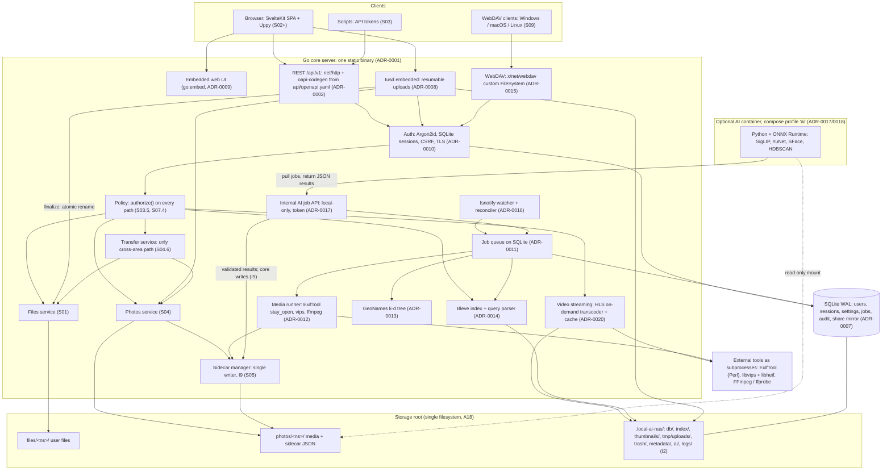
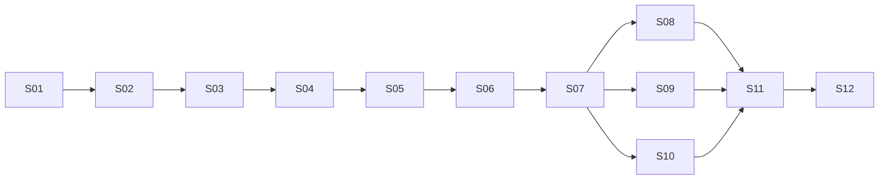

# local-ai-nas: Development Plan

| Field | Value |
|---|---|
| **Version** | 1.1.1 |
| **Status** | **Approved baseline** (approved by the user in S005, 2026-09-24); 1.1.0 adds the user's setup-script requirement (S005 E015) |
| **Last updated** | 2026-09-24 (session S005) |
| **Source of vision** | `README.md` (repository root), the user's staged roadmap (`code-agent-docs/prompts/P002-staged-development-roadmap.json`), and the user's technology stack (`code-agent-docs/prompts/P003-technology-stack.json`) |
| **Previous version** | 1.1.0, archived at `code-agent-docs/archive/plan-history/plan_v1.1.0.md` (0.1.0–1.0.0 also archived there) |

> **This is a living document.** It changes as the user gives feedback. Every change follows `code-agent-docs/RULES.md` **R4**: the old version is archived, the version is bumped, and a revision entry is added. While the plan is a pre-1.0 draft, restructurings bump the MINOR version. **When the user approves this plan as the baseline, it becomes version 1.0.0.**
>
> **Technology decisions** are recorded as ADRs in `code-agent-docs/decisions/` (R5). Since 0.3.0, the user-chosen stack (P003) is **Accepted** (section 7). Items marked *Proposed* or *deferred* in section 7 still need a decision. Every dependency is listed in `code-agent-docs/dependencies.md`.

---

## Contents

1. Project overview
2. Goals and non-goals
2a. Project invariants
2b. Cross-cutting principles
3. Requirements
4. Assumptions
5. Open questions for the user
6. Proposed high-level architecture
7. Chosen technology stack
8. Key technical concerns
9. Development methodology
10. Stage roadmap
11. MVP definition
11a. Not scheduled / future candidates
12. Testing strategy
13. Risks and mitigations
14. Revision history

---

## 1. Project overview

**local-ai-nas** is a self-hosted NAS. It runs on the user's own hardware and serves files to devices on the local network. It is built around a **two-area design**. The storage root holds exactly two user-data areas:

- **`files/`**: a general-purpose file store (documents, archives, anything), managed like a classic NAS.
- **`photos/`**: a separate photo and video library with Google Photos–style management: timeline, albums, viewer, video streaming with live quality switching, place names, and later AI tagging and face groups.

The areas never intersect. Content moves between them only when the user explicitly copies or moves it (invariant I1). Internal application data (database, search index, thumbnails, trash, configuration) lives outside both areas (I2).

Every photo has a **sidecar JSON file** next to it (`IMG_0001.jpg.json`) that is the **source of truth** for its metadata. The search index is a cache that can always be rebuilt from disk (I3).

**Search** covers both areas through one query path. It reads only the index (I4) and is forgiving: word forms (`receipts` → `receipt`), synonyms (`receipts` → `invoice`, `voucher`), typos (`reciept`), and operators such as `before:2026`, `place:karachi`, `in:photos`, and `type:video`.

The system grows into a **multi-user** NAS: each user has private files and photos, and items can be shared explicitly with ownership and read-access data (I5). **Optional, fully local AI** (I6, I7) comes last (I8). It classifies photos (so unlabelled receipts are found by searching `receipts`) and groups faces. Results are stored in the sidecars, so search never runs a model.

**Staged approach.** The work is divided into 12 stages. Each stage is split into substages and, just in time, into tasks (section 9). Every stage ends with a working, tested, demonstrable system (section 2b).

| Stage | Name | Origin |
|---|---|---|
| S01 | Basic NAS implementation (API only, files area, two-area layout) | User-defined |
| S02 | NAS GUI | User-defined |
| S03 | Security | User-defined |
| S04 | Media management (photos area) | User-defined |
| S05 | Media metadata (sidecars) | User-defined |
| S06 | Search (both areas) | User-defined |
| S07 | Multi-user and sharing | User-defined |
| S08 | Data protection and recovery | Planner-proposed |
| S09 | Network file access and external change sync | Planner-proposed |
| S10 | Administration, monitoring, and quotas | Planner-proposed |
| S11 | Packaging, deployment, and pre-AI release | Planner-proposed |
| S12 | AI features (always last) | User-defined |

---

## 2. Goals and non-goals

### Goals
- **G1:** A reliable NAS with a storage root containing two separate user-data areas, `files/` and `photos/`. It is managed first through a versioned API (S01), then through a GUI (S02).
- **G2:** Security suitable for a home LAN: authentication, HTTPS, hardening, audit trail, localhost-only until secure (S03).
- **G3:** A photo library comparable to the core of Google Photos: timeline, albums, viewer, favorites, video playback with live quality switching, and explicit transfer to and from `files/` (S04).
- **G4:** Portable, human-readable, versioned sidecar metadata per photo that stays correct through every operation (S05).
- **G5:** Fast, forgiving search across both areas, with word forms, synonyms, typo tolerance, and operators (S06).
- **G6:** Multiple users with private data by default and explicit sharing, enforced on every access path (S07).
- **G7:** Protection against data loss (trash, integrity checks, backups, recovery), network-drive access, and admin control (S08–S10).
- **G8:** Easy deployment for anyone, and a stable pre-AI release (S11).
- **G9:** Optional local AI for auto-classification and face grouping on CPU-only hardware, with results persisted to sidecars (S12).
- **G10:** Privacy by design at every stage: no telemetry, no cloud, no runtime network calls unless the user enables a feature that needs one.

### Non-goals (at least for now)
- **NG1:** Cloud sync, cloud backup, or any hosted/SaaS component.
- **NG2:** Native mobile apps and automatic phone backup. Listed as a not-scheduled candidate (11a).
- **NG3:** Photo editing, and writing metadata back into original media files (Q19).
- **NG4:** _Changed in 0.4.0:_ video transcoding **for streaming quality levels** is now in scope (S04.8, ADR-0020, the user's request in S004). Re-encoding or converting the original files remains out of scope, because originals are never modified.
- **NG5:** Remote access from outside the LAN and public share links. Both are not-scheduled candidates (11a).
- **NG6:** _Withdrawn in 0.2.0._ The v0.1.0 non-goal "no app-provided SMB/WebDAV" is reversed by stage S09.
- **NG7:** Running AI at search time, and any cloud AI API.
- **NG8:** RAID, volume management, and snapshots. These belong to the host OS. (S10 monitors disk health but does not manage disks.)
- **NG9:** Generative AI features. (OCR and semantic search are optional S12.10 extensions, pending Q36.)
- **NG10:** Any automatic or implicit syncing between `files/` and `photos/` (I1).

---

## 2a. Project invariants

These invariants also live in `RULES.md` ("Project invariants"). **No code or plan change may violate them without explicit user approval.**

- **I1:** The storage root contains exactly two user-data areas: `files/` and `photos/`. They never intersect. An item moves between them only when the user explicitly copies or moves it.
- **I2:** Internal application data (database, search index, caches, thumbnails, trash, configuration) lives outside `files/` and `photos/`.
- **I3:** Photo sidecar JSON files are the source of truth for photo metadata. The search index is a cache that can always be rebuilt from disk.
- **I4:** Search reads only the index. It never scans files or runs AI at query time.
- **I5:** A user cannot access another user's files or photos unless they have been explicitly shared. This is enforced server-side on every access path: API, downloads, previews, thumbnails, search, network shares, and background jobs.
- **I6:** Everything runs locally. No telemetry. No network calls at runtime except for features the user has explicitly enabled.
- **I7:** AI is optional and opt-in. The NAS must be fully functional with AI disabled.
- **I8:** AI work is always the last stage of the roadmap. Any stage added in the future is inserted before it, and the AI stage is renumbered.
- **I9:** Only the core server writes sidecar files and the search index. Other processes, including the AI worker, submit results to the core server, which validates and writes them. _(Added in 0.3.0, P003.)_

---

## 2b. Cross-cutting principles

Every stage must follow these:

1. **Every stage ends with a working, tested, demonstrable system.** Nothing is left half-built between stages.
2. **Forward compatibility.** Design each stage with later stages in mind so they plug in without rewrites. Examples:
   - The storage layout in S01 allows per-user namespaces for S07.
   - The API has a central authorization hook from S03 that S07 extends.
   - The sidecar schema in S05 reserves sections for ownership and access (S07) and AI results (S12).
   - The search index in S06 reserves fields for owner, access list, AI tags, and face groups.
3. **Secure-by-default baseline from S01**, even though the dedicated security stage is S03. The server binds to localhost only by default, path traversal is impossible, and all input is validated. The NAS must not be exposed on the network without authentication.
4. **Shared infrastructure is built once**, in the first stage that needs it, and reused later. Examples: the background job system (S04.3) is reused by S05, S06, S08, S09, and S12. The authorization policy check (S03.5) is extended by S07.
5. **S01 is API-only and S02 is the GUI stage.** From S03 onward, any stage that adds user-facing features includes its own GUI substage.
6. **The last substage of every stage** covers integration testing, documentation updates, the completion record, and user sign-off.

---

## 3. Requirements

Priorities: **Must** (required for its stage to be Done), **Should** (important; can slip to a later stage with approval), **Could** (optional; often pending a user decision). IDs are permanent and never renumbered. Obsolete requirements are marked **Deprecated** and kept. Stage mapping: every requirement is linked from at least one substage in section 10.

### 3.1 Functional requirements

#### Storage layout and files area

| ID | Requirement | Priority | Notes |
|---|---|---|---|
| FR-001 | ~~Configurable library roots worked on in place.~~ | Deprecated | **Deprecated in 0.2.0.** Replaced by FR-069 (storage root with two areas). |
| FR-002 | Browse the files area in the GUI: list and grid views, sorting, breadcrumbs, virtualized lists for very large folders, empty states. | Must | Reworded in 0.2.0 (GUI in S02). |
| FR-003 | Upload files, multiple files, and whole folders into the files area (API and GUI) and media into the photos area. | Must | Reworded in 0.2.0. |
| FR-004 | Chunked, resumable uploads for large files that survive network interruptions. | Must | Priority Should → Must in 0.2.0 (P002 S01.4). |
| FR-005 | Download single files with HTTP range support (resumable downloads, media seeking). | Must | |
| FR-006 | Download multiple items or a folder as a streamed ZIP archive. | Should | |
| FR-007 | File operations: create folder, rename, move, copy, delete, confined to the area being operated on. | Must | |
| FR-008 | Per-user trash for both areas with a retention period; restore to the original location with sidecar and metadata intact. | Should | Reworded in 0.2.0 (per-user, both areas; S08.1). |
| FR-009 | Network file access through WebDAV and/or SMB, protocol per ADR. | Should | Priority Could → Should in 0.2.0 (stage S09). |
| FR-069 | A configurable **storage root** containing exactly two user-data areas, `files/` and `photos/`, created and validated at startup. They never intersect (I1). | Must | New in 0.2.0. |
| FR-070 | Internal application data (database, index, caches, thumbnails, trash, temp uploads, configuration) is stored outside `files/` and `photos/`. Configurations that overlap the areas are rejected (I2). | Must | New. |
| FR-071 | Every item has an owner from S01. The on-disk layout supports per-user namespaces in both areas, so S07 needs no breaking change. | Must | New. |
| FR-072 | Disk space checks (refuse writes that would breach a free-space reserve), startup health checks, and a health endpoint. | Must | New. |
| FR-073 | Files API: list a directory with pagination and sorting; item details (size, modified time, type). | Must | New. |
| FR-074 | Configurable upload size limits. Uploads are finalized by writing a temp file and renaming it atomically, so partial files never appear. Abandoned uploads are cleaned up. | Must | New. |
| FR-075 | A versioned HTTP API (`/api/v1`) with separate route namespaces for files and photos, a consistent error format, request validation, an OpenAPI specification, and locally served API documentation. | Must | New. |
| FR-076 | Filename validation and sanitization covering names and characters reserved on Windows, macOS, and Linux, and a documented, enforced symlink policy. | Must | New. |
| FR-077 | Name-conflict handling per operation: fail, auto-rename, or overwrite, with a documented default. | Must | New. |

#### GUI (S02)

| ID | Requirement | Priority | Notes |
|---|---|---|---|
| FR-078 | A graphical application that exposes every NAS function without touching the API. The approach is decided by ADR (web UI served by the NAS recommended, Q25). | Must | New. |
| FR-079 | App shell: main layout, navigation (Files, Photos, Settings), routing, global loading and error states, notifications. | Must | New. |
| FR-080 | GUI uploads via button and drag-and-drop (files and folders), with an upload queue showing progress and supporting pause, resume, and cancel. | Must | New. |
| FR-081 | GUI file operations: create folder, rename, move, copy (folder picker), delete with confirmation, multi-select, context menus, keyboard shortcuts, name-conflict dialogs. | Must | New. |
| FR-082 | File previews for images, text and code, PDF, audio, and video (streamed via range requests), with a clear fallback for unsupported types. | Must | New. |
| FR-083 | A design system (typography, color, spacing, components, icons) with light and dark themes. | Should | New. |

#### Security (S03)

| ID | Requirement | Priority | Notes |
|---|---|---|---|
| FR-064 | Authentication for the GUI and API. The admin account is created at first run, and there are never default passwords. | Must | Moved to S03 in 0.2.0. |
| FR-084 | A documented threat model (assets, attackers, surfaces, threats), maintained through the project. | Must | New. |
| FR-085 | Login, logout, password change, and login rate limiting with lockout. | Must | New. |
| FR-086 | Session management: secure cookies (HttpOnly, Secure, SameSite), expiry, revocation, "log out everywhere", and a list of active sessions. | Must | New. |
| FR-087 | Optional API tokens for scripts: scoped, revocable, stored hashed. | Should | New. |
| FR-088 | HTTPS with user-provided certificates or a generated self-signed certificate, plus guidance for certificates on a LAN. | Must | New. |
| FR-089 | A central authorization check on every route, default deny, built to be extended for multi-user (S07). | Must | New. |
| FR-090 | A security audit log: logins, failed attempts, security-relevant changes, cross-area transfers, and sharing events, with a retention policy. | Must | New. |
| FR-091 | TOTP two-factor authentication. | Could | New. Pending Q33. |

#### Photos area and library (S04)

| ID | Requirement | Priority | Notes |
|---|---|---|---|
| FR-012 | Thumbnails and previews in several sizes (and video poster frames), generated as background jobs, stored in internal app data (I2), regenerable on demand. | Must | Reworded in 0.2.0. |
| FR-013 | Timeline of all media, newest first, grouped by date, virtualized infinite scroll. It uses file timestamps until S05 provides date taken. | Must | Reworded in 0.2.0. |
| FR-014 | Lightbox viewer: full-screen, zoom, swipe/next/previous, video playback, metadata panel, download. | Must | |
| FR-016 | Albums as virtual collections that reference items and never duplicate files. | Must | Reworded in 0.2.0. |
| FR-017 | Supported image formats: JPEG, PNG, WebP, GIF. | Must | |
| FR-018 | HEIC/HEIF images. | Should | Pending Q26. |
| FR-019 | Videos in the photos area: catalog, metadata, poster frame, and playback (HLS streaming with live quality switching, FR-144). | Must | Priority Should → Must and text updated in 0.4.0 (the user's request, S004 E005). |
| FR-020 | RAW image formats. | Could | Pending Q26. |
| FR-021 | Multi-select and bulk actions (add to album, transfer, download, delete). | Should | |
| FR-022 | Duplicate detection by content hash at ingest. | Must | Priority Could → Must in 0.2.0 (P002 S04.2). |
| FR-092 | The photos area accepts only supported media types (detected from file content, not only the extension) and is managed through a separate photos API namespace. | Must | New. |
| FR-093 | Media is organized on disk inside `photos/` according to an approved layout ADR. | Must | New. Q40. |
| FR-094 | Import batches. Corrupt or unreadable media is detected and reported without failing the rest of the batch. | Must | New. |
| FR-095 | Background job system: persistent queue, retries, progress reporting, concurrency limits, survives restarts. Built once and reused by later stages. | Must | New. |
| FR-096 | Favorites, and hiding or archiving items. | Must | New. |
| FR-097 | **Explicit cross-area transfer**: copy and move between `files/` and `photos/`, in both directions, only on explicit user action. Only media may enter `photos/`. Conflicts are handled, and every transfer is audit-logged. | Must | New. |
| FR-143 | Server-side import of an existing collection from a folder on the host into the photos or files area. | Should | New (planner-added). Pending Q39. |
| FR-144 | **Video playback with a live quality selector**: Auto, Original (when the browser can play it), and 1080p, 720p, 480p, 360p up to the source resolution. The quality can be switched during playback without restarting (HLS). | Must | New in 0.4.0 (the user's request, S004; ADR-0020). |
| FR-145 | **On-demand transcoding with cache**: a lower level is transcoded the first time it is requested, served while it is being produced, and cached in internal data with a configurable size cap and LRU eviction. The original quality streams without transcoding. | Must | New in 0.4.0 (the user's choice "Hybrid: on-demand + cache"). |
| FR-146 | **Auto quality** adapts to network throughput (adaptive bitrate). | Must | New in 0.4.0 (the user's choice "Manual + Auto"). |
| FR-147 | Quality-selectable playback in **both** the photos lightbox and the files-area video preview. | Must | New in 0.4.0 (the user's choice "Photos + files previews"). |
| FR-148 | Hardware-accelerated encoding when available, with CPU fallback. Admin-configurable transcoding limits (concurrent sessions, maximum level). | Should | New in 0.4.0 (ADR-0020). |

#### Sidecar metadata (S05)

| ID | Requirement | Priority | Notes |
|---|---|---|---|
| FR-010 | Ingest pipeline: content hash at ingest (S04), then metadata extraction and sidecar creation (S05) for every media item. | Must | |
| FR-011 | Date fallback when there is no capture date (filename pattern, then file time), with the source recorded. | Should | |
| FR-015 | Edit description and user tags, persisted to the sidecar. | Must | |
| FR-023 | Every media item in `photos/` has a sidecar named `<full original filename>.json` next to it. | Must | |
| FR-024 | Versioned sidecar schema (`schemaVersion`), published as a JSON Schema, validated on read and write. | Must | |
| FR-025 | Sidecars are the source of truth. The index and catalog can be fully rebuilt from disk (rebuild command). | Must | |
| FR-026 | Sidecars follow their media through every app operation: rename, move, copy, delete, trash, restore, cross-area transfer. | Must | Reworded in 0.2.0. |
| FR-027 | Changes made outside the app are detected by a reconciliation scan (S05.7) and a real-time watcher (S09.4). | Must | Reworded in 0.2.0. |
| FR-028 | Sidecars are re-associated with media moved or renamed outside the app, by content hash. Orphaned sidecars are never deleted silently. | Should | |
| FR-029 | Tested, automatic sidecar schema migrations. | Must | |
| FR-030 | Unknown sidecar fields are preserved. Foreign JSON files with the same naming are detected and never overwritten. | Must | |
| FR-062 | Offline reverse geocoding: GPS coordinates → city, region, country, using a bundled dataset, stored in the sidecar. | Must | |
| FR-098 | XMP and IPTC metadata for images. Video metadata: duration, codec, creation date, GPS where present. | Must | New. |
| FR-099 | User corrections of date/time and location, written to the sidecar. The original extracted values are kept. | Must | New. |
| FR-100 | The sidecar schema reserves sections for ownership and access (S07) and AI results (S12). | Must | New. |
| FR-101 | Recovery from corrupt sidecars: detect, quarantine, rebuild from media, never silently discard user data. | Must | New. |
| FR-102 | A reconciliation scan finds media without sidecars, orphaned sidecars, and stale metadata, and offers repair actions. Migrations support backups and dry-run mode. | Must | New. |
| FR-103 | Defined sidecar behavior when a photo is transferred between areas. | Must | New. Pending Q27. |

#### Search (S06)

| ID | Requirement | Priority | Notes |
|---|---|---|---|
| FR-047 | Free-text search across both areas. Files: name, path, type, metadata. Photos: name, description, place, date/time, user tags, and (from S12) AI tags and face group names. | Must | Reworded in 0.2.0. |
| FR-048 | Word-form normalization (stemming, plurals). | Must | |
| FR-049 | Typo tolerance. | Must | |
| FR-050 | Synonym and related-term expansion from a local, user-extendable dictionary. | Must | |
| FR-051 | Ranking with per-field weights, recency boosting, and stable tie-breaking. | Must | Priority Should → Must in 0.2.0. |
| FR-052 | Search works with AI disabled or absent. | Must | |
| FR-053 | Results: photos shown as thumbnails and files as a list, paginated, opening in the viewer or preview. | Must | |
| FR-055 | Operator hints and autocomplete. | Must | Priority Could → Must in 0.2.0 (P002 S06.7). |
| FR-056 | Operators `before:`, `after:`, `on:`, `place:`, `tag:`, `type:`. `face:` is reserved in S06 and activated in S12. | Must | Reworded in 0.2.0. |
| FR-057 | Date operators accept `YYYY`, `YYYY-MM`, `YYYY-MM-DD` with documented semantics. | Must | Q14. |
| FR-058 | Operators combine with free text. Quoted values are supported, and operator names are case-insensitive. | Must | |
| FR-059 | Malformed queries produce clear errors or hints, never a server error. | Must | Priority Should → Must in 0.2.0. |
| FR-060 | Negation (`-tag:x`) and `OR`. | Could | |
| FR-061 | Further operators, e.g. `album:`, `camera:`, `name:`. | Could | |
| FR-063 | `place:` and free text match any place level and common alternate names. | Must | |
| FR-104 | One query path covers both areas. Results can be filtered by area. | Must | New. |
| FR-105 | Operators `in:files`, `in:photos`, `ext:`, `size:`. | Must | New. |
| FR-106 | A documented formal grammar for the query language. | Must | New. |
| FR-107 | Prefix matching. | Must | New. |
| FR-108 | Indexing pipeline: initial full indexing, incremental updates through the job system on every create, update, move, and delete, a full rebuild command, and consistency checks. | Must | New. |
| FR-109 | The index schema reserves fields for owner, access list, AI tags, and face groups. | Must | New. |
| FR-110 | Search GUI: global search bar, area filter, filter chips, helpful no-result states. | Must | New. |
| FR-111 | Full-text search inside document contents (PDF, Word, text) in the files area. | Could | New. Pending Q31. |

#### Multi-user and sharing (S07)

| ID | Requirement | Priority | Notes |
|---|---|---|---|
| FR-065 | Multiple user accounts. | Must | Priority Could → Must in 0.2.0 (stage S07). Detailed by FR-112–FR-118. |
| FR-112 | User and role model: admin and standard users. The admin creates, disables, and deletes users and can reset passwords. Users have profiles. | Must | New. Q29. |
| FR-113 | Per-user private namespaces in both areas. Timelines, albums, and search scope are per user. | Must | New. |
| FR-114 | Owner and read-access list stored with each item's metadata (photos: sidecar reserved section; files: per ADR, Q28), mirrored into the index. | Must | New. |
| FR-115 | Defined folder-sharing inheritance and ownership rules on copy and move. | Must | New. |
| FR-116 | Share files, folders, photos, and albums with specific users (read access). Revoke. "Shared with me" and "Shared by me". Copy a shared item into one's own space. | Must | New. |
| FR-117 | Write-access sharing, and sharing with groups of users. | Could | New. Pending Q30. |
| FR-118 | Multi-user GUI: admin user-management page, share dialog, shared views, owner and access details per item. | Must | New. |

#### Data protection, network access, administration, packaging (S08–S11)

| ID | Requirement | Priority | Notes |
|---|---|---|---|
| FR-119 | Integrity verification: checksums, detection of corrupted files and sidecars, scheduled scans. | Should | New (S08.2). |
| FR-120 | Backup and restore of the database, configuration, users, and sharing data. | Should | New (S08.3). |
| FR-121 | A documented and tested disaster-recovery procedure that rebuilds the index and internal data from disk and sidecars. | Should | New (S08.4). |
| FR-122 | File versioning on overwrite. | Could | New. Pending Q34. |
| FR-123 | A backup job to an external drive or another local location. | Should | New (S08.6). |
| FR-124 | Network shares mapped to users and permissions: each user sees only their own items plus items shared with them. | Should | New (S09.2). |
| FR-125 | A defined and enforced policy for exposing the photos area over network shares. | Should | New. Pending Q32. |
| FR-126 | Share settings GUI with connection instructions for Windows, macOS, and Linux. | Should | New (S09.5). |
| FR-066 | Settings UI for system settings. | Should | Now S10.5. |
| FR-067 | Background jobs monitor: queue, progress, failures, retries. | Should | Now S10.4. |
| FR-068 | Command-line admin tools: reset admin password, migrate sidecars, rebuild index. | Should | Spread across S03.2, S05.7, S06.2. |
| FR-127 | Admin dashboard: storage usage overall and per user, system status. | Should | New (S10.1). |
| FR-128 | Per-user storage quotas enforced on upload, copy, and copying shared items. | Should | New (S10.2). |
| FR-129 | Disk health (SMART where available), with low-space and failure warnings. | Should | New (S10.3). |
| FR-130 | Viewer for application logs and the audit log (admin only). | Should | New (S10.5). |
| FR-131 | Container packaging: Docker image and Docker Compose setup. | Must | New (S11.1). |
| FR-132 | Native installation as a system service on the platforms the user chooses. | Should | New (S11.2). Q5. |
| FR-149 | **Per-platform setup scripts**: a separate setup script for each supported platform (Linux x86-64, Raspberry Pi, Windows 11) that, when run, deploys the NAS automatically: it installs or verifies every prerequisite, installs the NAS, creates the configuration and storage root, and starts the service. | Must | New in 1.1.0 (user, S005 E015). S11.2. |
| FR-133 | An update mechanism with automatic data and schema migrations and a backup before every update. | Should | New (S11.3). |
| FR-134 | Install guide, admin guide, user guide, and published hardware requirements. | Must | New (S11.4). |
| FR-135 | A release process: versioning, changelog, tagged releases. | Should | New (S11.7). |

#### AI (S12)

| ID | Requirement | Priority | Notes |
|---|---|---|---|
| FR-031 | AI is opt-in and off by default, with separate toggles for classification and faces. Opt-in scope (per install or per user) is pending Q35. | Must | |
| FR-032 | Models are obtained once, only with explicit user consent (download with checksum verification, or bundled/manual), and run offline afterwards. | Must | |
| FR-033 | Classification tags with confidence scores are written to the sidecar `ai` section with model name@version and a timestamp. | Must | |
| FR-034 | Category taxonomy, extendable by users (e.g. documents, receipts, screenshots, food, pets, landscapes, people, vehicles), with multiple labels per photo and confidence thresholds. | Must | Priority Should → Must in 0.2.0. |
| FR-035 | AI runs once per item, in background jobs after ingest, never at search time. | Must | |
| FR-036 | Backfill of the existing library with progress, pause, and resume. | Must | |
| FR-037 | Reprocessing when the model changes, idempotent. | Must | Priority Should → Must in 0.2.0. |
| FR-038 | Users can reject AI tags, and rejections persist through reprocessing. | Should | |
| FR-039 | Face detection with bounding boxes. Many faces per photo. | Must | |
| FR-040 | Face embeddings, clustering into groups, incremental assignment. One photo can belong to several groups. | Must | |
| FR-041 | People view: face groups with cover faces, browse a group's photos. | Must | |
| FR-042 | Name and rename face groups. | Must | |
| FR-043 | Merge face groups. | Must | |
| FR-044 | Split groups, remove a wrongly assigned face, "not this person", move a face between groups. | Must | Priority Should → Must in 0.2.0. |
| FR-045 | Hide a face group. | Must | Priority Could → Must in 0.2.0. |
| FR-046 | Opting out deletes all AI-derived data (sidecar `ai` sections and embeddings) on request. | Must | Reworded, priority Should → Must in 0.2.0. |
| FR-054 | Local semantic search using embeddings. | Could | Pending Q36. Default (S005, D-06): **precomputed forms only** (no model at query time). A query-time text model would be an I4 exception and needs separate approval. |
| FR-136 | AI hardware detection (CPU, GPU), resource limits, and scheduling (throttling, run when idle). | Should | New. |
| FR-137 | Face quality scores, with thresholds to ignore tiny or blurry faces. | Must | New. |
| FR-138 | AI labels are mapped into the synonym dictionary so `receipts` also matches photos labelled `invoice` or `voucher`. | Must | New. |
| FR-139 | AI GUI: an Explore view (People, Things, Places), face group management, and an AI settings page (opt-in, status, progress, model information, pause). | Must | New. |
| FR-140 | Classifications and face groups are per user and follow S07 access rules. The handling of faces in shared photos is defined. | Must | New. |
| FR-141 | OCR so the text of receipts and documents is searchable. | Could | New. Pending Q36. |
| FR-142 | Similar-photo (near-duplicate) detection. | Could | New. Pending Q36. |

### 3.2 Non-functional requirements

| ID | Requirement | Priority | Notes |
|---|---|---|---|
| NFR-001 | **Local-only and private** (I6): no telemetry, no cloud dependencies, no runtime network calls unless the user explicitly enables a feature that needs one. The GUI and API docs load no remote assets. | Must | All stages. |
| NFR-002 | **AI optional and isolated** (I7): AI runs as a separate optional process/container, and the NAS is fully functional without it. AI failures cannot affect the core. | Must | S12. |
| NFR-003 | **Performance** (measured on the Q1 platforms, see Q1; library-size targets to confirm with Q18): S01, listing a 10,000-entry folder p95 ≤ 500 ms and transfer throughput ≥ 80% of raw disk/network. S04, timeline page p95 ≤ 500 ms at 50,000 photos. S06, search p95 ≤ 300 ms and full index rebuild ≤ 15 min at 100,000 photos + 100,000 files. S11, targets met under the target user count. | Must | Priority Should → Must and targets updated in 0.2.0. |
| NFR-004 | **Modest hardware**: the core runs on a 4-core CPU with 4 GB RAM. AI runs CPU-only by default with bounded memory. | Must | |
| NFR-005 | Optional GPU acceleration for AI. | Could | |
| NFR-006 | **Data integrity**: originals are never altered by background work. File and sidecar writes are atomic, so a crash never leaves partial files. | Must | |
| NFR-007 | **Metadata portability**: UTF-8 JSON sidecars with a published schema, readable without the app. | Must | |
| NFR-008 | **Ease of deployment**: one-command start (Docker Compose) with sensible defaults. A development environment exists from S01. | Must | |
| NFR-009 | **Platforms**: Linux x86-64/ARM64 via containers (Must). Native platforms per Q5 (Should). CI runs on Linux and Windows from S01. Windows 11 is a required development and test platform, and the server runs natively there (Q1). | Must | Updated in 0.5.0 (Q1, S005). |
| NFR-010 | **Security baseline and beyond**: path-traversal-proof file access, input validation on every endpoint, Argon2id password hashing, secure sessions, HTTPS. Details in S01.6 and S03. | Must | |
| NFR-011 | **Face data privacy**: biometric data stays local, has its own opt-in, is fully deletable, and is never exported unless requested. | Must | |
| NFR-012 | **Resilient background processing**: persistent, prioritized, throttled jobs with retries that survive restarts. | Must | |
| NFR-013 | **Licensing**: every dependency and model weight has a license compatible with the project license (Q22), recorded where it is added. | Must | All stages. |
| NFR-014 | **Maintainability**: tests, linting, formatting, type checks, and CI on every stage. | Must | All stages. |
| NFR-015 | **Usable and accessible GUI**: phone and tablet layouts, full keyboard navigation, screen-reader labels, WCAG 2.1 AA contrast. | Must | Priority Should → Must in 0.2.0 (P002 S02.7). |
| NFR-016 | **Observability**: structured local logs with rotation, request IDs, and no external reporting. Logs go to stderr **and** a size-rotated JSON file in `.local-ai-nas/logs/` from S01, so the S10.5 viewer can read them (D-07). | Should | Updated in 0.5.0 (D-07, S005). |
| NFR-017 | **Upgrade safety**: automatic, tested, idempotent migrations with backups and dry-run. | Must | |
| NFR-018 | **Reproducible AI results**: model name@version recorded, deterministic preprocessing. | Should | |
| NFR-019 | **Safe concurrency**: concurrent operations on the same item never corrupt data or expose partial files. | Must | New. |
| NFR-020 | **Network binding**: localhost only by default. Binding to a LAN address is possible only after S03 is Done, and only when the user configures it. | Must | New. |
| NFR-021 | **Streaming I/O**: file content is never loaded whole into memory, and memory use is bounded regardless of file size. | Must | New. |
| NFR-022 | **Application hardening**: CSRF protection, CORS policy, security headers including a Content Security Policy, upload validation (size, content sniffing, never executed), safe previews (no script execution through SVG or HTML), general rate limiting, errors that do not leak internals. Safe preview defaults apply from S02. | Must | New. |
| NFR-023 | **Security in CI**: dependency vulnerability scanning and static analysis on every PR from S03. | Must | New. |
| NFR-024 | **Per-user isolation (I5)** on every access path, with no information leaks about inaccessible items: existence, counts, facets, suggestions. | Must | New. |
| NFR-025 | **Forward compatibility**: each stage is designed so later stages plug in without rewrites (section 2b). | Must | New. All stages. |
| NFR-026 | **Area separation (I1)** is enforced in the service layer and verified by automated tests. | Must | New. |
| NFR-027 | **Cross-browser support**: current Chrome, Edge, Firefox, and Safari (desktop and mobile). | Should | New. |
| NFR-028 | **AI quality and throughput**: a labelled evaluation set with accuracy targets, and CPU-only throughput benchmarks. | Must | New. |
| NFR-029 | **License policy**: every dependency, external tool, dataset, and AI model has a license that allows **anyone to deploy and use** the project. Nothing is restricted to non-commercial or research-only use. Each is recorded in `dependencies.md` with its license. | Must | New in 0.3.0 (P003). |
| NFR-030 | **Multi-architecture**: the core and its images build and run on **linux/amd64 and linux/arm64** (e.g. Raspberry Pi), via pure-Go builds and multi-arch container images. | Must | New in 0.3.0 (P003). |
| NFR-031 | **Streaming start-up and resource bounds** (targets to confirm with Q1). A newly requested level starts playing within ≤ 4 s with a hardware encoder, or ≤ 8 s for 720p on CPU-only reference hardware. Transcoding never starves the core: sessions are bounded, and interactive API latency stays within NFR-003. | Should | New in 0.4.0 (ADR-0020). |
| NFR-032 | **Dependency record for deployment**: every dependency needed to build or deploy the NAS is recorded in `dependencies.md` in the same commit that introduces it (R6), and every **runtime prerequisite** also gets a per-platform entry (minimum version and install method for Linux x86-64, Raspberry Pi, Windows 11, and the Docker image) in section 12. The setup scripts (FR-149) are checked against this record. | Must | New in 1.1.0 (user, S005 E015). All stages from S01. |

---

## 4. Assumptions

Assumptions are numbered permanently. Ones overturned by the 0.2.0 design are marked superseded.

- **A1:** One household on a trusted LAN. S01–S06 have a single owner (the admin from S03). Multiple users arrive in S07.
- **A2:** The GUI is a browser-based web UI served by the NAS: SvelteKit, embedded in the Go binary (Q25 answered by P003; ADR-0009). No native mobile apps (NG2).
- **A3:** _Superseded in 0.2.0._ Was: the app works in place on existing folders. Now: one storage root with `files/` and `photos/` (FR-069). Existing collections are brought in by upload, transfer, or server-side import (Q39).
- **A4:** The app never modifies original media except through explicit user operations. Metadata edits go to sidecars (Q19).
- **A5:** The app has write access to the whole storage root (sidecars, uploads, trash).
- **A6:** Derived data (thumbnails, index, job queue, embeddings, logs, models) is a rebuildable cache in internal app data (I2). The exceptions are users, sessions, sharing data, and settings, which are backed up (S08.3).
- **A7:** _Superseded in 0.2.0._ Was: library-level metadata in `.local-ai-nas/` inside library roots. That would violate I1/I2. Albums and face-group registries now live in internal app data (Q13).
- **A8:** Photo sidecars exist only for media in `photos/`. Items in `files/` have no photo sidecars. How owner and access data is stored for files is decided in S07.3 (Q28).
- **A9:** Capture times are stored in ISO 8601 with the original UTC offset when known. Otherwise a configured default timezone applies and the sidecar marks it as assumed.
- **A10:** English for the UI, the taxonomy, and the synonym dictionary in the first releases (Q15).
- **A11:** AI model weights are either bundled in the optional AI image or downloaded once at opt-in with explicit consent, and are checksum-verified (FR-032, ADR-0017). They are never fetched at runtime otherwise.
- **A12:** Performance planning targets 100,000 photos + 100,000 files per installation (Q18).
- **A13:** The primary deployment target is containers on Linux (x86-64, ARM64). Native installs come in S11.2 (Q5). Windows 11 is a supported development and test platform, and the server must run natively there (Q1, S005).
- **A14:** The README sidecar draft is a starting point. The schema is finalized by ADR in S05.1.
- **A15:** The project lives on GitHub (`origin`: `KhizirFarrukh/local-ai-nas`), with CI on GitHub Actions (Q24).
- **A16:** Development happens on Windows 11, so all tooling must work on Windows and on Linux CI.
- **A17:** Until S03 is Done, the NAS is used only on the machine it runs on (localhost, no authentication).
- **A18:** The storage root, including internal temp uploads and trash, sits on a single filesystem, so atomic renames work between them. Multi-disk setups are pooled by the host OS (NG8). The startup health check verifies this.
- **A19:** Internal app data defaults to `<storage root>/.local-ai-nas/`, with an optional separate location for the database, index, and caches (ADR-0003, Accepted in S005). The configuration file lives outside the storage root, because it is what tells the app where the root is.
- **A20:** Within a stage, the task execution order may differ from substage numbering when dependencies require it. The stage document records the order.
- **A21:** The target browsers play HLS natively or through Media Source Extensions / ManagedMediaSource (hls.js). Where only native HLS is available, the quality menu offers Auto only (ADR-0020).

---

## 5. Open questions for the user

Questions keep their numbers permanently. **★ = needed for S01**: Q18 before the S01.7 performance baseline (Q1 and Q22 were answered in S005). Answered or superseded questions stay listed for traceability.

**Answered by the user in S005 (approval stage, decisions D-01–D-14 of audit A001):**
- Q1 (platforms: x86-64 mini-PC/old PC, Raspberry Pi, and Windows 11 for testing).
- Q16 (closed).
- Q22 (**AGPL-3.0-or-later**).
- Q37 (no candidates added).
- Q38 (first usable release = **S01–S11**).

**Answered by P003 (0.3.0):**
- Q25 (GUI): web UI (SvelteKit).
- Q32, first half (WebDAV first; SMB later, Linux-only).
- Q5, partly (Docker Compose primary; native Linux secondary; native Windows/macOS undecided).
- Q7, and Q6 partly (CPU by default, optional GPU).

**Answered by implication of P003:**
- Q4 (languages: Go, SvelteKit/TypeScript, Python for AI).
- Q24 (CI: GitHub Actions; the repository is on GitHub).
- Q16 (face models must be permissively licensed; InsightFace excluded; NFR-029).

**Remaining ★ for S01:** Q18 (library size, before S01.7). ADR-0003 was Accepted in S005 (D-01).

**Needed for plan baseline approval (1.0.0)** (grouped by audit A001, F-016): all items were resolved in S005: Q38, Q37, the 10.14 flags (D-02), ADR-0003 (D-01), and the other A001 decisions. **What remains is the user's explicit approval of this plan as the 1.0.0 baseline** (R4).

### New in 0.2.0

25. _Answered (P003, ADR-0009):_ a web UI served by the NAS, built with SvelteKit (static SPA) and embedded in the Go binary. No desktop app.
26. **Photos area content.** _Partly answered (S004 E005/E008):_ **videos are included**, with streaming and live quality switching (FR-144–FR-148). **Still open:** which image formats must be supported (HEIC, RAW)? _Needed by: S04.1._ _Recommendation: JPEG/PNG/WebP/GIF + HEIC; RAW later._
27. **Photo moved from `photos/` to `files/`.** What happens to its sidecar: delete it, keep it, or keep it hidden? _Needed by: S04.6, S05.6._ _Recommendation: move the sidecar into internal app data, keyed by content hash, so moving the photo back restores its metadata, and `files/` stays clean._
28. **Ownership and access data for the files area.** A visible sidecar per file, a hidden sidecar, or a central store? _Needed by: S07.3._ _Recommendation (per your stated approach): a hidden sidecar only for items that are actually shared, with the owner implied by the user's namespace for everything else. Full trade-offs in section 8.8._
29. **Admin visibility.** Can the admin see all users' files and photos, or only manage accounts? _Needed by: S07.1._ _Recommendation: only manage accounts (privacy by default)._
30. **Sharing scope.** Read-only as specified, or also write access? Should sharing with groups of users be possible? _Needed by: S07.5._
31. **Document content search.** Include full-text search inside PDF, Word, and text files in the files area? _Needed by: S06.2 (design), later stage for implementation._
32. **Network shares.** _Partly answered (P003, ADR-0015):_ **WebDAV first**. SMB via Samba later, Linux-only, optional (ADR-0019, Proposed). **Still open:** should the photos area be exposed over network shares, and if so, read-only? _Needed by: S09.3._ _Recommendation: photos read-only over shares._
33. **Two-factor authentication.** Wanted? _Needed by: S03.7._
34. **File versioning.** Wanted? _Needed by: S08.5._
35. **AI opt-in scope.** Per installation or per user? _Needed by: S12.1._
36. **Optional AI extensions.** Which are wanted: OCR for receipts and documents, semantic search, duplicate/similar-photo detection? _Needed by: S12.10._
37. _Answered (S005, D-08):_ **none added now**. Mobile auto-backup, public share links, and remote access stay unscheduled (11a). Any later addition goes before S12 (I8).
38. _Answered (S005, D-08):_ the first usable release is **S01–S11** (milestone M3 in section 11).
39. _(Planner-added)_ **Importing an existing collection.** Besides browser upload, should the admin be able to import a folder already on the host into `photos/` or `files/` (server-side copy or move)? _Needed by: S04.2._
40. _(Planner-added)_ **Organization inside `photos/`.** Store media by date taken (`photos/<user>/YYYY/MM/`), by import batch, or in user-created folders? _Needed by: S04.1 (layout ADR)._
41. _(Planner-added, 1.1.0)_ **Setup script default mode on Linux** (x86-64 and Raspberry Pi): should the setup script deploy with **Docker Compose** (installs Docker if missing, then starts the stack; ADR-0006 primary) or as a **native service** (binary + systemd + distribution packages)? _Needed by: S11.2._ _Recommendation: offer both; Docker Compose by default on Linux, native service on Windows 11._

### Carried over from 0.1.0

1. _Answered (S005, D-13):_ **multi-platform**. The NAS runs on x86-64 mini-PCs or old PCs and on Raspberry Pi (ARM64), and **this Windows 11 PC is used for testing**. User's words: "mini pc/old pc/raspberry pi/also this windows 11 pc (this one for testing) so multi platform compatibility". Performance targets are measured on the Windows 11 development PC and, when available, on a Raspberry Pi and an x86-64 mini-PC (exact models are recorded when benchmarking in S01.7).
2. _Resolved by P002:_ single admin account from S03; multi-user in S07.
3. _Superseded by Q37_ (remote access is a not-scheduled candidate).
4. _Answered by P003:_ Go for the core (ADR-0001), REST + OpenAPI (ADR-0002), SvelteKit + TypeScript for the UI (ADR-0009), Python for the AI worker only (ADR-0017).
5. **Deployment method.** _Partly answered (P003, ADR-0006):_ Docker Compose primary (linux/amd64 + arm64); native Linux secondary (binary + systemd). _Informed by Q1 (S005):_ the server must run natively on Windows 11 for testing (already required by CI and S01.1). _Partly answered by the user (S005 E015):_ **a separate setup script for each platform** that deploys the NAS automatically (FR-149): Linux x86-64, Raspberry Pi, and Windows 11. **Still open:** macOS; and the default mode of the Linux scripts (Q41). _Needed by: S11.2._
6. **AI hardware and speed expectations.** _Partly answered (P003):_ CPU by default, optional GPU. **Still open:** what minimum machine and processing speed are acceptable (e.g. "backfill 50,000 photos overnight")? _Needed by: S12.1._
7. _Answered (P003, ADR-0017):_ CPU by default. Optional GPU acceleration through ONNX Runtime execution providers (e.g. CUDA, OpenVINO); which ones are supported is evaluated in S12.1.
8. _Superseded by Q26._
9. _Superseded by Q39_ (the "in place" library model was replaced by the two-area layout).
10. **External changes**: policy for files changed outside the app (re-associate by hash; orphaned sidecars quarantined, never deleted silently)? _Needed by: S05.7, S09.4._
11. **Sidecar naming vs. other tools** (e.g. Google Takeout also writes `<name>.json`). The risk is much lower now, because `photos/` accepts only media through the app. It remains for network shares (S09.3) and server-side import (Q39). Keep README naming plus an identifying marker (**recommended**)? Import Takeout metadata? _Needed by: S05.1._
12. _Resolved by P002:_ the files area has no photo sidecars and is searchable by name and file metadata in S06. Content search is Q31.
13. **Albums and face-group storage.** Under I2 they cannot live inside `photos/`. Options: (a) the internal database, backed up by S08.3; (b) JSON documents in internal app data, easy to back up and export (**recommended**). Also: keep `groupName` in each sidecar (README draft) or only a `groupId`? _Needed by: S04.5, S12.5._
14. **Date operator semantics.** Does `after:2025` mean "from 2026" (**recommended**) or include 2025? Compare on the photo's local capture time (**recommended**)? _Needed by: S06.3._
15. **Languages** for search, synonyms, and taxonomy: English only, or Urdu too? _Needed by: S06.5, S12.3._
16. _Closed (confirmed by the user in S005, D-11). Answered by implication of P003 (NFR-029, ADR-0018):_ only models whose licenses let anyone deploy and use the project. **InsightFace pretrained weights are excluded.** YuNet (MIT) + SFace (Apache-2.0) are chosen.
17. _Superseded by Q38._
18. ★ **Library size**: current and expected number of photos, files, and GB? _Needed by: S01.7 baseline, S04.9, S06.8 targets._
19. **Writing into originals / XMP export**: never write originals (**recommended**); XMP export later? _Needed by: S05._
20. _Superseded by Q32._
21. _Superseded by Q37._
22. _Answered (S005, D-12):_ **AGPL-3.0** (GNU Affero General Public License v3.0), in the **"or later"** form: SPDX `AGPL-3.0-or-later` (the user's answer in S005 E020: "AGPL-3.0-or-later (Recommended)"). The LICENSE file and the policy `docs/licensing.md` were added in S01.1-T02.
    - Relevant facts from the dependency register:
      - Every linked Go library is MIT, BSD, or Apache-2.0.
      - External tools run as separate programs: ExifTool (Artistic/GPL), libvips (LGPL-2.1), libheif (LGPL), FFmpeg (LGPL, or GPL depending on the build).
      - golangci-lint (GPL-3.0) is a development tool only.
23. _Answered in S001:_ commit after each task; feature branch per stage/task off `develop`, pushed, PR into `develop` (RULES.md User Preferences).
24. _Answered by implication of P003 (ADR-0005):_ GitHub Actions. The repository is hosted on GitHub.

---

## 6. Proposed high-level architecture

> Component boundaries are stable. Since 0.3.0 the concrete technologies are decided (section 7, ADRs 0001–0018). The storage layout (6.3) is **ADR-0003, Accepted in S005**. The "Stage" column shows where each component is built.

### 6.1 Components

| Component | Stage | Responsibility |
|---|---|---|
| **GUI** | S02+ | SvelteKit static SPA served by the NAS and embedded in the core binary (ADR-0009; Q25 answered). Uses only the public API. |
| **HTTP API** | S01.5 | `/api/v1`, with separate namespaces for `files`, `photos`, `search`, `users`, `shares`, `admin`, `system`. OpenAPI, problem+json errors, validation. |
| **Auth and sessions** | S03 | First-run admin, login, sessions, API tokens, 2FA (optional), HTTPS. |
| **Policy (authorization) layer** | S03.5 → S07.4 | One `authorize(subject, action, resource)` check, called on every route, download, preview, thumbnail, search, share, and job. Default deny. |
| **Files service** | S01.3 | All operations on `files/<namespace>/`. The only writer there, apart from Transfer and Trash. Exposes hook points. |
| **Photos service** | S04.1 | All operations on `photos/<namespace>/`. Media-only. |
| **Transfer service** | S04.6 | **The only code path that touches both areas.** Explicit copy and move only (I1), audit-logged. |
| **Upload manager** | S01.4 | Resumable uploads into internal temp, atomic finalize into the target area. |
| **Sidecar manager** | S05.2 | The single writer of photo sidecars. Atomic writes, locking, validation, migrations, recovery. |
| **Metadata extractor and geocoder** | S05.3–S05.4 | EXIF/XMP/IPTC and video metadata. Offline reverse geocoding. |
| **Job system** | S04.3 | Persistent queue and workers used by thumbnails, extraction, indexing, integrity, backups, watcher, and AI. |
| **Thumbnail service** | S04.4 | Renditions and poster frames in internal app data. |
| **Video streaming service** | S04.8 | HLS playlists and segments, on-demand transcoding sessions (FFmpeg), transcode cache with LRU eviction, hardware-encoder detection (ADR-0020). |
| **Search indexer and query engine** | S06 | Index of both areas with reserved owner, ACL, AI, and face fields. Parser, fuzzy matching, synonyms, ranking, permission filter. |
| **Audit log** | S03.6 | Append-only security, transfer, and sharing events. |
| **Reconciler and watcher** | S05.7 / S09.4 | Periodic scan plus real-time watcher for changes made outside the app. |
| **Trash, integrity, and backup** | S08 | Per-user trash, checksums, metadata backup, external backup jobs. |
| **Share gateway** | S09 | WebDAV (in-app) and/or SMB (Samba) mapped to NAS users and permissions. |
| **Admin and monitoring** | S10 | Dashboard, quotas, disk health, job monitor, settings, log viewer. |
| **AI worker (optional)** | S12 | A separate process/container. Pulls AI jobs, reads media read-only, returns results. The core writes the results to sidecars and the index. |

### 6.2 Diagram (concrete components, 0.3.0)



### 6.3 Storage layout (ADR-0003, Accepted)

```
<storage root>/                       single filesystem (A18)
├── files/                            user-data area 1 (I1)
│   └── <user-namespace>/…            per-user from day one; one namespace until S07 (FR-071)
├── photos/                           user-data area 2 (I1)
│   └── <user-namespace>/…            media + <name>.json sidecars (S04, S05); layout inside per Q40
└── .local-ai-nas/                    internal app data (I2), default location (A19)
    ├── tmp/uploads/                  resumable upload sessions (S01.4), same filesystem for atomic rename
    ├── trash/<user-namespace>/       per-user trash (S08.1)
    ├── db/nas.db                     SQLite (WAL) internal database, from S01 (ADR-0007)
    ├── index/                        Bleve search index (S06, ADR-0014)
    ├── thumbnails/                   renditions keyed by content hash (S04.4)
    ├── transcode-cache/              HLS quality levels, created on demand, size-capped with LRU eviction (S04.8, ADR-0020)
    ├── metadata/                     albums, face-group registry, transferred-out sidecars (Q13, Q27)
    ├── ai/                           models, embeddings (S12)
    └── logs/                         application log files (JSON, size-rotated; D-07, S005); the audit log lives in SQLite (ADR-0007)
Configuration file: outside the storage root (CLI flag / env var / OS default path).
```

### 6.4 Key flows

- **File upload (S01):** client → API (validation) → [from S03: auth + policy] → upload manager writes to `.local-ai-nas/tmp/uploads/` → on completion, atomic rename into `files/<ns>/…` → post-operation hook (S06+: index job; S10+: quota accounting).
- **Photo ingest (S04–S06):** upload into photos → media-type check by content → hash and duplicate check → atomic finalize into `photos/<ns>/…` → jobs: thumbnails (S04.4), metadata extraction + sidecar (S05), geocoding (S05.4), indexing (S06), AI (S12, if opted in).
- **Cross-area transfer (S04.6):** explicit request → policy check → Transfer service validates (only media into `photos/`) → copy or move → sidecar handled per Q27 → index updated → audit event.
- **Search (S06–S07):** query → parser (text + operator filters) → permission filter (owner/ACL fields, S07) → normalization, stemming, synonyms, typo tolerance → ranking → paginated results. The index only (I4), no AI.
- **External change (S05.7, S09.4):** watcher event or scheduled scan → reconcile (re-ingest, update sidecar, re-associate by hash, quarantine orphan) → index job.

### 6.5 Data ownership

| Data | Location | Rebuildable? |
|---|---|---|
| User files | `files/<ns>/` | No (user data) |
| Media | `photos/<ns>/` | No (user data) |
| Photo metadata, including access section (S07) and AI results (S12) | Sidecar next to the media | No: **source of truth** (I3) |
| Access data for shared items in `files/` | Per ADR in S07.3 (Q28) | No: source of truth |
| Albums, face-group registry | `.local-ai-nas/metadata/` (Q13) | No: backed up (S08.3) |
| Users, sessions, tokens, settings, audit log | Internal DB / config | No: backed up (S08.3) |
| Search index, job queue, thumbnails, embeddings | Internal app data | Yes (from disk, sidecars, media, or AI re-run) |

---

## 7. Chosen technology stack

> **Replaced in 0.3.0.** The v0.2.0 options and recommendations are archived in `archive/plan-history/plan_v0.2.0.md`. Each choice below is the user's decision from P003, recorded as an ADR, verified (version, license, maintenance) on 2026-09-24 (session S003, log E005/E007), and listed in `dependencies.md`. Alternatives and reasoning are in each ADR's "Options considered".

| Layer | Choice (verified version) | ADR | Status |
|---|---|---|---|
| Core server language | Go (go1.27.1, pinned in `go.mod`); pure-Go builds (`CGO_ENABLED=0`) | [ADR-0001](decisions/ADR-0001-backend-language-framework.md) | Accepted |
| API | REST under `/api/v1`; OpenAPI 3 contract at `api/openapi.yaml` (spec-first, oapi-codegen v2.8.0); stdlib `net/http` router; RFC 9457 errors; Redoc 2.5.4 offline docs | [ADR-0002](decisions/ADR-0002-api-style.md) | Accepted |
| Storage layout | Per-user namespaces `files/<ns>/`, `photos/<ns>/` from S01; internal data at `<root>/.local-ai-nas/` | [ADR-0003](decisions/ADR-0003-storage-layout.md) | Accepted (S005, user: "Accept all (Recommended)") |
| Repository layout | Single repository; Go module at root; `cmd/`, `internal/`, `api/`, `web/`, `ai-worker/`, `deploy/`, `testdata/`, `docs/`, `scripts/` | [ADR-0004](decisions/ADR-0004-repository-layout.md) | Accepted |
| Testing, linting, CI | Go `testing` + go-cmp; golangci-lint v2.13.2; govulncheck v1.8.0; go-licenses v2.0.1; Vitest 5.0.1, Playwright 1.63.0, svelte-check, ESLint, Prettier; pytest, Ruff; Trivy v0.74.0; Dependabot; GitHub Actions (Linux + Windows) | [ADR-0005](decisions/ADR-0005-testing-linting-ci.md) | Accepted |
| Dev environment and packaging | Docker Compose primary; linux/amd64 + linux/arm64 images on `debian:trixie-slim`; AI via `--profile ai`; native Linux (binary + systemd) secondary | [ADR-0006](decisions/ADR-0006-dev-environment-and-packaging.md) | Accepted (native Windows/macOS deferred) |
| Database | SQLite WAL via `modernc.org/sqlite` v1.59.0 (pure Go); goose v3.28.0 SQL migrations; **from S01** | [ADR-0007](decisions/ADR-0007-database-sqlite.md) | Accepted |
| Resumable uploads | tus: tusd v2.10.1 embedded (hooks for auth); Uppy 6 + @uppy/tus in the browser; temp in internal data, atomic rename on finalize | [ADR-0008](decisions/ADR-0008-resumable-uploads-tus.md) | Accepted |
| Web UI | SvelteKit 2 (Svelte 5) static SPA via adapter-static, TypeScript, Tailwind CSS 4; embedded with `go:embed`; pnpm; @tanstack/svelte-virtual | [ADR-0009](decisions/ADR-0009-web-ui-sveltekit.md) | Accepted |
| Security | Argon2id (x/crypto, t=3, m=64 MiB, p=4); server-side sessions in SQLite; opaque HttpOnly/Secure/SameSite cookie; CSRF tokens; TOTP via pquerna/otp if S03.7 approved; `crypto/tls` | [ADR-0010](decisions/ADR-0010-security-building-blocks.md) | Accepted |
| Background jobs | Custom persistent queue on SQLite inside the core (leases, retries with backoff, priorities, per-type limits, progress) | [ADR-0011](decisions/ADR-0011-job-queue-sqlite.md) | Accepted |
| Media toolchain | ExifTool (stay_open, custom Go wrapper), libvips + libheif (WebP thumbnails), FFmpeg/ffprobe, all as subprocesses | [ADR-0012](decisions/ADR-0012-media-toolchain.md) | Accepted (RAW conversion deferred; transcoding deferral superseded in part by ADR-0020) |
| Video streaming | HLS with a manual quality menu + Auto (hls.js 1.7.3); hybrid on-demand transcoding (FFmpeg, H.264/AAC, hardware encoder when present) with a size-capped cache; photos lightbox and files previews | [ADR-0020](decisions/ADR-0020-video-streaming-quality-levels.md) | Accepted (user decision S004; details confirmed in the S04 stage document) |
| Reverse geocoding | GeoNames `cities500` + admin1/country tables, custom in-memory k-d tree, bundled at build time; CC BY 4.0 attribution | [ADR-0013](decisions/ADR-0013-reverse-geocoding-geonames.md) | Accepted |
| Search | Bleve v2.6.1 embedded; English analyzers + fuzzy/prefix; own operator parser → range/term queries; owner/ACL keyword filters; query-time synonyms from own dictionary | [ADR-0014](decisions/ADR-0014-search-engine-bleve.md) | Accepted (fallback: new ADR if S06.8 misses targets) |
| Network shares | WebDAV via `golang.org/x/net/webdav` with a custom FileSystem through policy, areas, and sidecars | [ADR-0015](decisions/ADR-0015-network-shares-webdav.md) | Accepted |
| SMB | Samba, Linux-only, optional | [ADR-0019](decisions/ADR-0019-smb-via-samba.md) | **Proposed** (deferred to S09.1) |
| File watching | fsnotify v1.10.1 + periodic reconciliation; inotify watch-limit guidance | [ADR-0016](decisions/ADR-0016-file-watching.md) | Accepted |
| AI worker | Python 3.14 + ONNX Runtime 1.30.0 in a separate optional container; uv, Ruff, pytest; pulls jobs from a local-only internal API (token); media read-only; core validates and writes results (I9); no internet at runtime | [ADR-0017](decisions/ADR-0017-ai-worker-architecture.md) | Accepted |
| AI models | CLIP-family zero-shot (e.g. SigLIP, Apache-2.0); YuNet (MIT); SFace (Apache-2.0); HDBSCAN (scikit-learn); RapidOCR if S12.10 is approved; InsightFace excluded | [ADR-0018](decisions/ADR-0018-ai-models.md) | Accepted direction (variants deferred to S12) |

### 7.1 Deferred items
- **Native Windows and macOS installs** (ADR-0006). Pending user decision (Q5).
- **SMB via Samba** (ADR-0019, Proposed). Design in S09.1.
- **Full RAW conversion** (e.g. LibRaw) (ADR-0012). _Video transcoding for streaming quality levels is in scope since 0.4.0 (ADR-0020)._
- **Exact AI model variants**, **GPU execution providers**, and **embedding storage** (ADR-0017/0018). Chosen in S12 by benchmark.
- **Semantic search** needs a text model at query time. That is an **exception to I4** and needs explicit user approval before it is built (ADR-0018, FR-054). _Default decided in S005 (D-06): precomputed forms only; revisit with Q36._
- ~~Storage layout (ADR-0003)~~: accepted in S005 (D-01), no longer pending.
- Implementation-time confirmations recorded as tasks:
  - Node.js LTS and TypeScript 7 / svelte-check compatibility (S02.1).
  - @tanstack/svelte-virtual on Svelte 5 (S02.3 prototype).
  - Debian FFmpeg build flags (S11.1).
  - ONNX Runtime on Python 3.14 (S12.1).
  - The synonym dictionary source and license (S06.5).

---

## 8. Key technical concerns

### 8.1 Forward compatibility (new in 0.2.0)
Each stage leaves defined hook points so later stages extend rather than rewrite:

| Built in | Hook | Used by |
|---|---|---|
| S01.2 | Per-user namespace directories and an `owner` on every item | S07.2 (no data move) |
| S01.3 | Storage service interface with before/after operation hooks | S04.6 transfer, S06 indexing, S08 trash, S10 quotas, S07 checks |
| S01.4 | Simple cleanup scheduler behind an interface | Replaced by the S04.3 job system |
| S01.5 | `/api/v1/photos` reserved; stable error codes | S04 |
| S03.5 | `authorize(subject, action, resource)` with default deny | Extended by S07.4 (ownership, ACL, shares) and S09 (network shares) |
| S03.6 | Extensible audit event schema | S04.6 transfers, S07 sharing, S10 admin actions |
| S04.3 | Generic job system with per-user job context | S05, S06, S08, S09, S12 |
| S05.1 | Sidecar sections `access` and `ai` reserved | S07.3, S12.7 |
| S06.1 | Index fields `owner`, `acl`, `ai_tags`, `face_groups`; `face:` reserved | S07.4, S12.7 |

### 8.2 Enforcing area separation (I1) (new in 0.2.0)
- **Separate services, separate roots:** the Files service can only resolve paths under `files/<ns>/`, and the Photos service only under `photos/<ns>/`. Each has its own resolver, so there is no shared "write anywhere" helper.
- **One crossing point:** only the Transfer service holds references to both services, and only explicit user requests reach it. Architecture tests (import rules) fail the build if other code touches both.
- **Media-only photos:** content-based type detection (not just the extension) on upload, transfer, server-side import, and network writes.
- **Jobs and network shares** go through the same services, so they obey the same rules (S09.3).
- **Tests:** S04.9 runs every write path (API, jobs, transfers) and asserts that no item appears in the other area implicitly.

### 8.3 Sidecar JSON as source of truth; rebuildable index
- The index stores a projection of each sidecar plus the sidecar's size, mtime, and hash, so it can detect edits on disk.
- Write order is always sidecar first, then index. A rebuild-equivalence test proves that an incrementally maintained index equals one rebuilt from disk.
- Invalid sidecars are never overwritten. They are quarantined, reported, and rebuilt from the media while keeping recoverable user fields (FR-101).

### 8.4 Atomic writes and concurrent access
- **Uploads (S01.4):** stream into `.local-ai-nas/tmp/uploads/`, fsync, then rename atomically into the area. This works because everything is on one filesystem (A18, verified at startup).
- **Sidecars (S05.2):** write to a temp file in the same directory, fsync, then Go's `os.Rename` (replace semantics), with retry and backoff on Windows (file locking). The watcher ignores the app's own temp files and writes.
- **Concurrency:** per-path locks for mutating operations; optimistic checks (mtime/hash, or `If-Match` ETags in the API) to avoid lost updates; section ownership inside sidecars (extractor, user, geocoder, and AI each own their sections).

### 8.5 External changes: reconciliation and live watcher (updated in 0.2.0)
- **Before S09**, external changes happen only if someone edits the storage root directly on the host. The **reconciliation scan (S05.7)** handles them on startup, on a schedule, and on demand.
- **In S09**, network shares add real external writers. With **WebDAV served by the app**, writes pass through the service layer, so nothing is external. With **Samba**, writes bypass the app, and the **real-time watcher (S09.4)** is required:
  - Debounce event bursts into bounded work.
  - Detect renames (file ID/inode, then content hash) so sidecars follow instead of delete + create.
  - Recognize and ignore the app's own writes.
  - Fall back to periodic reconciliation, because events are lost on some filesystems and while the app is down.
- Handling table (both mechanisms):

| Situation | Handling |
|---|---|
| New media in `photos/`, no sidecar | Ingest: hash, metadata, sidecar, index |
| New non-media in `photos/` (e.g. via share) | Not accepted into the library. Reported to the owner, left untouched (never deleted automatically) |
| Media content changed | Re-extract, keep user fields, mark AI results stale |
| Media deleted, sidecar remains | Mark orphaned, then quarantine to internal data after a grace period (Q10) |
| Media renamed or moved | Re-associate by file ID or hash, and move the sidecar to match |
| Sidecar hand-edited | Validate and re-index. If invalid, quarantine and report |
| Foreign `.json` next to media | Never overwritten (FR-030, Q11) |

### 8.6 Sidecar naming
`<full filename>.json` (README). Every sidecar carries `schemaVersion` and an identifying marker, so foreign JSON (e.g. Google Takeout) is recognized. Edge cases to handle:
- Case-insensitive filesystems.
- Windows path-length limits.
- Unicode normalization (NFC vs NFD).

Sidecars are hidden in the photos GUI.

### 8.7 `schemaVersion` and migrations
- JSON Schema files are versioned in the repository. Migrations are pure, idempotent `vN → vN+1` functions, run lazily on read and in bulk as jobs, with **backups and dry-run mode** (FR-102). A newer-than-supported sidecar is treated as read-only.
- **Reserved sections** in v1 (FR-100): `access` (owner, read ACL: S07) and `ai` (`classification` and `faces` with per-part model@version: S12). This way S07 and S12 need no schema bump for their base data.

### 8.8 Storage of ownership and access data (new in 0.2.0, decided in S07.3)
- **Photos:** in the sidecar `access` section (reserved in S05.1), as the user specified.
- **Files area** (Q28). Options:

| Option | Pros | Cons |
|---|---|---|
| **(a) Hidden sidecar only for shared items** (e.g. `.report.pdf.access.json`); unshared items have the owner implied by namespace | Matches "a shared file carries data about its owner and readers". Few extra files. Travels with the file. | Hidden files are still visible over SMB unless filtered. External moves need re-association. |
| (b) Hidden sidecar for every file | Uniform. | Doubles the file count and clutters shares. |
| (c) Visible sidecar per file | Transparent. | Pollutes the user's own `files/` area and collides with the user's own `.json` files. |
| (d) Central store (internal DB) | Fast, clean, transactional. | Not carried with the file. Must be backed up (S08.3). |
| (e) Extended attributes (xattrs) | Invisible, travels with the file on the same filesystem. | Lost on copies to other filesystems. Poor Windows/SMB support. |

**Recommendation: (a)**, mirrored into the index for fast checks. Folder shares are stored on the folder (a hidden per-folder file) and inherited.

### 8.9 Permission filtering in search (new in 0.2.0)
- The index stores `owner` and `acl` for every document (reserved in S06.1, populated in S07.3).
- Every query is **pre-filtered** (`owner = me OR me ∈ acl`) **before** scoring. Counts, facets, "did you mean" suggestions, and autocomplete are computed only over the filtered set. The typo and suggestion vocabulary is built per user, or from generic dictionaries only, so another user's tags, place names, or file names never leak.
- Changes to access data update the index synchronously on revoke, so revoked access disappears from search immediately.
- Leak tests (S07.7) include timing and count probes.

### 8.10 AI runs once at ingest; reprocessing on model change
AI jobs run after ingest, and backfills at the lowest priority. Every result records model@version. A model change marks items stale for reprocessing. User corrections (rejected tags, naming, merges, "not this person") are never overwritten (FR-038, FR-044). Search reads persisted results only (I4).

### 8.11 Synonym and fuzzy matching (Bleve, ADR-0014)
Pipeline:
1. A custom Bleve analyzer: unicode tokenizer → lowercase → ASCII folding (accents) → English possessive and stop filters → Porter stemming. An unstemmed sub-field supports exact-match boosts.
2. Query-time synonym expansion from the project's curated, user-extendable dictionary (a boosted disjunction, lower weight).
3. Typo tolerance via Bleve **fuzzy (edit-distance) queries**, with the distance set by term length.
4. **Prefix queries.**
5. Ranking: exact > stem > synonym > typo, with field weights and recency.
6. Autocomplete and "did you mean" suggestions use **permission-scoped** terms only (8.9).

AI labels feed the dictionary in S12.3 (FR-138).

### 8.12 Query language parsing
A hand-written tokenizer and recursive-descent parser with a formal EBNF grammar (FR-106).
- Operators compile to structured filters, and free text compiles to index queries.
- Partial dates define periods (Q14). Comparison uses local capture time.
- `in:` and `type:` filter area and media type. `size:` accepts comparisons (`size:>10MB`). `ext:` matches extensions.
- `face:` is parsed from S06 but returns a hint until S12.
- Go native fuzzing (`go test -fuzz`) and table-driven tests guarantee no crash on arbitrary input.
- The parser output compiles to Bleve `BooleanQuery` / `DateRangeQuery` / `NumericRangeQuery` / `TermQuery` (ADR-0014).

### 8.13 Offline reverse geocoding
Bundled GeoNames data (CC BY 4.0), nearest-place lookup with a k-d tree, structured fields plus the dataset version in the sidecar, alternate names for matching. No network calls (I6). Known limitation: nearest-place is not boundary-accurate. Natural Earth polygons are optional.

### 8.14 Privacy of face data
A separate opt-in. Embeddings are stored only in internal app data, never in sidecars (sidecars hold boxes and group references). Everything is deletable on opt-out (FR-046). Per-user and access-controlled (FR-140). Faces detected in photos shared with others remain the owner's data (policy in S12.9).

### 8.15 Large libraries
- Thumbnails are pre-generated and keyed by content hash, with long-lived caching headers.
- Keyset pagination and virtualized lists in the GUI.
- Job priorities: interactive work > ingest > indexing > integrity/backup > AI.
- Streaming I/O everywhere (NFR-021).
- Benchmarks at 50k (S04.9) and 100k+100k (S06.8), and full-system tests (S11.5).

### 8.16 Other cross-cutting concerns
- **Security:** a single path resolver per area; strict name validation for Windows, macOS, and Linux; symlinks never followed out of an area; localhost binding until S03 (NFR-020); no default credentials; CSP; safe previews (NFR-022).
- **Time zones:** use `OffsetTimeOriginal` when present, then GPS time, then the configured default, and record the source.
- **Cross-platform:** one filesystem abstraction, and CI on Linux and Windows from S01.

### 8.17 Single-writer rule (I9) (new in 0.3.0)
- **Only the core server writes sidecar files and the search index.**
- The AI worker (ADR-0017), and any future helper process, submits **JSON results** through the local-only internal API. The core **validates** them (schema, value ranges, model@version, ownership), then writes through the sidecar manager (S05.2) and the indexer (S06.2).
- The AI container mounts media **read-only**, so it physically cannot write.
- WebDAV writes (ADR-0015) go through the same services, so they also respect I9.
- Samba (ADR-0019, if ever adopted) cannot write sidecars itself either. Its media changes reach sidecars only through the watcher and reconciler, which run inside the core.

### 8.18 Same-filesystem requirement for atomic upload moves (new in 0.3.0)
- tusd stores incomplete uploads in `<internal>/tmp/uploads/` (ADR-0008), and finalize **renames** the file into `files/` or `photos/`. A rename is atomic only **within one filesystem**.
- The S01.2 health check compares the device IDs of `tmp/uploads/` and each area (`os.Stat` → `syscall.Stat_t.Dev` on Unix; the volume serial on Windows). A mismatch produces a startup warning and switches to the **fallback**: copy to a temp name inside the target directory, fsync, then rename. This keeps partial files invisible at the cost of a second write. The fallback and its cause are documented and shown in health.
- Trash (S08.1) has the same requirement, and the same check covers it.

### 8.19 inotify watch limits (new in 0.3.0)
- On Linux, fsnotify uses inotify, which is **not recursive**. One watch is needed per directory, capped by `fs.inotify.max_user_watches` (often 8,192–65,536 by default, depending on the distribution).
- Large libraries need a higher limit. The install guide (S11.4) shows how to check and raise it (sysctl), and the Docker docs cover the host setting.
- When a watch cannot be added, the watcher **degrades gracefully** to reconciliation-only for that subtree and reports it (health and admin UI). The periodic reconciliation scan (S05.7) remains the correctness backstop.

### 8.20 External-tool dependency for native installs (new in 0.3.0)
- The Docker image bundles ExifTool (with Perl), libvips with libheif, and FFmpeg (ADR-0006/0012). **Native installs do not.**
- The S11.2 native Linux install and the install guide (S11.4) must list the distribution packages and the minimum versions.
- _Since 1.1.0 (user, S005 E015):_ every prerequisite is recorded **per platform** in `dependencies.md` section 12 at the time it is introduced (NFR-032), and the S11.2 setup scripts (FR-149) install or check exactly that list.
- The core **detects the tools at startup** (path and version) and reports missing or too-old tools in health.
- Features that need a missing tool are **disabled with a clear message** rather than failing silently. For example, without FFmpeg, video poster frames and metadata are unavailable.
- S01–S03 need **no** external tools. They are first used in S04.4 and S05.3.
- The tools' licenses and bundling are recorded in `dependencies.md` for the user's attention with Q22.

### 8.21 On-demand video transcoding (new in 0.4.0, ADR-0020)
- **Sessions:** one FFmpeg subprocess per (video, level). It writes keyframe-aligned 4 s HLS segments ahead of the playhead into `<internal>/transcode-cache/<content-hash>/<level>/`. Segment requests wait briefly for production. A seek beyond the produced range restarts the session at the target time. Idle sessions stop after a timeout.
- **Budget:** a global cap on concurrent sessions (default 1 with the CPU encoder, 2–4 with a hardware encoder), a configurable maximum level, and yielding of background jobs while someone is watching. Interactive API latency must keep NFR-003.
- **Hardware encoders:** detected at startup and shown in health. The Debian FFmpeg build explicitly enables libx264 and libvpl (Intel QSV). VAAPI, V4L2-M2M (Raspberry Pi), and NVENC are autodetected features, to be verified in the image in S04.8. Docker needs device passthrough (e.g. `/dev/dri`), which is documented.
- **Cache:** content-hash keys (no duplicates across users and areas), a size cap with LRU eviction by a job (S04.3), fully rebuildable (I2). Originals are never modified.
- **Security:** every playlist and segment request is authenticated and authorized like a download (I5). Responses use `Cache-Control: private`. The cache is not exposed through WebDAV or the files API.

---

## 9. Development methodology

Work is **stage-gated** and governed by `code-agent-docs/RULES.md`.

- **Hierarchy (R3): Stage → Substage → Task.**
  - **Stages** (`S01`…`S12`) and **substages** (`S01.1`…) are defined in this plan for the whole roadmap, with goal, scope, deliverables, dependencies, requirements, acceptance criteria, risks, and status.
  - **Tasks** (`S01.3-T02` = task 2 of substage S01.3) are defined in the stage document `stages/S<NN>-<slug>.md`. It is written **just in time**, before the stage starts, and must be approved by the user before any code for that stage is written.
- **Lifecycle:** `Planned → Approved → In Progress → Testing → Review → Done` (or `Blocked`). Substages and tasks use the same values, plus `Not started`.
- **Decisions** become ADRs (R5), Accepted only with user approval. Stage documents list the ADRs they depend on. Tasks that depend on unaccepted ADRs say so.
- **Engineering (R6):**
  - One task at a time.
  - Tests written with or before the code.
  - Lint, format, type checks, and tests pass before a task is Done.
  - Every dependency is justified and license-checked.
- **Git (R7):** one feature branch per stage or task off `develop`, a PR into `develop`, Conventional Commits with task IDs (e.g. `feat(files): add range downloads [S01.3-T06]`).
- **Recording (R2, R8):** continuous session logs, and `CURRENT_STATE.md` always states the exact next step.
- **Plan changes (R4):** archive, version bump, revision entry. Approving this plan makes it **1.0.0**.
- **Every stage ends** with an integration testing and review substage: tests, documentation, completion record, and user sign-off (section 2b).
- **Documentation audits (R12):** that final substage also runs a documentation audit with `templates/audit-checklist.md`. Audits are numbered A001, A002, … and reported in `code-agent-docs/audits/`. Critical findings must be fixed or escalated before the stage is Done.

---

## 10. Stage roadmap

### 10.1 Overview

| ID | Name | Origin | Goal | Depends on | Status |
|---|---|---|---|---|---|
| S01 | Basic NAS implementation | User-defined | A reliable storage service that manages the files area through an API, with the two-area layout in place. | Plan baseline approval | In Progress |
| S02 | NAS GUI | User-defined | A graphical application that lets people use the NAS without touching the API. | S01 | Not started |
| S03 | Security | User-defined | Comprehensive security so the NAS can be safely reached from the local network (single admin). | S01, S02 | Not started |
| S04 | Media management | User-defined | A separate photos area with Google Photos style management. | S03 | Not started |
| S05 | Media metadata | User-defined | Every photo has a sidecar JSON file that is the source of truth for its metadata. | S04 | Not started |
| S06 | Search | User-defined | Fast, forgiving search across both files and photos. | S05 | Not started |
| S07 | Multi-user and sharing | User-defined | Multiple users with private files and photos by default, and explicit sharing. | S06 | Not started |
| S08 | Data protection and recovery | Planner-proposed | Recovery paths for accidental deletion and corruption: trash, integrity, backups, disaster recovery. | S07 | Not started |
| S09 | Network file access and external change sync | Planner-proposed | The NAS as a network drive with per-user permissions, and live sync of external changes. | S07 (S08 recommended first) | Not started |
| S10 | Administration, monitoring, and quotas | Planner-proposed | Admin visibility and control over storage, health, and background work. | S07 | Not started |
| S11 | Packaging, deployment, and pre-AI release | Planner-proposed | Hardened, packaged, documented, stable release without AI. | S08, S09, S10 | Not started |
| S12 | AI features | User-defined (always last, I8) | Optional, fully local AI that classifies photos and groups faces, stored in sidecars and used by search. | S11 | Not started |



**Substage count:** S01: 7 · S02: 8 · S03: 9 · S04: 9 · S05: 8 · S06: 8 · S07: 7 · S08: 7 · S09: 6 · S10: 6 · S11: 7 · S12: 11. That makes **93 substages** (S04.8 added in 0.4.0), all with status "Not started". No listed substage was removed, merged, or reordered. Additions and flags are listed in 10.14.

**Field legend for substages:** Goal · Scope · Deliverables · Depends on · Requirements · Acceptance criteria · Risks/notes · Status.

---

### 10.2 S01: Basic NAS implementation

- **Origin:** User-defined
- **Goal:** A reliable storage service that manages the files area through an API, with the two-area layout in place.
- **User requirements (quoted):**
  > "Stage 1 is basic NAS implementation."
  > "The NAS has two folders at the root: files and photos."
- **Scope note (from P002):** S01 creates both the `files/` and `photos/` roots but implements only the files area. The photos area is managed from S04. There is no GUI and no authentication yet, so the server must bind to localhost only.
- **Status:** **In Progress** (stage document `stages/S01-basic-nas.md` approved by the user in S005; work started in S005)

#### S01.1: Project foundation
- **Goal:** Establish the approved stack, repository, tooling, and conventions, so every later change is built, checked, and tested the same way.
- **Scope:**
  - Set up the Accepted stack (P003, 0.3.0): Go (ADR-0001), REST + OpenAPI spec-first (ADR-0002), repository layout (ADR-0004), testing, linting, and CI (ADR-0005), dev environment (ADR-0006), SQLite + goose migrations (ADR-0007).
  - Repository structure; dependency management; linting, formatting, type checking.
  - Test framework; CI pipeline (Linux + Windows); development environment (local + Docker dev setup).
  - Configuration system (config file + environment variables); structured logging; error-handling conventions.
  - LICENSE and dependency-license policy (Q22); `.gitattributes` line-ending policy (S001 finding); `.editorconfig`.
  - Carries over the old v0.1.0 "Stage 0" content.
- **Deliverables:**
  - Go module with pinned toolchain and tool directives; repository skeleton per ADR-0004.
  - SQLite database with migrations wired at startup (ADR-0007).
  - CI workflow; config, logging, and error modules.
  - Developer setup documentation.
- **Depends on:** plan baseline approval (1.0.0); S01 stage document approved; Q22 answered in S005: AGPL-3.0. The stack ADRs (0001, 0002, 0004–0007) were Accepted via P003, and ADR-0003 in S005.
- **Requirements:** NFR-008, NFR-009, NFR-013, NFR-014, NFR-016, NFR-025, NFR-029, NFR-030.
- **Acceptance criteria:**
  1. CI runs lint, format check, type check, tests, and a dependency-license check on every PR, on Linux and Windows, and a deliberately failing test turns it red.
  2. A fresh clone can be set up and the server started with the documented commands on Windows and Linux.
  3. Invalid configuration stops startup with a clear message, and environment variables override file values.
  4. Logs are structured, carry a request ID, and never contain secrets (tested).
  5. All errors use one documented format. Unexpected exceptions return a generic body with a correlation ID.
- **Risks/notes:** The stack ADRs were accepted in 0.3.0 (P003), and ADR-0003 and Q22 (AGPL-3.0) in S005. The remaining gate is the approval of the S01 stage document.
- **Status:** Done (S005, 2026-09-24; details in `stages/S01-basic-nas.md`)

#### S01.2: Storage layout and configuration
- **Goal:** Create and validate the storage root with `files/` and `photos/`, place internal data outside both, and make the layout ready for per-user namespaces.
- **Scope:**
  - Configurable storage root; creation and validation of `files/` and `photos/` on startup.
  - Internal app data outside both areas (I2).
  - Per-user namespace layout and an owner on every item (ADR-0003).
  - Disk space checks; startup health checks and a health endpoint.
- **Deliverables:** accepted ADR-0003; layout initializer; namespace resolver; owner model; free-space guard; `GET /api/v1/system/health`.
- **Depends on:** S01.1.
- **Requirements:** FR-069, FR-070, FR-071, FR-072, NFR-026.
- **Acceptance criteria:**
  1. Starting against an empty root creates `files/`, `photos/`, the default namespace, and internal data. Starting again changes nothing.
  2. Configurations that place internal data inside an area (or an area inside internal data) are rejected at startup.
  3. Every resolved item carries an owner and a namespace, and no request can address outside its namespace.
  4. Writes that would push free space below the configured reserve are refused with a clear error.
  5. The health endpoint reports each startup check: root writable, temp and areas on one filesystem, free space, config valid.
- **Risks/notes:** The layout affects S07.2 and S09. ADR-0003 avoids a later data move by creating namespaces now.
- **Status:** Done (S005, 2026-09-24; details in `stages/S01-basic-nas.md`)

#### S01.3: Core file operations
- **Goal:** A service layer and API that perform every basic file operation on the files area, confined to it.
- **Scope:** list directory with pagination and sorting; item details (size, modified time, type); create folder; upload (single request); download with HTTP range support; rename; move; copy; delete. All confined to the files area.
- **Deliverables:** `FilesService` interface and local-filesystem implementation with before/after operation hooks; `/api/v1/files` endpoints.
- **Depends on:** S01.2. Also uses the path resolver and name validation from S01.6 and the API conventions from S01.5, which are therefore built first in the stage's execution order (see the stage document and 10.14).
- **Requirements:** FR-003, FR-005, FR-007, FR-073.
- **Acceptance criteria:**
  1. Every operation works over HTTP against a real temporary filesystem and has integration tests.
  2. A 10,000-entry folder lists in correct, stable pages for every sort order.
  3. Range requests return 206 with the correct bytes, and unsatisfiable ranges return 416.
  4. No operation can read or write outside the caller's files namespace (tested).
  5. Endpoints reach the filesystem only through the service interface (architecture test).
- **Risks/notes:** Copying large folders is synchronous in S01, with limits. It moves onto the job system in S04.3.
- **Status:** Not started

#### S01.4: Large file handling
- **Goal:** Upload and download files of any size reliably, with bounded memory, and never expose partial files.
- **Scope:**
  - Chunked, resumable uploads (tus via embedded tusd, ADR-0008); streaming I/O everywhere.
  - Configurable size limits; temp file then atomic rename.
  - Cleanup of abandoned uploads; optional checksum verification.
- **Deliverables:** resumable upload endpoints; upload session store in `.local-ai-nas/tmp/uploads/`; cleanup task behind a scheduler interface; limit configuration.
- **Depends on:** S01.2, S01.3, S01.5.
- **Requirements:** FR-004, FR-074, NFR-006, NFR-021.
- **Acceptance criteria:**
  1. An upload interrupted at any point resumes from the last confirmed offset, and the final file is byte-identical (hash verified).
  2. Uploading and downloading a 10 GB file raises server memory by less than a fixed bound (proposed: 256 MB).
  3. An in-progress upload never appears in listings or downloads, and a crash mid-upload leaves no partial file in `files/`.
  4. Uploads over the configured limit are refused before data is stored.
  5. Abandoned uploads are deleted after the configured expiry.
- **Risks/notes:** Atomic rename requires one filesystem (A18), which S01.2 checks.
- **Status:** Not started

#### S01.5: API layer
- **Goal:** A consistent, versioned, documented HTTP API that later stages extend without breaking clients.
- **Scope:**
  - Resource design with separate route namespaces for files and (reserved) photos; `/api/v1` versioning.
  - Consistent error format (RFC 9457); request validation.
  - OpenAPI specification; API documentation served locally.
- **Deliverables:** route conventions document; error schema and codes; `api/openapi.yaml` (spec-first) with oapi-codegen-generated server interfaces committed; offline API docs page (vendored Redoc); CI spec-drift check (ADR-0002).
- **Depends on:** S01.1 (ADR-0002).
- **Requirements:** FR-075, NFR-001.
- **Acceptance criteria:**
  1. All endpoints are under `/api/v1`. Files endpoints are under `/api/v1/files`, and `/api/v1/photos` returns a documented "not available yet" error.
  2. Every error response validates against the documented error schema.
  3. Invalid input is rejected with 4xx before reaching the service layer (tested per endpoint).
  4. CI fails if the committed OpenAPI spec differs from the generated one.
  5. The API docs page works with the network disconnected.
- **Risks/notes:** The docs renderer is vendored and served by the core, with no CDN (I6, ADR-0002).
- **Status:** Not started

#### S01.6: Safety baseline
- **Goal:** Path traversal is impossible, filenames are safe on every OS, concurrent operations are safe, and the server is reachable only from localhost.
- **Scope:**
  - Path normalization and traversal prevention.
  - Filename sanitization including names reserved on Windows, macOS, and Linux.
  - Symlink policy; name-conflict handling (fail / auto-rename / overwrite).
  - Concurrency safety on the same item; localhost-only binding by default.
- **Deliverables:** per-area path resolver; filename validator; enforced symlink policy; `on_conflict` parameter; per-path locking; bind-address guard.
- **Depends on:** S01.2.
- **Requirements:** FR-076, FR-077, NFR-010, NFR-019, NFR-020.
- **Acceptance criteria:**
  1. A traversal attack corpus is rejected on Linux and Windows: `..`, encoded variants, absolute paths, drive letters, UNC paths, NUL bytes, mixed separators, Unicode look-alikes.
  2. Names invalid on any supported OS are rejected with a clear reason: `CON`, `aux.txt`, `a:b`, a trailing dot or space, control characters, over-long names.
  3. Symlinks cannot be used to read or write outside the area.
  4. Concurrent writes to the same path produce one consistent result and no partial file (stress test).
  5. By default the server listens only on loopback. Configuring any other address is refused until S03 is Done.
- **Risks/notes:** The resolver and name validation are built early in S01's execution order because S01.3 depends on them.
- **Status:** Not started

#### S01.7: Integration, testing, and stage review
- **Goal:** Prove that S01 works end to end and is safe, then close the stage.
- **Scope:**
  - Integration tests against a real temporary filesystem.
  - Attack tests (traversal, malicious names).
  - Edge cases: Unicode names, empty files, very large files, deep nesting.
  - Basic performance check; documentation updates; completion record; user sign-off.
- **Deliverables:** integration, attack, and edge-case suites in CI; performance baseline report; README developer and API usage sections; scripted API demo; completion record.
- **Depends on:** S01.1–S01.6.
- **Requirements:** NFR-003 (S01 targets), NFR-014; verification of every S01 requirement.
- **Acceptance criteria:**
  1. All S01 tests pass in CI on Linux and Windows.
  2. The attack and edge-case suites cover every item listed in the scope.
  3. The performance baseline (listing, throughput, memory during a 10 GB transfer) is recorded against NFR-003.
  4. A scripted API demo manages files and folders end to end, including a resumed upload.
  5. The completion record is written and the user's sign-off is recorded.
- **Risks/notes:** Reference hardware (Q1, S005): the Windows 11 development PC, plus a Raspberry Pi and an x86-64 mini-PC when available. Library-size targets are pending Q18.
- **Status:** Not started

**Design notes (S01):**
- Storage access sits behind a service interface with hook points (trash, sharing checks, quotas, sidecar sync, indexing), so later features never touch every endpoint.
- Every item is modelled with an owner from the start, derived from its namespace, so S07 needs no core-model migration.
- SQLite (WAL) exists from S01 (ADR-0007): migrations, settings, and the upload-session index. Users and sessions tables are added by migrations in S03.2. tusd keeps its own upload data files in `<internal>/tmp/uploads/`.
- The cleanup scheduler sits behind an interface that the S04.3 job system implements later.
- `photos/` exists and is validated but has no API until S04.

**Exit criteria (quoted):** "Using only the API (e.g. an HTTP client), files and folders in the files area can be managed reliably, including large resumable uploads. All tests pass in CI."

---

### 10.3 S02: NAS GUI

- **Origin:** User-defined
- **Goal:** A graphical application that lets people use the NAS without touching the API.
- **User requirements (quoted):**
  > "Stage 2 is the NAS software (GUI) that helps in interacting with the actual NAS."
- **Status:** Not started

#### S02.1: GUI technology and design foundation
- **Goal:** Choose the GUI approach and build the design system and API client that every screen uses.
- **Scope:**
  - GUI approach and framework decided (0.3.0): SvelteKit static SPA + TypeScript + Tailwind CSS, embedded in the Go binary (ADR-0009; Q25 answered). S02.1 confirms toolchain versions (Node.js LTS; TypeScript/svelte-check compatibility) and records them in `dependencies.md`.
  - Design system: typography, color, spacing, components, icons.
  - Light and dark themes; API client layer generated from OpenAPI.
- **Deliverables:** toolchain confirmation recorded; web app skeleton served by the NAS (go:embed); component library; theme tokens; generated API client; frontend lint, type-check, and tests in CI.
- **Depends on:** S01 (Done), S01.5.
- **Requirements:** FR-078, FR-083, NFR-001, NFR-014.
- **Acceptance criteria:**
  1. The GUI is served by the NAS at the same origin as the API and makes no external requests (fonts, icons, and scripts are bundled).
  2. Light and dark themes switch at runtime and follow the OS setting by default.
  3. The API client is generated from the committed OpenAPI spec, and CI fails on drift.
  4. Frontend lint, type checks, and unit tests run in CI.
- **Risks/notes:** TypeScript 7 compatibility with svelte-check was not verified in S003. Pin a compatible TypeScript version if needed.
- **Status:** Not started

#### S02.2: App shell and navigation
- **Goal:** A stable layout and navigation frame that every feature plugs into.
- **Scope:** main layout; navigation with Files, Photos (placeholder until S04), and Settings (placeholder); routing; global loading and error states; notifications.
- **Deliverables:** shell, router, error boundary, notification system.
- **Depends on:** S02.1.
- **Requirements:** FR-079.
- **Acceptance criteria:**
  1. Files, Photos, and Settings are reachable with deep links and browser back and forward.
  2. API errors show a consistent, human-readable message, never a blank screen.
  3. Long operations show progress, and completions and failures raise notifications.
- **Risks/notes:** The placeholders are replaced in S04.7 (Photos) and S10.5 (Settings).
- **Status:** Not started

#### S02.3: File browser
- **Goal:** Browse the files area comfortably, even with very large folders.
- **Scope:** list and grid views; breadcrumbs; folder navigation; sorting; virtualized lists for very large folders; empty states.
- **Deliverables:** file browser views.
- **Depends on:** S02.2, S01.3.
- **Requirements:** FR-002.
- **Acceptance criteria:**
  1. A folder of 50,000 items scrolls smoothly and loads pages on demand.
  2. Sorting by name, size, date, and type matches the API order.
  3. The URL reflects the current folder, and reloading restores it.
  4. Empty and error states show a clear next action.
- **Risks/notes:** Includes a **prototype task** confirming that @tanstack/svelte-virtual works with Svelte 5 (ADR-0009), with a custom windowing fallback. Performance on low-end phones is tested in S02.7.
- **Status:** Not started

#### S02.4: Uploads and downloads
- **Goal:** Easy, robust uploads and downloads from the GUI.
- **Scope:** button and drag-and-drop upload of files and folders; upload queue with progress, pause, resume, and cancel (using S01.4); single and multi-item download (streamed zip).
- **Deliverables:** upload manager (tus client); streamed ZIP endpoint (server addition); download actions.
- **Depends on:** S02.3, S01.4.
- **Requirements:** FR-003, FR-004, FR-006, FR-080.
- **Acceptance criteria:**
  1. Dropping a folder tree uploads it with its structure.
  2. Pause, resume (including after a page reload or network drop), and cancel work for large files.
  3. Multi-item download streams a ZIP without the server buffering it in memory.
  4. Per-file errors (limit, conflict, disk full) are shown clearly.
- **Risks/notes:** Browser support for folder drag-and-drop varies (checked in S02.8).
- **Status:** Not started

#### S02.5: File operations UI
- **Goal:** Every file operation available from the GUI, individually and in bulk.
- **Scope:** create folder, rename, move, copy (with a folder picker), delete with confirmation; multi-select; context menus; keyboard shortcuts; name-conflict dialogs.
- **Deliverables:** operation dialogs, folder picker, selection model, shortcut map.
- **Depends on:** S02.3, S01.3, S01.6.
- **Requirements:** FR-007, FR-021, FR-077, FR-081.
- **Acceptance criteria:**
  1. All S01 operations work from the GUI on single items and multi-selections.
  2. Name conflicts open a dialog (skip, rename, overwrite), and the choice is passed to the API.
  3. Delete always asks for confirmation and states that deletion is permanent (no trash until S08).
  4. The main actions have keyboard shortcuts and context-menu entries.
- **Risks/notes:** Permanent delete until S08 is a data-loss risk (RK-19).
- **Status:** Not started

#### S02.6: File previews
- **Goal:** Preview common file types safely inside the GUI.
- **Scope:** previews for images, text and code, PDF, audio, and video (streamed via range requests); a clear fallback for unsupported types.
- **Deliverables:** preview components (with a bundled PDF viewer); safe serving headers for previews.
- **Depends on:** S02.3, S01.3.
- **Requirements:** FR-082, NFR-022 (safe defaults ahead of S03).
- **Acceptance criteria:**
  1. Supported types preview inline, and audio and video seek via range requests without a full download.
  2. SVG, HTML, and other active content never execute scripts in the app's origin (tested).
  3. Large text files preview only a bounded first portion.
  4. Unsupported types show a fallback with a download action.
- **Risks/notes:** The full CSP arrives in S03.5. S02 already serves active content as attachment or sandboxed. The video player is built so that S04.8 can add HLS playback and the quality menu without replacing it (ADR-0020).
- **Status:** Not started

#### S02.7: Responsiveness and accessibility
- **Goal:** The GUI works well on phones and tablets and for keyboard and screen-reader users.
- **Scope:** phone and tablet layouts; full keyboard navigation; screen-reader labels; sufficient color contrast.
- **Deliverables:** responsive layouts; accessibility fixes; automated accessibility checks in CI.
- **Depends on:** S02.2–S02.6.
- **Requirements:** NFR-015.
- **Acceptance criteria:**
  1. All S02 flows work at 360 px phone width and at tablet widths.
  2. Every action is reachable by keyboard with a visible focus indicator.
  3. Automated accessibility checks report no serious violations on the main screens.
  4. Contrast meets WCAG 2.1 AA in both themes.
- **Risks/notes:** None.
- **Status:** Not started

#### S02.8: Testing and stage review
- **Goal:** Prove that a non-technical user can do everything from S01 through the GUI, then close the stage.
- **Scope:** component tests; end-to-end tests of the main user flows; cross-browser check; documentation; completion record; user sign-off.
- **Deliverables:** component and end-to-end suites in CI; cross-browser report; GUI user guide section; completion record.
- **Depends on:** S02.1–S02.7.
- **Requirements:** NFR-027, NFR-014.
- **Acceptance criteria:**
  1. End-to-end tests cover browse, upload (with resume), download, rename, move, copy, delete, and preview, and pass in CI.
  2. Cross-browser check done on current Chrome, Edge, Firefox, and Safari.
  3. The GUI user guide section is written.
  4. The completion record is written and the user's sign-off is recorded.
- **Risks/notes:** Safari testing may need a Mac or a cloud device service. That is a local tooling question, not a runtime dependency.
- **Status:** Not started

**Design notes (S02):**
- The GUI uses only the public API, so S03 adds authentication without GUI rewrites.
- The component library and API client are reused by every later GUI substage (S03.8, S04.7, S05.5, S06.7, S07.6, S08.7, S09.5, S10, S12.8).
- The app is still localhost-only.

**Exit criteria (quoted):** "A non-technical user can do everything from S01 through the GUI."

---

### 10.4 S03: Security

- **Origin:** User-defined
- **Goal:** Comprehensive security so the NAS can be safely reached from the local network. There is a single admin account at this stage; multiple users come in S07.
- **User requirements (quoted):**
  > "Stage 3 is security implementation."
- **Status:** Not started

#### S03.1: Threat model
- **Goal:** Identify what must be protected, from whom, and where, to drive the rest of S03.
- **Scope:**
  - Assets.
  - Attackers: someone on the LAN, a malicious local user, a stolen session.
  - Attack surfaces: API, GUI, uploads, previews, future network shares and AI worker.
  - Documented in `code-agent-docs/security/threat-model.md` (the folder is added to the documentation map, with approval, when created).
- **Deliverables:** threat model with numbered threats (T-01…), each mapped to a mitigation substage or marked as an accepted-risk candidate.
- **Depends on:** S02 (Done).
- **Requirements:** FR-084.
- **Acceptance criteria:**
  1. The document lists assets, attackers, surfaces, and numbered threats.
  2. Every threat maps to an S03 substage or is marked as an accepted-risk candidate.
  3. The user has reviewed it.
- **Risks/notes:** It is revisited in S07 (multi-user), S09 (shares), S11.6, and S12 (AI worker).
- **Status:** Not started

#### S03.2: First-run setup and authentication
- **Goal:** Only the admin can use the NAS, with strong credentials and no defaults.
- **Scope:**
  - First-run creation of the admin account (never default passwords); Argon2id password hashing.
  - Login and logout; password change; login rate limiting and lockout.
  - _Added scope:_ users and sessions tables via goose migrations on the S01 SQLite database (ADR-0007); an Argon2id parameter benchmark on reference hardware (ADR-0010); a CLI admin password reset.
- **Deliverables:** user and session migrations; user store; auth endpoints; first-run flow; CLI password reset.
- **Depends on:** S03.1.
- **Requirements:** FR-064, FR-085, FR-068, NFR-010.
- **Acceptance criteria:**
  1. Until the admin exists, only the first-run endpoint is reachable, and only from localhost.
  2. Passwords are stored as Argon2id hashes with the parameters from the ADR, and no default credentials exist anywhere.
  3. Repeated failed logins trigger rate limiting and a temporary lockout (tested).
  4. A password change invalidates the user's other sessions.
- **Risks/notes:** The S01 default namespace is bound to the admin account created here, with no file moves (ADR-0003).
- **Status:** Not started

#### S03.3: Sessions and tokens
- **Goal:** Sessions and tokens that are hard to steal and easy to revoke.
- **Scope:** secure session cookies (HttpOnly, Secure, SameSite) or tokens; expiry; revocation; "log out everywhere"; optional API tokens for scripts.
- **Deliverables:** session store; cookie policy; API token model (scoped, hashed, revocable).
- **Depends on:** S03.2.
- **Requirements:** FR-086, FR-087.
- **Acceptance criteria:**
  1. Session cookies are HttpOnly, Secure (under HTTPS), SameSite, with idle and absolute expiry.
  2. Revoking a session or using "log out everywhere" takes effect on the next request.
  3. API tokens can be created, scoped, listed, and revoked, and are stored only as hashes.
- **Risks/notes:** None.
- **Status:** Not started

#### S03.4: Transport security
- **Goal:** Encrypted connections on the LAN, and LAN exposure only when it is safe.
- **Scope:** HTTPS; user-provided certificates and generated self-signed certificates; guidance for certificates on a LAN; the gate that allows LAN binding (NFR-020).
- **Deliverables:** TLS configuration; certificate generation command; LAN certificate guide; bind-address gate.
- **Depends on:** S03.2.
- **Requirements:** FR-088, NFR-020.
- **Acceptance criteria:**
  1. The server serves HTTPS with a user-provided or generated self-signed certificate.
  2. Binding to a non-loopback address requires HTTPS and an existing admin, and is allowed only once S03 is Done and the user configures it.
  3. The guide explains trusting the certificate on Windows, macOS, Linux, Android, and iOS.
- **Risks/notes:** Self-signed certificates cause browser warnings. The guide mitigates this; a local CA option can come later.
- **Status:** Not started

#### S03.5: Application hardening
- **Goal:** Close common web-application attack classes, with a default-deny authorization core that S07 extends.
- **Scope:**
  - A central authorization check on every route with default deny, built so S07 can extend it.
  - CSRF protection; CORS policy; security headers including a Content Security Policy.
  - Upload validation: size, content sniffing, nothing is ever executed.
  - Safe previews (no script execution through SVG or HTML).
  - General rate limiting; error messages that do not leak internals.
- **Deliverables:** policy module (`authorize(subject, action, resource)`); middleware; header configuration; route inventory test.
- **Depends on:** S03.2, S03.3.
- **Requirements:** FR-089, NFR-022.
- **Acceptance criteria:**
  1. A route inventory test fails if any route lacks an authorization decision.
  2. State-changing requests without a valid CSRF token are rejected.
  3. Responses carry a strict CSP and the agreed security headers (tested).
  4. Uploaded content is never executed or rendered as active content in the app's origin.
  5. Error responses never contain stack traces, filesystem paths, or internal identifiers.
- **Risks/notes:** A strict CSP can break GUI libraries. Check early in S02 choices.
- **Status:** Not started

#### S03.6: Security logging and audit trail
- **Goal:** A trustworthy record of security-relevant events.
- **Scope:** logging of logins, failed attempts, and security-relevant changes; retention policy; an audit log structure that S07 extends with sharing events (and S04.6 with transfers).
- **Deliverables:** audit event schema; append-only audit store; retention job.
- **Depends on:** S03.2.
- **Requirements:** FR-090, NFR-016.
- **Acceptance criteria:**
  1. Logins, logouts, failures, and password and token changes produce events with time, actor, source address, and outcome.
  2. Audit events cannot be modified or deleted through the API.
  3. Retention removes events older than the configured period.
- **Risks/notes:** Retention runs on a simple scheduler until S04.3.
- **Status:** Not started

#### S03.7: Two-factor authentication (optional)
- **Goal:** Optional TOTP 2FA for accounts.
- **Scope:** TOTP-based 2FA with recovery codes. Priority "Could", pending the user's decision (Q33).
- **Deliverables:** TOTP enrolment and verification; recovery codes.
- **Depends on:** S03.2, S03.3.
- **Requirements:** FR-091.
- **Acceptance criteria (if approved):**
  1. Users can enrol a TOTP authenticator, after which login requires a code.
  2. Each recovery code works once.
  3. Disabling 2FA requires the password and a current code.
- **Risks/notes:** If Q33 is "no", this substage is marked Done as "not required" with a deviation note.
- **Status:** Not started

#### S03.8: Security GUI
- **Goal:** Every security feature is usable from the GUI.
- **Scope:** login page; first-run setup wizard; active sessions page; password change; 2FA setup if S03.7 is approved.
- **Deliverables:** GUI pages and flows.
- **Depends on:** S03.2–S03.7, S02.
- **Requirements:** FR-064, FR-086.
- **Acceptance criteria:**
  1. A fresh install opens the setup wizard, which creates the admin and then shows the login page.
  2. Users can view and revoke sessions and change their password in the GUI.
  3. No GUI page is reachable without login.
- **Risks/notes:** None.
- **Status:** Not started

#### S03.9: Security testing and stage review
- **Goal:** Evidence that S03 holds, then close the stage.
- **Scope:** automated tests for auth bypass, CSRF, and traversal regressions; dependency vulnerability scanning in CI; static analysis; review of every threat model item (mitigated or documented as an accepted risk); completion record; user sign-off.
- **Deliverables:** security test suite; CI scanning jobs; threat model review record; completion record.
- **Depends on:** S03.1–S03.8.
- **Requirements:** NFR-023, NFR-010.
- **Acceptance criteria:**
  1. Tests show that no endpoint is reachable without authentication, except documented public ones (login, first run on localhost, a minimal health endpoint).
  2. CI runs dependency vulnerability scans and static security analysis, and fails on high-severity findings.
  3. Every threat model item is mitigated or recorded as an accepted risk with the user's approval.
  4. The completion record is written and the user's sign-off is recorded.
- **Risks/notes:** None.
- **Status:** Not started

**Design notes (S03):**
- The network binding may change from localhost to LAN only after this stage is Done, and only when the user configures it.
- The policy check is `authorize(subject, action, resource)`, so S07 adds ownership and ACL rules without touching routes.
- Audit events use an extensible type field.
- The internal database introduced here is reused by S04.3 (jobs), S07 (users, shares), S08 (backups), and S10 (settings).

**Exit criteria (quoted):** "No endpoint is reachable without authentication, and every threat model item is either mitigated or documented as an accepted risk."

---

### 10.5 S04: Media management

- **Origin:** User-defined
- **Goal:** A separate photos area with Google Photos style management.
- **User requirements (quoted):**
  > "Stage 4 is media management implementation."
  > "Media storage is separate from file storage."
  > "The NAS has two folders at the root, files and photos, and they never intersect."
  > "Content moves between them only when the user selects a file to copy or move to files or photos."
- **Status:** Not started

#### S04.1: Photos area rules and domain model
- **Goal:** Define what a media item is and how it is stored inside `photos/`, and enforce separation from `files/`.
- **Scope:**
  - Definition of a media item; supported formats (videos, HEIC, and RAW are open questions: Q26).
  - How media is organized on disk inside `photos/` (proposed ADR, Q40).
  - I1 enforced in the service layer; a photos API namespace separate from the files API.
- **Deliverables:** ADR for the photos on-disk layout; `PhotosService`; content-based media type detection; `/api/v1/photos` namespace.
- **Depends on:** S03 (Done), S01.2, S01.5.
- **Requirements:** FR-017, FR-018, FR-019, FR-020, FR-092, FR-093, NFR-026.
- **Acceptance criteria:**
  1. The photos service can address only `photos/<ns>/`, and the files service only `files/<ns>/` (tests).
  2. Media type is determined from content, and unsupported types are rejected.
  3. The photos API is separate from the files API and follows S01.5 conventions.
  4. The supported-format list matches the answer to Q26.
- **Risks/notes:** HEIC/RAW decoders have licensing implications (ADR-0012, `dependencies.md`).
- **Status:** Not started

#### S04.2: Media ingestion
- **Goal:** Get media into the photos area safely, without duplicates or junk.
- **Scope:**
  - Upload into the photos area; only media types accepted.
  - Duplicate detection by content hash; import batches; handling of corrupt or unreadable media.
  - _Planner addition, pending Q39:_ server-side import from a host folder.
- **Deliverables:** photo upload (reusing S01.4); hashing during streaming; duplicate check; batch model and report.
- **Depends on:** S04.1, S01.4.
- **Requirements:** FR-003, FR-010, FR-022, FR-094, FR-143.
- **Acceptance criteria:**
  1. Uploading non-media to the photos area is refused with a clear reason.
  2. An exact duplicate is detected and reported, and no second copy is stored unless the user chooses to keep it.
  3. A batch with some corrupt files stores the valid ones and reports the corrupt ones.
  4. Ingested items appear in the photos API with hash, size, type, and file timestamps.
- **Risks/notes:** Post-processing (thumbnails) is queued through S04.3, which is built before S04.4 in the stage's execution order.
- **Status:** Not started

#### S04.3: Background job system
- **Goal:** One reliable background-work system for the whole project.
- **Scope:**
  - A persistent job queue with retries, progress reporting, concurrency limits, and survival across restarts.
  - Built here and reused by S05, S06, S08, S09, and S12.
  - It also replaces the S01.4 and S03.6 simple schedulers.
- **Deliverables:** custom SQLite-backed queue per ADR-0011 (leases, backoff, priorities); worker pool; priorities; per-user job context; internal progress API.
- **Depends on:** S03.2 (internal DB).
- **Requirements:** FR-095, NFR-012.
- **Acceptance criteria:**
  1. Jobs survive a server restart and resume or retry.
  2. Failures retry with backoff up to a limit, then are marked failed with the error.
  3. Per-type concurrency limits hold under load.
  4. Progress of long jobs is available through the API.
  5. Every job carries the user it acts for, which is the hook for I5 checks in S07.4.
- **Risks/notes:** None.
- **Status:** Not started

#### S04.4: Thumbnails and previews
- **Goal:** Fast visual browsing without ever loading originals in grids.
- **Scope:** several thumbnail sizes; video poster frames; generation as background jobs; storage in internal app data, never inside `photos/` (I2); regeneration on demand.
- **Deliverables:** thumbnail job; rendition store keyed by content hash; regeneration command.
- **Depends on:** S04.2, S04.3.
- **Requirements:** FR-012, FR-019, NFR-003.
- **Acceptance criteria:**
  1. Every supported item gets the configured sizes, stored only in internal data.
  2. Generation never blocks uploads or browsing.
  3. Deleting the thumbnail cache and regenerating restores all thumbnails.
  4. Videos get a poster frame (if videos are supported per Q26).
  5. Thumbnails are served only after the same authorization check as the original.
- **Risks/notes:** None.
- **Status:** Not started

#### S04.5: Library organization
- **Goal:** Organize the library without ever duplicating files.
- **Scope:** timeline (sorted by file timestamps until S05 provides date taken); albums as virtual collections that reference items; favorites; hide or archive.
- **Deliverables:** timeline query (keyset pagination, day grouping); album model and API (storage per Q13); favorites; hidden and archived flags.
- **Depends on:** S04.2.
- **Requirements:** FR-013, FR-016, FR-096.
- **Acceptance criteria:**
  1. The timeline lists all items newest first, grouped by day, with keyset pagination.
  2. Adding to an album never copies a file, and deleting an album never deletes items.
  3. Favorites and hidden or archived items can be set, unset, and filtered.
  4. The timeline API is designed to switch to date taken in S05.6 without a client change.
- **Risks/notes:** Album storage must satisfy I2 (Q13).
- **Status:** Not started

#### S04.6: Cross-area transfer
- **Goal:** Content moves between `files/` and `photos/` only by explicit user action.
- **Scope:** explicit copy and move between files and photos, in both directions; validation (only media may enter photos); behavior of metadata during transfer (coordinated with S05.6, Q27); conflict handling; audit logging.
- **Deliverables:** `TransferService` (the only code path touching both areas); transfer API; audit events.
- **Depends on:** S04.1, S04.2, S03.6.
- **Requirements:** FR-097, FR-090, NFR-026.
- **Acceptance criteria:**
  1. Copy and move work in both directions, only on explicit request.
  2. Non-media sent to photos is refused.
  3. Every transfer creates an audit event.
  4. Name conflicts follow the S01.6 policy (fail, rename, overwrite).
  5. A move is atomic from the user's view: the item is in exactly one area at any time.
- **Risks/notes:** Until S05 exists there are no sidecars to carry. S05.6 completes the metadata behavior.
- **Status:** Not started

#### S04.7: Photos GUI
- **Goal:** A Google Photos–style interface for the photos area.
- **Scope:**
  - Timeline grid with date grouping and virtualized infinite scroll.
  - Lightbox viewer with zoom, swipe, and video playback.
  - Album UI; photo upload UI; multi-select.
  - "Copy/Move to Photos" in the files GUI and "Copy/Move to Files" in the photos GUI.
- **Deliverables:** photos views, lightbox, album screens, and transfer actions in both GUIs.
- **Depends on:** S04.4, S04.5, S04.6, S02.
- **Requirements:** FR-013, FR-014, FR-016, FR-021, FR-097.
- **Acceptance criteria:**
  1. The timeline scrolls smoothly through 50,000 items.
  2. The lightbox supports zoom, swipe or arrow navigation, and video playback with seeking.
  3. Albums can be created, renamed, deleted, and filled from a multi-selection.
  4. Cross-area copy and move exist only as explicit, confirmed actions in both GUIs.
- **Risks/notes:** None.
- **Status:** Not started

#### S04.8: Video streaming and quality levels
- **Goal:** Play videos from either area with a live quality menu (Auto, Original, 1080p, 720p, 480p, 360p). Lower qualities are produced on demand and cached.
- **Scope:**
  - _Added in 0.4.0 at the user's request (S004 E005, answers E008; ADR-0020)._
  - HLS playback: master and level playlists, segments. hls.js player with a manual quality menu and Auto (adaptive bitrate); native HLS fallback.
  - Hybrid on-demand transcoding: the original streams without transcoding. Lower levels are transcoded on first request into cached HLS segments (FFmpeg subprocess sessions, keyframe-aligned 4 s segments, restart on seek).
  - A transcode cache in internal data with a size cap and LRU eviction (a job on S04.3).
  - Hardware-encoder detection with CPU fallback; concurrency and maximum-quality limits in settings.
  - The same player in the photos lightbox (S04.7) and the files-area video preview (S02.6, upgraded).
  - Authorization of every playlist and segment request.
- **Deliverables:** streaming endpoints (in `api/openapi.yaml`); transcoding session manager; cache and eviction job; encoder detection in health; a shared Svelte player component with the quality menu; Docker device-passthrough documentation.
- **Depends on:** S04.3, S04.4, S04.7, S02.6, S03.5.
- **Requirements:** FR-019, FR-144, FR-145, FR-146, FR-147, FR-148, NFR-031, NFR-024.
- **Acceptance criteria:**
  1. A video plays in the photos lightbox and in the files preview, and the user can switch between Auto and each available level during playback without restarting.
  2. The original quality plays without any transcoding. A lower level starts within the NFR-031 target and is served from the cache on later plays.
  3. The transcode cache never exceeds its size cap. Least-recently-used levels are evicted, and eviction never touches originals.
  4. With several viewers, concurrent transcodes stay within the configured limit, and the NAS API keeps its NFR-003 latency.
  5. Playlist and segment requests without authorization are refused (tested), and cache contents are never listed.
- **Risks/notes:**
  - Weak CPUs (RK-29). H.264 encoder licensing (libx264 is GPL; RK-30, audit A001 D-04). Manual quality selection on iOS depends on hls.js support there (RK-31).
  - Side effect **confirmed by the user in S005 (D-14)**: originals in codecs a browser cannot play become playable through the transcoded levels (ADR-0020).
- **Status:** Not started

#### S04.9: Testing and stage review
- **Goal:** Prove separation, correctness, and performance, then close the stage.
- **Scope:** tests proving that no operation places an item in the other area implicitly; performance testing with a large library (e.g. 50,000 items); _video streaming tests (added in 0.4.0)_; documentation; completion record; user sign-off.
- **Deliverables:** separation test suite; 50k-item performance report; streaming test suite and cross-browser results; photos user guide; completion record.
- **Depends on:** S04.1–S04.8.
- **Requirements:** NFR-026, NFR-003, NFR-027, NFR-031.
- **Acceptance criteria:**
  1. Every API endpoint and job that writes files is exercised, and none places an item in the other area implicitly.
  2. With 50,000 items, timeline page loads meet NFR-003 on reference hardware.
  3. Streaming tests pass on current Chrome, Edge, Firefox, and Safari (macOS and iOS): switching levels during playback, Auto, seeking, cache eviction under the size cap, and refusal of unauthorized segment requests.
  4. Documentation and the completion record are written, and the user's sign-off is recorded.
- **Risks/notes:** Synthetic library generator needed (section 12).
- **Status:** Not started

**Design notes (S04):**
- Where an S04 feature depends on data that only arrives in S05 (such as date taken), it uses a simple fallback now, which S05 replaces.
- The job system is the shared infrastructure for all later background work.
- `TransferService` is the single crossing point between areas.
- Photos namespaces are per user from ADR-0003.
- Thumbnail authorization uses the S03.5 policy, ready for S07.4.

**Exit criteria (quoted):** "Photos can be uploaded, browsed on a timeline, organized into albums, and transferred between areas only by explicit user action."

---

### 10.6 S05: Media metadata

- **Origin:** User-defined
- **Goal:** Every photo has a sidecar JSON file that is the source of truth for its metadata.
- **User requirements (quoted):**
  > "Stage 5 is media metadata work."
  > "From the README: each photo's own metadata is stored in a JSON file alongside the photo."
- **Status:** Not started

#### S05.1: Sidecar schema v1
- **Goal:** A stable, versioned, forward-compatible sidecar format.
- **Scope:**
  - Proposed ADR for the JSON schema; naming convention (`IMG_0001.jpg.json`); `schemaVersion`.
  - Reserved sections for ownership and access (S07) and AI results (S12), so later stages need no breaking changes.
  - A machine-readable JSON Schema file for validation; an identifying marker (Q11).
- **Deliverables:** schema ADR; `schema/sidecar/v1.json`; typed models; example sidecars.
- **Depends on:** S04.1.
- **Requirements:** FR-023, FR-024, FR-100, NFR-007.
- **Acceptance criteria:**
  1. The JSON Schema validates the examples and rejects malformed sidecars.
  2. The `access` and `ai` sections are defined, so S07 and S12 need no `schemaVersion` bump for their base data.
  3. Every sidecar carries `schemaVersion` and the identifying marker.
- **Risks/notes:** Schema churn (RK-14): review carefully before acceptance.
- **Status:** Not started

#### S05.2: Sidecar manager
- **Goal:** The single, safe writer of sidecars.
- **Scope:** create, read, update, delete; atomic writes (temp file then rename); locking for concurrent writers; validation against the schema; recovery from corrupt sidecars; preservation of unknown fields; foreign JSON detection.
- **Deliverables:** sidecar manager module; quarantine area in internal data; recovery routine.
- **Depends on:** S05.1.
- **Requirements:** FR-024, FR-025, FR-030, FR-101, NFR-006.
- **Acceptance criteria:**
  1. Killing the process during writes never leaves a partial or empty sidecar (fault injection).
  2. Concurrent updates to one sidecar never lose an update.
  3. A corrupt sidecar is detected, quarantined, reported, and rebuilt from the media without losing recoverable user fields.
  4. Unknown fields survive read-modify-write, and foreign JSON is never overwritten.
- **Risks/notes:** Windows file locking needs retries (8.4).
- **Status:** Not started

#### S05.3: Metadata extraction
- **Goal:** Accurate metadata for every media item.
- **Scope:**
  - EXIF, XMP, and IPTC for images: date taken with timezone handling, camera, lens, dimensions, orientation, GPS.
  - Video metadata: duration, codec, creation date, GPS where present.
  - HEIC and RAW if supported per S04.1; date fallback with its source recorded.
- **Deliverables:** extraction job; ExifTool in `-stay_open` mode via a custom Go wrapper, and ffprobe for video (ADR-0012); fixture expectations.
- **Depends on:** S05.2, S04.3.
- **Requirements:** FR-010, FR-011, FR-018, FR-019, FR-020, FR-098.
- **Acceptance criteria:**
  1. Extraction runs as a job for every ingested item and writes the results to the sidecar.
  2. Fixture expectations are met (dates with and without offsets, GPS, orientation).
  3. Items without a capture date get a fallback date with its source recorded.
  4. Unreadable metadata is recorded as such without failing the item.
- **Risks/notes:** External tool licenses and availability on native installs (ADR-0012, plan 8.20).
- **Status:** Not started

#### S05.4: Offline reverse geocoding
- **Goal:** Place names from GPS, fully offline.
- **Scope:** converting GPS coordinates to place names (city, region, country) using a bundled offline dataset with no network calls. Dataset and granularity decided in 0.3.0: GeoNames `cities500` + admin1/country tables, custom k-d tree (ADR-0013).
- **Deliverables:** bundled `cities500` dataset with attribution (docs + About page); geocoding job; dataset version stored in sidecars.
- **Depends on:** S05.3.
- **Requirements:** FR-062, NFR-001.
- **Acceptance criteria:**
  1. Items with GPS get city, region, and country in the sidecar, with the dataset version.
  2. Geocoding makes no network calls (tested with the network disabled).
  3. Fixture coordinates resolve as expected, including edge cases (borders, sea, 0,0).
- **Risks/notes:** GeoNames is CC BY 4.0, so attribution is required.
- **Status:** Not started

#### S05.5: User-editable metadata
- **Goal:** Users can describe and correct their photos.
- **Scope:** description, user tags, date and time correction, location correction, all written to the sidecar; an info panel and editing UI in the photos GUI.
- **Deliverables:** edit API; info panel; edit forms.
- **Depends on:** S05.2, S04.7.
- **Requirements:** FR-015, FR-099, FR-014.
- **Acceptance criteria:**
  1. Edits persist to the sidecar and survive re-extraction.
  2. A corrected date or location replaces the extracted one in the timeline and place fields, while the original values are kept.
  3. The info panel shows extracted and edited metadata, and editing works on phone layouts.
- **Risks/notes:** None.
- **Status:** Not started

#### S05.6: Sidecar lifecycle
- **Goal:** Sidecars stay correct through every operation.
- **Scope:** the sidecar follows its media on rename, move, copy, delete, and cross-area transfer (what happens when a photo moves to files is an open question: Q27); the timeline switches to date taken.
- **Deliverables:** lifecycle hooks on photos operations and transfer; the timeline order switch.
- **Depends on:** S05.2, S04.6.
- **Requirements:** FR-026, FR-103, FR-013.
- **Acceptance criteria:**
  1. After every app operation on a photo, its sidecar has the matching name and location (a test per operation).
  2. Cross-area transfer applies the rule chosen in Q27.
  3. The timeline orders by date taken (with the FR-011 fallback) with no client change.
- **Risks/notes:** None.
- **Status:** Not started

#### S05.7: Reconciliation, integrity, and migrations
- **Goal:** Find and repair inconsistencies, and evolve the schema safely.
- **Scope:**
  - A scan that finds media without sidecars, orphaned sidecars, and stale metadata, with repair actions.
  - A schema migration framework (vN to vN+1) with backups and dry-run mode.
  - The policy for external changes (Q10); a CLI migrate command.
- **Deliverables:** reconciliation job and report; repair actions; migration framework; CLI commands.
- **Depends on:** S05.2, S04.3.
- **Requirements:** FR-027, FR-028, FR-029, FR-068, FR-102, NFR-017.
- **Acceptance criteria:**
  1. A scan reports every planted inconsistency in a test library and repairs it when asked.
  2. A migration dry-run reports changes without writing, and a real run backs up affected sidecars first.
  3. Migrations are idempotent.
  4. Orphaned sidecars are never deleted silently.
- **Risks/notes:** The watcher in S09.4 reuses this reconciler.
- **Status:** Not started

#### S05.8: Testing and stage review
- **Goal:** Prove sidecar correctness across varied real-world media, then close the stage.
- **Scope:** a fixture set of photos and videos with varied EXIF, GPS, timezones, and corrupt metadata; round-trip tests; documentation; completion record; user sign-off.
- **Deliverables:** scripted fixture generator; round-trip suite; sidecar format documentation; completion record.
- **Depends on:** S05.1–S05.7.
- **Requirements:** NFR-007, NFR-014.
- **Acceptance criteria:**
  1. The fixture set covers the cases in section 12 and is generated by a script.
  2. Round-trip tests (extract → write → read → edit → write) preserve every field.
  3. The completion record is written and the user's sign-off is recorded.
- **Risks/notes:** None.
- **Status:** Not started

**Design notes (S05):**
- The reserved `access` and `ai` sections avoid breaking changes in S07 and S12.
- The sidecar manager is the single writer.
- S04's timestamp fallback is replaced here.
- The geocoding dataset is versioned so places can be re-geocoded later.
- The reconciler is reused by S08.2 and S09.4.

**Exit criteria (quoted):** "Every photo has a valid sidecar with extracted and user-edited metadata, and sidecars stay correct through every file operation."

---

### 10.7 S06: Search

- **Origin:** User-defined
- **Goal:** Fast, forgiving search across both files and photos.
- **User requirements (quoted):**
  > "Stage 6 is searching, in both files and photos."
  > "From the README: search covers file name, description, place (from GPS), date and time, and metadata."
  > "Search is not exact-match. It works like a search engine, with near matches and different word forms, and synonyms work too (searching 'receipts' also returns items with 'receipt', 'invoice', or 'voucher' in their metadata)."
  > "Operator-style searches work, e.g. 'before:2026' returns all items dated before 2026."
- **Status:** Not started

#### S06.1: Search architecture and engine
- **Goal:** One embedded, rebuildable search index for both areas, ready for access control and AI fields.
- **Scope:** engine decided in 0.3.0: **Bleve** embedded (ADR-0014). S06.1 designs the index mapping; the index is a rebuildable cache (I3); one query path covering both areas; an index schema with reserved fields for owner and access list (S07) and AI tags and face groups (S12).
- **Deliverables:** Bleve index mapping (analyzers, keyword, date, and numeric fields); `SearchEngine` interface; query API skeleton.
- **Depends on:** S05 (Done).
- **Requirements:** FR-025, FR-047, FR-052, FR-104, FR-109.
- **Acceptance criteria:**
  1. Bleve runs embedded in the core with no extra service (ADR-0014), and the mapping matches the documented index schema.
  2. The index can be deleted and fully rebuilt from disk and sidecars.
  3. One query API searches files, photos, or both.
  4. The reserved fields exist: `owner` populated now, `acl` and AI fields later.
- **Risks/notes:** Performance risk if the embedded engine underperforms. The interface allows a swap.
- **Status:** Not started

#### S06.2: Indexing pipeline
- **Goal:** The index always reflects what is on disk.
- **Scope:**
  - Initial full indexing; incremental updates through the job system on every create, update, move, and delete.
  - A full rebuild command; index consistency checks.
  - A design hook for document-content indexing (Q31).
- **Deliverables:** index jobs wired to service hooks; CLI rebuild; consistency checker.
- **Depends on:** S06.1, S04.3.
- **Requirements:** FR-068, FR-108, FR-111.
- **Acceptance criteria:**
  1. Every create, update, move, and delete in either area is searchable within the delay set in the stage document (proposed ≤ 5 s).
  2. A rebuilt index equals the incrementally maintained one (equivalence test).
  3. The consistency check detects and repairs deliberately introduced drift.
- **Risks/notes:** Document-content search stays a hook unless Q31 approves it.
- **Status:** Not started

#### S06.3: Query language and parser
- **Goal:** A precise, documented query language that never fails badly.
- **Scope:**
  - Free text plus operators. Baseline set: `before:`, `after:`, `on:`, `place:`, `tag:`, `type:`, `in:files`, `in:photos`, `ext:`, `size:`.
  - Quoting and combinations; `face:` reserved for S12.
  - Clear errors for malformed queries; a documented formal grammar.
- **Deliverables:** EBNF grammar document; tokenizer and parser; operator semantics (Q14); error and hint messages.
- **Depends on:** S06.1.
- **Requirements:** FR-056, FR-057, FR-058, FR-059, FR-060, FR-061, FR-063, FR-105, FR-106.
- **Acceptance criteria:**
  1. The EBNF grammar and the parser agree (grammar-driven tests).
  2. Each operator works alone and combined with free text and other operators.
  3. Malformed queries return a clear error or hint, never a server error (property-based tests).
  4. `face:` parses and returns a "not available until AI is enabled" hint.
- **Risks/notes:** Date semantics depend on Q14.
- **Status:** Not started

#### S06.4: Fuzzy matching
- **Goal:** Near matches and word forms find the right items.
- **Scope:** normalization of case, accents, and Unicode; stemming and plurals; typo tolerance; prefix matching.
- **Deliverables:** normalization and stemming pipeline; typo candidate generator; prefix support.
- **Depends on:** S06.2.
- **Requirements:** FR-048, FR-049, FR-107.
- **Acceptance criteria:**
  1. `receipts` matches `receipt`, and `Café` matches `cafe`.
  2. `reciept` finds `receipt` items.
  3. `rece` finds `receipt` by prefix.
  4. Typo expansion respects edit-distance limits by term length (no absurd matches).
- **Risks/notes:** The vocabulary must become permission-scoped in S07 (8.9).
- **Status:** Not started

#### S06.5: Synonyms and related terms
- **Goal:** Related words find each other, offline.
- **Scope:** a local synonym dictionary (e.g. receipt, invoice, voucher, bill) that users can extend, applied at query time, with no network access.
- **Deliverables:** shipped dictionary (with license verified); user extension file; query-time expansion.
- **Depends on:** S06.4.
- **Requirements:** FR-050.
- **Acceptance criteria:**
  1. `receipts` returns items containing `invoice`, `voucher`, or `bill`.
  2. User-added synonym sets take effect without a restart.
  3. Synonym expansion makes no network calls.
- **Risks/notes:** Over-expansion noise (RK-10) is managed by ranking weights.
- **Status:** Not started

#### S06.6: Ranking
- **Goal:** The best results come first, predictably.
- **Scope:** relevance scoring with per-field weights (name, tags, description, place); recency boosting; stable tie-breaking.
- **Deliverables:** scoring function; golden query set with expected rankings.
- **Depends on:** S06.4, S06.5.
- **Requirements:** FR-051.
- **Acceptance criteria:**
  1. The golden query set passes.
  2. Exact matches outrank stem, synonym, and typo matches.
  3. Equal scores return in a stable order across calls.
- **Risks/notes:** None.
- **Status:** Not started

#### S06.7: Search API and GUI
- **Goal:** Search is available everywhere and easy to use.
- **Scope:** a global search bar; results filterable by area; photo results as thumbnails and file results as a list; operator hints and autocomplete; filter chips; helpful no-result states.
- **Deliverables:** search API endpoints; search UI components.
- **Depends on:** S06.3–S06.6, S02, S04.7.
- **Requirements:** FR-053, FR-055, FR-104, FR-110.
- **Acceptance criteria:**
  1. The search bar is on every page, and results filter to files, photos, or both.
  2. Typing an operator shows hints and completions.
  3. Active operators show as removable filter chips.
  4. No-result states suggest fixes (typo corrections, removing filters).
- **Risks/notes:** Suggestions must draw only from items the user can access (ready for S07, 8.9).
- **Status:** Not started

#### S06.8: Performance and stage review
- **Goal:** Search meets its latency targets at scale, then the stage closes.
- **Scope:** benchmarks at scale (e.g. 100,000 photos plus 100,000 files) against the latency targets in NFR-003; documentation; completion record; user sign-off.
- **Deliverables:** benchmark suite and report; search user guide (including the operator reference); completion record.
- **Depends on:** S06.1–S06.7.
- **Requirements:** NFR-003.
- **Acceptance criteria:**
  1. At 100k photos + 100k files, search p95 meets NFR-003 on reference hardware.
  2. A full rebuild from disk meets NFR-003.
  3. The completion record is written and the user's sign-off is recorded.
- **Risks/notes:** Reference hardware pending Q1.
- **Status:** Not started

**Design notes (S06):**
- Search reads only the index (I4).
- Full-text search inside document contents in the files area is an open question (Q31). The pipeline has a hook for it.
- The reserved `owner`, `acl`, `ai_tags`, and `face_groups` fields avoid a reindex design change later.
- Permission pre-filtering is designed now and activated in S07.4.

**Exit criteria (quoted):** "Searching 'receipts' finds items tagged with 'invoice', typos still find results, operators work alone and combined, and queries meet the latency targets."

---

### 10.8 S07: Multi-user and sharing

- **Origin:** User-defined
- **Goal:** Multiple users, each with private files and photos by default, and explicit sharing between them.
- **User requirements (quoted):**
  > "Stage 7 is multi-user implementation."
  > "Each user has separate files and photos access."
  > "One user cannot access another user's files or photos unless they are shared with them."
  > "Users can share files with each other."
  > "A shared file then carries data about which user owns it and who has read access to it."
- **Status:** Not started

#### S07.1: User and role model
- **Goal:** Manage multiple accounts with clear roles.
- **Scope:** users; roles (admin and standard user); the admin creates, disables, and deletes users; profiles; admin-initiated password reset. Whether the admin can see users' data is an open question (Q29).
- **Deliverables:** user and role model; admin user API; defined outcome for deleting a user's data.
- **Depends on:** S06 (Done), S03.
- **Requirements:** FR-065, FR-112.
- **Acceptance criteria:**
  1. The admin can create, disable, re-enable, and delete users. Disabled users cannot log in and their sessions end.
  2. Standard users cannot reach any admin endpoint (tested).
  3. An admin password reset forces a password change at next login.
  4. Deleting a user follows a documented data policy and never deletes data silently.
- **Risks/notes:** None.
- **Status:** Not started

#### S07.2: Per-user data separation
- **Goal:** Each user has private areas and private views.
- **Scope:** per-user namespaces inside both `files/` and `photos/` (layout per ADR-0003, confirmed or superseded here); migration of existing single-user data to the first admin; per-user timelines, albums, and search scope.
- **Deliverables:** namespace provisioning; migration or binding of existing data; scoped queries.
- **Depends on:** S07.1.
- **Requirements:** FR-071, FR-113.
- **Acceptance criteria:**
  1. Each new user gets private namespaces in both areas.
  2. Existing data belongs to the first admin without file moves (per ADR-0003), or through a tested migration if the ADR changed.
  3. Timelines, albums, and search show only the user's own items (plus shared items after S07.5).
- **Risks/notes:** RK-21 is mitigated by ADR-0003.
- **Status:** Not started

#### S07.3: Ownership and access data model
- **Goal:** Ownership and read access travel with the item, as the user specified.
- **Scope:**
  - Owner and read-access list stored with each item's metadata. For photos: the sidecar's reserved section. For the files area: an ADR with trade-offs, defaulting to the user's stated approach (Q28, section 8.8).
  - Access data mirrored into the index for fast checks.
  - Folder-sharing inheritance, and what happens to ownership on copy and move.
- **Deliverables:** files-area access ADR; access data writers; index mirroring; inheritance and copy/move rules document.
- **Depends on:** S07.2, S05.1, S06.1.
- **Requirements:** FR-114, FR-115.
- **Acceptance criteria:**
  1. Owner and access list are stored with the item as the ADR defines, and mirrored into the index.
  2. Rebuilding the index from disk restores all access data.
  3. The inheritance and copy/move rules are documented and tested.
- **Risks/notes:** Hidden files are visible over SMB unless filtered (S09).
- **Status:** Not started

#### S07.4: Authorization enforcement
- **Goal:** I5 holds on every access path.
- **Scope:** extend the S03 central policy check to every access path: API, downloads, previews, thumbnails, search results, and background jobs (I5); default deny; no information leaks about items the user cannot access.
- **Deliverables:** ownership and ACL rules in `authorize()`; search permission pre-filter; job permission context; route and job inventory tests.
- **Depends on:** S07.3, S03.5.
- **Requirements:** FR-089, NFR-024.
- **Acceptance criteria:**
  1. Inventory tests prove every route and job type calls the policy check.
  2. Requesting another user's unshared item looks exactly like requesting a non-existent one.
  3. Search results, counts, facets, and autocomplete never reveal inaccessible items.
  4. Background jobs run with the owning user's permissions.
- **Risks/notes:** Leak channels are subtle (RK-17). See 8.9.
- **Status:** Not started

#### S07.5: Sharing
- **Goal:** Users share items explicitly and can take shares back.
- **Scope:** share files, folders, photos, and albums with specific users (read access per the user's requirement; write access is an open question, Q30); revoke; "Shared with me" and "Shared by me" views; copying a shared item into one's own space.
- **Deliverables:** share API; share views; copy-to-own-space action.
- **Depends on:** S07.4.
- **Requirements:** FR-116, FR-117.
- **Acceptance criteria:**
  1. A shared item becomes readable by the recipient and nobody else.
  2. Revoking removes access immediately, including from search.
  3. "Shared with me" and "Shared by me" list exactly the current shares.
  4. Copying a shared item creates a new item owned by the recipient.
- **Risks/notes:** None.
- **Status:** Not started

#### S07.6: Multi-user GUI
- **Goal:** All multi-user features are usable from the GUI.
- **Scope:** admin user-management page; share dialog; shared views; owner and access details on each item.
- **Deliverables:** GUI pages and dialogs.
- **Depends on:** S07.5, S02, S04.7.
- **Requirements:** FR-116, FR-118.
- **Acceptance criteria:**
  1. The admin manages users entirely from the GUI.
  2. Users share and revoke from both the files and photos GUIs.
  3. Every item's details show its owner and who has access.
- **Risks/notes:** None.
- **Status:** Not started

#### S07.7: Access control testing and stage review
- **Goal:** Prove isolation and sharing, then close the stage.
- **Scope:** cross-user tests for every endpoint (a non-owner without a share must always be refused); search leak tests; audit logging of share and revoke events; documentation; completion record; user sign-off.
- **Deliverables:** cross-user suite; leak suite; audit event checks; multi-user documentation; updated threat model; completion record.
- **Depends on:** S07.1–S07.6.
- **Requirements:** FR-090, NFR-024.
- **Acceptance criteria:**
  1. For every endpoint, a test proves that a non-owner without a share is refused.
  2. Search leak tests pass (no inaccessible item affects results, counts, or suggestions).
  3. Share and revoke events appear in the audit log.
  4. The completion record is written and the user's sign-off is recorded.
- **Risks/notes:** None.
- **Status:** Not started

**Design notes (S07):**
- `owner` has been in the model since S01, and namespaces exist since S01.2.
- The sidecar `access` section is reserved since S05.1, and the index `acl` field since S06.1.
- `authorize()` is extended, not replaced, and audit event types are extended.

**Exit criteria (quoted):** "No user can reach another user's data by any path unless it is shared, and sharing and revoking work in both the API and the GUI."

---

### 10.9 S08: Data protection and recovery

- **Origin:** Planner-proposed
- **Reason added (quoted from P002):** "A NAS often holds people's only copy of their files. Accidental deletion and corrupted metadata need recovery paths. It is placed after S07 so that trash and restore are per-user from the start."
- **Goal:** Recovery paths for accidental deletion, corruption, and disaster, per user.
- **User requirements:** none. This is a planner-proposed stage that the user may remove or reorder.
- **Status:** Not started

#### S08.1: Trash
- **Goal:** Deleted items can be recovered.
- **Scope:** a per-user trash for both areas; retention period; restore to the original location with sidecar and metadata intact.
- **Deliverables:** trash store in internal data (`.local-ai-nas/trash/<ns>/`); delete-to-trash hook; restore; purge job.
- **Depends on:** S07 (Done), S05.6, S04.3.
- **Requirements:** FR-008, FR-026.
- **Acceptance criteria:**
  1. Deleting in either area moves the item (and sidecar) to its owner's trash in internal data (I2).
  2. Restore brings back the item, sidecar, album memberships, and shares, or explains what could not be restored.
  3. Items past retention are purged by a job.
  4. Trash contents are visible only to their owner.
- **Risks/notes:** Trash must be on the storage root's filesystem so delete and restore are atomic renames (A18).
- **Status:** Not started

#### S08.2: Integrity verification
- **Goal:** Silent corruption is detected.
- **Scope:** checksums; detection of corrupted files and sidecars; scheduled integrity scans.
- **Deliverables:** checksum store; scan job; report.
- **Depends on:** S04.3, S05.7.
- **Requirements:** FR-119.
- **Acceptance criteria:**
  1. A deliberately corrupted file and sidecar are detected in a test.
  2. Scheduled scans run as low-priority jobs and report results.
  3. Corruption is reported to the owner and admin, and nothing is deleted automatically.
- **Risks/notes:** Full scans are I/O heavy, so they are throttled.
- **Status:** Not started

#### S08.3: Metadata and configuration backup
- **Goal:** App state that is not on disk as files can be restored.
- **Scope:** backup and restore of the database, configuration, users, and sharing data (and albums and face registries per Q13).
- **Deliverables:** backup format; backup and restore commands; scheduled backups.
- **Depends on:** S07 (Done).
- **Requirements:** FR-120.
- **Acceptance criteria:**
  1. Backups can be created on demand and on a schedule.
  2. Restoring onto a fresh install restores users, settings, and shares.
  3. Backups contain no plaintext secrets, and the format is documented.
- **Risks/notes:** None.
- **Status:** Not started

#### S08.4: Disaster recovery
- **Goal:** The system can be rebuilt from what is on disk.
- **Scope:** a documented and tested procedure to rebuild the index and internal data from disk and sidecars.
- **Deliverables:** disaster-recovery runbook; automated disaster-recovery test.
- **Depends on:** S08.3, S06.2, S05.7.
- **Requirements:** FR-121, FR-025, FR-068.
- **Acceptance criteria:**
  1. From the storage root plus a metadata backup, the documented procedure restores a working system.
  2. The procedure is tested automatically in CI on a sample library.
  3. What cannot be recovered without a backup is documented.
- **Risks/notes:** None.
- **Status:** Not started

#### S08.5: File versioning (optional)
- **Goal:** Overwrites can be undone.
- **Scope:** keeping previous versions on overwrite. Priority "Could", pending the user's decision (Q34).
- **Deliverables (if approved):** version store; list and restore API and GUI.
- **Depends on:** S08.1.
- **Requirements:** FR-122.
- **Acceptance criteria (if approved):**
  1. Overwriting keeps the previous version, up to a configured count or age.
  2. Users can list and restore versions.
  3. Versions count toward quotas (S10.2).
- **Risks/notes:** If Q34 is "no", this is marked Done as "not required".
- **Status:** Not started

#### S08.6: External backup
- **Goal:** An off-disk copy of user data.
- **Scope:** a backup job to an external drive or another local location.
- **Deliverables:** backup target configuration; incremental backup job; restore procedure.
- **Depends on:** S04.3, S08.3.
- **Requirements:** FR-123.
- **Acceptance criteria:**
  1. A configured job copies the selected areas and users incrementally to the target.
  2. A restore from the target is tested.
  3. Progress and failures are visible.
- **Risks/notes:** Local targets only (I6). Remote targets would need explicit opt-in.
- **Status:** Not started

#### S08.7: GUI, testing, and stage review
- **Goal:** Protection features are usable and proven, then the stage closes.
- **Scope:** trash and backup UI; recovery tests; documentation; completion record; user sign-off.
- **Deliverables:** trash UI (per user); backup UI (admin); recovery test suite; documentation; completion record.
- **Depends on:** S08.1–S08.6.
- **Requirements:** FR-008, FR-120, FR-123.
- **Acceptance criteria:**
  1. Users manage their trash in the GUI, and the admin manages backups.
  2. The recovery tests pass.
  3. The completion record is written and the user's sign-off is recorded.
- **Risks/notes:** None.
- **Status:** Not started

**Design notes (S08):**
- The trash hooks into the S01.3 service interface ("before delete").
- The integrity scan reuses the S05.7 reconciler.
- Backups use the job system.

**Exit criteria (planner-proposed):** Deleted items can be restored per user, corruption is detected and reported, and the system can be rebuilt from disk plus a metadata backup, all proven by automated tests.

---

### 10.10 S09: Network file access and external change sync

- **Origin:** Planner-proposed
- **Reason added (quoted from P002):** "Most people expect a NAS to show up as a network drive on their computers. This depends on S03 (security) and S07 (per-user permissions). Changes made through network shares bypass the app, so live sync of sidecars and the index is needed."
- **Goal:** The NAS works as a network drive with per-user permissions, and external changes stay in sync.
- **User requirements:** none (planner-proposed).
- **Status:** Not started

#### S09.1: Protocol selection
- **Goal:** Choose the network-share protocol(s).
- **Scope:** WebDAV decided in 0.3.0 (ADR-0015). S09.1 designs its authentication, locks, and mounts, and the SMB-via-Samba design for ADR-0019 (Proposed), for the user to adopt or keep deferred; platform constraints (Q32).
- **Deliverables:** ADR-0015 details confirmed; ADR-0019 decision or deferral; a prototype connection from each client OS.
- **Depends on:** S07 (Done).
- **Requirements:** FR-009.
- **Acceptance criteria:**
  1. The WebDAV design (ADR-0015 details) and the ADR-0019 SMB decision cover Windows, macOS, and Linux clients, host constraints, authentication integration, and how changes reach the index.
  2. A prototype connection works from each target client OS.
- **Risks/notes:** Samba is not available on Windows hosts (RK-22).
- **Status:** Not started

#### S09.2: Network shares with permissions
- **Goal:** Network access obeys the same permissions as the app.
- **Scope:** shares mapped to users and permissions: each user sees only their own items plus items shared with them.
- **Deliverables:** share gateway integrated with auth and `authorize()`.
- **Depends on:** S09.1, S07.4.
- **Requirements:** FR-124, NFR-024.
- **Acceptance criteria:**
  1. A user connected over the network sees only their own items and items shared with them.
  2. Read-only shares cannot be written over the network.
  3. Network logins use NAS accounts and are audit-logged.
- **Risks/notes:** None.
- **Status:** Not started

#### S09.3: Photos area exposure policy
- **Goal:** Network shares cannot break the area rules.
- **Scope:** whether `photos/` is exposed over network shares, and if so, whether read-only (Q32). Invariant I1 must hold.
- **Deliverables:** enforced exposure policy; tests.
- **Depends on:** S09.2.
- **Requirements:** FR-125, NFR-026.
- **Acceptance criteria:**
  1. The Q32 policy is enforced.
  2. No network operation can place an item in the other area.
  3. If `photos/` is writable over shares, media added this way gets sidecars through S09.4, and non-media is reported, not ingested.
- **Risks/notes:** None.
- **Status:** Not started

#### S09.4: Real-time watcher and reconciliation
- **Goal:** Changes made outside the app appear quickly and correctly.
- **Scope:** detect external creates, updates, renames, and deletes; update sidecars and the index; debouncing; rename detection.
- **Deliverables:** watcher service; debounce queue; rename detector; integration with the S05.7 reconciler.
- **Depends on:** S09.2, S05.7, S06.2.
- **Requirements:** FR-027, FR-028.
- **Acceptance criteria:**
  1. Changes made over the network or directly on disk appear in the app and search within the target delay.
  2. A rename is handled as a rename (the sidecar follows), not as a delete plus create.
  3. Bursts of changes are debounced into bounded work.
  4. Periodic reconciliation catches anything the watcher missed.
- **Risks/notes:** Sync conflicts between app and share edits (RK-18).
- **Status:** Not started

#### S09.5: Share settings GUI
- **Goal:** Shares are easy to enable and connect to.
- **Scope:** enabling and configuring shares, and connection instructions for Windows, macOS, and Linux.
- **Deliverables:** admin share settings page; per-user connection help.
- **Depends on:** S09.2.
- **Requirements:** FR-126.
- **Acceptance criteria:**
  1. The admin enables and configures shares from the GUI.
  2. Each user sees connection instructions for their OS.
- **Risks/notes:** None.
- **Status:** Not started

#### S09.6: Testing and stage review
- **Goal:** Prove network access and permissions from real clients, then close the stage.
- **Scope:** tests from Windows, macOS, and Linux clients; permission tests over the network; completion record; user sign-off.
- **Deliverables:** client test matrix and results; updated threat model; documentation; completion record.
- **Depends on:** S09.1–S09.5.
- **Requirements:** FR-124, NFR-024.
- **Acceptance criteria:**
  1. Connect, read, write, and permission tests pass from each client OS.
  2. Cross-user tests over the network show no leaks.
  3. The completion record is written and the user's sign-off is recorded.
- **Risks/notes:** macOS client testing needs a Mac.
- **Status:** Not started

**Design notes (S09):** With in-app WebDAV, every change goes through the service layer (policy, sidecars, index, audit). The watcher is essential only for Samba and for direct disk edits. The watcher reuses the reconciler and the job system.

**Exit criteria (planner-proposed):** Users can mount the NAS from Windows, macOS, and Linux, see exactly their own and shared items, and external changes appear in the app and search with sidecars intact.

---

### 10.11 S10: Administration, monitoring, and quotas

- **Origin:** Planner-proposed
- **Reason added (quoted from P002):** "A multi-user system needs admin visibility and control over storage, health, and background work."
- **Goal:** Give the admin visibility and control over storage, health, and background work.
- **User requirements:** none (planner-proposed).
- **Status:** Not started

#### S10.1: Admin dashboard
- **Goal:** One place to see how the NAS is doing.
- **Scope:** storage usage overall and per user; system status.
- **Deliverables:** usage accounting; dashboard page.
- **Depends on:** S07 (Done).
- **Requirements:** FR-127.
- **Acceptance criteria:**
  1. The dashboard shows total and per-user usage, free space, and system status.
  2. Usage figures match the filesystem within a documented tolerance.
- **Risks/notes:** None.
- **Status:** Not started

#### S10.2: Storage quotas
- **Goal:** No single user can fill the disk.
- **Scope:** per-user quotas enforced on upload, copy, and copying shared items.
- **Deliverables:** quota model; enforcement hook in the S01.3 service interface; admin quota settings.
- **Depends on:** S10.1.
- **Requirements:** FR-128.
- **Acceptance criteria:**
  1. Writes that would exceed a quota (upload, copy, copying shared items, transfers) are refused with a clear message.
  2. Usage updates immediately after each operation.
  3. The admin can set, change, and remove quotas.
- **Risks/notes:** Trash and versions count toward quotas (documented).
- **Status:** Not started

#### S10.3: Disk health and alerts
- **Goal:** Problems are visible before data is lost.
- **Scope:** disk health (SMART where available); low-space and failure warnings.
- **Deliverables:** health collector; alert rules; GUI alerts.
- **Depends on:** S10.1.
- **Requirements:** FR-129.
- **Acceptance criteria:**
  1. SMART data is shown where available, and "not available" otherwise.
  2. Low-space and disk-failure warnings appear in the GUI and the logs.
- **Risks/notes:** SMART access needs privileges and differs by OS and container (RK-24).
- **Status:** Not started

#### S10.4: Background jobs monitor
- **Goal:** The admin can see and manage background work.
- **Scope:** queue view, progress, failures, and retries for the S04.3 job system.
- **Deliverables:** jobs page; retry and cancel actions.
- **Depends on:** S04.3.
- **Requirements:** FR-067.
- **Acceptance criteria:**
  1. The admin sees queued, running, and failed jobs with progress.
  2. Failed jobs can be retried or cancelled.
- **Risks/notes:** None.
- **Status:** Not started

#### S10.5: Settings and log viewer
- **Goal:** System settings and logs are manageable from the GUI.
- **Scope:** system settings; a viewer for application logs and the audit log.
- **Deliverables:** settings page (replacing the S02.2 placeholder); log viewer.
- **Depends on:** S03.6.
- **Requirements:** FR-066, FR-130, NFR-016.
- **Acceptance criteria:**
  1. Settings can be edited with validation, and invalid values are refused.
  2. Application and audit logs are viewable and filterable by the admin only.
- **Risks/notes:** None.
- **Status:** Not started

#### S10.6: Testing and stage review
- **Goal:** Prove admin features and quota enforcement, then close the stage.
- **Scope:** quota enforcement tests; documentation; completion record; user sign-off.
- **Deliverables:** quota test suite; admin guide; completion record.
- **Depends on:** S10.1–S10.5.
- **Requirements:** FR-128.
- **Acceptance criteria:**
  1. Quota tests cover every write path, including network shares.
  2. The completion record is written and the user's sign-off is recorded.
- **Risks/notes:** None.
- **Status:** Not started

**Design notes (S10):** Quotas hook into the same service interface as trash and sharing. The dashboard reads accounting maintained by operation hooks, not directory scans.

**Exit criteria (planner-proposed):** The admin can see usage and health, manage jobs, settings, and logs, and quotas are enforced on every write path.

---

### 10.12 S11: Packaging, deployment, and pre-AI release

- **Origin:** Planner-proposed
- **Reason added (quoted from P002):** "The project's goal is that anyone can deploy it. Hardening and packaging here produce a stable release before AI is added, so the AI stage builds on a proven base."
- **Goal:** A hardened, packaged, documented, stable release without AI.
- **User requirements:** none (planner-proposed).
- **Status:** Not started

#### S11.1: Container packaging
- **Goal:** One-command deployment.
- **Scope:** Docker image and Docker Compose setup.
- **Deliverables:** multi-arch images (amd64, arm64); Compose file; volume layout documentation.
- **Depends on:** S08, S09, S10 (Done).
- **Requirements:** FR-131, NFR-008, NFR-009, NFR-030.
- **Acceptance criteria:**
  1. `docker compose up` starts a working NAS from the published images on amd64 and arm64.
  2. All data lives in mounted volumes, and recreating the containers loses nothing.
- **Risks/notes:** The image registry choice is the user's.
- **Status:** Not started

#### S11.2: Native installation
- **Goal:** Deploy the NAS on each supported platform by running one setup script (user requirement, S005 E015).
- **Scope:**
  - A **separate setup script for each platform** (FR-149): Linux x86-64 (mini-PC or old PC; Debian/Ubuntu), Raspberry Pi (Raspberry Pi OS 64-bit, ARM64), and Windows 11 (Q1, Q5). macOS only if Q5 adds it.
  - Each script checks the platform, installs or verifies every prerequisite listed for it in `dependencies.md` section 12 (NFR-032), installs the NAS, creates the configuration and the storage root, registers and starts the system service (systemd; Windows service), and finishes with a health check.
  - The default mode of the Linux scripts (Docker Compose or native service) is decided by Q41.
- **Deliverables:** one setup script per platform (e.g. `deploy/setup/setup-linux-x86_64.sh`, `deploy/setup/setup-raspberry-pi.sh`, `deploy/setup/setup-windows.ps1`; names fixed in the S11 stage document); service definitions; a matching uninstall path; a CI check that each script's prerequisite list matches `dependencies.md` section 12.
- **Depends on:** S11.1.
- **Requirements:** FR-132, FR-149, NFR-009, NFR-032.
- **Acceptance criteria:**
  1. On a clean machine of each platform, running only its setup script gives a running NAS that passes the health check, runs as a service, and survives a reboot.
  2. The script installs or verifies every prerequisite listed for its platform in `dependencies.md` section 12, and stops with a clear message when one cannot be installed.
  3. Running the script again is safe (idempotent) and never touches user data.
  4. Uninstalling leaves user data untouched.
- **Risks/notes:** Package sources and names differ per platform (ExifTool, libvips, FFmpeg); the Windows sources are verified in S11.2. Scripts run with administrator rights, so they are reviewed in S11.6.
- **Status:** Not started

#### S11.3: Updates and migrations
- **Goal:** Safe upgrades.
- **Scope:** an update mechanism with automatic data and schema migrations and a backup before every update.
- **Deliverables:** upgrade procedure; pre-update backup; migration runner; rollback.
- **Depends on:** S08.3, S05.7.
- **Requirements:** FR-133, NFR-017.
- **Acceptance criteria:**
  1. An update runs migrations automatically after a backup.
  2. A failed migration rolls back to the backup.
  3. The upgrade path from the previous release is tested.
- **Risks/notes:** There is no automatic update download (I6). Updates are user-initiated.
- **Status:** Not started

#### S11.4: First-run polish and documentation
- **Goal:** A new user can succeed without help.
- **Scope:** polished first-run experience; install guide (built around the S11.2 setup scripts), admin guide, user guide, hardware requirements.
- **Deliverables:** guides; improved first-run wizard.
- **Depends on:** S11.1.
- **Requirements:** FR-134.
- **Acceptance criteria:**
  1. A new user goes from install to first upload using only the docs.
  2. Install, admin, and user guides and the hardware requirements are published.
- **Risks/notes:** None.
- **Status:** Not started

#### S11.5: Full-system performance testing
- **Goal:** Confirm performance at target scale.
- **Scope:** load and performance tests at target library sizes and user counts.
- **Deliverables:** load test suite; performance report on reference hardware.
- **Depends on:** S11.1.
- **Requirements:** NFR-003, NFR-004.
- **Acceptance criteria:**
  1. At the target library sizes and user counts (Q1, Q18), NFR-003 targets are met on reference hardware.
  2. The results are recorded in the stage document.
- **Risks/notes:** None.
- **Status:** Not started

#### S11.6: Final security review
- **Goal:** No known high-risk issues ship.
- **Scope:** re-review of the threat model and a full dependency audit.
- **Deliverables:** updated threat model; audit report (vulnerabilities and licenses).
- **Depends on:** S11.1–S11.5.
- **Requirements:** FR-084, NFR-013, NFR-023, NFR-029.
- **Acceptance criteria:**
  1. The threat model is re-reviewed, including the S07–S10 additions.
  2. The dependency audit has no unresolved high-severity vulnerability or license finding.
- **Risks/notes:** None.
- **Status:** Not started

#### S11.7: Release
- **Goal:** Publish the first stable release without AI, and close the stage.
- **Scope:**
  - Release process (versioning, changelog, tagged release) and the first stable release without AI. The version label is the user's decision.
  - _Added scope (planner):_ the stage review. Final integration test run, documentation updates, completion record, and user sign-off, because every stage must end with testing and review (section 2b).
- **Deliverables:** release process document; changelog; tagged release; completion record.
- **Depends on:** S11.1–S11.6.
- **Requirements:** FR-135.
- **Acceptance criteria:**
  1. The release process is documented and followed.
  2. The first stable pre-AI release is tagged with the user-chosen version label.
  3. A final integration test run passes on the release artifacts.
  4. The completion record is written and the user's sign-off is recorded.
- **Risks/notes:** Flagged in 10.14: scope extended to include the stage review.
- **Status:** Not started

**Design notes (S11):** The Compose file reserves an optional `ai` profile for S12.11. Update and migration machinery reuses S05.7 and S08.3.

**Exit criteria (planner-proposed):** Anyone can install the NAS with the documentation, upgrade it safely, and it meets performance and security targets. A stable pre-AI release is tagged.

---

### 10.13 S12: AI features

- **Origin:** User-defined
- **Position rule:** always the last stage (invariant I8).
- **Goal:** Optional, fully local AI that classifies photos and groups faces, with results stored in sidecars and used by search.
- **User requirements (quoted):**
  > "AI work is always the last stage."
  > "From the README: the AI is opt-in and runs locally alongside the NAS software."
  > "It identifies what kind of photo each one is and classifies it automatically, so searching 'receipts' shows receipt photos even though the user never labelled them."
  > "It detects human faces and groups photos by similar faces. One photo can contain multiple faces."
  > "Classifications are stored in the photo's JSON metadata file, so search reads metadata and never runs the AI model at query time."
  > "It includes an auto photo classification system."
- **Status:** Not started

#### S12.1: AI architecture and opt-in
- **Goal:** A safe, optional, offline AI foundation.
- **Scope:**
  - A separate, optional worker process or container, with the NAS fully functional when it is off (I7).
  - Opt-in toggle (per install or per user: Q35).
  - Hardware detection (CPU, GPU); resource limits and scheduling (throttling, running when idle).
  - Model direction decided in 0.3.0 (ADR-0018). S12.1 selects exact variants by benchmark (license, size, accuracy, CPU performance), GPU execution providers, and embedding storage.
  - Models obtained once with explicit user consent (bundled or downloaded), then run fully offline.
- **Deliverables:** ADR-0018 updated with the chosen variants; AI worker skeleton (ADR-0017); internal job API; model manager with checksums and license display; opt-in settings.
- **Depends on:** S11 (Done).
- **Requirements:** FR-031, FR-032, FR-136, NFR-002, NFR-004, NFR-005.
- **Acceptance criteria:**
  1. With the worker stopped or not installed, every non-AI test passes.
  2. AI is off by default and enabled only by explicit opt-in.
  3. Models download only with consent, are checksum-verified, and then work with the network disabled.
  4. The exact model variants are recorded in ADR-0018 with license, size, accuracy, and CPU performance, and all satisfy NFR-029.
  5. Resource limits and idle scheduling are configurable and respected.
- **Risks/notes:** Training-data note on permissive face models (ADR-0018); ONNX Runtime wheels for Python 3.14 unverified (ADR-0017); CPU performance (RK-06).
- **Status:** Not started

#### S12.2: AI processing pipeline
- **Goal:** Every photo is processed once, reliably, and reprocessed only when needed.
- **Scope:** jobs on the S04.3 job system; processing new photos on ingest; backfilling the existing library with progress, pause, and resume; idempotent processing; model name and version recorded in the sidecar; reprocessing when the model changes.
- **Deliverables:** AI job types; backfill controller; staleness tracking.
- **Depends on:** S12.1, S04.3.
- **Requirements:** FR-035, FR-036, FR-037, NFR-018.
- **Acceptance criteria:**
  1. New photos are processed automatically after ingest (when opted in).
  2. Backfill shows progress and can pause and resume, including across restarts.
  3. Processing is idempotent, model@version is recorded, and changing the model marks items for reprocessing.
- **Risks/notes:** None.
- **Status:** Not started

#### S12.3: Auto photo classification
- **Goal:** Photos are classified automatically and found by meaning.
- **Scope:**
  - A category taxonomy (e.g. documents, receipts, screenshots, food, pets, landscapes, people, vehicles) that users can extend.
  - Multiple labels per photo with confidence scores; confidence thresholds.
  - Mapping labels into the S06.5 synonym dictionary, so `receipts` also matches `invoice` and `voucher`.
- **Deliverables:** classifier integration; taxonomy file; thresholds; dictionary mapping.
- **Depends on:** S12.2, S06.5.
- **Requirements:** FR-033, FR-034, FR-138.
- **Acceptance criteria:**
  1. The taxonomy includes at least the listed categories, and users can add categories.
  2. Each photo can carry several labels with confidence, and thresholds are configurable.
  3. Searching `receipts` finds unlabelled receipt photos through AI labels and synonyms.
  4. Classification meets the S12.11 evaluation targets.
- **Risks/notes:** Quality on hard categories (RK-07).
- **Status:** Not started

#### S12.4: Face detection
- **Goal:** Find every usable face.
- **Scope:** detection of every face in a photo, with bounding boxes and quality scores; thresholds to ignore tiny or blurry faces.
- **Deliverables:** detector integration; quality scoring; thresholds.
- **Depends on:** S12.2.
- **Requirements:** FR-039, FR-137.
- **Acceptance criteria:**
  1. Faces above the thresholds are detected with a box and a quality score.
  2. Faces below the thresholds are ignored.
  3. Detection meets the S12.11 evaluation targets.
- **Risks/notes:** None.
- **Status:** Not started

#### S12.5: Face recognition and grouping
- **Goal:** Photos of the same person are grouped.
- **Scope:** face embeddings; clustering of similar faces into groups; incremental assignment of new faces to existing groups; one photo belonging to several face groups. Where embeddings are stored is decided by the agent at S12 per ADR-0018 (likely SQLite blobs with brute-force cosine); the sidecar holds group references and boxes, per the README.
- **Deliverables:** embedding storage decision recorded in ADR-0018 (internal data, 8.14); clustering; incremental assignment; face-group registry (Q13).
- **Depends on:** S12.4.
- **Requirements:** FR-040.
- **Acceptance criteria:**
  1. Embeddings are stored as the ADR defines, and sidecars hold boxes and group references.
  2. Similar faces cluster into groups, and one photo can be in several groups.
  3. New faces are assigned incrementally without re-clustering the library.
- **Risks/notes:** None.
- **Status:** Not started

#### S12.6: User corrections
- **Goal:** Users fix mistakes, and the fixes stick.
- **Scope:** name a group; merge and split groups; remove a wrongly assigned face; "not this person"; hide a group; reject AI tags. Corrections persist and are never overwritten by reprocessing.
- **Deliverables:** correction API; constraint store used by clustering.
- **Depends on:** S12.5.
- **Requirements:** FR-038, FR-042, FR-043, FR-044, FR-045.
- **Acceptance criteria:**
  1. Users can name, merge, split, and hide groups, remove faces, and mark "not this person".
  2. Corrections and tag rejections survive reprocessing and model changes (tested).
- **Risks/notes:** None.
- **Status:** Not started

#### S12.7: Sidecar writing and search integration
- **Goal:** AI results are searchable like any other metadata.
- **Scope:** writing tags and faces to the sidecar's `ai` section (schema from S05.1); updating the index; activating the `face:` operator and AI tags in `tag:` and free-text search.
- **Deliverables:** AI result writer (via the sidecar manager); index mapping; `face:` activation.
- **Depends on:** S12.3, S12.5, S06.
- **Requirements:** FR-033, FR-047, FR-056.
- **Acceptance criteria:**
  1. Tags and faces are written to the sidecar `ai` section through the sidecar manager.
  2. `tag:`, free text, and `face:` find AI results.
  3. With the AI worker stopped, search still returns AI results (I4, tested).
- **Risks/notes:** None.
- **Status:** Not started

#### S12.8: AI GUI
- **Goal:** AI features are usable and controllable from the GUI.
- **Scope:** an Explore view for browsing auto-classifications (People, Things, Places); face group management; an AI settings page with the opt-in toggle, status, progress, model information, and pause.
- **Deliverables:** Explore view; people management UI; AI settings page.
- **Depends on:** S12.6, S12.7.
- **Requirements:** FR-036, FR-041, FR-139.
- **Acceptance criteria:**
  1. Explore shows People, Things, and Places.
  2. Face groups can be managed in the GUI.
  3. The AI settings page shows opt-in, status, progress, and model information, and has a pause control.
- **Risks/notes:** None.
- **Status:** Not started

#### S12.9: AI privacy and multi-user rules
- **Goal:** AI respects privacy and access rules.
- **Scope:** classifications and face groups are per user and follow S07 access rules; the handling of faces in shared photos is defined; opting out deletes all AI-derived data (sidecar `ai` sections and embeddings) on request.
- **Deliverables:** per-user AI data model; shared-photo face policy; opt-out deletion job.
- **Depends on:** S12.5, S07.
- **Requirements:** FR-046, FR-140, NFR-011, NFR-024.
- **Acceptance criteria:**
  1. AI data is per user and access-checked like the photos it describes.
  2. Faces in shared photos follow the documented policy.
  3. Opting out deletes all AI-derived data on request (tested).
- **Risks/notes:** Biometric privacy (RK-09).
- **Status:** Not started

#### S12.10: Optional AI extensions
- **Goal:** Extra AI capabilities, if the user wants them.
- **Scope:** priority "Could", pending the user's decision (Q36): OCR so the text of receipts and documents is searchable; local semantic search using embeddings; duplicate and similar-photo detection. _Semantic search (S005, D-06): precomputed forms only by default (e.g. tag-vocabulary embeddings computed offline). A query-time text model is an I4 exception that needs separate approval._
- **Deliverables:** only the approved extensions.
- **Depends on:** S12.2, S12.7.
- **Requirements:** FR-054, FR-141, FR-142.
- **Acceptance criteria (per approved extension):**
  1. It runs locally with no network calls.
  2. Results are stored and searched through the index, never computed at query time.
  3. It has its own evaluation.
- **Risks/notes:** Items not approved are marked "not required".
- **Status:** Not started

#### S12.11: Evaluation, packaging, and stage review
- **Goal:** Prove AI quality and performance, package it as optional, and close the stage.
- **Scope:** a labelled evaluation set with accuracy targets; throughput benchmarks on CPU-only hardware; packaging the AI worker as an optional component (e.g. a Compose profile); documentation; completion record; user sign-off.
- **Deliverables:** evaluation set and report; benchmark report; `ai` Compose profile; AI documentation; completion record.
- **Depends on:** S12.1–S12.10.
- **Requirements:** NFR-028, NFR-004, NFR-002.
- **Acceptance criteria:**
  1. Classification and face grouping meet the accuracy targets on the evaluation set.
  2. CPU-only throughput is recorded on reference hardware.
  3. The AI worker ships as an optional component.
  4. The completion record is written and the user's sign-off is recorded.
- **Risks/notes:** Evaluation data must be license-clean or consented and kept out of the repository.
- **Status:** Not started

**Design notes (S12):**
- A separate worker process, with results written by the core's sidecar manager (single writer).
- Embeddings live in internal data, not in sidecars.
- Only permissively licensed models are used (NFR-029, ADR-0018). Non-commercial or research-only weights such as InsightFace are excluded.
- Per-user AI data follows S07.

**Exit criteria (quoted):** "With AI enabled, unlabelled receipt photos are found by searching 'receipts', faces are grouped correctly per the evaluation targets, and disabling AI leaves the NAS fully functional."

---

### 10.14 Changes to the listed substages (flagged for user approval)

**Approved by the user in S005 (decision D-02, "Accept all (Recommended)"): items 1–7 below.**

No listed substage was removed, merged away, or renumbered. The planner made these additions and flags:

1. **Execution order in S01:** S01.6 (path resolver, name validation) and S01.5 (API conventions) are built **before** S01.3 in the task order, because S01.3 uses them. The substage numbering is unchanged. The order is recorded in `stages/S01-basic-nas.md`.
2. **Execution order in S04:** S04.3 (job system) is built before S04.4 and in parallel with S04.2. The numbering is unchanged.
3. **S03.2 added scope:** a CLI admin password reset. (0.3.0: the internal-database ADR originally added here was superseded, because SQLite exists from S01 per ADR-0007. S03.2 now adds user and session tables via migrations and benchmarks the Argon2id parameters.)
4. **S04.2 added scope (pending Q39):** server-side import from a host folder.
5. **S11.7 added scope:** the stage review (final integration tests, documentation, completion record, sign-off), because P002 requires every stage to end with a testing and review substage and the listed S11.7 covered only the release.
6. **S12.6 added scope:** rejecting AI tags (existing FR-038), alongside the face corrections.
7. **S04.8 added (0.4.0):** video streaming and quality levels, at the user's request (S004 E005/E008, ADR-0020). The listed testing substage was **renumbered from S04.8 to S04.9** so that it stays last. Approval of the renumbering goes with the baseline.

---

## 11. MVP definition

**Decided by the user in S005 (Q38, D-08): the first usable release is milestone M3, stages S01–S11. No not-scheduled candidates were added (Q37).**

| Milestone | Stages | What the user gets | Reasoning |
|---|---|---|---|
| **M1: Secure single-admin NAS** | S01–S03 | Files area over a GUI, secure on the LAN | First point where the NAS may leave localhost (NFR-020). Useful, but it is only a file store. |
| **M2: First usable release (recommended MVP)** | S01–S06 | Files + photos library (timeline, albums, viewer, sidecar metadata, places) + forgiving search with operators; single admin | Delivers the README's core non-AI value, the user's first six stages, and a complete single-user experience. Deployable with the S01.1 Docker setup and documentation. |
| **M3: Stable pre-AI release (chosen as the first usable release, S005)** | S01–S11 | Multi-user, sharing, trash and backups, network drives, admin, packaging | The release the user's roadmap defines (S11.7). |
| **M4: AI release** | S01–S12 | Auto-classification and face grouping | Always last (I8). |

**Caveat on M2:** there is **no trash until S08**, so deletes in M2 are permanent (the GUI warns about this). If M2 will hold real data, options are: (a) keep external backups (documented), or (b) move S08.1 (trash) before S07. Option (b) is a reorder that needs approval, and the trash would first be single-user and then extended in S07.

---

## 11a. Not scheduled / future candidates

Not stages. If any is approved later, it is inserted **before** the AI stage and S12 is renumbered (I8). The user is asked in Q37.

| Candidate | Notes |
|---|---|
| Mobile app with automatic photo backup from phones | Would add a mobile client and a background upload protocol (tus fits). Photos go into the user's `photos/` namespace. |
| Public share links for people without an account | Needs expiring, revocable tokens and a hardened unauthenticated surface. It weakens the LAN-only posture, so a threat model update is needed. |
| Secure remote access from outside the local network | Options: documented VPN (Tailscale/WireGuard), or a reverse proxy with HTTPS. Must not require any cloud service by default (I6). |

---

## 12. Testing strategy

### 12.1 Per-stage testing substages

| Stage | Testing substage | Focus |
|---|---|---|
| S01 | S01.7 | Integration on a real temp filesystem; traversal and malicious-name attacks; Unicode, empty, huge (sparse), and deeply nested files; performance baseline (NFR-003 S01 targets) |
| S02 | S02.8 | Component tests; Playwright end-to-end tests of the main flows; cross-browser; accessibility (axe) |
| S03 | S03.9 | Auth bypass, CSRF, and traversal regressions; route inventory (default deny); dependency and vulnerability scanning; static analysis; threat model review |
| S04 | S04.9 | Area-separation tests over every write path; 50k-item performance; video streaming (live level switching, Auto, seek, cache eviction, segment authorization; Chrome, Edge, Firefox, Safari on macOS and iOS) |
| S05 | S05.8 | Fixture library; round-trip tests; crash-injection during sidecar writes; migration dry-run and idempotency |
| S06 | S06.8 | Golden query set; parser property tests; rebuild-equivalence; 100k + 100k benchmarks |
| S07 | S07.7 | Cross-user refusal on every endpoint and job; search leak tests (results, counts, facets, suggestions, timing) |
| S08 | S08.7 | Trash and restore; integrity detection; disaster recovery from disk plus backup |
| S09 | S09.6 | Real clients (Windows/macOS/Linux) over WebDAV/SMB; permissions over the network; watcher and rename tests |
| S10 | S10.6 | Quota enforcement on every write path |
| S11 | S11.5–S11.7 | Full-system load tests; upgrade and rollback tests; release artifact tests |
| S12 | S12.11 | Evaluation set accuracy; CPU throughput; AI-off regression (the whole non-AI suite passes with the worker stopped) |

Each final review substage above also runs a **documentation audit** (R12, `templates/audit-checklist.md`).

### 12.2 Test levels (all stages)

| Level | Covers |
|---|---|
| Unit | Pure logic: resolvers, validators, parser, schema, migrations, ranking |
| Integration | Real filesystem and SQLite; HTTP-level API tests |
| End-to-end | GUI (from S02) |
| Security | From S01.6; formalized in S03.9 |
| Performance | At the scales named in NFR-003 |

CI runs on Linux and Windows from S01.1.

### 12.3 Fixture sets
- **Files (S01):**
  - Names: Unicode (NFC/NFD, emoji, right-to-left), reserved names, long names.
  - Nesting: deep trees.
  - Sizes: empty files, sparse multi-GB files.
- **Media (S04–S05), generated by script so git stays small:**
  - EXIF variants: complete, missing, no offset, with offset, all orientations.
  - GPS: Karachi, Lahore, southern/western hemispheres, borders, antimeridian, 0,0, missing.
  - Formats: JPEG/PNG/WebP/GIF/HEIC, MP4/MOV, corrupt and zero-byte files.
  - Naming: same basename with different extensions; Google Takeout–style foreign `.json`.
- **Scale:** a synthetic generator for 50k photos (S04.9) and 100k photos + 100k files (S06.8, S11.5). It is not committed.
- **AI (S12):** a labelled, license-clean or consented evaluation set kept outside the repository, with versioned reports.

### 12.4 AI evaluation
- **Classification:** precision and recall per label at the chosen thresholds, CPU time per image.
- **Faces:** pairwise/BCubed precision and recall, clusters versus identities, manual merges needed per 100 faces.
- A model change must match or beat the previous report before adoption.

---

## 13. Risks and mitigations

| # | Risk | Type | Mitigation |
|---|---|---|---|
| RK-01 | The scope is very large (12 stages, 93 substages), so the project never reaches a usable state. | Scope | Stage gating; milestones (section 11); Could items pending user decisions; planner-proposed stages removable. |
| RK-02 | Sidecar corruption or metadata loss. | Data | Atomic writes, single writer, locks, crash-injection tests, quarantine and recovery (S05.2). |
| RK-03 | Foreign `<name>.json` files are overwritten. | Data | Media-only photos area; identifying marker; foreign-file detection (FR-030). |
| RK-04 | The watcher misses external changes. | Technical | Periodic reconciliation is the correctness mechanism (S05.7); WebDAV is in-app (ADR-0015). |
| RK-05 | ~~Python performance is insufficient at 100k+100k items.~~ | Performance | **Retired in 0.3.0:** the core is Go (ADR-0001). General performance is covered by the benchmarks in S01.7, S04.9, S06.8, and S11.5, and by RK-25. |
| RK-06 | **AI speed on CPU-only hardware** is too slow for backfilling large libraries. | Performance | _Updated in 0.3.0 (P003):_ AI runs as an **idle-time, low-priority background job** (ADR-0011/0017) with pause and resume. Small ONNX models (ADR-0018), batching, and optional GPU execution providers (S12.1). Throughput is measured on CPU-only reference hardware (S12.11). |
| RK-07 | Classification quality is poor. | Technical | Evaluation set, thresholds, user corrections, reprocessing on model change. |
| RK-08 | Incompatible dependency or model licenses. | Legal | Project license **AGPL-3.0-or-later** (Q22, decided in S005). Policy: `docs/licensing.md`. License policy NFR-029. `dependencies.md` register. go-licenses and `pnpm licenses` checks in CI (ADR-0005). Audit in S11.6. GPL/LGPL external tools (FFmpeg build flags, ExifTool, libvips, libheif) run as separate programs and are recorded for the user's attention. The GPL-3.0 go-exiftool wrapper was rejected. |
| RK-09 | Face data privacy (biometrics). | Privacy | Separate opt-in, embeddings only in internal data, per-user, full deletion (S12.9). |
| RK-10 | Synonym over-expansion adds noise. | UX | Lower weights, curated and editable dictionary, golden query set. |
| RK-11 | Cross-platform filesystem differences. | Technical | One resolver per area, Windows CI from S01, name validation for all OSes. |
| RK-12 | Network exposure before security is ready. | Security | Localhost binding enforced until S03 is Done (NFR-020); HTTPS required for LAN binding. |
| RK-13 | Timezone and date ambiguity. | Technical | Offset source recorded; local-time semantics (Q14); fixtures. |
| RK-14 | Sidecar schema churn. | Technical | Careful S05.1 ADR, reserved sections, migration framework with dry-run. |
| RK-15 | Contract drift between core and AI worker. | Technical | Shared contract package, versioned internal API, contract tests. |
| RK-16 | Agent context loss or documentation drift. | Process | RULES.md startup protocol, continuous logs, write-ahead, consistency checks. |
| RK-17 | **Cross-user data leaks** (search counts, autocomplete, thumbnails, jobs, timing). | Security / privacy | Owner in the model from S01; reserved index fields; default-deny policy; permission pre-filtering; leak tests (S07.7). |
| RK-18 | **Sync conflicts from network shares** (edits via SMB and via the app at the same time). | Technical / data | Prefer in-app WebDAV (single writer); optimistic concurrency; the watcher treats disk as truth and never overwrites newer external content; conflicts reported. |
| RK-19 | **No trash before S08**, so accidental permanent deletes in early milestones. | Data | Explicit GUI warnings; backup guidance; option to move S08.1 earlier (section 11). |
| RK-20 | The long road to AI (the headline feature arrives last) reduces motivation or perceived value. | Scope | Useful milestones M1–M3; the AI design is prepared early (reserved fields) so S12 is smooth. |
| RK-21 | Per-user namespace retrofit forces a data migration in S07. | Technical | ADR-0003: namespace directories from S01. |
| RK-22 | SMB via Samba is unavailable on Windows hosts, and Samba permission mapping is complex. | Platform | WebDAV first; SMB optional per host (S09.1). |
| RK-23 | WebDAV client quirks (e.g. Windows WebDAV redirector file-size limits and HTTPS/auth requirements). | Platform | Documented client settings (S09.5); client test matrix (S09.6). |
| RK-24 | Disk health (SMART) inaccessible in containers or without privileges. | Platform | Degrade gracefully to "not available"; document the privileges needed (S10.3). |
| RK-25 | **Bleve performance at scale** (100k photos + 100k files, fuzzy and synonym queries) misses the NFR-003 latency targets. | Performance | Benchmarks in S06.8 on reference hardware; tuning fuzziness, prefix, and synonym expansion; per-field analyzers. **Fallback:** revisit the engine via a new ADR (ADR-0014). The `SearchEngine` interface keeps the swap contained. |
| RK-26 | **External tool availability on native installs** (ExifTool + Perl, libvips + libheif, FFmpeg missing or too old). | Platform | Bundled in the Docker image (ADR-0006). Startup tool detection with versions in health. Affected features are disabled with a clear message. The install guide lists the packages (S11.2, S11.4, plan 8.20). |
| RK-27 | **Model license changes**: an upstream model (SigLIP, YuNet, SFace, OCR models) is relicensed or withdrawn. | Legal | Pin exact model files by checksum. Record the license at the time of adoption in `dependencies.md` and ADR-0018. Re-verify licenses when upgrading models. Keep the model choice swappable through the ONNX contract (ADR-0017). |
| RK-29 | **Transcoding load on weak hardware**: live transcoding saturates a CPU-only board, so playback stutters and the NAS slows down. | Performance | Hardware encoder when present; concurrency cap (default 1 on CPU); a maximum-level setting (e.g. 720p on weak CPUs); cache reuse; background jobs yield (ADR-0020, NFR-031). |
| RK-30 | **H.264 encoding licensing**: libx264 is GPL-2.0-or-later (part of Debian's GPL FFmpeg build), plus possible codec-patent questions depending on the jurisdiction. | Legal | Run as a separate program; recorded in `dependencies.md`. D-04 decided in S005: Debian's GPL FFmpeg is accepted as a separate program for now (source offer in third-party notices), revisited at S11.1. Hardware encoders are an alternative. |
| RK-31 | **HLS player compatibility**: manual quality selection needs hls.js (MSE/ManagedMediaSource). Where only native HLS works, Auto only. | UX | Cross-browser tests in S04.9, including iOS; the documented limitation in A21. |
| RK-28 | Distribution package versions lag upstream (e.g. Debian trixie ExifTool 13.25 vs 13.59, FFmpeg 7.1.5 vs 9.0.2), missing format support. | Platform | Fixture tests catch gaps. Upgrade the base image or build specific tools from source via a new ADR if a needed feature is missing (ADR-0006, ADR-0012). |

---

## 14. Revision history

| Version | Date | Summary | Reason | Session log |
|---|---|---|---|---|
| 0.1.0 | 2026-09-23 | Initial draft generated from README.md: FR-001–FR-068, NFR-001–NFR-018, 24 open questions, architecture, stack options, roadmap S00–S15, MVP, testing, risks. | Bootstrap (initial prompt) | `logs/sessions/2026-09-23_S001.md` |
| 0.2.0 | 2026-09-24 | **Staged roadmap replaces S00–S15** with S01–S12: 7 user-defined stages, 4 planner-proposed stages (S08–S11), and the AI stage always last. All 92 substages are defined with the required fields. Added sections 2a (Project invariants I1–I8), 2b (Cross-cutting principles), and 11a (Not scheduled). Two-area storage design (`files/`, `photos/`) and internal data outside both. Requirements: FR-001 deprecated; FR-069–FR-143 and NFR-019–NFR-028 added; priorities and wording updated where P002 requires. Questions Q25–Q40 added; Q2 and Q12 resolved; Q3, Q8, Q9, Q17, Q20, Q21 superseded. Architecture, concerns (forward compatibility, area separation, access data storage, search permission filtering, live watcher), MVP milestones, testing, and risks (RK-17–RK-24) updated. ADR-0001–0003 proposed for S01. | Plan change request #2 (`code-agent-docs/prompts/P002-staged-development-roadmap.json`) | `logs/sessions/2026-09-23_S002.md` |
| 0.3.0 | 2026-09-24 | **Technology stack recorded.** Section 7 replaced by the chosen-stack table: Go core; REST/OpenAPI; SQLite WAL (from S01); tus; SvelteKit; Argon2id and sessions; SQLite job queue; ExifTool, libvips, FFmpeg; GeoNames; Bleve; WebDAV; fsnotify; Python/ONNX AI worker; model direction. ADR-0001/0002 updated and Accepted; ADR-0004–0018 Accepted; ADR-0019 (SMB) Proposed; ADR-0003 still Proposed. Invariant I9 added (2a). NFR-029 (license policy) and NFR-030 (multi-arch) added. Q25, Q7, Q4, Q24, Q16 answered; Q5, Q6, Q32 partly answered. Architecture diagram made concrete. Concerns 8.17–8.20 added (single writer, same-filesystem uploads, inotify limits, external tools on native installs), and 8.4/8.11/8.12 aligned to Go and Bleve. Stage texts updated where decisions were pending (S01.1, S01.4, S01.5, S01 design notes, S02.1, S02.3, S03.2, S04.3, S05.3, S05.4, S06.1, S09.1, S11.1, S11.6, S12.1, S12.5, 10.14). Risks RK-25–RK-28 added; RK-05 retired; RK-06 and RK-08 updated. Dependency register `dependencies.md` created. | Plan change request #3 (`code-agent-docs/prompts/P003-technology-stack.json`) | `logs/sessions/2026-09-24_S003.md` |
| 0.3.1 | 2026-09-24 | **Documentation audit A001 fixes (PATCH, no scope or decision change).** Stale text corrected (6.1 GUI row, F-010; S12 design note contradicting ADR-0018, F-011; 6.3 audit-log location aligned with ADR-0007, F-013; S01.1 self-reference, F-008). Section 5: ★ legend clarified (F-017) and a "Needed for plan baseline approval" list added (F-016). Sections 9 and 12.1 mention the R12 documentation audits. | Documentation audit A001 (`code-agent-docs/prompts/P004-documentation-audit.json`; report `audits/A001-2026-09-24-documentation-audit.md`) | `logs/sessions/2026-09-24_S004.md` |
| 0.4.0 | 2026-09-24 | **Video streaming with live quality switching** (MINOR, R4). New substage **S04.8** (video streaming and quality levels); the testing substage was renumbered S04.8 → S04.9 and extended with streaming tests (flag 10.14 item 7). FR-144–FR-148 and NFR-031 added; FR-019 raised Should → Must; NG4 changed (transcoding for streaming levels in scope; originals never re-encoded); Q26 partly answered (videos included); A21 added. Architecture: video streaming service, diagram node, `transcode-cache/`. Concern 8.21. Stack table: ADR-0020 added; ADR-0012 marked superseded in part. Risks RK-29–RK-31. Overview and G3 mention video streaming. | The user's request (S004 E005: "add a photo viewer and video playback (streaming with quality adjustment option live in video playback) in the gui part") and design answers (S004 E008) | `logs/sessions/2026-09-24_S004.md` |
| 0.5.0 | 2026-09-24 | **Approval-stage decisions applied** (MINOR, pre-1.0 per R4). Q1 (multi-platform: x86-64 mini-PC/old PC, Raspberry Pi, Windows 11 for testing), Q16 closed, Q22 (AGPL-3.0), Q37 (none), Q38 (first usable release S01–S11) answered. ADR-0003 Accepted. 10.14 flags approved. Section 11: M3 chosen. FR-054/S12.10: semantic search precomputed-only by default (D-06). NFR-016: rotated log file from S01 (D-07). NFR-003/NFR-009, A13, A19 updated. S04.8 side effect confirmed (D-14). RK-08/RK-30 updated (D-04, license). Baseline-approval list resolved; explicit 1.0.0 approval pending. | The user's answers in S005 (E007): "Accept all (Recommended)", "AGPL-3.0 (Recommended)", "S01–S11, add none", and the hardware answer | `logs/sessions/2026-09-24_S005.md` |
| 1.0.0 | 2026-09-24 | **Approved as the baseline.** No content change from 0.5.0 except the version, status, and S01 status (Approved). From now on, plan changes follow the normal R4 versioning (PATCH/MINOR/MAJOR). | The user's approval in S005 (E012): "Approve as 1.0.0 (Recommended)"; S01 stage document: "Approve S01 (Recommended)" | `logs/sessions/2026-09-24_S005.md` |
| 1.1.0 | 2026-09-24 | **Deployment dependency record and per-platform setup scripts** (MINOR, R4). FR-149 (a separate setup script per platform that deploys the NAS automatically) and NFR-032 (every dependency recorded; runtime prerequisites per platform in `dependencies.md` section 12) added. S11.2 rewritten around the setup scripts (goal, scope, deliverables, requirements, acceptance criteria); S11.4 install guide built around them. Q5 partly answered (Windows 11 gets a setup script; macOS still open). Q41 added (Linux script default mode). Concern 8.20 updated. | The user's request (S005 E015): "one thing to add: keep record of all dependencies needed, in the end you will have to make a setup script, a separate one for each platform, which when run, will automatically handle the deployment." | `logs/sessions/2026-09-24_S005.md` |
| 1.1.1 | 2026-09-24 | Clarification (PATCH): Q22 and RK-08 record the license form **AGPL-3.0-or-later**. | The user's answer (S005 E020): "AGPL-3.0-or-later (Recommended)" | `logs/sessions/2026-09-24_S005.md` |
