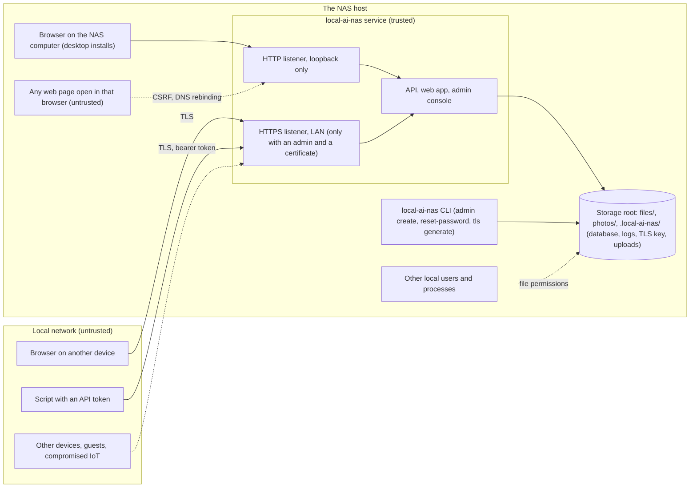

# Threat model: local-ai-nas

| Field | Value |
|---|---|
| Requirement | FR-084: a documented threat model, maintained through the project |
| Version | 1.2 |
| Created | 2026-09-30 (session S007, task S03.1-T01) |
| Last updated | 2026-09-30 (session S007, external review #1) |
| Status | **Draft for the user's review** (S03.1 criterion 3) |
| Maintained by | Every stage that adds an attack surface updates this file (RULES documentation map; audit checklist group H) |

## 1. How to read this document

- **Assets** (A-xx) are what must be protected. **Attackers** (X-xx) are who might attack them. **Surfaces** (E-xx) are where an attack can enter. **Threats** (T-xx) combine them.
- Each threat has a **STRIDE** category: **S**poofing, **T**ampering, **R**epudiation, **I**nformation disclosure, **D**enial of service, **E**levation of privilege.
- Each threat has one **status**:
  - **Open → S03.x-Tyy**: mitigated by that S03 task; S03.10 checks it with a test.
  - **Mitigated (evidence)**: already mitigated by earlier work; the evidence is named and S03.10 re-checks it.
  - **Accepted-risk candidate**: the residual risk is proposed for acceptance; it becomes an accepted risk only with the user's approval (S03.10-T06).
  - **Future → stage**: belongs to a surface that a later stage adds; that stage must handle it and update this file.
- IDs are never reused. A threat that no longer applies is marked, not deleted.

## 2. System and trust boundaries (S03)

**Trust boundaries:** (1) the network, between any client and the listeners; (2) the browser, between the NAS's own origin and every other web page; (3) the host, between the service's files and other local users and processes; (4) the process, between the core and the tools it will run later (media tools S04–S05, the storage helper S14, the AI worker S16).

## 3. Assets

| ID | Asset | What matters |
|---|---|---|
| A-01 | User files and photos | Confidentiality, integrity, availability (often the only copy until S08 backups) |
| A-02 | Credentials: password hashes, two-factor secrets, recovery codes | Confidentiality |
| A-03 | Sessions and API tokens | Confidentiality; revocability |
| A-04 | The TLS private key | Confidentiality |
| A-05 | The database (metadata, content hashes, sessions, settings) | Integrity, confidentiality |
| A-06 | The audit log | Integrity (who did what) |
| A-07 | Configuration and future secrets (SMTP and webhook credentials, FR-221) | Confidentiality, integrity |
| A-08 | The host (the service's ability to run code, and from S14 a privileged helper) | Integrity |
| A-09 | Availability of the service, especially on a Raspberry Pi with little memory | Availability |

## 4. Attackers

| ID | Attacker | Capabilities | Not assumed |
|---|---|---|---|
| X-01 | Someone on the LAN without an account (guest, compromised device) | Sends any traffic to the LAN listener; sniffs unencrypted LAN traffic | Access to the host |
| X-02 | A malicious web page in the admin's browser | Makes the browser send requests (CSRF), frames pages (clickjacking), resolves its own name to the NAS's address (DNS rebinding) | Reading other origins' answers or cookies (same-origin policy) |
| X-03 | A malicious file (uploaded knowingly or not) | Crafted names, HTML or SVG with scripts, PDFs with scripts, huge or deeply nested content | — |
| X-04 | A holder of a stolen session cookie or API token | Uses it until it expires or is revoked | The password |
| X-05 | Another local user or process on the host | Reads and writes files its permissions allow; connects to loopback ports | Root or administrator rights (with those, every protection falls: out of scope) |
| X-06 | Someone with a copy of the disk, SD card, or a backup | Reads everything stored unencrypted | — |
| X-07 | A compromised dependency or build tool | Runs code inside the build or the service | — |
| X-08 | Later: another NAS user (S07), a remote attacker if the NAS is exposed (R09) | Uses a valid account against other users' data; attacks from the internet | — |

## 5. Attack surfaces

| ID | Surface | Since | Notes |
|---|---|---|---|
| E-01 | The REST API `/api/v1` (files, auth, admin) | S01, S03 | JSON bodies, query parameters, path parameters |
| E-02 | Resumable uploads (tus) `/api/v1/files/uploads/` | S01.4 | Large bodies; upload IDs |
| E-03 | Downloads and previews (`GET /files/content`, Range) | S01.3, S02.6 | User content sent to the browser |
| E-04 | ZIP archives (tickets and streams) | S02.4 | In-memory tickets for 5 minutes |
| E-05 | The web app (static files, SPA fallback) | S02.1 | CSP by hash, `frame-ancestors 'none'` |
| E-06 | The API documentation `/api/docs/` | S01.5 | Static |
| E-07 | The listeners: loopback HTTP, LAN HTTPS | S01, S03.4 | Host header, TLS |
| E-08 | Sign-in, first-run setup, re-authentication, two-factor | S03 | Unauthenticated or half-authenticated |
| E-09 | The admin console and `/api/v1/admin` | S03.9 | Settings, certificates, sessions, audit |
| E-10 | The command line (`serve`, `migrate`, `admin`, `tls`) | S01, S03 | Local only; writes the database |
| E-11 | Files on the host: config file, database, logs, TLS key, temporary uploads | S01, S03 | File permissions |
| E-12 | Dependencies and the build (Go modules, npm packages, CI, images) | S01 | Supply chain |
| E-13 | Network shares (WebDAV, SMB if approved) | S09 | Future |
| E-14 | Camera upload endpoint and app passwords (FR-219) | S09 | Future (pending Q54) |
| E-15 | Alert delivery: SMTP, webhook, ntfy (FR-221) | S10 | Future, outbound (pending Q54) |
| E-16 | Media tools on user content (ExifTool, libvips, libheif, FFmpeg) | S04–S05, S12 | Future: parsers of untrusted files |
| E-17 | The privileged storage helper (a root service over a Unix socket) and drive events | S14 (ADR-0029, P007) | Future |
| E-18 | The AI worker | S16 | Future |
| E-19 | Updates and releases | S13 | Future |

## 6. Threats

### 6.1 Accounts and sign-in

| ID | Threat | STRIDE | Assets / attacker / surface | Mitigation | Status |
|---|---|---|---|---|---|
| T-01 | Default or empty credentials let anyone use the NAS | S, E | A-01 / X-01 / E-08 | No default accounts; the first admin is created at first run; the LAN listener does not start without an admin | Open → S03.2-T03, S03.4-T01 |
| T-02 | Someone else claims a fresh install before the owner does | S, E | A-01, A-02 / X-01, X-02 / E-08 | Setup only on the loopback listener and only while no user exists, in one transaction; headless machines use `admin create` on the machine (D-3); the Host allow-list stops DNS rebinding against setup (T-19) | Open → S03.2-T03, S03.5-T02 |
| T-03 | Online password guessing | S | A-02 / X-01 / E-08 | Per-address and per-account throttling and lockout; at least 12 characters (D-6); optional two-factor | Open → S03.2-T04, S03.7 |
| T-04 | Lockout abuse keeps the only admin out | D | A-09 / X-01 / E-08 | Loopback never locked by the account rule; locks end by themselves; `admin reset-password` on the machine | Open → S03.2-T04, S03.2-T05 |
| T-05 | Usernames are learned from different answers or timing | I | A-02 / X-01 / E-08 | The same answer and a dummy hash for unknown names | Open → S03.2-T03 |
| T-06 | A stolen password hash is cracked offline | I | A-02 / X-05, X-06 / E-11 | Argon2id (t=3, m=64 MiB, p=4); the database readable only by the service (T-42) | Open → S03.2-T02, S03.5-T05 |
| T-07 | Parallel logins exhaust memory (64 MiB per hash) on a Pi | D | A-09 / X-01 / E-08 | At most two hashes at a time; login rate limits | Open → S03.2-T02, S03.5-T04 |
| T-08 | A two-factor code or recovery code is guessed | S | A-02 / X-01, X-04 / E-08 | 5 tries per pending login within 5 minutes; recovery codes single use and hashed; throttling applies | Open → S03.7-T02 |

### 6.2 Sessions and tokens

| ID | Threat | STRIDE | Assets / attacker / surface | Mitigation | Status |
|---|---|---|---|---|---|
| T-09 | A session is sniffed on the LAN | I, S | A-03 / X-01 / E-07 | HTTPS only on the LAN; `Secure` cookie there; HSTS | Open → S03.4-T01, S03.3-T01 |
| T-10 | A script in the page steals the session | I, S | A-03 / X-02, X-03 / E-05 | `HttpOnly`; the strict CSP; user content never rendered as active content in the origin (T-22) | Open → S03.3-T01; CSP mitigated since S02.1 |
| T-11 | Session fixation: the attacker sets a session ID before login | S | A-03 / X-02 / E-08 | A new random ID at every login and re-authentication; client-chosen IDs never accepted | Open → S03.3-T01 |
| T-12 | A stolen session stays usable | S | A-03 / X-04 / E-01 | Idle and absolute expiry; list and revoke; sign out everywhere; a password change ends the other sessions | Open → S03.3-T01, T02, S03.2-T03 |
| T-13 | A copy of the database reveals live cookies or tokens | I | A-03 / X-05, X-06 / E-11 | Only SHA-256 hashes of session IDs and token secrets are stored | Open → S03.3-T01, T04 |
| T-14 | A leaked API token does more than its script needs | E | A-01 / X-04 / E-01 | Scopes (`files:read`, `files:write`), expiry, revocation; tokens never reach the admin API | Open → S03.3-T04 |
| T-15 | An unattended signed-in browser is used for admin actions | E | A-07, A-08 / X-04 / E-09 | Recent re-authentication (10 minutes) for sensitive actions | Open → S03.3-T03 |

### 6.3 Browser and web application

| ID | Threat | STRIDE | Assets / attacker / surface | Mitigation | Status |
|---|---|---|---|---|---|
| T-16 | CSRF: another site makes the admin's browser change or delete files | T | A-01 / X-02 / E-01, E-02 | A per-session token in `X-CSRF-Token` on every unsafe request, tus included; the `Origin` check; `SameSite=Lax` | Open → S03.5-T02 |
| T-17 | Login CSRF: the admin is signed in to an account the attacker chose | S | A-01 / X-02 / E-08 | The `Origin` check on login and setup (with one admin this matters from S07) | Open → S03.5-T02 |
| T-18 | Clickjacking: the console is framed and the admin tricked into clicks | T | A-07 / X-02 / E-05, E-09 | `frame-ancestors 'none'` and `X-Frame-Options: DENY` on every response | Mitigated for the app (S02.1-T02); API answers in S03.5-T03 |
| T-19 | **DNS rebinding:** a page on the attacker's domain resolves that name to `127.0.0.1` or the NAS's LAN address; its requests then look same-origin (Origin and Host both name the attacker's domain) | I, T | A-01 / X-02 / E-07 | A **Host allow-list** per listener: loopback accepts only `127.0.0.1`, `localhost`, and `[::1]` with its port; the LAN listener accepts only the configured names, the host name, `<hostname>.local`, and its own addresses. Other Host values get `421`. Cookies are not sent to the attacker's name either, so after S03 only unauthenticated routes (setup, login) are reachable this way | Open → S03.5-T02 (added by this threat model). **Today (S01, S02):** the API has no authentication, so a rebinding page could read or delete files while a development server runs (finding F-01, bug S03-B01) |
| T-20 | Another site reads answers through CORS | I | A-01 / X-02 / E-01 | No `Access-Control-Allow-Origin` anywhere | Mitigated (no CORS headers since S01; tusd's CORS off, checked in S03.1-T02); tested in S03.5-T03 |
| T-21 | A crafted file name injects script into the GUI | T, E | A-03 / X-03 / E-05 | Svelte escapes text; no raw HTML from data (checked in S03.1-T02); the CSP forbids inline scripts | Mitigated (S02, CSP by hash); re-checked in S03.1-T02 |
| T-22 | An uploaded HTML, SVG, or PDF file runs script in the app's origin | E | A-03 / X-03 / E-03 | Downloads: `attachment`, `nosniff`, `Content-Security-Policy: default-src 'none'; sandbox`; previews: images only through ``, text as text, pdf.js without scripting or eval | Mitigated (S01.3, S02.6; system tests of S02.8); re-checked in S03.5-T05 |
| T-23 | Open redirect through `?next=` after sign-in | S | A-02 / X-02 / E-08 | Only same-origin paths that start with a single `/` are followed; anything else goes to Files | Open → S03.8-T01 (added by this threat model) |
| T-24 | Error answers leak paths, stack traces, or internal IDs | I | A-05 / X-01 / E-01 | RFC 9457 problems with fixed texts (S01); the internal cause only in the server log | Mitigated (S01.5); reviewed in S03.1-T02 and S03.5-T05 |
| T-25 | Request floods or slow clients exhaust a Pi | D | A-09 / X-01 / E-07 | Header size and timeouts (S01); per-address rate limits with bounded memory; after S03 only signed-in callers can upload | Partly mitigated (S01); Open → S03.5-T04 (with the per-address request limit, finding F-06) |
| T-26 | Oversized or malformed bodies | D, T | A-09 / X-01 / E-01 | Per-route body limits, strict JSON decoding, fuzz tests (S01.5) | Mitigated (S01.5); new routes follow the same rules (S03.10-T02) |

### 6.4 Files and storage

| ID | Threat | STRIDE | Assets / attacker / surface | Mitigation | Status |
|---|---|---|---|---|---|
| T-27 | Path traversal out of the namespace | I, T | A-01, A-05 / X-01, X-03 / E-01 | `cleanUserPath` rules and `os.Root` as a second layer (S01.6) | Mitigated (S01.6 tests); re-run signed in (S03.10-T02) |
| T-28 | A link placed in the storage root by another process leads outside | I, T | A-01 / X-05 / E-11 | `os.Root` does not follow links out; archives never follow links | Mitigated (S01.6, S02.4) |
| T-29 | Someone else uses an archive ticket | I | A-01 / X-04, X-08 / E-04 | 130-bit random IDs, 5 minutes; a session is required from S03; the ticket is bound to the user who made it (for S07) | Partly mitigated (S02.4); Open → S03.5-T05 |
| T-30 | Someone else continues or completes another user's tus upload | T | A-01 / X-08 / E-02 | Random upload IDs; the upload row records its namespace; a session is required from S03; the owner is checked on every tus request (for S07) | Partly mitigated (S01.4); Open → S03.5-T05 |
| T-31 | Uploads fill the disk | D | A-09 / X-01, X-04 / E-02 | The free-space reserve and size limits (S01); after S03 only signed-in callers | Mitigated (S01.2, S01.4); closed by S03.5-T01 |

### 6.5 Transport

| ID | Threat | STRIDE | Assets / attacker / surface | Mitigation | Status |
|---|---|---|---|---|---|
| T-32 | The TLS private key is read from disk | I | A-04 / X-05, X-06 / E-11 | Key file 0600 (restricted ACL on Windows) in the internal folder | Open → S03.4-T02 |
| T-33 | A user accepts an attacker's certificate on the browser's warning page (man in the middle) | S, I | A-02, A-03 / X-01 / E-07 | The console and `tls generate` show the SHA-256 fingerprint; the guide explains checking it once; users can install the certificate or their own | Open → S03.4-T02, T03; the residual risk of self-signed certificates is an **accepted-risk candidate** |
| T-34 | Plain HTTP is used on the LAN | I | A-03 / X-01 / E-07 | No plain HTTP listener on the LAN; HSTS | Open → S03.4-T01 |
| T-35 | Weak TLS versions or ciphers | I | A-03 / X-01 / E-07 | TLS 1.2 minimum, Go's default cipher suites | Open → S03.4-T01 |

### 6.6 Audit and logging

| ID | Threat | STRIDE | Assets / attacker / surface | Mitigation | Status |
|---|---|---|---|---|---|
| T-36 | Passwords, tokens, or cookies end up in logs or audit details | I | A-02, A-03 / X-05 / E-11 | Header and query redaction (S01.5); audit details never hold secrets | Partly mitigated (S01.5); Open → S03.6-T01 |
| T-37 | Audit events are changed to hide actions | R | A-06 / X-04 / E-01 | No API to change or delete events; a trigger aborts updates; only retention deletes. Someone with write access to the database file can still change it | Open → S03.6; the file-access residual is an **accepted-risk candidate** (host access is out of scope, X-05) |
| T-38 | Admin actions happen without a record | R | A-06 / X-04 / E-09 | One audit wrapper around every state-changing admin route; the inventory test checks it | Open → S03.6-T02, S03.9-T01 |

### 6.7 Admin console

| ID | Threat | STRIDE | Assets / attacker / surface | Mitigation | Status |
|---|---|---|---|---|---|
| T-39 | A non-admin reaches admin functions | E | A-07, A-08 / X-04, X-08 / E-09 | The role is checked on the server for every admin route (default deny); hidden pages are never the protection | Open → S03.9-T01, S03.10-T02 |
| T-40 | A network change cuts the admin off | D | A-09 / — / E-09 | Keep-or-revert (2 minutes); the loopback listener is unchanged | Open → S03.9-T05 |
| T-41 | The console accepts a dangerous value (for example LAN access without TLS) | T, E | A-01 / X-04 / E-09 | The same validation as the config file; the listener manager enforces the gate whatever the source of the setting | Open → S03.9-T03, S03.4-T01 |

### 6.8 Host, build, and data at rest

| ID | Threat | STRIDE | Assets / attacker / surface | Mitigation | Status |
|---|---|---|---|---|---|
| T-42 | Another local user reads the database, logs, config, or TLS key | I | A-02–A-05 / X-05 / E-11 | Files and folders created by the service readable only by it (0600 and 0700 on Linux); on Linux the S13 deployers run the service as its own user | Open → S03.5-T05 (permissions, finding F-02, bug S03-B02), S13.2 (service user) |
| T-43 | Another local user resets the admin password with the CLI | E | A-02 / X-05 / E-10 | The CLI needs write access to the database file, which T-42 restricts to the service's user | Open → S03.5-T05, S13.2 |
| T-44 | A compromised dependency runs code in the build or the service | E | A-08 / X-07 / E-12 | Pinned versions (`go.sum`, `pnpm-lock.yaml`); govulncheck, `pnpm audit`, Trivy, Dependabot, license checks (S01, S02); few dependencies | Partly mitigated (S01, S02); Open → S03.10-T03 (fail on high severity); the residual is an **accepted-risk candidate** |
| T-45 | The disk or SD card is stolen and read | I | A-01–A-05 / X-06 / — | The NAS does not encrypt data at rest; the guide points to the operating system's disk encryption | **Accepted-risk candidate** (documented in S03.10-T04) |
| T-46 | A backup exposes credentials or secrets | I | A-02, A-07 / X-06 / — | Only hashes of passwords, sessions, and tokens are stored; two-factor secrets encrypted with a key kept outside the database (S03.7); backups handle secrets (S08.3, FR-221) | Open → S03.7-T01; Future → S08.3 |

### 6.9 Future surfaces (for the stages that add them)

| ID | Threat | STRIDE | Surface | What the stage must do | Status |
|---|---|---|---|---|---|
| T-47 | Network shares bypass the app's authorization or path rules | E, I | E-13 | The same `authz` core and path resolver; per-user credentials; LAN only | Future → S09 |
| T-48 | Camera-upload app passwords reach more than uploads | E | E-14 | An upload-only token scope; per-device revocation; the client sees only what it uploaded (FR-219) | Future → S09 (pending Q54) |
| T-49 | Alert delivery leaks data or is abused to reach internal services (SSRF) | I | E-15 | Destinations set only by the admin; TLS; HMAC-signed webhooks; minimal content; secrets never logged (FR-221) | Future → S10 (pending Q54) |
| T-50 | A crafted media file exploits a parser (ExifTool, libvips, libheif, FFmpeg) | E, D | E-16 | Tools run as separate processes with time and memory limits, never with shell strings; tools kept patched (register) | Future → S04, S05, S12 |
| T-51 | A compromised core asks the privileged storage helper to format or erase drives | E, T, D | E-17 | A narrow allow-list of typed operations; the helper checks the caller's identity on its socket; destructive steps need the admin's typed confirmation passed through; everything audited (ADR-0029) | Future → S14.2 |
| T-52 | A hostile USB drive with a crafted filesystem is plugged in | E | E-17 | Never mounted automatically; only inside a flow the admin started; `nosuid,nodev,noexec` (P007, ADR-0034) | Future → S14 |
| T-53 | Secure erase or a pool change hits the wrong drive | T, D | E-17 | Stable drive IDs, previews, typed confirmation, LED blink, audit (ADR-0035) | Future → S14.11 |
| T-54 | The AI worker reads more of the library than it needs, or sends data out | I, E | E-18 | A separate process with least privilege and no network; models checked by hash (ADR-0017) | Future → S16 |
| T-55 | Users read each other's data through IDs (uploads, archives, jobs, shares) | I | E-01–E-04 | Ownership rules in `authz`; IDs bound to their owner (prepared in S03.5-T05) | Future → S07 |
| T-56 | The console is reachable from the internet once the NAS is exposed | E | E-09 | A setting that limits `/admin` and `/api/v1/admin` to the LAN or VPN (ADR-0039) | Future → R09 |
| T-57 | A tampered release or update is installed | E | E-19 | Published checksums and signatures; the deployers verify them | Future → S13 |
| T-58 | Access data kept in sidecars or hidden files is changed outside the app (on the filesystem, over a network share with write access, by restoring an old backup) and grants access | E | E-11, E-13 | The database is the authority for owners, ACLs, and shares; sidecars only mirror it (plan 8.36) | Future → S05.1, S07.3 (decision **Q78**; external review #1) |
| T-59 | A power cut rolls back the last committed security changes (a revoked session or token, a password change, audit events), because SQLite in WAL mode with `synchronous=NORMAL` flushes only at checkpoints | S, R | E-11 | `synchronous=FULL` (plan 8.37) | Open → decision **Q79**, before S03.3-T01 (external review #1) |

## 7. Review of existing code (S03.1-T02)

Reviewed on 2026-09-30 (session S007): the S01 and S02 code against the threats above. The file modes were checked on Linux (WSL, umask 022) with a fresh storage root.

### 7.1 Findings

| ID | Severity | Finding | Threats | Follow-up |
|---|---|---|---|---|
| F-01 | High for a running development server; closed before any LAN use | The API has **no authentication and no Host check** (by design until S03). A web page using DNS rebinding can therefore use the whole files API of a server running on the same computer: list, download, upload, delete. No release exists; the risk is limited to development and test runs. Until S03.5 is done, stop the server when you are not testing | T-19 | Bug **S03-B01**: fixed by S03.5-T01 (authentication) and S03.5-T02 (Host allow-list); regression test in S03.10-T02 (`Host: attacker.example` → `421`) |
| F-02 | Low | The **database file** (`nas.db`, and its `-wal` and `-shm` files) is created **0644** by SQLite, and tusd creates upload data **0664** and folders 0775 inside `tmp/uploads`. The internal folder `.local-ai-nas` is 0750, so members of the service's group can read the database (password hashes and sessions from S03 on) and change uploads in progress. Other users are stopped by the 0750 folders | T-42, T-43, T-06 | Bug **S03-B02**: S03.5-T05 makes `.local-ai-nas` 0700 and the database files 0600, and sets tusd's file and folder modes |
| F-03 | Medium once LAN access exists; none today | `GET /api/v1/system/health` shows everyone the config file path, the free space, and raw operating-system errors, which can contain paths | T-24 | S03.5-T01 (anonymous callers get only the overall status, as planned) |
| F-04 | Low (matters from S07) | Archive tickets are not bound to the user who created them | T-29, T-55 | S03.5-T05 |
| F-05 | Low (matters from S07) | A tus upload can be continued by any caller that knows its URL; the namespace is the fixed S01 owner | T-30, T-55 | S03.5-T05 (the owner is checked on every tus request) |
| F-06 | Medium on a Raspberry Pi | The server has header and idle timeouts but no limit on concurrent requests per address and no read deadline for bodies, so a few slow clients can hold many connections | T-25 | S03.5-T04: a per-address limit on concurrent requests (added to the task) |
| F-07 | Low | The API documentation page's policy has no `frame-ancestors`, and API answers lack part of the header set of stage document 4.5 | T-18 | S03.5-T03 (the headers on every response, as planned) |
| F-08 | Informational | pdf.js is not given `isEvalSupported: false`. The page's CSP blocks eval anyway (no `unsafe-eval`), and pdf.js never loads its document-scripting sandbox | T-22 | S03.5-T05: set it explicitly if pdf.js 6.3 still has the option (defense in depth) |

### 7.2 Checked and found sound

- **Paths (T-27, T-28):** `cleanUserPath` refuses `..`, dot runs, look-alike dots, drive letters, backslashes, encoded separators, NUL, and names Windows would change; `os.Root` is the second layer and never follows links out.
- **Downloads and previews (T-22):** `attachment` with an ASCII fallback and an RFC 8187 name, `nosniff`, `Content-Security-Policy: default-src 'none'; sandbox`, `private, no-cache`; previews render images only through ``, text as text, and PDFs with pdf.js (XFA off).
- **The GUI (T-21):** no `{@html}` or `innerHTML` anywhere in `web/src`; Svelte escapes every name; the app's CSP uses script hashes only.
- **The web app handler (E-05):** GET and HEAD only; hidden files never served; fixed media types; `nosniff`, `Referrer-Policy: no-referrer`, `X-Frame-Options: DENY`, `frame-ancestors 'none'`.
- **Errors (T-24):** unexpected errors and panics answer with a generic detail; the cause and stack go only to the log.
- **Logs (T-36):** credential headers (`Authorization`, `Cookie`, `X-Csrf-Token`, …) and sensitive query parameters are redacted; incoming request IDs are validated.
- **CORS (T-20):** no handler sends CORS headers, and tusd's own CORS handling is turned off (`CorsConfig{Disable: true}`).
- **File modes:** user files 0640, folders 0750, log files 0600.
- **Archive ticket IDs (T-29):** 130 random bits from `crypto/rand` (`rand.Text`), five minutes in memory.

## 8. Accepted risks

_None yet. Candidates are marked in section 6 (T-33, T-37, T-44, T-45). Each becomes an accepted risk only with the user's approval, recorded here with the quote and date (S03.10-T06)._

## 9. Change log

| Date | Session | Change |
|---|---|---|
| 2026-09-30 | S007 | Version 1.0 (S03.1-T01): assets, attackers, surfaces, threats T-01–T-57 |
| 2026-09-30 | S007 | Version 1.1 (S03.1-T02): section 7, the review of the S01 and S02 code: findings F-01–F-08 (bugs S03-B01, S03-B02) and what was found sound |
| 2026-09-30 | S007 | Version 1.2: T-58 (access data edited outside the app) and T-59 (security writes rolled back by a power cut), from external review #1 (CR001, research R002) |
