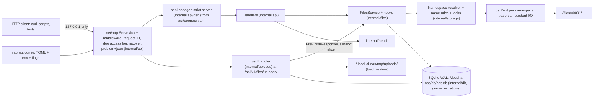

# S01: Basic NAS implementation

| Field | Value |
|---|---|
| Stage ID | S01 |
| Status | **In Progress** (approved 2026-09-24, S005) |
| Blocked reason | |
| Plan version this stage is based on | 1.1.1 |
| Origin | User-defined |
| Created | 2026-09-24 (session S002) |
| Last updated | 2026-09-24 (session S005) |
| Depends on stages | none (requires plan baseline approval) |
| Related ADRs | ADR-0001 Go (Accepted) · ADR-0002 REST/OpenAPI (Accepted) · ADR-0003 storage layout (Accepted, S005) · ADR-0004 repository layout (Accepted) · ADR-0005 testing/CI (Accepted) · ADR-0006 dev environment (Accepted) · ADR-0007 SQLite (Accepted) · ADR-0008 tus (Accepted) |

## 1. Goal

A reliable storage service, written in **Go**, that manages the **files area through a REST API**, with the two-area layout (`files/`, `photos/`) in place. There is no GUI and no authentication, so the server binds to **localhost only**.

**Exit criteria (from plan):** "Using only the API (e.g. an HTTP client), files and folders in the files area can be managed reliably, including large resumable uploads. All tests pass in CI."

## 2. Linked requirements

| Requirement ID | Title | Covered fully / partially | Substage(s) |
|---|---|---|---|
| FR-003 | Upload files (files area, API) | Partially (GUI in S02, photos in S04) | S01.3, S01.4 |
| FR-004 | Chunked, resumable uploads | Fully (server side) | S01.4 |
| FR-005 | Download with HTTP range | Fully | S01.3 |
| FR-007 | File operations | Fully (API) | S01.3 |
| FR-069 | Storage root with two areas | Fully | S01.2 |
| FR-070 | Internal data outside areas | Fully | S01.2 |
| FR-071 | Owner on every item; namespace-ready layout | Fully (single namespace) | S01.2 |
| FR-072 | Disk space and startup health checks | Fully | S01.2 |
| FR-073 | List with pagination and sorting; item details | Fully | S01.3 |
| FR-074 | Size limits; atomic finalize; abandoned-upload cleanup | Fully | S01.4 |
| FR-075 | Versioned API, errors, validation, OpenAPI, local docs | Fully (files namespace) | S01.5 |
| FR-076 | Filename validation; symlink policy | Fully | S01.6 |
| FR-077 | Name-conflict handling | Fully (API) | S01.6 |
| NFR-001 | Local-only, no remote assets | Fully for S01 scope | S01.5 |
| NFR-003 | Performance (S01 targets) | Partially (baseline) | S01.7 |
| NFR-006 | Data integrity (atomic writes) | Fully for uploads and copies | S01.4 |
| NFR-008 | Dev environment | Partially (production packaging in S11) | S01.1 |
| NFR-009 | Platforms (CI on Linux + Windows) | Partially | S01.1 |
| NFR-010 | Security baseline | Partially (S03 completes) | S01.6 |
| NFR-013 | Licensing | Ongoing | S01.1 |
| NFR-014 | Maintainability (tests, lint, CI) | Ongoing | S01.1, S01.7 |
| NFR-016 | Structured logging | Partially | S01.1 |
| NFR-019 | Safe concurrency | Fully for S01 operations | S01.6 |
| NFR-020 | Localhost-only binding | Fully (S01 side) | S01.6 |
| NFR-021 | Streaming I/O | Fully | S01.4 |
| NFR-025 | Forward compatibility | Ongoing | all |
| NFR-026 | Area separation enforced | Partially (photos in S04) | S01.2 |
| NFR-029 | License policy (anyone may deploy and use) | Ongoing (CI license check) | S01.1 |
| NFR-030 | Multi-architecture (amd64 + arm64) | Partially (pure-Go cross-builds in CI; images in S11) | S01.1 |

## 3. Scope

### In scope
- Project foundation on the Accepted stack: Go module, repository layout, lint, tests, CI, Docker dev environment, configuration, logging, error conventions, and **SQLite with migrations** (ADR-0007).
- Storage root with `files/`, `photos/`, and internal data; namespace layout (ADR-0003); health checks.
- Files-area API: list, details, create folder, upload (simple and resumable via tus), download (range), rename, move, copy, delete.
- API conventions: `/api/v1`, `api/openapi.yaml` (spec-first), RFC 9457 errors, validation, offline docs.
- Safety baseline: path traversal prevention (resolver + `os.Root`), name validation, symlink policy, conflict policy, concurrency, localhost binding.
- Tests: unit, integration, fuzz, attack, edge cases, performance baseline.

### Out of scope
- Any GUI (S02), and the streamed multi-file ZIP download (S02.4).
- Authentication and authorization (S03); user and session tables (S03.2). The server is localhost-only instead.
- Any photos-area functionality. `photos/` is created and validated only; `/api/v1/photos` returns `not_available`.
- Job system (S04.3), search (S06), trash (S08). S01 deletes are permanent.
- External media tools (ExifTool, libvips, FFmpeg). None is needed in S01.
- Production packaging (S11).

## 4. Design approach

### 4.1 Components and packages (ADR-0004)



### 4.2 Key design points
- **Go module** `github.com/KhizirFarrukh/local-ai-nas`, with `go 1.27` / `toolchain go1.27.1`. Release builds use `CGO_ENABLED=0` (ADR-0001).
- **Namespace resolver (ADR-0003, Accepted):** every request maps to `(area=files, namespace=u0001, relPath)`. The resolver normalizes the path and rejects anything invalid **before** any filesystem call. The actual I/O then goes through an **`os.Root`** opened on the namespace directory (Go 1.24+). Its methods (OpenFile, Mkdir/MkdirAll, Rename, Remove/RemoveAll, Stat/Lstat) refuse to escape the root through `..` or symlinks. This is defense in depth.
- **FilesService interface** (`internal/files`): the only way handlers touch storage. Operations emit before and after hooks (no-ops in S01). These are the attachment points for S03 policy checks, S04.6 transfer, S06 indexing, S08 trash, and S10 quotas.
- **Owner model:** every `Item` carries `OwnerID` (= namespace), `Area`, `RelPath`, `Kind`, `Size`, `ModTime`, `MIME`, and `ETag`.
- **SQLite (ADR-0007):** `modernc.org/sqlite` with pragmas `journal_mode=WAL`, `foreign_keys=ON`, `busy_timeout=5000`, and `synchronous=NORMAL`. There is one writer connection and a read pool. goose applies embedded migrations at startup. The S01 tables are `settings` and `uploads` (the upload-session index: id, target path, conflict policy, declared size, optional SHA-256, created and expiry times).
- **Uploads (ADR-0008):** tusd v2 `handler` with `filestore` rooted at `<internal>/tmp/uploads/` and tusd's file locker.
  - `PreUploadCreateCallback` validates metadata (`target_path`, `on_conflict`, optional `sha256`), the size limit, and free space, and records the session in SQLite.
  - `PreFinishResponseCallback` finalizes: verify the optional SHA-256, fsync, then an atomic rename into `files/` through the FilesService, applying the conflict policy. It uses the fallback copy + fsync + rename if the same-filesystem check failed (plan 8.18).
- **Downloads:** served with `http.ServeContent`, which handles Range, `If-None-Match`, `If-Modified-Since`, 206, and 416, wrapped in the generated response type. `Content-Disposition` uses RFC 6266/5987 filename encoding.
- **Conflict policy:** `on_conflict = fail | rename | overwrite`, default `fail`. `rename` produces `name (1).ext`.
- **Concurrency:** in-process, per-path, reference-counted locks for all mutating operations. Overwrites go through temp file + atomic rename.
- **Binding guard:** config validation refuses any non-loopback bind address in S01 (NFR-020).
- **Logging:** `log/slog` JSON to stderr **and** to a size-rotated file `.local-ai-nas/logs/nas.log` (small in-house rotator, no dependency; decision D-07, S005), with one access-log line per request carrying the request ID. The S10.5 log viewer reads these files (NFR-016).
- **Configuration:** TOML via `pelletier/go-toml/v2` in strict mode. Precedence: defaults < file < `LOCALAINAS_*` environment variables < flags. The file is located via `--config`, then `LOCALAINAS_CONFIG`, then the OS default: `/etc/local-ai-nas/config.toml` on Linux, `%ProgramData%\local-ai-nas\config.toml` on Windows.

### 4.3 Endpoint set (defined in `api/openapi.yaml`, ADR-0002)

| Method + path | Purpose | Substage |
|---|---|---|
| `GET /api/v1/system/health` | Startup and health checks | S01.2 |
| `GET /api/v1/files/items?path=&cursor=&limit=&sort=&order=` | List a folder, or get item details for a file | S01.3 |
| `POST /api/v1/files/folders` | Create a folder (`path`, `parents`) | S01.3 |
| `PUT /api/v1/files/content?path=&on_conflict=` | Simple streamed upload (`application/octet-stream`) | S01.3 |
| `GET /api/v1/files/content?path=` | Download with Range / ETag | S01.3 |
| `POST /api/v1/files/operations/rename` | Rename | S01.3 |
| `POST /api/v1/files/operations/move` | Move | S01.3 |
| `POST /api/v1/files/operations/copy` | Copy (file or folder) | S01.3 |
| `DELETE /api/v1/files/items?path=&recursive=` | Delete | S01.3 |
| `POST/HEAD/PATCH/DELETE /api/v1/files/uploads/…` | tus 1.0 resumable upload (tusd). Documented in the spec as an external protocol | S01.4 |
| `* /api/v1/photos/…` | Reserved: returns problem `not_available` | S01.5 |
| `GET /api/docs/` | Offline API documentation (vendored Redoc) | S01.5 |

## 5. Substages and tasks

### Substage overview

| Substage | Name | Status | Depends on | Requirements |
|---|---|---|---|---|
| S01.1 | Project foundation | **Done** (S005) | plan 1.0.0; S01 approved (Q22 answered: AGPL-3.0) | NFR-008, NFR-009, NFR-013, NFR-014, NFR-016, NFR-025, NFR-029, NFR-030 |
| S01.2 | Storage layout and configuration | **Done** (S005) | S01.1; **ADR-0003 Accepted** | FR-069–FR-072, NFR-026 |
| S01.3 | Core file operations | **Done** (S005) | S01.2, S01.5 (conventions), S01.6 (resolver) | FR-003, FR-005, FR-007, FR-073 |
| S01.4 | Large file handling | **Done** (S005) | S01.2, S01.3, S01.5 | FR-004, FR-074, NFR-006, NFR-021 |
| S01.5 | API layer | **Done** (S005) | S01.1 | FR-075, NFR-001 |
| S01.6 | Safety baseline | **Done** (S005) | S01.2 | FR-076, FR-077, NFR-010, NFR-019, NFR-020 |
| S01.7 | Integration, testing, and stage review | In Progress | S01.1–S01.6 | NFR-003, NFR-014 |

### Execution order (A20; flagged in plan 10.14)

1. S01.1 (all tasks)
2. S01.2 (all tasks)
3. S01.6-T01, S01.6-T02 (resolver + `os.Root`, name validation)
4. S01.5-T01 to S01.5-T04 (conventions, versioning, errors, validation)
5. S01.3 (all tasks)
6. S01.6-T03 to S01.6-T06
7. S01.4 (all tasks)
8. S01.5-T05, S01.5-T06 (full spec + drift check, docs)
9. S01.7

### S01.1: Project foundation

- **Goal:** Set up the Accepted Go stack (ADR-0001, 0002, 0004–0007) so every later change is built, checked, and tested the same way.
- **Substage acceptance criteria:** as in plan.md S01.1 (CI on Linux + Windows; fresh-clone setup; config validation; structured logs without secrets; one error format).
- **Gate:** plan approved as baseline 1.0.0 and this document approved. (Q22 answered: AGPL-3.0; ADR-0003 Accepted; both in S005.)

| Task ID | Description | Status | Acceptance criteria |
|---|---|---|---|
| S01.1-T01 | **Go module and repository skeleton** (ADR-0001, ADR-0004): `go mod init github.com/KhizirFarrukh/local-ai-nas`; `go 1.27` + `toolchain go1.27.1`; `tool` directives for oapi-codegen v2.8.0, govulncheck v1.8.0, go-licenses v2.0.1; folders `cmd/local-ai-nas/`, `internal/{config,logging,apperr,db,health,api}`, `api/`, `deploy/`, `testdata/SOURCES.md`, `docs/`, `scripts/`. `.gitattributes` (`* text=auto eol=lf`, binary patterns), `.editorconfig`, `.gitignore`. Record every added module in `dependencies.md` in the same commit (R6). | **Done** (S005) | `go build ./...` and `go vet ./...` pass on Windows and Linux. `git add --renormalize .` produces no changes. `dependencies.md` matches `go.mod`. |
| S01.1-T02 | **License and license policy** (Q22 = **AGPL-3.0**, NFR-029): add `LICENSE` with the full GNU AGPL v3.0 text and update the README "License" section; document the licenses allowed for linked dependencies (AGPL-3.0-compatible: MIT, BSD-2/3-Clause, Apache-2.0, ISC, MPL-2.0, LGPL, GPL-3.0/AGPL-3.0) in `docs/licensing.md`; configure the `go-licenses check` allow-list. | **Done** (S005) | `go tool go-licenses check ./...` passes. A deliberately disallowed test dependency fails it (verified once, then reverted). |
| S01.1-T03 | **Lint and format** (ADR-0005): `.golangci.yml` (v2 format) enabling govet, staticcheck, errcheck, gosec, ineffassign, unused, and **depguard** rules (prepared: `internal/files` and `internal/photos` may not import each other; only `internal/transfer` may import both), plus the gofmt/goimports formatters. golangci-lint **v2.13.2 pinned as a binary**: a documented local install (upstream install script) and the official GitHub Action in CI. | **Done** (S005; the CI half of the check comes with T05) | `golangci-lint run` and `golangci-lint fmt --diff` are clean on the skeleton. A deliberate violation fails locally and in CI. |
| S01.1-T04 | **Test setup**: standard `testing` + `github.com/google/go-cmp` v0.7.0; `internal/testutil` with a temp storage-root helper (`t.TempDir()`) and a server-on-`127.0.0.1:0` helper; a fuzz-test scaffold (`go test -fuzz`); a coverage profile with a threshold (80% on `internal/...`, enforced in CI). | **Done** (S005; CI publishing of the figure comes with T05) | A sample unit test, an integration test using the temp root, and a fuzz seed corpus run green. CI publishes the coverage figure and fails below the threshold. |
| S01.1-T05 | **CI pipeline** (`.github/workflows/ci.yml`, GitHub Actions), on PRs into `develop`: jobs for lint (ubuntu); tests on `ubuntu-latest` (with `-race`) and `windows-latest`; `govulncheck ./...`; `go-licenses check`; spec drift (`go generate ./... && git diff --exit-code`); cross-builds with `CGO_ENABLED=0` for linux/amd64, linux/arm64, and windows/amd64; the dev image build + **Trivy v0.74.0** scan. Plus `.github/dependabot.yml` (gomod, github-actions, docker). | **Done** (S005; image build + Trivy job moved to T06) | CI is green on the PR. A deliberately failing test turns it red (verified once). The arm64 build artifact is produced. |
| S01.1-T06 | **Development environment** (ADR-0006): native run on Windows and Linux (`go run ./cmd/local-ai-nas serve --config dev/config.toml`), plus `deploy/Dockerfile.dev` (golang build stage, then `debian:trixie-slim` runtime) and `deploy/compose.dev.yaml` (source bind mount, named volume for the storage root, port published as `127.0.0.1:8080:8080`). An example config at `deploy/config.example.toml`. The README "Development" section. | **Done** (S005; the container half verified in CI) | A new developer starts the server natively and via `docker compose -f deploy/compose.dev.yaml up --build`, using only the README. |
| S01.1-T07 | **Configuration** (`internal/config`): TOML via `github.com/pelletier/go-toml/v2` v2.4.3 (strict; unknown keys rejected); `LOCALAINAS_*` environment variable overrides; flags; the precedence defaults < file < env < flags; config path resolution (flag, then env, then OS default); validation (absolute storage root, size limits, bind address delegated to S01.6-T06). Secrets are never logged. | **Done** (S005; the non-zero exit comes with the CLI in T11) | Table-driven tests cover precedence and every validation rule. An invalid config exits non-zero with a clear message naming the key. |
| S01.1-T08 | **Logging** (`internal/logging`): `log/slog` JSON handler to stderr; plus a size-rotated JSON log file in `.local-ai-nas/logs/` (in-house rotator: max size and file count from config; D-07); levels from config; request-ID middleware (accepts a valid incoming `X-Request-ID`, otherwise generates 128-bit random hex); one access line per request (method, route pattern, status, bytes, duration, request ID); redaction of `Authorization`/`Cookie` headers and sensitive query values. | **Done** (S005) | A test captures logs and asserts the fields. A redaction test asserts that no header secrets appear. |
| S01.1-T09 | **Error conventions** (`internal/apperr`): typed domain errors (`NotFound`, `Conflict`, `InvalidName`, `OutsideRoot`, `TooLarge`, `InsufficientStorage`, `NotAvailable`, …) mapped to RFC 9457 `application/problem+json` with stable `code` values and `correlation_id` (= request ID). Panic-recovery middleware returns a generic 500. | **Done** (S005) | Unit tests cover every mapping. A handler panic yields a generic body, and the details appear only in the logs. |
| S01.1-T10 | **SQLite database** (`internal/db`, ADR-0007): open `modernc.org/sqlite` v1.59.0 at `<internal>/db/nas.db` with the pragmas; writer and reader pools; goose v3.28.0 with embedded SQL migrations (`internal/db/migrations/00001_init.sql`: `settings`, `uploads`); a `migrate status|up` CLI subcommand. | **Done** (S005; the `migrate` CLI subcommand is wired in T11) | A driver test on Linux and Windows asserts `PRAGMA journal_mode` = `wal`, that a read succeeds during an open write transaction, and that migrations are idempotent (running twice is a no-op). |
| S01.1-T11 | **App skeleton** (`cmd/local-ai-nas`): subcommands `serve`, `migrate`, `version`; `http.Server` with `ReadHeaderTimeout`, `IdleTimeout`, and body limits; graceful shutdown on SIGINT/SIGTERM (and Ctrl+C on Windows); default bind `127.0.0.1:8080`; a CI smoke test that starts the binary and calls `/api/v1/system/health`. | **Done** (S005) | The smoke test passes in CI on Linux and Windows. Shutdown completes in-flight requests within the timeout. |

### S01.2: Storage layout and configuration

- **Goal:** Create and validate the two-area layout and internal data, namespace-ready.
- **Substage acceptance criteria:** as in plan.md S01.2.
- **Gate:** **ADR-0003 Accepted** (the namespace names `u0001` and the `.local-ai-nas/` location below follow its recommendation. If the user changes it, these tasks change accordingly before coding).

| Task ID | Description | Status | Acceptance criteria |
|---|---|---|---|
| S01.2-T01 | Layout initializer (`internal/storage/layout.go`): create `files/u0001/`, `photos/u0001/`, and `.local-ai-nas/{tmp/uploads,db,logs}` if missing. Validate that they are directories and writable. Report unknown root entries without touching them. | **Done** (S005) | Empty root → full layout created. The second start is a no-op. A read-only root → startup fails with a clear error (tests on Linux; Windows uses an ACL-denied directory). |
| S01.2-T02 | Internal data location (I2): default `<root>/.local-ai-nas/`; optional relocation of `db/` and `logs/` by config; `tmp/uploads/` always under the root. Reject any overlap between internal data and the areas. | **Done** (S005) | Every overlap case (internal data inside `files/` or `photos/`, an area inside internal data, the same path) is rejected, with one test per case. |
| S01.2-T03 | Namespace resolver and owner model (`internal/storage/resolver.go`, `internal/files/item.go`): `Resolve(area, ns, userPath) → (relPath, error)`. The API root `/` maps to the namespace. `Item` carries the owner. | **Done** (S005) | An architecture test asserts that `internal/files` performs I/O only through the resolver and `os.Root`. Items carry `OwnerID="u0001"`. |
| S01.2-T04 | Free-space guard (`internal/storage/space.go`): `unix.Statfs` on Linux and macOS, `windows.GetDiskFreeSpaceEx` on Windows (**golang.org/x/sys v0.48.0**, BSD-3, added to `dependencies.md`); a configurable reserve (default 1 GiB); refuses declared-size writes that would breach it with problem `insufficient_storage` (HTTP 507). | **Done** (S005; used by the upload handlers from S01.3) | An injected low-space provider triggers 507 before any byte is stored (unit + integration). |
| S01.2-T05 | Startup health checks (`internal/health`): root writable; **same filesystem** for `tmp/uploads/` and `files/` (Unix `Stat_t.Dev`; Windows volume serial via `x/sys/windows`); free space; database open and migrated; config valid. Exposed at `GET /api/v1/system/health` (loopback only in S01). | **Done** (S005) | Each failing condition is reported by name. The same-filesystem mismatch is simulated through an injectable device-ID function, and a warning plus `upload_finalize_mode=copy` is reported. |
| S01.2-T06 | Photos area placeholder: `photos/` is validated but has no API. The files resolver cannot reach `photos/`. | **Done** (S005) | Resolver tests prove `photos/` is unreachable through the files API. `/api/v1/photos/*` returns `not_available` (S01.5). |

### S01.3: Core file operations

- **Goal:** Every basic file operation on the files area, via a service interface.
- **Substage acceptance criteria:** as in plan.md S01.3.

| Task ID | Description | Status | Acceptance criteria |
|---|---|---|---|
| S01.3-T01 | `FilesService` interface and local implementation on `os.Root` (`internal/files`), with before/after hooks (no-op subscribers). | **Done** (S005) | Handlers use only the interface (golangci-lint depguard rule + an architecture test). Hook order is covered by unit tests. |
| S01.3-T02 | List directory: cursor pagination (an opaque base64 cursor of the sort key + name); sort by name, size, mtime, type (asc/desc); stable tie-break by name. | **Done** (S005) | A 10,000-entry folder paginates without duplicates or gaps in every sort order (integration test). |
| S01.3-T03 | Item details: size, mtime, kind, MIME type (`mime.TypeByExtension`, with a `http.DetectContentType` sniff of the first 512 bytes), ETag (size + mtime + inode/file-ID hash). | **Done** (S005) | Details match the filesystem for fixtures. The ETag changes when content changes. |
| S01.3-T04 | Create folder (`parents` option) via `os.Root.Mkdir`/`MkdirAll`. | **Done** (S005) | Created. An existing path follows the conflict policy. Invalid names are rejected (S01.6). |
| S01.3-T05 | Simple streamed upload `PUT /content`: `io.Copy` with a 1 MiB buffer into a temp file in the target directory, then fsync, then atomic rename, with `on_conflict`. The declared `Content-Length` is checked against limits and free space. | **Done** (S005) | The file is byte-identical (SHA-256). No partial file is visible during the upload. The conflict policy is honored. |
| S01.3-T06 | Download: `http.ServeContent` inside the generated response visitor (Range, conditional requests, 206/304/416); safe `Content-Disposition` (RFC 6266 + RFC 5987 `filename*`). | **Done** (S005) | Correct status and bytes for single-range, open-ended, suffix, and unsatisfiable ranges. Unicode and quote filenames are encoded safely. |
| S01.3-T07 | Rename and move within the files area (`os.Root.Rename`). | **Done** (S005) | Works for files and folders. Moving a folder into itself is refused. Conflicts are handled. |
| S01.3-T08 | Copy files and folders: streamed, per-file temp + fsync + rename; a configurable limit for synchronous copy (items and bytes). | **Done** (S005) | Copied trees are byte-identical. A copy over the limit returns problem `too_large_for_sync` (the job-based copy comes in S04.3). |
| S01.3-T09 | Delete files and folders (`os.Root.Remove`/`RemoveAll`; folders need `recursive=true`). Permanent in S01. | **Done** (S005) | The file or folder is removed. A non-empty folder without `recursive` is refused. Deleting the namespace root is refused. |

### S01.4: Large file handling

- **Goal:** Reliable, memory-bounded large transfers. Never expose partial files.
- **Substage acceptance criteria:** as in plan.md S01.4.

| Task ID | Description | Status | Acceptance criteria |
|---|---|---|---|
| S01.4-T01 | Embed **tusd v2.10.1** (`github.com/tus/tusd/v2/pkg/handler`, `pkg/filestore`, file locker) at `/api/v1/files/uploads/` (`internal/uploads`). Enable the tus core, creation, creation-with-upload, and termination extensions. The session index goes in the SQLite `uploads` table. | **Done** (S005) | An in-test tus client (plain `net/http`, no dependency) resumes an interrupted upload from the server-reported offset. The final file SHA-256 equals the source. |
| S01.4-T02 | Metadata validation in `PreUploadCreateCallback`: `target_path` (resolver + name rules), `on_conflict`, optional `sha256`, `Upload-Length` against the max size and free space. Invalid requests are rejected before any data is stored. | **Done** (S005) | Each invalid-metadata case is rejected with a tus-compatible 4xx and a problem body. No `.bin`/`.info` files remain. |
| S01.4-T03 | Finalize in `PreFinishResponseCallback`: verify the optional SHA-256, fsync, then an atomic rename via the FilesService with the conflict policy. Use the fallback copy + fsync + rename when the health check reported a filesystem mismatch. | **Done** (S005) | Fault-injection tests: a crash before finalize leaves nothing in `files/`; a crash after the rename leaves a complete file; a SHA-256 mismatch rejects the upload and removes the data. |
| S01.4-T04 | Streaming and memory bound: no whole-file buffering anywhere (uploads, downloads, copy). A memory test during a 10 GB sparse-file transfer (Linux CI; 1 GB on Windows because sparse files differ there). | **Done** (S005; CI job `memory`) | Heap growth stays under 256 MB (`runtime/metrics` sampling) during upload and download. |
| S01.4-T05 | Size limits: `max_file_size` and `max_chunk_size` in config; tusd `MaxSize` set; simple uploads also enforce them. | **Done** (S005; the simple-upload part in S01.3-T05) | Over-limit uploads get 413 with no data stored (tus and simple upload). |
| S01.4-T06 | Abandoned-upload cleanup: an expiry setting (default 24 h); a periodic cleanup behind a `Scheduler` interface (a simple ticker in S01; replaced by the S04.3 job system) removes expired tusd files and index rows. | **Done** (S005) | Expired sessions are removed. Active sessions are untouched (tests with an injected clock). |

### S01.5: API layer

- **Goal:** Consistent, versioned, documented API.
- **Substage acceptance criteria:** as in plan.md S01.5.

| Task ID | Description | Status | Acceptance criteria |
|---|---|---|---|
| S01.5-T01 | Route conventions document (`docs/api/conventions.md`): namespaces, naming, path addressing, cursor pagination, sorting, `on_conflict`, reserved `/api/v1/photos`, and tus as an external protocol. | **Done** (S005) | Committed. A review checklist is applied to every endpoint. |
| S01.5-T02 | Versioning policy (`docs/api/versioning.md`): `/api/v1`; what counts as a breaking change; deprecation process. | **Done** (S005) | Committed. A test asserts that every registered route is under `/api/v1` or `/api/docs`. |
| S01.5-T03 | Error catalogue (`docs/api/errors.md`) and the problem schema in `api/openapi.yaml`. | **Done** (S005) | A contract test validates every error response against the schema across all endpoints. |
| S01.5-T04 | Request validation: generated parameter binding plus explicit validators, mapped to 4xx problems. | **Done** (S005; includes the generation pipeline from T05, see change log; per-endpoint validation comes with each S01.3/S01.4 endpoint) | Fuzz tests (`go test -fuzz`) over query and body inputs never produce a 5xx or reach the service with invalid data. |
| S01.5-T05 | `api/openapi.yaml` (OpenAPI 3.0.x, the version oapi-codegen supports) complete for S01; **oapi-codegen v2.8.0** (`std-http` strict server) generates `internal/api/gen/` via `//go:generate go tool oapi-codegen -config internal/api/oapi-codegen.yaml api/openapi.yaml`; runtime `github.com/oapi-codegen/runtime` v1.7.0; CI drift check. | **Done** (S005) | CI fails when the spec and the generated code differ (verified once). Handlers fail to compile if an operation is missing. |
| S01.5-T06 | Offline API docs: vendored **Redoc 2.5.4** standalone bundle (`internal/api/docs/redoc.standalone.js`, checksum recorded in `dependencies.md`), embedded with `go:embed` and served at `/api/docs/` together with the spec. | **Done** (S005) | The docs render with the network disabled. An automated check asserts that the page references no external URLs. |

### S01.6: Safety baseline

- **Goal:** Traversal-proof, name-safe, concurrency-safe, localhost-only.
- **Substage acceptance criteria:** as in plan.md S01.6.

| Task ID | Description | Status | Acceptance criteria |
|---|---|---|---|
| S01.6-T01 | Path normalization and traversal prevention in the resolver. (1) Reject `..`, absolute paths, drive letters, UNC paths, NUL bytes, backslash separators, and encoded separators. (2) NFC-normalize names (`golang.org/x/text/unicode/norm` **if** needed, otherwise reject non-NFC; decided in the task and recorded in `dependencies.md`). (3) `filepath.IsLocal` check. (4) All I/O via `os.Root` as the second layer. | **Done** (S005; NFC: normalize) | The attack corpus (≥ 50 cases, also a fuzz seed corpus) is rejected on Linux and Windows CI. `os.Root` blocks escapes even when the resolver is bypassed in tests. |
| S01.6-T02 | Filename validation: Windows reserved names (`CON`, `PRN`, `AUX`, `NUL`, `COM1-9`, `LPT1-9`, with or without extensions, any case); forbidden characters `<>:"/\|?*` and control characters; trailing dot or space; `.` and `..`; ≤ 255 bytes per component; overall path-length policy. The API **rejects** invalid names with a per-rule code (no silent rewriting). | **Done** (S005; applied to create/rename/move/copy targets from S01.3) | Table-driven tests cover each rule with its error code. |
| S01.6-T03 | Symlink policy: symlinks inside the area are never followed for reads or writes (`os.Root` + `Lstat`), are listed as `kind=symlink` without a target, and are never created by the API. | **Done** (S005) | A symlink pointing outside the root cannot be read, written, or traversed (Linux; Windows where the CI runner has symlink privilege, otherwise skipped with a reason). |
| S01.6-T04 | Name-conflict handling: `on_conflict=fail\|rename\|overwrite` (default `fail`) for simple upload, tus finalize, create folder, copy, move, rename; the `name (n).ext` pattern with a race-safe loop. | **Done** (S005; tus finalize joins in S01.4-T03) | Each policy is tested for each operation, including concurrent `rename` collisions. |
| S01.6-T05 | Concurrency safety: per-path lock manager (`internal/storage/locks.go`); overwrite via temp + atomic rename; a stress test with parallel writers (`-race`). | **Done** (S005) | 50 concurrent writers to one name give one consistent final file, no partial files, and no race-detector reports. |
| S01.6-T06 | Bind-address guard: loopback only in S01. Configuring any other address fails validation with a message that points to S03. | **Done** (S005) | `0.0.0.0`, a LAN IP, `::`, and hostnames resolving to non-loopback addresses are refused. `127.0.0.1`, `::1`, and `localhost` are accepted. |

### S01.7: Integration, testing, and stage review

- **Goal:** Prove S01 end to end, then close the stage.
- **Substage acceptance criteria:** as in plan.md S01.7.

| Task ID | Description | Status | Acceptance criteria |
|---|---|---|---|
| S01.7-T01 | Integration suite: every endpoint over real HTTP (the server on `127.0.0.1:0`) against a real temporary storage root. | **Done** (S005) | Every endpoint and status code path is covered and passes in CI (Linux + Windows). |
| S01.7-T02 | Attack suite: traversal, malicious names, symlink escapes, header injection in filenames, oversized inputs, tus metadata abuse. | **Done** (S005) | The suite passes. The S01.6 corpus is exercised end to end. |
| S01.7-T03 | Edge-case suite: Unicode (NFC/NFD, emoji, right-to-left), empty files, sparse multi-GB files (Linux), deep nesting, folders with 10,000 entries. | **Done** (S005) | The suite passes. Platform-specific skips are documented with reasons. |
| S01.7-T04 | Basic performance check (`go test -bench` + a scripted run): listing latency (10k entries), upload and download throughput vs. raw disk (`dd`-style baseline), heap during a 10 GB transfer. Results recorded against NFR-003. | **Done** (S005; deviations recorded for the user's review) | A report committed in `docs/perf/S01-baseline.md`. Targets met, or deviations recorded for user review (on the Windows 11 development PC, plus a Raspberry Pi and an x86-64 mini-PC when available; Q1). |
| S01.7-T05 | Documentation: README development and API usage (curl examples for Linux/macOS and PowerShell), `docs/api/*`, plan status, CURRENT_STATE. | **Done** (S005) | A reader can run the demo from the docs alone. |
| S01.7-T06 | Demo scripts `scripts/demo.sh` and `scripts/demo.ps1` (curl) covering create folder, simple upload, tus upload with a forced interruption and resume, list, ranged download, rename, move, copy, delete. | **Done** (S005; Windows run recorded in E121, both in CI) | Both scripts run green against a fresh instance (Linux in CI; Windows manually, recorded). |
| S01.7-T07 | **Documentation audit (R12)** using `templates/audit-checklist.md`, reported as the next audit number in `audits/`. | **Done** (S005; A002: 10 findings, the Critical one fixed; README proposal R-11/R-12 for the user) | Audit report complete; no Critical finding open (each fixed or escalated to the user) |
| S01.7-T08 | Completion record and user sign-off. | Not started | Section 13 is filled in. The user's sign-off is quoted in the session log. |

## 6. Files and modules expected to be created or changed

| Path | Create / Change | Purpose | Task ID(s) |
|---|---|---|---|
| `go.mod`, `go.sum` | Create | Module, toolchain pin, tool directives | S01.1-T01 |
| `.gitattributes`, `.editorconfig`, `.gitignore` | Create | Repository hygiene, LF line endings | S01.1-T01 |
| `LICENSE`, `docs/licensing.md`, `scripts/allowed-licenses.txt`, `scripts/check-licenses.sh` | Create | Project license (AGPL-3.0-or-later, Q22) and dependency license policy with its check | S01.1-T02 |
| `.golangci.yml` | Create | Lint, format, depguard rules | S01.1-T03 |
| `internal/testutil/` | Create | Temp root and test-server helpers | S01.1-T04 |
| `.github/workflows/ci.yml`, `.github/dependabot.yml` | Create | CI and dependency updates | S01.1-T05 |
| `deploy/Dockerfile.dev`, `deploy/compose.dev.yaml`, `deploy/config.example.toml` | Create | Development environment | S01.1-T06 |
| `internal/config/` | Create | TOML + env + flags configuration | S01.1-T07 |
| `internal/logging/` | Create | slog setup, request ID, access log | S01.1-T08 |
| `internal/apperr/` | Create | Domain errors → RFC 9457 | S01.1-T09 |
| `internal/db/`, `internal/db/migrations/00001_init.sql` | Create | SQLite open, pragmas, goose migrations | S01.1-T10 |
| `cmd/local-ai-nas/main.go` | Create | Entry point, subcommands, server lifecycle | S01.1-T11 |
| `internal/storage/{layout,resolver,space,locks,names}.go` | Create | Layout, resolver, free space, locks, name rules | S01.2, S01.6 |
| `internal/health/` | Create | Startup and health checks | S01.2-T05 |
| `internal/files/` | Create | FilesService, Item model, os.Root backend, hooks | S01.3 |
| `internal/uploads/` | Create | tusd integration, validation, finalize, cleanup | S01.4 |
| `api/openapi.yaml`, `internal/api/oapi-codegen.yaml`, `internal/api/gen/`, `internal/api/*.go` | Create | Contract, generated code, handlers, middleware | S01.5, S01.3 |
| `internal/api/docs/` | Create | Vendored Redoc + docs handler | S01.5-T06 |
| `docs/api/{conventions,versioning,errors}.md`, `docs/perf/S01-baseline.md` | Create | API and performance documentation | S01.5, S01.7 |
| `scripts/demo.sh`, `scripts/demo.ps1` | Create | Demo | S01.7-T06 |
| `testdata/`, `testdata/SOURCES.md` | Create | Fixtures (generated where possible) and their sources and licenses | S01.1-T01, S01.7 |
| `README.md` | Change | License section; Development and API usage sections | S01.1-T02, S01.1-T06, S01.7-T05 |
| `code-agent-docs/*` (incl. `dependencies.md`) | Change | Status, logs, register, completion record | all |

## 7. Dependencies to add

All are recorded in `code-agent-docs/dependencies.md` in the same commit that adds them (R6). Licenses were verified on 2026-09-24 (S003 log E005/E007/E011; audit A001).

**Deployment prerequisites (NFR-032, `dependencies.md` section 12):** S01 adds **no runtime prerequisite** on the target machine. The binary is pure Go with SQLite compiled in (`CGO_ENABLED=0`). Only the build needs Go. If a task finds that it does need something on the target, it adds a section 12 row in the same commit.

| Dependency | Version | Justification | License | License compatible? | ADR |
|---|---|---|---|---|---|
| Go toolchain | go1.27.1 | Core language; `os.Root` for traversal-resistant I/O | BSD-3-Clause | Yes | ADR-0001 |
| github.com/pelletier/go-toml/v2 | v2.4.3 | TOML config with strict decoding (S01.1-T07) | MIT | Yes | ADR-0001 |
| modernc.org/sqlite | v1.59.0 | Pure-Go SQLite driver | BSD-3-Clause | Yes | ADR-0007 |
| github.com/pressly/goose/v3 | v3.28.0 | Embedded SQL migrations | MIT | Yes | ADR-0007 |
| github.com/tus/tusd/v2 | v2.10.1 | Resumable uploads | MIT | Yes | ADR-0008 |
| github.com/oapi-codegen/runtime | v1.7.0 | Runtime for generated API code | Apache-2.0 | Yes (Apache-2.0 is compatible with AGPL-3.0) | ADR-0002 |
| golang.org/x/sys | v0.48.0 | Free space and volume ID on Windows (S01.2-T04/T05) | BSD-3-Clause | Yes | ADR-0001 |
| golang.org/x/text (unicode/norm), **only if** S01.6-T01 chooses to normalize | v0.42.0 | Unicode NFC normalization of names | BSD-3-Clause | Yes | ADR-0001 (stage-level candidate; register row) |
| Redoc (vendored JS asset) | 2.5.4 | Offline API docs | MIT | Yes | ADR-0002 |
| **Dev only:** oapi-codegen | v2.8.0 | Code generation (tool directive) | Apache-2.0 | Yes (not distributed) | ADR-0002 |
| **Dev only:** github.com/google/go-cmp | v0.7.0 | Test diffs | BSD-3-Clause | Yes | ADR-0005 |
| **Dev only:** golangci-lint (binary) | v2.13.2 | Lint and format | GPL-3.0 | Yes: a development tool, not linked or distributed | ADR-0005 |
| **Dev only:** govulncheck | v1.8.0 | Vulnerability scan (tool directive) | BSD-3-Clause | Yes | ADR-0005 |
| **Dev only:** go-licenses | v2.0.1 | License check (tool directive) | Apache-2.0 | Yes | ADR-0005 |
| **CI only:** Trivy (+ aquasecurity/trivy-action v0.36.0) | v0.74.0 | Dev image vulnerability scan | Apache-2.0 | Yes | ADR-0005 |
| **CI only:** actions/checkout v7.0.1, actions/setup-go v7.0.0, golangci/golangci-lint-action v9.3.0, docker/setup-buildx-action v4.4.1 | as listed | CI workflow steps | See register (licenses not fetched) | To be confirmed when added (R6) | ADR-0005, ADR-0006 |

## 8. Test plan

| What is tested | Test type (unit / integration / e2e / perf) | How | Task ID |
|---|---|---|---|
| Config precedence and validation | unit | Table-driven | S01.1-T07 |
| Logging fields and redaction | unit | slog handler capture | S01.1-T08 |
| Error mapping and panic recovery | unit | Per domain error; `httptest` | S01.1-T09 |
| SQLite WAL, concurrent read during a write, idempotent migrations | integration | Real database file on Linux and Windows | S01.1-T10 |
| Layout init, overlap rejection, health, same-filesystem check | integration | Temp roots; injected device-ID and free-space providers | S01.2-T01–T05 |
| Resolver and traversal corpus | unit + fuzz + integration | ≥ 50 cases as a fuzz seed corpus; Linux and Windows | S01.6-T01, S01.7-T02 |
| Filename rules | unit | Table-driven per rule | S01.6-T02 |
| Symlink policy | integration | Links inside and outside the root | S01.6-T03 |
| Each file operation and conflict policy | integration | Real HTTP against a temp root | S01.3-T02–T09, S01.6-T04 |
| Range and conditional downloads | integration | 200/206/304/416 | S01.3-T06 |
| tus resume, metadata validation, finalize crash safety | integration | In-test tus client; fault injection | S01.4-T01–T03 |
| Memory bound on a 10 GB transfer | perf | Sparse file; `runtime/metrics` sampling | S01.4-T04, S01.7-T04 |
| Concurrency stress | integration | 50 parallel writers with `-race` | S01.6-T05 |
| API contract and spec drift | integration + CI | Schema validation of responses; `go generate` diff | S01.5-T03, T05 |
| Offline docs | integration | No external URLs in the served page | S01.5-T06 |
| Edge cases | integration | Unicode, empty, sparse, deep, 10k entries | S01.7-T03 |

Commands that must pass before a task is marked Done (the same commands run in CI):
```
go build ./...
go vet ./...
golangci-lint run ./...                 # binary v2.13.2
golangci-lint fmt --diff                # formatting check
go test ./...                           # Windows and Linux
go test -race ./...                     # Linux (CI)
go generate ./... && git diff --exit-code   # OpenAPI/spec drift
go tool govulncheck ./...
go tool go-licenses check ./...         # allow-list from S01.1-T02
```

## 9. Stage acceptance criteria

- [ ] Every S01 substage acceptance criterion in plan.md (S01.1 to S01.7) is met.
- [ ] Using only an HTTP client, files and folders in the files area can be managed reliably, including large resumable uploads (demo scripts, S01.7-T06).
- [ ] The server listens only on loopback, and path traversal, invalid names, and symlink escapes are impossible (attack suite).
- [ ] `photos/` exists and is untouched. `/api/v1/photos` is reserved.
- [ ] All commands in section 8 pass in CI on Linux and Windows. Cross-builds for linux/amd64 and linux/arm64 succeed. The dev image passes the Trivy scan (no unresolved high findings).
- [ ] Documentation and `dependencies.md` are updated (README, API docs, plan and CURRENT_STATE status), including section 12 (deployment prerequisites per platform; NFR-032).
- [ ] Documentation audit (R12, S01.7-T07) done; no Critical finding open.

## 10. Risks and rollback approach

| Risk | Likelihood | Impact | Mitigation | Rollback |
|---|---|---|---|---|
| ADR-0003 (layout) is changed later | Low (Accepted in S005) | Medium | The resolver isolates the layout details | Supersede via a new ADR and update the S01.2 tasks (R3, R5) |
| Windows filesystem behavior (locks, reserved names, symlink privilege, sparse files) breaks tests | Medium | Medium | Windows CI from the first commit; a documented skip policy | Fix, or mark platform-specific with a reason |
| tusd hooks don't fit the atomic finalize (e.g. timing of `PreFinishResponseCallback` vs. file closing) | Low | Medium | Fault-injection tests in S01.4-T03 | Finalize from the `NotifyCompleteUploads` channel with client polling; recorded as a deviation |
| oapi-codegen limits (OpenAPI 3.0.x only; binary bodies; ServeContent integration) | Low | Low | Custom response visitors; tus documented outside generated routes | Hand-written handlers for specific routes, still spec-checked by contract tests |
| Memory bound not met in streaming paths | Low | High | Early memory test (S01.4-T04) | Fix the offending path before continuing |
| Same-filesystem requirement fails on some setups | Low | Medium | Health check + fallback finalize (plan 8.18) | The fallback is the documented behavior |
| Scope creep (GUI or auth pulled into S01) | Medium | Medium | Out-of-scope list | Defer to S02/S03 |

**Rollback for the stage:** each task is a separate commit on its feature branch with a PR into `develop` (RULES.md User Preferences). A faulty task is reverted by reverting its PR. S01 database migrations are additive, and the database file lives in internal data, so it can be deleted and recreated without losing user files.

## 11. Approval record

> "Approve S01 (Recommended)" (option text: "S01 becomes Approved, your approval is quoted in the document, and I start S01.1-T01 (Go module + repository skeleton) on feat/S01.1-T01-go-module.")
> (2026-09-24, session S005, log E012). Given together with the plan baseline approval "Approve as 1.0.0 (Recommended)".

## 12. Change log for this stage document

| Date | Session | Change | Reason | Approval needed / given |
|---|---|---|---|---|
| 2026-09-24 | S002 | Initial version (Planned) | P002 step 7 | Needed: user approval |
| 2026-09-24 | S003 | Replaced every "to be confirmed after the S01.1 ADRs are accepted" placeholder with the concrete Go stack (packages, files, tools, commands). Rewrote the S01.1 tasks as Go setup tasks (11 tasks, previously 12; the old review gate is removed because the ADRs are Accepted). Added SQLite from S01 (S01.1-T10; `uploads` and `settings` tables). Added `os.Root` as the second traversal layer. Added x/sys for free space and volume ID. Concrete tusd hook design. Concrete endpoints, dependencies, and commands. Status stays **Planned** | P003 `stage_document_updates` | Needed: user approval (the stage was not approved before, so there is nothing to re-confirm) |
| 2026-09-24 | S004 | Audit A001: added the ADR column to the dependency table; pinned `golang.org/x/text` v0.42.0 as a conditional dependency (F-025); listed the CI actions; added task S01.7-T07 (R12 documentation audit) and renumbered completion and sign-off to S01.7-T08 (F-026); based on plan 0.3.1. Status stays **Planned** | Audit A001 (P004); R12 | Needed: user approval (the document is not yet approved) |
| 2026-09-24 | S004 | Re-based on plan 0.4.0 (video streaming change). **No S01 content affected** (the change lives in S04.8). Status stays Planned | Plan change 0.4.0 | None (no S01 change) |
| 2026-09-24 | S005 | Applied the approval-stage decisions: ADR-0003 Accepted (gates removed); S01.1-T02 concrete for AGPL-3.0; S01.1-T08 and 4.2 add the size-rotated log file (D-07); S01.7-T04 reference hardware (Q1); based on plan 0.5.0. Status stays **Planned** until the user approves this document | S005 decisions (E007) | Needed: user approval |
| 2026-09-24 | S005 | **Approved by the user**; status Planned → Approved; based on plan 1.0.0 | User approval (S005 E012) | Given |
| 2026-09-24 | S005 | Plan 1.1.0 (user requirement E015): section 7 states that S01 adds no runtime prerequisite on the target (NFR-032); the stage acceptance checklist includes `dependencies.md` section 12. No task, scope, or design change | The user's instruction (S005 E015) | Given (the user's instruction) |
| 2026-09-24 | S005 | S01.1-T02: license form AGPL-3.0-or-later (user, E020); section 6 lists the allow-list file and the check script; based on plan 1.1.1 | The user's answer (S005 E020) | Given |
| 2026-09-24 | S005 | S01.1-T03 note: depguard checks each file's imports against deny lists, so it enforces "`internal/files` and `internal/photos` never import each other" but cannot express "only `internal/transfer` may import both". That rule becomes an architecture test when `internal/transfer` is created (S04.6); until then no package imports `internal/photos`, which does not exist yet | Tool limitation found in T03 | None (no scope change) |
| 2026-09-24 | S005 | **Task order inside S01.1 adjusted:** T06 (development environment) needs a runnable server (T07 config, T11 `serve`), so it runs **after T11**. The parts of T05 that need T06's `Dockerfile.dev` (the dev image build + Trivy job, and Dependabot's `docker` ecosystem) move into T06. CI also runs on pushes, not only on pull requests, because finished branches are merged by the agent (User Preferences, S005) and may have no PR | Dependencies found while starting T05 | None (same tasks and acceptance criteria; order and job placement only) |
| 2026-09-24 | S005 | **Note for S01.6-T06 (bind-address guard):** the dev container must listen on `0.0.0.0:8080` inside its own network namespace, so the port published on the host (`127.0.0.1:8080`) can reach it (S01.1-T06). The loopback-only guard therefore needs an explicit, documented container exception (for example a setting that is only honoured when the server runs in a container), or the dev compose setup breaks. Decide and test this in S01.6-T06 | Found while building T06 | None (a design note for a later task) |
| 2026-09-24 | S005 | **S01.1 closed.** All 11 tasks Done. Substage acceptance (plan S01.1) checked: (1) CI runs lint, format, vet, tests (Linux + Windows), licenses, vulnerabilities, and cross-builds on every push and PR, and turned red on a deliberately failing test; (2) the README quick start works from a fresh clone on Windows (checked by hand in Git Bash and PowerShell) and on Linux and Windows in CI; (3) an invalid config stops startup with a message naming the key, and env overrides the file (tests); (4) logs are JSON with request IDs, and secrets are redacted (tests); (5) one error format, documented in `docs/api/errors.md`; panics give a generic body with the correlation ID (tests) | S01.1 complete | None |
| 2026-09-24 | S005 | **S01.2 closed.** All 6 tasks Done. Substage acceptance (plan S01.2) checked: (1) an empty root gets files/, photos/, u0001, and the internal data, and a second start changes nothing, including directory times (T01 tests); (2) internal data inside an area, an area inside internal data, and the same path are rejected at startup (T02, 10 cases + a cmd test); (3) items carry OwnerID/namespace, and the resolver + os.Root keep every path inside its namespace, with the photos area unreachable (T03, T06); (4) a declared write that would breach the reserve gets 507 before any byte is stored (T04 integration test); (5) the health endpoint reports config, storage_writable, same_filesystem, free_space, and database by name (T05) | S01.2 complete | None |
| 2026-09-24 | S005 | **S01.5 work split adjusted:** (a) the HTTP routes move from `cmd/local-ai-nas` into `internal/api` (as in design 4.1) with an explicit route table, because S01.5-T02's test must list every registered route and `http.ServeMux` cannot enumerate them; (b) the **oapi-codegen generation pipeline** (config, `go:generate`, `internal/api/gen/`, runtime v1.7.0) moves from T05 into **T04**, because T04's "generated parameter binding" and the spec-first S01.3 handlers need it. T05 keeps "spec complete for S01 + CI drift check verified once"; (c) unmatched routes (404) and wrong methods (405) become problems in T03, so every error response follows the schema | S01.5 dependencies found while planning | None (same tasks and acceptance criteria) |
| 2026-09-24 | S005 | **S01.3-T05 design details:** (a) a new error code `length_required` (411) for an upload without `Content-Length` (codes are only added; errors.md, the spec, and apperr changed together); (b) request body limits are per route (the 1 MiB default for JSON; the upload route uses `uploads.max_file_size`), so the part of **S01.4-T05** that concerns the simple upload (max file size, 413 with no data stored) is done early; (c) the temporary file of an upload is `.local-ai-nas-tmp-<random>.part` in the target folder: listings and reads skip that prefix, and the name rules reserve it (`reserved_name`). **Note for S01.4-T06:** temporary files left by a crash stay hidden but use space; the abandoned-upload cleanup must also remove stale `.local-ai-nas-tmp-*` files of simple uploads (and of copies, S01.3-T08). (d) `fail`/`rename` commit with `os.Root.Link` (atomic no-replace), with a check-then-rename fallback on file systems without hard links | Found while building T05 | None (same task and acceptance criteria; the S01.4-T05 part is only moved earlier) |
| 2026-09-24 | S005 | **S01.3-T06 design details:** (a) two new error codes, `precondition_failed` (412) and `range_not_satisfiable` (416): ServeContent writes these as plain text, and a status writer turns them into problems, so every API error stays a problem; (b) downloads are always `attachment`, with `X-Content-Type-Options: nosniff` and `Content-Security-Policy: default-src 'none'; sandbox`, so an uploaded HTML or SVG file cannot run in the app's origin. **Note for S02 (GUI previews):** inline display needs an explicit, safe opt-in (for example only images, audio, video, PDF, and plain text) under the same CSP; (c) `Cache-Control: private, no-cache` on downloads instead of the API's no-store, so browsers revalidate with the ETag; (d) **note for S01.7-T04 (performance):** the middleware response writers do not expose `ReadFrom`, so downloads stream through a 32 KiB copy buffer rather than `sendfile`. Memory stays bounded; measure the throughput and add `ReadFrom` pass-through if it falls short of NFR-003 | Found while building T06 | None (same task and acceptance criteria) |
| 2026-09-24 | S005 | **S01.3-T07 design details:** rename is `POST /files/operations/rename` `{path, new_name, on_conflict}`, move is `POST /files/operations/move` `{from, to, on_conflict}` with `to` as the full new path (the table in 4.3 named the endpoints only). Moving a regular file without replacing uses a hard link and then removes the source (atomic on file systems with hard links; if removing the source fails, the link is removed again, so a file is never left under two names). **Folders and links are moved with a check and then a rename:** os.Root has no rename that refuses an existing target, so a concurrent create of the same name can race it; on Linux the race can at most replace an empty folder. S01.6-T04 (conflict handling) should decide whether that needs `renameat2(RENAME_NOREPLACE)` / `MoveFileEx` without replace in `internal/storage` | Found while building T07 | None (same task and acceptance criteria) |
| 2026-09-24 | S005 | **S01.3-T08 design details:** (a) `too_large_for_sync` is a new code with **status 422** (the plan named the code only; 413 is about the size of the request content); (b) new settings `copy.sync_max_items` (default 1000) and `copy.sync_max_bytes` (default 1 GiB); (c) a folder is copied as a whole into a hidden temporary tree that is renamed into place in one step (stronger than per-file commits: no partly copied folder is ever visible); (d) links and special files in a tree are refused rather than skipped (links are never followed, and a silent skip would make the copy incomplete; S01.6-T03 may revisit this); (e) modification times are kept; (f) a race in the folder rename fallback found by the tests on Windows (a lost race is "access denied", not "exists") is fixed for copy and for T07's folder moves | Found while building T08 | None (same task and acceptance criteria) |
| 2026-09-24 | S005 | **S01.3-T09 design details:** a recursive delete uses `os.Root.RemoveAll` directly, so a failure part-way leaves the rest (a retry finishes it); renaming to a hidden name first would make it look atomic, but on Windows a folder with an open file inside cannot be renamed. A non-empty-folder refusal says when the folder holds only an unfinished upload or copy. **Found by the S01.3 confinement test:** a path through a symbolic link to the outside was refused by os.Root but answered 500; `storage.IsEscape` now maps that refusal to `outside_root` for every operation. Links pointing *inside* the area are still followed by os.Root; not following them at all is S01.6-T03 | Found while building T09 and closing S01.3 | None (same task and acceptance criteria) |
| 2026-09-24 | S005 | **S01.3 closed.** All 9 tasks Done. Substage acceptance (plan S01.3) checked: (1) every operation works over HTTP against a real temporary file system: `TestFileOperationsOverHTTP` runs create folder, upload, list, details, ranged and conditional download, rename, move, copy, and delete through a real server and client, and every endpoint has integration tests on real temporary directories; (2) a 10,000-entry folder pages correctly in every sort order (`TestListLargeFolderPaginates`, T02); (3) ranges give 206 with the right bytes and unsatisfiable ranges 416 (`TestDownloadEndpoint`, T06; also over HTTP); (4) no operation leaves the namespace: `TestNoOperationLeavesTheNamespace` aims all 10 file operations at 18 escape paths (plus 5 through links on Linux) and at link items; every answer is 4xx (never 5xx), nothing from outside is returned, and sentinel files in the photos area, another namespace, the internal data, the storage root, and outside the root are unchanged; this adds to the resolver's attack corpus and os.Root; (5) endpoints reach the file system only through the service interface (depguard `api-no-disk` + architecture test, T01) | S01.3 complete | None |
| 2026-09-24 | S005 | **S01.6-T03 design details:** os.Root refuses links that leave the area but follows links that stay inside it when they are a middle element of a path (`/in-link/a.txt`). Every operation now checks the parents of each path it uses and refuses a link or another special entry (Windows junctions report `ModeIrregular`) with 400 invalid_request, so links are never followed for reads, writes, or traversal. The last element is not followed either, as before: operations on a link act on the link. The API never creates links (architecture test). Link tests now create links through `testutil.Symlink`/`TrySymlink`, which skip only where the OS refuses (Windows without the privilege), so they also run on the Windows CI runner | Found while building T03 | None (same task and acceptance criteria) |
| 2026-09-24 | S005 | **S01.6-T04:** the policies were built with each S01.3 operation; T04 adds the acceptance evidence: `TestConflictMatrix` (8 operations × 3 policies × a free name, a file, and a folder: 72 cases with the expected result, name, and created flag in one table) and `TestConcurrentRenameCollisions` (8 concurrent calls to one name per operation). **tus finalize** does not exist yet: S01.4-T03 commits through the same function (`commitFile`) and must add its rows to the matrix | Acceptance of T04; tus is S01.4 | None (tus finalize is covered when S01.4-T03 is built) |
| 2026-09-24 | S005 | **S01.6-T05 design details:** the lock manager `storage.Locks` (keyed, reference-counted, case-folded keys) locks the **target folder** only while a new name is committed in it: the conflict checks and the rename or link that follows. Writing the content (a temporary file or tree) happens before, without the lock, so parallel uploads into one folder still stream in parallel. This makes the check-then-rename steps for folders and the no-hard-link fallback race-free within the server (the only writer to the storage). Downloads look a file up again (up to 5 times) when it is replaced between the check and the open, instead of answering 409 at once | Found while building T05 | None (same task and acceptance criteria) |
| 2026-09-24 | S005 | **S01.6-T06 design details** (answers the container note from S01.1-T06): `server.bind` must be `localhost`, a loopback IP, or a host name whose every address is loopback (resolved at startup with a 3 s timeout; an unresolvable name is refused); the error points to S03. The container exception is a new boolean setting `server.allow_container_bind`, honoured only when the server runs in a container (`/.dockerenv` or `/run/.containerenv`); the dev compose file and the CI container job set it, and the port stays published on the host's loopback only. The config gained a boolean setting kind | Found while building T06 | None (same task and acceptance criteria) |
| 2026-09-24 | S005 | **S01.6 closure gap, fixed:** plan S01.6 criterion 1 lists Unicode look-alikes, which the attack corpus lacked. The resolver now refuses segments that read as dots in compatibility form (NFKC: `．．`, `‥`, `…`), the name rules refuse separator look-alikes (new rule `lookalike_separator`: `／ ＼ ∕ ⁄ ∖ ⧵ ⧸ ⧹ ﹨`) and dot look-alike names, and 6 look-alike paths joined the corpus. Other fullwidth characters stay allowed (`？` is common in CJK names); existing files keep being readable | Found while checking the S01.6 criteria | None (closes a gap in S01.6-T01/T02 against the plan's criterion) |
| 2026-09-24 | S005 | **S01.6 closed.** All 6 tasks Done. Substage acceptance (plan S01.6) checked: (1) the traversal corpus (`..`, encoded variants, absolute paths, drive letters, UNC paths, NUL bytes, mixed separators, and now Unicode look-alikes) is refused on Linux and Windows (`TestResolveRejectsAttackCorpus` on both CI runners, FuzzResolve, and the S01.3 confinement test); (2) names invalid on any supported OS are refused with a rule (`TestValidateName`, FuzzValidateName: accepted names are creatable on NTFS and Linux); (3) links cannot be used to read or write outside the area, nor followed inside it (`TestLinksAreNeverFollowed`, mutation-checked; confinement test); (4) concurrent writes to one path give one consistent result and no partial file (`TestStressConcurrentWriters`, 50 writers × 3 policies with readers, `-race` in CI); (5) the server listens on loopback only by default, and any other address is refused until S03, with an explicit container-only exception (`TestBindGuard`, `TestContainerBind`) | S01.6 complete | None |
| 2026-09-24 | S005 | **S01.4-T01 design details:** (a) tusd is mounted with `http.StripPrefix` (it routes on the path below its base path), with downloads, concatenation, and CORS disabled (the web app is same-origin); (b) the session row is written in `PreUploadCreateCallback` with an ID the server chooses (`FileInfoChanges.ID`), so every stored upload has a row; termination removes it; (c) **tusd's plain-text protocol errors become problems** with tusd's status (tus clients act on statuses), which needed two new codes: `locked` (423) and `unavailable` (503); tusd's `Content-Length` for its text is dropped; (d) tusd logs through `golang.org/x/exp/slog`, a separate type: a small adapter forwards only its warnings and errors (tusd logs every request at info level, which the access log already covers); x/exp is registered as a direct dependency; (e) the tus routes are hand-written catch-alls, documented in the spec under an `uploads` tag that is excluded from code generation and from the spec-to-route test, like photos. **Found by FuzzAPI (S01.6 hardening):** on Windows a path segment ending with a dot or a space names another item (`/ /x` is `/x`; `docs.` is `docs`), and one such upload path answered 500. The resolver now refuses such segments on Windows (`trailing_dot_or_space`); on Linux they stay distinct, valid names | Found while building T01 | None (same task and acceptance criteria) |
| 2026-09-24 | S005 | **S01.4-T03 design details:** (a) the finished data file is moved into the target folder under a hidden temporary name by `storage.Resolver.MoveInto` (os.Root cannot rename across roots; the parents are checked for links through os.Root first) and then committed with the shared conflict code under the folder lock; (b) **the copy fallback is chosen when the rename fails across file systems** (EXDEV / ERROR_NOT_SAME_DEVICE → `files.ErrNotSameDevice`), which covers the case the health check warns about without passing its result along; (c) a finalize failure removes the upload (there is no way to finalize again with other settings) and is answered as a problem; the answer that finishes an upload carries `Item-Path`; (d) the tus finalize rows joined `TestConflictMatrix` (81 cases). **Note:** a server crash *during* finalize leaves a complete upload that was never committed; the client sees no answer, and the expiry cleanup (T06) removes the leftovers; re-finalizing after a restart is not offered | Found while building T03 | None (same task and acceptance criteria) |
| 2026-09-24 | S005 | **S01.4-T06 design details:** a new setting `uploads.expiry` (default 24h, at least 1m). `uploads.Server.Cleanup` removes a session only when its expiry has passed *and* its data has not been written to for the expiry time (an upload still moving is kept), and it removes tusd files without a session once they are that old. `files.Local.CleanTemp` removes `.local-ai-nas-tmp-*` files and folders older than the expiry (the note from S01.3-T05). `internal/schedule` (`Scheduler`, a `Ticker` in S01, to be replaced by S04.3) runs both at startup and hourly; the server stops them on shutdown | Found while building T06 | None (same task and acceptance criteria) |
| 2026-09-24 | S005 | **S01.4 closed.** All 6 tasks Done. Substage acceptance (plan S01.4) checked: (1) an upload interrupted at any point resumes from the server's offset and ends byte-identical (`TestResumeAtAnyPoint`: cuts at 1 B, 1000 B, 256 KiB + 3, 1 MiB, and one byte before the end, each resumed exactly; `TestResumeInterruptedUpload`; SHA-256 compared); (2) a 10 GiB upload (simple and tus), copy, and download raise the heap by less than 256 MiB (`TestMemoryBound` in the CI `memory` job, 10 GiB on Linux, 1 GiB on Windows; 1.6 MiB at most on the development PC); (3) an in-progress upload never appears in the files area (its data stays in the internal data until finalize; `TestResumeAtAnyPoint` checks the folder after every cut), and a crash mid-finalize leaves no partial file (`TestFinalizeFaults`); (4) uploads over the limits are refused before data is stored (`TestCreateChecksTarget` 413 for `Upload-Length`, `TestTusChunkLimit` for a chunk, `TestUploadOverHTTP` for the simple upload); (5) abandoned uploads are deleted after the configured expiry (`TestCleanup` with an injected clock) | S01.4 complete | None |
| 2026-09-24 | S005 | **S01.5-T06 design details:** the spec is embedded through `api/spec.go` (`package apispec`), because `go:embed` cannot reach outside a package's folder; the page, the bundle, and the spec are served at `/api/docs/` (GET/HEAD; 405 otherwise; `/api/docs` redirects) with a same-origin Content-Security-Policy. "Renders with the network disabled" is checked by `scripts/check-api-docs-offline.sh`: headless Edge or Chrome with every host but 127.0.0.1 unresolvable must show the rendered operations. It needs a browser, so it is not in CI. **FuzzAPI finding (S01.4 hardening):** `HEAD /api/v1/files/uploads/"` answered 500 on Windows (tusd uses the ID as a file name). The tus server now answers 404 for any ID it cannot have made (26 characters of lowercase base32) before tusd sees it | Found while building T06 | None (same task and acceptance criteria) |
| 2026-09-24 | S005 | **S01.5 closed.** All 6 tasks Done. Substage acceptance (plan S01.5) checked: (1) every endpoint is under `/api/v1` (the documentation under `/api/docs`, which S01.5-T02 allows), files endpoints under `/api/v1/files`, and `/api/v1/photos` answers the documented 501 `not_available` (route and contract tests); (2) every error response validates against the Problem schema (`TestErrorResponsesMatchSchema` over the contract tables, the download, tus, and copy tests), and every status is declared in the spec (`TestErrorStatusesAreInTheSpec`, `TestTusStatusesAreInTheSpec`); (3) invalid input is refused with 4xx before the service, tested per endpoint with fake services (`...InvalidInputNeverReachesService` for items, folders, upload, rename/move, copy, and delete); FuzzAPI finds no 5xx; (4) CI fails when the spec and the generated code differ (verified: run 36003431640 red on a deliberate drift, then green); (5) the docs page works with the network disconnected (`scripts/check-api-docs-offline.sh` with headless Edge, every host but 127.0.0.1 unreachable) | S01.5 complete | None |
| 2026-09-24 | S005 | **S01.7-T01 design details:** `TestIntegration` (`cmd/local-ai-nas`) runs the program as two separate processes: one with small limits, and one with an impossible free-space reserve (for 507 and the failing health check). The spec is the checklist: every status of every operation must be reached over real HTTP, and every error body must validate against the Problem schema (the health check's 503 against HealthReport, as designed). Seven statuses are listed in the test as not causable from outside, each with the reason and where it is tested instead: 500, the 501 of an API without a tus server, tus 423 lock races, the 507 of the tus copy fallback, and the 409 of a file replaced during a download. **Found:** the spec declared 412 for the tus HEAD, but tusd does not check `Tus-Resumable` on HEAD (nor GET); the spec was corrected | Found while building S01.7-T01 | None (same task and acceptance criteria) |
| 2026-09-24 | S005 | **S01.7-T02:** the S01.6 attack corpus moved to `testutil` (`AttackPaths`, `WindowsAttackPaths`) and is aimed end to end at all 10 file operations and the tus target (`TestNoOperationLeavesTheNamespace`), with `internal/api/attack_test.go` for malicious names in every creating endpoint, header injection through file names, oversized inputs, and tus metadata abuse. **Two fixes it forced:** (a) on Linux, reading a path whose segment is over 255 bytes answered 500 (`ENAMETOOLONG`); `storage.IsNotFound` now treats a name too long to exist as not found (and `ERROR_FILENAME_EXCED_RANGE` on Windows); (b) on Windows, a name with `:` (or another forbidden character) was refused by `IsLocal` without a rule; the resolver now reports `forbidden_character` there, as the name rules do on Linux | Found while building S01.7-T02 | None (same task and acceptance criteria) |
| 2026-09-24 | S005 | **S01.7-T03:** `internal/api/edge_test.go` covers Unicode (NFD in, NFC stored and listed, both forms reach one file; emoji with ZWJ; Hebrew and Arabic; combining marks), empty files and folders, a 5 GiB sparse file (**Linux only**: on Windows truncate allocates the whole file; the 10 GiB streaming case is the memory job's), 100-level nesting, and 10,000 entries paged by the API (skipped with `-short`). **Found:** Go's `http.ServeContent` answers a suffix range on an empty file with 206 and an invalid `Content-Range: bytes 0--1/0`; the download now ignores `Range` for an empty file (allowed by RFC 9110) | Found while building S01.7-T03 | None (same task and acceptance criteria) |
| 2026-09-24 | S005 | **S01.7-T04 (performance baseline, `docs/perf/S01-baseline.md`):** Q18 answered (100k photos + 100k files, plan 1.1.2). Listing 10,000 entries: p95 30–44 ms on Windows and Linux, **met** (≤ 500 ms). Heap during 10 GiB transfers: **met** (CI `memory` job; 1.6 MiB at most locally). Throughput over loopback on the NVMe development PC: simple upload 63% (Windows) / 79% (Linux) of the raw disk, download 35% (Windows) / 130% (Linux, sendfile), tus 52–62%: **not met** against ≥ 80%. On loopback the per-byte HTTP work shows; the absolute rates (400–6,500 MB/s) are 3–50× gigabit Ethernet, so the target is expected to hold where the network or a USB disk is the slower side. **Deviation recorded for the user's review** (at the S01 sign-off), with the next step: measure on the Pi and the mini-PC over the real network when available, and overlap receive and write in the simple upload if needed. Improved while measuring: downloads keep `sendfile`/`TransmitFile` (the access log and the download writer pass `ReadFrom` through) | S01.7-T04 measurement | **Needed: the user's review of the throughput deviation (S01.7-T08)** |
| 2026-09-24 | S005 | **S01.7-T05/T06:** `docs/api/usage.md` gives every operation with curl for Linux/macOS and for Windows PowerShell; each code block was run as written on Linux and in Windows PowerShell 5.1. `scripts/demo.sh` and `scripts/demo.ps1` check every answer, including a tus upload that is cut off and resumed. A new CI job `demo` runs both against a fresh server (Linux, and Windows PowerShell 5.1), **more than the acceptance's "Windows manually"**, and fails if the server logged an error. **Found:** (1) tusd logs a client's cut-off request body (`BodyReadError`) at ERROR; the tus log adapter now makes it a WARN, and errors stay for server faults. (2) `scripts/perf-baseline.sh` and `scripts/check-api-docs-offline.sh` were not executable in Git; fixed. (3) Windows PowerShell 5.1 drops the quotes of JSON arguments to native programs, so the guide and `demo.ps1` send JSON through a file | Found while building S01.7-T05/T06 | None (same tasks and acceptance criteria) |
| 2026-09-24 | S005 | **S01.7-T07 (audit A002, `audits/A002-2026-09-24-documentation-audit.md`):** 10 findings: 1 Critical (CURRENT_STATE's next steps still listed S01.7 from T01; fixed), 1 Major (the README status line changed in T05 outside the sections this document names; restored, and proposed as R-11 with R-12 in `audits/A002-readme-proposal.md`), 8 Minor (7 fixed, 1 accepted). Plan 1.1.3 (NFR-031 and S06.8 no longer say that Q1 is pending). The README row of section 6 now also names S01.1-T02 (License section). The audit checklist gained product-documentation checks | Audit A002 (R12) | **Needed: the user's decision on R-11/R-12 at the S01 sign-off (S01.7-T08)** |

## 13. Completion record

- **Completed on:**
- **What was built:**
- **Deviations from plan:**
- **Known issues:**
- **Follow-ups:**
- **Final test results:**
