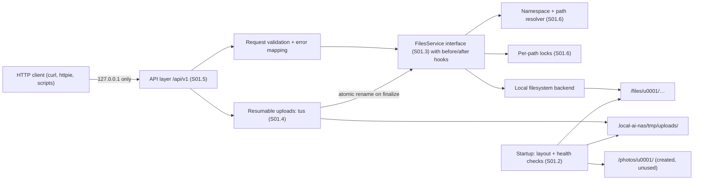

# S01: Basic NAS implementation

| Field | Value |
|---|---|
| Stage ID | S01 |
| Status | Planned |
| Blocked reason | |
| Plan version this stage is based on | 0.2.0 |
| Origin | User-defined |
| Created | 2026-09-24 (session S002) |
| Last updated | 2026-09-24 (session S002) |
| Depends on stages | none (requires plan baseline approval) |
| Related ADRs | ADR-0001 (backend, Proposed), ADR-0002 (API style + tus, Proposed), ADR-0003 (storage layout, Proposed) |

## 1. Goal

A reliable storage service that manages the **files area through an API**, with the two-area layout (`files/`, `photos/`) in place. There is no GUI and no authentication, so the server binds to **localhost only**.

**Exit criteria (from plan):** "Using only the API (e.g. an HTTP client), files and folders in the files area can be managed reliably, including large resumable uploads. All tests pass in CI."

## 2. Linked requirements

| Requirement ID | Title | Covered fully / partially | Substage(s) |
|---|---|---|---|
| FR-003 | Upload files (files area, API) | Partially (GUI in S02, photos in S04) | S01.3, S01.4 |
| FR-004 | Chunked, resumable uploads | Fully (server side) | S01.4 |
| FR-005 | Download with HTTP range | Fully | S01.3 |
| FR-007 | File operations | Fully (API) | S01.3 |
| FR-069 | Storage root with two areas | Fully | S01.2 |
| FR-070 | Internal data outside areas | Fully | S01.2 |
| FR-071 | Owner on every item; namespace-ready layout | Fully (single namespace) | S01.2 |
| FR-072 | Disk space and startup health checks | Fully | S01.2 |
| FR-073 | List with pagination and sorting; item details | Fully | S01.3 |
| FR-074 | Size limits; atomic finalize; abandoned-upload cleanup | Fully | S01.4 |
| FR-075 | Versioned API, errors, validation, OpenAPI, local docs | Fully (files namespace) | S01.5 |
| FR-076 | Filename validation; symlink policy | Fully | S01.6 |
| FR-077 | Name-conflict handling | Fully (API) | S01.6 |
| NFR-001 | Local-only, no remote assets | Fully for S01 scope | S01.5 |
| NFR-003 | Performance (S01 targets) | Partially (baseline) | S01.7 |
| NFR-006 | Data integrity (atomic writes) | Fully for uploads and copies | S01.4 |
| NFR-008 | Dev environment | Partially (production packaging in S11) | S01.1 |
| NFR-009 | Platforms (CI on Linux + Windows) | Partially | S01.1 |
| NFR-010 | Security baseline | Partially (S03 completes) | S01.6 |
| NFR-013 | Licensing | Ongoing | S01.1 |
| NFR-014 | Maintainability (tests, lint, CI) | Ongoing | S01.1, S01.7 |
| NFR-016 | Structured logging | Partially | S01.1 |
| NFR-019 | Safe concurrency | Fully for S01 operations | S01.6 |
| NFR-020 | Localhost-only binding | Fully (S01 side) | S01.6 |
| NFR-021 | Streaming I/O | Fully | S01.4 |
| NFR-025 | Forward compatibility | Ongoing | all |
| NFR-026 | Area separation enforced | Partially (photos in S04) | S01.2 |

## 3. Scope

### In scope
- Project foundation: stack per the S01.1 ADRs, repository, tooling, CI, dev environment, config, logging, errors.
- Storage root with `files/`, `photos/`, and internal data; namespace layout (ADR-0003); health checks.
- Files-area API: list, details, create folder, upload (simple and resumable), download (range), rename, move, copy, delete.
- API conventions: `/api/v1`, problem-details errors, validation, OpenAPI, local docs.
- Safety baseline: path traversal prevention, name validation, symlink policy, conflict policy, concurrency, localhost binding.
- Tests: unit, integration, attack, edge cases, performance baseline.

### Out of scope
- Any GUI (S02).
- Authentication and authorization (S03). The server is localhost-only instead.
- Any photos-area functionality. `photos/` is created and validated only; `/api/v1/photos` returns "not available yet".
- Database, job system, search, trash (S03.2, S04.3, S06, S08).
- Streamed multi-file ZIP download (added with the GUI in S02.4).
- Production packaging (S11).

## 4. Design approach

> Technology-specific names below (modules, libraries, commands) are **to be confirmed after the S01.1 ADRs are accepted**. The structure itself is technology-neutral.

### 4.1 Components



### 4.2 Key design points
- **Namespace resolver (ADR-0003):** every request maps to `(area=files, namespace=u0001, relative path)`. The resolver normalizes the path and rejects anything that escapes the namespace, before any filesystem call.
- **FilesService interface:** the only way endpoints touch storage. Operations emit before and after hooks (a no-op in S01). These are the attachment points for S03 policy checks, S04.6 transfer, S06 indexing, S08 trash, and S10 quotas.
- **Owner model:** every `Item` carries `owner_id` (= namespace), `area`, `rel_path`, `kind`, `size`, `mtime`, `mime`.
- **Uploads:** tus sessions are stored in `.local-ai-nas/tmp/uploads/<id>/` (data + info). On completion, fsync, then atomic rename into `files/…`, applying the conflict policy. A cleanup task (behind a scheduler interface) removes expired sessions.
- **Conflict policy:** `on_conflict = fail | rename | overwrite`, default `fail`. `rename` produces `name (1).ext`.
- **Concurrency:** in-process per-path locks for all mutating operations. Overwrites go through temp file + atomic replace.
- **Binding guard:** config validation refuses any non-loopback bind address in S01 (NFR-020).
- **No database in S01.** Upload sessions are plain files, so there is nothing to migrate.

### 4.3 Planned endpoint set (ADR-0002, Proposed)

| Method + path | Purpose | Substage |
|---|---|---|
| `GET /api/v1/system/health` | Startup/health checks | S01.2 |
| `GET /api/v1/files/items?path=&cursor=&limit=&sort=&order=` | List a folder, or get item details for a file | S01.3 |
| `POST /api/v1/files/folders` | Create a folder (`path`, `parents`) | S01.3 |
| `PUT /api/v1/files/content?path=&on_conflict=` | Simple (single-request, streamed) upload | S01.3 |
| `GET /api/v1/files/content?path=` | Download with Range / ETag | S01.3 |
| `POST /api/v1/files/operations/rename` | Rename | S01.3 |
| `POST /api/v1/files/operations/move` | Move | S01.3 |
| `POST /api/v1/files/operations/copy` | Copy (file or folder) | S01.3 |
| `DELETE /api/v1/files/items?path=&recursive=` | Delete | S01.3 |
| `POST/HEAD/PATCH/DELETE /api/v1/files/uploads/…` | tus resumable upload | S01.4 |
| `* /api/v1/photos/…` | Reserved: returns a problem `not_available` | S01.5 |

## 5. Substages and tasks

### Substage overview

| Substage | Name | Status | Depends on | Requirements |
|---|---|---|---|---|
| S01.1 | Project foundation | Not started | plan 1.0.0; ADR-0001/0002 Accepted; Q4, Q22, Q24 | NFR-008, NFR-009, NFR-013, NFR-014, NFR-016, NFR-025 |
| S01.2 | Storage layout and configuration | Not started | S01.1; ADR-0003 Accepted | FR-069–FR-072, NFR-026 |
| S01.3 | Core file operations | Not started | S01.2, S01.5 (conventions), S01.6 (resolver) | FR-003, FR-005, FR-007, FR-073 |
| S01.4 | Large file handling | Not started | S01.2, S01.3, S01.5 | FR-004, FR-074, NFR-006, NFR-021 |
| S01.5 | API layer | Not started | S01.1 (ADR-0002) | FR-075, NFR-001 |
| S01.6 | Safety baseline | Not started | S01.2 | FR-076, FR-077, NFR-010, NFR-019, NFR-020 |
| S01.7 | Integration, testing, and stage review | Not started | S01.1–S01.6 | NFR-003, NFR-014 |

### Execution order (A20; flagged in plan 10.14)

1. S01.1 (all tasks)
2. S01.2 (all tasks)
3. S01.6-T01, S01.6-T02 (resolver, name validation)
4. S01.5-T01 to S01.5-T04 (conventions, versioning, errors, validation)
5. S01.3 (all tasks)
6. S01.6-T03 to S01.6-T06
7. S01.4 (all tasks)
8. S01.5-T05, S01.5-T06 (OpenAPI, docs, which need the full endpoint set)
9. S01.7

### S01.1: Project foundation

- **Goal:** Establish the approved stack, repository, tooling, and conventions.
- **Substage acceptance criteria:** as in plan.md S01.1 (CI on Linux + Windows; fresh-clone setup; config validation; structured logs without secrets; one error format).
- **Gate:** no code until ADR-0001 and ADR-0002 are **Accepted**, and Q4, Q22, Q24 are answered.

| Task ID | Description | Status | Acceptance criteria |
|---|---|---|---|
| S01.1-T01 | Review gate: user accepts, changes, or rejects ADR-0001, ADR-0002, ADR-0003. Record approvals. Update this document with the concrete stack. | Not started | ADRs have status Accepted (or superseded) with approval quoted. Every "to be confirmed" marker in this document is resolved. |
| S01.1-T02 | Project license and dependency-license policy (Q22): add `LICENSE`; document allowed and denied dependency licenses. | Not started | `LICENSE` present. Policy documented. The license check (T07) enforces it. |
| S01.1-T03 | Repository structure and housekeeping: source layout per ADR-0001 (to be confirmed after the S01.1 ADRs are accepted), `.gitignore`, `.gitattributes` (line endings, S001 finding), `.editorconfig`, README "Development" section. | Not started | Layout matches the ADR. `git add --renormalize .` shows no line-ending churn on Windows or Linux. |
| S01.1-T04 | Dependency management with a lockfile (tool per ADR-0001, to be confirmed). Pin the language version. | Not started | A fresh clone installs exactly the locked versions on Windows and Linux with one documented command. |
| S01.1-T05 | Lint, format, and type checking configured, with pre-commit hooks (tools per ADR-0001, to be confirmed). | Not started | Checks pass on the skeleton. A deliberate violation fails the pre-commit hook and CI. |
| S01.1-T06 | Test framework: layout (`unit/`, `integration/`), coverage reporting and threshold, property-based testing, a temporary storage-root fixture. | Not started | A sample unit test and an integration test that uses the temp root both pass. Coverage report produced. |
| S01.1-T07 | CI pipeline (GitHub Actions, Q24): lint, format check, type check, tests, license check, on Linux and Windows, for PRs into `develop`. | Not started | CI is green on the PR. A deliberately failing test turns it red (verified once, then reverted). |
| S01.1-T08 | Development environment: documented local run on Windows and Linux, plus a Docker dev setup (Dockerfile or dev container; to be confirmed after the S01.1 ADRs are accepted). | Not started | A new developer starts the server locally and in Docker with the documented commands. |
| S01.1-T09 | Configuration system: config file + environment variable overrides + defaults + validation. The config location comes from the CLI flag, then the env var, then the OS default (ADR-0003). Secrets are never logged. | Not started | Invalid config fails startup with a clear message. Env overrides file. The precedence is tested and documented. |
| S01.1-T10 | Structured logging: JSON or key-value lines with request ID, method, route, status, duration; log levels; rotation settings; a redaction policy. | Not started | Every request is logged once with a request ID. A test asserts that no secret-like fields appear. |
| S01.1-T11 | Error-handling conventions: domain error types, mapping to RFC 9457 problem responses with stable codes, and a generic 500 body with a correlation ID. | Not started | Unit tests cover every domain error mapping. An unexpected exception returns a generic body, with details only in the logs. |
| S01.1-T12 | App skeleton and entry point: app factory, graceful shutdown, loopback bind default, a smoke test that starts the server in CI. | Not started | The server starts on 127.0.0.1 with a configurable port. The CI smoke test gets a valid response. |

### S01.2: Storage layout and configuration

- **Goal:** Create and validate the two-area layout and internal data, namespace-ready.
- **Substage acceptance criteria:** as in plan.md S01.2.
- **Gate:** ADR-0003 **Accepted**.

| Task ID | Description | Status | Acceptance criteria |
|---|---|---|---|
| S01.2-T01 | Storage root config and layout initializer: create `files/`, `photos/`, and the default namespace (`u0001` per ADR-0003) if missing. Validate that they are directories and writable. Report unknown root entries without touching them. | Not started | Empty root → full layout created. The second start is a no-op. A read-only root → startup fails with a clear error. |
| S01.2-T02 | Internal data location (I2): default `<root>/.local-ai-nas/` with subfolders; optional relocation of database, index, and logs; reject any overlap with the areas. | Not started | Configs placing internal data inside `files/` or `photos/`, or the reverse, are rejected (tests for each case). |
| S01.2-T03 | Namespace resolver and owner model: `Item(owner_id, area, rel_path, kind, size, mtime, mime)`. The API root `/` maps to the caller's namespace (a fixed default owner in S01). | Not started | Every service call resolves through the resolver (architecture test). Items carry the owner. |
| S01.2-T04 | Free-space guard: query free space, apply a configurable reserve, and refuse writes with a declared size that would breach it (problem `insufficient_storage`, HTTP 507). | Not started | A simulated low-space condition refuses the write before any data is stored. |
| S01.2-T05 | Startup health checks: root writable; `tmp/` and areas on the same filesystem (atomic rename possible); free space; config valid. Results exposed at `GET /api/v1/system/health`. | Not started | Each failing condition is reported by name. The same-filesystem check fails when `tmp/` is on another volume (test with a mock or a second temp dir where possible). |
| S01.2-T06 | Photos area placeholder: `photos/` validated but not exposed. The files service cannot resolve into `photos/`. | Not started | Attempts to reach `photos/` through the files API are impossible (resolver tests). `/api/v1/photos/*` returns `not_available`. |

### S01.3: Core file operations

- **Goal:** Every basic file operation on the files area, via a service interface.
- **Substage acceptance criteria:** as in plan.md S01.3.

| Task ID | Description | Status | Acceptance criteria |
|---|---|---|---|
| S01.3-T01 | `FilesService` interface and local-filesystem backend with before/after operation hooks (no-op subscribers in S01). | Not started | Endpoints call only the service (architecture test). Hooks fire in the order documented in unit tests. |
| S01.3-T02 | List directory: cursor pagination; sort by name, size, mtime, type (asc/desc); stable tie-break by name. | Not started | A 10,000-entry folder paginates without duplicates or gaps in every sort order. |
| S01.3-T03 | Item details: size, mtime, kind, MIME type (by extension, with a content sniff for common types), ETag. | Not started | Details match the filesystem for fixture files. The ETag changes when content changes. |
| S01.3-T04 | Create folder (with an optional `parents`). | Not started | Created, and an existing path follows the conflict policy. Invalid names are rejected (S01.6). |
| S01.3-T05 | Simple streamed upload (single request) with temp file + atomic finalize and `on_conflict`. | Not started | The uploaded file is byte-identical. No partial file is visible during the upload. The conflict policy is honored. |
| S01.3-T06 | Download with Range (single range), `ETag`, `Last-Modified`, `If-None-Match`, and a safe `Content-Disposition`. | Not started | 200/206/304/416 behave correctly. The filename header is safe for Unicode and quotes. |
| S01.3-T07 | Rename and move within the files area (atomic rename on the same filesystem). | Not started | Works for files and folders. Moving a folder into itself is refused. Conflicts are handled. |
| S01.3-T08 | Copy files and folders (streamed, per-file atomic finalize, configurable limits for synchronous copy). | Not started | Copied trees are byte-identical. A copy over the limit is refused with a clear error (the job-based copy arrives in S04.3). |
| S01.3-T09 | Delete files and folders (folders need `recursive=true`). Permanent in S01 (trash is S08). | Not started | The file or folder is removed. A non-empty folder without `recursive` is refused. Deleting the namespace root is refused. |

### S01.4: Large file handling

- **Goal:** Reliable, memory-bounded large transfers. Never expose partial files.
- **Substage acceptance criteria:** as in plan.md S01.4.

| Task ID | Description | Status | Acceptance criteria |
|---|---|---|---|
| S01.4-T01 | tus 1.0 server (core + creation + termination; library or in-house per ADR-0001/0002, to be confirmed after the S01.1 ADRs are accepted). Sessions in `.local-ai-nas/tmp/uploads/`. | Not started | The official tus client resumes an interrupted upload from the last offset. The final file hash equals the source hash. |
| S01.4-T02 | Atomic finalize: on completion fsync, then rename into the target path with `on_conflict`. The target is chosen at creation (metadata) and re-validated at finalize. | Not started | A crash before finalize leaves nothing in `files/`. A crash after finalize leaves a complete file (fault-injection test). |
| S01.4-T03 | Streaming everywhere with a bounded buffer. A memory regression test for a 10 GB transfer (sparse file). | Not started | Memory increase stays under the bound (proposed 256 MB) during upload and download. |
| S01.4-T04 | Size limits: maximum file size and maximum chunk size (config). Declared-length check before accepting data. | Not started | Over-limit uploads are refused with 413 and no data stored. |
| S01.4-T05 | Abandoned-upload cleanup: expiry config; periodic cleanup behind a scheduler interface (replaced by S04.3). | Not started | Expired sessions are removed. Active sessions are untouched. |
| S01.4-T06 | Optional checksum extension (e.g. SHA-256): the server verifies it when the client provides one. | Not started | A mismatched checksum rejects the chunk. A matching one is accepted. |

### S01.5: API layer

- **Goal:** Consistent, versioned, documented API.
- **Substage acceptance criteria:** as in plan.md S01.5.

| Task ID | Description | Status | Acceptance criteria |
|---|---|---|---|
| S01.5-T01 | Route conventions document: namespaces, naming, path addressing, pagination, sorting, conflict parameter, reserved `/api/v1/photos`. | Not started | Document committed. Every endpoint follows it (review checklist). |
| S01.5-T02 | Versioning policy: `/api/v1`; what counts as a breaking change; deprecation process. | Not started | Policy documented. A test asserts that every route is under `/api/v1`. |
| S01.5-T03 | Error catalogue and RFC 9457 responses: stable `code` values and correlation IDs. | Not started | Every error response validates against the schema (contract test across all endpoints). |
| S01.5-T04 | Request validation for all parameters and bodies, mapped to 4xx problems. | Not started | Property-based tests with random inputs never produce a 5xx or reach the service with invalid data. |
| S01.5-T05 | OpenAPI spec generated or authored (per ADR-0002, to be confirmed after the S01.1 ADRs are accepted), committed, with a CI drift check. | Not started | CI fails when the spec and the implementation differ (verified once). |
| S01.5-T06 | Locally served API documentation, with every asset bundled and no CDN (I6). | Not started | The docs page renders with the network disabled (test with blocked outbound traffic or asset checks). |

### S01.6: Safety baseline

- **Goal:** Traversal-proof, name-safe, concurrency-safe, localhost-only.
- **Substage acceptance criteria:** as in plan.md S01.6.

| Task ID | Description | Status | Acceptance criteria |
|---|---|---|---|
| S01.6-T01 | Path normalization and traversal prevention in the resolver: reject `..`, absolute paths, drive letters, UNC paths, NUL bytes, and encoded separators; normalize Unicode to NFC; verify that the final real path stays inside the namespace. | Not started | The attack corpus (≥ 50 cases) is rejected on Linux and Windows CI. |
| S01.6-T02 | Filename validation: Windows reserved names (`CON`, `PRN`, `AUX`, `NUL`, `COM1-9`, `LPT1-9`, with or without extensions); forbidden characters `<>:"/\|?*` and control characters; trailing dot or space; `.` and `..`; ≤ 255 bytes per component; overall path-length policy. The API **rejects** invalid names with the reason (no silent rewriting). | Not started | Table-driven tests cover each rule with a clear error code per rule. |
| S01.6-T03 | Symlink policy: symlinks inside the area are not followed for reads or writes, are listed as `kind=symlink` without a target, and are never created by the API. | Not started | A symlink pointing outside the root cannot be read, written, or traversed (tests on Linux; Windows where the test runner has symlink privilege). |
| S01.6-T04 | Name-conflict handling: `on_conflict=fail\|rename\|overwrite` (default `fail`) for upload, create, copy, move, rename; a `name (n).ext` rename pattern. | Not started | Each policy is tested for each operation. |
| S01.6-T05 | Concurrency safety: per-path locks on mutating operations; overwrite via temp + atomic replace; a stress test with parallel writers. | Not started | 50 concurrent writers to one name give one consistent final file and no partial files. |
| S01.6-T06 | Bind-address guard: loopback only in S01. Configuring any other address fails validation with a message that points to S03. | Not started | `0.0.0.0`, a LAN IP, and `::` are refused. `127.0.0.1` and `::1` are accepted. |

### S01.7: Integration, testing, and stage review

- **Goal:** Prove S01 end to end, then close the stage.
- **Substage acceptance criteria:** as in plan.md S01.7.

| Task ID | Description | Status | Acceptance criteria |
|---|---|---|---|
| S01.7-T01 | Integration suite: every endpoint over real HTTP against a real temporary storage root. | Not started | Every endpoint and status code path is covered and passes in CI (Linux + Windows). |
| S01.7-T02 | Attack suite: traversal, malicious names, symlink escapes, header injection in filenames, oversized inputs. | Not started | The suite passes. Every case in the S01.6 corpus is also exercised end to end. |
| S01.7-T03 | Edge-case suite: Unicode (NFC/NFD, emoji, right-to-left), empty files, sparse multi-GB files, deep nesting, folders with 10,000 entries. | Not started | The suite passes. Platform-specific skips are documented with reasons. |
| S01.7-T04 | Basic performance check: listing latency (10k entries), upload and download throughput vs. raw disk, memory during a 10 GB transfer. Results recorded against NFR-003. | Not started | Report committed. Targets met, or deviations recorded for user review. |
| S01.7-T05 | Documentation: README developer setup and API usage with HTTP-client examples, route conventions, error catalogue, updated plan status and CURRENT_STATE. | Not started | A reader can run the demo from the docs alone. |
| S01.7-T06 | Demo script (HTTP client) covering create folder, upload (simple and resumable, with a forced interruption), list, download with range, rename, move, copy, delete. | Not started | The script runs green against a fresh instance. |
| S01.7-T07 | Completion record and user sign-off. | Not started | Completion record filled in (section 13). The user's sign-off is quoted in the log. |

## 6. Files and modules expected to be created or changed

> **To be confirmed after the S01.1 ADRs are accepted.** The exact paths depend on the language and repository layout chosen in ADR-0001. Technology-neutral list:

| Path | Create / Change | Purpose | Task ID(s) |
|---|---|---|---|
| `LICENSE` | Create | Project license (Q22) | S01.1-T02 |
| `.gitignore`, `.gitattributes`, `.editorconfig` | Create | Repository hygiene, line endings | S01.1-T03 |
| Dependency manifest + lockfile | Create | Pinned dependencies | S01.1-T04 |
| Lint/format/type-check configuration, pre-commit config | Create | Code quality | S01.1-T05 |
| `.github/workflows/ci.yml` | Create | CI on Linux + Windows | S01.1-T07 |
| Dev container / Dockerfile + compose (dev) | Create | Development environment | S01.1-T08 |
| Server source: config, logging, errors, app entry | Create | Foundation | S01.1-T09–T12 |
| Server source: storage layout, resolver, owner model, health | Create | S01.2 | S01.2-T01–T06 |
| Server source: files service, local backend, endpoints | Create | S01.3 | S01.3-T01–T09 |
| Server source: tus uploads, cleanup | Create | S01.4 | S01.4-T01–T06 |
| API spec (OpenAPI), conventions and error docs | Create | S01.5 | S01.5-T01–T06 |
| Server source: name validation, locks, bind guard | Create | S01.6 | S01.6-T01–T06 |
| Test suites (unit, integration, attack, edge, perf) | Create | Verification | all, S01.7 |
| `README.md` | Change | Developer and API usage sections | S01.1-T03, S01.7-T05 |
| `code-agent-docs/*` | Change | Status, logs, completion record | all |

## 7. Dependencies to add

> **To be confirmed after the S01.1 ADRs are accepted.** Candidates under the *Proposed* ADR-0001 (Python/FastAPI) are listed for review only. Nothing is installed until the ADRs are accepted, and every entry needs a verified license (R6).

| Dependency | Version | Justification | License | License compatible? |
|---|---|---|---|---|
| Language runtime + web framework (per ADR-0001) | TBC | HTTP server, routing, validation | TBC | TBC (Q22) |
| tus server implementation (library or in-house, per ADR-0002) | TBC | Resumable uploads (FR-004) | TBC | TBC |
| Config/settings library | TBC | Config file + env (S01.1-T09) | TBC | TBC |
| Structured logging library | TBC | NFR-016 | TBC | TBC |
| Test framework, property-based testing, HTTP test client | TBC (dev) | NFR-014 | TBC | TBC |
| Linter/formatter/type checker, pre-commit | TBC (dev) | NFR-014 | TBC | TBC |
| License checker | TBC (dev) | NFR-013 | TBC | TBC |

## 8. Test plan

| What is tested | Test type (unit / integration / e2e / perf) | How | Task ID |
|---|---|---|---|
| Config precedence and validation | unit | Table-driven | S01.1-T09 |
| Error mapping and redaction | unit | Per domain error; log capture | S01.1-T10, T11 |
| Layout init, overlap rejection, health | integration | Temp roots, including read-only and overlapping configs | S01.2-T01–T05 |
| Resolver and traversal corpus | unit + integration | ≥ 50 attack cases on Linux and Windows | S01.6-T01, S01.7-T02 |
| Filename rules | unit | Table-driven per OS rule | S01.6-T02 |
| Symlink policy | integration | Links inside and outside the root | S01.6-T03 |
| Each file operation and conflict policy | integration | Real HTTP against a temp root | S01.3-T02–T09, S01.6-T04 |
| Range and conditional downloads | integration | 200/206/304/416 | S01.3-T06 |
| Resumable upload and crash safety | integration | tus client, interruption, fault injection | S01.4-T01, T02 |
| Memory bound on 10 GB transfer | perf | Sparse file, RSS sampling | S01.4-T03, S01.7-T04 |
| Concurrency stress | integration | 50 parallel writers | S01.6-T05 |
| API contract and OpenAPI drift | integration + CI | Schema validation; spec diff | S01.5-T03, T05 |
| Offline docs | integration | Asset check / blocked network | S01.5-T06 |
| Edge cases | integration | Unicode, empty, sparse, deep, 10k entries | S01.7-T03 |

Commands (lint, format, test) that must pass before a task is marked Done:
```
To be confirmed after the S01.1 ADRs are accepted (defined in S01.1-T05 to T07 and recorded here).
```

## 9. Stage acceptance criteria

- [ ] Every S01 substage acceptance criterion in plan.md (S01.1 to S01.7) is met.
- [ ] Using only an HTTP client, files and folders in the files area can be managed reliably, including large resumable uploads (demo script, S01.7-T06).
- [ ] The server listens only on loopback, and path traversal, invalid names, and symlink escapes are impossible (attack suite).
- [ ] `photos/` exists and is untouched. `/api/v1/photos` is reserved.
- [ ] All tests pass in CI on Linux and Windows. Linter, formatter, type checks, and license check are clean.
- [ ] Documentation updated (README, API docs, conventions, plan and CURRENT_STATE status).

## 10. Risks and rollback approach

| Risk | Likelihood | Impact | Mitigation | Rollback |
|---|---|---|---|---|
| Stack ADRs change after tasks are planned | Medium | Medium | Tech-specific details are marked "to be confirmed". Revisit this document at S01.1-T01. | Update the stage document before any code (R3). |
| Windows-specific filesystem behavior (locks, reserved names, symlink privilege) breaks tests | Medium | Medium | Windows CI from the first commit; a documented skip policy | Fix, or mark platform-specific with a reason. |
| The tus library does not fit the atomic finalize or storage needs | Low | Medium | ADR-0002 allows an in-house core-protocol implementation | Swap the implementation behind the upload interface. |
| Memory bound not met in streaming paths | Low | High | Early memory test (S01.4-T03) | Fix the offending path before continuing. |
| Same-filesystem requirement fails on some setups (e.g. separate volumes) | Low | Medium | Health check blocks startup with guidance | Document the fallback (copy + fsync + rename) as a future ADR if needed. |
| Scope creep (GUI or auth pulled into S01) | Medium | Medium | Out-of-scope list | Defer to S02/S03. |

**Rollback for the stage:** each task is a separate commit on its feature branch with a PR into `develop` (RULES.md User Preferences). A faulty task is reverted by reverting its PR. No data migrations exist in S01, so rolling back code never strands data.

## 11. Approval record

> _Not yet approved. The user must approve this stage document (and accept ADR-0001, ADR-0002, ADR-0003) before any S01 code is written._

## 12. Change log for this stage document

| Date | Session | Change | Reason | Approval needed / given |
|---|---|---|---|---|
| 2026-09-24 | S002 | Initial version (Planned) | P002 step 7 | Needed: user approval |

## 13. Completion record

- **Completed on:**
- **What was built:**
- **Deviations from plan:**
- **Known issues:**
- **Follow-ups:**
- **Final test results:**
