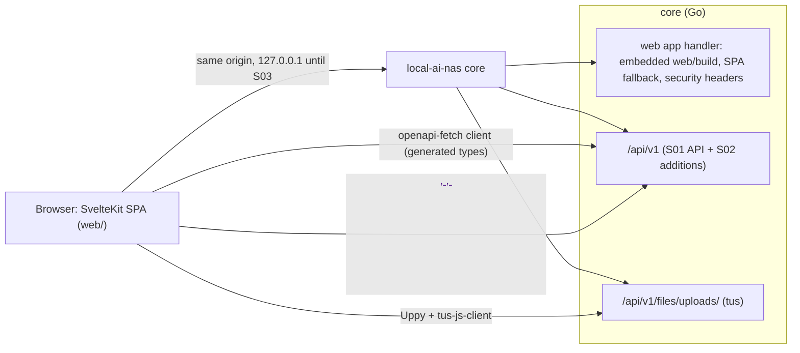

# S02: NAS GUI

| Field | Value |
|---|---|
| Stage ID | S02 |
| Status | **In Progress** (approved 2026-09-25, session S006 E009) |
| Blocked reason | |
| Plan version this stage is based on | 1.3.0 |
| Origin | User-defined |
| Created | 2026-09-25 (session S006) |
| Last updated | 2026-09-25 (session S006) |
| Depends on stages | S01 (Done) |
| Related ADRs | ADR-0009 SvelteKit web UI (Accepted) · ADR-0002 REST/OpenAPI, generated client (Accepted) · ADR-0008 tus, Uppy (Accepted) · ADR-0004 repository layout, `web/` + `web/embed.go` (Accepted) · ADR-0005 testing and CI tools (Accepted) · ADR-0020 video player shape (Accepted, S04.8) |

## 1. Goal

A web interface, served by the NAS from the same binary, with which a non-technical user can do everything S01 offers: browse, upload (including large and resumable uploads and whole folders), download (including several items as one ZIP), create, rename, move, copy, delete, and preview files. It works on desktops, tablets, and phones, by keyboard and screen reader, in light and dark themes.

**Exit criteria (from plan):** "A non-technical user can do everything from S01 through the GUI."

**Until S03 (login and HTTPS)** the server still listens on this computer only (NFR-020, S01.6-T06). The GUI can therefore be used only in a browser on the same computer. Phone and tablet layouts are checked with the browsers' device emulation.

## 2. Linked requirements

| Requirement ID | Title | Covered fully / partially | Substage(s) |
|---|---|---|---|
| FR-078 | A graphical application for every NAS function | Fully for the S01 functions (later stages add their own GUI substages) | all |
| FR-083 | Design system with light and dark themes | Fully | S02.1 |
| FR-079 | App shell: layout, navigation, routing, loading and error states, notifications | Fully (Photos and Settings are placeholders until S04.7 and S10.5) | S02.2 |
| FR-002 | Browse the files area: list and grid, sorting, breadcrumbs, virtualized lists, empty states | Fully | S02.3 |
| FR-003 | Upload files, many files, and folders | Fully for the files area (photos in S04) | S02.4 |
| FR-004 | Resumable uploads | Fully (GUI side; the server side is S01.4) | S02.4 |
| FR-005 | Downloads with ranges | Fully (GUI uses S01.3) | S02.4, S02.6 |
| FR-006 | Several items or a folder as a streamed ZIP | Fully | S02.4 |
| FR-080 | GUI uploads: button, drag and drop, queue, pause, resume, cancel | Fully | S02.4 |
| FR-007 | File operations | Fully (GUI) | S02.5 |
| FR-021 | Multi-select and bulk actions | Partially (download, delete, move, copy; album and transfer actions come with S04) | S02.5 |
| FR-077 | Name-conflict handling | Fully (GUI dialogs) | S02.5 |
| FR-081 | GUI file operations: dialogs, folder picker, multi-select, context menus, shortcuts, conflict dialogs | Fully | S02.5 |
| FR-082 | File previews: image, text and code, PDF, audio, video; fallback | Fully | S02.6 |
| NFR-001 | Local-only: the GUI loads no remote assets | Fully for S02 | S02.1 |
| NFR-014 | Tests, lint, format, type checks, CI | Fully for S02 | S02.1, S02.8 |
| NFR-015 | Phone and tablet layouts, keyboard, screen readers, WCAG 2.1 AA contrast | Fully | S02.7 |
| NFR-022 | Hardening: safe previews and security headers from S02 | Partially (CSRF, CORS policy, full CSP, and rate limiting come in S03) | S02.1, S02.6 |
| NFR-027 | Current Chrome, Edge, Firefox, Safari (desktop and mobile) | Partially: Chrome, Edge, and Firefox on desktop, and phone layouts by device emulation. **Safari is not checked in S02** (the user's decision, S006 E009) | S02.8 |

## 3. Scope

### In scope
- **Web app** in `web/`: SvelteKit (static SPA) + TypeScript + Tailwind CSS (ADR-0009), built with pnpm, **embedded in the Go binary** and served at `/`, on the same origin as the API.
- **Design system:** tokens, light and dark themes, base components, bundled icons, system fonts.
- **Generated API client** from `api/openapi.yaml`, with problem (RFC 9457) handling.
- **Screens:**
  - the app shell with Files, Photos (placeholder), and Settings (placeholder with theme and About);
  - the file browser (list and grid, virtualized, sorting, breadcrumbs);
  - the upload manager (tus, folders, drag and drop);
  - downloads, including ZIP; operation dialogs and the folder picker;
  - previews.
- **Server additions** (spec-first, with the S01 conventions and review checklist):
  - serving the embedded app with security headers;
  - `total` and `offset` in folder listings;
  - streamed ZIP archives.
- Responsive layouts and accessibility.
- **Tests in S02.8** (RULES R6, S006):
  - unit and component tests (Vitest);
  - Go tests for the server additions;
  - system tests (Playwright in real browsers against the real binary);
  - accessibility checks (axe).
- The web CI job, the Go build embedding the UI, Dependabot for npm, the license check for npm packages, and a GUI user guide.

### Out of scope
- Login, sessions, HTTPS, CSRF protection, the full CSP, and rate limiting (S03). **LAN access comes with S03**; the bind guard stays.
- The photos area (S04.7), thumbnails (S04.4), and video quality levels and HLS (S04.8). The S02 video player is built so that S04.8 can extend it (ADR-0020).
- Trash (S08): deletes stay permanent, and the GUI says so.
- Background jobs (S04.3): copies above the synchronous limits (1000 items, 1 GiB) still get `422`, and the GUI explains it.
- Settings beyond theme and About (S10.5). Search (S06).
- Internationalization. The GUI is English only, with dates and sizes formatted for the browser's locale.

## 4. Design approach

### 4.1 Components



### 4.2 Key design points

- **Project and build (ADR-0009):**
  - `web/` is a SvelteKit project with `@sveltejs/adapter-static` in SPA mode (fallback page `index.html`), built by pnpm into `web/build/`.
  - TypeScript is **pinned to 6.0.3**, because svelte-check 4.7.6, @sveltejs/kit 2.70.3, and typescript-eslint 8.70.1 accept at most TypeScript 6 (checked 2026-09-25). A move to TypeScript 7 happens when they support it.
  - The Node.js 24 LTS line (`engines`: `>=24.19`) with pnpm 12.6.0 and a committed `pnpm-lock.yaml`.
- **Embedding (ADR-0004):**
  - `web/embed.go` (package `web`) embeds `//go:embed all:build`. `web/build/` holds a committed `.gitkeep` and is otherwise git-ignored. So `go build` and `go run` still work without Node.js, as in the README quick start and the CI quick-start step.
  - A binary built without the UI serves a short notice at `/` that says how to build it. CI's build job and later release builds (S11) build the UI first.
- **Serving the app** (new handler in the core):
  - `GET /` and every other non-API path returns the file from `web/build`, or `index.html` for app routes (SPA fallback). Anything under `/api/` never falls back, so unknown API paths stay `404` problems.
  - **Caching:** `/_app/immutable/*` (hashed names) is cached for a year; `index.html` gets `no-cache`.
  - **Security headers:**
    - `Content-Security-Policy` with SvelteKit's generated script hashes (`kit.csp.mode: 'hash'`): `default-src 'self'`, no inline scripts, `object-src 'none'`, `frame-ancestors 'none'`, `base-uri 'self'`;
    - `X-Content-Type-Options: nosniff`; `Referrer-Policy: no-referrer`.
  - S03.5 hardens this further.
  - The route-inventory guard test (`TestRoutesAreVersioned`) and `docs/api/versioning.md` are updated for the app at `/`.
- **Development:** `pnpm dev` runs the Vite dev server with a proxy from `/api` to `http://127.0.0.1:8080`. The README's Development section gets the steps.
- **API client (ADR-0002):**
  - `openapi-typescript` generates `web/src/lib/api/schema.d.ts` from `api/openapi.yaml` (`pnpm generate`), and CI fails on drift, like the Go code.
  - A thin wrapper around `openapi-fetch` turns problems into a typed `ApiError` (status, `code`, `rule`, `detail`, `correlation_id`).
  - The GUI uses only the public API, so S03 adds login without rewriting screens.
- **Design system (FR-083):**
  - Tailwind 4 tokens as CSS variables for color, spacing, radius, and typography, in a light and a dark set. The theme follows `prefers-color-scheme`, and a runtime toggle is remembered per browser.
  - System fonts, so no font files to bundle. Icons from Lucide (`@lucide/svelte`, ISC), bundled per icon. Nothing is loaded from the internet (I6).
  - Base components: Button, IconButton, TextField, Checkbox, Dialog (focus trap, Escape), Menu and context menu, Toast, ProgressBar, Spinner, EmptyState, Breadcrumbs, and Tooltip.
  - A component gallery page exists in development builds only.
- **File browser (FR-002):**
  - One view model feeds a list view and a grid view.
  - Virtualization with `@tanstack/svelte-virtual`. A prototype task confirms it on Svelte 5 first; if it fails, a small custom windowing component replaces it (ADR-0009).
  - **Server addition:** the listing response gains `total` (the number of visible items in the folder), and the request gains `offset` as an alternative to `cursor` (not both), for random access when the scrollbar is dragged. Both are compatible additions within v1 (`docs/api/versioning.md`). The server already reads and sorts the whole folder for every page, so they cost nothing extra.
  - Pages of 500 items load when their region becomes visible. Sorting uses the API's sort keys: name, size, date (`mod_time`), and type (`kind`).
  - The URL is `/files/<encoded path>`, so reloads, back and forward, and bookmarks work.
- **Uploads (FR-003, FR-004, FR-080):**
  - `@uppy/core` + `@uppy/tus` (tus-js-client inside), used **headless** with the GUI's own queue components, so the look matches the design system.
  - Uploads use tus. The creation request carries no data, so a refusal (409, 413, 507) always arrives as an answer (bug S02-B08; changed in S02.4-T01). Chunks stay within `uploads.max_chunk_size`, which the GUI reads from the `Upload-Max-Chunk-Size` header of the tus `OPTIONS` answer, or else defaults to 64 MiB. `on_conflict` comes from the conflict dialog (S02.5).
  - **Resume:**
    - after a network drop: automatic retries with backoff;
    - after a page reload: the upload URL is remembered per file (tus fingerprint in `localStorage`), so the user adds the same file again and it continues from the server's offset. Browsers do not keep file access across reloads, and the GUI says so.
  - **Folders** (button with `webkitdirectory`, or drag and drop of a folder): the GUI first creates the folder tree (`POST /files/folders` with `parents`) and then uploads the files with a limited number in parallel (3).
  - The GUI sends no `sha256` metadata. Hashing a large file in the browser would mean reading it twice, and the upload is already protected by tus offsets.
- **Downloads (FR-005, FR-006):**
  - A single file downloads through a normal link to `GET /api/v1/files/content`, so the browser's own download manager handles it.
  - Several items or a folder go through a **streamed ZIP archive** (server addition):
    - `POST /api/v1/files/archives` with `{"paths": [...], "name": "…"}` checks every path first: it exists, no links (never followed), within the namespace. It answers `201 {"id", "url", "expires_at"}`.
    - `GET /api/v1/files/archives/{id}` streams the ZIP. Entries are stored, not compressed (fast, and most large files are compressed already), with ZIP64 for large files, UTF-8 names, and file times kept.
    - A ticket works for 5 minutes and lives in memory. It can be downloaded more than once, because browsers may retry.
    - Memory stays bounded; the S01.4 memory test is extended in S02.8.
    - An error after streaming has started ends the connection (the browser shows a failed download) and is logged.
  - The two steps keep JSON request bodies (the S01 convention) and still let the browser stream the result as a normal download, without holding it in memory.
- **File operations (FR-007, FR-077, FR-081):**
  - A selection model keyed by path: click, Ctrl/Cmd-click, Shift-range, select all, and the keyboard.
  - Dialogs:
    - new folder and rename;
    - move and copy, with a folder picker built on the listing API;
    - delete, which always asks and states that deleting is permanent until the trash arrives (RK-19).
  - `invalid_name` problems show the rule in plain words.
  - Bulk operations run one item at a time, with a progress entry and a summary of the failures.
  - **Conflicts:** the dialog offers skip, keep both (`rename`), and replace (`overwrite`, files only), with "apply to all". A folder conflict offers skip or keep both, because folders are never merged or replaced (S01 rule).
  - Context menus by right-click or long-press. Keyboard shortcuts:
    - F2 rename, Delete delete;
    - Ctrl/Cmd+A select all, Shift+N new folder (changed in S02.5-T04: Chromium browsers keep Ctrl/Cmd+Shift+N for a private window, and pages never see it);
    - Enter open, Alt+Up or Backspace parent folder;
    - Ctrl/Cmd+C, X, and V to copy or move within the app;
    - `?` shows the list.
- **Previews (FR-082, NFR-022):**
  - The browser loads previews from the existing download endpoint, which S01 already hardened: attachment, `nosniff`, and a sandbox CSP. Opening that URL in a tab therefore always downloads and never renders.
  - The rendering rules:
    - **images, SVG included,** only through `` (scripts in SVG never run there);
    - **audio and video** through `<audio>` and `<video>` with range requests (seeking without a full download). The video component is shaped so that S04.8 can add HLS and the quality menu (ADR-0020);
    - **text and code:** the first 256 KiB by `Range`, shown as text and never as HTML;
    - **PDF:** decided in S02.6-T04. The recommendation is **pdf.js** (`pdfjs-dist`, Apache-2.0), loaded lazily, with scripting and `eval` turned off. The browsers' built-in viewers do not run under the download's sandbox CSP and are missing on some phones;
    - **HTML and anything else:** a fallback card with a download button.
- **Accessibility and responsiveness (NFR-015):**
  - Layouts from 360 px up: a bottom navigation bar on phones, and touch targets of at least 44 px.
  - The virtualized list works as an ARIA grid with roving focus. Dialogs trap focus and return it when they close.
  - Live regions announce toasts and progress. Focus rings are visible.
  - Contrast meets WCAG 2.1 AA in both themes.
- **Testable code (RULES R6, S006):**
  - Stores and logic live in plain TypeScript modules in `web/src/lib/` (the upload planner, selection model, conflict resolution, path and URL encoding, formatting, type detection, keyboard map). Their dependencies (the API client, clock, storage) are passed in. Components stay thin.
  - The Go additions follow the S01 structure: the files service interface, the generated strict server, and the injected clock for ticket expiry.
  - **Tests are written in S02.8.** Guard tests from S01 that enforce completeness (spec against routes, one error case per route, the route inventory, architecture tests) must stay green on every push. So a task that adds a route adds the entries those tests require, and nothing more.
  - Bugs found while building are recorded in section 12 and fixed at once, and their regression tests are written in S02.8.

### 4.3 Server additions (spec-first, `api/openapi.yaml`)

| Method + path | Purpose | Task |
|---|---|---|
| `GET /`, `GET /{app path}` | The embedded web app (SPA fallback) with security headers. Not part of the versioned API | S02.1-T02 |
| `GET /api/v1/files/items?…&offset=` | Listing: new `offset` parameter (alternative to `cursor`) and new `total` field in the answer | S02.3-T02 |
| `POST /api/v1/files/archives` | Check the paths and create a ZIP archive ticket (`201`) | S02.4-T03 |
| `GET /api/v1/files/archives/{id}` | Stream the ZIP (`200`; `404` for an unknown or expired ticket) | S02.4-T03 |

Each one gets a review row in `docs/api/conventions.md` and its problems in the spec. New error codes, if any, go to `docs/api/errors.md` (codes are only added).

### 4.4 Web project layout

```
web/
├── embed.go                 package web: //go:embed all:build (ADR-0004)
├── build/.gitkeep           the rest of build/ is git-ignored
├── package.json, pnpm-lock.yaml, svelte.config.js, vite.config.ts, tsconfig.json
├── eslint.config.js, .prettierrc
└── src/
    ├── app.html, app.css           (Tailwind + theme tokens)
    ├── lib/
    │   ├── api/                    schema.d.ts (generated), client.ts, errors.ts
    │   ├── components/             design-system components
    │   ├── files/                  browser view model, selection, operations, conflicts
    │   ├── uploads/                Uppy setup, queue store, folder planner
    │   ├── previews/               type detection, preview components
    │   └── util/                   paths, formatting, keyboard map, theme
    └── routes/                     /files/[...path], /photos, /settings, +layout, +error
```

## 5. Substages and tasks

<!-- Hierarchy: Stage → Substage → Task (RULES.md R3). Task IDs: S02.<n>-T<NN>. -->

### Substage overview

| Substage | Name | Status | Depends on | Requirements |
|---|---|---|---|---|
| S02.1 | GUI technology and design foundation | **Done** (S006) | S01 | FR-078, FR-083, NFR-001, NFR-014 |
| S02.2 | App shell and navigation | **Done** (S006) | S02.1 | FR-079 |
| S02.3 | File browser | **Done** (S006) | S02.2, S01.3 | FR-002 |
| S02.4 | Uploads and downloads | **Done** (S006) | S02.3, S01.4 | FR-003, FR-004, FR-006, FR-080 |
| S02.5 | File operations UI | In Progress | S02.3, S01.3, S01.6 | FR-007, FR-021, FR-077, FR-081 |
| S02.6 | File previews | Not started | S02.3, S01.3 | FR-082, NFR-022 |
| S02.7 | Responsiveness and accessibility | Not started | S02.2–S02.6 | NFR-015 |
| S02.8 | Testing and stage review | Not started | S02.1–S02.7 | NFR-014, NFR-027 |

**Execution order:** S02.1 → S02.2 → S02.3 → S02.4 → S02.5 → S02.6 → S02.7 → S02.8.

**Rule (R6):** the tasks in S02.1–S02.7 deliver code, written to be testable. Such a task is Done when:
- it builds;
- `pnpm lint`, `pnpm check`, the Go linter and formatter, and the existing tests pass;
- it was checked by running it, as its acceptance criteria say.

Its tests are written in S02.8.

### S02.1: GUI technology and design foundation

- **Goal:** Build the toolchain, the served app skeleton, the API client, and the design system that every screen uses.
- **Substage acceptance criteria (plan):**
  1. The GUI is served by the NAS at the same origin as the API and makes no external requests.
  2. Light and dark themes switch at runtime and follow the OS setting by default.
  3. The API client is generated from the committed OpenAPI spec, and CI fails on drift.
  4. Frontend lint and type checks run in CI. The frontend unit tests join them in S02.8 (R6, S006).

| Task ID | Description | Status | Acceptance criteria |
|---|---|---|---|
| S02.1-T01 | **Toolchain and project:** <br>• install pnpm 12.6.0 on the development PC (Node.js 24 LTS is present: 24.19.0; update to the current 24.21.0 LTS); <br>• create `web/` (SvelteKit + adapter-static SPA, TypeScript 6.0.3, Tailwind 4, ESLint, Prettier, svelte-check), with scripts `dev`, `build`, `check`, `lint`, `format`, `generate`; <br>• `engines`; `pnpm-lock.yaml`; `.gitignore` for `web/build` except `.gitkeep`; <br>• register every package (R6), and the Node.js and pnpm rows (sections 1 and 12). | **Done** (S006 E011) | `pnpm install --frozen-lockfile`, `pnpm lint`, `pnpm check`, and `pnpm build` succeed on Windows and on Linux (WSL). Every package is in the register with a license on the allow-list. |
| S02.1-T02 | **Embedding and serving:** <br>• `web/embed.go`; the app handler in the core with the SPA fallback, caching, and security headers (4.2); <br>• the notice page for a binary without the UI; <br>• `/api/*` never falls back; <br>• the route-inventory guard test and `docs/api/versioning.md` updated for `/`. | **Done** (S006 E013) | A binary built after `pnpm build` serves the app at `http://127.0.0.1:8080/`. A deep link survives a reload. The browser's network panel shows no request to another host. The response headers carry the CSP and `nosniff`. A binary built without Node.js shows the notice. An unknown `/api/…` path is still a `404` problem. |
| S02.1-T03 | **API client:** `pnpm generate` (openapi-typescript) into `src/lib/api/schema.d.ts`; `client.ts` (openapi-fetch) and `errors.ts` (problems → `ApiError`). | **Done** (S006 E014) | `pnpm check` passes with the generated types. A call against the running server returns typed data, and a failing call returns an `ApiError` with `code` and `correlation_id` (checked from the gallery page or the console). |
| S02.1-T04 | **Design system:** tokens and themes (OS default, runtime toggle, remembered); the base components (4.2); Lucide icons; the development-only component gallery. | **Done** (S006 E015) | The gallery shows every component in both themes. The theme follows the OS and switches without a reload. Keyboard use of Dialog and Menu works (Tab, Escape, arrow keys). |
| S02.1-T05 | **CI and project hygiene:** <br>• a `web` job (Linux): frozen install, format check, lint, `svelte-check`, build, API-client drift check, npm license check against `scripts/allowed-licenses.txt`, and `pnpm audit --prod`; <br>• the `build` job builds the UI before `go build`, so the artifacts contain it; <br>• Dependabot for npm in `/web`; <br>• README Development section: building the UI and `pnpm dev`. | **Done** (S006 E016) | CI is green. A deliberate lint error fails the `web` job (seen once, then reverted). The linux/amd64 artifact serves the UI. |

### S02.2: App shell and navigation

- **Goal:** A stable layout and navigation frame that every feature plugs into.
- **Substage acceptance criteria (plan):**
  1. Files, Photos, and Settings are reachable with deep links and browser back and forward.
  2. API errors show a consistent, human-readable message, never a blank screen.
  3. Long operations show progress, and completions and failures raise notifications.

| Task ID | Description | Status | Acceptance criteria |
|---|---|---|---|
| S02.2-T01 | **Layout and routes:** <br>• header with the app name and theme toggle; side navigation, which becomes a bottom bar on phones; <br>• `/files/[...path]`, `/photos` (placeholder: "comes with stage 4"), and `/settings` (theme, and About with the version and third-party licenses); <br>• `/` redirects to `/files/`; a not-found page. | **Done** (S006 E017) | Every section opens by URL. Back and forward work. A reload keeps the page. |
| S02.2-T02 | **Errors and loading:** <br>• problem codes mapped to plain messages, with a details area (the `detail` text and request ID); <br>• the `+error` boundary and a global loading indicator; <br>• a "server not reachable" state with retry. | **Done** (S006 E018) | Stopping the server shows the unreachable state, and retry recovers once it is back. A bad path shows a clear not-found message. No action leaves a blank screen. |
| S02.2-T03 | **Notifications and progress:** toasts (info, success, error; announced to screen readers), and a progress panel for long operations (uploads, bulk operations, archives). | **Done** (S006 E019) | A finished or failed operation raises a toast. The progress panel lists the running operations (checked with a slowed network in the browser tools). |

### S02.3: File browser

- **Goal:** Browse the files area comfortably, even with very large folders.
- **Substage acceptance criteria (plan):**
  1. A folder of 50,000 items scrolls smoothly and loads pages on demand.
  2. Sorting by name, size, date, and type matches the API order.
  3. The URL reflects the current folder, and reloading restores it.
  4. Empty and error states show a clear next action.

| Task ID | Description | Status | Acceptance criteria |
|---|---|---|---|
| S02.3-T01 | **Virtualization prototype** (ADR-0009): `@tanstack/svelte-virtual` on Svelte 5 with 50,000 synthetic rows, a grid variant, and keyboard focus. Keep it, or switch to a custom windowing component. | **Done** (S006 E020) | The decision and the reason are recorded in section 12. Scrolling 50,000 rows shows no visible stutter, checked in the browser's performance panel (no long tasks over 50 ms while scrolling). |
| S02.3-T02 | **Server: `total` and `offset`** in the listing (spec-first; files service; conventions review row; the guard-test entries). | **Done** (S006 E021) | `curl` shows that `?offset=30000&limit=100` returns items 30,000–30,099 in the requested sort, with `total` in the answer. `cursor` still works, and `offset` with `cursor` together is a `400` problem. |
| S02.3-T03 | **List and grid views:** <br>• virtualized, with pages loaded by `offset` when their region becomes visible; <br>• sorting (name, size, date, type; ascending and descending); <br>• icons by type, sizes and dates in the browser's locale; <br>• the view mode is remembered. | **Done** (S006 E022) | In a 50,000-file folder (created with a script), scrolling stays smooth. Dragging the scrollbar to the middle shows those items within about a second. The order matches the API for every sort. |
| S02.3-T04 | **Navigation and states:** breadcrumbs, opening folders (click, Enter), `/files/<encoded path>` URLs for any valid name, empty-folder and error states with actions (upload, new folder, parent folder, retry). | **Done** (S006 E023) | Names with spaces, `#`, `%`, `?`, and Unicode round-trip through the URL and a reload. Every state shows its next action. |

### S02.4: Uploads and downloads

- **Goal:** Easy, robust uploads and downloads from the GUI.
- **Substage acceptance criteria (plan):**
  1. Dropping a folder tree uploads it with its structure.
  2. Pause, resume (including after a page reload or network drop), and cancel work for large files.
  3. Multi-item download streams a ZIP without the server buffering it in memory.
  4. Per-file errors (limit, conflict, disk full) are shown clearly.

| Task ID | Description | Status | Acceptance criteria |
|---|---|---|---|
| S02.4-T01 | **Upload manager:** <br>• headless Uppy + tus; the queue with progress, speed, pause, resume, cancel, and retry; <br>• creation-with-upload for small files; the chunk size from the server; <br>• resume after a network drop, and after a reload once the file is added again; <br>• per-file problems shown (`413`, `409`, `507`, `invalid_name`). | **Done** (S006 E024) | A 2 GiB file uploads. Pause and resume work. With the browser set offline for 10 seconds, the upload continues afterwards. After a reload and re-adding the file, it resumes from the server's offset (network panel: a `HEAD`, then `PATCH` from that offset). A too-large file, a taken name, and a full-disk reserve each show their message. |
| S02.4-T02 | **Files, folders, drag and drop:** buttons for files and for a folder (`webkitdirectory`); a drop zone over the page; the folder tree created first, then its files, 3 at a time. | **Done** (S006 E025) | Dropping a nested folder with 1,000 files recreates the exact tree (compared with a listing script). Dropping works in Chrome, Edge, and Firefox on this PC. |
| S02.4-T03 | **Server: streamed ZIP archives** (4.3): <br>• `POST /api/v1/files/archives` and `GET /api/v1/files/archives/{id}` (spec-first, conventions review row, guard-test entries); <br>• store method, ZIP64, UTF-8 names, times kept; <br>• in-memory tickets with a 5-minute expiry (injected clock); <br>• links refused at creation; mid-stream errors logged. | **Done** (S006 E027) | A folder over 4 GiB downloads as a ZIP that Windows Explorer and `unzip` (WSL) open, with names and times intact. The server's memory stays flat during the download (heap figure logged at debug level). An expired ticket is a `404` problem. |
| S02.4-T04 | **Download actions:** a single file by link; a selection or a folder through an archive, named after the folder or `download-<date>.zip`. | **Done** (S006 E028) | Both kinds of download use the browser's download manager, and the progress is the browser's own. |

### S02.5: File operations UI

- **Goal:** Every file operation available from the GUI, individually and in bulk.
- **Substage acceptance criteria (plan):**
  1. All S01 operations work from the GUI on single items and multi-selections.
  2. Name conflicts open a dialog (skip, rename, overwrite), and the choice is passed to the API.
  3. Delete always asks for confirmation and states that deletion is permanent (no trash until S08).
  4. The main actions have keyboard shortcuts and context-menu entries.

| Task ID | Description | Status | Acceptance criteria |
|---|---|---|---|
| S02.5-T01 | **Selection model:** click, Ctrl/Cmd-click, Shift-range, select all, the keyboard, and a selection bar with a count and actions. | **Done** (S006 E030) | Selections behave as in common file managers, including across pages loaded later. |
| S02.5-T02 | **Operation dialogs:** <br>• new folder, rename, move and copy with the folder picker, delete confirmation (permanent, with the item count); <br>• `invalid_name` rules in plain words; <br>• bulk runs with progress and a failure summary; <br>• the `422 too_large_for_sync` copy limit explained. | **Done** (S006 E031) | Each S01 operation works on one item and on a selection. A name breaking a rule shows the rule. Deleting always asks first. |
| S02.5-T03 | **Conflict dialog:** skip, keep both, replace (files only), with "apply to all"; the choice becomes `on_conflict` for each item; for folders, only skip and keep both. | **Done** (S006 E032) | For a move, copy, upload, and new folder into taken names, each choice gives the matching server result (checked with a listing afterwards). |
| S02.5-T04 | **Context menus and shortcuts:** right-click and long-press menus; the shortcut map (4.2); the `?` help list. | **Done** (S006 E033) | Every main action is reachable from the context menu and by keyboard alone. |

### S02.6: File previews

- **Goal:** Preview common file types safely inside the GUI.
- **Substage acceptance criteria (plan):**
  1. Supported types preview inline, and audio and video seek via range requests without a full download.
  2. SVG, HTML, and other active content never execute scripts in the app's origin. This is shown with crafted files now and tested in S02.8.
  3. Large text files preview only a bounded first portion.
  4. Unsupported types show a fallback with a download action.

| Task ID | Description | Status | Acceptance criteria |
|---|---|---|---|
| S02.6-T01 | **Preview frame:** an overlay with previous and next, keyboard control (arrows, Escape), a download button, type detection (the item's `mime`, then the extension), and the fallback card. | Not started | Every file in a folder can be stepped through. Unsupported types show the fallback. |
| S02.6-T02 | **Image, audio, video:** images (SVG included) only through ``; `<audio>` and `<video>` with native controls, shaped for S04.8 (ADR-0020). | Not started | Seeking in a 2 GiB video starts playback at once. The network panel shows `206` answers, not a full download. |
| S02.6-T03 | **Text and code:** the first 256 KiB by `Range`, decoded as UTF-8 (with replacement characters for invalid bytes), shown as text with a "showing the first 256 KiB" notice. | Not started | A 1 GiB log file previews at once with the notice. HTML source is shown as text. |
| S02.6-T04 | **PDF:** decide between pdf.js and the built-in viewer on the criteria in 4.2 (recorded in section 12 and the register), then build it: lazily loaded, with scripting and `eval` off, and the worker served from the app. | Not started | A 100-page PDF previews and pages. A PDF with embedded JavaScript does not run it (a crafted file). |
| S02.6-T05 | **Active-content safety:** check crafted SVG (script, event handler), HTML, and XML files in every preview path and by opening their download URL directly. | Not started | No script runs (no alert, and no request to a canary URL on a local listener). The direct URL downloads the file instead of rendering it. |

### S02.7: Responsiveness and accessibility

- **Goal:** The GUI works well on phones and tablets and for keyboard and screen-reader users.
- **Substage acceptance criteria (plan):**
  1. All S02 flows work at 360 px phone width and at tablet widths.
  2. Every action is reachable by keyboard with a visible focus indicator.
  3. Automated accessibility checks report no serious violations on the main screens. They are written and run in S02.8, and S02.7 fixes what a manual axe browser check finds.
  4. Contrast meets WCAG 2.1 AA in both themes.

| Task ID | Description | Status | Acceptance criteria |
|---|---|---|---|
| S02.7-T01 | **Phone and tablet layouts:** from 360 px up; the bottom navigation; 44 px touch targets; long-press menus; full-screen dialogs on phones. | Not started | Every flow works in the browser's device emulation at 360, 768, and 1024 px. |
| S02.7-T02 | **Keyboard and screen readers:** <br>• the ARIA grid with roving focus in the file views, and labels on every control; <br>• live regions for toasts and progress; focus return after dialogs. | Not started | Every flow can be done by keyboard alone. Windows Narrator reads folder items, selection, and progress sensibly (a manual check). |
| S02.7-T03 | **Contrast and a manual axe check:** fix the token colors and components; run the axe browser extension on the main screens in both themes. | Not started | The token pairs meet 4.5:1 (text) and 3:1 (UI parts). The axe extension shows no serious issue on the main screens. |

### S02.8: Testing and stage review (final substage, template shape)

- **Goal:** Prove that a non-technical user can do everything from S01 through the GUI, then close the stage.
- **Substage acceptance criteria (plan, with R6 of S006):**
  1. End-to-end tests cover browse, upload (with resume), download, rename, move, copy, delete, and preview, and pass in CI.
  2. Cross-browser check done on current Chrome, Edge, and Firefox. Safari is not checked in S02 (the user's decision, S006 E009; plan 1.3.0).
  3. The GUI user guide section is written.
  4. The completion record is written and the user's sign-off is recorded.

| Task ID | Description | Status | Acceptance criteria |
|---|---|---|---|
| S02.8-T01 | **Unit and component tests:** <br>• Vitest for the modules in `src/lib/` (API errors, paths and URLs, formatting, type detection, the selection model, the conflict planner, the upload folder planner, the keyboard map); <br>• Vitest browser mode (Playwright provider) for the components and main views; <br>• Go unit tests for the server additions (`total`/`offset`, archives, the app handler and headers); <br>• the regression tests for every bug recorded in section 12. | Not started | All pass in CI. Coverage is at least 80% for Go `internal/...` and for `web/src/lib`. Every recorded bug has a test. |
| S02.8-T02 | **Integration and system tests:** <br>• **Go integration:** archives over HTTP (large trees, ZIP64, memory bound in the `memory` job), the app handler, and the listing additions over the real server. <br>• **Playwright system tests** against the real binary with the embedded UI, in Chromium and Firefox, in CI on Linux and Windows, plus Edge (the `msedge` channel) on Windows: <br>&nbsp;&nbsp;– browse (a 50,000-item folder), upload (large, with pause, offline, reload and re-add), folder upload, single and ZIP downloads; <br>&nbsp;&nbsp;– rename, move, copy, and delete with each conflict choice; <br>&nbsp;&nbsp;– previews (image, text truncation, PDF, audio and video seeking by `206`) and the active-content cases; <br>&nbsp;&nbsp;– keyboard-only flows, phone and tablet viewports, and axe checks in both themes. | Not started | All pass in CI on Linux and Windows. Axe reports no serious violation on the main screens. |
| S02.8-T03 | **Cross-browser and user guide:** the cross-browser report (Chrome, Edge through Playwright's `msedge` channel on Windows, and Firefox; Safari not checked, E009); `docs/guide/web-interface.md` (the GUI user guide section); the README Development section brought up to date; plan status; CURRENT_STATE; the register. | Not started | The report is in `docs/`. The guide covers every S02 flow. The documents match what was built. |
| S02.8-T04 | **Documentation audit A003 (R12)** using `templates/audit-checklist.md`. | Not started | Audit complete; no Critical finding open. |
| S02.8-T05 | **Completion record and user sign-off**, including a hands-on walkthrough by the user on this PC. | Not started | Section 13 is filled in. The user's sign-off is quoted in the session log. |

## 6. Files and modules expected to be created or changed

| Path | Create / Change | Purpose | Task ID(s) |
|---|---|---|---|
| `web/` (project files, `src/**`) | Create | The web app | S02.1–S02.7 |
| `web/embed.go`, `web/build/.gitkeep` | Create | Embedding the built UI (ADR-0004) | S02.1-T02 |
| `internal/webapp/` (or `internal/api/app.go`; decided in S02.1-T02) | Create | Serving the app: fallback, caching, headers | S02.1-T02 |
| `cmd/local-ai-nas/serve.go` | Change | Mount the app handler | S02.1-T02 |
| `api/openapi.yaml`, `internal/api/gen/` (generated) | Change | `offset`, `total`; archives | S02.3-T02, S02.4-T03 |
| `internal/files/list.go`, `internal/api/*.go` | Change | `offset`, `total` | S02.3-T02 |
| `internal/files/archive.go` (or `internal/archives/`), `internal/api/archives.go` | Create | Streamed ZIP archives and tickets | S02.4-T03 |
| `internal/api/*_test.go` guard tables (`errorCases`, route inventory) | Change | Keep the S01 guard tests green for new routes | S02.1-T02, S02.3-T02, S02.4-T03 |
| `docs/api/conventions.md`, `docs/api/versioning.md`, `docs/api/errors.md` (if new codes) | Change | Review rows, the app at `/`, codes | S02.1-T02, S02.3-T02, S02.4-T03 |
| `.github/workflows/ci.yml`, `.github/dependabot.yml` | Change | `web` job, UI in the build job, e2e job, npm updates | S02.1-T05, S02.8-T02 |
| `scripts/check-licenses.sh` (or a new `scripts/check-web-licenses.sh`) | Change / Create | npm license check | S02.1-T05 |
| `.gitignore` | Change | `web/node_modules`, `web/build/*` except `.gitkeep`, `web/.svelte-kit` | S02.1-T01 |
| `README.md` | Change | **Development section only**: building the UI, `pnpm dev`, the web interface | S02.1-T05, S02.8-T03 |
| `docs/guide/web-interface.md`, `docs/README.md` | Create / Change | GUI user guide section; index | S02.8-T03 |
| `web/src/**/*.test.ts`, `*_test.go`, `web/e2e/**` | Create | The stage's tests | S02.8-T01, S02.8-T02 |
| `code-agent-docs/dependencies.md` | Change | Every npm package, Node.js, pnpm, CI actions (R6) | S02.1-T01 and each task that adds one |

## 7. Dependencies to add

Versions were checked on the npm registry on 2026-09-25. They are installed at these versions in S02.1-T01, or when the task that needs them starts, and registered in `dependencies.md` in the same commit (R6).

| Dependency | Version | Justification | License | License compatible? |
|---|---|---|---|---|
| Node.js (LTS) | 24.21.0 (24.19.0 present) | Build time only: Vite and SvelteKit | MIT | Yes (build tool, not shipped) |
| pnpm | 12.6.0 | Package manager with lockfile (ADR-0009) | MIT | Yes (build tool) |
| svelte / @sveltejs/kit / @sveltejs/adapter-static / @sveltejs/vite-plugin-svelte | 5.57.1 / 2.70.3 / 3.0.10 / 7.3.1 | The UI framework (ADR-0009) | MIT | Yes (bundled) |
| vite | 8.3.1 | Build tool and dev server | MIT | Yes (build tool) |
| tailwindcss / @tailwindcss/vite | 4.3.3 | Styling (ADR-0009) | MIT | Yes |
| typescript | 6.0.3 (pinned, 4.2) | Type checking | Apache-2.0 | Yes (build tool) |
| openapi-typescript / openapi-fetch | 7.13.0 / 0.17.0 | Generated types and typed client (ADR-0002) | MIT | Yes (the client is bundled) |
| @uppy/core / @uppy/tus (includes tus-js-client 4.3.1) | 6.0.1 / 6.0.0 | tus uploads (ADR-0008) | MIT | Yes (bundled) |
| @tanstack/svelte-virtual | 3.13.39 | Virtualized lists (ADR-0009; prototype in S02.3-T01) | MIT | Yes (bundled) |
| @lucide/svelte | 1.48.0 | Bundled icons (FR-083, I6) | ISC | Yes (bundled; ISC is on the allow-list) |
| pdfjs-dist | 6.3.289 | PDF previews, if S02.6-T04 chooses pdf.js | Apache-2.0 | Yes (bundled) |
| svelte-check | 4.7.6 | Svelte and TypeScript checks (ADR-0005) | MIT | Yes (dev) |
| eslint / @eslint/js / eslint-plugin-svelte / typescript-eslint / globals | 10.11.0 / 10.0.1 / 3.23.0 / 8.70.1 / 17.12.0 | Lint (ADR-0005) | MIT | Yes (dev) |
| prettier / prettier-plugin-svelte | 3.9.9 / 4.1.1 | Format (ADR-0005) | MIT | Yes (dev) |
| vitest / @vitest/browser-playwright / vitest-browser-svelte / @vitest/coverage-v8 | 5.0.1 / 5.0.1 / 3.1.0 / 5.0.1 | Unit and component tests, coverage (S02.8) | MIT | Yes (dev) |
| @playwright/test | 1.63.0 | System tests in real browsers (S02.8) | Apache-2.0 | Yes (dev) |
| @axe-core/playwright (axe-core) | 4.13.0 | Accessibility checks (S02.8) | MPL-2.0 | Yes (dev and test only, never shipped; MPL-2.0 is on the allow-list) |
| actions/setup-node / pnpm/action-setup | v7.0.0 / v6.1.0 | CI | MIT | Yes (CI only) |

## 8. Test plan

All rows are written in S02.8 (R6, S006). The code they test comes from S02.1–S02.7.

| What is tested | Test type (unit / integration / system / perf) | How | Task ID |
|---|---|---|---|
| `src/lib` modules: API errors, paths and URL encoding, formatting, type detection, selection model, conflict planner, upload folder planner, keyboard map | Unit | Vitest (node environment) | S02.8-T01 |
| Design-system components and main views (Dialog focus trap, Menu keys, list and grid rendering, theme switch) | Unit (component) | Vitest browser mode with Playwright | S02.8-T01 |
| Listing `total` and `offset`; archive tickets and ZIP writing; app handler (fallback, caching, headers, the no-UI notice) | Unit | Go `testing` | S02.8-T01 |
| Archives over HTTP (large trees, ZIP64, links refused, expiry); listing additions; memory bound for a large ZIP | Integration | Go tests over `httptest` and the `memory` CI job | S02.8-T02 |
| Every user flow of 5 against the real binary: browse, upload and resume, folder upload, downloads, operations and conflicts, previews, active content, keyboard, viewports | System | Playwright: Chromium and Firefox on Linux and Windows, Edge on Windows (CI) | S02.8-T02 |
| Accessibility of the main screens in both themes | System | @axe-core/playwright | S02.8-T02 |
| 50,000-item folder: first page time and smooth scrolling | Perf (system) | Playwright with a generated folder; long-task timing | S02.8-T02 |
| Regression tests for the bugs recorded in section 12 | Unit / integration / system | As fits each bug | S02.8-T01, T02 |

Commands that must pass before a task is marked Done (build, lint, format, and the existing tests; the stage's new tests come in S02.8):
```
go build ./... && go vet ./... && go test ./...
./bin/golangci-lint run ./... && ./bin/golangci-lint fmt --diff
cd web && pnpm install --frozen-lockfile && pnpm lint && pnpm check && pnpm build
```

## 9. Stage acceptance criteria

- [ ] Every S02 substage acceptance criterion in plan.md (S02.1 to S02.8) is met.
- [ ] A non-technical user can do everything from S01 through the GUI on this PC (the user's walkthrough, S02.8-T05).
- [ ] The GUI loads nothing from other hosts, and active content never runs in the app's origin.
- [ ] The stage's unit, integration, and system tests are written and pass in CI on Linux and Windows; coverage ≥ 80% (Go `internal/...`, `web/src/lib`). Linter, formatter, and type checks are clean.
- [ ] Cross-browser report done for Chrome, Edge, and Firefox (Safari not checked in S02, E009).
- [ ] Documentation and `dependencies.md` updated: the GUI guide, README Development section, API docs, plan and CURRENT_STATE status.
- [ ] Documentation audit (R12, S02.8-T04) done; no Critical finding open.

## 10. Risks and rollback approach

| Risk | Impact | Mitigation | Rollback |
|---|---|---|---|
| `@tanstack/svelte-virtual` misbehaves on Svelte 5 | The 50,000-item browser stutters | Prototype first (S02.3-T01) | A custom windowing component (ADR-0009) |
| Folder drag and drop differs between browsers | Folder uploads fail in some browsers | The folder button (`webkitdirectory`) always works; drop tested per browser | Button only |
| Resuming after a reload needs the file again | Users expect it to resume by itself | The GUI says so and matches the file automatically when it is added again | None needed (a browser limit) |
| pdf.js size or its needs under the S03 CSP (worker, WebAssembly) | Larger bundle; CSP exceptions | Loaded lazily, only when a PDF is opened; the CSP needs are recorded for S03.5 | The browser's viewer in a new tab, as a download |
| A 50,000-item folder is read and sorted in full for every page | Slow pages in huge folders | Measured in S02.3-T03 and S02.8; S01 listed 10,000 items with a p95 of 44 ms | A short-lived server-side cache of the sorted listing (a later task) |
| Permanent delete (RK-19) | Data loss by mistake | The confirmation dialog states it plainly, every time | None (the trash is S08) |
| No LAN access until S03 | Phones cannot be tried for real | Device emulation for phone and tablet layouts. Safari is not checked in S02 (E009) | None needed |
| Node.js toolchain on Windows | Build problems on the development PC | pnpm and Node LTS pinned; CI builds on Linux and Windows | None needed |

Every task is on its own branch and merged only with CI green. The GUI is additive: removing the app handler and `web/` returns the server to API-only without touching the S01 API.

## 11. Approval record

> "Approve S02 (Recommended)" (option text: "S02 becomes Approved, your approval is quoted in the document, and I start S02.1-T01 on its own branch.")
> (2026-09-25, session S006, log E009)

**Decision given with the approval:** the question was "Until stage 3, a phone or a Mac can't reach the server. How should Safari and real phones be checked?" The user answered **"Skip Safari"** (option text: "Chrome, Edge, and Firefox only. Safari is not checked."). S02 checks Chrome, Edge, and Firefox, with phone layouts by device emulation (plan 1.3.0).

## 12. Change log for this stage document

| Date | Session | Change | Reason | Needs re-approval? |
|---|---|---|---|---|
| 2026-09-25 | S006 | Created from `templates/stage-template.md` (plan 1.2.0, section 10.3). Code first, tests in S02.8 (R6, S006). Package versions checked on the npm registry. | R3: the stage is about to start | Approval pending |
| 2026-09-25 | S006 | **Approved** by the user. The user decided "Skip Safari": cross-browser checks, the Playwright projects, the NFR-027 row, section 9, and section 10 now cover Chrome, Edge, and Firefox. Based on plan 1.3.0 | The user's approval and decision (S006 E009) | No (this is the approval) |
| 2026-09-25 | S006 | **S02.1-T01 details:** <br>• `web/` was created by hand, not with `sv create`, so every file is known and every version exact (`.npmrc` `save-exact`, `engine-strict`). <br>• Shipped code (svelte, @sveltejs/kit, tailwindcss) is in `dependencies`, tools in `devDependencies`. <br>• pnpm 12's minimum-release-age guard refused vite 8.3.1 (a day old), which is excluded by name in `web/pnpm-workspace.yaml`. <br>• Node.js stays **24.19.0 on Windows** (the newest in winget; 24.21.0 in WSL). <br>• `.gitignore`: `/web/build/*` except `.gitkeep`. <br>• A transitive package (`flatted`) ships a `.go` file under `node_modules/.pnpm/`, which Go ignores (dot directory; `go list ./...` shows no web package) | Found while building S02.1-T01 | None |
| 2026-09-25 | S006 | **Bug S02-B01** (found in S02.1-T01, fixed): `vite build` (adapter-static) empties `web/build/` first, which deleted the committed `.gitkeep`. Without it, a fresh clone has no `web/build/`, and `//go:embed all:build` (S02.1-T02) would not compile. Fix: the `build` script writes `build/.gitkeep` again after `vite build`. **Regression test for S02.8:** after `pnpm build`, `web/build/.gitkeep` exists and `git status` is clean for it | Bug found while building | None |
| 2026-09-25 | S006 | **Bug S02-B02** (found in S02.1-T04, fixed): <br>• The CSP `style-src 'self'` blocked SvelteKit's route announcer, whose static `style` attribute (visually-hidden positioning) was dropped; the console showed two CSP violations. <br>• Fix: `style-src 'self' 'unsafe-inline'` in `web/svelte.config.js`. Scripts stay hash-only, and SvelteKit adds no style hash, so `'unsafe-inline'` takes effect. S03.5 may pin the attribute's hash (`'unsafe-hashes'`) instead. <br>• **Regression test for S02.8:** no CSP violation on the main pages, and the announcer is visually hidden. <br>**Also in S02.1-T04:** @playwright/test was installed early for the by-hand browser checks (tests in S02.8); the light `warning` token was darkened to `#9a5c06` for AA on `surface-2` (4.49 → 4.91) | Bug found while building S02.1-T04 | None |
| 2026-09-25 | S006 | **Bugs S02-B03 and S02-B04** (found in S02.2-T02, fixed): <br>• **B03:** calling `activity.track()` (it writes `$state`) inside `$derived.by` threw Svelte's `state_unsafe_mutation`, so every folder load showed an error. Loads now start in an `$effect`. **Regression test:** the files page loads a folder without a page error. <br>• **B04:** `track()` read its `$state` counter (`pending++`), so an effect calling it re-ran on every change: an endless loop (`effect_update_depth_exceeded`) when requests failed at once, as with the server down. `track()` now updates the counter inside `untrack()`. **Regression test:** with the server down, one load makes one request, and the page recovers when the server is back | Bugs found while building S02.2-T02 | None |
| 2026-09-25 | S006 | **Bug S02-B05** (found in S02.2-T03, fixed): with the server down, moving to a section not yet visited replaced the app with the browser's connection error, because SvelteKit could not load the route's code and fell back to a full page load. Fix: `data-sveltekit-preload-code="eager"` in `web/src/app.html`. **Regression test for S02.8:** with the server stopped, moving between all sections keeps the app and shows the banner. **Also:** the progress panel's Cancel buttons are named after their task; S02.1 closed (all four substage criteria checked, S006 E019) | Bug found while building S02.2-T03 | None |
| 2026-09-25 | S006 | **S02.3-T01 decision:** keep `@tanstack/svelte-virtual` 3.13.39 on Svelte 5, no custom windowing fallback. <br>• **Prototype** (`/dev/virtual`, 50,000 items, list and grid): 28 rows rendered; no long task over 50 ms while wheel-scrolling a list or a grid; a jump to the middle, End, and Home all work. <br>• **Rule for its use:** the store starts before the scroll element is bound, so an `$effect` passes the element and counts through `setOptions()`, called inside `untrack()`. Otherwise the effect reads the store it writes and loops | S02.3-T01 prototype (ADR-0009) | None |
| 2026-09-25 | S006 | **S02.4-T01: bugs S02-B06, S02-B07, S02-B08** (found and fixed) and a design change. <br>• **B06:** clearing the file input emptied the list an async handler still had to read, so nothing uploaded. The files are copied first. **Test:** choosing files queues them. <br>• **B07:** removing a finished file inside `upload-success` made the tus plugin DELETE the finalized upload (404, page error). The removal is deferred. **Test:** no DELETE after a finished upload. <br>• **B08:** refusals at creation (413, 409, 507) showed as stalled uploads. With creation-with-upload the server answered without reading the body and closed the connection, which the browser saw as a network error and retried; 507 was retried as a 5xx. **Test:** each refusal shows its message with Retry within seconds. <br>• **Design change** (was "small files in the creation request", 4.2): **creation requests carry no data**, and retries cover only statuses 0, 423, 500, 502, 503, and 504. <br>• **Server addition:** the `Upload-Max-Chunk-Size` header on every tus answer (documented in the spec and conventions) | Found while building S02.4-T01 | None (same scope) |
| 2026-09-25 | S006 | **Bug S02-B09** (found in S02.5-T01, fixed): the archive request for a folder of 49,992 files took 50 s on Windows before any byte was sent, because the archive plan ran an `Lstat` through `os.Root` for every item (about 1 ms each). The S01 copy scan had the same pattern. Fix: `files.readInfos` reads each folder once and uses the entries' own information (links described, never followed), as the listing does; `PlanArchive` and `scanCopy` use it. Now 0.04 s. **Regression test for S02.8:** planning an archive of a large tree stays within a time bound, and links inside are still refused. **Also:** streaming those files takes 7.8 s on the server; the 61 s first seen was curl writing the file to disk | Found while building S02.5-T01 | None |
| 2026-09-25 | S006 | **S02.5-T04 design change:** the new-folder shortcut is **Shift+N**, not Ctrl/Cmd+Shift+N (4.2). Chromium browsers (Chrome, Edge) keep Ctrl/Cmd+Shift+N for a private window, and a page never receives that key press. <br>• **Also found by the checks, and fixed in the same task:** <br>– a right-click in the first 500 ms after loading was dropped, because a guard against double menus started at 0 instead of "never"; <br>– after opening a folder or going up from the file view, the focus fell back to the page, and a keyboard user needed 17 Tabs to return; the new folder's view now takes the focus; <br>– a click on the page's background focuses `<main>`, where shortcuts did not work; they do now; <br>– at phone width, the selection bar's buttons ran off the screen; the toolbars wrap for now (layouts: S02.7-T01). <br>**Tests for S02.8:** each of these as a system test | Found while building S02.5-T04 | None |

## 13. Completion record

- **Completed on:**
- **What was built:**
- **Deviations from plan:**
- **Known issues:**
- **Follow-ups:**
- **Final test results:**
