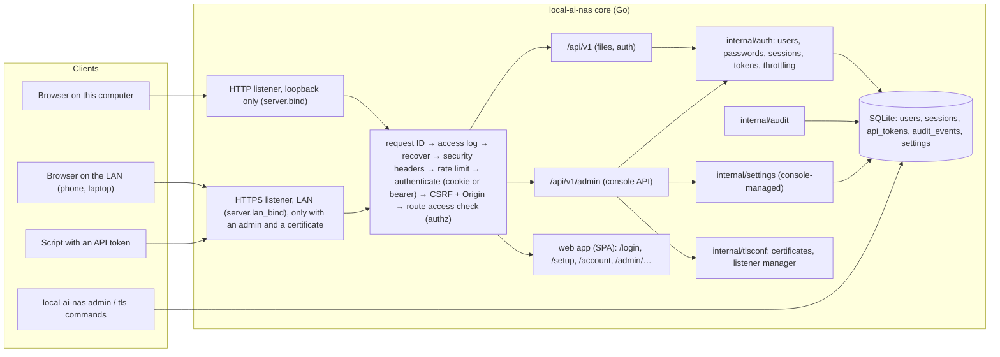

# S03: Security

| Field | Value |
|---|---|
| Stage ID | S03 |
| Status | **Approved** (2026-09-29, session S007 E050); In Progress from S03.1-T01 |
| Blocked reason | |
| Plan version this stage is based on | 1.8.0 (written on 1.7.0; the approval refined S03.2 criterion 1 and S03.4 criterion 2 in 1.8.0) |
| Origin | User-defined ("Stage 3 is security implementation."); the admin console foundation (S03.9) is the user's requirement of S007 |
| Created | 2026-09-29 (session S007) |
| Last updated | 2026-09-29 (session S007) |
| Depends on stages | S01 (Done), S02 (Done) |
| Related ADRs | ADR-0042 local-origin protection, ADR-0040 item identity, ADR-0041 operation journal (Proposed, P008; S01 follow-ups built here) · ADR-0007 and ADR-0011 amendments · ADR-0010 security building blocks (Accepted) · ADR-0007 SQLite (Accepted) · ADR-0003 namespaces (Accepted) · ADR-0002 REST/OpenAPI (Accepted) · ADR-0009 SvelteKit (Accepted) · ADR-0005 testing and CI (Accepted) · **ADR-0039 admin console (Accepted with this document, Q74)** · ADR-0029 storage helper (Proposed; threat model input only) |

## 1. Goal

The NAS can be reached safely from the local network. Only the admin can use it, over HTTPS, with sessions that are hard to steal and easy to revoke. Every route is checked by one authorization core that denies by default. Security events are recorded. Everything is usable from the GUI, and administration has its own place: the **admin console**, whose foundation this stage builds.

**Exit criteria (from plan):** "No endpoint is reachable without authentication, and every threat model item is either mitigated or documented as an accepted risk."

**Single admin.** This stage has one account, the admin, created at first run. The data model already has roles and namespaces, so S07 (multi-user) adds users without changing the tables or the routes.

**Raspberry Pi first (NFR-051).** The user will run the NAS on a Raspberry Pi. This is the first stage that sets and checks Pi budgets (section 4.9), and from here on every stage-end CI run also tests on ARM64 and in a Pi-sized resource profile.

## 2. Linked requirements

| Requirement ID | Title | Covered fully / partially | Substage(s) |
|---|---|---|---|
| FR-064 | Authentication for the GUI and API; the admin is created at first run; never default passwords | Fully | S03.2, S03.8 |
| FR-084 | Threat model, maintained through the project | Fully for S03 (revisited in S07, S09, S14.6, S15, S17) | S03.1, S03.10 |
| FR-085 | Login, logout, password change, rate limiting with lockout | Fully | S03.2 |
| FR-086 | Sessions: secure cookies, expiry, revocation, "log out everywhere", a list of active sessions | Fully | S03.3, S03.8 |
| FR-087 | API tokens: scoped, revocable, stored hashed | Fully | S03.3, S03.8 |
| FR-088 | HTTPS with user-provided or generated self-signed certificates; LAN certificate guidance | Fully | S03.4 |
| FR-089 | Central authorization check on every route, default deny, extensible for S07 | Fully | S03.5 |
| FR-090 | Security audit log with retention | Partially: logins, sessions, tokens, settings, and admin actions. Cross-area transfers come in S04.6, sharing in S07 | S03.6 |
| FR-091 | TOTP two-factor authentication | Fully (Q33 answered yes, D-2) | S03.7 |
| FR-068 | Command-line admin tools | Partially: create the admin and reset its password (the sidecar and index tools come in S05.7 and S06.2) | S03.2 |
| FR-219 | Per-device upload-only app passwords (P006, pending Q54) | Foundation only: the token model has scopes, so S09 adds an upload-only scope | S03.3 |
| FR-221 | Alert delivery (P006, pending Q54) | Threat model only; delivery is built in S10 | S03.1 |
| FR-342 | Admin console | Partially: the shell and its first sections (Overview, Security, System settings, About and diagnostics, the admin's account). Later stages fill the other sections (plan 6.6) | S03.9 |
| FR-344 | Console safety and consistency | Fully | S03.9 |
| NFR-010 | Security baseline (Argon2id, secure sessions, HTTPS, validation) | Fully for S03 | S03.2–S03.5 |
| NFR-015 | Usable and accessible GUI | Fully for the new screens | S03.8, S03.9 |
| NFR-016 | Observability | Partially: security events are in the structured log too | S03.6 |
| NFR-020 | Network binding: localhost by default; LAN only after S03 and only when the user configures it | Fully | S03.4 |
| NFR-022 | Hardening: CSRF, CORS policy, headers and CSP, upload validation, safe previews, rate limiting, no leaking errors | Fully | S03.5 |
| NFR-023 | Security scanning and static analysis in CI | Fully, run as the user decided: in every CI run (stage end or by hand, S007 E013) and locally before every merge | S03.10 |
| NFR-050 | Admin console enforcement (route inventory, hidden pages, audit) | Fully for the S03 routes (S10.7 checks again at the end of the console work) | S03.9, S03.10 |
| NFR-051 | Raspberry Pi first | The S03 budgets, the ARM64 CI job, and the Pi profile | S03.10 (budgets apply to every substage) |
| NFR-009 | Platforms | ARM64 joins CI | S03.10 |
| FR-350, NFR-057 | Protection against other websites before login (P008 F2) | Fully | S03.5-T02 (first part, built first) |
| FR-346–FR-349, FR-351–FR-354, NFR-053, NFR-056 | P008 follow-ups of S01 and S02 (item IDs, jobs and journal, idempotency keys, trash, durability) | Fully (tasks in the S01 and S02 stage documents, built in this stage) | S01.1-T12, S01.3-T11–T13, S01.4-T08–T10, S02.5-T05; tests in S03.10 |
| FR-355 | Database snapshots (P008) | Fully | S03.2-T06 |

## 3. Scope

### In scope
- **Threat model** in `code-agent-docs/security/threat-model.md` (new documentation folder, decision D-4), and a security review of the S01 and S02 code against it.
- **Accounts:** the users table with roles and namespaces; the first admin bound to the S01 namespace `u0001` with no file moves (ADR-0003); Argon2id passwords (ADR-0010); first-run setup; the command-line tools `admin create` and `admin reset-password`.
- **Sign-in:** login, logout, password change, re-authentication, throttling and lockout that can never lock the admin out for good.
- **Sessions and tokens:** server-side sessions in SQLite with opaque cookies (ADR-0010); session list, revoke one, sign out everywhere; scoped API tokens for scripts.
- **HTTPS and the LAN:** plain HTTP stays on this computer; LAN access is a separate HTTPS listener that starts only when an admin exists and a certificate is in place; generated self-signed certificates or the user's own; a certificate guide for five client platforms.
- **Hardening:** the authorization core with an access level on every route (default deny); CSRF tokens with an Origin check; no CORS; security headers on every response; rate limiting; a review of uploads, previews, and error messages.
- **Audit trail:** an append-only audit store, typed events, retention, and an admin API to read it.
- **Two-factor authentication** (TOTP with recovery codes; the user said yes to Q33, D-2).
- **Security GUI:** sign-in and first-run pages, the account page (password, sessions, tokens, two-factor), the re-authentication dialog, and handling of expired sessions everywhere.
- **Admin console foundation (S03.9, ADR-0039):** the `/admin` area, the `/api/v1/admin` API, console-managed settings, the shared admin components, and the first sections.
- **Tests in S03.10** (R6): unit, integration, system (Playwright), and a security suite; ARM64 CI and the Pi profile; the scans set to fail on high severity; user guides; the documentation audit A004; the completion record.

### Out of scope
- More users, groups, sharing, per-user namespaces beyond the admin (S07). The model supports them; no GUI or API to create them yet.
- Public internet exposure, reverse proxies, VPN, and restricting the console to given networks (R09 in the release roadmap; the `/admin` prefix makes it possible later).
- A local certificate authority or ACME certificates (a later option; the guide mentions using your own certificate).
- Upload-only app passwords (FR-219, S09, pending Q54) and alert delivery (FR-221, S10). S03 only prepares the token scopes and lists the threats.
- Console sections of later stages: storage and drives, users, sharing, network shares, backups, jobs, logs viewer and alerts, updates (plan 6.6). They appear in the console when their stages build them, never as dead links.
- The deployers (S14.2). S03 adds the commands they will call (`admin create --password-stdin`, `tls generate`).
- Real Raspberry Pi measurements (the user has no Pi yet; the Pi profile in CI stands in until then).

## 4. Design approach

### 4.1 Components



### 4.2 Accounts and sign-in (S03.2)

- **Users table** (migration `00003_accounts.sql`, goose, STRICT tables as in S01):
  - `users`: `id`, `username` (unique, case-insensitive), `namespace` (unique, `u0001` for the first admin), `role` (`admin` or `user`), `password_hash` (PHC string), `password_changed_at`, `created_at`, `updated_at`, `disabled_at`; two-factor columns (S03.7).
  - The first admin gets namespace `u0001`, which S01 already created on disk, so no file moves (ADR-0003, plan S03.2 note).
- **Passwords (ADR-0010):**
  - Argon2id with t=3, m=64 MiB, p=4, a 16-byte salt, and a 32-byte tag, in PHC format; rehash on login when the parameters change.
  - At most two hash operations at a time (a memory guard: 128 MiB at most, which matters on a Pi). Further logins wait in a short queue and then get `503 unavailable`.
  - A benchmark (`BenchmarkPasswordHash`) runs on the development PC and on the ARM64 runner. If a login takes more than 1 s on the Pi profile, the parameters may be lowered, but never below the OWASP minimum (m=19 MiB, t=2, p=1), with the reason recorded in ADR-0010's implementation details.
  - **Password rule:** at least **12 characters** and at most 1024 bytes, not equal to the username; no other composition rules. The GUI suggests a passphrase (decision D-6).
- **First-run setup:**
  - While no user exists, `POST /api/v1/auth/setup` creates the admin and signs in. It answers only on the loopback listener; the LAN listener does not run without an admin anyway (4.4).
  - The check and the insert are one transaction, so two parallel setup requests cannot create two admins.
  - **Headless machines such as the Pi (decision D-3, recommended):** the admin is created on the machine itself with `local-ai-nas admin create` (the S14 deployer calls it and asks for the name and password in its guided flow). After that the admin signs in from any browser on the LAN. The web setup page stays for desktop installs, where the browser runs on the same computer.
- **Login and logout:** `POST /api/v1/auth/login` (`{username, password}`) → session cookie; `POST /api/v1/auth/logout`. A wrong username and a wrong password give the same answer and take the same time (a dummy hash for unknown names).
- **Password change:** `POST /api/v1/auth/password` with the current password; it ends every other session of the user (plan S03.2, criterion 4).
- **Throttling and lockout (FR-085), designed so the single admin can never be locked out for good:**
  - **Per source address:** after 5 failed logins within 15 minutes, that address is locked for 15 minutes, doubling on every repeat up to 24 hours.
  - **Per account:** after 20 failures within 15 minutes from all addresses, logins to that account from **LAN addresses** are locked for 15 minutes. Logins on the loopback listener are never locked by the account rule, and `admin reset-password` always works.
  - The state is in memory with a size cap (at most 10,000 tracked addresses), so a restart clears it. Only someone at the machine can restart the service, and that someone could reset the password anyway.
  - The answer is `429 locked_out` with `Retry-After`; every lockout is an audit event.
- **Command-line tools (FR-068):**
  - `local-ai-nas admin create [--username NAME] [--password-stdin]` asks on the terminal without echo (`golang.org/x/term`), or reads the password from standard input for the deployers.
  - `local-ai-nas admin reset-password [--username NAME] [--password-stdin]` sets a new password and ends all of that user's sessions.
  - Both write audit events with the actor `cli`. Both work while the server runs (SQLite WAL, busy timeout).

### 4.3 Sessions, re-authentication, and API tokens (S03.3)

- **Sessions (ADR-0010):**
  - The cookie holds a 256-bit random ID (base64url); the database stores only its SHA-256.
  - Over HTTPS the cookie is `__Host-lan_session` (`Secure; HttpOnly; SameSite=Lax; Path=/`). On the loopback HTTP listener it is `lan_session` without `Secure`, because plain HTTP never leaves the computer (4.4). A session works only on the scheme it was created on.
  - Idle expiry 7 days and absolute lifetime 30 days (`security.session_idle`, `security.session_lifetime`).
  - Stored with it: the user, the CSRF token, created and last-seen times, the source address and a shortened user agent (for the session list), and `reauth_at`.
  - **Few disk writes (Pi):** `last_seen_at` is written at most once a minute per session; expired sessions are deleted by an hourly job on the S01 scheduler.
- **Session API:** `GET /api/v1/auth/status` (public: whether setup is needed, whether signed in, the user, the CSRF token); `GET /api/v1/auth/sessions` (own sessions, the current one marked); `DELETE /api/v1/auth/sessions/{id}`; `POST /api/v1/auth/sessions/end-all` ("sign out everywhere", including the current session).
- **Re-authentication for sensitive actions (FR-344):**
  - `POST /api/v1/auth/reauth` checks the password (and the second factor if enabled) and sets `reauth_at`. It counts as recent for 10 minutes.
  - Routes marked "admin, recent" answer `403 reauth_required` without it. The GUI then shows the password dialog and repeats the request.
- **API tokens (FR-087):**
  - Format `lan_<id>_<secret>` (a 128-bit public ID and a 256-bit secret); stored as the SHA-256 of the secret; shown once at creation.
  - Sent as `Authorization: Bearer …`; no cookies, so no CSRF check.
  - Scopes: `files:read`, `files:write`. Optional expiry. `last_used_at` is written at most once a minute.
  - **Tokens never reach the admin API:** administration needs a person with a session and recent re-authentication.
  - FR-219 (S09, pending Q54) adds an upload-only scope for per-device app passwords.
  - API: `GET/POST /api/v1/auth/tokens`, `DELETE /api/v1/auth/tokens/{id}`.

### 4.4 HTTPS and LAN access (S03.4)

- **Two listeners; plain HTTP never leaves the computer:**
  - `server.bind` (unchanged, default `127.0.0.1:8080`): plain HTTP, **loopback only**, as in S01. It can be turned off (`server.bind = ""`) once LAN access works. The container exception `server.allow_container_bind` stays as it is.
  - **New `server.lan_bind`** (off by default; for example `0.0.0.0:8443`): **HTTPS only**. It starts only when an admin exists and a certificate is in place. Otherwise the server logs a clear warning and stays on loopback (the gate of NFR-020 and plan S03.4 criterion 2).
- **Certificates (ADR-0010):**
  - Either the user's own (`server.tls_cert_file`, `server.tls_key_file`, or uploaded in the console) or a **generated self-signed certificate**: ECDSA P-256; SANs for the host name, `<hostname>.local`, configured names, and the machine's LAN addresses; valid 397 days; the key readable only by the service (0600) in `<internal>/tls/`.
  - `local-ai-nas tls generate [--host NAME]…` creates one from the command line (for the deployers).
  - TLS 1.2 minimum, 1.3 preferred, Go's default cipher suites.
  - The certificate is loaded through `GetCertificate`, so a new one takes effect without a restart.
  - A health check warns 30 days before expiry. The console shows the SHA-256 fingerprint, so a user can check it against the browser's warning page.
  - `Strict-Transport-Security: max-age=31536000` on HTTPS responses (browsers ignore it for bare IP addresses; harmless).
- **Guide (FR-088):** `docs/guide/https-and-lan.md`: turning on LAN access, checking the fingerprint, trusting the certificate on Windows, macOS, Linux, Android, and iOS, and using your own certificate.

### 4.5 Authorization, CSRF, headers, rate limits (S03.5)

- **Authorization core (FR-089):**
  - `internal/authz`: `Authorize(subject, action, resource) Decision`. S03 has the rules for anonymous, user, admin, and token scopes; S07 adds ownership and sharing rules without touching the routes (plan design note).
  - Every entry of the route table (`internal/api/api.go`) gets an **access level**: `Public`, `User(action)`, `Admin(action)`, or `AdminRecent(action)`. A route without one does not start (a panic at build time of the table) and fails the inventory test.
  - The file handlers take the namespace from the subject, replacing the fixed S01 owner (`server.owner`).
  - **Public routes:** the web app's static files, the API documentation, `GET /api/v1/system/health` (anonymous callers get only the overall status; the checks and version are for signed-in admins), `GET /api/v1/auth/status`, `POST /api/v1/auth/login`, `POST /api/v1/auth/setup` (loopback, no users), and the two-factor login step (S03.7).
- **CSRF (ADR-0010):**
  - With cookie authentication, every request that is not GET, HEAD, or OPTIONS must carry `X-CSRF-Token` equal to the session's token, and its `Origin` (or else `Referer`) must be the NAS's own origin. Otherwise `403 csrf_failed`.
  - **No exemption for tus uploads:** Uppy sends the header too (simpler and stronger than the exemption ADR-0010 allowed).
  - Login and setup, which have no session yet, are protected by the Origin check and SameSite.
  - The GUI adds the header in one place: openapi-fetch middleware in `web/src/lib/api/client.ts`, plus Uppy's `headers` option.
- **Host allow-list (DNS rebinding, threat T-19):** each listener accepts only its own host names and addresses in the `Host` header (loopback: `127.0.0.1`, `localhost`, `[::1]`; LAN: the configured names, the host name, `<hostname>.local`, its addresses); anything else gets `421 Misdirected Request`. Without it, a web page could point its own domain name at the NAS and pass the Origin check.
- **CORS:** none. The NAS never sends `Access-Control-Allow-Origin`, so other sites cannot read its answers (tested).
- **Security headers on every response:**
  - `X-Content-Type-Options: nosniff`; `Referrer-Policy: no-referrer`; `X-Frame-Options: DENY`.
  - `Cross-Origin-Opener-Policy: same-origin`; `Cross-Origin-Resource-Policy: same-origin`; `Permissions-Policy` turning off camera, microphone, and geolocation.
  - API responses also get `Content-Security-Policy: default-src 'none'; frame-ancestors 'none'`. The app keeps its S02 hash-based CSP; downloads keep their sandbox CSP.
  - HSTS under HTTPS (4.4).
- **Rate limiting (NFR-022):**
  - A token bucket per source address for all API requests (default 50 requests/s, burst 400: enough for the virtual list and uploads), with stricter buckets for login, setup, and re-authentication.
  - Memory is bounded: at most 10,000 tracked addresses, least recently used removed first.
  - Answers `429 rate_limited` with `Retry-After`. The limits are console-managed settings.
  - A small built-in limiter with an injected clock, so no new dependency.
- **Review (plan S03.5 criteria 4 and 5):** uploads are never executed or shown as active content in the app's origin; previews follow the S02 rules; problem answers never contain stack traces, file system paths, or internal IDs. Anything found becomes a bug (section 12), fixed at once.
- **Existing tests keep passing:** the task that turns on default deny (S03.5-T01) also updates the existing test harnesses. The Go API tests get a helper that signs in a test subject, and the Playwright suite gets a global setup that creates the admin and saves the signed-in state. The S01 and S02 guard tests stay green on every push.

### 4.6 Audit trail (S03.6)

- **Table `audit_events`:** `id`, `at`, `type` (dotted, extensible: `auth.login.succeeded`, `auth.login.failed`, `auth.lockout`, `auth.logout`, `auth.password.changed`, `auth.session.ended`, `auth.token.created`, `auth.token.revoked`, `auth.reauth`, `setup.completed`, `admin.setting.changed`, `tls.certificate.changed`, `cli.admin.created`, `cli.password.reset`, and more later), `outcome`, `actor_user_id`, `actor` (username, `cli`, or `anonymous`), `source_addr`, `user_agent` (shortened), `target`, `details` (JSON, never secrets or passwords).
- **Append-only:** a `BEFORE UPDATE` trigger aborts any change; there is no API to change or delete events; only the retention job deletes, those older than `audit.retention` (default 365 days), once a day.
- Every event also goes to the structured log (NFR-016), with the request ID.
- **Admin API:** `GET /api/v1/admin/audit` with filters (type prefix, time range, actor) and cursor paging.
- Every state-changing admin route writes an event through one wrapper, so no admin action can skip the audit (FR-344, NFR-050).

### 4.7 Two-factor authentication (S03.7; Q33: yes)

- TOTP (RFC 6238) with **`github.com/pquerna/otp` v1.5.0** (ADR-0010). Its QR image uses `github.com/boombuler/barcode` v1.1.0 (MIT), so the GUI needs no QR package.
- The library is quiet (last release 2024-12-31). If it looks unmaintained when S03.7 starts, the fallback in ADR-0010 applies: RFC 6238 with `crypto/hmac`, tested against the RFC's test vectors, recorded in a new ADR.
- **Enrolment:** a secret and QR code, confirmed with a first code. Then **10 one-time recovery codes**, stored hashed and shown once.
- **Login:** after the password, a short-lived pending state (5 minutes, 5 tries) waits for the code or a recovery code.
- **Disabling** needs the password and a current code.
- The secret is encrypted in the database (AES-GCM, key in `<internal>/secret.key`, 0600), so a database copy alone (for example a backup, S08) does not reveal it.
- A console setting "require two-factor for admins" (Security section).

### 4.8 Admin console foundation (S03.9, ADR-0039 option A, Accepted)

- **Where:** `/admin/…` in the same SvelteKit app, backed by `/api/v1/admin/…`. The main navigation shows an **Admin** entry only to admins. SvelteKit splits the code by route, so the console's code loads only when the console is opened (Pi and phone budgets).
- **Rules (FR-344):**
  - Every admin route checks the admin role on the server (default deny; inventory test).
  - Sensitive actions need recent re-authentication.
  - Every admin action is audited.
  - Destructive actions show a preview and ask for a typed confirmation (I10).
  - One layout and wording; usable on a phone; accessible.
- **Shared admin components** in `web/src/lib/admin/`, documented in its `README.md` for later stages:
  - `AdminPage` (title, description, actions); `SectionNav` (built from a registry, so a section appears only when a stage registers it: no dead links);
  - `DataTable` (sorting, paging, empty state, phone layout as a list); `DetailPanel`;
  - `SettingsForm` (typed fields, validation messages from the server, save and revert, and a badge showing where a value comes from);
  - `ConfirmDialog` with a typed phrase; `Wizard` (steps, progress, cancel); `StatusBadge`; `ReauthDialog` (shared with the account page).
- **Console-managed settings (`internal/settings`):**
  - Stored in the S01 `settings` table.
  - Precedence becomes **defaults < config file < console < environment < flags**. A setting fixed by the environment or a flag is shown read-only, with its source.
  - Validation is shared with `internal/config`, so the console and the config file accept the same values.
  - Each change is audited.
  - Changes apply at once where the component supports it (listeners, certificate, rate limits). Otherwise the console shows "applies after a restart".
  - API: `GET /api/v1/admin/settings`, `PATCH /api/v1/admin/settings` (recent re-authentication).
- **Network change safety:** when the LAN listener's address or certificate is changed from a LAN session, the old listener stays until the admin confirms from the new address (`POST /api/v1/admin/network/confirm`). Without confirmation the change is **reverted after 2 minutes**, like a display-resolution change, so the admin cannot cut themselves off.
- **The first sections (plan 6.6):**
  - **Overview:** health report, storage used and free, version and uptime, LAN access and certificate state, recent security events, and a "needs attention" list (each item links to where it is fixed); S10.1 completes it.
  - **Security:** sessions of all users with revoke; the audit log viewer with filters; the two-factor policy (S03.7).
  - **System settings:** Network (the loopback address, LAN access on or off and its address, the certificate: generate, upload, fingerprint, expiry) and Performance (the limits that exist now: synchronous copy limits, upload sizes, rate limits, parallel password hashing; later stages add their concurrency limits here, NFR-051).
  - **Users:** only the admin's own account (a link to the account page) until S07.
  - **About and diagnostics:** version, commit, Go version, OS and architecture, the AGPL license, the third-party components (Go modules from the build information; web packages from a licenses file made at build time), and the full health report.
- API for the sections: `GET /api/v1/admin/overview`, `GET /api/v1/admin/sessions`, `DELETE /api/v1/admin/sessions/{id}`, `GET /api/v1/admin/tls`, `POST /api/v1/admin/tls/self-signed`, `PUT /api/v1/admin/tls/certificate` (PEM certificate and key; recent re-authentication), `GET /api/v1/admin/about`.

### 4.9 Raspberry Pi budgets for S03 (NFR-051; provisional until Q75)

Until the user answers Q75, the budgets assume a **Raspberry Pi 5 with 4 GB** (A24) and are set so that a 2 GB model also works.

| Budget | Limit | How it is checked |
|---|---|---|
| Core memory, idle (RSS) | ≤ 100 MiB | Pi profile job (S03.10-T03) |
| Core memory under the S01 transfer load (RSS) | ≤ 400 MiB; heap growth stays < 256 MiB (the S01 memory test) | `memory` job and Pi profile |
| Password hashing | At most 2 × 64 MiB at a time | unit test of the guard |
| Login time on the Pi profile | ≤ 1 s at the 95th percentile | Pi profile job |
| Rate limiter and lockout state | ≤ 10,000 addresses (about 1 MiB) | unit test |
| Disk writes while idle | None; session and token "last used" at most once a minute | integration test with a counting store |
| Web: sign-in page | Adds at most 30 KiB (gzip) to the initial JavaScript; the console loads separately | build-size check in the `web` job |

The **Pi profile** runs the linux/arm64 release binary in a container on GitHub's `ubuntu-24.04-arm` runner, limited to 4 CPUs and 1 GiB of memory. There it checks health, logs in 50 times, runs a short upload and listing load, and reads the process's RSS. It stands in for a real Pi until the user has one, when the S01 follow-up (`scripts/perf-baseline.sh`) runs on the device.

### 4.10 Server additions (spec-first, `api/openapi.yaml`)

| Method + path | Access | Purpose | Task |
|---|---|---|---|
| `GET /api/v1/auth/status` | Public | Setup needed? Signed in? User, CSRF token, re-authentication time | S03.2-T03 |
| `POST /api/v1/auth/setup` | Public (loopback, no users) | Create the first admin and sign in | S03.2-T03 |
| `POST /api/v1/auth/login` | Public (rate limited) | Sign in | S03.2-T03 |
| `POST /api/v1/auth/logout` | User | End this session | S03.2-T03 |
| `POST /api/v1/auth/password` | User | Change password; end other sessions | S03.2-T03 |
| `POST /api/v1/auth/reauth` | User (session) | Recent re-authentication | S03.3-T03 |
| `GET /api/v1/auth/sessions`, `DELETE /api/v1/auth/sessions/{id}`, `POST /api/v1/auth/sessions/end-all` | User (session) | Own sessions | S03.3-T02 |
| `GET/POST /api/v1/auth/tokens`, `DELETE /api/v1/auth/tokens/{id}` | User (session) | API tokens | S03.3-T04 |
| `POST /api/v1/auth/totp/…`, `POST /api/v1/auth/login/totp` | User / Public (pending state) | Two-factor | S03.7 |
| `GET /api/v1/admin/audit` | Admin | Audit log | S03.6-T02 |
| `GET /api/v1/admin/overview`, `GET /api/v1/admin/about` | Admin | Console sections | S03.9-T04 |
| `GET /api/v1/admin/sessions`, `DELETE /api/v1/admin/sessions/{id}` | Admin | Sessions of all users | S03.9-T04 |
| `GET /api/v1/admin/settings`, `PATCH /api/v1/admin/settings` | Admin / Admin, recent | Console-managed settings | S03.9-T03 |
| `POST /api/v1/admin/network/confirm` | Admin | Keep a network change | S03.9-T05 |
| `GET /api/v1/admin/tls`, `POST /api/v1/admin/tls/self-signed`, `PUT /api/v1/admin/tls/certificate` | Admin / Admin, recent | Certificate | S03.9-T04 |
| every existing `/api/v1/files/…` route | User (`files:read` or `files:write` for tokens) | Unchanged behavior, now signed in | S03.5-T01 |
| `GET /api/v1/system/health` | Public (status only) / Admin (full) | Health | S03.5-T01 |

**New problem codes** (only added, `docs/api/errors.md`): `unauthenticated` (401), `forbidden` (403), `csrf_failed` (403), `reauth_required` (403), `setup_not_allowed` (403), `weak_password` (400, with a `rule`), `locked_out` (429), `rate_limited` (429), and `second_factor_required` (401, S03.7). Each route gets a review row in `docs/api/conventions.md`, as in S01 and S02.

### 4.11 Web additions

```
web/src/
├── lib/auth/            session store (status, user, CSRF token), sign-in guard, 401 handling, re-auth helper
├── lib/admin/           console components, section registry, README.md (patterns for later stages)
├── lib/api/client.ts    + middleware: X-CSRF-Token on unsafe requests; 401 → sign-in page with ?next=
├── lib/uploads/         + the CSRF header in Uppy's tus requests
└── routes/
    ├── login/           sign-in and the two-factor step (S03.7)
    ├── setup/           first run (this computer only; elsewhere it shows the command-line way)
    ├── account/         password, sessions, API tokens, two-factor
    └── admin/           +layout (console shell), overview, security/, security/audit, settings/network,
                         settings/performance, users, about
```

The main navigation gets a user menu (account, sign out) and the Admin entry for admins. The Settings page keeps theme and About for everyone.

## 5. Substages and tasks

### Substage overview

| Substage | Name | Status | Depends on | Requirements |
|---|---|---|---|---|
| S03.1 | Threat model | **Review** (T01 and T02 done; the user's review of the threat model is asked at the next stop) | S02 | FR-084, FR-221 (threats only) |
| S03.2 | First-run setup and authentication | **In Progress** | S03.1 | FR-064, FR-085, FR-068, NFR-010 |
| S03.3 | Sessions and tokens | Not started | S03.2 | FR-086, FR-087, FR-219 (foundation) |
| S03.4 | Transport security | Not started | S03.2 | FR-088, NFR-020 |
| S03.5 | Application hardening | **In Progress** (T02 first part done) | S03.2, S03.3 | FR-089, NFR-022 |
| S03.6 | Security logging and audit trail | Not started | S03.2 | FR-090, NFR-016 |
| S03.7 | Two-factor authentication (optional per account) | Not started (Q33: yes) | S03.2, S03.3 | FR-091 |
| S03.8 | Security GUI | Not started | S03.2–S03.7, S02 | FR-064, FR-086, NFR-015 |
| S03.9 | Admin console foundation | Not started | S03.2, S03.3, S03.6, S03.8 | FR-342, FR-344, NFR-050, NFR-051 |
| S03.10 | Security testing and stage review | Not started | S03.1–S03.9 | NFR-023, NFR-010, NFR-050, NFR-051 |

**Execution order** (updated 2026-09-30, plan 1.9.0, the user's approval of the P008 follow-ups: "Approve all, F2 first (Recommended)"): S03.1 → S03.2-T01, T02 → **S03.5-T02, first part: Host allow-list and Origin check** (F2, ADR-0042; bug S03-B01) → **S01.1-T12** (F5, durability) → **S01.3-T11** (F1, item registry) → **S01.4-T08** (F3, job foundation) → **S01.3-T12** (F1, IDs in the API and the backfill job) → **S01.4-T09, T10** (F3, operation journal, idempotency keys) → **S01.3-T13, S02.5-T05** (F4, trash) → S03.2-T03 … T06 → S03.3 → **S03.8-T01** (sign-in pages, so the GUI stays usable once routes need a session) → S03.5 (the rest; T02's second part is the CSRF token) → S03.6 → S03.4 → S03.7 → S03.8-T02 → S03.9 → S03.10 (the tests of S03 and of the P008 follow-ups). The job foundation comes before the ID backfill and the trash purge, which run as jobs.

**Rule (R6):** the tasks in S03.1–S03.9 deliver code (or, in S03.1, documents), written to be testable. Such a task is Done when:
- it builds;
- the Go linter and formatter, `pnpm lint`, `pnpm check`, and the existing tests pass (unit, integration, and the system tests when the task touches the GUI or the routes);
- it was checked by running it, as its acceptance criteria say.

Its tests are written in S03.10. Bugs found while building are recorded in section 12 and fixed at once; their regression tests come in S03.10.

### S03.1: Threat model

- **Goal:** Identify what must be protected, from whom, and where, to drive the rest of S03.
- **Substage acceptance criteria (plan):**
  1. The document lists assets, attackers, surfaces, and numbered threats.
  2. Every threat maps to an S03 substage or is marked as an accepted-risk candidate.
  3. The user has reviewed it.

| Task ID | Description | Status | Acceptance criteria |
|---|---|---|---|
| S03.1-T01 | **Threat model** `code-agent-docs/security/threat-model.md` (new folder, added to the documentation map in RULES, D-4): <br>• **assets:** user files, credentials and sessions, TLS keys, the database, the audit log, the configuration; <br>• **attackers:** someone on the LAN, a malicious web page in the admin's browser (CSRF, clickjacking), a malicious file (uploads, previews, archives), a stolen session or token, another local user or process on the host, a stolen backup or disk, a compromised dependency; <br>• **surfaces:** API, GUI, tus, downloads and previews, archives, the CLI, the config file, internal data, the listeners; and the future ones: network shares (S09), camera upload and app passwords (FR-219), alert delivery (FR-221), the privileged storage helper and its drive operations and hot-plug risks (S15, ADR-0029, P007), the AI worker (S17), and the admin console (ADR-0039); <br>• **threats T-01…** with a STRIDE category, each mapped to a substage and task, or marked as an accepted-risk candidate. | **Done** (S007 E051) | Every threat is mapped or marked. The future surfaces are listed with the stage that must handle them. The user is asked to review it at the next stop (work continues meanwhile; changes they ask for are applied). |
| S03.1-T02 | **Review of the S01 and S02 code against the threat model:** path handling, archives, tus, downloads and previews, the app handler, error messages, logs (no secrets), the config and database file permissions. Gaps become tasks in S03.5 or bugs (section 12). | **Done** (S007 E052) | A findings list in the threat model (section "Review of existing code"), each with its follow-up task or bug ID. |

### S03.2: First-run setup and authentication

- **Goal:** Only the admin can use the NAS, with strong credentials and no defaults.
- **Substage acceptance criteria (plan 1.8.0; criterion 1 refined by D-3):**
  1. Until the admin exists, only the first-run endpoint is reachable, and only from localhost. On a machine without a local browser the admin is created with the command line.
  2. Passwords are stored as Argon2id hashes with the parameters from the ADR, and no default credentials exist anywhere.
  3. Repeated failed logins trigger rate limiting and a temporary lockout.
  4. A password change invalidates the user's other sessions.

| Task ID | Description | Status | Acceptance criteria |
|---|---|---|---|
| S03.2-T01 | **Schema and user store:** migration `00003_accounts.sql` (users, sessions, api_tokens, audit_events; Down included); `internal/auth` user store (create, get by name, update password, roles, namespaces; the first admin gets `u0001`). Register `golang.org/x/crypto` (R6). | **Done** (S007 E053) | `local-ai-nas migrate up` and `status` show 00003; Down and Up again work on a copy of the database; the store works against a real database (checked by a small program or the next task). |
| S03.2-T02 | **Passwords:** Argon2id in PHC format (4.2), the concurrency guard, rehash on login, the password rule, `BenchmarkPasswordHash` run on the development PC and recorded. | **Done** (S007 E054) | A hash verifies and a wrong password does not; the PHC string carries the ADR parameters; a third parallel hash waits; the benchmark result is in the session log. |
| S03.2-T03 | **Auth endpoints** (spec first): status, setup, login, logout, password change (4.10); cookie handling from S03.3-T01 (done together); problem codes; review rows in `docs/api/conventions.md`. | Not started | With curl on loopback: setup once (a second setup is `403 setup_not_allowed`), login, status shows the user, logout, password change ends another session; setup from a non-loopback address is refused. |
| S03.2-T04 | **Throttling and lockout** (4.2): per address and per account; loopback never locked by the account rule; `Retry-After`; the same answer and timing for unknown users. | Not started | Scripted failed logins lock the address after 5 and the account for LAN addresses after 20; loopback still works; the lock ends after its time (fake clock in a check program or a short config value). |
| S03.2-T05 | **Command line:** `admin create` and `admin reset-password` (terminal without echo via `golang.org/x/term`, or `--password-stdin`); audit events with the actor `cli`. Register `golang.org/x/term`. | Not started | Both work on Windows and Linux while the server runs and while it is stopped; reset ends the user's sessions; the README's Development section mentions them. |
| S03.2-T06 | **Database snapshots** (FR-355, P008): a consistent copy with `VACUUM INTO` (or the online backup API) on a schedule (daily by default) and before every migration, keeping the last N (default 7) in `.local-ai-nas/snapshots/`; a restore command for a stopped server (`local-ai-nas db restore <snapshot>`); the console (S03.9) shows the last snapshot; the docs say that copies on the same disk protect against corruption and bad updates, not against disk failure. | Not started | A snapshot opens as a valid database with every table; a migration makes a snapshot first; a restore brings back the earlier state. |

### S03.3: Sessions and tokens

- **Goal:** Sessions and tokens that are hard to steal and easy to revoke.
- **Substage acceptance criteria (plan):**
  1. Session cookies are HttpOnly, Secure (under HTTPS), SameSite, with idle and absolute expiry.
  2. Revoking a session or using "log out everywhere" takes effect on the next request.
  3. API tokens can be created, scoped, listed, and revoked, and are stored only as hashes.

| Task ID | Description | Status | Acceptance criteria |
|---|---|---|---|
| S03.3-T01 | **Session store and authentication middleware:** create, look up by the hash of the cookie, idle and absolute expiry, throttled `last_seen_at`, hourly cleanup; the two cookie names by scheme (4.3); the middleware puts the subject in the request context (it identifies; S03.5 enforces). | Not started | Cookie attributes seen in the browser's developer tools on HTTP loopback and (after S03.4) on HTTPS; an expired session is refused; the database holds no raw session ID. |
| S03.3-T02 | **Session API:** own sessions list (current marked), end one, end all. | Not started | Two browsers signed in: ending one from the other takes effect on its next request; "end all" signs out both. |
| S03.3-T03 | **Re-authentication:** `POST /auth/reauth`, `reauth_at`, the 10-minute window, the `AdminRecent` level and `403 reauth_required`. | Not started | A sensitive route without recent re-auth gives `reauth_required`; after re-auth it works; after 10 minutes (short config value in a check) it asks again. |
| S03.3-T04 | **API tokens:** create (shown once), list, revoke; bearer authentication; scopes `files:read` and `files:write`; optional expiry; tokens refused on the admin API; a scope list ready for FR-219. | Not started | curl with a `files:read` token lists a folder and is refused an upload (`403 forbidden`); a revoked or expired token is `401`; the database holds only hashes. |

### S03.4: Transport security

- **Goal:** Encrypted connections on the LAN, and LAN exposure only when it is safe.
- **Substage acceptance criteria (plan 1.8.0; criterion 2 made concrete, 4.4):**
  1. The server serves HTTPS with a user-provided or generated self-signed certificate.
  2. The LAN listener serves HTTPS only and starts only when an admin exists and a certificate is in place, and only when the user configures `server.lan_bind`; plain HTTP stays on loopback.
  3. The guide explains trusting the certificate on Windows, macOS, Linux, Android, and iOS.

| Task ID | Description | Status | Acceptance criteria |
|---|---|---|---|
| S03.4-T01 | **Listener manager and TLS:** `server.lan_bind`, `server.tls_cert_file`, `server.tls_key_file`; the gate (admin + certificate); TLS 1.2+; `GetCertificate` reload; HSTS; the S01 bind guard kept for `server.bind`; start, stop, and change the LAN listener at run time (used by S03.9). | Not started | With a generated certificate the NAS answers on `https://<LAN address>:8443` from another device (or a second network interface in a VM); without an admin or certificate it logs the reason and does not listen; `server.bind` on a LAN address is still refused. |
| S03.4-T02 | **Certificates:** self-signed generation (4.4); `local-ai-nas tls generate`; key 0600 (Linux) and restricted ACL (Windows); the expiry health check. | Not started | The generated certificate has the SANs and validity; a browser shows the expected fingerprint; a certificate with fewer than 30 days left makes health a warning. |
| S03.4-T03 | **Guide** `docs/guide/https-and-lan.md` (FR-088). | Not started | Covers turning on LAN access, the fingerprint, trusting the certificate on five platforms, and using your own; each step was checked on Windows and on Android or iOS where a device is available (what could not be checked is marked). |

### S03.5: Application hardening

- **Goal:** Close common web-application attack classes, with a default-deny authorization core that S07 extends.
- **Substage acceptance criteria (plan):**
  1. A route inventory test fails if any route lacks an authorization decision.
  2. State-changing requests without a valid CSRF token are rejected.
  3. Responses carry a strict CSP and the agreed security headers.
  4. Uploaded content is never executed or rendered as active content in the app's origin.
  5. Error responses never contain stack traces, filesystem paths, or internal identifiers.

| Task ID | Description | Status | Acceptance criteria |
|---|---|---|---|
| S03.5-T01 | **Authorization core and default deny:** `internal/authz`; the access level on every route (4.5); the namespace from the subject; minimal anonymous health; **the existing test harnesses updated** (Go helper that signs in a test subject; Playwright global setup that creates the admin and saves the signed-in state). | Not started | Every S01 and S02 route needs a session or token (curl without one: `401 unauthenticated`); the GUI works after sign-in; all existing Go tests and the 142 system tests pass. |
| S03.5-T02 | **CSRF and Origin check** (4.5), tus included; the openapi-fetch middleware and the Uppy header in the GUI. **Host allow-list** per listener against DNS rebinding (threat T-19): loopback accepts only `127.0.0.1`, `localhost`, `[::1]` with its port; the LAN listener only its configured names, the host name, `<hostname>.local`, and its own addresses; anything else gets `421`. | **In Progress**: the first part (F2: Host allow-list, Origin check, `Referrer-Policy: same-origin`) is **done** (S007 E065); the CSRF-token part follows with sessions | A POST without the token or from another origin is `403 csrf_failed`; a request with `Host: attacker.example` is `421` on both listeners; uploads, folder uploads, archives, and file operations work in the GUI. |
| S03.5-T03 | **Security headers and CORS** (4.5) on every response, API and app. | Not started | The headers appear on an API answer, an app page, a download, and a problem answer; no answer carries `Access-Control-Allow-Origin`; the app still loads with no CSP error in the console (Edge, Firefox). |
| S03.5-T04 | **Rate limiting** (4.5): the per-address limiter, bounded memory, `429 rate_limited`, console-managed limits (read from config until S03.9); a per-address limit on concurrent requests, so a few slow clients cannot hold many connections on a Pi (finding F-06). | Not started | A burst above the limit gets `429` with `Retry-After`; normal GUI use (a 10,000-item folder, a 200-file upload) never hits it. |
| S03.5-T05 | **Review fixes:** the S03.1-T02 findings for uploads, previews, and error messages; archive tickets and tus uploads bound to the user who created them (T-29, T-30); files and folders the service creates readable only by it (T-42, T-43): `.local-ai-nas` 0700, the database files 0600, tusd's modes (bug S03-B02); `isEvalSupported: false` for pdf.js if the option exists (F-08). | Not started | Each finding is fixed (bug entry) or moved to the threat model as an accepted-risk candidate with a reason; another subject cannot use a ticket or upload ID; new database, log, and key files are 0600 on Linux. |

### S03.6: Security logging and audit trail

- **Goal:** A trustworthy record of security-relevant events.
- **Substage acceptance criteria (plan):**
  1. Logins, logouts, failures, and password and token changes produce events with time, actor, source address, and outcome.
  2. Audit events cannot be modified or deleted through the API.
  3. Retention removes events older than the configured period.

| Task ID | Description | Status | Acceptance criteria |
|---|---|---|---|
| S03.6-T01 | **Audit store and events** (4.6): the table and trigger (in 00003), `internal/audit`, the event types, the calls from auth, sessions, tokens, lockout, CLI; mirrored to the structured log. | Not started | Each listed action creates one event with the required fields; an `UPDATE` on the table fails; no secret appears in `details` or the log (checked by grep after a scripted session). |
| S03.6-T02 | **Retention and admin API:** the daily retention job (`audit.retention`, default 365 days); `GET /api/v1/admin/audit` with filters and paging; the admin-action wrapper that audits every state-changing admin route. | Not started | Old events (inserted with past times) are removed by the job; the API filters and pages; there is no route that changes or deletes events. |

### S03.7: Two-factor authentication (optional per account; Q33: yes)

- **Goal:** Optional TOTP two-factor authentication for accounts.
- **Substage acceptance criteria (plan, approved in 1.8.0):**
  1. Users can enrol a TOTP authenticator, after which login requires a code.
  2. Each recovery code works once.
  3. Disabling 2FA requires the password and a current code.

| Task ID | Description | Status | Acceptance criteria |
|---|---|---|---|
| S03.7-T01 | **Enrolment and verification** (4.7): check the library's maintenance first (fallback per ADR-0010); secret encrypted at rest; QR image; confirm with a first code; recovery codes. Register the packages. | Not started | An authenticator app (for example on a phone) enrols by QR and its codes verify; the database holds no plain secret; 10 recovery codes are shown once. |
| S03.7-T02 | **Login step, recovery, disabling, policy:** the pending state (5 minutes, 5 tries), recovery codes used once, disabling with password and code, the "require for admins" setting (applied in S03.9). | Not started | Login asks for the code; a used recovery code is refused the second time; disabling without a code fails. |

Q33 was answered yes (D-2), so S03.7 is built. The rest of FR-262 (two-factor enforced for everyone) stays in R05.

### S03.8: Security GUI

- **Goal:** Every security feature is usable from the GUI.
- **Substage acceptance criteria (plan):**
  1. A fresh install opens the setup wizard, which creates the admin and then shows the login page.
  2. Users can view and revoke sessions and change their password in the GUI.
  3. No GUI page is reachable without login.

| Task ID | Description | Status | Acceptance criteria |
|---|---|---|---|
| S03.8-T01 | **Sign-in flow** (run right after S03.3): `/setup` (this computer only; elsewhere it explains `local-ai-nas admin create`), `/login`, the sign-in guard in the layout (status at start, redirect with `?next=`, which accepts only same-origin paths starting with a single `/`, threat T-23), the user menu with sign out, `401` from any call leads to sign-in with a notice, the auth store. | Not started | A fresh server in Edge opens the setup page, creates the admin, and lands in Files; after sign-out every page leads to sign-in and back to the page afterwards; phone layout and keyboard work; axe clean in both themes. |
| S03.8-T02 | **Account page and re-authentication:** `/account` with password change (strength hint, the passphrase suggestion), sessions (current marked, end one, sign out everywhere), API tokens (create with scopes and expiry, shown once with a copy button, revoke), two-factor (S03.7); the shared `ReauthDialog` used on `403 reauth_required`. | Not started | Each action works in the GUI and matches the API; a lockout and a rate limit show plain messages; axe clean. |

### S03.9: Admin console foundation

- **Goal:** One admin console where every administrative function will live, safe from the first page.
- **User requirement (quoted, S007):** "and this is part of the admin console (gui based) app. if such stage/section does not exist (for an admin console where sysadmin can manage everything related to storage management and system settings and drives management and all the admin stuff) then add it. it is very crucial."
- **Substage acceptance criteria (plan):**
  1. A non-admin never sees the console, and every admin API route refuses non-admins and anonymous callers (route inventory test).
  2. Sensitive actions ask for re-authentication, and every admin action appears in the audit log.
  3. The first sections work on a phone and a desktop, and the shared patterns are documented for later stages.

| Task ID | Description | Status | Acceptance criteria |
|---|---|---|---|
| S03.9-T01 | **Admin API foundation:** the `/api/v1/admin` prefix, the `Admin` and `AdminRecent` levels in use, the audit wrapper for every state-changing admin route; ADR-0039 is Accepted (Q74, S007 E050). | Not started | A user-role subject (created directly in the database for the check) gets `403 forbidden` on every admin route and anonymous callers get `401`; an admin change produces an audit event. |
| S03.9-T02 | **Console shell and shared components** (4.8): `/admin` layout, the section registry and navigation (phone: a section list; desktop: a side list), the Admin entry for admins only, the components in `web/src/lib/admin/` with `README.md`, and a gallery entry for each component on the development page. | Not started | The console opens from the Admin entry; a non-admin sees no Admin entry and `/admin` shows "not available"; the gallery shows every component in both themes; keyboard and screen reader names work. |
| S03.9-T03 | **Console-managed settings** (4.8): `internal/settings` on the `settings` table, the new precedence, shared validation, sources, audit, live apply where supported; the admin settings API. | Not started | A value changed in the console survives a restart; one set by an environment variable is shown read-only with its source; an invalid value gets the same message as in the config file. |
| S03.9-T04 | **The first sections** (4.8): Overview, Security (sessions of all users, audit viewer, two-factor policy), System settings (Network with certificate management, Performance), Users (own account link), About and diagnostics (with the build-time web licenses file). | Not started | Each section works on a 360 px phone and on a desktop in Edge and Firefox; certificate generation and upload need re-authentication and are audited; axe clean in both themes. |
| S03.9-T05 | **Network change safety:** keep-or-revert for LAN listener changes made from a LAN session (2 minutes), with a countdown and a confirm button in the console. | Not started | Changing the LAN port from a LAN browser shows the new address; not confirming reverts after 2 minutes; confirming from the new address keeps it. |

### S03.10: Security testing and stage review

- **Goal:** Evidence that S03 holds, then close the stage.
- **Substage acceptance criteria (plan, with the 1.7.0 additions):**
  1. Tests show that no endpoint is reachable without authentication, except the documented public ones.
  2. CI runs dependency vulnerability scans and static security analysis, and fails on high-severity findings.
  3. Every threat model item is mitigated or recorded as an accepted risk with the user's approval.
  4. The completion record is written and the user's sign-off is recorded.
  5. The admin console's route inventory and re-authentication are tested (NFR-050); the ARM64 job and the Pi profile run in the stage-end CI (NFR-051).

| Task ID | Description | Status | Acceptance criteria |
|---|---|---|---|
| S03.10-T01 | **Unit tests:** passwords and the guard, throttling and lockout (fake clock), sessions and cookies, tokens and scopes, CSRF and Origin, headers, the rate limiter, the audit store, settings precedence, certificate generation, authz decisions, the web auth store, client middleware, and console components; regression tests for the bugs in section 12. Also the P008 follow-ups: item IDs, trash, jobs, the operation journal, idempotency keys, snapshots. | Not started | Every package the stage added or changed is tested; coverage ≥ 80% (`internal/...` and `web/src/lib`). |
| S03.10-T02 | **Integration, system, and security tests:** <br>• **route inventory:** every route has an access level; anonymous callers get `401` except the public list; a user-role subject gets `403` on every admin route; every unsafe cookie route without a CSRF token gets `403`; headers on every answer; no CORS header; <br>• fuzz tests for cookie, bearer token, and Origin parsing; the S01 traversal regressions against signed-in routes; <br>• real database and TLS: migration, retention, the LAN gate, TLS 1.2 minimum; <br>• Playwright (Chromium, Firefox, Edge): first run, sign-in and out, `?next=`, session end from a second context, re-auth dialog, tokens shown once, console hidden for a user-role account, a settings change with its audit event, keep-or-revert; axe on every new screen. <br>• **P008:** the shared crash-injection harness at every crash point of the journaled operations (NFR-053); local-origin tests (foreign Host `421`, foreign and `null` Origin `403`, missing Origin allowed for scripts, the GUI working in three browsers with `Referrer-Policy: same-origin`; NFR-057); the ID backfill and external-file assignment; trash flows; jobs surviving a restart. | Not started | All pass in CI on Linux, Windows, and ARM64. |
| S03.10-T03 | **CI and Pi budgets:** <br>• an **ARM64 job** on `ubuntu-24.04-arm` (Go tests and the Chromium system tests); <br>• the **Pi profile** job (4.9); <br>• the scans confirmed to fail on high severity: govulncheck, gosec (golangci-lint), `pnpm audit --prod --audit-level high`, Trivy HIGH and CRITICAL; <br>• the budgets measured and recorded in `docs/perf/S03-pi-profile.md`. | Not started | The jobs are green; a deliberately vulnerable dependency (on a throwaway branch) fails the scan; every budget in 4.9 is met or is a finding for the user. |
| S03.10-T04 | **Documentation:** `docs/guide/security.md` (first run, sign-in, sessions, tokens, two-factor, password reset); the HTTPS guide checked; `docs/guide/admin-console.md` (started, grows with each stage); `docs/api/errors.md` and `conventions.md` (authentication, CSRF, rate limits); README proposals for the user (status, security, LAN access); register; plan statuses; CURRENT_STATE; **the threat model review record** (each threat: mitigation with its test, or an accepted-risk request for the user). | Not started | Documents match what was built; every threat has a status. |
| S03.10-T05 | **Documentation audit A004** (R12) with `templates/audit-checklist.md`. | Not started | No Critical finding open. |
| S03.10-T06 | **Completion record and sign-off:** section 13; the stage-end CI (tag `S03-done`); the user's walkthrough and sign-off, with the accepted risks approved. | Not started | Section 13 filled in; the sign-off quoted in the session log. |

Rule: one task In Progress at a time. Before starting a task, mark it (and its substage) In Progress here and in CURRENT_STATE.md.

## 6. Files and modules expected to be created or changed

| Path | Create / Change | Purpose | Task ID(s) |
|---|---|---|---|
| `code-agent-docs/security/threat-model.md` | Create | Threat model and its review record | S03.1-T01, T02, S03.10-T04 |
| `internal/db/migrations/00003_accounts.sql` | Create | users, sessions, api_tokens, audit_events (+ two-factor columns and recovery codes in `00004`, S03.7) | S03.2-T01, S03.6-T01, S03.7-T01 |
| `internal/auth/` | Create | users, passwords, sessions, tokens, throttling, re-authentication | S03.2, S03.3 |
| `internal/authz/` | Create | `Authorize(subject, action, resource)` | S03.5-T01 |
| `internal/audit/` | Create | audit store, event types, retention | S03.6 |
| `internal/ratelimit/` | Create | per-address token buckets with bounded memory | S03.5-T04, S03.2-T04 |
| `internal/tlsconf/` | Create | certificates, listener manager | S03.4, S03.9-T05 |
| `internal/settings/` | Create | console-managed settings | S03.9-T03 |
| `internal/totp/` | Create | two-factor | S03.7 |
| `internal/api/api.go`, `server.go`, new `auth*.go`, `admin*.go`, `middleware*.go` | Change / Create | access levels, middleware chain, handlers | S03.2–S03.9 |
| `internal/config/config.go`, `flags.go` | Change | `server.lan_bind`, TLS files, `security.*`, `audit.retention`, `ratelimit.*`; precedence with the console layer | S03.3, S03.4, S03.5, S03.9-T03 |
| `internal/health/checks.go` | Change | certificate expiry check | S03.4-T02 |
| `cmd/local-ai-nas/serve.go`, `main.go`, new `admin.go`, `tls.go` | Change / Create | listeners, commands | S03.2-T05, S03.4 |
| `api/openapi.yaml`, `internal/api/gen/api.gen.go`, `web/src/lib/api/schema.d.ts` | Change | new operations (spec first, generated) | S03.2–S03.9 |
| `docs/api/errors.md`, `docs/api/conventions.md` | Change | new codes, review rows, authentication | S03.2–S03.9, S03.10-T04 |
| `web/src/lib/auth/`, `web/src/lib/admin/` | Create | auth store and guard; console components and registry | S03.8, S03.9 |
| `web/src/lib/api/client.ts`, `web/src/lib/uploads/`, `web/src/lib/shell/` | Change | CSRF header, 401 handling, user menu, Admin entry | S03.5-T02, S03.8-T01, S03.9-T02 |
| `web/src/routes/login/`, `setup/`, `account/`, `admin/` | Create | pages | S03.8, S03.9 |
| `web/tests/e2e/` (global setup, new specs) | Change / Create | signed-in state; S03 system tests | S03.5-T01, S03.10-T02 |
| `.github/workflows/ci.yml` | Change | ARM64 job, Pi profile, scan thresholds, web build-size check | S03.10-T03 |
| `scripts/pi-profile.sh` | Create | the Pi profile run | S03.10-T03 |
| `docs/guide/https-and-lan.md`, `security.md`, `admin-console.md`; `docs/perf/S03-pi-profile.md` | Create | guides and measurements | S03.4-T03, S03.10 |
| `code-agent-docs/RULES.md` (documentation map), `dependencies.md`, `plan.md`, `CURRENT_STATE.md`, ADR-0010 (implementation details, if the benchmark changes parameters), ADR-0039 | Change | records | as they happen |

## 7. Dependencies to add

Checked on 2026-09-29 (Go module proxy for versions, GitHub license API for licenses). Each is recorded in the register (R6) in the task that adds it.

| Dependency | Version | Justification | License | License compatible? |
|---|---|---|---|---|
| `golang.org/x/crypto` (`argon2`) | v0.57.0 | Argon2id password hashing (ADR-0010; the version the ADR named is still the latest) | BSD-3-Clause | Yes |
| `golang.org/x/term` | v0.46.0 | Reading a password on the terminal without echo (`admin create`, `reset-password`) | BSD-3-Clause | Yes |
| `github.com/pquerna/otp` | v1.5.0 | TOTP (ADR-0010; Q33: yes) | Apache-2.0 | Yes |
| `github.com/boombuler/barcode` | v1.1.0 (pulled by otp) | QR code image for enrolment (Q33: yes) | MIT | Yes |
| CI runner `ubuntu-24.04-arm` | — | ARM64 tests and the Pi profile (free for public repositories, verified in S007 E046) | GitHub service | n/a (not shipped) |

No new npm packages are expected. The rate limiter is built in (no `golang.org/x/time`).

## 8. Test plan

| What is tested | Test type | How | Task ID |
|---|---|---|---|
| Argon2id parameters, verify, rehash, concurrency guard | unit | table tests; parallel calls with a fake hasher | S03.10-T01 |
| Throttling and lockout, loopback exemption | unit | fake clock and addresses | S03.10-T01 |
| Sessions: cookie attributes per scheme, expiry, throttled writes, cleanup | unit + integration | `httptest` with and without TLS; counting store | S03.10-T01, T02 |
| Tokens: format, hashing, scopes, expiry, admin refusal | unit + integration | API calls with bearer tokens | S03.10-T01, T02 |
| Route inventory: access level on every route, anonymous `401`, user-role `403` on admin, CSRF on unsafe routes, headers, no CORS | integration (security suite) | iterate the route table and the spec | S03.10-T02 |
| Cookie, bearer, Origin parsing | fuzz | Go fuzzing, seed corpus in `testdata/fuzz` | S03.10-T02 |
| Audit: events per action, trigger blocks updates, retention | unit + integration | real SQLite | S03.10-T01, T02 |
| Settings precedence and validation | unit | config sources with the console layer | S03.10-T01 |
| TLS: generation, SANs, minimum version, the LAN gate, reload, keep-or-revert | integration | real listeners on loopback addresses; fake clock for the revert | S03.10-T02 |
| First run, sign-in, sessions, tokens, re-auth, console visibility, settings, keep-or-revert | system | Playwright in Chromium, Firefox, Edge; axe | S03.10-T02 |
| The S01 and S02 suites, signed in | system + integration | existing tests with the global sign-in setup | S03.5-T01 (harness), S03.10-T02 |
| Memory, login time, idle writes, bundle size on ARM64 | perf | the Pi profile job and the `memory` job | S03.10-T03 |
| Vulnerabilities and static analysis | CI | govulncheck, gosec, `pnpm audit`, Trivy | S03.10-T03 |

Commands that must pass before a task is marked Done (the stage's new tests come in S03.10):
```
golangci-lint run ./... && golangci-lint fmt --diff
go vet ./... && go test ./...
go tool govulncheck ./...
cd web && pnpm lint && pnpm check && pnpm test && pnpm build
cd web && pnpm test:e2e        # when the task touches the GUI or the routes
```

## 9. Stage acceptance criteria

- [ ] No endpoint is reachable without authentication except the documented public ones (the route inventory test).
- [ ] Every threat model item is mitigated (with its test) or recorded as an accepted risk with the user's approval.
- [ ] The admin is created at first run (web on this computer, or the command line), with no default credentials; passwords are Argon2id.
- [ ] Sessions and tokens can be listed and revoked, and revocation works on the next request.
- [ ] LAN access is HTTPS only and starts only with an admin and a certificate; plain HTTP never leaves the computer.
- [ ] CSRF, headers, no CORS, and rate limits are in force on every route; errors leak nothing.
- [ ] Security events are audited, append-only, with retention.
- [ ] Two-factor authentication works: enrolment, the login step, recovery codes, disabling, and the admin policy.
- [ ] The admin console exists with its rules (admin-only on the server, re-authentication, audit, typed confirmation) and its first sections, usable on a phone and a desktop.
- [ ] The Raspberry Pi budgets (4.9) are met in the Pi profile, and the ARM64 job is green.
- [ ] The stage's unit, integration, and system/application tests are written and pass in CI on Linux, Windows, and ARM64; coverage ≥ 80%. Linter and formatter are clean.
- [ ] Documentation audit (R12) done; no Critical finding open.
- [ ] Documentation (plan.md, CURRENT_STATE.md, ADRs, guides, README if the user approves the proposals) is updated.

## 10. Risks and rollback approach

| Risk | Likelihood | Impact | Mitigation | Rollback |
|---|---|---|---|---|
| The single admin is locked out (forgotten password, lockout by a LAN attacker) | Medium | High | Loopback never locked by the account rule; `admin reset-password` on the machine; lockouts end by themselves | Reset on the command line |
| Turning on default deny breaks the GUI or the existing tests | High | Medium | Sign-in pages first (execution order); the harness update in the same task; all suites run before the merge | Revert the S03.5-T01 merge on `develop` |
| A network change cuts the admin off | Medium | High | Keep-or-revert window; loopback listener unchanged | Automatic revert after 2 minutes |
| Argon2id is too slow on a Pi | Low | Medium | Benchmark; lower parameters within the ADR's floor | Parameter change with rehash on login |
| Self-signed certificate warnings confuse users | High | Low | Fingerprint shown in the console; step-by-step guide; own certificate possible | — |
| A strict CSP or new headers break GUI features | Low | Medium | Checked in Edge and Firefox in the task; system tests | Relax the one header with a recorded reason |
| Session and audit writes wear an SD card | Medium | Medium | Throttled writes; nothing written while idle; the database on a real drive (8.33) | — |
| A power cut rolls back security writes (threat T-59) | Low | Medium | Q79: `synchronous=FULL` for the database, decided before S03.3-T01 | — |
| The TOTP library is unmaintained | Medium | Low | Maintenance check at S03.7; RFC 6238 fallback (ADR-0010) | New ADR |
| The console grows beyond its foundation in S03 | Medium | Medium | Only the listed sections; others come with their stages (registry, no dead links) | — |
| Rate limits hit normal use | Low | Medium | Generous defaults; console-managed; system tests with large folders and uploads | Raise the limit in the console |

**Rollback in general:** every task merges into `develop` on its own (`--no-ff`), so a task can be reverted with `git revert` of its merge. Migration `00003` has a Down section. The console settings layer is additive: removing it leaves the config file in charge.

## 11. Approval record

> "approve s03"
> (2026-09-29, session S007, log E050)

**Decisions given with the approval** (asked in E049 with a recommendation each; no change was asked, so each recommendation applies):
- **D-1 (Q74):** the admin console is `/admin` in the same web app (ADR-0039 option A); **ADR-0039 Accepted**.
- **D-2 (Q33):** two-factor authentication is built now (S03.7), optional per account, with the "require for admins" policy.
- **D-3:** on a machine without a local browser, such as a headless Raspberry Pi, the admin is created on the machine with `local-ai-nas admin create` (the S14.2 deployers call it); the web setup page works on this computer only (plan 1.8.0, S03.2 criterion 1).
- **D-4:** the new documentation folder `code-agent-docs/security/` holds the threat model (RULES 1.8.2, documentation map).
- **D-5 (Q75):** not answered yet; the S03 budgets assume a Raspberry Pi 5 with 4 GB (4.9) until the user says which Pi.
- **D-6:** passwords have at least 12 characters.

## 12. Change log for this stage document

| Date | Session | Change | Reason | Approval needed / given |
|---|---|---|---|---|
| 2026-09-29 | S007 | Initial version (plan 1.7.0, with the admin console foundation S03.9, the Pi budgets, and the ARM64 and Pi-profile CI) | R3: the stage document before any S03 code | Needed (section 11) |
| 2026-09-29 | S007 | **Approved** (E050); decisions D-1–D-6 recorded (section 11); the Q33 and Q74 conditions resolved in the text (two-factor is built; ADR-0039 Accepted); plan 1.8.0 | The user's approval | Given |
| 2026-09-30 | S007 | S03.1-T01 (threat model, E051): the Host allow-list against DNS rebinding added to 4.5 and S03.5-T02 (T-19); owner binding of archive tickets and tus uploads and restrictive file permissions added to S03.5-T05 (T-29, T-30, T-42); the `?next=` rule added to S03.8-T01 (T-23) | Threats found by the threat model, inside the approved scope ("close common web-application attack classes") | No (small internal adjustment, recorded, R3) |
| 2026-09-30 | S007 | S03.1-T02 (code review, E052): findings F-01–F-08 in the threat model; bugs S03-B01 and S03-B02 recorded (section 12); S03.5-T04 gains the per-address request limit (F-06); S03.5-T05 gains the file modes and the pdf.js option (F-02, F-08) | Findings of the review, inside the approved scope | No (recorded, R3) |
| 2026-09-30 | S007 | External review #1 (CR001, E057): the Host allow-list and the Origin check of S03.5-T02 moved to the front of the remaining work (bug S03-B01); a risk row for T-59 (Q79) | The review's point 6 and the open bug; the task itself is unchanged | No (order only, recorded, R3) |
| 2026-09-30 | S007 | **P008** (E061): execution order puts the approved follow-ups first (F2 as the first part of S03.5-T02, then F5, F1, F3, F4); new task S03.2-T06 (database snapshots); S03.10 covers the follow-ups; linked requirements and ADRs added; later-stage IDs renumbered (plan 1.9.0) | The user's approval (E059) and plan 1.9.0 | Given (E059) |

### Bugs found during the stage

| ID | Found in | Description | Fix | Regression test |
|---|---|---|---|---|
| S03-B01 | S03.1-T02 (threat T-19, finding F-01) | The API has no authentication and no Host check, so a web page using DNS rebinding can use the files API of a development server running on the same computer | S03.5-T01 (authentication), S03.5-T02 (Host allow-list: **done**, S007 E065; DNS rebinding and cross-site writes are refused now) | S03.10-T02: a foreign `Host` gets `421`; anonymous calls get `401` |
| S03-B02 | S03.1-T02 (finding F-02) | The database file is created 0644 by SQLite and tusd's upload files 0664, so members of the service's group can read the database and change uploads in progress | S03.5-T05 | S03.10-T01/T02: the modes of new files and folders on Linux |

## 13. Completion record

<!-- Filled in when the stage is Done (R3). -->

- **Completed on:**
- **What was built:**
- **Deviations from plan:**
- **Known issues:**
- **Follow-ups:**
- **Final test results:**
