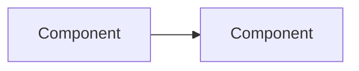

# S<NN>: <Stage name>

<!--
Template for a detailed stage document (RULES.md R3).
Copy to code-agent-docs/stages/S<NN>-<short-kebab-name>.md just before the stage starts.
No application code is written for this stage until the Approval record below is filled in.
-->

| Field | Value |
|---|---|
| Stage ID | S<NN> |
| Status | Planned <!-- Planned / Approved / In Progress / Testing / Review / Done / Blocked --> |
| Blocked reason | <!-- only if Status is Blocked --> |
| Plan version this stage is based on | <e.g. 0.2.0> |
| Created | <YYYY-MM-DD> (session S<NNN>) |
| Last updated | <YYYY-MM-DD> (session S<NNN>) |
| Depends on stages | <S<NN>, ...> |
| Related ADRs | <ADR-NNNN, ...> |

## 1. Goal

<One or two sentences: what working, tested capability exists when this stage is Done.>

## 2. Linked requirements

| Requirement ID | Title | Covered fully / partially |
|---|---|---|
| FR-### | | |
| NFR-### | | |

## 3. Scope

### In scope
- 

### Out of scope
- 

## 4. Design approach

<Components touched, data flow, interfaces, API endpoints, data formats. Add diagrams (Mermaid or ASCII) or interface sketches where useful.>



## 5. Task breakdown

| Task ID | Description | Status | Acceptance criteria |
|---|---|---|---|
| S<NN>-T01 | | Not started <!-- Not started / In Progress / Done / Blocked --> | |
| S<NN>-T02 | | Not started | |

Rule: one task In Progress at a time. Before starting a task, mark it In Progress here and in CURRENT_STATE.md.

## 6. Files and modules expected to be created or changed

| Path | Create / Change | Purpose |
|---|---|---|
| | | |

## 7. Dependencies to add

| Dependency | Version | Justification | License | License compatible? |
|---|---|---|---|---|
| | | | | |

## 8. Test plan

| What is tested | Test type (unit / integration / e2e / perf) | How | Task ID |
|---|---|---|---|
| | | | |

Commands (lint, format, test) that must pass before a task is marked Done:
```
<commands>
```

## 9. Stage acceptance criteria

- [ ] 
- [ ] All tests pass. Linter and formatter are clean.
- [ ] Documentation (plan.md, CURRENT_STATE.md, ADRs, README if user-facing) is updated.

## 10. Risks and rollback approach

| Risk | Likelihood | Impact | Mitigation | Rollback |
|---|---|---|---|---|
| | | | | |

## 11. Approval record

<!-- Quote the user's approval verbatim, with date and session. Status moves to Approved only after this is filled in. -->

> "<user's approval, verbatim>"
> (YYYY-MM-DD, session S<NNN>)

## 12. Change log for this stage document

| Date | Session | Change | Reason | Approval needed / given |
|---|---|---|---|---|
| | | Initial version | | |

## 13. Completion record

<!-- Filled in when the stage is Done (R3). -->

- **Completed on:** <YYYY-MM-DD> (session S<NNN>)
- **What was built:**
- **Deviations from plan:**
- **Known issues:**
- **Follow-ups:**
- **Final test results:** <summary, with pointer to the session log entry>
