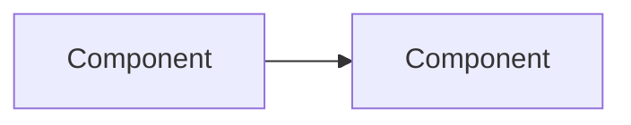

# S<NN>: <Stage name>

<!--
Template for a detailed stage document (RULES.md R3).
Copy to code-agent-docs/stages/S<NN>-<short-kebab-name>.md just before the stage starts.
No application code is written for this stage until the Approval record below is filled in.
-->

| Field | Value |
|---|---|
| Stage ID | S<NN> |
| Status | Planned <!-- Planned / Approved / In Progress / Testing / Review / Done / Blocked --> |
| Blocked reason | <!-- only if Status is Blocked --> |
| Plan version this stage is based on | <e.g. 1.0.0> |
| Origin | <User-defined / Planner-proposed> |
| Created | <YYYY-MM-DD> (session S<NNN>) |
| Last updated | <YYYY-MM-DD> (session S<NNN>) |
| Depends on stages | <S<NN>, ...> |
| Related ADRs | <ADR-NNNN, ...> |

## 1. Goal

<One or two sentences: what working, tested capability exists when this stage is Done.>

## 2. Linked requirements

| Requirement ID | Title | Covered fully / partially | Substage(s) |
|---|---|---|---|
| FR-### | | | <S<NN>.n> |
| NFR-### | | | <S<NN>.n> |

## 3. Scope

### In scope
- 

### Out of scope
- 

## 4. Design approach

<Components touched, data flow, interfaces, API endpoints, data formats. Add diagrams (Mermaid or ASCII) or interface sketches where useful.>



## 5. Substages and tasks

<!--
Hierarchy: Stage → Substage → Task (RULES.md R3).
Substage IDs and their goals, scope, and acceptance criteria come from plan.md section 10. Copy them here, then break each substage into tasks.
Task IDs: S<NN>.<n>-T<NN>, e.g. S01.3-T02 = task 2 of substage S01.3.
Status values: Not started / In Progress / Testing / Review / Done / Blocked (with reason).
-->

### Substage overview

| Substage | Name | Status | Depends on | Requirements |
|---|---|---|---|---|
| S<NN>.1 | | Not started | | |
| S<NN>.2 | | Not started | | |

### S<NN>.1: <Substage name>

- **Goal:** <from plan.md>
- **Substage acceptance criteria:** <from plan.md, refined if needed>

| Task ID | Description | Status | Acceptance criteria |
|---|---|---|---|
| S<NN>.1-T01 | | Not started | |
| S<NN>.1-T02 | | Not started | |

### S<NN>.2: <Substage name>

- **Goal:**
- **Substage acceptance criteria:**

| Task ID | Description | Status | Acceptance criteria |
|---|---|---|---|
| S<NN>.2-T01 | | Not started | |

<!-- Repeat for every substage. Tasks before the last substage deliver code, written to be testable; their tests are written in the last substage (RULES R6). The last substage of every stage writes the stage's tests (unit, integration, system/application), then covers documentation, the documentation audit (R12), the completion record, and user sign-off. -->

### S<NN>.<last>: Testing and stage review (final substage, required shape)

| Task ID | Description | Status | Acceptance criteria |
|---|---|---|---|
| S<NN>.<last>-T01 | **Unit tests** for the code the stage built, including the regression tests for the bugs recorded during the stage (change log) | Not started | Every package the stage added or changed is tested; each recorded bug has its test; coverage ≥ 80% |
| S<NN>.<last>-T02 | **Integration tests** (real file system, database, HTTP) and **system/application tests** (the real program, used as a user uses it; from S02 the GUI in a browser) | Not started | All stage tests pass in CI on Linux and Windows |
| S<NN>.<last>-T03 | Documentation updates (README if user-facing, plan status, CURRENT_STATE, register) | Not started | Documents match what was built |
| S<NN>.<last>-T04 | **Documentation audit (R12)** using `templates/audit-checklist.md`; report in `audits/A<NNN>-<date>-<slug>.md` | Not started | Audit complete; no Critical finding open (each fixed or escalated to the user) |
| S<NN>.<last>-T05 | Completion record and user sign-off | Not started | Section 13 filled in; the user's sign-off quoted in the session log |

Rule: one task In Progress at a time. Before starting a task, mark it (and its substage) In Progress here and in CURRENT_STATE.md.

Rule (R6): tasks before the last substage deliver code, written to be testable. Such a task is Done when it builds, lint/format and the existing tests pass, and it was checked by running it. Its tests are written in the last substage.

## 6. Files and modules expected to be created or changed

| Path | Create / Change | Purpose | Task ID(s) |
|---|---|---|---|
| | | | |

## 7. Dependencies to add

| Dependency | Version | Justification | License | License compatible? |
|---|---|---|---|---|
| | | | | |

## 8. Test plan

<!-- Every row is written in the last substage (its Task ID is a task of that substage); the code it tests comes from the earlier substages. -->

| What is tested | Test type (unit / integration / system / perf) | How | Task ID |
|---|---|---|---|
| | | | |

Commands that must pass before a task is marked Done (build, lint, format, and the existing tests; the stage's new tests come in the last substage):
```
<commands>
```

## 9. Stage acceptance criteria

- [ ] 
- [ ] The stage's unit, integration, and system/application tests are written and pass in CI on Linux and Windows; coverage ≥ 80%. Linter and formatter are clean.
- [ ] Documentation audit (R12) done; no Critical finding open.
- [ ] Documentation (plan.md, CURRENT_STATE.md, ADRs, README if user-facing) is updated.

## 10. Risks and rollback approach

| Risk | Likelihood | Impact | Mitigation | Rollback |
|---|---|---|---|---|
| | | | | |

## 11. Approval record

<!-- Quote the user's approval verbatim, with date and session. Status moves to Approved only after this is filled in. -->

> "<user's approval, verbatim>"
> (YYYY-MM-DD, session S<NNN>)

## 12. Change log for this stage document

| Date | Session | Change | Reason | Approval needed / given |
|---|---|---|---|---|
| | | Initial version | | |

## 13. Completion record

<!-- Filled in when the stage is Done (R3). -->

- **Completed on:** <YYYY-MM-DD> (session S<NNN>)
- **What was built:**
- **Deviations from plan:**
- **Known issues:**
- **Follow-ups:**
- **Final test results:** <summary, with pointer to the session log entry>
